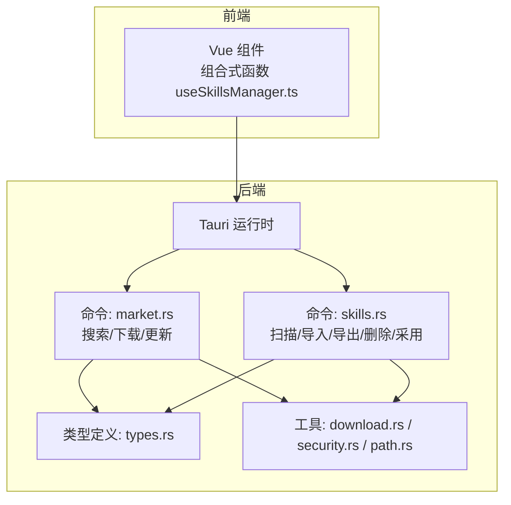
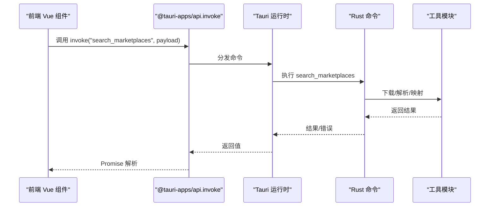
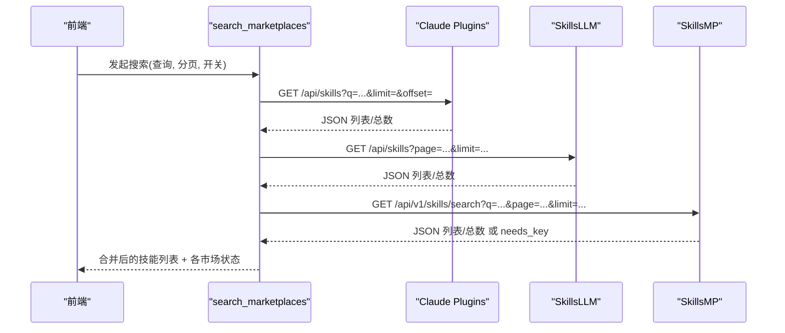
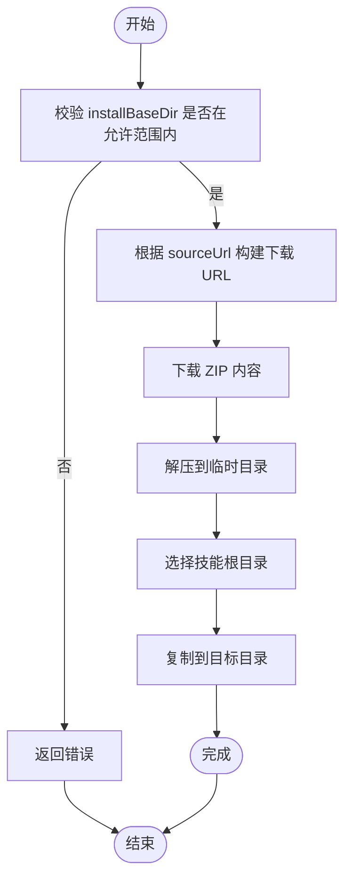
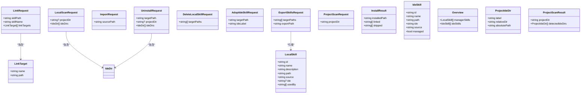
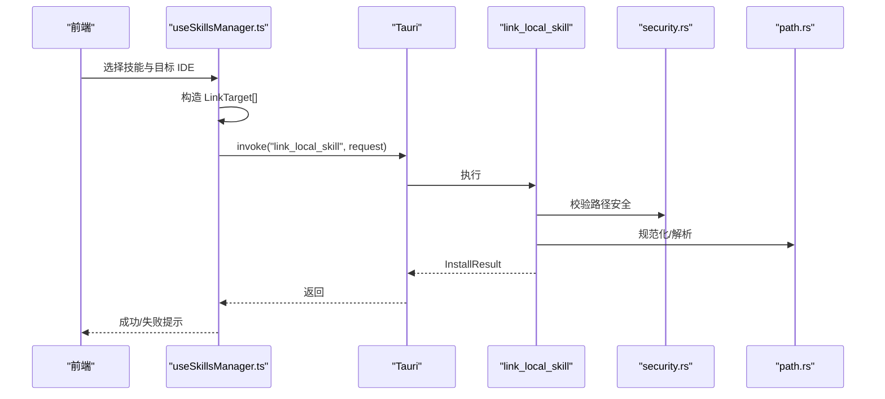

# API 参考

<cite>
**本文引用的文件**
- [src-tauri/src/commands/mod.rs](file://src-tauri/src/commands/mod.rs)
- [src-tauri/src/commands/market.rs](file://src-tauri/src/commands/market.rs)
- [src-tauri/src/commands/skills.rs](file://src-tauri/src/commands/skills.rs)
- [src-tauri/src/types.rs](file://src-tauri/src/types.rs)
- [src-tauri/src/lib.rs](file://src-tauri/src/lib.rs)
- [src-tauri/src/main.rs](file://src-tauri/src/main.rs)
- [src-tauri/src/utils/download.rs](file://src-tauri/src/utils/download.rs)
- [src-tauri/src/utils/security.rs](file://src-tauri/src/utils/security.rs)
- [src-tauri/src/utils/path.rs](file://src-tauri/src/utils/path.rs)
- [src-tauri/Cargo.toml](file://src-tauri/Cargo.toml)
- [src-tauri/tauri.conf.json](file://src-tauri/tauri.conf.json)
- [src/composables/useSkillsManager.ts](file://src/composables/useSkillsManager.ts)
- [src/composables/types.ts](file://src/composables/types.ts)
- [package.json](file://package.json)
- [README.md](file://README.md)
</cite>

## 目录
1. [简介](#简介)
2. [项目结构](#项目结构)
3. [核心组件](#核心组件)
4. [架构总览](#架构总览)
5. [详细组件分析](#详细组件分析)
6. [依赖关系分析](#依赖关系分析)
7. [性能考量](#性能考量)
8. [故障排查指南](#故障排查指南)
9. [结论](#结论)
10. [附录](#附录)

## 简介
本文件为 Skills Manager 的完整 API 参考文档，覆盖前端 Vue 组合式函数与后端 Rust Tauri 命令接口。内容包括：
- 市场搜索 API：聚合多来源技能市场，支持分页与排序
- 技能管理 API：本地仓库扫描、导入、导出、删除、采用（迁移）等
- IDE 集成 API：在 IDE 目录中创建/更新符号链接，安全路径校验
- 数据模型定义、接口版本与兼容性说明
- 错误处理策略、调用示例与最佳实践

## 项目结构
应用采用 Tauri 2 架构，前端使用 Vue 3 + TypeScript，后端 Rust 提供系统级命令与工具函数。

**图表来源**
- [src-tauri/src/lib.rs:20-53](file://src-tauri/src/lib.rs#L20-L53)
- [src-tauri/src/commands/mod.rs:1-3](file://src-tauri/src/commands/mod.rs#L1-L3)
- [src-tauri/src/commands/market.rs:173-442](file://src-tauri/src/commands/market.rs#L173-L442)
- [src-tauri/src/commands/skills.rs:355-847](file://src-tauri/src/commands/skills.rs#L355-L847)
- [src-tauri/src/types.rs:1-214](file://src-tauri/src/types.rs#L1-L214)
- [src-tauri/src/utils/download.rs:1-273](file://src-tauri/src/utils/download.rs#L1-L273)
- [src-tauri/src/utils/security.rs:1-92](file://src-tauri/src/utils/security.rs#L1-L92)
- [src-tauri/src/utils/path.rs:1-90](file://src-tauri/src/utils/path.rs#L1-L90)

**章节来源**
- [src-tauri/src/lib.rs:20-53](file://src-tauri/src/lib.rs#L20-L53)
- [src-tauri/src/commands/mod.rs:1-3](file://src-tauri/src/commands/mod.rs#L1-L3)
- [src-tauri/src/main.rs:1-7](file://src-tauri/src/main.rs#L1-L7)
- [src-tauri/Cargo.toml:1-36](file://src-tauri/Cargo.toml#L1-L36)
- [src-tauri/tauri.conf.json:1-45](file://src-tauri/tauri.conf.json#L1-L45)

## 核心组件
- 市场命令模块：提供跨市场搜索、下载与更新技能的能力
- 技能命令模块：提供本地仓库扫描、导入、导出、删除、采用与卸载能力
- 类型系统：统一前后端数据模型，保证序列化/反序列化一致性
- 工具模块：下载、安全路径校验、路径规范化与目录操作

**章节来源**
- [src-tauri/src/commands/market.rs:173-442](file://src-tauri/src/commands/market.rs#L173-L442)
- [src-tauri/src/commands/skills.rs:355-847](file://src-tauri/src/commands/skills.rs#L355-L847)
- [src-tauri/src/types.rs:1-214](file://src-tauri/src/types.rs#L1-L214)
- [src-tauri/src/utils/download.rs:1-273](file://src-tauri/src/utils/download.rs#L1-L273)
- [src-tauri/src/utils/security.rs:1-92](file://src-tauri/src/utils/security.rs#L1-L92)
- [src-tauri/src/utils/path.rs:1-90](file://src-tauri/src/utils/path.rs#L1-L90)

## 架构总览
前端通过 @tauri-apps/api 的 invoke 调用后端命令；后端命令在独立线程池中执行耗时任务，并通过工具模块完成网络下载、路径解析与安全校验。

**图表来源**
- [src/composables/useSkillsManager.ts:190-248](file://src/composables/useSkillsManager.ts#L190-L248)
- [src-tauri/src/lib.rs:27-39](file://src-tauri/src/lib.rs#L27-L39)
- [src-tauri/src/commands/market.rs:173-392](file://src-tauri/src/commands/market.rs#L173-L392)
- [src-tauri/src/utils/download.rs:27-48](file://src-tauri/src/utils/download.rs#L27-L48)

**章节来源**
- [src/composables/useSkillsManager.ts:190-248](file://src/composables/useSkillsManager.ts#L190-L248)
- [src-tauri/src/lib.rs:27-39](file://src-tauri/src/lib.rs#L27-L39)

## 详细组件分析

### 市场搜索 API
- 命令名：search_marketplaces
- 功能：聚合多个技能市场（Claude Plugins、SkillsLLM、SkillsMP）进行搜索，支持分页与启用状态控制
- 请求体字段
  - query: 查询字符串
  - limit: 每页数量（0 表示默认 20）
  - offset: 偏移量
  - apiKeys: 市场 API Key 映射（如需）
  - enabledMarkets: 各市场的启用开关映射
- 返回值
  - skills: 技能列表（含市场标识与标签）
  - total: 总数
  - limit/offset: 分页参数
  - marketStatuses: 各市场的连接状态（online/error/needs_key）
- 错误处理
  - 网络错误：记录具体错误消息
  - 解析失败：标记为 error 状态
  - 未启用市场：标记 online 状态
  - SkillsMP 需要有效 API Key：标记 needs_key 状态
- 兼容性
  - 不同市场的响应结构差异由解析器适配
  - 返回统一 RemoteSkillView 结构

**图表来源**
- [src-tauri/src/commands/market.rs:173-392](file://src-tauri/src/commands/market.rs#L173-L392)
- [src-tauri/src/utils/download.rs:27-48](file://src-tauri/src/utils/download.rs#L27-L48)

**章节来源**
- [src-tauri/src/commands/market.rs:173-392](file://src-tauri/src/commands/market.rs#L173-L392)
- [src-tauri/src/types.rs:23-77](file://src-tauri/src/types.rs#L23-L77)
- [src/composables/useSkillsManager.ts:190-248](file://src/composables/useSkillsManager.ts#L190-L248)

### 技能下载与更新 API
- 命令名：download_marketplace_skill / update_marketplace_skill
- 功能：从源码地址下载并安装技能到本地仓库；更新模式会覆盖已有目录
- 请求体字段
  - sourceUrl: 技能源码地址
  - skillName: 技能名称
  - installBaseDir: 安装基目录（必须位于允许范围）
- 返回值
  - installedPath: 实际安装路径
- 错误处理
  - 安装目录为空或越权：返回错误
  - GitHub 地址自动转换为 zipball 下载
  - 临时目录清理（RAII 保护）
  - 单文件大小与总大小限制，防 Zip Bomb 攻击
- 兼容性
  - 自动识别多层目录中的真实技能根
  - 跨平台路径规范化与安全校验

**图表来源**
- [src-tauri/src/commands/market.rs:394-442](file://src-tauri/src/commands/market.rs#L394-L442)
- [src-tauri/src/utils/download.rs:50-116](file://src-tauri/src/utils/download.rs#L50-L116)
- [src-tauri/src/utils/download.rs:143-183](file://src-tauri/src/utils/download.rs#L143-L183)
- [src-tauri/src/utils/path.rs:21-34](file://src-tauri/src/utils/path.rs#L21-L34)

**章节来源**
- [src-tauri/src/commands/market.rs:394-442](file://src-tauri/src/commands/market.rs#L394-L442)
- [src-tauri/src/utils/download.rs:50-116](file://src-tauri/src/utils/download.rs#L50-L116)
- [src-tauri/src/utils/download.rs:143-183](file://src-tauri/src/utils/download.rs#L143-L183)
- [src-tauri/src/utils/path.rs:21-34](file://src-tauri/src/utils/path.rs#L21-L34)

### 技能管理 API
- 命令名：scan_overview、import_local_skill、export_local_skills、delete_local_skills、adopt_ide_skill、uninstall_skill、link_local_skill、scan_project_ide_dirs
- 功能概览
  - scan_overview：扫描本地与 IDE 目录，汇总技能清单
  - import_local_skill：导入外部技能至本地仓库
  - export_local_skills：将本地技能打包为 ZIP
  - delete_local_skills：删除本地仓库中的技能（仅限受管目录）
  - adopt_ide_skill：将 IDE 中的技能迁移到本地仓库并回链
  - uninstall_skill：卸载 IDE 中的技能（删除符号链接或物理目录）
  - link_local_skill：在 IDE 目录创建符号链接（Windows 支持 Junction）
  - scan_project_ide_dirs：扫描项目内各 IDE 技能目录
- 关键请求/返回模型
  - LinkRequest/LinkTarget、LocalScanRequest、ImportRequest、ExportSkillsRequest、DeleteLocalSkillRequest、AdoptIdeSkillRequest、UninstallRequest、ProjectScanRequest
  - InstallResult、LocalSkill、IdeSkill、Overview、ProjectIdeDir、ProjectScanResult

**图表来源**
- [src-tauri/src/types.rs:79-214](file://src-tauri/src/types.rs#L79-L214)
- [src-tauri/src/commands/skills.rs:355-847](file://src-tauri/src/commands/skills.rs#L355-L847)

**章节来源**
- [src-tauri/src/commands/skills.rs:355-847](file://src-tauri/src/commands/skills.rs#L355-L847)
- [src-tauri/src/types.rs:79-214](file://src-tauri/src/types.rs#L79-L214)

### IDE 集成 API
- 路径安全与规范化
  - is_valid_ide_path/is_absolute_ide_path：校验相对/绝对路径是否安全
  - normalize_path/resolve_canonical：路径规范化与标准化
  - is_within_directory：防止 Zip Slip 攻击
- 符号链接与跨平台支持
  - Unix: symlink_dir
  - Windows: symlink_dir 或 mklink /J（Junction）
- 前端调用示例
  - 通过 useSkillsManager.ts 的 linkSkillInternal/linkSkillToProjectInternal 构造 LinkTarget 并调用 link_local_skill
  - adopt_ide_skill 将 IDE 技能迁移至本地仓库并回链

**图表来源**
- [src/composables/useSkillsManager.ts:376-398](file://src/composables/useSkillsManager.ts#L376-L398)
- [src-tauri/src/commands/skills.rs:355-449](file://src-tauri/src/commands/skills.rs#L355-L449)
- [src-tauri/src/utils/security.rs:63-70](file://src-tauri/src/utils/security.rs#L63-L70)
- [src-tauri/src/utils/path.rs:21-34](file://src-tauri/src/utils/path.rs#L21-L34)

**章节来源**
- [src/composables/useSkillsManager.ts:376-398](file://src/composables/useSkillsManager.ts#L376-L398)
- [src-tauri/src/commands/skills.rs:355-449](file://src-tauri/src/commands/skills.rs#L355-L449)
- [src-tauri/src/utils/security.rs:1-92](file://src-tauri/src/utils/security.rs#L1-L92)
- [src-tauri/src/utils/path.rs:1-90](file://src-tauri/src/utils/path.rs#L1-L90)

## 依赖关系分析
- 前端依赖
  - @tauri-apps/api：调用后端命令
  - @tauri-apps/plugin-*：对话框、打开器、进程、更新器等插件
- 后端依赖
  - tauri、serde、ureq、urlencoding、walkdir、zip、dirs 等
- 版本与构建
  - 应用版本与产品名在 tauri.conf.json 中定义
  - Cargo.toml 定义了库类型与依赖

**图表来源**
- [package.json:13-28](file://package.json#L13-L28)
- [src-tauri/Cargo.toml:20-36](file://src-tauri/Cargo.toml#L20-L36)
- [src-tauri/tauri.conf.json:1-45](file://src-tauri/tauri.conf.json#L1-L45)

**章节来源**
- [package.json:13-28](file://package.json#L13-L28)
- [src-tauri/Cargo.toml:20-36](file://src-tauri/Cargo.toml#L20-L36)
- [src-tauri/tauri.conf.json:1-45](file://src-tauri/tauri.conf.json#L1-L45)

## 性能考量
- 网络请求
  - 设置超时与重定向上限，避免长时间阻塞
  - 对下载内容大小进行上限控制，防止内存占用过高
- 解压与复制
  - 单文件大小限制与总大小限制，防范 Zip Bomb
  - 递归复制时跳过符号链接，确保安全性
- 前端缓存
  - 市场搜索结果按查询与 limit 缓存，提升翻页体验
- 并发与异步
  - 市场搜索在后台线程执行，避免阻塞 UI
  - 下载队列串行处理，减少磁盘争用与并发风险

**章节来源**
- [src-tauri/src/utils/download.rs:27-48](file://src-tauri/src/utils/download.rs#L27-L48)
- [src-tauri/src/utils/download.rs:143-183](file://src-tauri/src/utils/download.rs#L143-L183)
- [src/composables/useSkillsManager.ts:190-248](file://src/composables/useSkillsManager.ts#L190-L248)

## 故障排查指南
- 常见错误与定位
  - 安装目录越权：检查 installBaseDir 是否位于允许范围
  - 技能根未找到：确认源码仓库中存在 SKILL.md
  - 路径不安全：相对路径不得包含父目录或根目录组件
  - Zip Slip 攻击：解压时严格校验输出路径是否在目标目录内
  - Windows 权限问题：优先尝试符号链接，失败时回退到复制
- 前端提示
  - 使用 toast 组件展示成功/失败消息
  - 失败时提供可点击的“打开目录”辅助定位问题
- 后端日志
  - 市场连接错误会记录具体错误信息，便于诊断

**章节来源**
- [src-tauri/src/utils/security.rs:1-92](file://src-tauri/src/utils/security.rs#L1-L92)
- [src-tauri/src/utils/download.rs:143-183](file://src-tauri/src/utils/download.rs#L143-L183)
- [src/composables/useSkillsManager.ts:723-739](file://src/composables/useSkillsManager.ts#L723-L739)

## 结论
本 API 参考文档梳理了 Skills Manager 的核心接口与数据模型，明确了前后端交互方式、安全边界与性能策略。建议在集成时：
- 严格遵循路径安全规则与权限范围
- 使用提供的前端组合式函数封装调用流程
- 在生产环境关注网络与磁盘资源限制
- 通过市场状态反馈与错误日志快速定位问题

## 附录

### 接口一览与示例

- 市场搜索
  - 方法：invoke("search_marketplaces", { query, limit, offset, apiKeys, enabledMarkets })
  - 示例：参见 useSkillsManager.ts 中的 searchMarketplace
  - 返回：RemoteSkillsViewResponse（含 skills、total、limit、offset、marketStatuses）

- 下载/更新技能
  - 方法：invoke("download_marketplace_skill" 或 "update_marketplace_skill", { sourceUrl, skillName, installBaseDir })
  - 示例：参见 useSkillsManager.ts 中的 addToDownloadQueue/processQueue
  - 返回：DownloadResult（installedPath）

- 本地扫描与管理
  - 方法：invoke("scan_overview", { projectDir?, ideDirs })
  - 方法：invoke("import_local_skill", { sourcePath })
  - 方法：invoke("export_local_skills", { targetPaths, exportPath })
  - 方法：invoke("delete_local_skills", { targetPaths })
  - 方法：invoke("adopt_ide_skill", { targetPath, ideLabel })
  - 方法：invoke("uninstall_skill", { targetPath, projectDir?, ideDirs })
  - 方法：invoke("link_local_skill", { skillPath, skillName, linkTargets })
  - 方法：invoke("scan_project_ide_dirs", { projectDir })
  - 示例：参见 useSkillsManager.ts 中对应函数

- 数据模型要点
  - RemoteSkill/RemoteSkillView：技能元数据与市场标识
  - LocalSkill/IdeSkill：本地与 IDE 技能视图
  - Overview：综合技能概览
  - LinkRequest/LinkTarget：链接请求与目标
  - ExportSkillsRequest/DeleteLocalSkillRequest：导出/删除请求
  - ProjectIdeDir/ProjectScanResult：项目 IDE 目录扫描结果

**章节来源**
- [src/composables/useSkillsManager.ts:190-248](file://src/composables/useSkillsManager.ts#L190-L248)
- [src/composables/useSkillsManager.ts:263-342](file://src/composables/useSkillsManager.ts#L263-L342)
- [src/composables/useSkillsManager.ts:353-374](file://src/composables/useSkillsManager.ts#L353-L374)
- [src/composables/useSkillsManager.ts:633-684](file://src/composables/useSkillsManager.ts#L633-L684)
- [src/composables/useSkillsManager.ts:686-721](file://src/composables/useSkillsManager.ts#L686-L721)
- [src/composables/useSkillsManager.ts:741-793](file://src/composables/useSkillsManager.ts#L741-L793)
- [src/composables/types.ts:1-119](file://src/composables/types.ts#L1-L119)
- [src-tauri/src/types.rs:23-214](file://src-tauri/src/types.rs#L23-L214)

### 版本与兼容性
- 应用版本：0.3.22（前端与后端一致）
- 运行时：Tauri 2
- 平台：Windows/macOS/Linux
- 远程数据源：Claude Plugins、SkillsLLM、SkillsMP（部分需要 API Key）

**章节来源**
- [src-tauri/tauri.conf.json:3-4](file://src-tauri/tauri.conf.json#L3-L4)
- [src-tauri/Cargo.toml:3](file://src-tauri/Cargo.toml#L3)
- [README.md:88-93](file://README.md#L88-L93)