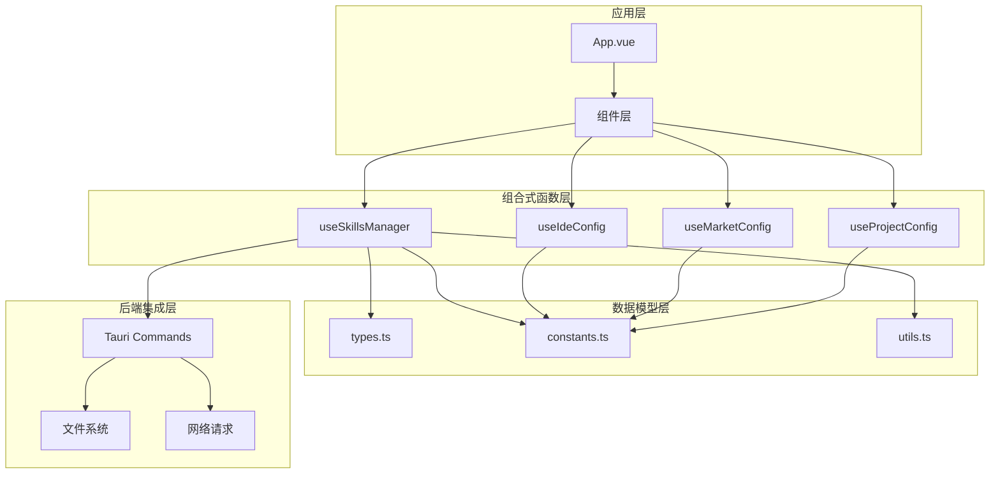
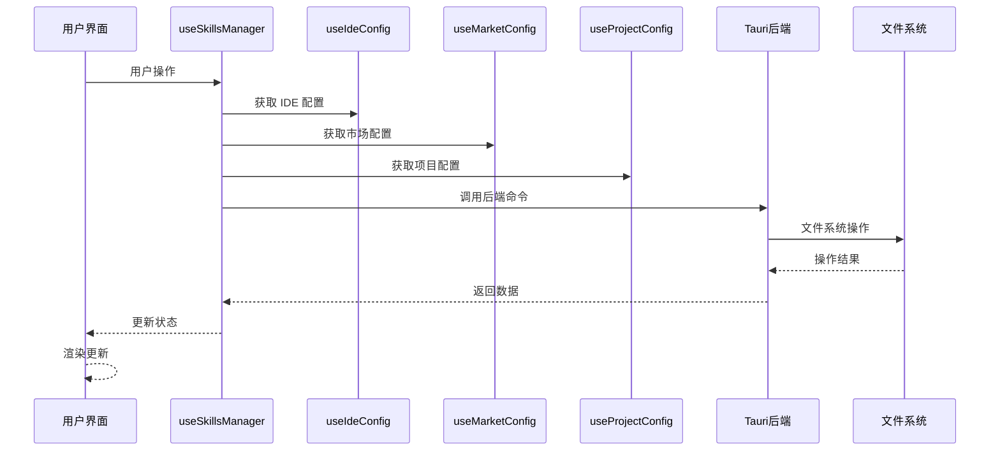
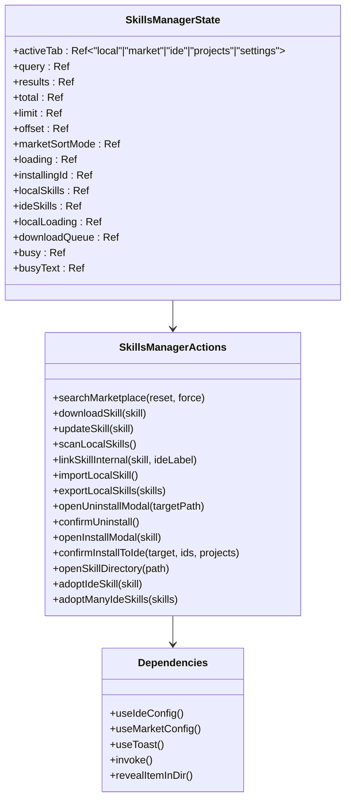
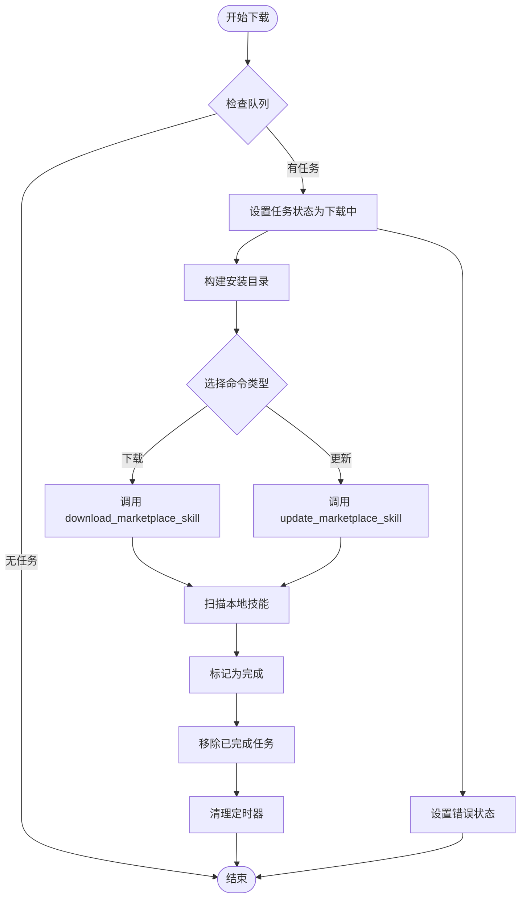
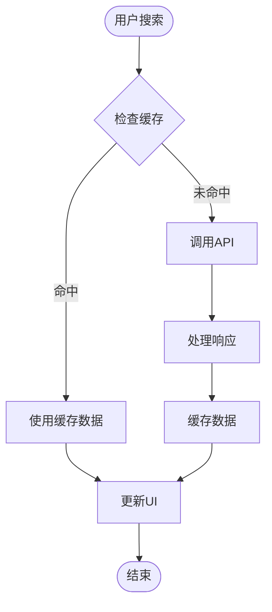
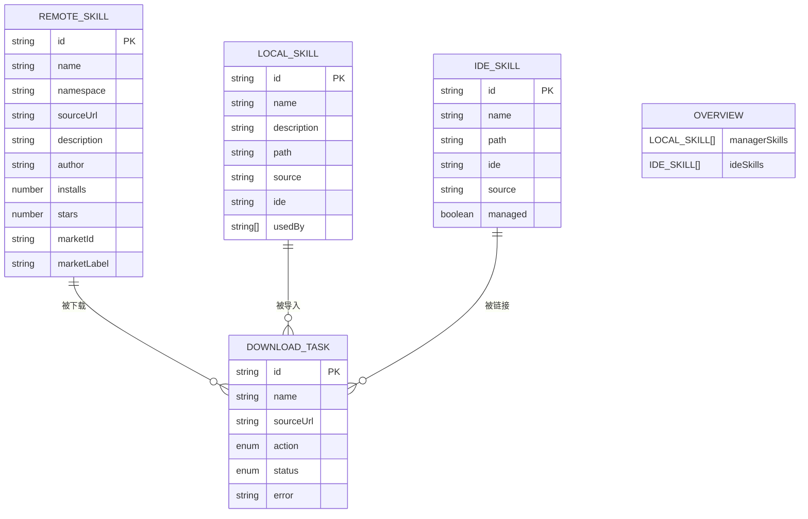
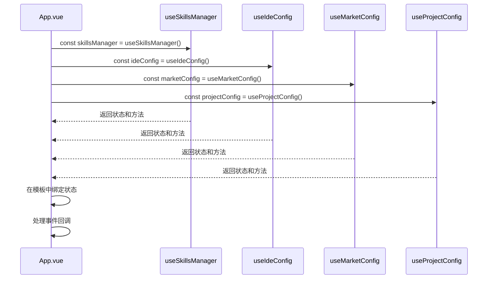
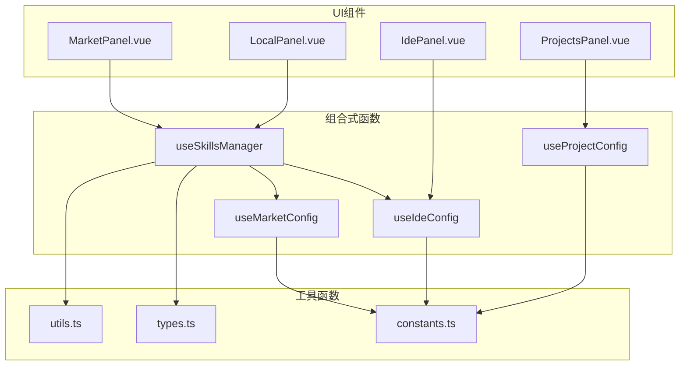

# 前端 API

<cite>
**本文档引用的文件**
- [useSkillsManager.ts](file://src/composables/useSkillsManager.ts)
- [useIdeConfig.ts](file://src/composables/useIdeConfig.ts)
- [useMarketConfig.ts](file://src/composables/useMarketConfig.ts)
- [useProjectConfig.ts](file://src/composables/useProjectConfig.ts)
- [types.ts](file://src/composables/types.ts)
- [constants.ts](file://src/composables/constants.ts)
- [utils.ts](file://src/composables/utils.ts)
- [App.vue](file://src/App.vue)
- [MarketPanel.vue](file://src/components/MarketPanel.vue)
- [LocalPanel.vue](file://src/components/LocalPanel.vue)
</cite>

## 目录
1. [简介](#简介)
2. [项目结构](#项目结构)
3. [核心组件](#核心组件)
4. [架构概览](#架构概览)
5. [详细组件分析](#详细组件分析)
6. [依赖关系分析](#依赖关系分析)
7. [性能考虑](#性能考虑)
8. [故障排除指南](#故障排除指南)
9. [结论](#结论)

## 简介

Skills Manager 是一个基于 Vue 3 和 Tauri 的技能管理系统，提供了完整的技能市场浏览、本地技能管理、IDE 集成和项目配置功能。本文档详细介绍了所有 Vue 组合式函数提供的公共 API，包括状态管理、配置管理和技能操作接口。

该系统采用模块化设计，通过组合式函数提供可复用的状态逻辑，支持多 IDE 平台（VSCode、Claude Code、Antigravity 等）和多市场平台（SkillsLLM、Claude Plugins、SkillsMP）的技能管理。

## 项目结构

项目采用清晰的分层架构，主要分为以下几个层次：

**图表来源**
- [App.vue:1-633](file://src/App.vue#L1-L633)
- [useSkillsManager.ts:1-867](file://src/composables/useSkillsManager.ts#L1-L867)
- [useIdeConfig.ts:1-131](file://src/composables/useIdeConfig.ts#L1-L131)
- [useMarketConfig.ts:1-67](file://src/composables/useMarketConfig.ts#L1-L67)
- [useProjectConfig.ts:1-128](file://src/composables/useProjectConfig.ts#L1-L128)

**章节来源**
- [App.vue:1-633](file://src/App.vue#L1-L633)
- [useSkillsManager.ts:1-867](file://src/composables/useSkillsManager.ts#L1-L867)

## 核心组件

### useSkillsManager 组合式函数

`useSkillsManager` 是整个应用的核心组合式函数，提供了完整的技能管理功能。它封装了以下主要能力：

#### 主要状态属性

| 状态属性 | 类型 | 描述 | 默认值 |
|---------|------|------|--------|
| `activeTab` | `"local" \| "market" \| "ide" \| "projects" \| "settings"` | 当前激活的标签页 | `"local"` |
| `query` | `string` | 技能搜索关键词 | `""` |
| `results` | `RemoteSkill[]` | 市场搜索结果 | `[]` |
| `total` | `number` | 搜索结果总数 | `0` |
| `limit` | `number` | 分页大小 | `20` |
| `offset` | `number` | 分页偏移量 | `0` |
| `marketSortMode` | `MarketSortMode` | 市场排序模式 | `"default"` |
| `loading` | `boolean` | 搜索加载状态 | `false` |
| `installingId` | `string \| null` | 正在安装的技能 ID | `null` |
| `localSkills` | `LocalSkill[]` | 本地技能列表 | `[]` |
| `ideSkills` | `IdeSkill[]` | IDE 中的技能列表 | `[]` |
| `localLoading` | `boolean` | 本地扫描状态 | `false` |
| `downloadQueue` | `DownloadTask[]` | 下载队列 | `[]` |
| `busy` | `boolean` | 繁忙状态 | `false` |
| `busyText` | `string` | 繁忙状态提示文本 | `""` |

#### 核心方法

##### 搜索和过滤方法
- `searchMarketplace(reset: boolean = true, force: boolean = false)` - 搜索技能市场
- `dedupeSkills(skills: RemoteSkill[])` - 去重技能列表
- `sortedResults` - 计算排序后的结果

##### 安装和更新方法
- `downloadSkill(skill: RemoteSkill)` - 下载技能
- `updateSkill(skill: RemoteSkill)` - 更新技能
- `addToDownloadQueue(skill: RemoteSkill, action: "download" \| "update")` - 添加到下载队列
- `processQueue()` - 处理下载队列
- `removeFromQueue(taskId: string)` - 从队列移除任务
- `retryDownload(taskId: string)` - 重试下载

##### 本地技能管理方法
- `scanLocalSkills()` - 扫描本地技能
- `linkSkillInternal(skill: LocalSkill, ideLabel: string, skipScan: boolean = false, suppressToast: boolean = false)` - 链接技能到 IDE
- `linkSkillToProjectInternal(skill: LocalSkill, projectPath: string, ideLabel: string, skipScan: boolean = false, suppressToast: boolean = false)` - 链接到项目
- `importLocalSkill()` - 导入本地技能
- `exportLocalSkills(skills: LocalSkill[])` - 导出技能

##### 卸载和删除方法
- `openUninstallModal(targetPath: string)` - 打开卸载模态框
- `openUninstallManyModal(paths: string[])` - 打开批量卸载模态框
- `openDeleteLocalModal(targets: LocalSkill[])` - 打开删除模态框
- `confirmUninstall()` - 确认卸载
- `cancelUninstall()` - 取消卸载

##### 项目集成方法
- `openInstallModal(skill: LocalSkill \| LocalSkill[])` - 打开安装模态框
- `updateInstallTargetIde(next: string[])` - 更新安装目标 IDE
- `confirmInstallToIde(installTarget: "ide" \| "project", targetIds: string[], projects?: ProjectConfig[])` - 确认安装到 IDE 或项目
- `buildProjectLinkTargets(projectPath: string, ideLabel: string)` - 构建项目链接目标

##### 工具方法
- `openSkillDirectory(path: string)` - 打开技能目录
- `adoptIdeSkill(skill: IdeSkill)` - 收养 IDE 技能
- `adoptManyIdeSkills(skills: IdeSkill[])` - 批量收养 IDE 技能
- `buildInstallBaseDir()` - 构建安装基础目录
- `buildExportDefaultName(skills: LocalSkill[])` - 构建导出默认名称

**章节来源**
- [useSkillsManager.ts:20-867](file://src/composables/useSkillsManager.ts#L20-L867)

### useIdeConfig 组合式函数

`useIdeConfig` 负责 IDE 配置管理，支持自定义 IDE 选项和安装目标记忆。

#### 状态属性
- `ideOptions` - IDE 选项列表
- `selectedIdeFilter` - 选中的 IDE 过滤器
- `customIdeName` - 自定义 IDE 名称
- `customIdeDir` - 自定义 IDE 目录
- `customIdeOptions` - 自定义 IDE 选项（计算属性）

#### 核心方法
- `refreshIdeOptions()` - 刷新 IDE 选项
- `addCustomIde(t: Function, onError: Function)` - 添加自定义 IDE
- `removeCustomIde(label: string)` - 删除自定义 IDE
- `loadLastInstallTargets()` - 加载最后安装目标
- `saveLastInstallTargets(labels: string[])` - 保存安装目标

**章节来源**
- [useIdeConfig.ts:59-131](file://src/composables/useIdeConfig.ts#L59-L131)

### useMarketConfig 组合式函数

`useMarketConfig` 管理市场配置，包括 API 密钥和启用状态。

#### 状态属性
- `marketConfigs` - 市场配置（API 密钥）
- `enabledMarkets` - 启用的市场
- `marketStatuses` - 市场连接状态

#### 核心方法
- `loadMarketConfigs()` - 加载市场配置
- `saveMarketConfigs(configs: Record<string, string>, enabled: Record<string, boolean>)` - 保存市场配置
- `updateMarketStatuses(statuses: MarketStatus[])` - 更新市场状态

**章节来源**
- [useMarketConfig.ts:8-67](file://src/composables/useMarketConfig.ts#L8-L67)

### useProjectConfig 组合式函数

`useProjectConfig` 管理项目配置，支持多项目技能链接。

#### 状态属性
- `projects` - 项目列表
- `selectedProjectId` - 选中的项目 ID

#### 核心方法
- `loadProjects()` - 加载项目
- `addProject(path: string, name: string, ideTargets: string[] = [])` - 添加项目
- `removeProject(projectId: string)` - 删除项目
- `updateProjectIdeTargets(projectId: string, ideTargets: string[])` - 更新项目 IDE 目标
- `updateDetectedIdeDirs(projectId: string, detectedIdeDirs: ProjectIdeDir[])` - 更新检测到的 IDE 目录
- `getProjectLinkTargets(project: ProjectConfig)` - 获取项目链接目标

**章节来源**
- [useProjectConfig.ts:32-128](file://src/composables/useProjectConfig.ts#L32-L128)

## 架构概览

系统采用响应式状态管理架构，通过组合式函数实现状态隔离和复用：

**图表来源**
- [useSkillsManager.ts:116-135](file://src/composables/useSkillsManager.ts#L116-L135)
- [App.vue:73-124](file://src/App.vue#L73-L124)

## 详细组件分析

### useSkillsManager 详细分析

#### 状态管理架构

**图表来源**
- [useSkillsManager.ts:20-867](file://src/composables/useSkillsManager.ts#L20-L867)

#### 下载队列处理流程

**图表来源**
- [useSkillsManager.ts:278-329](file://src/composables/useSkillsManager.ts#L278-L329)

#### 搜索缓存机制

系统实现了智能搜索缓存以提升性能：

**图表来源**
- [useSkillsManager.ts:190-248](file://src/composables/useSkillsManager.ts#L190-L248)

**章节来源**
- [useSkillsManager.ts:190-329](file://src/composables/useSkillsManager.ts#L190-L329)

### 数据模型分析

#### 技能类型定义

系统定义了完整的技能生态系统数据模型：

**图表来源**
- [types.ts:4-119](file://src/composables/types.ts#L4-L119)

**章节来源**
- [types.ts:1-119](file://src/composables/types.ts#L1-L119)

### 组件集成模式

#### 应用级集成

在应用主组件中，所有组合式函数通过解构赋值的方式集成：

**图表来源**
- [App.vue:73-124](file://src/App.vue#L73-L124)

**章节来源**
- [App.vue:73-124](file://src/App.vue#L73-L124)

## 依赖关系分析

### 组件间依赖关系

**图表来源**
- [MarketPanel.vue:1-192](file://src/components/MarketPanel.vue#L1-L192)
- [LocalPanel.vue:1-310](file://src/components/LocalPanel.vue#L1-L310)
- [useSkillsManager.ts:1-18](file://src/composables/useSkillsManager.ts#L1-L18)

### 外部依赖分析

系统依赖的主要外部库和插件：

| 依赖项 | 版本 | 用途 | 重要性 |
|-------|------|------|--------|
| vue | ^3.4.0 | 响应式框架 | 核心 |
| @tauri-apps/api | ^2.0.0 | Tauri 后端通信 | 核心 |
| @tauri-apps/plugin-opener | ^2.0.0 | 文件系统操作 | 重要 |
| @tauri-apps/plugin-dialog | ^2.0.0 | 对话框交互 | 重要 |
| vue-i18n | ^9.0.0 | 国际化支持 | 重要 |

**章节来源**
- [useSkillsManager.ts:1-18](file://src/composables/useSkillsManager.ts#L1-L18)
- [App.vue:1-25](file://src/App.vue#L1-L25)

## 性能考虑

### 缓存策略

系统实现了多层次的缓存机制：

1. **搜索结果缓存**：10分钟TTL，避免重复API调用
2. **去重算法**：基于源URL和技能ID的智能去重
3. **状态持久化**：IDE配置、市场配置、项目配置本地存储

### 异步处理优化

- **下载队列**：串行处理确保资源安全
- **批量操作**：支持批量安装、卸载、删除
- **防抖处理**：搜索输入防抖，减少API调用频率

### 内存管理

- **定时器清理**：自动清理过期的下载任务
- **状态重置**：组件卸载时清理定时器
- **对象池**：复用下载任务对象避免频繁创建

## 故障排除指南

### 常见问题及解决方案

#### 技能安装失败

**症状**：技能下载或安装过程中出现错误

**可能原因**：
1. 网络连接问题
2. 权限不足
3. 磁盘空间不足
4. 路径不安全验证失败

**解决步骤**：
1. 检查网络连接状态
2. 验证目标路径权限
3. 确保磁盘有足够的可用空间
4. 使用 `retryDownload` 方法重试

#### IDE 集成问题

**症状**：技能无法正确链接到 IDE

**可能原因**：
1. IDE 路径配置错误
2. IDE 未正确安装
3. 路径安全性验证失败

**解决步骤**：
1. 检查 IDE 配置是否正确
2. 验证 IDE 是否已安装
3. 使用 `isValidIdePath` 函数验证路径

#### 市场访问问题

**症状**：技能市场无法访问或显示错误状态

**可能原因**：
1. API 密钥缺失或无效
2. 市场服务不可用
3. 网络防火墙阻止

**解决步骤**：
1. 检查市场配置中的 API 密钥
2. 验证市场服务状态
3. 检查网络连接和防火墙设置

**章节来源**
- [utils.ts:34-99](file://src/composables/utils.ts#L34-L99)
- [useSkillsManager.ts:322-326](file://src/composables/useSkillsManager.ts#L322-L326)

## 结论

Skills Manager 的前端 API 设计体现了现代 Vue 3 应用的最佳实践：

### 设计优势

1. **模块化架构**：通过组合式函数实现关注点分离
2. **类型安全**：完整的 TypeScript 类型定义
3. **响应式设计**：充分利用 Vue 3 的响应式系统
4. **异步处理**：完善的异步操作和错误处理
5. **性能优化**：智能缓存和资源管理

### 最佳实践建议

1. **状态管理**：优先使用组合式函数而非全局状态
2. **错误处理**：始终包含适当的错误处理和用户反馈
3. **性能监控**：定期检查缓存命中率和内存使用情况
4. **用户体验**：提供清晰的加载状态和进度指示
5. **安全考虑**：严格验证用户输入和文件路径

该 API 为开发者提供了强大而灵活的技能管理能力，支持复杂的多 IDE 和多市场场景，是构建专业技能管理应用的优秀参考实现。