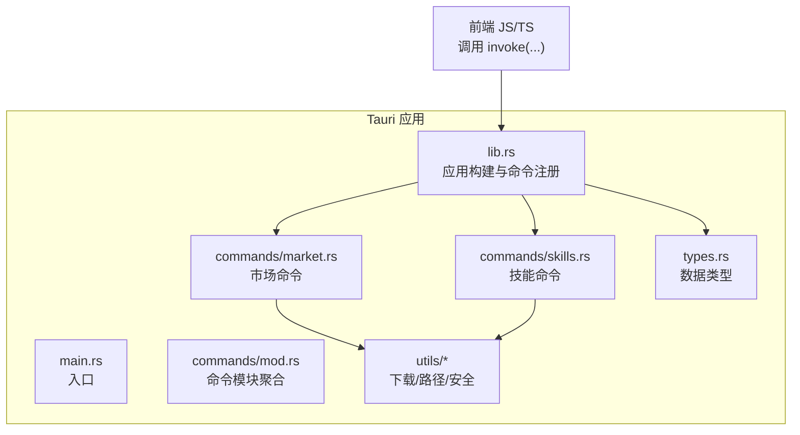
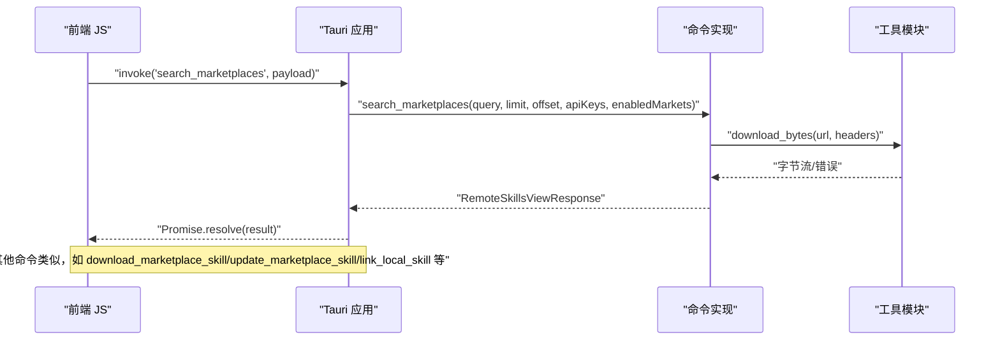
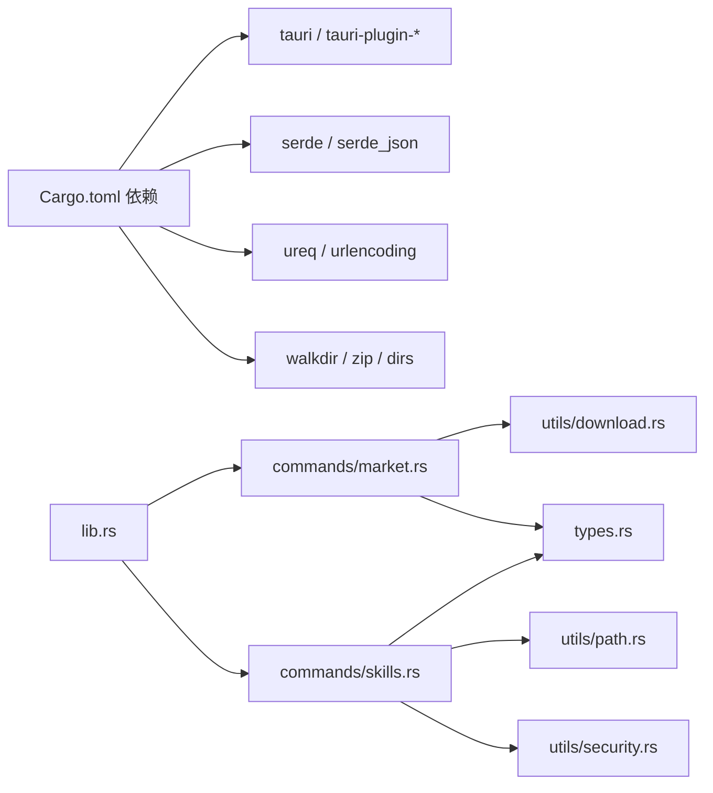

# 后端 API

<cite>
**本文引用的文件**
- [src-tauri/src/lib.rs](file://src-tauri/src/lib.rs)
- [src-tauri/src/main.rs](file://src-tauri/src/main.rs)
- [src-tauri/src/commands/mod.rs](file://src-tauri/src/commands/mod.rs)
- [src-tauri/src/commands/market.rs](file://src-tauri/src/commands/market.rs)
- [src-tauri/src/commands/skills.rs](file://src-tauri/src/commands/skills.rs)
- [src-tauri/src/types.rs](file://src-tauri/src/types.rs)
- [src-tauri/src/utils/mod.rs](file://src-tauri/src/utils/mod.rs)
- [src-tauri/src/utils/download.rs](file://src-tauri/src/utils/download.rs)
- [src-tauri/src/utils/path.rs](file://src-tauri/src/utils/path.rs)
- [src-tauri/src/utils/security.rs](file://src-tauri/src/utils/security.rs)
- [src-tauri/Cargo.toml](file://src-tauri/Cargo.toml)
- [src-tauri/tauri.conf.json](file://src-tauri/tauri.conf.json)
</cite>

## 目录
1. [简介](#简介)
2. [项目结构](#项目结构)
3. [核心组件](#核心组件)
4. [架构总览](#架构总览)
5. [详细组件分析](#详细组件分析)
6. [依赖关系分析](#依赖关系分析)
7. [性能与安全考量](#性能与安全考量)
8. [故障排查指南](#故障排查指南)
9. [结论](#结论)
10. [附录：调用示例与协议](#附录调用示例与协议)

## 简介
本文件为 Skills Manager 后端 Rust API 的完整接口文档，覆盖 Tauri 命令注册、市场相关命令（搜索、下载、更新）与技能管理命令（链接、扫描、卸载、导入、导出、托管、删除、项目 IDE 目录扫描）。文档详细说明每个命令的输入参数、输出结果、错误处理与调用方式，并补充参数校验、异步处理、安全策略与数据传输格式等技术细节。同时提供 Rust 代码路径与 JavaScript 调用示例，帮助前后端正确对接。

## 项目结构
后端以 Tauri 应用形式运行，Rust 侧通过命令注册暴露给前端调用；命令按功能拆分为“市场”和“技能”两个模块，类型定义集中在统一的类型模块中，工具模块提供下载、路径与安全相关能力。

图表来源
- [src-tauri/src/main.rs:1-7](file://src-tauri/src/main.rs#L1-L7)
- [src-tauri/src/lib.rs:20-53](file://src-tauri/src/lib.rs#L20-L53)
- [src-tauri/src/commands/mod.rs:1-3](file://src-tauri/src/commands/mod.rs#L1-L3)
- [src-tauri/src/commands/market.rs:173-392](file://src-tauri/src/commands/market.rs#L173-L392)
- [src-tauri/src/commands/skills.rs:355-846](file://src-tauri/src/commands/skills.rs#L355-L846)
- [src-tauri/src/types.rs:1-214](file://src-tauri/src/types.rs#L1-L214)
- [src-tauri/src/utils/mod.rs:1-4](file://src-tauri/src/utils/mod.rs#L1-L4)

章节来源
- [src-tauri/src/main.rs:1-7](file://src-tauri/src/main.rs#L1-L7)
- [src-tauri/src/lib.rs:20-53](file://src-tauri/src/lib.rs#L20-L53)
- [src-tauri/src/commands/mod.rs:1-3](file://src-tauri/src/commands/mod.rs#L1-L3)
- [src-tauri/src/types.rs:1-214](file://src-tauri/src/types.rs#L1-L214)

## 核心组件
- 命令注册与应用启动
  - 在应用构建阶段注册全部命令，统一由生成处理器分发到对应函数。
- 数据类型
  - 定义市场状态、远程技能、本地技能、IDE 技能、扫描结果、请求/响应结构体及枚举。
- 工具模块
  - 下载：HTTP 请求、限流、防 Zip Slip、防 Zip Bomb、临时目录清理。
  - 路径：规范化、标准化、Windows 前缀处理、安全命名。
  - 安全：相对/绝对路径合法性、WSL 路径识别、目录越权检查。

章节来源
- [src-tauri/src/lib.rs:20-53](file://src-tauri/src/lib.rs#L20-L53)
- [src-tauri/src/types.rs:1-214](file://src-tauri/src/types.rs#L1-L214)
- [src-tauri/src/utils/mod.rs:1-4](file://src-tauri/src/utils/mod.rs#L1-L4)

## 架构总览
下图展示命令注册、调用链路与关键数据流：

图表来源
- [src-tauri/src/lib.rs:27-39](file://src-tauri/src/lib.rs#L27-L39)
- [src-tauri/src/commands/market.rs:173-392](file://src-tauri/src/commands/market.rs#L173-L392)
- [src-tauri/src/commands/skills.rs:355-846](file://src-tauri/src/commands/skills.rs#L355-L846)
- [src-tauri/src/utils/download.rs:27-48](file://src-tauri/src/utils/download.rs#L27-L48)

## 详细组件分析

### 命令注册与生命周期
- 入口函数负责初始化插件、注册命令并启动应用。
- 注册的命令包括：市场搜索、下载、更新；技能链接、扫描概览、卸载、导入、删除、导出、托管、扫描项目 IDE 目录。

章节来源
- [src-tauri/src/main.rs:4-7](file://src-tauri/src/main.rs#L4-L7)
- [src-tauri/src/lib.rs:20-53](file://src-tauri/src/lib.rs#L20-L53)

### 市场相关命令

#### 命令：search_marketplaces
- 功能：跨多个市场源检索技能，支持分页与查询条件，返回统一视图与各市场的连接状态。
- 输入参数
  - query: 查询字符串（可空）
  - limit: 每页数量（0 表示默认值）
  - offset: 偏移量
  - api_keys: 市场 ID 到密钥的映射（用于需要鉴权的市场）
  - enabled_markets: 市场 ID 到启用状态的映射
- 输出结果
  - skills: 远程技能视图列表（含市场标识与标签）
  - total/limit/offset: 分页信息
  - market_statuses: 各市场的连接状态（在线/错误/需要密钥）
- 错误处理
  - 网络错误、解析失败、参数非法时返回错误字符串
  - 对不同市场采用独立状态记录，不影响其他市场结果
- 异步处理
  - 使用阻塞任务在后台线程执行网络请求与解析
- 参数验证
  - 传入的查询字符串会进行修剪与编码
  - limit 为 0 时使用默认值
- 调用方式
  - 前端通过 Tauri 的 invoke 发起同步调用，等待 Promise 解析

章节来源
- [src-tauri/src/commands/market.rs:173-392](file://src-tauri/src/commands/market.rs#L173-L392)

#### 命令：download_marketplace_skill
- 功能：从源地址下载并安装技能到指定目录。
- 输入参数
  - source_url: 技能源地址
  - skill_name: 技能名称（用于目标目录名）
  - install_base_dir: 安装基目录
- 输出结果
  - installed_path: 实际安装路径
- 错误处理
  - 安装目录为空、下载失败、解压异常、写入失败等均返回错误
- 异步处理
  - 使用阻塞任务执行下载与解压
- 参数验证
  - 安装目录必须位于允许范围（基于用户主目录下的固定根）
- 调用方式
  - invoke('download_marketplace_skill', request)

章节来源
- [src-tauri/src/commands/market.rs:394-441](file://src-tauri/src/commands/market.rs#L394-L441)
- [src-tauri/src/utils/download.rs:50-116](file://src-tauri/src/utils/download.rs#L50-L116)

#### 命令：update_marketplace_skill
- 功能：更新现有技能（覆盖模式）。
- 输入参数
  - 与下载相同，但要求 source_url 必须有效
- 输出结果
  - installed_path: 更新后的安装路径
- 错误处理
  - 缺少 source_url 时直接返回错误
- 调用方式
  - invoke('update_marketplace_skill', request)

章节来源
- [src-tauri/src/commands/market.rs:418-441](file://src-tauri/src/commands/market.rs#L418-L441)
- [src-tauri/src/utils/download.rs:50-116](file://src-tauri/src/utils/download.rs#L50-L116)

### 技能管理命令

#### 命令：link_local_skill
- 功能：将 Skills Manager 中的技能链接到一个或多个 IDE 目录。
- 输入参数
  - skill_path: 技能目录绝对路径
  - skill_name: 用于链接的目标名称
  - link_targets: 目标 IDE 目录集合（名称与路径）
- 输出结果
  - installed_path: 原始技能路径
  - linked: 成功链接的列表
  - skipped: 跳过的列表（原因）
- 错误处理
  - 技能路径不在允许范围内、目标路径越权、创建链接失败等
- 安全策略
  - Windows 平台优先尝试符号链接，失败则尝试目录硬链接（junction），并进行危险字符校验
- 调用方式
  - invoke('link_local_skill', request)

章节来源
- [src-tauri/src/commands/skills.rs:355-449](file://src-tauri/src/commands/skills.rs#L355-L449)
- [src-tauri/src/utils/path.rs:21-34](file://src-tauri/src/utils/path.rs#L21-L34)
- [src-tauri/src/utils/security.rs:63-70](file://src-tauri/src/utils/security.rs#L63-L70)

#### 命令：scan_overview
- 功能：扫描 Skills Manager 根目录与多个 IDE 目录，汇总本地与 IDE 中的技能，并标注相互链接关系。
- 输入参数
  - project_dir: 可选的项目根目录（用于同时扫描项目内的 IDE 技能）
  - ide_dirs: 自定义 IDE 目录列表（相对或绝对路径）
- 输出结果
  - manager_skills: 管理器中的本地技能列表
  - ide_skills: IDE 中的技能列表（含来源与是否被管理器托管）
- 错误处理
  - IDE 目录不合法、路径解析失败等
- 调用方式
  - invoke('scan_overview', request)

章节来源
- [src-tauri/src/commands/skills.rs:451-535](file://src-tauri/src/commands/skills.rs#L451-L535)
- [src-tauri/src/utils/security.rs:63-70](file://src-tauri/src/utils/security.rs#L63-L70)

#### 命令：uninstall_skill
- 功能：卸载指定技能（支持删除真实目录或解除链接）。
- 输入参数
  - target_path: 待卸载路径
  - project_dir: 可选项目根目录
  - ide_dirs: 可选自定义 IDE 目录
- 输出结果
  - 字符串提示（成功消息）
- 错误处理
  - 路径越权、不存在、非预期类型等
- 调用方式
  - invoke('uninstall_skill', request)

章节来源
- [src-tauri/src/commands/skills.rs:537-609](file://src-tauri/src/commands/skills.rs#L537-L609)
- [src-tauri/src/utils/security.rs:63-70](file://src-tauri/src/utils/security.rs#L63-L70)

#### 命令：import_local_skill
- 功能：将外部目录导入为管理器中的本地技能。
- 输入参数
  - source_path: 外部技能目录
- 输出结果
  - 成功消息
- 错误处理
  - 源目录不存在、缺少技能元文件等
- 调用方式
  - invoke('import_local_skill', request)

章节来源
- [src-tauri/src/commands/skills.rs:611-637](file://src-tauri/src/commands/skills.rs#L611-L637)

#### 命令：adopt_ide_skill
- 功能：将 IDE 中的技能迁移到管理器并重新链接回 IDE。
- 输入参数
  - target_path: IDE 中技能路径
  - ide_label: IDE 标签
- 输出结果
  - 成功消息（可能包含回退到本地拷贝的说明）
- 错误处理
  - 路径越权、目标不含技能元文件、链接失败等
- 调用方式
  - invoke('adopt_ide_skill', request)

章节来源
- [src-tauri/src/commands/skills.rs:639-725](file://src-tauri/src/commands/skills.rs#L639-L725)

#### 命令：delete_local_skills
- 功能：批量删除管理器中的本地技能。
- 输入参数
  - target_paths: 待删除技能路径数组
- 输出结果
  - 删除计数消息
- 错误处理
  - 路径越权、根目录保护、缺少元文件等
- 调用方式
  - invoke('delete_local_skills', request)

章节来源
- [src-tauri/src/commands/skills.rs:727-758](file://src-tauri/src/commands/skills.rs#L727-L758)

#### 命令：export_local_skills
- 功能：将多个管理器技能打包为 ZIP 文件。
- 输入参数
  - target_paths: 技能路径数组
  - export_path: 导出文件路径
- 输出结果
  - 导出文件路径
- 错误处理
  - 未提供路径、导出路径不合法、导出路径位于技能内部、写入失败等
- 安全策略
  - 拒绝导出包含符号链接的内容，防止路径穿越
- 调用方式
  - invoke('export_local_skills', request)

章节来源
- [src-tauri/src/commands/skills.rs:759-804](file://src-tauri/src/commands/skills.rs#L759-L804)
- [src-tauri/src/utils/download.rs:185-210](file://src-tauri/src/utils/download.rs#L185-L210)

#### 命令：scan_project_ide_dirs
- 功能：扫描项目根目录下预置的常见 IDE 技能目录，返回检测到的 IDE 目录集合。
- 输入参数
  - project_dir: 项目根目录
- 输出结果
  - project_dir: 原始项目目录
  - detected_ide_dirs: 检测到的 IDE 目录（标签、相对路径、绝对路径）
- 调用方式
  - invoke('scan_project_ide_dirs', request)

章节来源
- [src-tauri/src/commands/skills.rs:806-846](file://src-tauri/src/commands/skills.rs#L806-L846)

### 数据模型与序列化
以下为关键数据结构的字段说明（驼峰命名）：
- MarketStatusType: online/error/needs_key
- RemoteSkill: id/name/namespace/sourceUrl/description/author/installs/stars
- RemoteSkillsResponse: skills/total/limit/offset
- RemoteSkillView: 在 RemoteSkill 基础上增加 marketId/marketLabel
- RemoteSkillsViewResponse: skills/total/limit/offset/marketStatuses
- LinkTarget: name/path
- InstallResult: installedPath/linked/skipped
- DownloadRequest: sourceUrl/skillName/installBaseDir
- DownloadResult: installedPath
- LocalSkill: id/name/description/path/source/ide/usedBy
- IdeSkill: id/name/path/ide/source/managed
- Overview: managerSkills/ideSkills
- UninstallRequest: targetPath/projectDir/ideDirs
- IdeDir: label/relativeDir
- ImportRequest: sourcePath
- DeleteLocalSkillRequest: targetPaths
- ExportSkillsRequest: targetPaths/exportPath
- AdoptIdeSkillRequest: targetPath/ideLabel
- ProjectScanRequest: projectDir
- ProjectIdeDir: label/relativeDir/absolutePath
- ProjectScanResult: projectDir/detectedIdeDirs

章节来源
- [src-tauri/src/types.rs:4-214](file://src-tauri/src/types.rs#L4-L214)

## 依赖关系分析

图表来源
- [src-tauri/Cargo.toml:20-36](file://src-tauri/Cargo.toml#L20-L36)
- [src-tauri/src/lib.rs:6-18](file://src-tauri/src/lib.rs#L6-L18)
- [src-tauri/src/commands/market.rs:1-8](file://src-tauri/src/commands/market.rs#L1-L8)
- [src-tauri/src/commands/skills.rs:1-16](file://src-tauri/src/commands/skills.rs#L1-L16)
- [src-tauri/src/utils/mod.rs:1-4](file://src-tauri/src/utils/mod.rs#L1-L4)

章节来源
- [src-tauri/Cargo.toml:20-36](file://src-tauri/Cargo.toml#L20-L36)
- [src-tauri/src/lib.rs:6-18](file://src-tauri/src/lib.rs#L6-L18)

## 性能与安全考量
- 异步与阻塞
  - 市场命令与下载命令通过后台线程执行网络与文件操作，避免阻塞主线程。
- 下载防护
  - 限制单次下载最大体积，防止内存占用过高；对 ZIP 内容进行目录越权检测与单文件大小限制，防范 Zip Slip 与 Zip Bomb。
- 路径与权限
  - 统一路径规范化与标准化，Windows 前缀剥离；严格校验相对/绝对路径合法性；限制安装与导出目录范围。
- 安全链接
  - Windows 平台优先符号链接，失败回退硬链接；对危险字符进行校验；对 IDE 路径进行越权检查。
- 插件与 CSP
  - 应用配置了必要的插件与内容安全策略，限制脚本与资源加载来源。

章节来源
- [src-tauri/src/commands/market.rs:181-391](file://src-tauri/src/commands/market.rs#L181-L391)
- [src-tauri/src/utils/download.rs:27-48](file://src-tauri/src/utils/download.rs#L27-L48)
- [src-tauri/src/utils/download.rs:143-183](file://src-tauri/src/utils/download.rs#L143-L183)
- [src-tauri/src/utils/path.rs:21-34](file://src-tauri/src/utils/path.rs#L21-L34)
- [src-tauri/src/utils/security.rs:3-19](file://src-tauri/src/utils/security.rs#L3-L19)
- [src-tauri/tauri.conf.json:20-22](file://src-tauri/tauri.conf.json#L20-L22)

## 故障排查指南
- 常见错误类型
  - “安装目录不在允许范围内”：检查 install_base_dir 是否位于用户主目录下的固定根路径内。
  - “目标目录已存在，请更换名称或先清理”：下载时目标目录已存在且未开启覆盖。
  - “无法获取用户目录”：系统环境变量缺失或权限不足。
  - “Zip Slip 攻击检测”：ZIP 包含越权写入路径，拒绝解压。
  - “导出路径不能在所选技能目录内部”：导出路径不得位于任一被选技能目录之下。
  - “仅 Skills Manager 本地技能可以导出/删除”：传入路径不属于管理器根。
  - “目标路径越权”：卸载/导入/托管等操作的目标路径不在允许范围内。
- 排查步骤
  - 核对输入参数（路径、名称、密钥、启用状态）。
  - 查看网络请求日志与返回状态（市场命令）。
  - 检查系统权限与磁盘空间。
  - 使用最小复现场景（单一命令、简单路径）定位问题。

章节来源
- [src-tauri/src/utils/download.rs:57-61](file://src-tauri/src/utils/download.rs#L57-L61)
- [src-tauri/src/utils/download.rs:158-164](file://src-tauri/src/utils/download.rs#L158-L164)
- [src-tauri/src/commands/skills.rs:759-785](file://src-tauri/src/commands/skills.rs#L759-L785)
- [src-tauri/src/commands/skills.rs:727-758](file://src-tauri/src/commands/skills.rs#L727-L758)
- [src-tauri/src/commands/skills.rs:537-595](file://src-tauri/src/commands/skills.rs#L537-L595)

## 结论
本后端 API 提供了完整的市场检索与技能管理能力，通过严格的参数校验、安全策略与异步处理保障稳定性与安全性。建议在前端侧统一封装调用流程，集中处理错误与进度反馈，并在生产环境中结合应用签名与内容安全策略进一步加固。

## 附录：调用示例与协议

### 前后端交互协议
- 调用方式
  - 前端使用 Tauri 的 invoke 方法发起命令调用，等待 Promise 解析。
- 数据传输格式
  - 所有请求/响应结构体采用驼峰命名并通过 JSON 序列化传输。
- 错误约定
  - 后端返回字符串错误信息；前端应捕获并提示用户或重试。

### 市场命令调用示例（JavaScript）
- 搜索市场
  - invoke('search_marketplaces', { query, limit, offset, apiKeys, enabledMarkets })
  - 返回 RemoteSkillsViewResponse
- 下载技能
  - invoke('download_marketplace_skill', { sourceUrl, skillName, installBaseDir })
  - 返回 DownloadResult
- 更新技能
  - invoke('update_marketplace_skill', { sourceUrl, skillName, installBaseDir })
  - 返回 DownloadResult

章节来源
- [src-tauri/src/lib.rs:27-39](file://src-tauri/src/lib.rs#L27-L39)
- [src-tauri/src/types.rs:36-77](file://src-tauri/src/types.rs#L36-L77)
- [src-tauri/src/types.rs:96-106](file://src-tauri/src/types.rs#L96-L106)

### 技能管理命令调用示例（JavaScript）
- 链接技能
  - invoke('link_local_skill', { skillPath, skillName, linkTargets })
  - 返回 InstallResult
- 扫描概览
  - invoke('scan_overview', { projectDir, ideDirs })
  - 返回 Overview
- 卸载技能
  - invoke('uninstall_skill', { targetPath, projectDir, ideDirs })
  - 返回字符串提示
- 导入技能
  - invoke('import_local_skill', { sourcePath })
  - 返回字符串提示
- 托管 IDE 技能
  - invoke('adopt_ide_skill', { targetPath, ideLabel })
  - 返回字符串提示
- 删除本地技能
  - invoke('delete_local_skills', { targetPaths })
  - 返回字符串提示
- 导出技能
  - invoke('export_local_skills', { targetPaths, exportPath })
  - 返回导出文件路径
- 扫描项目 IDE 目录
  - invoke('scan_project_ide_dirs', { projectDir })
  - 返回 ProjectScanResult

章节来源
- [src-tauri/src/lib.rs:27-39](file://src-tauri/src/lib.rs#L27-L39)
- [src-tauri/src/types.rs:116-185](file://src-tauri/src/types.rs#L116-L185)
- [src-tauri/src/types.rs:200-214](file://src-tauri/src/types.rs#L200-L214)