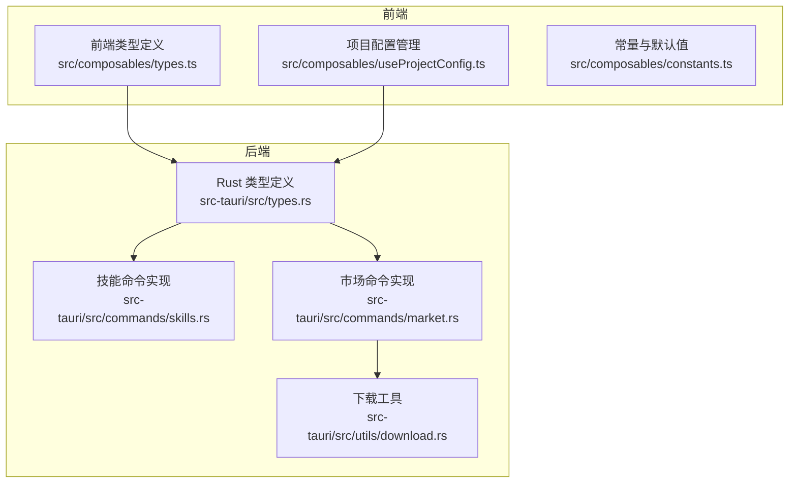
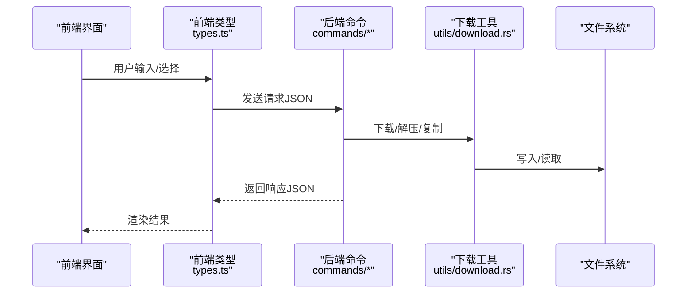
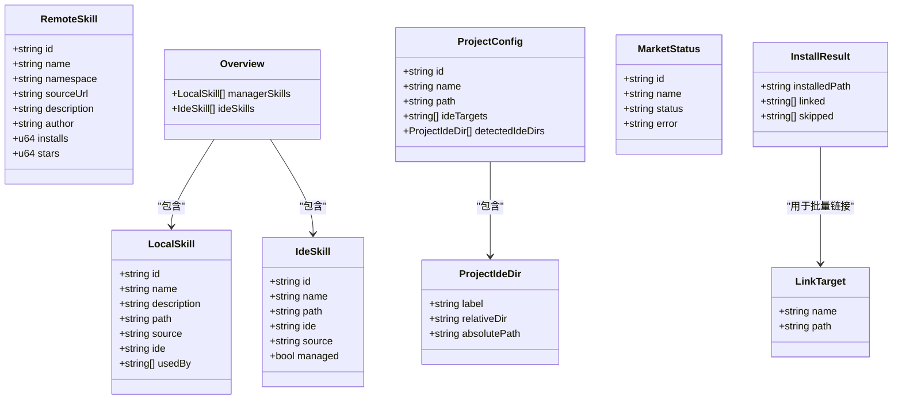
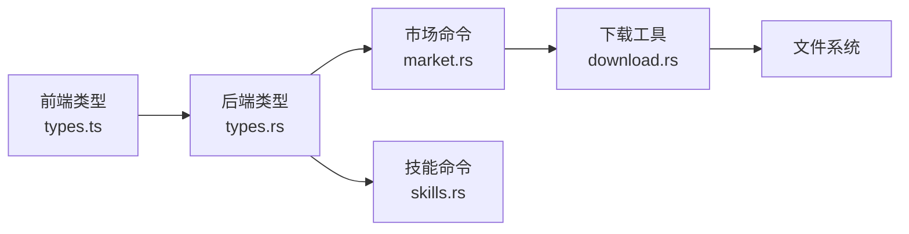

# 数据模型

<cite>
**本文档引用的文件**
- [src/composables/types.ts](file://src/composables/types.ts)
- [src/composables/useProjectConfig.ts](file://src/composables/useProjectConfig.ts)
- [src/composables/constants.ts](file://src/composables/constants.ts)
- [src-tauri/src/types.rs](file://src-tauri/src/types.rs)
- [src-tauri/src/commands/skills.rs](file://src-tauri/src/commands/skills.rs)
- [src-tauri/src/commands/market.rs](file://src-tauri/src/commands/market.rs)
- [src-tauri/src/utils/download.rs](file://src-tauri/src/utils/download.rs)
- [src-tauri/Cargo.toml](file://src-tauri/Cargo.toml)
</cite>

## 目录
1. [简介](#简介)
2. [项目结构](#项目结构)
3. [核心组件](#核心组件)
4. [架构总览](#架构总览)
5. [详细组件分析](#详细组件分析)
6. [依赖关系分析](#依赖关系分析)
7. [性能考量](#性能考量)
8. [故障排查指南](#故障排查指南)
9. [结论](#结论)
10. [附录](#附录)

## 简介
本文件系统性梳理 Skills Manager 的数据模型，覆盖前端 TypeScript 类型与后端 Rust 结构体，重点说明 RemoteSkill、LocalSkill、IdeSkill、Overview、ProjectConfig 等核心数据结构的字段语义、数据类型、约束条件与使用场景。同时给出跨语言序列化格式、版本兼容性说明、数据流转示例与最佳实践建议，帮助开发者在前端与后端之间建立一致的数据契约。

## 项目结构
数据模型主要分布在以下位置：
- 前端组合式函数与类型：src/composables/types.ts、src/composables/useProjectConfig.ts、src/composables/constants.ts
- 后端 Rust 类型与命令：src-tauri/src/types.rs、src-tauri/src/commands/skills.rs、src-tauri/src/commands/market.rs、src-tauri/src/utils/download.rs
- 依赖与版本信息：src-tauri/Cargo.toml

图表来源
- [src/composables/types.ts:1-119](file://src/composables/types.ts#L1-L119)
- [src/composables/useProjectConfig.ts:1-128](file://src/composables/useProjectConfig.ts#L1-L128)
- [src/composables/constants.ts:1-72](file://src/composables/constants.ts#L1-L72)
- [src-tauri/src/types.rs:1-214](file://src-tauri/src/types.rs#L1-L214)
- [src-tauri/src/commands/skills.rs:1-847](file://src-tauri/src/commands/skills.rs#L1-L847)
- [src-tauri/src/commands/market.rs:1-442](file://src-tauri/src/commands/market.rs#L1-L442)
- [src-tauri/src/utils/download.rs:1-273](file://src-tauri/src/utils/download.rs#L1-L273)

章节来源
- [src/composables/types.ts:1-119](file://src/composables/types.ts#L1-L119)
- [src/composables/useProjectConfig.ts:1-128](file://src/composables/useProjectConfig.ts#L1-L128)
- [src/composables/constants.ts:1-72](file://src/composables/constants.ts#L1-L72)
- [src-tauri/src/types.rs:1-214](file://src-tauri/src/types.rs#L1-L214)
- [src-tauri/src/commands/skills.rs:1-847](file://src-tauri/src/commands/skills.rs#L1-L847)
- [src-tauri/src/commands/market.rs:1-442](file://src-tauri/src/commands/market.rs#L1-L442)
- [src-tauri/src/utils/download.rs:1-273](file://src-tauri/src/utils/download.rs#L1-L273)

## 核心组件
本节对核心数据模型进行逐项说明，包括字段含义、类型、约束与典型用法。

- RemoteSkill（远程市场技能）
  - 字段与类型
    - id: 字符串，唯一标识
    - name: 字符串，显示名称
    - namespace: 字符串，命名空间
    - sourceUrl: 字符串，源码地址
    - description: 字符串，描述
    - author: 字符串，作者
    - installs: 整数（u64），安装次数
    - stars: 整数（u64），星标数量
  - 约束与语义
    - 用于展示市场中的技能条目，支持排序与搜索
    - installs/stars 用于热度与质量指标
  - 使用场景
    - 市场搜索结果、技能详情页
  - 序列化
    - 前端：字段名采用 camelCase
    - 后端：字段名采用 snake_case（通过 serde 转换）

- LocalSkill（本地受管技能）
  - 字段与类型
    - id: 字符串，路径字符串
    - name: 字符串
    - description: 字符串
    - path: 字符串，技能目录绝对路径
    - source: 字符串，来源标识（如 manager、local、link）
    - ide: 可选字符串，关联 IDE 标签
    - usedBy: 字符串数组，被哪些 IDE 标签所引用
  - 约束与语义
    - 仅限 Skills Manager 管理的技能目录
    - usedBy 记录跨 IDE 的共享使用关系
  - 使用场景
    - 本地扫描结果、概览视图
  - 序列化
    - 前端：字段名 camelCase
    - 后端：字段名 camelCase

- IdeSkill（IDE 中的技能）
  - 字段与类型
    - id: 字符串，路径字符串
    - name: 字符串
    - path: 字符串，技能目录绝对路径
    - ide: 字符串，IDE 标签
    - source: 字符串，来源（local/link）
    - managed: 布尔，是否由 Skills Manager 管理
  - 约束与语义
    - managed=true 表示该技能已被 Skills Manager 迁移管理
  - 使用场景
    - IDE 目录扫描、概览视图
  - 序列化
    - 前端：字段名 camelCase
    - 后端：字段名 camelCase

- Overview（技能概览）
  - 字段与类型
    - managerSkills: LocalSkill 数组
    - ideSkills: IdeSkill 数组
  - 使用场景
    - 综合展示本地与 IDE 中的技能状态
  - 序列化
    - 前端：字段名 camelCase
    - 后端：字段名 camelCase

- ProjectConfig（项目配置）
  - 字段与类型
    - id: 字符串，项目唯一标识
    - name: 字符串，项目名称
    - path: 字符串，项目根路径
    - ideTargets: 字符串数组，项目级 IDE 目标标签
    - detectedIdeDirs: ProjectIdeDir 数组，检测到的 IDE 目录
  - 约束与语义
    - ideTargets 决定链接目标；detectedIdeDirs 由扫描结果填充
  - 使用场景
    - 项目面板、IDE 目录映射
  - 序列化
    - 前端：字段名 camelCase，存储于 localStorage
    - 后端：字段名 camelCase（用于请求/响应）

- ProjectIdeDir（项目级 IDE 目录）
  - 字段与类型
    - label: 字符串，IDE 标签
    - relativeDir: 字符串，相对路径
    - absolutePath: 字符串，绝对路径
  - 使用场景
    - 项目扫描结果、链接目标生成
  - 序列化
    - 前端：字段名 camelCase
    - 后端：字段名 camelCase

- MarketStatus（市场连接状态）
  - 字段与类型
    - id: 字符串，市场标识
    - name: 字符串，市场名称
    - status: 枚举（online/error/needs_key）
    - error: 可选字符串，错误信息
  - 使用场景
    - 展示各市场的可用性与错误原因
  - 序列化
    - 前端：字段名 camelCase
    - 后端：枚举转 snake_case，再在显示时转换为字符串

- LinkTarget（链接目标）
  - 字段与类型
    - name: 字符串，目标名称
    - path: 字符串，目标路径
  - 使用场景
    - 批量链接本地技能到多个 IDE 目录
  - 序列化
    - 前端：字段名 camelCase
    - 后端：字段名 camelCase

- InstallResult（安装结果）
  - 字段与类型
    - installedPath: 字符串，安装路径
    - linked: 字符串数组，成功链接的目标
    - skipped: 字符串数组，跳过的原因
  - 使用场景
    - 安装/更新后的反馈
  - 序列化
    - 前端：字段名 camelCase
    - 后端：字段名 camelCase

章节来源
- [src/composables/types.ts:4-119](file://src/composables/types.ts#L4-L119)
- [src/composables/useProjectConfig.ts:5-128](file://src/composables/useProjectConfig.ts#L5-L128)
- [src/composables/constants.ts:6-72](file://src/composables/constants.ts#L6-L72)
- [src-tauri/src/types.rs:23-214](file://src-tauri/src/types.rs#L23-L214)

## 架构总览
下图展示了从前端类型到后端命令的数据流，以及序列化/反序列化的对应关系。

图表来源
- [src/composables/types.ts:1-119](file://src/composables/types.ts#L1-L119)
- [src-tauri/src/commands/market.rs:173-442](file://src-tauri/src/commands/market.rs#L173-L442)
- [src-tauri/src/commands/skills.rs:355-847](file://src-tauri/src/commands/skills.rs#L355-L847)
- [src-tauri/src/utils/download.rs:50-273](file://src-tauri/src/utils/download.rs#L50-L273)

## 详细组件分析

### RemoteSkill 数据模型
- 字段与类型
  - id: 字符串
  - name: 字符串
  - namespace: 字符串
  - sourceUrl: 字符串
  - description: 字符串
  - author: 字符串
  - installs: 整数（u64）
  - stars: 整数（u64）
- 约束与语义
  - installs/stars 用于排序与筛选
  - sourceUrl 用于下载与更新
- 序列化
  - 前端：camelCase
  - 后端：camelCase（通过 serde 转换）
- 使用场景
  - 市场搜索、详情展示、排序与过滤

章节来源
- [src/composables/types.ts:4-15](file://src/composables/types.ts#L4-L15)
- [src-tauri/src/types.rs:23-43](file://src-tauri/src/types.rs#L23-L43)

### LocalSkill 数据模型
- 字段与类型
  - id: 字符串（路径）
  - name: 字符串
  - description: 字符串
  - path: 字符串（绝对路径）
  - source: 字符串（manager/local/link）
  - ide: 可选字符串
  - usedBy: 字符串数组
- 约束与语义
  - 仅限 Skills Manager 管理的技能目录
  - usedBy 记录跨 IDE 的共享关系
- 序列化
  - 前端：camelCase
  - 后端：camelCase
- 使用场景
  - 本地扫描、概览、导入/导出

章节来源
- [src/composables/types.ts:39-47](file://src/composables/types.ts#L39-L47)
- [src-tauri/src/types.rs:118-126](file://src-tauri/src/types.rs#L118-L126)

### IdeSkill 数据模型
- 字段与类型
  - id: 字符串（路径）
  - name: 字符串
  - path: 字符串（绝对路径）
  - ide: 字符串（IDE 标签）
  - source: 字符串（local/link）
  - managed: 布尔
- 约束与语义
  - managed=true 表示已被迁移至 Skills Manager 管理
- 序列化
  - 前端：camelCase
  - 后端：camelCase
- 使用场景
  - IDE 目录扫描、概览对比

章节来源
- [src/composables/types.ts:52-59](file://src/composables/types.ts#L52-L59)
- [src-tauri/src/types.rs:137-144](file://src-tauri/src/types.rs#L137-L144)

### Overview 数据模型
- 字段与类型
  - managerSkills: LocalSkill[]
  - ideSkills: IdeSkill[]
- 使用场景
  - 综合视图展示本地与 IDE 技能状态

章节来源
- [src/composables/types.ts:64-67](file://src/composables/types.ts#L64-L67)
- [src-tauri/src/types.rs:148-151](file://src-tauri/src/types.rs#L148-L151)

### ProjectConfig 数据模型
- 字段与类型
  - id: 字符串
  - name: 字符串
  - path: 字符串
  - ideTargets: 字符串[]
  - detectedIdeDirs: ProjectIdeDir[]
- 约束与语义
  - ideTargets 决定链接目标；detectedIdeDirs 由扫描填充
- 存储与校验
  - 前端使用 localStorage 存储，带基本校验过滤
- 使用场景
  - 项目面板、IDE 目录映射、链接目标生成

章节来源
- [src/composables/types.ts:112-119](file://src/composables/types.ts#L112-L119)
- [src/composables/useProjectConfig.ts:5-128](file://src/composables/useProjectConfig.ts#L5-L128)
- [src/composables/constants.ts:58-71](file://src/composables/constants.ts#L58-L71)

### MarketStatus 数据模型
- 字段与类型
  - id: 字符串
  - name: 字符串
  - status: 枚举（online/error/needs_key）
  - error: 可选字符串
- 序列化
  - 前端：camelCase
  - 后端：枚举 snake_case，显示时转为字符串
- 使用场景
  - 市场可用性状态展示

章节来源
- [src/composables/types.ts:20-25](file://src/composables/types.ts#L20-L25)
- [src-tauri/src/types.rs:4-21](file://src-tauri/src/types.rs#L4-L21)

### LinkTarget 与 InstallResult
- LinkTarget
  - name: 字符串
  - path: 字符串
- InstallResult
  - installedPath: 字符串
  - linked: 字符串[]
  - skipped: 字符串[]
- 使用场景
  - 批量链接、安装结果反馈

章节来源
- [src/composables/types.ts:81-96](file://src/composables/types.ts#L81-L96)
- [src-tauri/src/types.rs:79-92](file://src-tauri/src/types.rs#L79-L92)

### 数据模型关系图

图表来源
- [src/composables/types.ts:4-119](file://src/composables/types.ts#L4-L119)
- [src-tauri/src/types.rs:23-214](file://src-tauri/src/types.rs#L23-L214)

## 依赖关系分析
- 前端类型与后端类型的映射
  - RemoteSkill、LocalSkill、IdeSkill、Overview、ProjectConfig、ProjectIdeDir、MarketStatus、LinkTarget、InstallResult 在前后端均存在，字段名采用 camelCase
  - MarketStatusType 在后端以 snake_case 序列化，显示时转换为字符串
- 命令层依赖
  - market.rs 依赖 utils/download.rs 进行网络下载与解压
  - skills.rs 提供扫描、链接、导入、导出等核心能力
- 版本与依赖
  - 后端使用 serde、ureq、zip、walkdir 等库进行序列化、HTTP 请求、压缩与遍历

图表来源
- [src/composables/types.ts:1-119](file://src/composables/types.ts#L1-L119)
- [src-tauri/src/types.rs:1-214](file://src-tauri/src/types.rs#L1-L214)
- [src-tauri/src/commands/market.rs:1-442](file://src-tauri/src/commands/market.rs#L1-L442)
- [src-tauri/src/commands/skills.rs:1-847](file://src-tauri/src/commands/skills.rs#L1-L847)
- [src-tauri/src/utils/download.rs:1-273](file://src-tauri/src/utils/download.rs#L1-L273)

章节来源
- [src-tauri/Cargo.toml:20-36](file://src-tauri/Cargo.toml#L20-L36)

## 性能考量
- 解析与序列化
  - 使用 serde 对 JSON 进行高效序列化/反序列化
  - 市场解析中对多字段键名进行容错匹配，避免因不同市场返回差异导致失败
- 下载与解压
  - 限制单次下载最大体积与单文件大小，防止内存占用过高
  - 解压时进行 Zip Slip 防护，确保写入路径安全
- 扫描与链接
  - 扫描 IDE 目录时对符号链接与目录进行严格校验，避免误判与安全风险
  - 链接操作在 Windows 上优先尝试符号链接，失败时回退到目录联接

章节来源
- [src-tauri/src/utils/download.rs:27-183](file://src-tauri/src/utils/download.rs#L27-L183)
- [src-tauri/src/commands/skills.rs:355-535](file://src-tauri/src/commands/skills.rs#L355-L535)
- [src-tauri/src/commands/market.rs:55-171](file://src-tauri/src/commands/market.rs#L55-L171)

## 故障排查指南
- 常见错误与定位
  - 安装/更新失败：检查 sourceUrl 是否有效、目标目录是否在允许范围内
  - 链接失败：确认目标路径位于用户主目录内，避免越权访问
  - 删除失败：仅允许删除 Skills Manager 管理的技能目录，且必须包含 SKILL.md
  - 市场解析失败：检查返回 JSON 结构，确认字段键名容错逻辑是否命中
- 错误处理策略
  - 前端统一通过工具函数提取错误消息，便于用户理解
  - 后端对路径合法性、目录存在性、链接有效性进行严格校验，并返回明确错误信息

章节来源
- [src-tauri/src/commands/skills.rs:538-758](file://src-tauri/src/commands/skills.rs#L538-L758)
- [src-tauri/src/commands/market.rs:173-392](file://src-tauri/src/commands/market.rs#L173-L392)
- [src/composables/utils.ts:101-124](file://src/composables/utils.ts#L101-L124)

## 结论
本文档系统梳理了 Skills Manager 的数据模型，明确了前后端类型映射、序列化格式与约束条件，并提供了数据流转示例与最佳实践。通过严格的路径校验、Zip Slip 防护与错误处理机制，系统在保证安全性的同时提升了用户体验。后续版本可进一步完善字段校验与版本兼容策略，确保跨平台与多市场环境下的稳定性。

## 附录

### 序列化与版本兼容性说明
- 字段命名
  - 前端与后端均采用 camelCase 字段名
  - MarketStatusType 在后端以 snake_case 序列化，显示时转换为字符串
- 兼容性策略
  - 对市场返回的 JSON 字段采用多键名容错解析，提升跨市场兼容性
  - 对整数字段进行有符号/无符号兼容处理，避免解析异常
- 版本号
  - 后端包版本：0.3.22（Cargo.toml）

章节来源
- [src-tauri/src/types.rs:4-21](file://src-tauri/src/types.rs#L4-L21)
- [src-tauri/src/commands/market.rs:28-53](file://src-tauri/src/commands/market.rs#L28-L53)
- [src-tauri/Cargo.toml:1-36](file://src-tauri/Cargo.toml#L1-L36)