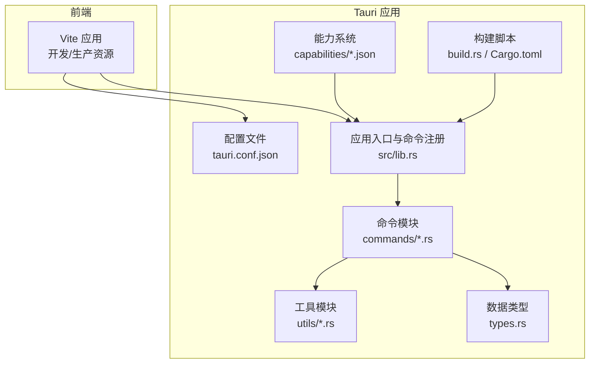
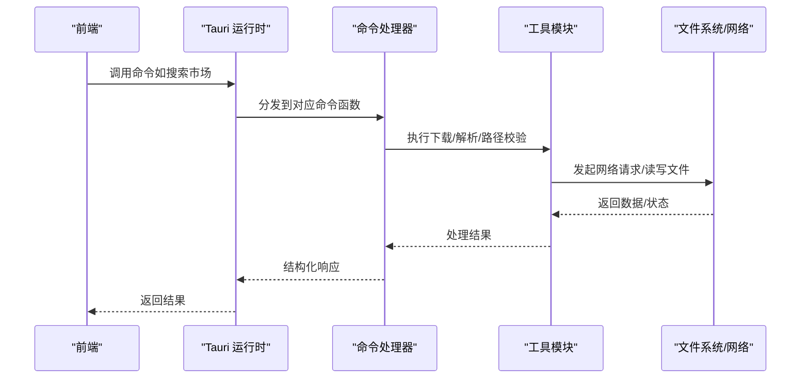
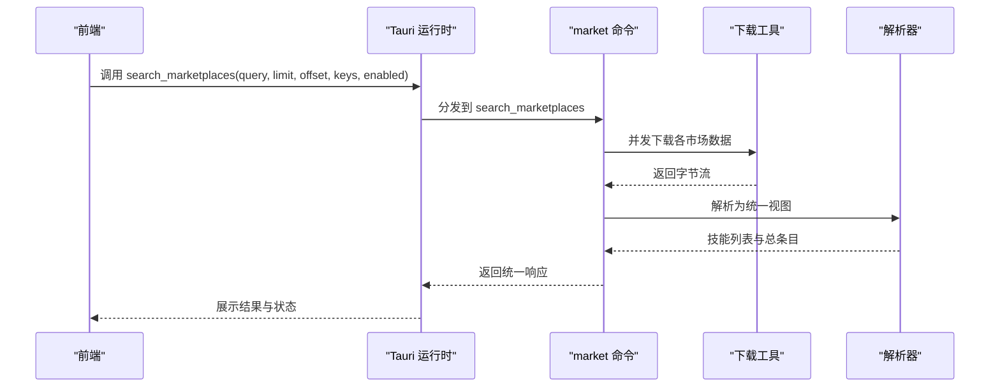
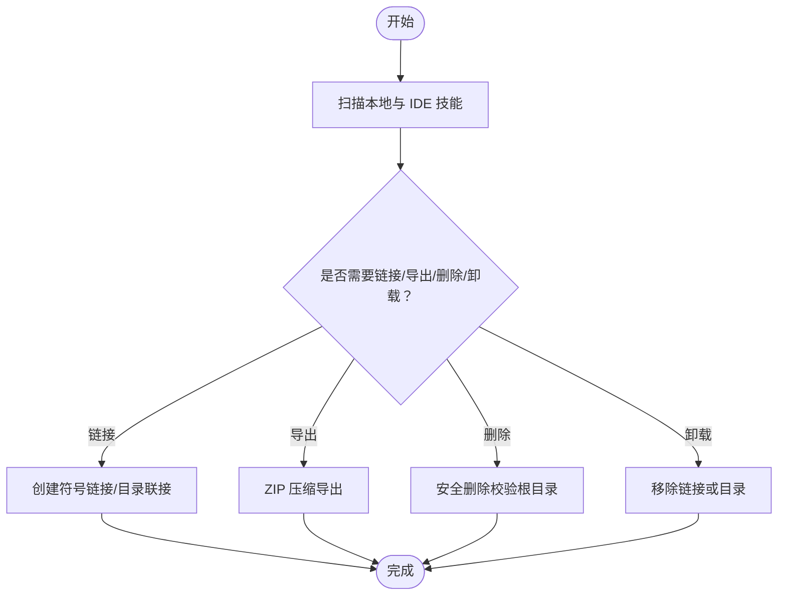
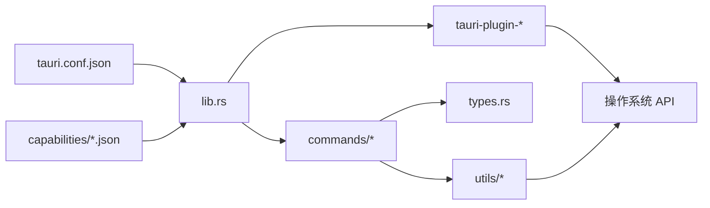

# Tauri 集成

<cite>
**本文引用的文件**
- [src-tauri/tauri.conf.json](file://src-tauri/tauri.conf.json)
- [src-tauri/Cargo.toml](file://src-tauri/Cargo.toml)
- [src-tauri/src/main.rs](file://src-tauri/src/main.rs)
- [src-tauri/src/lib.rs](file://src-tauri/src/lib.rs)
- [src-tauri/capabilities/default.json](file://src-tauri/capabilities/default.json)
- [src-tauri/capabilities/desktop.json](file://src-tauri/capabilities/desktop.json)
- [src-tauri/src/commands/mod.rs](file://src-tauri/src/commands/mod.rs)
- [src-tauri/src/commands/market.rs](file://src-tauri/src/commands/market.rs)
- [src-tauri/src/commands/skills.rs](file://src-tauri/src/commands/skills.rs)
- [src-tauri/src/utils/mod.rs](file://src-tauri/src/utils/mod.rs)
- [src-tauri/src/utils/download.rs](file://src-tauri/src/utils/download.rs)
- [src-tauri/src/utils/security.rs](file://src-tauri/src/utils/security.rs)
- [src-tauri/src/utils/path.rs](file://src-tauri/src/utils/path.rs)
- [src-tauri/src/types.rs](file://src-tauri/src/types.rs)
- [src-tauri/build.rs](file://src-tauri/build.rs)
</cite>

## 目录
1. [简介](#简介)
2. [项目结构](#项目结构)
3. [核心组件](#核心组件)
4. [架构总览](#架构总览)
5. [详细组件分析](#详细组件分析)
6. [依赖关系分析](#依赖关系分析)
7. [性能考虑](#性能考虑)
8. [故障排查指南](#故障排查指南)
9. [结论](#结论)
10. [附录](#附录)

## 简介
本文件面向 Skills Manager 的 Tauri 集成，系统化阐述配置文件结构、能力系统与权限管理、窗口与安全策略、原生 API 访问与系统集成、文件对话框与托盘图标等实现方式，并给出跨平台兼容性处理、安全策略配置与性能优化建议，以及调试方法与常见问题解决方案。

## 项目结构
Tauri 相关代码集中在 src-tauri 目录，采用 Rust 语言实现后端逻辑并通过 Tauri 命令暴露给前端调用。前端通过 Vite 构建并在开发/生产模式下由 Tauri 加载。能力系统（capabilities）用于声明窗口与权限范围；插件体系提供对话框、进程、打开器、更新器等能力；构建脚本负责生成能力与平台适配文件。

图表来源
- [src-tauri/tauri.conf.json:1-45](file://src-tauri/tauri.conf.json#L1-L45)
- [src-tauri/src/lib.rs:1-54](file://src-tauri/src/lib.rs#L1-L54)
- [src-tauri/src/commands/mod.rs:1-3](file://src-tauri/src/commands/mod.rs#L1-L3)
- [src-tauri/src/utils/mod.rs:1-4](file://src-tauri/src/utils/mod.rs#L1-L4)
- [src-tauri/src/types.rs:1-214](file://src-tauri/src/types.rs#L1-L214)
- [src-tauri/build.rs:1-4](file://src-tauri/build.rs#L1-L4)

章节来源
- [src-tauri/tauri.conf.json:1-45](file://src-tauri/tauri.conf.json#L1-L45)
- [src-tauri/src/lib.rs:1-54](file://src-tauri/src/lib.rs#L1-L54)
- [src-tauri/src/commands/mod.rs:1-3](file://src-tauri/src/commands/mod.rs#L1-L3)
- [src-tauri/src/utils/mod.rs:1-4](file://src-tauri/src/utils/mod.rs#L1-L4)
- [src-tauri/src/types.rs:1-214](file://src-tauri/src/types.rs#L1-L214)
- [src-tauri/build.rs:1-4](file://src-tauri/build.rs#L1-L4)

## 核心组件
- 配置与构建
  - 应用配置：产品名、版本、标识符、开发/构建命令、前端产物路径、窗口尺寸、安全策略（CSP）、打包图标与目标平台等。
  - 构建脚本：调用 tauri_build 完成能力与平台适配文件生成。
  - 依赖清单：tauri、tauri 插件（对话框、打开器、进程、更新器、单实例）、第三方网络与压缩库等。
- 能力系统与权限
  - default.json：默认能力，限定主窗口，授予核心、打开器、对话框、进程等权限。
  - desktop.json：桌面平台专属能力，授予更新器权限。
- 命令与业务逻辑
  - 市场命令：搜索多市场、下载/更新技能。
  - 技能管理命令：扫描本地与 IDE 技能、链接/卸载/导入/导出/删除、托管迁移等。
- 工具与安全
  - 下载与解压：远程下载、ZIP 解包、防 Zip Slip、防 Zip Bomb、临时目录清理。
  - 路径与安全校验：路径规范化、相对/绝对路径合法性、WSL 路径识别、危险路径阻断。
  - 跨平台链接：Unix 符号链接、Windows 符号链接/目录联接（Junction）。
- 类型定义
  - 统一的请求/响应模型，包括市场状态、技能视图、扫描结果、链接/卸载/导入/导出参数等。

章节来源
- [src-tauri/tauri.conf.json:1-45](file://src-tauri/tauri.conf.json#L1-L45)
- [src-tauri/Cargo.toml:1-36](file://src-tauri/Cargo.toml#L1-L36)
- [src-tauri/capabilities/default.json:1-15](file://src-tauri/capabilities/default.json#L1-L15)
- [src-tauri/capabilities/desktop.json:1-14](file://src-tauri/capabilities/desktop.json#L1-L14)
- [src-tauri/src/lib.rs:1-54](file://src-tauri/src/lib.rs#L1-L54)
- [src-tauri/src/commands/market.rs:1-442](file://src-tauri/src/commands/market.rs#L1-L442)
- [src-tauri/src/commands/skills.rs:1-847](file://src-tauri/src/commands/skills.rs#L1-L847)
- [src-tauri/src/utils/download.rs:1-273](file://src-tauri/src/utils/download.rs#L1-L273)
- [src-tauri/src/utils/security.rs:1-92](file://src-tauri/src/utils/security.rs#L1-L92)
- [src-tauri/src/utils/path.rs:1-90](file://src-tauri/src/utils/path.rs#L1-L90)
- [src-tauri/src/types.rs:1-214](file://src-tauri/src/types.rs#L1-L214)

## 架构总览
Tauri 应用启动时加载配置与能力，初始化插件并注册命令处理器。前端通过 Tauri 桥接调用命令，后端在安全沙箱内执行文件系统与网络操作，返回结构化结果。

图表来源
- [src-tauri/src/lib.rs:20-52](file://src-tauri/src/lib.rs#L20-L52)
- [src-tauri/src/commands/market.rs:173-392](file://src-tauri/src/commands/market.rs#L173-L392)
- [src-tauri/src/utils/download.rs:27-48](file://src-tauri/src/utils/download.rs#L27-L48)

章节来源
- [src-tauri/src/lib.rs:20-52](file://src-tauri/src/lib.rs#L20-L52)
- [src-tauri/src/commands/market.rs:173-392](file://src-tauri/src/commands/market.rs#L173-L392)
- [src-tauri/src/utils/download.rs:27-48](file://src-tauri/src/utils/download.rs#L27-L48)

## 详细组件分析

### 配置与窗口
- 应用基础信息与构建流程
  - 产品名、版本、标识符、开发/构建前置命令、前端产物目录。
- 窗口配置
  - 单窗口：标题、宽高。
- 安全策略（CSP）
  - 默认源、连接源、脚本源、样式源、图片源策略，限制外链与内联样式。
- 插件与打包
  - 更新器插件与公钥、打包目标与图标集。

章节来源
- [src-tauri/tauri.conf.json:1-45](file://src-tauri/tauri.conf.json#L1-L45)

### 能力系统与权限管理
- default.json
  - 主窗口 main，授予 core、opener、dialog、process 权限。
- desktop.json
  - 桌面平台（macOS/windows/linux），授予 updater 权限。
- 能力与插件的关系
  - 能力决定窗口可见性与权限集合；插件按需启用，受能力约束。

章节来源
- [src-tauri/capabilities/default.json:1-15](file://src-tauri/capabilities/default.json#L1-L15)
- [src-tauri/capabilities/desktop.json:1-14](file://src-tauri/capabilities/desktop.json#L1-L14)
- [src-tauri/src/lib.rs:20-27](file://src-tauri/src/lib.rs#L20-L27)

### 原生 API 访问与系统集成
- 插件
  - 对话框：用于选择文件/目录与确认提示。
  - 打开器：打开外部链接或文件。
  - 进程：执行外部命令（如 Windows mklink）。
  - 更新器：桌面平台自动更新。
  - 单实例：阻止重复启动，聚焦已有窗口。
- 命令注册
  - 将 market 与 skills 子模块中的命令统一注册到 Tauri 桥接层。

章节来源
- [src-tauri/src/lib.rs:20-52](file://src-tauri/src/lib.rs#L20-L52)
- [src-tauri/Cargo.toml:20-36](file://src-tauri/Cargo.toml#L20-L36)

### 文件对话框与系统交互
- 文件对话框
  - 通过 dialog 插件提供选择保存位置、打开目录等能力，配合安全路径校验与 ZIP 导出。
- 系统打开
  - opener 插件用于打开浏览器或文件路径。
- 进程与链接
  - process 插件用于执行系统命令；Windows 下使用 mklink 创建目录联接（junction）作为回退方案。

章节来源
- [src-tauri/src/lib.rs:23-26](file://src-tauri/src/lib.rs#L23-L26)
- [src-tauri/src/commands/skills.rs:311-353](file://src-tauri/src/commands/skills.rs#L311-L353)

### 市场命令与远程技能管理
- 功能概览
  - 搜索多个市场（含分页与查询参数）、下载/更新技能、解析不同市场的 JSON 结构。
- 关键流程
  - 参数校验与编码、并发拉取、错误聚合、结果映射与总条目统计。
- 安全与容错
  - 限流与超时、最大下载大小限制、解析失败时的状态标记。

图表来源
- [src-tauri/src/commands/market.rs:173-392](file://src-tauri/src/commands/market.rs#L173-L392)
- [src-tauri/src/utils/download.rs:27-48](file://src-tauri/src/utils/download.rs#L27-L48)

章节来源
- [src-tauri/src/commands/market.rs:173-392](file://src-tauri/src/commands/market.rs#L173-L392)
- [src-tauri/src/utils/download.rs:27-48](file://src-tauri/src/utils/download.rs#L27-L48)

### 技能管理命令与文件系统操作
- 功能概览
  - 扫描本地与 IDE 技能、链接/卸载/导入/导出/删除、托管迁移、项目目录扫描。
- 关键流程
  - 路径合法性校验、符号链接/目录联接创建、ZIP 导出、安全删除与清理。
- 跨平台差异
  - Unix 使用符号链接；Windows 提供符号链接与目录联接两种方案。

图表来源
- [src-tauri/src/commands/skills.rs:451-535](file://src-tauri/src/commands/skills.rs#L451-L535)
- [src-tauri/src/commands/skills.rs:355-449](file://src-tauri/src/commands/skills.rs#L355-L449)
- [src-tauri/src/commands/skills.rs:760-800](file://src-tauri/src/commands/skills.rs#L760-L800)

章节来源
- [src-tauri/src/commands/skills.rs:451-535](file://src-tauri/src/commands/skills.rs#L451-L535)
- [src-tauri/src/commands/skills.rs:355-449](file://src-tauri/src/commands/skills.rs#L355-L449)
- [src-tauri/src/commands/skills.rs:760-800](file://src-tauri/src/commands/skills.rs#L760-L800)

### 安全策略与路径校验
- 路径安全
  - 相对路径仅允许合法子目录；绝对路径支持 WSL UNC 路径；Unix 场景阻断系统关键路径。
  - 规范化与规范化路径解析，避免路径穿越与大小写差异导致的安全问题。
- ZIP 安全
  - 防 Zip Slip：校验解压路径必须位于目标目录内。
  - 防 Zip Bomb：单文件大小上限、整体下载大小上限。
- 临时目录清理
  - RAII 守卫确保异常退出也能清理临时目录。

章节来源
- [src-tauri/src/utils/security.rs:1-92](file://src-tauri/src/utils/security.rs#L1-L92)
- [src-tauri/src/utils/path.rs:1-90](file://src-tauri/src/utils/path.rs#L1-L90)
- [src-tauri/src/utils/download.rs:118-141](file://src-tauri/src/utils/download.rs#L118-L141)
- [src-tauri/src/utils/download.rs:143-183](file://src-tauri/src/utils/download.rs#L143-L183)

### 数据模型与类型
- 市场相关：RemoteSkill、RemoteSkillsResponse、RemoteSkillView、MarketStatus、RemoteSkillsViewResponse。
- 技能管理相关：LocalSkill、IdeSkill、Overview、LinkRequest、UninstallRequest、ImportRequest、ExportSkillsRequest、AdoptIdeSkillRequest、ProjectScanRequest、ProjectScanResult。
- 市场状态枚举：Online/Error/NeedsKey。

章节来源
- [src-tauri/src/types.rs:1-214](file://src-tauri/src/types.rs#L1-L214)

## 依赖关系分析
- 组件耦合
  - commands 依赖 utils 与 types；lib 注册命令并初始化插件；conf 与 capabilities 决定运行时权限与窗口。
- 外部依赖
  - tauri、tauri-plugin-*、ureq、zip、walkdir、dirs 等。
- 平台条件依赖
  - 桌面平台启用更新器与单实例插件；Windows 提供目录联接实现。

图表来源
- [src-tauri/tauri.conf.json:1-45](file://src-tauri/tauri.conf.json#L1-L45)
- [src-tauri/capabilities/default.json:1-15](file://src-tauri/capabilities/default.json#L1-L15)
- [src-tauri/capabilities/desktop.json:1-14](file://src-tauri/capabilities/desktop.json#L1-L14)
- [src-tauri/src/lib.rs:20-52](file://src-tauri/src/lib.rs#L20-L52)
- [src-tauri/src/commands/mod.rs:1-3](file://src-tauri/src/commands/mod.rs#L1-L3)
- [src-tauri/src/utils/mod.rs:1-4](file://src-tauri/src/utils/mod.rs#L1-L4)
- [src-tauri/src/types.rs:1-214](file://src-tauri/src/types.rs#L1-L214)
- [src-tauri/Cargo.toml:20-36](file://src-tauri/Cargo.toml#L20-L36)

章节来源
- [src-tauri/tauri.conf.json:1-45](file://src-tauri/tauri.conf.json#L1-L45)
- [src-tauri/capabilities/default.json:1-15](file://src-tauri/capabilities/default.json#L1-L15)
- [src-tauri/capabilities/desktop.json:1-14](file://src-tauri/capabilities/desktop.json#L1-L14)
- [src-tauri/src/lib.rs:20-52](file://src-tauri/src/lib.rs#L20-L52)
- [src-tauri/src/commands/mod.rs:1-3](file://src-tauri/src/commands/mod.rs#L1-L3)
- [src-tauri/src/utils/mod.rs:1-4](file://src-tauri/src/utils/mod.rs#L1-L4)
- [src-tauri/src/types.rs:1-214](file://src-tauri/src/types.rs#L1-L214)
- [src-tauri/Cargo.toml:20-36](file://src-tauri/Cargo.toml#L20-L36)

## 性能考虑
- 异步与线程池
  - 市场搜索与下载使用异步运行时与阻塞任务，避免阻塞 UI 线程。
- I/O 与压缩
  - ZIP 解压与复制采用流式处理与深度限制，降低内存峰值。
- 网络与缓存
  - 合理设置超时与重定向次数，控制最大下载体积，减少不必要的网络往返。
- 路径与遍历
  - 使用 WalkDir 递归遍历时限制深度，避免深层嵌套导致的性能问题。

章节来源
- [src-tauri/src/commands/market.rs:181-391](file://src-tauri/src/commands/market.rs#L181-L391)
- [src-tauri/src/utils/download.rs:143-183](file://src-tauri/src/utils/download.rs#L143-L183)
- [src-tauri/src/utils/download.rs:185-210](file://src-tauri/src/utils/download.rs#L185-L210)

## 故障排查指南
- 市场搜索失败
  - 检查网络连通性与超时设置；查看各市场返回状态与错误详情；确认查询参数与分页。
- 下载/更新失败
  - 确认源 URL 可访问；检查 ZIP 解包与路径合法性；关注 Zip Slip/Zip Bomb 防护触发。
- 链接/卸载异常
  - Windows 下优先尝试符号链接，失败时回退目录联接；确保目标路径在允许范围内且未越权。
- 导入/导出失败
  - 确保源目录包含 SKILL.md；导出路径不得位于选中技能目录内部；检查 ZIP 压缩过程中的错误。
- CSP 与资源加载
  - 若页面资源加载受限，检查 CSP 策略与资源来源；确保图片与脚本符合策略要求。

章节来源
- [src-tauri/src/commands/market.rs:173-392](file://src-tauri/src/commands/market.rs#L173-L392)
- [src-tauri/src/utils/download.rs:143-183](file://src-tauri/src/utils/download.rs#L143-L183)
- [src-tauri/src/commands/skills.rs:355-449](file://src-tauri/src/commands/skills.rs#L355-L449)
- [src-tauri/src/commands/skills.rs:760-800](file://src-tauri/src/commands/skills.rs#L760-L800)
- [src-tauri/tauri.conf.json:20-22](file://src-tauri/tauri.conf.json#L20-L22)

## 结论
本集成以能力系统与权限管理为核心，结合插件化扩展与严格的路径/压缩安全策略，实现了跨平台的市场搜索、技能下载与本地管理功能。通过异步与 I/O 优化、平台差异化实现与完善的错误反馈，系统在安全性与可用性之间取得平衡。建议在生产环境中持续完善日志与监控，细化异常分类与重试策略，并根据用户反馈迭代能力与权限配置。

## 附录
- 入口与运行
  - 应用入口在 main.rs 中调用 lib.rs 的 run 函数，随后加载上下文并运行。
- 构建与生成
  - build.rs 调用 tauri_build 完成能力与平台适配文件生成；Cargo.toml 定义依赖与条件编译。

章节来源
- [src-tauri/src/main.rs:1-7](file://src-tauri/src/main.rs#L1-L7)
- [src-tauri/src/lib.rs:20-52](file://src-tauri/src/lib.rs#L20-L52)
- [src-tauri/build.rs:1-4](file://src-tauri/build.rs#L1-L4)
- [src-tauri/Cargo.toml:17-36](file://src-tauri/Cargo.toml#L17-L36)