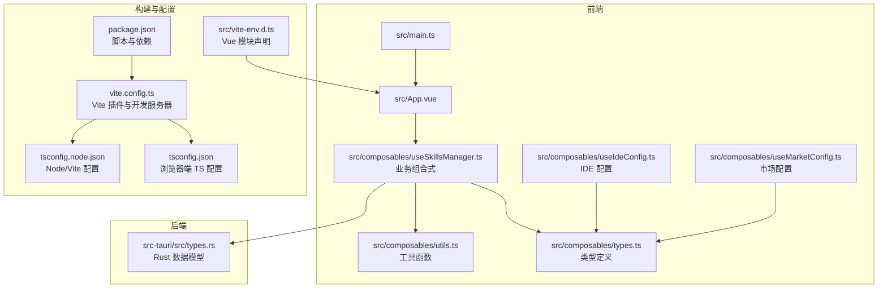
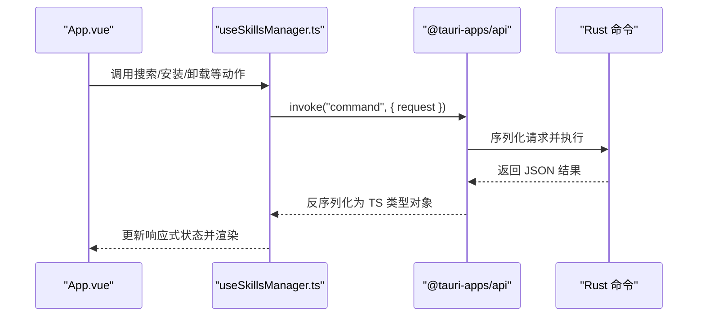
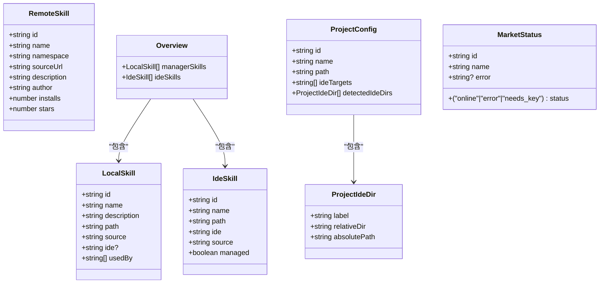
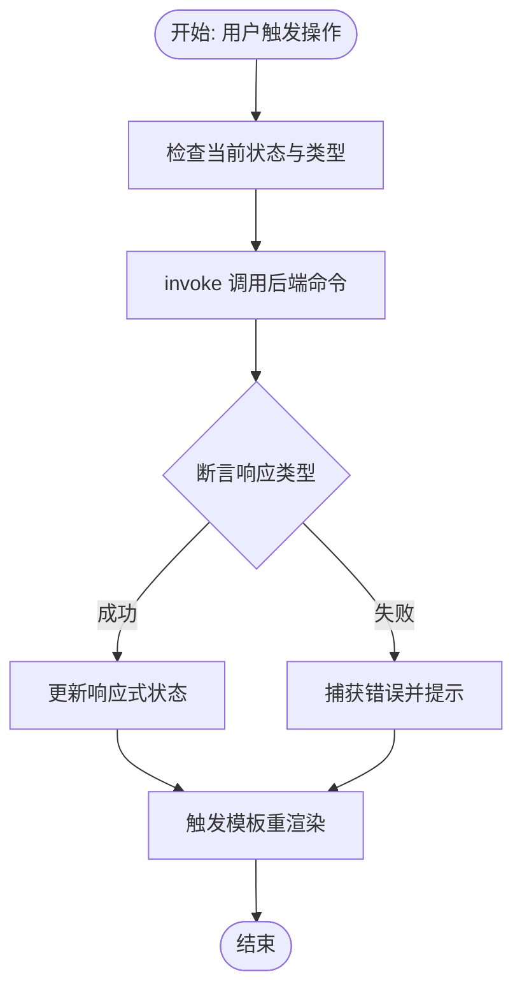
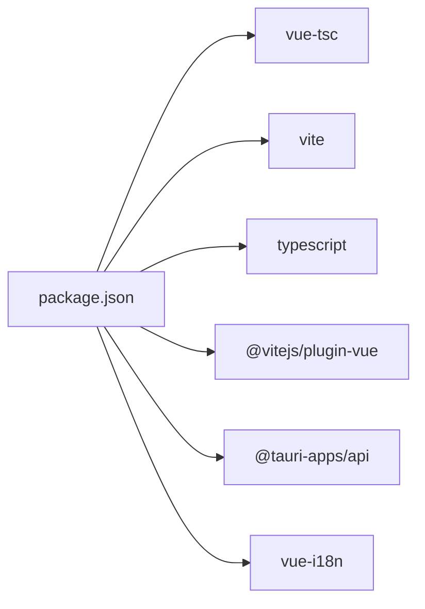

# TypeScript 集成

<cite>
**本文引用的文件**
- [tsconfig.json](file://tsconfig.json)
- [tsconfig.node.json](file://tsconfig.node.json)
- [vite.config.ts](file://vite.config.ts)
- [package.json](file://package.json)
- [src/vite-env.d.ts](file://src/vite-env.d.ts)
- [src/main.ts](file://src/main.ts)
- [src/App.vue](file://src/App.vue)
- [src/composables/types.ts](file://src/composables/types.ts)
- [src/composables/constants.ts](file://src/composables/constants.ts)
- [src/composables/utils.ts](file://src/composables/utils.ts)
- [src/composables/useIdeConfig.ts](file://src/composables/useIdeConfig.ts)
- [src/composables/useMarketConfig.ts](file://src/composables/useMarketConfig.ts)
- [src/composables/useSkillsManager.ts](file://src/composables/useSkillsManager.ts)
- [src-tauri/src/types.rs](file://src-tauri/src/types.rs)
</cite>

## 目录
1. [简介](#简介)
2. [项目结构](#项目结构)
3. [核心组件](#核心组件)
4. [架构总览](#架构总览)
5. [详细组件分析](#详细组件分析)
6. [依赖分析](#依赖分析)
7. [性能考虑](#性能考虑)
8. [故障排查指南](#故障排查指南)
9. [结论](#结论)
10. [附录](#附录)

## 简介
本指南面向 Skills Manager 的 TypeScript 集成，系统讲解在 Vue 3 + Vite + Tauri 环境下如何配置与使用 TypeScript，覆盖类型定义、接口设计、泛型应用、类型安全最佳实践、编译时检查、与 Rust 后端的数据类型映射、API 接口的类型约束以及在组合式 API（Composition API）中的类型化用法。文档以“自上而下”的方式组织：先给出整体架构与配置，再深入到核心类型系统与关键组合式函数，最后提供性能与故障排查建议。

## 项目结构
本项目采用“前端 Vue 3 + 组合式 API + TypeScript + Vite 构建 + Tauri 调用后端命令”的分层架构。TypeScript 配置分别针对浏览器端与 Node 端（Vite），通过引用关系隔离编译上下文；Rust 后端通过 Tauri 命令暴露能力，前端通过 @tauri-apps/api 以强类型参数调用。



图表来源
- [src/main.ts:1-7](file://src/main.ts#L1-L7)
- [src/App.vue:1-20](file://src/App.vue#L1-L20)
- [src/composables/types.ts:1-119](file://src/composables/types.ts#L1-L119)
- [src/composables/useSkillsManager.ts:1-20](file://src/composables/useSkillsManager.ts#L1-L20)
- [src/composables/useIdeConfig.ts:1-10](file://src/composables/useIdeConfig.ts#L1-L10)
- [src/composables/useMarketConfig.ts:1-10](file://src/composables/useMarketConfig.ts#L1-L10)
- [src/composables/utils.ts:1-10](file://src/composables/utils.ts#L1-L10)
- [tsconfig.json:1-26](file://tsconfig.json#L1-L26)
- [tsconfig.node.json:1-11](file://tsconfig.node.json#L1-L11)
- [vite.config.ts:1-33](file://vite.config.ts#L1-L33)
- [package.json:1-30](file://package.json#L1-L30)
- [src/vite-env.d.ts:1-8](file://src/vite-env.d.ts#L1-L8)
- [src-tauri/src/types.rs:1-214](file://src-tauri/src/types.rs#L1-L214)

章节来源
- [tsconfig.json:1-26](file://tsconfig.json#L1-L26)
- [tsconfig.node.json:1-11](file://tsconfig.node.json#L1-L11)
- [vite.config.ts:1-33](file://vite.config.ts#L1-L33)
- [package.json:1-30](file://package.json#L1-L30)
- [src/vite-env.d.ts:1-8](file://src/vite-env.d.ts#L1-L8)
- [src/main.ts:1-7](file://src/main.ts#L1-L7)
- [src/App.vue:1-20](file://src/App.vue#L1-L20)

## 核心组件
本节聚焦 TypeScript 在项目中的关键角色：类型定义、组合式 API 的类型化使用、与 Rust 后端的类型映射、以及编译时检查策略。

- 类型定义与接口设计
  - 使用明确的字面量联合类型与严格字段定义，确保状态与枚举值在编译期可验证。
  - 对外暴露的类型集中在 types.ts，供 useSkillsManager、useIdeConfig、useMarketConfig 等组合式函数消费。
- 泛型与集合类型
  - 在 useSkillsManager 中广泛使用 Ref<T[]>、ComputedRef<T[]> 等，配合 Map<K, V> 实现缓存与任务队列。
- 编译时检查
  - 严格模式开启，启用未使用局部变量与参数检查，避免冗余代码引入潜在问题。
- 与 Rust 后端的类型映射
  - 前端 TypeScript 类型与 Rust 结构体通过 camelCase 字段名约定进行序列化/反序列化映射，确保跨语言一致性。
- 组合式 API 的类型化
  - 所有响应式状态均显式标注类型，返回值通过 as 断言与类型守卫结合，保证 invoke 返回值的类型安全。

章节来源
- [src/composables/types.ts:1-119](file://src/composables/types.ts#L1-L119)
- [src/composables/useSkillsManager.ts:1-120](file://src/composables/useSkillsManager.ts#L1-L120)
- [src/composables/useIdeConfig.ts:1-131](file://src/composables/useIdeConfig.ts#L1-L131)
- [src/composables/useMarketConfig.ts:1-67](file://src/composables/useMarketConfig.ts#L1-L67)
- [src/composables/utils.ts:1-125](file://src/composables/utils.ts#L1-L125)
- [src-tauri/src/types.rs:23-214](file://src-tauri/src/types.rs#L23-L214)
- [tsconfig.json:17-22](file://tsconfig.json#L17-L22)

## 架构总览
前端通过 Tauri 命令与 Rust 后端交互，数据在前后端之间以结构化 JSON 形式传递。TypeScript 类型定义贯穿 UI、组合式逻辑与后端模型，形成“前端类型 → 后端模型 → 前端断言”的闭环。



图表来源
- [src/App.vue:73-124](file://src/App.vue#L73-L124)
- [src/composables/useSkillsManager.ts:190-248](file://src/composables/useSkillsManager.ts#L190-L248)
- [src-tauri/src/types.rs:94-114](file://src-tauri/src/types.rs#L94-L114)

## 详细组件分析

### TypeScript 配置与构建链路
- 浏览器端 tsconfig.json
  - 目标与模块：ES2020 + ESNext，配合 Vite 的 bundler 模式解析。
  - 严格模式：开启严格、未使用局部变量/参数、switch 不穷举等，提升质量。
  - 仅输出类型检查：noEmit，由 vue-tsc 在构建前统一检查。
- Node 端 tsconfig.node.json
  - 用于 Vite 配置文件的类型检查，复合模式与 bundler 解析。
- 构建脚本
  - build 脚本先运行 vue-tsc 进行类型检查，再执行 Vite 构建，确保发布前无类型错误。
- Vue 模块声明
  - 通过 vite-env.d.ts 声明 *.vue 模块，使 Vite 正确识别单文件组件类型。

章节来源
- [tsconfig.json:1-26](file://tsconfig.json#L1-L26)
- [tsconfig.node.json:1-11](file://tsconfig.node.json#L1-L11)
- [vite.config.ts:1-33](file://vite.config.ts#L1-L33)
- [package.json:8-8](file://package.json#L8-L8)
- [src/vite-env.d.ts:1-8](file://src/vite-env.d.ts#L1-L8)

### 类型系统与数据模型
- RemoteSkill、LocalSkill、IdeSkill、Overview、ProjectConfig 等核心类型定义清晰，字段语义明确，便于在组合式函数与模板中直接消费。
- MarketStatus 使用字面量联合类型表示在线/错误/需要密钥三种状态，配合可选错误信息，增强错误处理的类型安全。
- MarketSortMode 使用字面量联合类型限定排序模式，避免魔法字符串带来的运行时风险。
- ProjectIdeDir 与 ProjectConfig 封装项目级 IDE 目录与配置，便于在项目面板中统一管理。



图表来源
- [src/composables/types.ts:4-119](file://src/composables/types.ts#L4-L119)

章节来源
- [src/composables/types.ts:1-119](file://src/composables/types.ts#L1-L119)

### 与 Rust 后端的数据类型映射
- 字段命名约定
  - 前端 TypeScript 类型字段采用 camelCase，与 Rust serde 的 camelCase 映射一致，确保序列化/反序列化稳定可靠。
- 关键模型映射
  - RemoteSkill/RemoteSkillsResponse/RemoteSkillsViewResponse/MarketStatus/InstallResult/LinkTarget/Overview 等在前后端一一对应。
- 请求/响应结构
  - 前端通过 invoke 传入 request 对象，后端以 serde 结构接收；返回值在前端以 as 断言为已知类型，减少运行时错误。

```mermaid
erDiagram
REMOTE_SKILL {
string id
string name
string namespace
string source_url
string description
string author
uint64 installs
uint64 stars
}
REMOTE_SKILLS_RESPONSE {
uint64 total
uint64 limit
uint64 offset
}
MARKET_STATUS {
string id
string name
enum status
string? error
}
INSTALL_RESULT {
string installed_path
string[] linked
string[] skipped
}
LINK_TARGET {
string name
string path
}
OVERVIEW {
string[] manager_skills
string[] ide_skills
}
```

图表来源
- [src-tauri/src/types.rs:23-151](file://src-tauri/src/types.rs#L23-L151)
- [src/composables/types.ts:4-119](file://src/composables/types.ts#L4-L119)

章节来源
- [src-tauri/src/types.rs:23-214](file://src-tauri/src/types.rs#L23-L214)
- [src/composables/types.ts:1-119](file://src/composables/types.ts#L1-L119)

### 组合式 API 的类型化实践
- useSkillsManager
  - 使用 ref/computed/state 管理搜索、安装、下载队列等状态，所有集合类型均显式标注。
  - 通过 Map 缓存搜索结果，键为查询+limit 组合，值包含技能列表、总数、偏移与市场状态，避免重复请求。
  - 对 invoke 返回值使用 as 断言为已知结构，随后进行数组/可选字段校验，保障 UI 渲染安全。
- useIdeConfig/useMarketConfig
  - 本地存储读写采用 Record<string,string> 与 Record<string,boolean>，配合类型守卫过滤无效数据。
  - 默认值来自 constants.ts，确保首次加载的稳定性。
- utils 工具函数
  - isSafeRelativePath/isSafeAbsolutePath/isValidIdePath 等函数返回布尔值，输入参数均为 string，类型单一，便于复用与测试。
  - getErrorMessage 支持 unknown 输入，返回 string，避免错误处理分支遗漏。



图表来源
- [src/composables/useSkillsManager.ts:190-248](file://src/composables/useSkillsManager.ts#L190-L248)
- [src/composables/utils.ts:104-112](file://src/composables/utils.ts#L104-L112)

章节来源
- [src/composables/useSkillsManager.ts:1-800](file://src/composables/useSkillsManager.ts#L1-L800)
- [src/composables/useIdeConfig.ts:1-131](file://src/composables/useIdeConfig.ts#L1-L131)
- [src/composables/useMarketConfig.ts:1-67](file://src/composables/useMarketConfig.ts#L1-L67)
- [src/composables/utils.ts:1-125](file://src/composables/utils.ts#L1-L125)

### 错误处理的类型安全实现
- 统一错误提取
  - getErrorMessage 支持 Error/string/object 三类输入，优先取 message 字段，兜底返回 fallback 字符串，避免空消息导致的 UI 异常。
- 任务队列错误
  - 下载/更新任务在失败时设置 status='error' 并记录 error 字符串，后续可重试或清理。
- UI 提示
  - 通过 useToast 组件统一展示成功/失败消息，消息文本通过 i18n 注入，避免硬编码。

章节来源
- [src/composables/utils.ts:104-112](file://src/composables/utils.ts#L104-L112)
- [src/composables/useSkillsManager.ts:278-342](file://src/composables/useSkillsManager.ts#L278-L342)

### 在组合式 API 中正确使用 TypeScript 类型
- 显式标注响应式状态
  - 如 results: ref<RemoteSkill[]>、localSkills: ref<LocalSkill[]>、downloadQueue: ref<DownloadTask[]> 等。
- 计算属性的类型推断
  - sortedResults 使用 map/sort 后仍保持 RemoteSkill[] 类型，确保下游模板无需再次断言。
- 参数与返回值的类型约束
  - 函数参数尽量使用具体类型（如 "download" | "update"），减少运行时分支错误。
- 模板中的类型绑定
  - App.vue 中通过 v-model 与事件修饰符将类型安全地传递给子组件 props 与 emits。

章节来源
- [src/composables/useSkillsManager.ts:30-120](file://src/composables/useSkillsManager.ts#L30-L120)
- [src/App.vue:20-20](file://src/App.vue#L20-L20)
- [src/App.vue:300-322](file://src/App.vue#L300-L322)

## 依赖分析
- 前端依赖
  - Vue 3、vue-i18n、@tauri-apps/api、@tauri-apps/plugin-* 等，提供 UI、国际化与系统集成能力。
- 开发依赖
  - TypeScript、vue-tsc、@vitejs/plugin-vue、Vite，负责类型检查与构建。
- 构建脚本
  - build 先 vue-tsc 再 vite build，确保类型错误不进入产物。



图表来源
- [package.json:13-28](file://package.json#L13-L28)

章节来源
- [package.json:1-30](file://package.json#L1-30)

## 性能考虑
- 类型检查前置
  - 通过 vue-tsc 在构建前完成类型检查，避免运行时因类型错误导致的性能损耗与崩溃。
- 缓存与去重
  - 搜索结果缓存与 dedupeSkills 去重逻辑减少重复网络请求与渲染开销。
- 任务队列串行处理
  - 下载/更新任务串行执行，避免并发 IO 抖动与资源竞争。
- 路径安全校验
  - 在链接/导入/导出等敏感操作前进行路径合法性校验，减少无效 IO 与异常恢复成本。

## 故障排查指南
- 类型错误
  - 若出现类型断言相关的编译错误，请检查 invoke 返回值是否与 Rust 命令返回结构一致，必要时在 Rust 层调整字段命名或添加可选字段。
- 运行时错误
  - 使用 getErrorMessage 统一提取错误消息，关注错误字符串中是否包含系统特定错误码（如文件不存在），以便定位问题根因。
- 路径问题
  - 当 IDE 目录或项目路径无效时，检查 isSafeRelativePath/isSafeAbsolutePath 的返回值，确认路径不含危险片段或保留名。
- 本地存储异常
  - 若 IDE 选项或市场配置未生效，检查 localStorage 的键值是否存在且格式正确，必要时回退到默认值。

章节来源
- [src/composables/utils.ts:34-99](file://src/composables/utils.ts#L34-L99)
- [src/composables/useIdeConfig.ts:9-54](file://src/composables/useIdeConfig.ts#L9-L54)
- [src/composables/useMarketConfig.ts:16-44](file://src/composables/useMarketConfig.ts#L16-L44)
- [src/composables/utils.ts:104-112](file://src/composables/utils.ts#L104-L112)

## 结论
本项目在 Vue 3 + TypeScript + Vite + Tauri 的栈上实现了完善的类型化工程实践：严格的 tsconfig 配置、清晰的类型定义、严谨的组合式 API 使用、与 Rust 后端稳定的类型映射，以及完善的错误处理与性能优化策略。遵循本文档的类型安全最佳实践，可在功能扩展与维护过程中持续保持高质量与高可靠性。

## 附录
- 常用类型别名与枚举
  - MarketStatusType（"online"|"error"|"needs_key"）
  - MarketSortMode（"default"|"stars_desc"|"installs_desc"）
  - DownloadTask.status（"pending"|"downloading"|"done"|"error"）
- 关键组合式函数
  - useSkillsManager：封装市场搜索、安装/更新、扫描、导入/导出、卸载、adopt 等核心流程。
  - useIdeConfig：管理 IDE 选项、安装目标、自定义 IDE 目录。
  - useMarketConfig：管理市场配置、启用状态与市场状态。
- 工具函数
  - 路径安全校验、错误提取、名称归一化等，贯穿于安装、链接、导入/导出等流程。