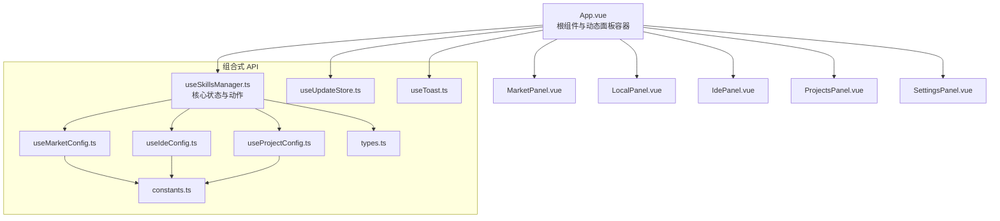
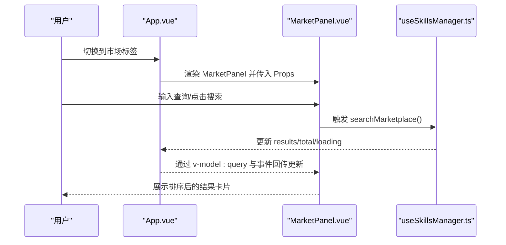
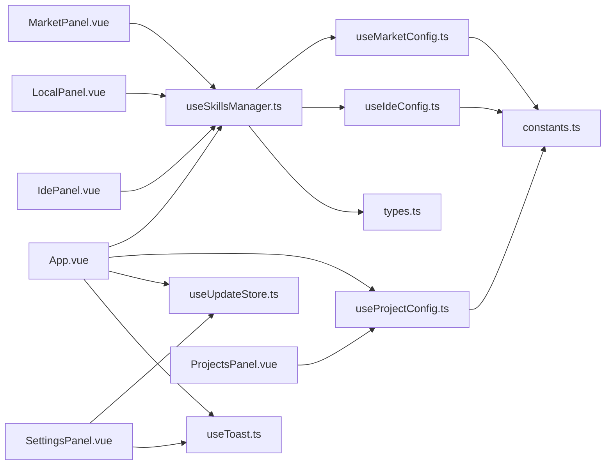

# Vue 3 组件开发

<cite>
**本文引用的文件**
- [src/App.vue](file://src/App.vue)
- [src/main.ts](file://src/main.ts)
- [src/components/MarketPanel.vue](file://src/components/MarketPanel.vue)
- [src/components/LocalPanel.vue](file://src/components/LocalPanel.vue)
- [src/components/IdePanel.vue](file://src/components/IdePanel.vue)
- [src/components/ProjectsPanel.vue](file://src/components/ProjectsPanel.vue)
- [src/components/SettingsPanel.vue](file://src/components/SettingsPanel.vue)
- [src/composables/useSkillsManager.ts](file://src/composables/useSkillsManager.ts)
- [src/composables/types.ts](file://src/composables/types.ts)
- [src/composables/useMarketConfig.ts](file://src/composables/useMarketConfig.ts)
- [src/composables/useIdeConfig.ts](file://src/composables/useIdeConfig.ts)
- [src/composables/useProjectConfig.ts](file://src/composables/useProjectConfig.ts)
- [src/composables/useUpdateStore.ts](file://src/composables/useUpdateStore.ts)
- [src/composables/useToast.ts](file://src/composables/useToast.ts)
- [src/composables/constants.ts](file://src/composables/constants.ts)
</cite>

## 目录
1. [简介](#简介)
2. [项目结构](#项目结构)
3. [核心组件](#核心组件)
4. [架构总览](#架构总览)
5. [组件详解](#组件详解)
6. [依赖关系分析](#依赖关系分析)
7. [性能考量](#性能考量)
8. [故障排查指南](#故障排查指南)
9. [结论](#结论)
10. [附录](#附录)

## 简介
本文件面向 Skills Manager 的 Vue 3 组件开发，系统性阐述组合式 API 使用模式、组件生命周期管理、Props 与 Events 设计原则，并深入解析以下核心组件的功能实现与交互：MarketPanel（市场面板）、LocalPanel（本地面板）、IdePanel（IDE 面板）、ProjectsPanel（项目面板）、SettingsPanel（设置面板）。文档同时覆盖组件间通信机制、插槽使用、动态组件加载、响应式数据绑定、计算属性与侦听器的最佳实践、性能优化策略与调试技巧。

## 项目结构
项目采用“按功能分层”的组织方式，前端由根组件 App.vue 负责路由式动态面板切换与全局状态注入，各面板组件负责具体业务展示与交互；组合式 API 抽象出跨组件共享的状态与逻辑，类型定义集中于 types.ts，常量与默认配置位于 constants.ts。

图表来源
- [src/App.vue:1-400](file://src/App.vue#L1-L400)
- [src/components/MarketPanel.vue:1-192](file://src/components/MarketPanel.vue#L1-L192)
- [src/components/LocalPanel.vue:1-310](file://src/components/LocalPanel.vue#L1-L310)
- [src/components/IdePanel.vue:1-270](file://src/components/IdePanel.vue#L1-L270)
- [src/components/ProjectsPanel.vue:1-253](file://src/components/ProjectsPanel.vue#L1-L253)
- [src/components/SettingsPanel.vue:1-570](file://src/components/SettingsPanel.vue#L1-L570)
- [src/composables/useSkillsManager.ts:1-867](file://src/composables/useSkillsManager.ts#L1-L867)
- [src/composables/types.ts:1-119](file://src/composables/types.ts#L1-L119)
- [src/composables/constants.ts:1-72](file://src/composables/constants.ts#L1-L72)

章节来源
- [src/App.vue:1-400](file://src/App.vue#L1-L400)
- [src/main.ts:1-7](file://src/main.ts#L1-L7)

## 核心组件
- MarketPanel：展示市场搜索、排序、结果卡片、下载队列与市场配置管理。
- LocalPanel：展示本地技能列表、批量选择、导入导出、安装与删除操作、下载队列。
- IdePanel：展示 IDE 技能过滤、自定义 IDE 目录、采用与卸载、批量操作。
- ProjectsPanel：展示项目列表、选择/配置/链接技能、打开目录。
- SettingsPanel：展示关于信息、更新检查/下载/安装、主题与语言切换。

章节来源
- [src/components/MarketPanel.vue:1-192](file://src/components/MarketPanel.vue#L1-L192)
- [src/components/LocalPanel.vue:1-310](file://src/components/LocalPanel.vue#L1-L310)
- [src/components/IdePanel.vue:1-270](file://src/components/IdePanel.vue#L1-L270)
- [src/components/ProjectsPanel.vue:1-253](file://src/components/ProjectsPanel.vue#L1-L253)
- [src/components/SettingsPanel.vue:1-570](file://src/components/SettingsPanel.vue#L1-L570)

## 架构总览
组件通过根组件 App.vue 进行统一调度，使用 v-if/v-show 或模板片段进行动态面板渲染。核心状态与动作由 useSkillsManager.ts 提供，其他组合式 API 负责细分领域（市场、IDE、项目、更新、通知）。

图表来源
- [src/App.vue:299-322](file://src/App.vue#L299-L322)
- [src/components/MarketPanel.vue:30-39](file://src/components/MarketPanel.vue#L30-L39)
- [src/composables/useSkillsManager.ts:190-248](file://src/composables/useSkillsManager.ts#L190-L248)

## 组件详解

### MarketPanel（市场面板）
- Props 设计
  - 查询词、排序模式、加载状态、结果集、是否还有更多、正在安装/更新 ID、本地技能名集合、市场配置、市场状态、启用市场映射、下载队列、最近任务状态。
- 事件设计
  - 双向绑定：update:query、update:sortMode
  - 操作：search、refresh、loadMore、download、update、saveConfigs
- 关键逻辑
  - 计算属性：根据下载队列生成正在下载的 ID 集合，用于按钮禁用与文案提示。
  - 动作状态：根据 recentTaskStatus 推断“已下载/已更新/排队”等状态。
  - 安装/更新：调用下载队列处理流程，支持去重与错误处理。
  - 市场设置弹窗：传递 configs 与 enabled 映射，接收保存事件后回写。
- 最佳实践
  - 使用 v-model:query 与 v-on:input 实现输入即更新，避免手动同步。
  - 使用 v-if/v-show 控制空态与加载态，减少不必要的渲染。
  - 将“可用性判断”前置到模板中，降低逻辑复杂度。

章节来源
- [src/components/MarketPanel.vue:10-24](file://src/components/MarketPanel.vue#L10-L24)
- [src/components/MarketPanel.vue:30-39](file://src/components/MarketPanel.vue#L30-L39)
- [src/components/MarketPanel.vue:26-28](file://src/components/MarketPanel.vue#L26-L28)
- [src/components/MarketPanel.vue:146-153](file://src/components/MarketPanel.vue#L146-L153)

### LocalPanel（本地面板）
- Props 设计
  - 本地技能数组、扫描加载状态、正在安装 ID、下载队列、IDE 选项。
- 事件设计
  - install、installMany、exportLocal、deleteLocal、openDir、refresh、import、retryDownload、removeFromQueue。
- 关键逻辑
  - 搜索与筛选：基于关键词与规范化名称进行模糊匹配。
  - 多选：全选/反选，自动维护选中集合，避免无效 ID。
  - 批量操作：安装、导出、删除，均通过事件向上派发。
  - 下载队列：通过 DownloadQueue 子组件展示与控制重试/移除。
- 最佳实践
  - 使用 computed 过滤与计算选中项，避免在模板中重复计算。
  - watch 监听父级数据变化，确保选中集合与数据一致性。
  - 对空态与搜索无结果分别给出明确提示。

章节来源
- [src/components/LocalPanel.vue:10-16](file://src/components/LocalPanel.vue#L10-L16)
- [src/components/LocalPanel.vue:18-28](file://src/components/LocalPanel.vue#L18-L28)
- [src/components/LocalPanel.vue:33-44](file://src/components/LocalPanel.vue#L33-L44)
- [src/components/LocalPanel.vue:46-53](file://src/components/LocalPanel.vue#L46-L53)
- [src/components/LocalPanel.vue:55-78](file://src/components/LocalPanel.vue#L55-L78)

### IdePanel（IDE 面板）
- Props 设计
  - IDE 选项、当前过滤器、自定义 IDE 名称/路径、自定义 IDE 列表、过滤后的 IDE 技能、本地扫描加载状态。
- 事件设计
  - update:selectedIdeFilter、update:customIdeName、update:customIdeDir、addCustomIde、removeCustomIde、uninstall、uninstallMany、openDir、adopt、adoptMany。
- 关键逻辑
  - 过滤：根据 selectedIdeFilter 过滤显示的 IDE 技能。
  - 自定义 IDE：校验名称与路径，去重并持久化。
  - 多选与批量：未托管技能可采用，选中项可批量卸载或采用。
- 最佳实践
  - 将“是否托管”状态显式标注，便于 UI 区分。
  - 在模板中对不可用按钮进行禁用，避免无效调用。

章节来源
- [src/components/IdePanel.vue:8-17](file://src/components/IdePanel.vue#L8-L17)
- [src/components/IdePanel.vue:19-30](file://src/components/IdePanel.vue#L19-L30)
- [src/components/IdePanel.vue:34-41](file://src/components/IdePanel.vue#L34-L41)
- [src/components/IdePanel.vue:43-55](file://src/components/IdePanel.vue#L43-L55)

### ProjectsPanel（项目面板）
- Props 设计
  - 项目数组、当前选中项目 ID、本地技能、IDE 选项、本地扫描加载状态。
- 事件设计
  - addProject、removeProject、selectProject、configureProject、linkSkills。
- 关键逻辑
  - 项目列表展示与选中态高亮。
  - 一键打开项目目录（通过 Tauri 插件）。
  - 链接技能：将选中项目上下文传入安装流程，引导用户在本地面板选择技能。
- 最佳实践
  - 通过 toast 提示用户下一步操作，提升交互反馈。
  - 对空项目列表与无 IDE 目标场景给出明确提示。

章节来源
- [src/components/ProjectsPanel.vue:8-14](file://src/components/ProjectsPanel.vue#L8-L14)
- [src/components/ProjectsPanel.vue:16-22](file://src/components/ProjectsPanel.vue#L16-L22)
- [src/components/ProjectsPanel.vue:44-50](file://src/components/ProjectsPanel.vue#L44-L50)
- [src/components/ProjectsPanel.vue:52-57](file://src/components/ProjectsPanel.vue#L52-L57)

### SettingsPanel（设置面板）
- 功能概览
  - 关于信息：应用名、当前版本、更新状态（检查、下载进度、完成安装）。
  - 外观设置：主题（浅色/深色/系统）与语言（简体中文/英语）切换。
  - 本地持久化：通过 localStorage 读取与写入偏好。
- 生命周期与副作用
  - onMounted：加载应用信息、主题与语言偏好、系统主题监听、重置更新状态。
  - watch：主题与语言变更时即时生效并持久化。
- 最佳实践
  - 将主题切换写入 documentElement 的 data-theme，便于样式变量生效。
  - 使用独立的更新 store 管理更新流程，避免与 UI 混杂。

章节来源
- [src/components/SettingsPanel.vue:1-129](file://src/components/SettingsPanel.vue#L1-L129)
- [src/components/SettingsPanel.vue:132-267](file://src/components/SettingsPanel.vue#L132-L267)

## 依赖关系分析
- 组件与组合式 API
  - MarketPanel 依赖 useSkillsManager 的搜索、排序、下载队列与市场配置。
  - LocalPanel 依赖 useSkillsManager 的本地扫描、安装/导出/删除、下载队列。
  - IdePanel 依赖 useSkillsManager 的 IDE 过滤、采用/卸载、自定义 IDE。
  - ProjectsPanel 依赖 useProjectConfig 的项目 CRUD 与 IDE 目标管理。
  - SettingsPanel 依赖 useUpdateStore 与 useToast，以及 i18n 全局实例。
- 类型与常量
  - types.ts 定义了所有数据模型，constants.ts 提供默认值与存储键名，确保跨模块一致。
- App.vue 的角色
  - 作为动态面板容器，聚合 useSkillsManager 与 useProjectConfig 的状态与动作，向子组件传递 Props 并接收事件回调。

图表来源
- [src/App.vue:73-142](file://src/App.vue#L73-L142)
- [src/composables/useSkillsManager.ts:116-135](file://src/composables/useSkillsManager.ts#L116-L135)
- [src/composables/useProjectConfig.ts:32-127](file://src/composables/useProjectConfig.ts#L32-L127)
- [src/composables/useUpdateStore.ts:26-157](file://src/composables/useUpdateStore.ts#L26-L157)
- [src/composables/useToast.ts:14-54](file://src/composables/useToast.ts#L14-L54)
- [src/composables/types.ts:1-119](file://src/composables/types.ts#L1-L119)
- [src/composables/constants.ts:1-72](file://src/composables/constants.ts#L1-L72)

## 性能考量
- 响应式与计算属性
  - 将昂贵的过滤/去重/排序逻辑放入 computed，避免在模板中重复计算。
  - 对下载队列与最近任务状态使用 Set/Map 结构，提升查找效率。
- 侦听与副作用
  - 合理使用 watch，避免深度监听大对象；必要时配合 { deep: true } 与浅拷贝。
  - 在 onUnmounted 中清理定时器，防止内存泄漏。
- DOM 与渲染
  - 使用 v-show 控制轻量切换，v-if 控制面板级渲染，减少不必要的子树构建。
  - 对长列表使用虚拟滚动或分页（如 MarketPanel 的“加载更多”）。
- 状态持久化
  - 将用户偏好与配置存入 localStorage，避免每次启动重新计算。
- 异步与并发
  - 下载队列串行处理，避免并发冲突；对失败任务提供重试与移除能力。
- 国际化与主题
  - 主题切换仅修改根节点属性，避免全量重绘；语言切换通过 i18n 全局实例即时生效。

## 故障排查指南
- 市场搜索无结果
  - 检查 query 是否为空、缓存是否过期、enabledMarkets 是否启用、marketConfigs 是否有效。
  - 查看 marketStatuses 中是否存在 needs_key 或 error 状态。
- 下载/更新失败
  - 查看 downloadQueue 中对应任务的 error 字段，确认 sourceUrl 与安装基路径。
  - 检查 recentTaskStatus 是否被清理，确认 toast 是否提示错误。
- 本地扫描异常
  - 确认 IDE 选项是否有效，路径是否安全；查看 toast 错误消息。
- 卸载/删除失败
  - 分别处理 IDE 模式与本地模式，关注部分成功/失败的提示。
- 设置面板不生效
  - 检查 localStorage 中的 theme 与 locale 键值，确认 onMounted 是否执行。
  - 系统主题监听是否触发，必要时手动切换一次以刷新。

章节来源
- [src/composables/useSkillsManager.ts:278-342](file://src/composables/useSkillsManager.ts#L278-L342)
- [src/composables/useSkillsManager.ts:568-624](file://src/composables/useSkillsManager.ts#L568-L624)
- [src/components/SettingsPanel.vue:96-129](file://src/components/SettingsPanel.vue#L96-L129)

## 结论
本项目通过清晰的组件边界与组合式 API 抽象，实现了市场、本地、IDE、项目与设置五大面板的解耦协作。借助计算属性、侦听器与事件驱动的双向绑定，系统在保持良好可维护性的同时具备优秀的用户体验。建议在后续迭代中进一步引入虚拟滚动、细粒度缓存与更完善的错误恢复机制，持续提升性能与稳定性。

## 附录

### 组合式 API 一览
- useSkillsManager：市场搜索、下载队列、本地扫描、安装/卸载/导出、项目链接、IDE 采用等。
- useMarketConfig：市场配置与状态的本地持久化与更新。
- useIdeConfig：IDE 选项、自定义 IDE、上次安装目标的持久化。
- useProjectConfig：项目 CRUD、IDE 目标与检测目录的持久化。
- useUpdateStore：应用更新检查、下载与重启。
- useToast：全局通知队列与类型化消息。
- types：统一的数据模型与枚举。
- constants：默认 IDE 选项、市场状态、存储键名与 TTL。

章节来源
- [src/composables/useSkillsManager.ts:20-800](file://src/composables/useSkillsManager.ts#L20-L800)
- [src/composables/useMarketConfig.ts:8-66](file://src/composables/useMarketConfig.ts#L8-L66)
- [src/composables/useIdeConfig.ts:59-131](file://src/composables/useIdeConfig.ts#L59-L131)
- [src/composables/useProjectConfig.ts:32-128](file://src/composables/useProjectConfig.ts#L32-L128)
- [src/composables/useUpdateStore.ts:26-158](file://src/composables/useUpdateStore.ts#L26-L158)
- [src/composables/useToast.ts:14-55](file://src/composables/useToast.ts#L14-L55)
- [src/composables/types.ts:1-119](file://src/composables/types.ts#L1-L119)
- [src/composables/constants.ts:1-72](file://src/composables/constants.ts#L1-L72)