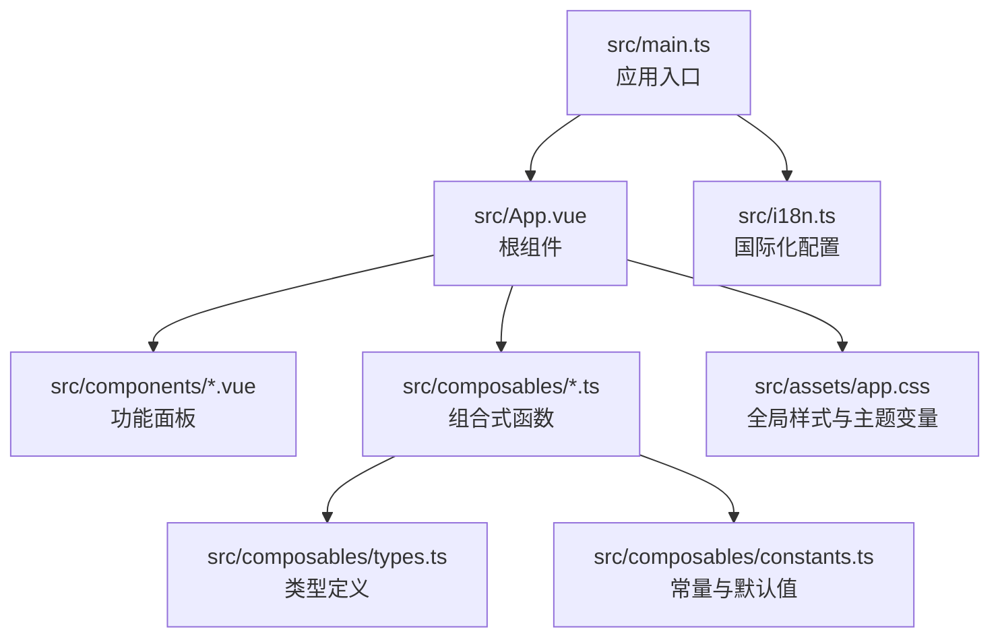
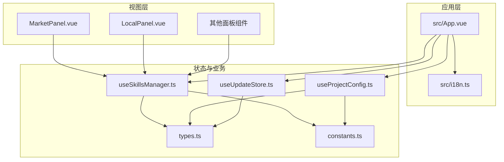
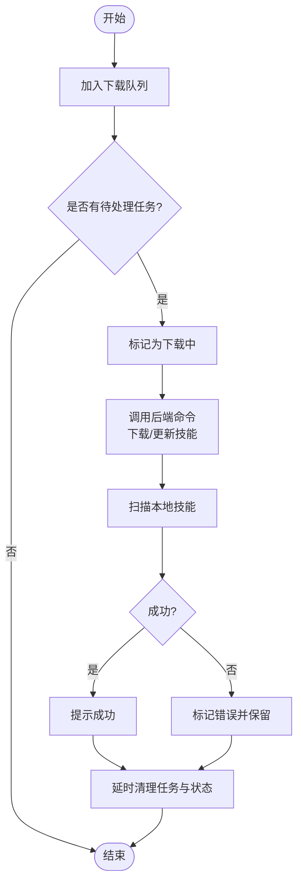
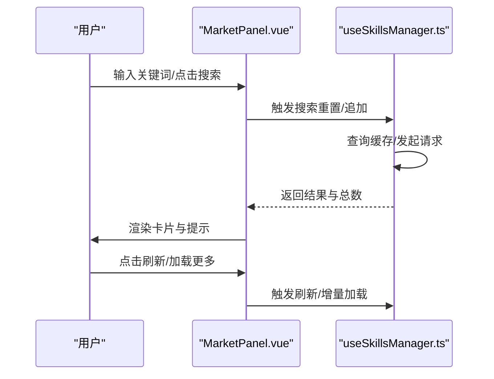
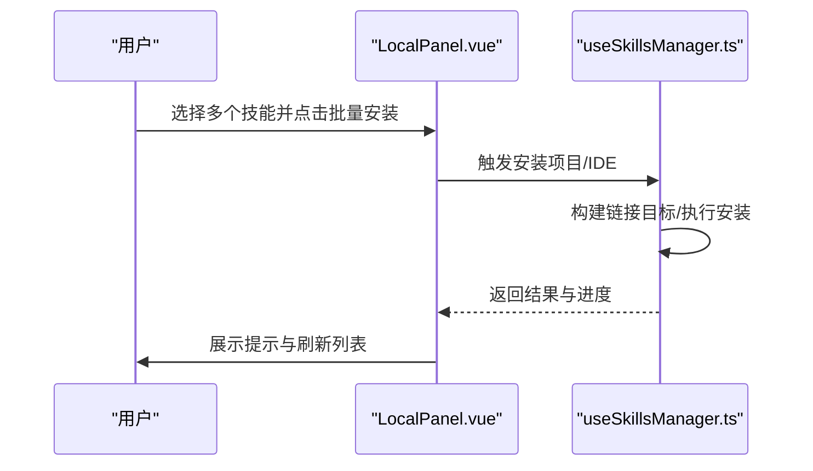
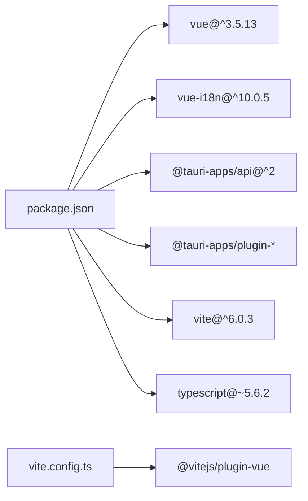

# 前端开发

<cite>
**本文引用的文件**
- [src/main.ts](file://src/main.ts)
- [src/App.vue](file://src/App.vue)
- [src/i18n.ts](file://src/i18n.ts)
- [src/assets/app.css](file://src/assets/app.css)
- [src/composables/types.ts](file://src/composables/types.ts)
- [src/composables/constants.ts](file://src/composables/constants.ts)
- [src/composables/useSkillsManager.ts](file://src/composables/useSkillsManager.ts)
- [src/composables/useProjectConfig.ts](file://src/composables/useProjectConfig.ts)
- [src/composables/useUpdateStore.ts](file://src/composables/useUpdateStore.ts)
- [src/components/MarketPanel.vue](file://src/components/MarketPanel.vue)
- [src/components/LocalPanel.vue](file://src/components/LocalPanel.vue)
- [vite.config.ts](file://vite.config.ts)
- [package.json](file://package.json)
</cite>

## 目录
1. [简介](#简介)
2. [项目结构](#项目结构)
3. [核心组件](#核心组件)
4. [架构总览](#架构总览)
5. [详细组件分析](#详细组件分析)
6. [依赖关系分析](#依赖关系分析)
7. [性能考量](#性能考量)
8. [故障排查指南](#故障排查指南)
9. [结论](#结论)
10. [附录](#附录)

## 简介
本技术指南面向 Skills Manager 前端开发，围绕 Vue 3 组合式 API、组件架构、状态管理与国际化实现进行系统化说明。内容覆盖 TypeScript 类型定义、CSS 架构与响应式设计、组件开发最佳实践、性能优化与调试方法，并提供样式系统、主题定制与可访问性建议，帮助开发者高效构建高质量的桌面应用前端。

## 项目结构
项目采用“按功能分层 + 组合式函数复用”的组织方式：
- 应用入口与国际化：入口文件挂载应用并注入 i18n；国际化配置集中于 i18n 模块，支持多语言消息。
- 组合式函数层：封装业务逻辑与状态，如 useSkillsManager、useProjectConfig、useUpdateStore、useIdeConfig、useMarketConfig、useToast 等，形成可复用的领域能力。
- 组件层：以功能面板为单位拆分，如 MarketPanel、LocalPanel、IdePanel、ProjectsPanel、SettingsPanel 等，通过 props/emit 与组合式函数交互。
- 样式层：全局样式与主题变量集中于 CSS 变量，配合 scoped 样式实现组件隔离与主题切换。

**图表来源**
- [src/main.ts:1-7](file://src/main.ts#L1-L7)
- [src/App.vue:1-633](file://src/App.vue#L1-L633)
- [src/i18n.ts:1-17](file://src/i18n.ts#L1-L17)
- [src/assets/app.css:1-531](file://src/assets/app.css#L1-L531)

**章节来源**
- [src/main.ts:1-7](file://src/main.ts#L1-L7)
- [src/App.vue:1-633](file://src/App.vue#L1-L633)
- [src/i18n.ts:1-17](file://src/i18n.ts#L1-L17)
- [src/assets/app.css:1-531](file://src/assets/app.css#L1-L531)

## 核心组件
- 根组件与主题/语言切换：根组件负责加载用户偏好（主题、语言），初始化国际化与更新检查，并通过组合式函数协调各功能面板。
- 国际化模块：集中管理支持的语言与消息映射，提供运行时切换能力。
- 全局样式与主题变量：通过 CSS 变量在 :root 与 [data-theme] 上定义明暗主题色板，实现一键主题切换与一致的视觉语义。

关键要点
- 主题切换：通过在 html 上设置 data-theme 属性，驱动 CSS 变量切换，实现明暗主题无缝切换。
- 语言切换：监听本地存储与浏览器语言偏好，动态更新 i18n 的全局语言。
- 更新提示：在设置页签显示更新徽标，结合 useUpdateStore 提供静默启动检查与手动检查。

**章节来源**
- [src/App.vue:27-71](file://src/App.vue#L27-L71)
- [src/App.vue:124-142](file://src/App.vue#L124-L142)
- [src/i18n.ts:5-16](file://src/i18n.ts#L5-L16)
- [src/assets/app.css:14-88](file://src/assets/app.css#L14-L88)

## 架构总览
Skills Manager 前端采用“根组件编排 + 组合式函数解耦 + 组件职责清晰”的架构模式。根组件负责状态与生命周期，组合式函数封装业务状态与副作用，组件聚焦 UI 与交互。

**图表来源**
- [src/App.vue:1-202](file://src/App.vue#L1-L202)
- [src/composables/useSkillsManager.ts:1-800](file://src/composables/useSkillsManager.ts#L1-L800)
- [src/composables/useProjectConfig.ts:1-128](file://src/composables/useProjectConfig.ts#L1-L128)
- [src/composables/useUpdateStore.ts:1-158](file://src/composables/useUpdateStore.ts#L1-L158)
- [src/composables/types.ts:1-119](file://src/composables/types.ts#L1-L119)
- [src/composables/constants.ts:1-72](file://src/composables/constants.ts#L1-L72)
- [src/components/MarketPanel.vue:1-192](file://src/components/MarketPanel.vue#L1-L192)
- [src/components/LocalPanel.vue:1-200](file://src/components/LocalPanel.vue#L1-L200)

## 详细组件分析

### 组合式函数：useSkillsManager（技能管理）
职责与能力
- 市场搜索与缓存：支持关键词搜索、分页与排序，内置 10 分钟 TTL 缓存，避免重复请求。
- 下载队列与任务处理：统一管理下载/更新任务，串行处理队列，支持重试与错误展示。
- 本地扫描与 IDE 技能：扫描本地与 IDE 中的技能，生成概览数据，支持批量安装/卸载/纳管。
- 安装目标与项目链接：支持 IDE 全局安装与项目级安装，构建链接目标路径，批量处理。
- 导入/导出/打开目录：集成对话框插件，支持本地技能导入导出与目录打开。
- 任务状态与提示：通过 toast 组件反馈操作结果，维护最近任务状态用于 UI 即时反馈。

关键流程示意（下载/更新队列）

**图表来源**
- [src/composables/useSkillsManager.ts:263-342](file://src/composables/useSkillsManager.ts#L263-L342)
- [src/composables/useSkillsManager.ts:344-351](file://src/composables/useSkillsManager.ts#L344-L351)
- [src/composables/useSkillsManager.ts:353-374](file://src/composables/useSkillsManager.ts#L353-L374)

**章节来源**
- [src/composables/useSkillsManager.ts:190-248](file://src/composables/useSkillsManager.ts#L190-L248)
- [src/composables/useSkillsManager.ts:263-342](file://src/composables/useSkillsManager.ts#L263-L342)
- [src/composables/useSkillsManager.ts:344-351](file://src/composables/useSkillsManager.ts#L344-L351)
- [src/composables/useSkillsManager.ts:353-374](file://src/composables/useSkillsManager.ts#L353-L374)

### 组件：MarketPanel（市场面板）
职责与交互
- 搜索与排序：支持关键词输入、回车触发搜索、刷新与加载更多；提供排序选项（默认/星数/安装量）。
- 结果卡片：展示技能名称、作者、星数、安装量、来源与链接；根据本地是否已安装与队列状态控制按钮文案与禁用态。
- 设置弹窗：打开市场设置弹窗，保存市场配置与启用状态。

交互时序（搜索与刷新）

**图表来源**
- [src/components/MarketPanel.vue:30-39](file://src/components/MarketPanel.vue#L30-L39)
- [src/composables/useSkillsManager.ts:190-248](file://src/composables/useSkillsManager.ts#L190-L248)

**章节来源**
- [src/components/MarketPanel.vue:10-42](file://src/components/MarketPanel.vue#L10-L42)
- [src/components/MarketPanel.vue:44-154](file://src/components/MarketPanel.vue#L44-L154)

### 组件：LocalPanel（本地面板）
职责与交互
- 本地技能列表：支持搜索、全选、批量安装/导出/删除；展示技能来源（已链接/未链接）。
- 下载队列：展示下载/更新任务，支持重试与移除。
- 与根组件协作：通过事件向上派发安装、导入、导出、删除、打开目录等操作。

交互时序（批量安装）

**图表来源**
- [src/components/LocalPanel.vue:74-100](file://src/components/LocalPanel.vue#L74-L100)
- [src/composables/useSkillsManager.ts:414-499](file://src/composables/useSkillsManager.ts#L414-L499)

**章节来源**
- [src/components/LocalPanel.vue:10-28](file://src/components/LocalPanel.vue#L10-L28)
- [src/components/LocalPanel.vue:103-200](file://src/components/LocalPanel.vue#L103-L200)

### 组合式函数：useProjectConfig（项目配置）
职责与能力
- 项目持久化：基于 localStorage 存取项目列表，保证数据在页面刷新后不丢失。
- 项目 CRUD：新增、删除、更新 IDE 目标与检测到的 IDE 目录。
- 项目链接目标：根据 IDE 映射与项目路径生成实际链接目标，支持绝对/相对路径。

**章节来源**
- [src/composables/useProjectConfig.ts:32-128](file://src/composables/useProjectConfig.ts#L32-L128)
- [src/composables/constants.ts:58-71](file://src/composables/constants.ts#L58-L71)

### 组合式函数：useUpdateStore（更新状态）
职责与能力
- 启动检查：应用启动时静默检查更新，有新版本时在设置页签显示徽标。
- 手动检查与下载：提供检查更新、下载与安装重启能力，支持进度反馈与错误处理。

**章节来源**
- [src/composables/useUpdateStore.ts:26-158](file://src/composables/useUpdateStore.ts#L26-L158)

### 类型与常量
- 类型定义：集中于 types.ts，覆盖远程技能、本地技能、IDE 选项、下载任务、项目配置等核心数据模型。
- 常量与默认值：集中于 constants.ts，包括默认 IDE 选项、LocalStorage 键、缓存 TTL、默认市场状态与 IDE 路径映射。

**章节来源**
- [src/composables/types.ts:1-119](file://src/composables/types.ts#L1-L119)
- [src/composables/constants.ts:1-72](file://src/composables/constants.ts#L1-L72)

## 依赖关系分析
- 运行时依赖：Vue 3、Vue I18n、Tauri 插件（dialog、opener、process、updater）。
- 构建工具：Vite 插件 @vitejs/plugin-vue，TypeScript 类型检查与构建。
- 开发脚本：dev/build/preview/tauri/release 等命令，分别对应开发、构建、预览与打包。

**图表来源**
- [package.json:13-29](file://package.json#L13-L29)
- [vite.config.ts:1-33](file://vite.config.ts#L1-L33)

**章节来源**
- [package.json:13-29](file://package.json#L13-L29)
- [vite.config.ts:1-33](file://vite.config.ts#L1-L33)

## 性能考量
- 列表渲染与虚拟滚动：对于大量技能卡片，建议引入虚拟滚动或分页加载，减少一次性渲染节点数量。
- 计算属性与缓存：已利用 computed 与缓存（搜索结果、本地技能集合），避免重复计算；可进一步对昂贵过滤/排序逻辑做节流或去抖。
- 事件与监听：组件内使用 watch 与 onMounted/onUnmounted 管理副作用，注意及时清理定时器与订阅，防止内存泄漏。
- 图片与资源：若后续引入图标/图片，建议使用 SVG 内联或懒加载策略，降低首屏阻塞。
- 样式与主题：CSS 变量切换成本低，但应避免在动画中频繁读写布局属性；必要时使用 transform/opacity 以触发合成层。

## 故障排查指南
常见问题与定位
- 国际化不生效：检查 i18n 初始化与根组件语言绑定是否正确，确认本地存储键是否存在且合法。
- 主题切换异常：确认根组件在 mounted 时设置了 data-theme，并检查 CSS 变量是否被覆盖。
- 搜索无结果：检查 useSkillsManager 的搜索缓存与请求参数，确认 enabledMarkets 与 apiKeys 是否正确。
- 下载/更新失败：查看下载队列中的错误信息与后端返回，结合 toast 提示定位具体原因。
- 项目配置丢失：检查 localStorage 键名与 JSON 结构，确保序列化/反序列化过程无异常。

调试建议
- 使用浏览器开发者工具的 Vue DevTools 观察组件状态与 props/emit。
- 在组合式函数中增加日志输出，定位异步流程中的错误点。
- 对网络请求与后端命令调用增加 try/catch 并统一错误提示。

**章节来源**
- [src/App.vue:50-71](file://src/App.vue#L50-L71)
- [src/composables/useSkillsManager.ts:243-247](file://src/composables/useSkillsManager.ts#L243-L247)
- [src/composables/useProjectConfig.ts:5-26](file://src/composables/useProjectConfig.ts#L5-L26)

## 结论
本项目通过组合式函数实现了业务逻辑与 UI 的清晰分离，配合组件化的面板结构与完善的国际化与主题体系，形成了可扩展、易维护的前端架构。建议在后续迭代中持续关注性能优化与可访问性提升，完善测试与文档，以保障长期演进质量。

## 附录

### 样式系统与主题定制
- 主题变量：通过 :root 与 [data-theme="dark"] 定义颜色变量，组件样式统一引用变量，实现明暗主题自动切换。
- 响应式断点：在小屏设备上调整布局与控件尺寸，保证移动端体验。
- 可访问性：按钮与交互元素提供焦点可见性与键盘可达性，文本对比度满足基本要求。

**章节来源**
- [src/assets/app.css:14-88](file://src/assets/app.css#L14-L88)
- [src/assets/app.css:497-531](file://src/assets/app.css#L497-L531)

### 国际化实现
- 多语言消息：在 locales 目录下维护 zh-CN 与 en-US，i18n 模块集中注册与切换。
- 语言切换：根组件监听本地存储与浏览器语言，动态更新 i18n 全局语言。

**章节来源**
- [src/i18n.ts:1-17](file://src/i18n.ts#L1-L17)
- [src/locales/zh-CN.ts:1-241](file://src/locales/zh-CN.ts#L1-L241)
- [src/locales/en-US.ts:1-241](file://src/locales/en-US.ts#L1-L241)

### 组件开发最佳实践
- 单一职责：每个组件专注于单一功能区域，复杂逻辑下沉至组合式函数。
- Props/Emits：明确输入输出契约，避免隐式依赖；使用 TypeScript 类型约束。
- 事件命名：采用动词短语命名事件，保持与业务动作一致。
- 可测试性：将副作用（如 API 调用）抽象为可注入的函数，便于单元测试替换。

### 可访问性考虑
- 语义化标签：使用语义化 HTML 结构，为交互元素提供 aria-label/title。
- 键盘导航：确保所有可交互元素可通过 Tab 键聚焦，支持 Enter/Space 激活。
- 对比度与字体：保证文本对比度符合 WCAG 基本要求，避免纯色装饰与仅靠颜色传达信息。