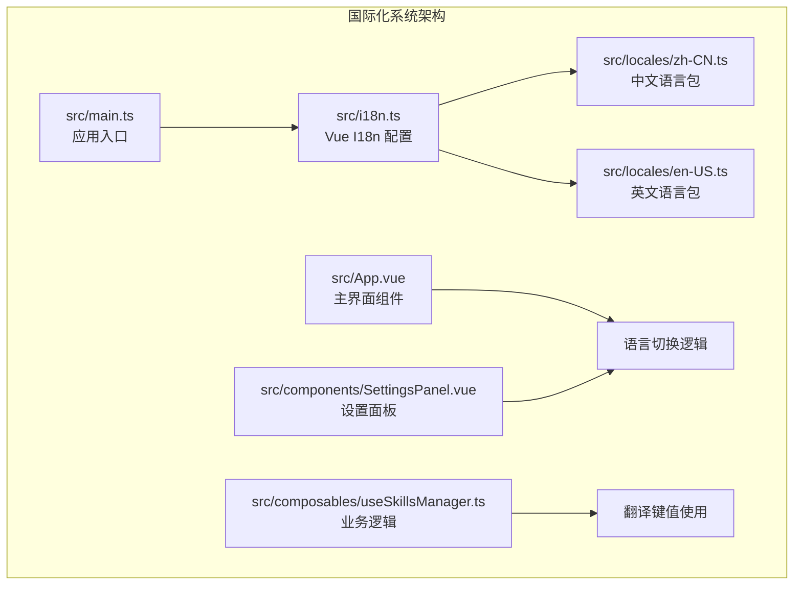
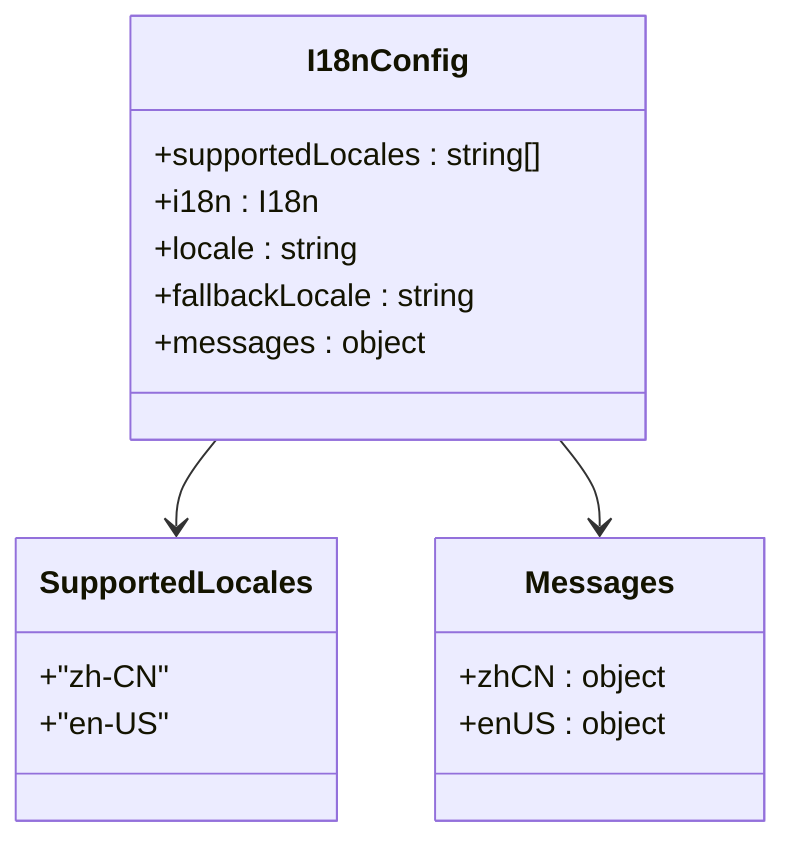
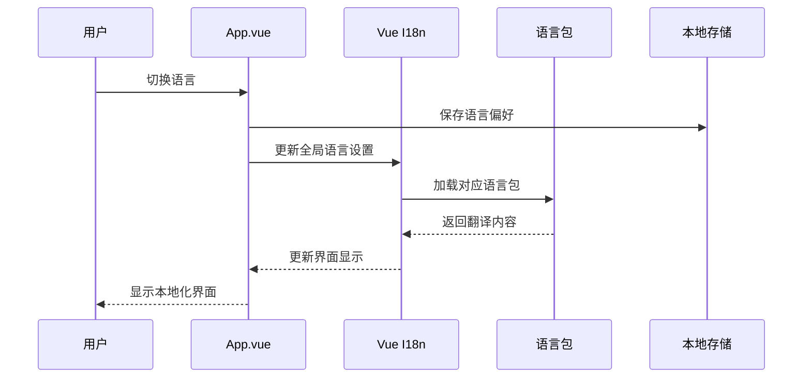
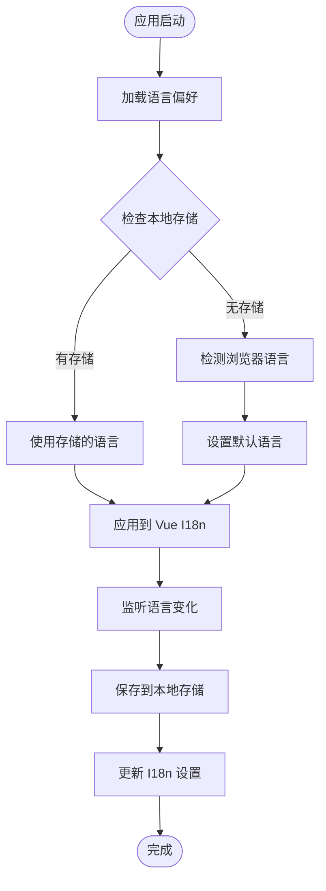
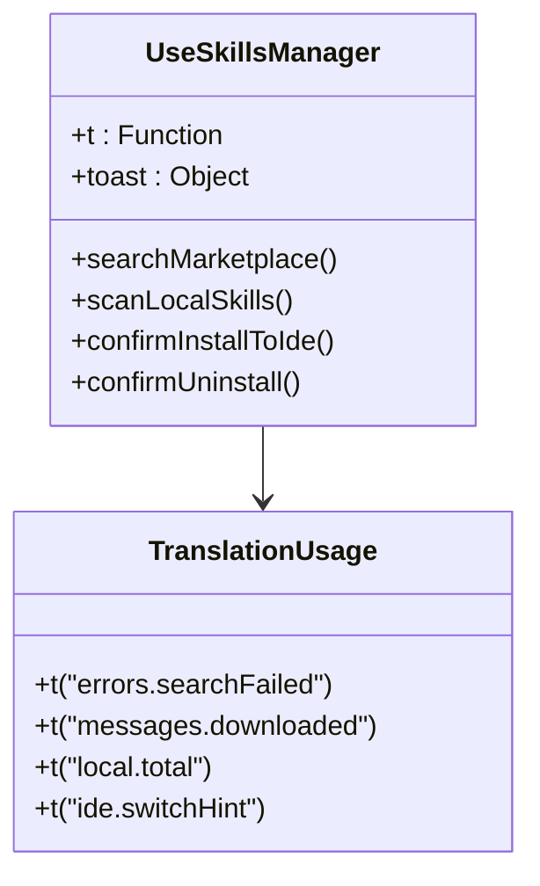
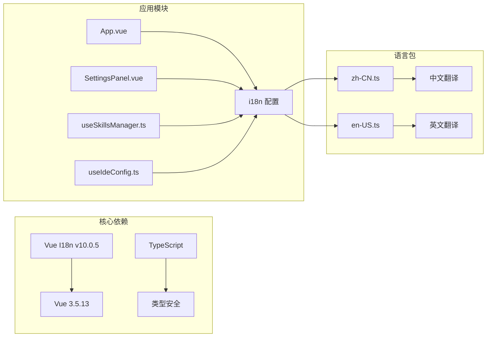

# 国际化实现

<cite>
**本文档引用的文件**
- [src/i18n.ts](file://src/i18n.ts)
- [src/locales/en-US.ts](file://src/locales/en-US.ts)
- [src/locales/zh-CN.ts](file://src/locales/zh-CN.ts)
- [src/main.ts](file://src/main.ts)
- [src/App.vue](file://src/App.vue)
- [src/components/SettingsPanel.vue](file://src/components/SettingsPanel.vue)
- [src/composables/useSkillsManager.ts](file://src/composables/useSkillsManager.ts)
- [src/composables/useIdeConfig.ts](file://src/composables/useIdeConfig.ts)
- [src/composables/constants.ts](file://src/composables/constants.ts)
- [package.json](file://package.json)
</cite>

## 目录
1. [简介](#简介)
2. [项目结构](#项目结构)
3. [核心组件](#核心组件)
4. [架构概览](#架构概览)
5. [详细组件分析](#详细组件分析)
6. [依赖关系分析](#依赖关系分析)
7. [性能考虑](#性能考虑)
8. [故障排除指南](#故障排除指南)
9. [结论](#结论)

## 简介

Skills Manager 采用 Vue I18n 实现国际化功能，支持中文简体（zh-CN）和英语（en-US）两种语言。该系统通过集中式的国际化配置、模块化的语言包结构和动态语言切换机制，为用户提供完整的多语言支持体验。

## 项目结构

国际化系统主要由以下核心文件组成：

**图表来源**
- [src/i18n.ts:1-17](file://src/i18n.ts#L1-L17)
- [src/main.ts:1-7](file://src/main.ts#L1-L7)

**章节来源**
- [src/i18n.ts:1-17](file://src/i18n.ts#L1-L17)
- [src/main.ts:1-7](file://src/main.ts#L1-L7)

## 核心组件

### Vue I18n 配置

国际化系统的核心配置位于 `src/i18n.ts` 文件中，采用现代 Vue I18n v9+ 的组合式 API 模式：

**图表来源**
- [src/i18n.ts:5-16](file://src/i18n.ts#L5-L16)

### 语言包结构

每个语言包都采用层次化的对象结构，按照功能模块进行组织：

| 功能模块 | 中文键值 | 英文键值 |
|---------|---------|---------|
| 应用界面 | `app.tabs.local` | `app.tabs.local` |
| 设置面板 | `settings.appearance.language` | `settings.appearance.language` |
| 市场功能 | `market.searchPlaceholder` | `market.searchPlaceholder` |
| 错误消息 | `errors.searchFailed` | `errors.searchFailed` |

**章节来源**
- [src/i18n.ts:1-17](file://src/i18n.ts#L1-L17)
- [src/locales/en-US.ts:1-241](file://src/locales/en-US.ts#L1-L241)
- [src/locales/zh-CN.ts:1-241](file://src/locales/zh-CN.ts#L1-L241)

## 架构概览

国际化系统采用分层架构设计，确保代码的可维护性和扩展性：

**图表来源**
- [src/App.vue:37-66](file://src/App.vue#L37-L66)
- [src/components/SettingsPanel.vue:83-105](file://src/components/SettingsPanel.vue#L83-L105)

## 详细组件分析

### 应用级语言切换

主应用组件实现了完整的语言检测和切换机制：

**图表来源**
- [src/App.vue:37-66](file://src/App.vue#L37-L66)

### 设置面板集成

设置面板提供了用户友好的语言切换界面：

| 组件元素 | 功能描述 | 语言键值 |
|---------|---------|---------|
| 主题切换 | 切换明暗主题模式 | `settings.appearance.theme` |
| 语言按钮 | 切换中英文界面 | `settings.appearance.language` |
| 版本信息 | 显示应用版本信息 | `settings.about.version` |
| 更新检查 | 检查软件更新状态 | `settings.update.checkForUpdates` |

**章节来源**
- [src/components/SettingsPanel.vue:1-570](file://src/components/SettingsPanel.vue#L1-L570)

### 业务逻辑中的翻译使用

业务逻辑组件通过 `useI18n` 组合式函数使用翻译：

**图表来源**
- [src/composables/useSkillsManager.ts:21](file://src/composables/useSkillsManager.ts#L21)

**章节来源**
- [src/composables/useSkillsManager.ts:1-800](file://src/composables/useSkillsManager.ts#L1-L800)

### 语言包实现细节

#### 中文语言包（zh-CN）
- 包含 241 行翻译键值
- 覆盖应用界面、设置面板、市场功能等所有模块
- 使用中文语境下的表达方式

#### 英文语言包（en-US）
- 结构与中文包完全对应
- 提供标准英文翻译
- 保持与中文包一致的键值层次结构

**章节来源**
- [src/locales/zh-CN.ts:1-241](file://src/locales/zh-CN.ts#L1-L241)
- [src/locales/en-US.ts:1-241](file://src/locales/en-US.ts#L1-L241)

## 依赖关系分析

国际化系统与其他模块的依赖关系如下：

**图表来源**
- [package.json:13-21](file://package.json#L13-L21)

**章节来源**
- [package.json:1-30](file://package.json#L1-30)

## 性能考虑

### 缓存机制
- 语言包作为静态导入，避免运行时解析开销
- 本地存储缓存用户语言偏好，减少每次启动的检测成本
- Vue I18n 内置的响应式更新机制确保界面快速响应

### 优化建议
- 对于大型应用，可考虑按需加载语言包
- 实现语言包的懒加载以减少初始包体积
- 使用 CDN 分发语言包以提高加载速度

## 故障排除指南

### 常见问题及解决方案

| 问题类型 | 症状 | 解决方案 |
|---------|------|---------|
| 语言切换无效 | 界面不更新 | 检查 `i18n.global.locale.value` 设置 |
| 翻译缺失 | 显示键值而非翻译 | 验证语言包中是否存在对应键值 |
| 默认语言错误 | 启动时显示错误语言 | 检查 `navigator.language` 检测逻辑 |
| 本地存储异常 | 语言偏好丢失 | 验证 `localStorage` 可用性和权限 |

### 调试技巧
1. 在浏览器开发者工具中检查 `i18n.global.locale.value` 的值
2. 验证语言包导入是否正确
3. 检查本地存储中的语言偏好设置
4. 使用 Vue DevTools 观察响应式数据变化

**章节来源**
- [src/App.vue:37-66](file://src/App.vue#L37-L66)
- [src/components/SettingsPanel.vue:83-105](file://src/components/SettingsPanel.vue#L83-L105)

## 结论

Skills Manager 的国际化系统通过精心设计的架构和实现，为用户提供了流畅的多语言体验。系统采用现代化的 Vue I18n 配置，结合模块化的语言包结构和智能的语言检测机制，确保了良好的可维护性和扩展性。

### 主要优势
- **模块化设计**：清晰的功能模块划分便于维护
- **类型安全**：TypeScript 类型定义确保键值完整性
- **用户友好**：直观的语言切换界面和智能检测
- **性能优化**：静态导入和响应式更新机制

### 扩展建议
- 支持更多语言和地区
- 实现动态语言包加载
- 添加翻译贡献者工具
- 集成机器翻译辅助功能

该国际化系统为 Skills Manager 提供了坚实的基础，能够满足当前和未来的多语言需求。