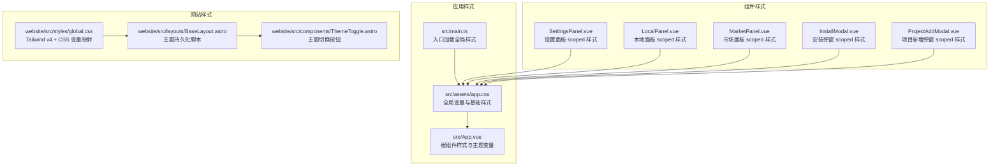
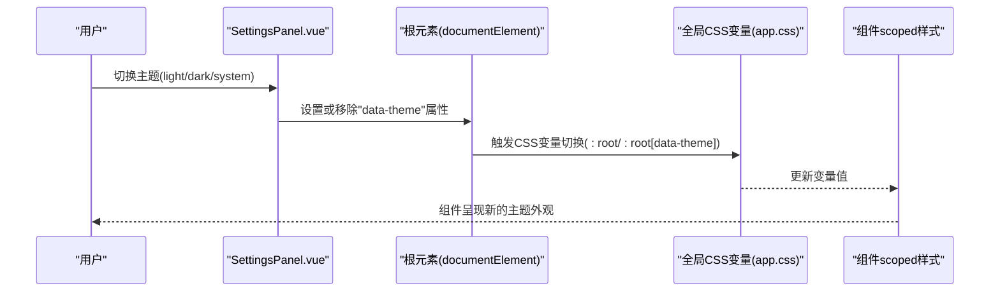
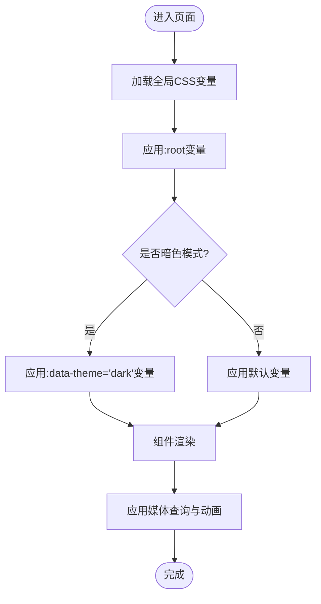
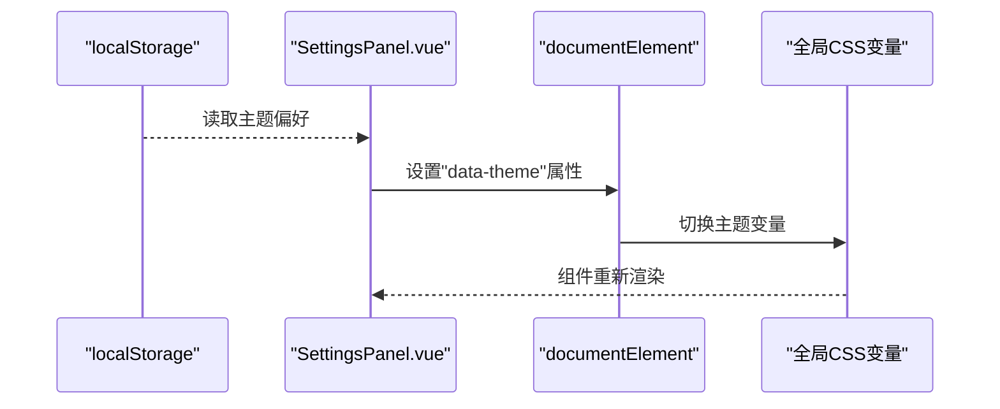
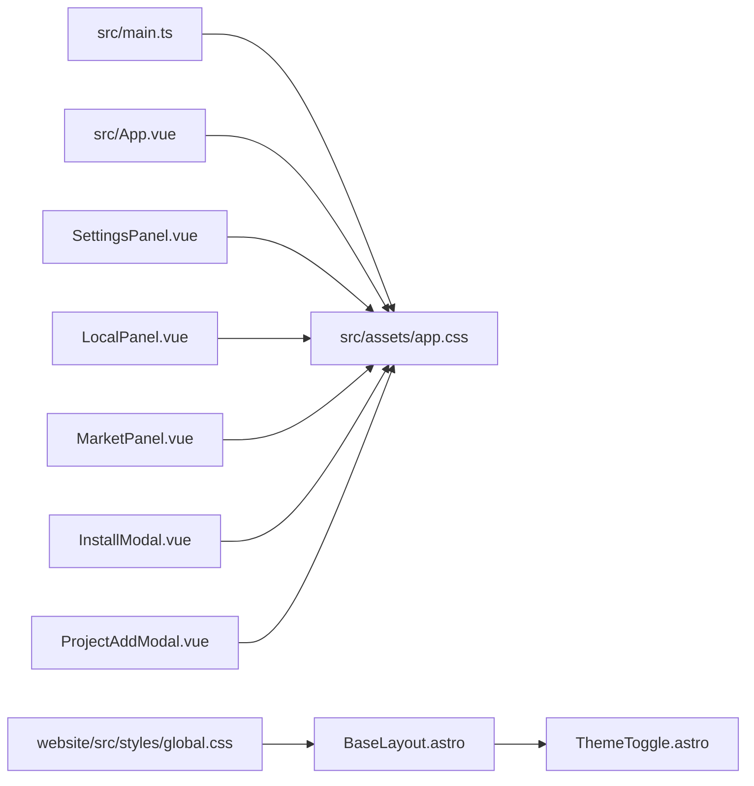

# 样式系统

<cite>
**本文档引用的文件**
- [src/assets/app.css](file://src/assets/app.css)
- [src/App.vue](file://src/App.vue)
- [src/main.ts](file://src/main.ts)
- [index.html](file://index.html)
- [vite.config.ts](file://vite.config.ts)
- [package.json](file://package.json)
- [src/components/SettingsPanel.vue](file://src/components/SettingsPanel.vue)
- [src/components/LocalPanel.vue](file://src/components/LocalPanel.vue)
- [src/components/MarketPanel.vue](file://src/components/MarketPanel.vue)
- [src/components/InstallModal.vue](file://src/components/InstallModal.vue)
- [src/components/ProjectAddModal.vue](file://src/components/ProjectAddModal.vue)
- [website/src/styles/global.css](file://website/src/styles/global.css)
- [website/src/layouts/BaseLayout.astro](file://website/src/layouts/BaseLayout.astro)
- [website/src/components/ThemeToggle.astro](file://website/src/components/ThemeToggle.astro)
</cite>

## 目录
1. [简介](#简介)
2. [项目结构](#项目结构)
3. [核心组件](#核心组件)
4. [架构总览](#架构总览)
5. [详细组件分析](#详细组件分析)
6. [依赖关系分析](#依赖关系分析)
7. [性能考量](#性能考量)
8. [故障排查指南](#故障排查指南)
9. [结论](#结论)
10. [附录](#附录)

## 简介
本文件面向 Skills Manager 的样式系统，提供从架构设计到实现细节的完整技术文档。内容覆盖 CSS 架构与组织原则、命名规范、全局样式与组件样式的分离策略、CSS 变量与主题定制机制、响应式与移动端适配、暗色模式支持、样式优化与性能考虑、浏览器兼容性处理、样式模块化与 CSS-in-JS 选择建议、动画与过渡效果实现，以及如何维护一致的视觉设计与可扩展的样式架构。

## 项目结构
Styles Manager 的样式体系由三部分构成：
- 应用内样式：以全局 CSS 变量为核心，配合组件级 scoped 样式实现主题与布局。
- 网站样式（website）：采用 Tailwind v4 与自定义 CSS 变量映射，形成网站侧的主题与动画体系。
- 主题切换：通过在根元素设置 data-theme 或 CSS 类名，驱动主题变量切换。

**图表来源**
- [src/assets/app.css:1-531](file://src/assets/app.css#L1-L531)
- [src/App.vue:402-633](file://src/App.vue#L402-L633)
- [src/main.ts:1-7](file://src/main.ts#L1-L7)
- [src/components/SettingsPanel.vue:269-570](file://src/components/SettingsPanel.vue#L269-L570)
- [src/components/LocalPanel.vue:222-310](file://src/components/LocalPanel.vue#L222-L310)
- [src/components/MarketPanel.vue:156-192](file://src/components/MarketPanel.vue#L156-L192)
- [src/components/InstallModal.vue:183-267](file://src/components/InstallModal.vue#L183-L267)
- [src/components/ProjectAddModal.vue:161-249](file://src/components/ProjectAddModal.vue#L161-L249)
- [website/src/styles/global.css:1-214](file://website/src/styles/global.css#L1-L214)
- [website/src/layouts/BaseLayout.astro:77-113](file://website/src/layouts/BaseLayout.astro#L77-L113)
- [website/src/components/ThemeToggle.astro:1-41](file://website/src/components/ThemeToggle.astro#L1-L41)

**章节来源**
- [src/assets/app.css:1-531](file://src/assets/app.css#L1-L531)
- [src/App.vue:402-633](file://src/App.vue#L402-L633)
- [src/main.ts:1-7](file://src/main.ts#L1-L7)
- [website/src/styles/global.css:1-214](file://website/src/styles/global.css#L1-L214)
- [website/src/layouts/BaseLayout.astro:77-113](file://website/src/layouts/BaseLayout.astro#L77-L113)
- [website/src/components/ThemeToggle.astro:1-41](file://website/src/components/ThemeToggle.astro#L1-L41)

## 核心组件
- 全局 CSS 变量与基础样式：集中于全局样式文件，定义明/暗两套主题变量，并提供基础排版、布局与交互态。
- 根组件样式：在根组件中注入主题变量与基础重置，确保全应用一致性。
- 组件 scoped 样式：各组件内部使用 scoped 样式，结合全局变量实现局部主题渲染。
- 网站样式：独立于应用，采用 Tailwind v4 与 CSS 变量映射，提供网站侧主题与动画。

**章节来源**
- [src/assets/app.css:1-531](file://src/assets/app.css#L1-L531)
- [src/App.vue:402-633](file://src/App.vue#L402-L633)
- [src/components/SettingsPanel.vue:269-570](file://src/components/SettingsPanel.vue#L269-L570)
- [website/src/styles/global.css:1-214](file://website/src/styles/global.css#L1-L214)

## 架构总览
样式系统采用“全局变量 + 组件 scoped 样式”的分层架构：
- 全局层：定义主题变量与通用基础样式，保证跨组件一致性。
- 组件层：通过 scoped 样式读取全局变量，实现组件内的主题渲染与局部布局。
- 主题切换：通过在根元素设置 data-theme 或 CSS 类名，驱动全局变量切换，从而影响所有组件。

**图表来源**
- [src/components/SettingsPanel.vue:62-72](file://src/components/SettingsPanel.vue#L62-L72)
- [src/App.vue:33-35](file://src/App.vue#L33-L35)
- [src/assets/app.css:52-88](file://src/assets/app.css#L52-L88)

**章节来源**
- [src/components/SettingsPanel.vue:62-72](file://src/components/SettingsPanel.vue#L62-L72)
- [src/App.vue:33-35](file://src/App.vue#L33-L35)
- [src/assets/app.css:52-88](file://src/assets/app.css#L52-L88)

## 详细组件分析

### 全局样式与主题变量
- 主题变量：明/暗两套变量，分别在根元素与根组件中定义，确保默认与覆盖场景的一致性。
- 基础样式：包括排版、滚动条、动画与媒体查询等，统一应用的基础外观与交互体验。
- 响应式：针对移动端宽度进行断点调整，保证在小屏设备上的可用性。

**图表来源**
- [src/assets/app.css:1-531](file://src/assets/app.css#L1-L531)
- [src/App.vue:402-493](file://src/App.vue#L402-L493)

**章节来源**
- [src/assets/app.css:1-531](file://src/assets/app.css#L1-L531)
- [src/App.vue:402-493](file://src/App.vue#L402-L493)

### 组件样式组织与命名规范
- 组件样式：每个组件使用 scoped 样式，避免样式泄漏；通过类名前缀区分容器、标题、列表、按钮等语义块。
- 布局类：采用语义化命名，如 panel、cards、search-row、actions 等，便于维护与复用。
- 交互态：hover、focus、active 等状态通过统一的过渡与阴影变量控制，保持一致的动效体验。

**章节来源**
- [src/components/SettingsPanel.vue:269-570](file://src/components/SettingsPanel.vue#L269-L570)
- [src/components/LocalPanel.vue:222-310](file://src/components/LocalPanel.vue#L222-L310)
- [src/components/MarketPanel.vue:156-192](file://src/components/MarketPanel.vue#L156-L192)
- [src/components/InstallModal.vue:183-267](file://src/components/InstallModal.vue#L183-L267)
- [src/components/ProjectAddModal.vue:161-249](file://src/components/ProjectAddModal.vue#L161-L249)

### 主题定制机制
- 主题键值：应用内通过 data-theme 属性切换主题；网站侧通过 CSS 类名切换。
- 持久化：主题偏好存储于本地存储，启动时读取并应用。
- 系统跟随：支持根据系统偏好自动切换主题。

**图表来源**
- [src/components/SettingsPanel.vue:75-129](file://src/components/SettingsPanel.vue#L75-L129)
- [src/App.vue:44-71](file://src/App.vue#L44-L71)
- [src/assets/app.css:52-88](file://src/assets/app.css#L52-L88)

**章节来源**
- [src/components/SettingsPanel.vue:75-129](file://src/components/SettingsPanel.vue#L75-L129)
- [src/App.vue:44-71](file://src/App.vue#L44-L71)
- [src/assets/app.css:52-88](file://src/assets/app.css#L52-L88)

### 响应式设计与移动端适配
- 断点策略：在全局样式中定义移动端断点，对头部、搜索行、选择器等关键区域进行自适应布局。
- 动画降级：尊重用户的“减少动态”偏好，自动禁用动画与过渡，提升可访问性。

**章节来源**
- [src/assets/app.css:497-530](file://src/assets/app.css#L497-L530)
- [src/components/SettingsPanel.vue:550-568](file://src/components/SettingsPanel.vue#L550-L568)

### 动画与过渡效果
- 进度条动画：使用关键帧实现进度条的位移动画，增强下载/更新过程的反馈感。
- 网站侧动画：网站样式中定义淡入与滑上等关键帧，配合 Tailwind 动画变量使用。

**章节来源**
- [src/assets/app.css:487-495](file://src/assets/app.css#L487-L495)
- [website/src/styles/global.css:181-199](file://website/src/styles/global.css#L181-L199)

### 样式模块化与 CSS-in-JS 选择
- 当前实现：采用 CSS-in-CSS（全局 CSS + Vue 单文件组件 scoped 样式），简洁直观，易于维护。
- 扩展建议：若未来需要更细粒度的主题控制或运行时样式计算，可评估引入轻量 CSS-in-JS 方案（如 styled-components 风格的库），但需权衡打包体积与构建复杂度。

**章节来源**
- [src/assets/app.css:1-531](file://src/assets/app.css#L1-L531)
- [src/App.vue:402-633](file://src/App.vue#L402-L633)

## 依赖关系分析
- 入口依赖：应用入口在挂载前导入全局样式，确保主题变量在组件渲染前已就绪。
- 组件依赖：各组件通过 scoped 样式引用全局变量，形成松耦合的样式依赖关系。
- 网站依赖：网站样式独立于应用，通过 Astro 布局注入全局样式与主题脚本。

**图表来源**
- [src/main.ts:1-7](file://src/main.ts#L1-L7)
- [src/assets/app.css:1-531](file://src/assets/app.css#L1-L531)
- [src/App.vue:402-633](file://src/App.vue#L402-L633)
- [src/components/SettingsPanel.vue:269-570](file://src/components/SettingsPanel.vue#L269-L570)
- [src/components/LocalPanel.vue:222-310](file://src/components/LocalPanel.vue#L222-L310)
- [src/components/MarketPanel.vue:156-192](file://src/components/MarketPanel.vue#L156-L192)
- [src/components/InstallModal.vue:183-267](file://src/components/InstallModal.vue#L183-L267)
- [src/components/ProjectAddModal.vue:161-249](file://src/components/ProjectAddModal.vue#L161-L249)
- [website/src/styles/global.css:1-214](file://website/src/styles/global.css#L1-L214)
- [website/src/layouts/BaseLayout.astro:77-113](file://website/src/layouts/BaseLayout.astro#L77-L113)
- [website/src/components/ThemeToggle.astro:1-41](file://website/src/components/ThemeToggle.astro#L1-L41)

**章节来源**
- [src/main.ts:1-7](file://src/main.ts#L1-L7)
- [src/assets/app.css:1-531](file://src/assets/app.css#L1-L531)
- [website/src/styles/global.css:1-214](file://website/src/styles/global.css#L1-L214)

## 性能考量
- 样式体积：全局变量集中管理，避免重复定义，降低 CSS 体积。
- 渲染性能：组件样式使用 scoped，减少样式冲突与回流；动画与过渡使用 CSS 变量与 transform，避免昂贵的布局重排。
- 加载顺序：入口先加载全局样式，再挂载组件，确保主题变量在首屏即生效。
- 浏览器兼容：通过 CSS 变量与现代 CSS 特性组合，在主流浏览器上获得良好表现；对不支持的环境可通过 polyfill 或降级策略处理。

[本节为通用性能指导，无需特定文件引用]

## 故障排查指南
- 主题未生效
  - 检查根元素是否正确设置了 data-theme 属性。
  - 确认全局 CSS 变量已加载且未被覆盖。
- 动画异常
  - 检查是否启用了“减少动态”偏好导致动画被禁用。
  - 确认关键帧定义存在且未被覆盖。
- 响应式布局错乱
  - 检查媒体查询断点是否按预期触发。
  - 确认容器布局类（如 cards、search-row）未被外部样式覆盖。

**章节来源**
- [src/App.vue:33-35](file://src/App.vue#L33-L35)
- [src/assets/app.css:525-530](file://src/assets/app.css#L525-L530)
- [src/assets/app.css:497-530](file://src/assets/app.css#L497-L530)

## 结论
Skills Manager 的样式系统以全局 CSS 变量为核心，结合组件 scoped 样式与主题切换机制，实现了清晰的层次结构与良好的可维护性。通过统一的命名规范、响应式断点与动画策略，系统在桌面与移动端均提供了稳定的视觉与交互体验。未来可在保持现有架构优势的基础上，按需引入更灵活的样式管理方案，持续提升可扩展性与开发效率。

[本节为总结性内容，无需特定文件引用]

## 附录
- 入口与构建配置：应用通过 Vite 构建，Vue 插件用于单文件组件编译；入口脚本负责加载全局样式。
- 依赖管理：应用依赖 Vue 与相关插件，网站侧使用 Tailwind v4 与 Astro。

**章节来源**
- [vite.config.ts:1-33](file://vite.config.ts#L1-L33)
- [package.json:1-30](file://package.json#L1-L30)
- [index.html:1-15](file://index.html#L1-L15)