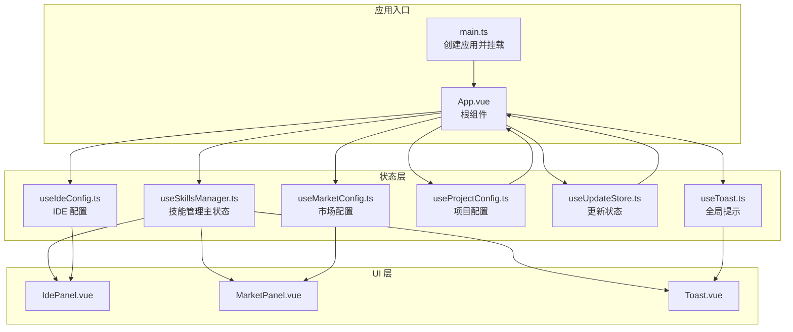
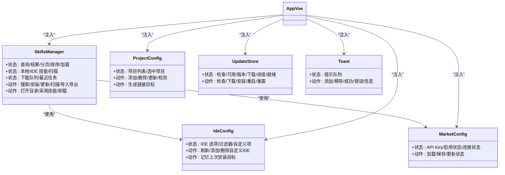
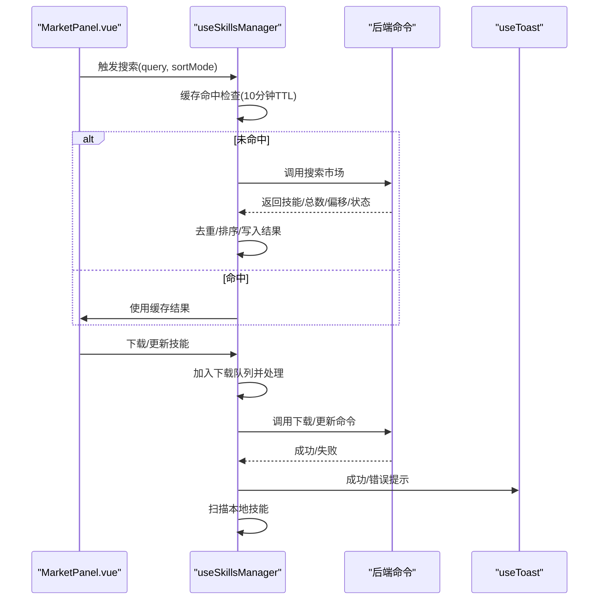
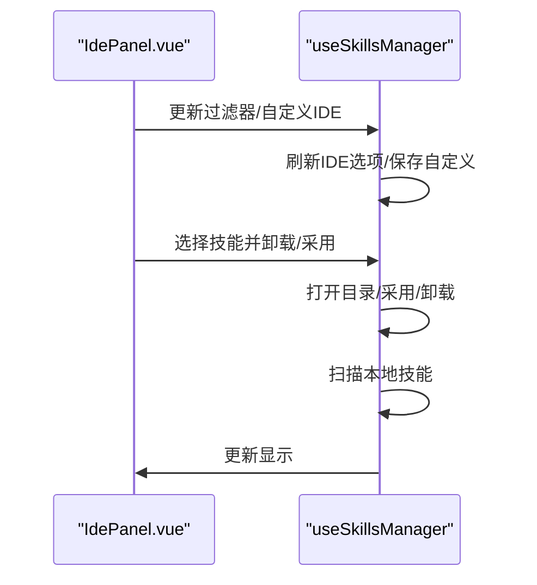
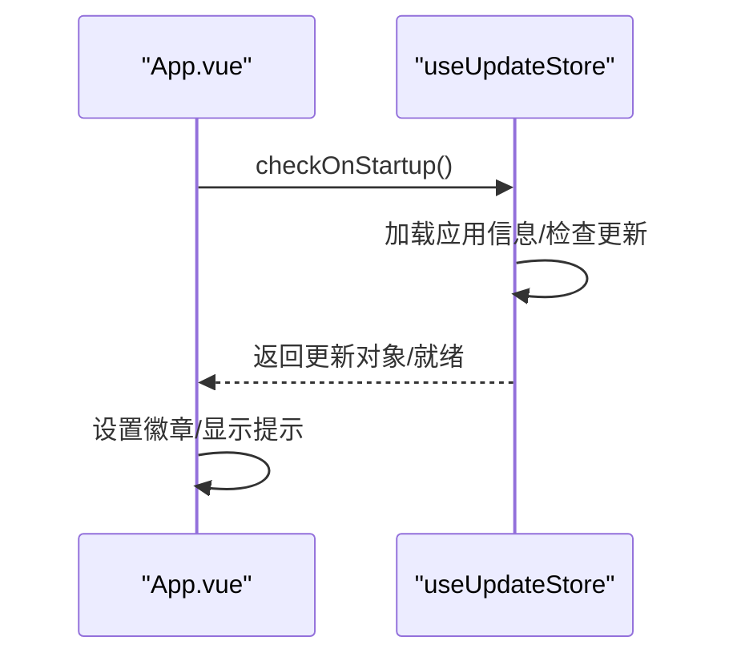
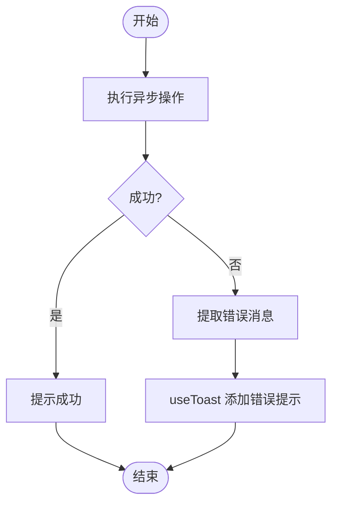
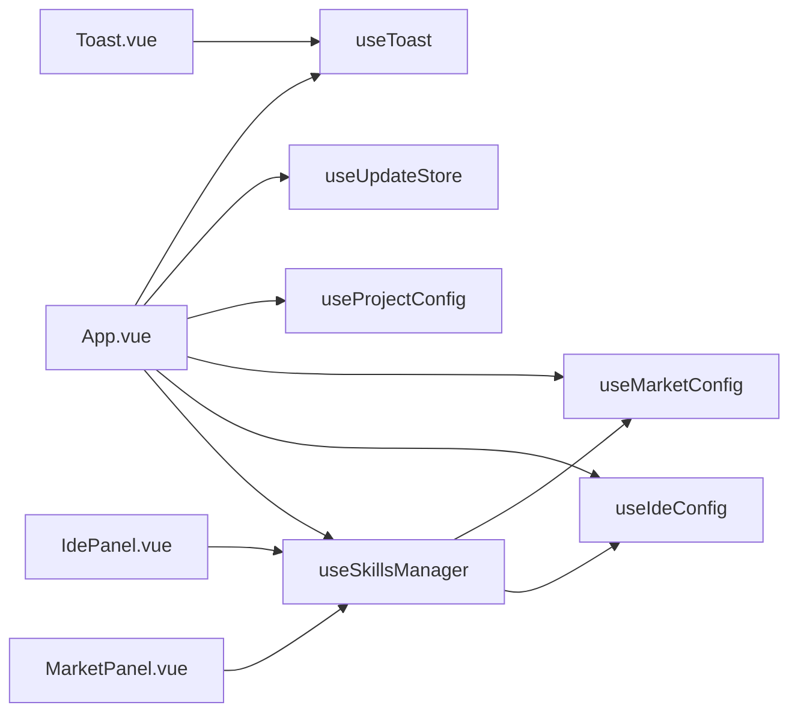

# 状态管理

<cite>
**本文引用的文件列表**
- [useSkillsManager.ts](file://src/composables/useSkillsManager.ts)
- [useIdeConfig.ts](file://src/composables/useIdeConfig.ts)
- [useMarketConfig.ts](file://src/composables/useMarketConfig.ts)
- [useProjectConfig.ts](file://src/composables/useProjectConfig.ts)
- [useUpdateStore.ts](file://src/composables/useUpdateStore.ts)
- [types.ts](file://src/composables/types.ts)
- [constants.ts](file://src/composables/constants.ts)
- [utils.ts](file://src/composables/utils.ts)
- [useToast.ts](file://src/composables/useToast.ts)
- [App.vue](file://src/App.vue)
- [IdePanel.vue](file://src/components/IdePanel.vue)
- [MarketPanel.vue](file://src/components/MarketPanel.vue)
- [Toast.vue](file://src/components/Toast.vue)
- [main.ts](file://src/main.ts)
</cite>

## 目录
1. [简介](#简介)
2. [项目结构与状态管理概览](#项目结构与状态管理概览)
3. [核心状态管理模块](#核心状态管理模块)
4. [架构总览](#架构总览)
5. [关键组件与状态交互分析](#关键组件与状态交互分析)
6. [依赖关系分析](#依赖关系分析)
7. [性能与优化建议](#性能与优化建议)
8. [调试与故障排查](#调试与故障排查)
9. [结论](#结论)
10. [附录：最佳实践清单](#附录最佳实践清单)

## 简介
本技术指南聚焦 Skills Manager 的状态管理系统，系统性解析组合式函数（Composables）的设计模式与实现原理，覆盖以下核心模块：
- useSkillsManager：技能管理主状态，负责市场搜索、下载队列、本地扫描、安装卸载、导入导出、目录打开等
- useIdeConfig：IDE 配置状态，支持默认与自定义 IDE 目录、上次安装目标记忆
- useMarketConfig：市场配置状态，保存各市场的 API Key、启用状态与连接状态
- useProjectConfig：项目配置状态，管理项目集合、IDE 目标映射与检测结果
- useUpdateStore：应用更新状态，检查更新、下载安装、重启与状态重置
- useToast：全局提示状态，统一管理成功/错误/信息提示

文档将从响应式设计原则、状态持久化策略、异步处理流程、状态共享与同步、性能优化与调试方法等方面进行深入剖析，并提供可操作的最佳实践。

## 项目结构与状态管理概览
- 状态集中在 src/composables 下以组合式函数形式提供，每个模块封装独立的响应式状态与动作
- 组件通过在模板中直接使用组合式返回的状态与事件，形成“状态-视图”单向数据流
- App.vue 作为根组件，集中注入与调度多个组合式，实现跨面板的状态共享与同步

图表来源
- [main.ts:1-7](file://src/main.ts#L1-L7)
- [App.vue:1-200](file://src/App.vue#L1-L200)
- [useSkillsManager.ts:1-120](file://src/composables/useSkillsManager.ts#L1-L120)
- [useIdeConfig.ts:1-131](file://src/composables/useIdeConfig.ts#L1-L131)
- [useMarketConfig.ts:1-67](file://src/composables/useMarketConfig.ts#L1-L67)
- [useProjectConfig.ts:1-128](file://src/composables/useProjectConfig.ts#L1-L128)
- [useUpdateStore.ts:1-158](file://src/composables/useUpdateStore.ts#L1-L158)
- [useToast.ts:1-55](file://src/composables/useToast.ts#L1-L55)
- [IdePanel.vue:1-200](file://src/components/IdePanel.vue#L1-L200)
- [MarketPanel.vue:1-192](file://src/components/MarketPanel.vue#L1-L192)
- [Toast.vue:1-81](file://src/components/Toast.vue#L1-L81)

章节来源
- [main.ts:1-7](file://src/main.ts#L1-L7)
- [App.vue:1-200](file://src/App.vue#L1-L200)

## 核心状态管理模块
本节对五个核心组合式逐一解析其设计原则、数据结构、异步处理与持久化策略。

### useSkillsManager：技能管理主状态
- 响应式状态
  - 搜索与市场：查询词、结果集、总数、分页、排序模式、加载态、正在安装/更新标识
  - 本地与 IDE 技能：本地技能列表、IDE 技能列表、本地扫描加载态
  - 下载队列：任务队列、处理标志、最近任务状态
  - 安装/卸载弹窗：目标技能、目标 IDE 列表、卸载路径与模式
  - 全局忙碌态与提示文本
- 关键计算属性
  - hasMore：基于结果数与总数判断是否还有更多
  - sortedResults：按默认/星数/安装量排序的结果集
  - localSkillNameSet：本地技能名标准化集合，用于去重与已安装状态判断
- 异步处理
  - 市场搜索：带缓存（10 分钟 TTL）的去重搜索，支持重置与强制刷新
  - 下载队列：串行处理 pending 任务，支持错误重试、完成清理定时器
  - 本地扫描：调用后端扫描接口，更新本地与 IDE 技能
  - 安装/卸载/导入/导出/目录打开：统一通过 invoke 调用后端命令，错误统一转为提示
- 状态持久化
  - 依赖 useIdeConfig 与 useMarketConfig 的持久化能力（localStorage）
  - 下载队列与最近任务状态为内存态，随页面生命周期存在
- 生命周期
  - onMounted：刷新 IDE 选项、加载市场配置、初始化搜索与扫描

章节来源
- [useSkillsManager.ts:1-867](file://src/composables/useSkillsManager.ts#L1-L867)
- [types.ts:1-119](file://src/composables/types.ts#L1-L119)
- [constants.ts:1-72](file://src/composables/constants.ts#L1-L72)
- [utils.ts:1-125](file://src/composables/utils.ts#L1-L125)

### useIdeConfig：IDE 配置状态
- 响应式状态
  - ideOptions：IDE 选项列表（默认+自定义）
  - selectedIdeFilter：当前选中的 IDE 过滤器
  - customIdeName/customIdeDir：自定义 IDE 名称与目录输入
  - customIdeOptions：仅自定义的 IDE 选项集合
- 动作
  - refreshIdeOptions：从 localStorage 加载并校验，回退到默认值
  - addCustomIde：校验路径合法性与名称唯一性，保存并刷新
  - removeCustomIde：移除指定自定义项并保存
  - loadLastInstallTargets/saveLastInstallTargets：记录上次安装目标 IDE 列表
- 持久化
  - 使用 STORAGE_KEYS.IDE_OPTIONS 与 INSTALL_TARGETS 存储

章节来源
- [useIdeConfig.ts:1-131](file://src/composables/useIdeConfig.ts#L1-L131)
- [constants.ts:1-72](file://src/composables/constants.ts#L1-L72)
- [utils.ts:1-125](file://src/composables/utils.ts#L1-L125)

### useMarketConfig：市场配置状态
- 响应式状态
  - marketConfigs：各市场 API Key 映射
  - enabledMarkets：各市场启用状态映射
  - marketStatuses：市场连接状态数组（在线/错误/需要密钥）
- 动作
  - loadMarketConfigs：从 localStorage 解析并回退默认值
  - saveMarketConfigs：保存配置与启用状态
  - updateMarketStatuses：从后端响应更新状态
- 持久化
  - 使用 STORAGE_KEYS.MARKET_CONFIGS 与 ENABLED_MARKETS 存储

章节来源
- [useMarketConfig.ts:1-67](file://src/composables/useMarketConfig.ts#L1-L67)
- [constants.ts:1-72](file://src/composables/constants.ts#L1-L72)

### useProjectConfig：项目配置状态
- 响应式状态
  - projects：项目列表（含 IDE 目标与检测结果）
  - selectedProjectId：当前选中项目 ID
- 动作
  - loadProjects：从 localStorage 加载并设置默认选中
  - addProject：生成唯一 ID，排序保存，设置为当前选中
  - removeProject：移除并保存，必要时切换选中
  - updateProjectIdeTargets/updateDetectedIdeDirs：更新项目 IDE 目标与检测结果
  - getProjectLinkTargets：根据项目与 IDE 映射生成链接目标
- 持久化
  - 使用 STORAGE_KEYS.PROJECTS 存储

章节来源
- [useProjectConfig.ts:1-128](file://src/composables/useProjectConfig.ts#L1-L128)
- [constants.ts:1-72](file://src/composables/constants.ts#L1-L72)

### useUpdateStore：应用更新状态
- 响应式状态
  - checking、updateAvailable、latestVersion、downloading、downloadProgress、downloaded、upToDate、error
  - appName、currentVersion
- 动作
  - checkUpdate：检查更新，设置 loading 与错误状态
  - checkOnStartup：启动静默检查，仅在有更新时置位
  - downloadUpdate：下载并安装，进度事件驱动
  - installAndRestart：重启应用
  - resetState：重置非持久化状态
- 持久化
  - 应用信息通过 Tauri 插件读取，状态为内存态

章节来源
- [useUpdateStore.ts:1-158](file://src/composables/useUpdateStore.ts#L1-L158)

### useToast：全局提示状态
- 响应式状态
  - toasts：只读提示消息队列
- 动作
  - add/remove：添加与移除提示
  - success/error/info：便捷方法，带默认时长
- 持久化
  - 无持久化，消息在组件销毁或超时后自动清理

章节来源
- [useToast.ts:1-55](file://src/composables/useToast.ts#L1-L55)
- [Toast.vue:1-81](file://src/components/Toast.vue#L1-L81)

## 架构总览
下图展示组合式函数之间的依赖与协作关系，以及与组件的绑定方式。

图表来源
- [useSkillsManager.ts:1-120](file://src/composables/useSkillsManager.ts#L1-L120)
- [useIdeConfig.ts:1-131](file://src/composables/useIdeConfig.ts#L1-L131)
- [useMarketConfig.ts:1-67](file://src/composables/useMarketConfig.ts#L1-L67)
- [useProjectConfig.ts:1-128](file://src/composables/useProjectConfig.ts#L1-L128)
- [useUpdateStore.ts:1-158](file://src/composables/useUpdateStore.ts#L1-L158)
- [useToast.ts:1-55](file://src/composables/useToast.ts#L1-L55)
- [App.vue:70-200](file://src/App.vue#L70-L200)

## 关键组件与状态交互分析

### 市场面板与技能管理的交互
- MarketPanel 通过 v-model 与事件与 useSkillsManager 交互，实现搜索、排序、刷新、加载更多、下载/更新等
- 通过 localSkillNameSet 与 normalizeSkillName 判断已安装状态，避免重复下载
- downloadQueue 与 recentTaskStatus 协同控制按钮状态与文案

图表来源
- [MarketPanel.vue:1-192](file://src/components/MarketPanel.vue#L1-L192)
- [useSkillsManager.ts:190-347](file://src/composables/useSkillsManager.ts#L190-L347)
- [useToast.ts:1-55](file://src/composables/useToast.ts#L1-L55)

章节来源
- [MarketPanel.vue:1-192](file://src/components/MarketPanel.vue#L1-L192)
- [useSkillsManager.ts:190-347](file://src/composables/useSkillsManager.ts#L190-L347)

### IDE 面板与技能管理的交互
- IdePanel 通过 props 接收 filteredIdeSkills 与 selectedIdeFilter，支持全选、批量卸载、批量采用
- 通过 emit 事件与 useSkillsManager 交互，触发打开目录、采用技能、卸载等

图表来源
- [IdePanel.vue:1-200](file://src/components/IdePanel.vue#L1-L200)
- [useIdeConfig.ts:69-113](file://src/composables/useIdeConfig.ts#L69-L113)
- [useSkillsManager.ts:376-398](file://src/composables/useSkillsManager.ts#L376-L398)

章节来源
- [IdePanel.vue:1-200](file://src/components/IdePanel.vue#L1-L200)
- [useIdeConfig.ts:69-113](file://src/composables/useIdeConfig.ts#L69-L113)
- [useSkillsManager.ts:376-398](file://src/composables/useSkillsManager.ts#L376-L398)

### 更新状态与根组件的集成
- App.vue 在 mounted 中调用 checkOnStartup，实现启动静默检查
- 设置更新徽章，引导用户查看更新

图表来源
- [App.vue:50-61](file://src/App.vue#L50-L61)
- [useUpdateStore.ts:67-83](file://src/composables/useUpdateStore.ts#L67-L83)

章节来源
- [App.vue:50-61](file://src/App.vue#L50-L61)
- [useUpdateStore.ts:67-83](file://src/composables/useUpdateStore.ts#L67-L83)

### 全局提示与错误处理
- 所有异步操作失败均通过 getErrorMessage 统一提取错误消息，交由 useToast 输出
- Toast.vue 以 TransitionGroup 渲染提示，支持点击关闭

图表来源
- [useSkillsManager.ts:243-247](file://src/composables/useSkillsManager.ts#L243-L247)
- [useSkillsManager.ts:322-326](file://src/composables/useSkillsManager.ts#L322-L326)
- [useSkillsManager.ts:678-684](file://src/composables/useSkillsManager.ts#L678-L684)
- [useToast.ts:1-55](file://src/composables/useToast.ts#L1-L55)
- [Toast.vue:1-81](file://src/components/Toast.vue#L1-L81)

章节来源
- [useSkillsManager.ts:243-247](file://src/composables/useSkillsManager.ts#L243-L247)
- [useSkillsManager.ts:322-326](file://src/composables/useSkillsManager.ts#L322-L326)
- [useSkillsManager.ts:678-684](file://src/composables/useSkillsManager.ts#L678-L684)
- [useToast.ts:1-55](file://src/composables/useToast.ts#L1-L55)
- [Toast.vue:1-81](file://src/components/Toast.vue#L1-L81)

## 依赖关系分析
- 组合式之间耦合度低，通过参数与事件解耦
- useSkillsManager 依赖 useIdeConfig 与 useMarketConfig，形成“主状态-子配置”的层次
- App.vue 作为协调者，聚合多个组合式，实现跨面板状态共享
- 组件通过 props 与 emits 与组合式交互，遵循单向数据流

图表来源
- [App.vue:70-200](file://src/App.vue#L70-L200)
- [useSkillsManager.ts:116-135](file://src/composables/useSkillsManager.ts#L116-L135)
- [useIdeConfig.ts:1-131](file://src/composables/useIdeConfig.ts#L1-L131)
- [useMarketConfig.ts:1-67](file://src/composables/useMarketConfig.ts#L1-L67)
- [useProjectConfig.ts:1-128](file://src/composables/useProjectConfig.ts#L1-L128)
- [useUpdateStore.ts:1-158](file://src/composables/useUpdateStore.ts#L1-L158)
- [useToast.ts:1-55](file://src/composables/useToast.ts#L1-L55)
- [MarketPanel.vue:1-192](file://src/components/MarketPanel.vue#L1-L192)
- [IdePanel.vue:1-200](file://src/components/IdePanel.vue#L1-L200)
- [Toast.vue:1-81](file://src/components/Toast.vue#L1-L81)

章节来源
- [App.vue:70-200](file://src/App.vue#L70-L200)
- [useSkillsManager.ts:116-135](file://src/composables/useSkillsManager.ts#L116-L135)

## 性能与优化建议
- 搜索缓存
  - 已实现 10 分钟 TTL 的内存缓存，减少重复请求；建议在路由切换或语言变化时清理缓存
- 下载队列
  - 串行处理避免并发冲突；建议增加最大并发限制与优先级队列
- 计算属性
  - sortedResults 与 localSkillNameSet 为纯计算，避免不必要的重渲染；保持输入稳定可进一步减少重算
- 异步错误
  - 统一错误提取与提示，避免 UI 冻结；建议在长时间操作时提供进度反馈
- 持久化
  - localStorage 读写需注意序列化/反序列化异常；建议增加健壮性校验与降级策略
- 内存泄漏
  - 定时器清理与 onUnmounted 注销，确保组件卸载时释放资源

[本节为通用性能讨论，不直接分析具体文件]

## 调试与故障排查
- 错误消息提取
  - 使用 getErrorMessage 将未知错误类型转换为字符串，便于统一提示
- 下载队列调试
  - 通过 downloadQueue 与 recentTaskStatus 可观察任务状态与错误详情
- IDE 路径校验
  - isValidIdePath/isSafeRelativePath/isSafeAbsolutePath 保障路径安全，避免危险路径
- 启动更新检查
  - checkOnStartup 静默检查，避免阻塞首屏；可在设置面板显式触发
- 日志与控制台
  - 更新检查与下载过程中的错误会输出到控制台，便于定位问题

章节来源
- [utils.ts:104-124](file://src/composables/utils.ts#L104-L124)
- [useSkillsManager.ts:278-342](file://src/composables/useSkillsManager.ts#L278-L342)
- [useUpdateStore.ts:67-83](file://src/composables/useUpdateStore.ts#L67-L83)

## 结论
Skills Manager 的状态管理采用“组合式函数 + 单向数据流”的清晰架构：
- 每个组合式封装独立职责，状态与动作边界明确
- 通过 localStorage 实现关键配置的持久化，提升用户体验
- 异步操作统一错误处理与提示，保证界面一致性
- 组件与组合式通过 props/emits 解耦，易于扩展与维护

建议在后续迭代中引入更细粒度的缓存失效策略、队列并发控制与更完善的错误恢复机制，持续提升性能与稳定性。

[本节为总结性内容，不直接分析具体文件]

## 附录：最佳实践清单
- 设计原则
  - 单一职责：每个组合式专注一个领域
  - 响应式优先：优先使用 ref/computed/watch
  - 不可变更新：通过替换引用而非就地修改
- 状态持久化
  - 仅保存必要字段，避免存储大对象
  - 增加默认值与校验逻辑，防止解析失败
- 异步处理
  - 统一错误提取与提示
  - 长耗时操作提供进度与取消能力
- 性能优化
  - 合理使用计算属性与缓存
  - 控制并发与批处理
  - 及时清理定时器与订阅
- 调试方法
  - 使用浏览器开发者工具观察响应式状态变化
  - 在关键路径打印日志或使用断点
  - 对外暴露必要的只读状态与动作，便于测试

[本节为通用指导，不直接分析具体文件]