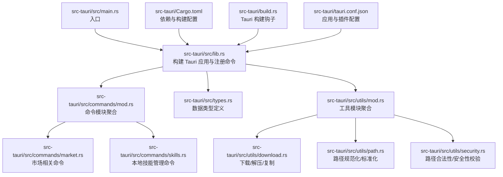
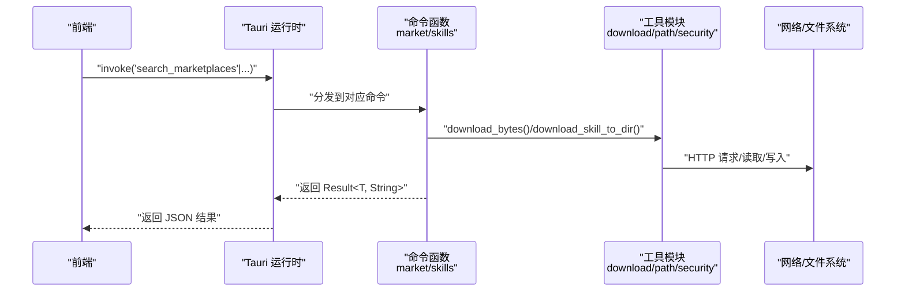
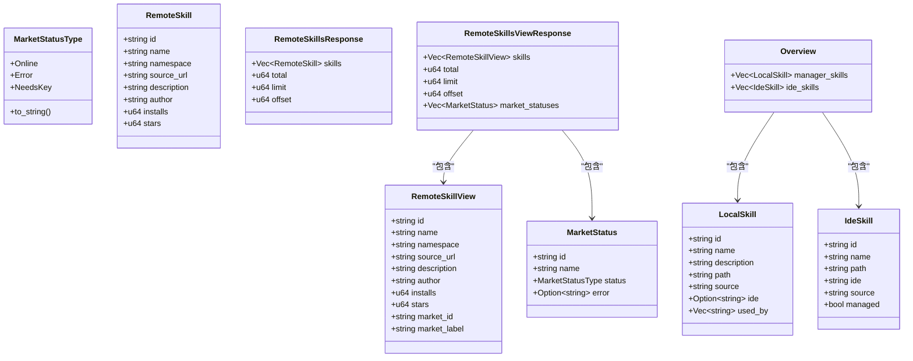
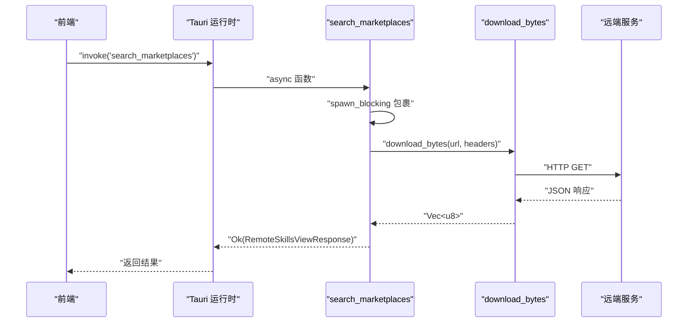
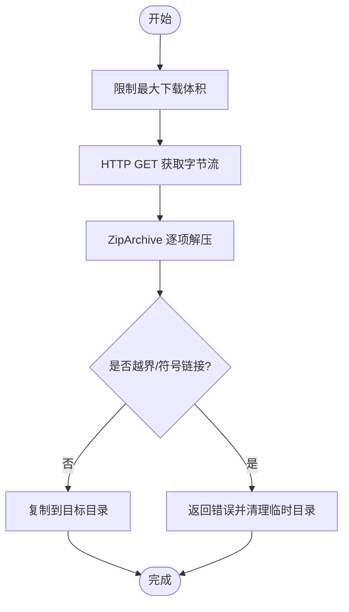
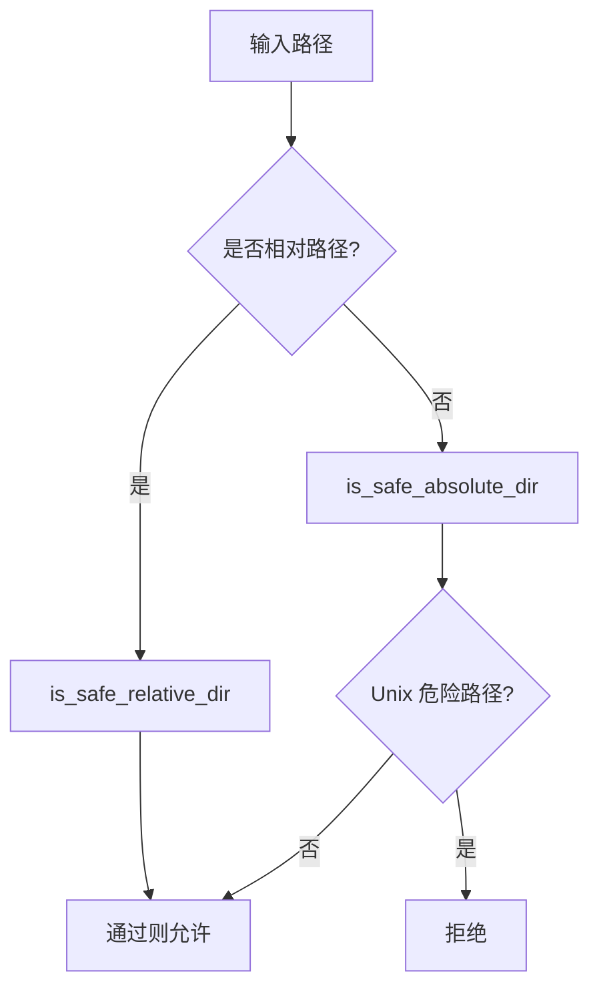
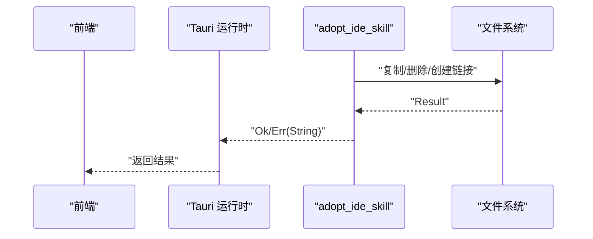
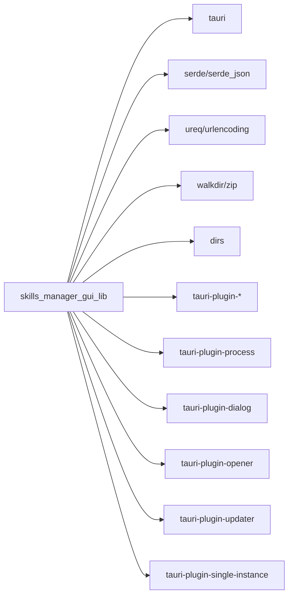

# Rust 基础

<cite>
**本文引用的文件**
- [Cargo.toml](file://src-tauri/Cargo.toml)
- [lib.rs](file://src-tauri/src/lib.rs)
- [main.rs](file://src-tauri/src/main.rs)
- [types.rs](file://src-tauri/src/types.rs)
- [commands/mod.rs](file://src-tauri/src/commands/mod.rs)
- [commands/market.rs](file://src-tauri/src/commands/market.rs)
- [commands/skills.rs](file://src-tauri/src/commands/skills.rs)
- [utils/mod.rs](file://src-tauri/src/utils/mod.rs)
- [utils/download.rs](file://src-tauri/src/utils/download.rs)
- [utils/path.rs](file://src-tauri/src/utils/path.rs)
- [utils/security.rs](file://src-tauri/src/utils/security.rs)
- [build.rs](file://src-tauri/build.rs)
- [tauri.conf.json](file://src-tauri/tauri.conf.json)
</cite>

## 目录
1. [引言](#引言)
2. [项目结构](#项目结构)
3. [核心组件](#核心组件)
4. [架构总览](#架构总览)
5. [详细组件分析](#详细组件分析)
6. [依赖分析](#依赖分析)
7. [性能考虑](#性能考虑)
8. [故障排查指南](#故障排查指南)
9. [结论](#结论)
10. [附录](#附录)

## 引言
本文件面向 Skills Manager 后端（Tauri 应用中的 Rust 侧）开发者，系统梳理 Rust 语言基础与工程实践，结合项目中的类型定义、模块组织、依赖管理、错误处理、内存安全与并发模型，以及性能优化原则，帮助读者在 Tauri 应用中正确使用 Rust 特性。

## 项目结构
后端位于 src-tauri 目录，采用“库 + 可执行程序”的组织方式：通过静态库/动态库导出能力给前端调用；命令通过 Tauri 注册为可调用接口；工具模块封装路径、安全与下载等通用逻辑；类型定义集中于 types.rs，供命令与工具共享。

图示来源
- [lib.rs:1-54](file://src-tauri/src/lib.rs#L1-L54)
- [commands/mod.rs:1-3](file://src-tauri/src/commands/mod.rs#L1-L3)
- [types.rs:1-214](file://src-tauri/src/types.rs#L1-L214)
- [utils/mod.rs:1-4](file://src-tauri/src/utils/mod.rs#L1-L4)
- [Cargo.toml:1-36](file://src-tauri/Cargo.toml#L1-L36)
- [build.rs:1-4](file://src-tauri/build.rs#L1-L4)
- [tauri.conf.json:1-45](file://src-tauri/tauri.conf.json#L1-L45)

章节来源
- [lib.rs:1-54](file://src-tauri/src/lib.rs#L1-L54)
- [Cargo.toml:1-36](file://src-tauri/Cargo.toml#L1-L36)
- [build.rs:1-4](file://src-tauri/build.rs#L1-L4)
- [tauri.conf.json:1-45](file://src-tauri/tauri.conf.json#L1-L45)

## 核心组件
- 类型系统与序列化
  - 使用 serde 对枚举与结构体进行序列化/反序列化，统一前后端数据格式。
  - 关键类型包括市场状态、远程技能、本地技能、IDE 技能、扫描结果、请求/响应对象等。
- 命令层
  - 通过 #[tauri::command] 注解暴露异步命令，如搜索市场、下载/更新技能、链接/卸载/导入/导出技能等。
  - 大量命令使用 spawn_blocking 将阻塞操作移至后台线程池，避免阻塞主线程。
- 工具层
  - 下载：HTTP 请求、限流与超时、最大下载体积限制、Zip 解压与防 Zip Slip 攻击。
  - 路径：规范化、标准化、安全相对路径判断、绝对路径（含 WSL UNC）校验。
  - 安全：路径越界检查、Windows 保留名处理、符号链接拒绝复制等。
- 构建与运行
  - Cargo.toml 定义库类型（静态库/动态库/rlib），启用 tauri-build。
  - tauri.conf.json 配置 CSP、插件、打包与更新通道。

章节来源
- [types.rs:1-214](file://src-tauri/src/types.rs#L1-L214)
- [commands/market.rs:173-442](file://src-tauri/src/commands/market.rs#L173-L442)
- [commands/skills.rs:355-800](file://src-tauri/src/commands/skills.rs#L355-L800)
- [utils/download.rs:27-273](file://src-tauri/src/utils/download.rs#L27-L273)
- [utils/path.rs:21-90](file://src-tauri/src/utils/path.rs#L21-L90)
- [utils/security.rs:3-92](file://src-tauri/src/utils/security.rs#L3-L92)
- [Cargo.toml:10-36](file://src-tauri/Cargo.toml#L10-L36)
- [tauri.conf.json:20-31](file://src-tauri/tauri.conf.json#L20-L31)

## 架构总览
下图展示从前端发起调用到后端命令执行、工具函数协作与外部资源交互的整体流程。

图示来源
- [lib.rs:27-39](file://src-tauri/src/lib.rs#L27-L39)
- [commands/market.rs:173-442](file://src-tauri/src/commands/market.rs#L173-L442)
- [commands/skills.rs:355-800](file://src-tauri/src/commands/skills.rs#L355-L800)
- [utils/download.rs:27-116](file://src-tauri/src/utils/download.rs#L27-L116)

## 详细组件分析

### 类型系统与数据模型
- 枚举与结构体
  - MarketStatusType：在线/错误/需要密钥。
  - RemoteSkill/RemoteSkillsResponse：远程技能列表与分页信息。
  - RemoteSkillView/RemoteSkillsViewResponse：带市场标识的视图模型与状态集合。
  - LocalSkill/IdeSkill/Overview：本地与 IDE 中技能的聚合视图。
  - LinkRequest/UninstallRequest/ExportSkillsRequest 等：命令输入参数。
- 序列化策略
  - camelCase 字段命名，便于与前端一致。
  - Display 实现用于枚举的字符串化输出。
- 设计要点
  - 所有命令参数与返回值均通过 serde 可序列化类型表达，保证跨边界传递的稳定性。
  - 错误统一以 String 表达，便于跨语言桥接。

图示来源
- [types.rs:4-214](file://src-tauri/src/types.rs#L4-L214)

章节来源
- [types.rs:1-214](file://src-tauri/src/types.rs#L1-L214)

### 命令与并发模型
- 命令注册
  - 在 lib.rs 中通过 generate_handler! 注册所有命令，统一由 Tauri 分发。
- 并发与阻塞
  - 大多数命令使用 async，并在内部通过 spawn_blocking 将耗时任务（网络请求、文件系统操作）移出 Tokio 线程池，避免阻塞 UI。
- 错误传播
  - 命令返回 Result<T, String>，内部错误通过 map_err/或直接返回 Err 转换为字符串，保证跨边界一致性。

图示来源
- [lib.rs:27-39](file://src-tauri/src/lib.rs#L27-L39)
- [commands/market.rs:173-392](file://src-tauri/src/commands/market.rs#L173-L392)
- [utils/download.rs:27-48](file://src-tauri/src/utils/download.rs#L27-L48)

章节来源
- [lib.rs:20-53](file://src-tauri/src/lib.rs#L20-L53)
- [commands/market.rs:173-392](file://src-tauri/src/commands/market.rs#L173-L392)

### 下载与解压流程
- 下载
  - 限制最大下载体积，设置重定向次数与超时，按需设置请求头。
- 解压
  - 使用 ZipArchive 逐项读取，严格校验是否越界（is_within_directory），单文件大小限制，拒绝符号链接。
- 临时目录
  - RAII 守卫 TempDirGuard 确保异常退出也能清理临时目录。
- GitHub 链接适配
  - 自动将 https://github.com/owner/repo.git 转换为 API zipball 地址。

图示来源
- [utils/download.rs:27-183](file://src-tauri/src/utils/download.rs#L27-L183)

章节来源
- [utils/download.rs:27-273](file://src-tauri/src/utils/download.rs#L27-L273)

### 路径与安全校验
- 规范化与标准化
  - normalize_path 移除当前/父目录组件，统一路径表示；resolve_canonical 提供规范化的绝对路径。
- 安全路径
  - is_safe_relative_dir 与 is_safe_absolute_dir：拒绝危险相对路径与越权绝对路径（Unix 上禁止 /etc 等）。
  - is_wsl_path：识别 WSL UNC 路径。
- 名称清洗
  - sanitize_dir_name：仅保留字母数字与连字符，Windows 保留名前加下划线规避风险。

图示来源
- [utils/path.rs:21-90](file://src-tauri/src/utils/path.rs#L21-L90)
- [utils/security.rs:3-92](file://src-tauri/src/utils/security.rs#L3-L92)

章节来源
- [utils/path.rs:1-90](file://src-tauri/src/utils/path.rs#L1-L90)
- [utils/security.rs:1-92](file://src-tauri/src/utils/security.rs#L1-L92)

### 技能管理命令（导入/导出/链接/卸载）
- 导入
  - 校验源目录存在且包含 SKILL.md，规范化名称，复制到管理目录。
- 导出
  - 校验目标路径安全（不能在选中技能目录内），压缩多个技能目录为单个 zip。
- 链接
  - 在各 IDE 目录下创建符号链接（Windows 优先尝试 junction），失败回退复制。
- 卸载
  - 限定允许根目录，支持删除链接或目录，避免误删系统目录。

图示来源
- [commands/skills.rs:640-725](file://src-tauri/src/commands/skills.rs#L640-L725)

章节来源
- [commands/skills.rs:611-725](file://src-tauri/src/commands/skills.rs#L611-L725)

## 依赖分析
- 依赖关系
  - tauri、tauri-plugin-*：窗口、对话框、进程、更新器、单实例等插件。
  - serde/serde_json：结构化数据序列化。
  - ureq/urlencoding：HTTP 请求与编码。
  - walkdir/zip：遍历与压缩。
  - dirs：用户主目录定位。
- 目标平台差异
  - 非 Android/iOS 平台启用 tauri-plugin-updater 与 tauri-plugin-single-instance。

图示来源
- [Cargo.toml:20-36](file://src-tauri/Cargo.toml#L20-L36)

章节来源
- [Cargo.toml:1-36](file://src-tauri/Cargo.toml#L1-L36)

## 性能考虑
- I/O 与 CPU 密集任务分离
  - 使用 spawn_blocking 执行文件系统与网络操作，避免阻塞事件循环。
- 限流与超时
  - 下载阶段设置最大体积、重定向次数与超时，防止 OOM 与长时间占用。
- 压缩与解压
  - 单文件大小限制与 Zip Slip 防护，降低内存与磁盘压力。
- 路径解析
  - 规范化与标准化减少后续比较成本，避免重复 canonicalize。

## 故障排查指南
- 常见错误来源
  - 路径越界：is_within_directory 会拒绝越界写入；检查 extract_dir 与 out_path 的归一化。
  - 绝对路径不安全：is_safe_absolute_dir 拒绝危险路径；确认传入路径是否为 /etc 或系统关键目录。
  - Windows 保留名：sanitize_dir_name 会对保留名加前缀；若出现文件名异常，检查清洗逻辑。
  - 符号链接拒绝复制：copy_dir_recursive 对符号链接直接报错；请改用普通文件或目录。
- 并发与线程
  - spawn_blocking 返回 JoinError 时，命令层将其转换为字符串错误；检查后台任务是否 panic 或被取消。
- 插件与权限
  - updater、single-instance 等插件需在非移动端平台启用；确认 tauri.conf.json 中的条件编译。

章节来源
- [utils/download.rs:143-183](file://src-tauri/src/utils/download.rs#L143-L183)
- [utils/security.rs:72-92](file://src-tauri/src/utils/security.rs#L72-L92)
- [utils/path.rs:61-83](file://src-tauri/src/utils/path.rs#L61-L83)
- [commands/market.rs:390-392](file://src-tauri/src/commands/market.rs#L390-L392)

## 结论
本项目在 Tauri 生态中，通过清晰的类型定义、模块化命令与工具层、严格的路径与安全校验、以及合理的并发模型，实现了稳定可靠的技能管理能力。遵循本文所述的 Rust 基础与工程实践，可在保证内存安全与性能的前提下，持续扩展功能并提升可靠性。

## 附录
- 入口与运行
  - main.rs 仅调用 lib::run，后者负责构建 Tauri 应用、注册插件与命令。
- 构建与打包
  - build.rs 调用 tauri_build，配合 tauri.conf.json 的 bundle 与 updater 配置，生成多平台产物。

章节来源
- [main.rs:1-7](file://src-tauri/src/main.rs#L1-L7)
- [lib.rs:20-53](file://src-tauri/src/lib.rs#L20-L53)
- [build.rs:1-4](file://src-tauri/build.rs#L1-L4)
- [tauri.conf.json:32-43](file://src-tauri/tauri.conf.json#L32-L43)