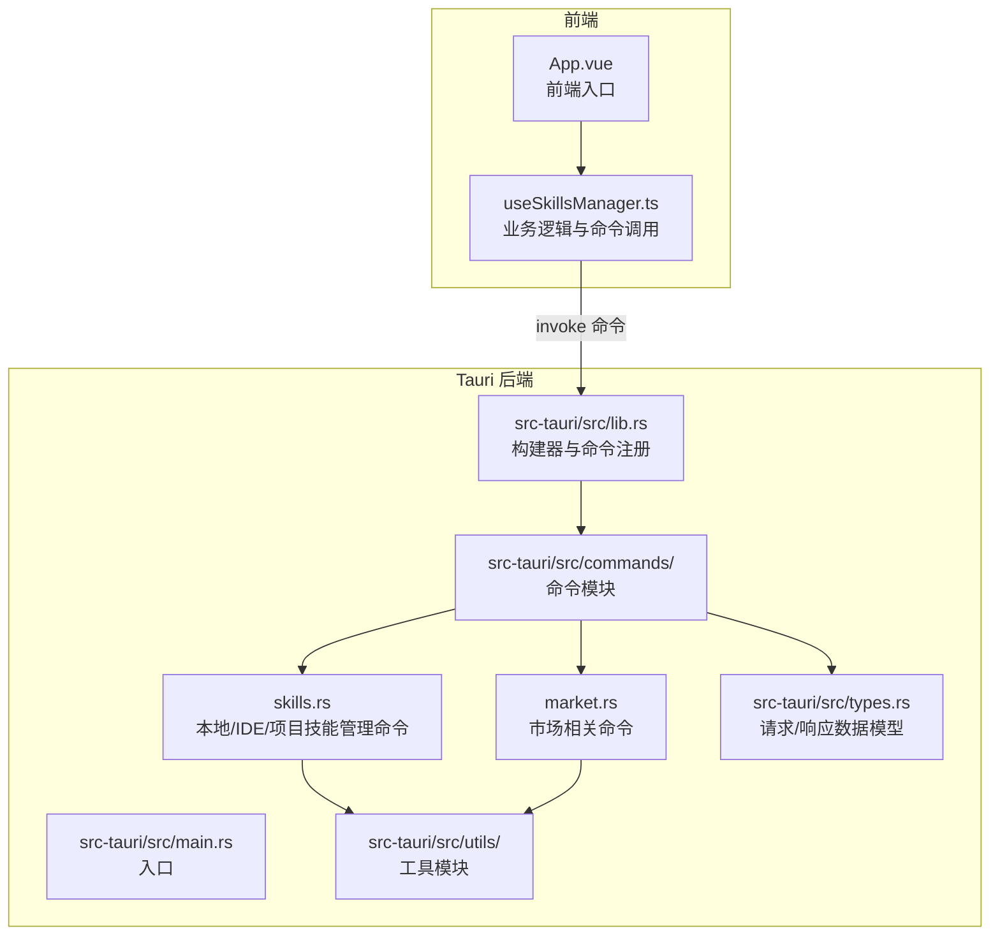
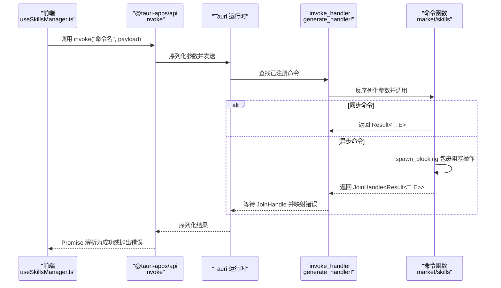
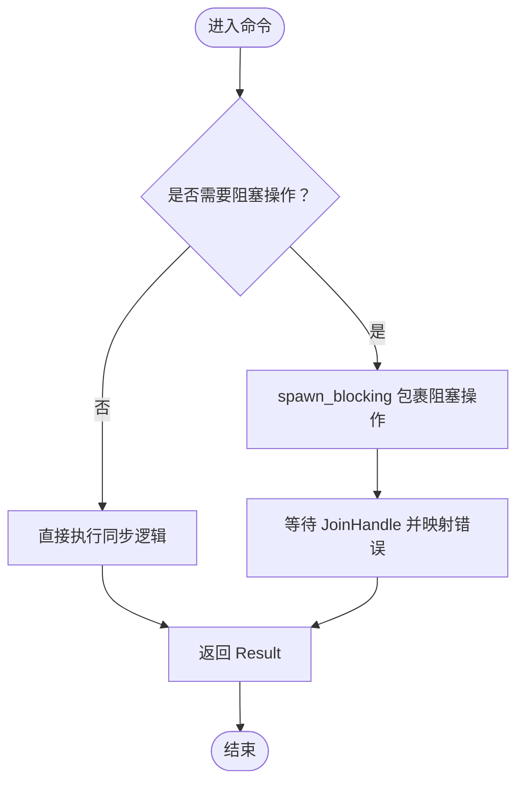
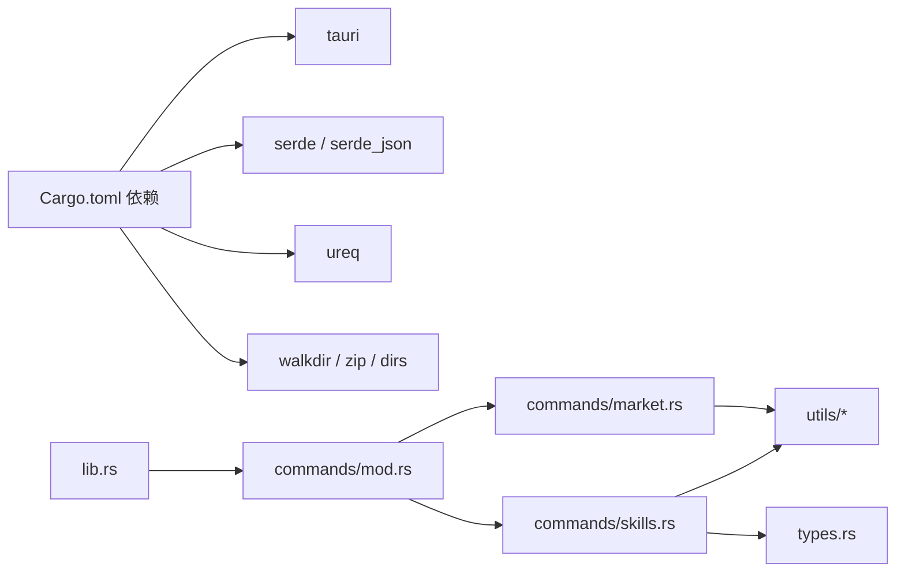

# Tauri 命令系统

<cite>
**本文引用的文件**
- [src-tauri/src/lib.rs](file://src-tauri/src/lib.rs)
- [src-tauri/src/main.rs](file://src-tauri/src/main.rs)
- [src-tauri/src/commands/mod.rs](file://src-tauri/src/commands/mod.rs)
- [src-tauri/src/commands/market.rs](file://src-tauri/src/commands/market.rs)
- [src-tauri/src/commands/skills.rs](file://src-tauri/src/commands/skills.rs)
- [src-tauri/src/types.rs](file://src-tauri/src/types.rs)
- [src-tauri/src/utils/mod.rs](file://src-tauri/src/utils/mod.rs)
- [src-tauri/Cargo.toml](file://src-tauri/Cargo.toml)
- [src-tauri/tauri.conf.json](file://src-tauri/tauri.conf.json)
- [src/composables/useSkillsManager.ts](file://src/composables/useSkillsManager.ts)
- [src/App.vue](file://src/App.vue)
</cite>

## 目录
1. [简介](#简介)
2. [项目结构](#项目结构)
3. [核心组件](#核心组件)
4. [架构总览](#架构总览)
5. [详细组件分析](#详细组件分析)
6. [依赖关系分析](#依赖关系分析)
7. [性能考量](#性能考量)
8. [故障排查指南](#故障排查指南)
9. [结论](#结论)
10. [附录](#附录)

## 简介
本文件系统性阐述 Skills Manager 中基于 Tauri 的命令系统设计与实现，覆盖命令注册机制、invoke_handler 使用方式、参数传递与返回值处理、async/await 在命令中的应用、错误传播机制、类型安全保证，并提供命令定义最佳实践、性能优化建议与调试技巧。同时给出完整的命令实现示例路径与前端调用方法，帮助开发者快速理解与扩展。

## 项目结构
Tauri 应用在 Rust 后端通过模块化组织命令与类型，前端通过 @tauri-apps/api 调用后端命令，形成清晰的分层架构。

图表来源
- [src-tauri/src/main.rs:1-7](file://src-tauri/src/main.rs#L1-L7)
- [src-tauri/src/lib.rs:1-54](file://src-tauri/src/lib.rs#L1-L54)
- [src-tauri/src/commands/mod.rs:1-3](file://src-tauri/src/commands/mod.rs#L1-L3)
- [src-tauri/src/commands/market.rs:1-442](file://src-tauri/src/commands/market.rs#L1-L442)
- [src-tauri/src/commands/skills.rs:1-847](file://src-tauri/src/commands/skills.rs#L1-L847)
- [src-tauri/src/types.rs:1-214](file://src-tauri/src/types.rs#L1-L214)
- [src-tauri/src/utils/mod.rs:1-4](file://src-tauri/src/utils/mod.rs#L1-L4)

章节来源
- [src-tauri/src/main.rs:1-7](file://src-tauri/src/main.rs#L1-L7)
- [src-tauri/src/lib.rs:1-54](file://src-tauri/src/lib.rs#L1-L54)
- [src-tauri/src/commands/mod.rs:1-3](file://src-tauri/src/commands/mod.rs#L1-L3)
- [src-tauri/src/types.rs:1-214](file://src-tauri/src/types.rs#L1-L214)

## 核心组件
- 命令注册与运行时
  - 后端通过 Builder 的 invoke_handler 注册所有命令，统一由 generate_handler! 宏收集，确保类型安全与编译期校验。
  - 运行时由 run() 函数完成插件初始化与窗口启动。
- 命令模块划分
  - commands/market.rs：市场搜索、下载、更新等远程技能相关命令。
  - commands/skills.rs：本地技能扫描、链接、导入、导出、删除、采用（迁移）等本地/IDE/项目技能管理命令。
- 数据模型
  - types.rs 定义了请求/响应结构体、枚举与序列化规则，确保前后端一致的数据契约。
- 工具模块
  - utils 下包含下载、路径、安全等辅助能力，被命令模块复用以降低耦合。

章节来源
- [src-tauri/src/lib.rs:20-53](file://src-tauri/src/lib.rs#L20-L53)
- [src-tauri/src/commands/market.rs:173-442](file://src-tauri/src/commands/market.rs#L173-L442)
- [src-tauri/src/commands/skills.rs:355-847](file://src-tauri/src/commands/skills.rs#L355-L847)
- [src-tauri/src/types.rs:1-214](file://src-tauri/src/types.rs#L1-L214)
- [src-tauri/src/utils/mod.rs:1-4](file://src-tauri/src/utils/mod.rs#L1-L4)

## 架构总览
Tauri 命令系统采用“前端调用 invoke -> 后端 generate_handler -> 命令函数执行”的标准流程。命令函数可同步或异步，异步场景通过 spawn_blocking 将阻塞操作移至后台线程池，避免阻塞主线程。

图表来源
- [src-tauri/src/lib.rs:27-39](file://src-tauri/src/lib.rs#L27-L39)
- [src-tauri/src/commands/market.rs:181-391](file://src-tauri/src/commands/market.rs#L181-L391)
- [src-tauri/src/commands/skills.rs:355-449](file://src-tauri/src/commands/skills.rs#L355-L449)

## 详细组件分析

### 命令注册与 invoke_handler 使用
- 注册方式
  - 通过 generate_handler! 宏一次性注册多个命令，集中管理，减少遗漏。
  - 所有命令均在 lib.rs 中引入并注册，便于统一维护。
- 运行时行为
  - run() 构建 Builder，按需启用插件（如单实例、对话框、打开器、更新器），最后启动应用上下文。

章节来源
- [src-tauri/src/lib.rs:27-39](file://src-tauri/src/lib.rs#L27-L39)
- [src-tauri/src/lib.rs:20-53](file://src-tauri/src/lib.rs#L20-L53)

### 参数传递与返回值处理
- 参数传递
  - 前端调用 invoke("命令名", { request: {...} }) 或 invoke("命令名", {...})，后端通过 #[tauri::command] 函数签名接收。
  - 类型由 serde 自动反序列化，要求前后端字段命名一致（snake_case/camelCase 映射在 types.rs 中统一约定）。
- 返回值处理
  - 统一返回 Result<T, String>，其中 T 为 serde 可序列化的结构体；错误以字符串形式传播到前端。
  - 异步命令通过 spawn_blocking 包裹耗时操作，最终返回 JoinHandle<Result<T, E>>，再映射为字符串错误。

章节来源
- [src-tauri/src/commands/market.rs:173-442](file://src-tauri/src/commands/market.rs#L173-L442)
- [src-tauri/src/commands/skills.rs:355-847](file://src-tauri/src/commands/skills.rs#L355-L847)
- [src-tauri/src/types.rs:1-214](file://src-tauri/src/types.rs#L1-L214)

### async/await 在命令中的应用与错误传播
- 同步命令
  - 直接返回 Result<T, String>，适合无阻塞逻辑。
- 异步命令
  - 使用 tauri::async_runtime::spawn_blocking 包裹 IO 密集或 CPU 密集任务，避免阻塞事件循环。
  - await JoinHandle，将错误映射为字符串，保持统一的错误传播语义。
- 错误传播
  - 命令内部的任何错误最终转换为字符串并返回给前端；前端通过 try/catch 捕获并展示。

图表来源
- [src-tauri/src/commands/market.rs:181-391](file://src-tauri/src/commands/market.rs#L181-L391)
- [src-tauri/src/commands/skills.rs:355-449](file://src-tauri/src/commands/skills.rs#L355-L449)

### 类型安全保证
- 结构体与枚举
  - types.rs 定义请求/响应结构体与枚举，统一使用 serde 的 camelCase/snake_case 规则，确保跨语言序列化一致性。
- 命令签名
  - #[tauri::command] 自动生成类型检查与序列化适配，参数与返回值必须满足 serde 可序列化约束。
- 前端消费
  - useSkillsManager.ts 对 invoke 返回值进行类型断言与缓存，提升开发体验与健壮性。

章节来源
- [src-tauri/src/types.rs:1-214](file://src-tauri/src/types.rs#L1-L214)
- [src/composables/useSkillsManager.ts:190-248](file://src/composables/useSkillsManager.ts#L190-L248)

### 命令实现示例与最佳实践
- 示例路径
  - 市场搜索命令：[search_marketplaces:173-392](file://src-tauri/src/commands/market.rs#L173-L392)
  - 下载/更新命令：[download_marketplace_skill:394-416](file://src-tauri/src/commands/market.rs#L394-L416)、[update_marketplace_skill:418-441](file://src-tauri/src/commands/market.rs#L418-L441)
  - 本地扫描命令：[scan_overview:451-535](file://src-tauri/src/commands/skills.rs#L451-L535)
  - 链接命令：[link_local_skill:355-449](file://src-tauri/src/commands/skills.rs#L355-L449)
  - 导出命令：[export_local_skills:760-804](file://src-tauri/src/commands/skills.rs#L760-L804)
  - 项目扫描命令：[scan_project_ide_dirs:806-846](file://src-tauri/src/commands/skills.rs#L806-L846)
- 最佳实践
  - 将阻塞操作放入 spawn_blocking，避免阻塞主线程。
  - 统一错误处理：内部捕获具体错误，转换为字符串返回。
  - 参数校验前置：尽早返回明确错误信息，减少无效计算。
  - 结构体字段命名遵循 camelCase/snake_case 约定，确保跨语言兼容。
  - 命令职责单一，复杂逻辑拆分为私有辅助函数，提升可测试性与可读性。

章节来源
- [src-tauri/src/commands/market.rs:173-442](file://src-tauri/src/commands/market.rs#L173-L442)
- [src-tauri/src/commands/skills.rs:355-847](file://src-tauri/src/commands/skills.rs#L355-L847)
- [src-tauri/src/types.rs:1-214](file://src-tauri/src/types.rs#L1-L214)

### 前端调用方法
- 典型调用
  - 搜索市场：invoke("search_marketplaces", { query, limit, offset, apiKeys, enabledMarkets })
  - 下载/更新：invoke("download_marketplace_skill"/"update_marketplace_skill", { request })
  - 扫描本地：invoke("scan_overview", { request })
  - 链接技能：invoke("link_local_skill", { request })
  - 删除/卸载：invoke("delete_local_skills"/"uninstall_skill", { request })
  - 导出技能：invoke("export_local_skills", { request })
  - 项目扫描：invoke("scan_project_ide_dirs", { request })
- 调用位置参考
  - useSkillsManager.ts 中封装了大量命令调用与错误处理逻辑。
  - App.vue 中演示了项目扫描命令的调用方式。

章节来源
- [src/composables/useSkillsManager.ts:190-800](file://src/composables/useSkillsManager.ts#L190-L800)
- [src/App.vue:166-180](file://src/App.vue#L166-L180)

## 依赖关系分析
- 外部依赖
  - tauri、serde、ureq、walkdir、zip、dirs 等，用于窗口、序列化、网络请求、文件系统与压缩等能力。
- 内部模块依赖
  - commands 依赖 types 提供数据模型；skills 命令依赖 utils 下的下载、路径与安全工具。
- 插件集成
  - 运行时启用 process、dialog、opener、updater、single-instance 等插件，增强功能与用户体验。

图表来源
- [src-tauri/Cargo.toml:20-36](file://src-tauri/Cargo.toml#L20-L36)
- [src-tauri/src/lib.rs:1-18](file://src-tauri/src/lib.rs#L1-L18)
- [src-tauri/src/commands/mod.rs:1-3](file://src-tauri/src/commands/mod.rs#L1-L3)
- [src-tauri/src/commands/market.rs:1-8](file://src-tauri/src/commands/market.rs#L1-L8)
- [src-tauri/src/commands/skills.rs:1-16](file://src-tauri/src/commands/skills.rs#L1-L16)

章节来源
- [src-tauri/Cargo.toml:20-36](file://src-tauri/Cargo.toml#L20-L36)
- [src-tauri/src/lib.rs:1-18](file://src-tauri/src/lib.rs#L1-L18)

## 性能考量
- I/O 与 CPU 密集任务分离
  - 使用 spawn_blocking 执行网络请求、文件复制、压缩等阻塞操作，避免阻塞 UI 线程。
- 缓存与去重
  - 前端对市场搜索结果进行缓存与去重，减少重复请求与渲染压力。
- 路径与权限校验
  - 命令中对路径合法性、绝对/相对路径、目标根目录进行严格校验，避免无效操作与潜在风险。
- 并发控制
  - 下载队列采用串行处理，避免并发写入冲突；必要时可引入限流策略。

章节来源
- [src-tauri/src/commands/market.rs:181-391](file://src-tauri/src/commands/market.rs#L181-L391)
- [src-tauri/src/commands/skills.rs:760-804](file://src-tauri/src/commands/skills.rs#L760-L804)
- [src/composables/useSkillsManager.ts:24-28](file://src/composables/useSkillsManager.ts#L24-L28)
- [src/composables/useSkillsManager.ts:278-329](file://src/composables/useSkillsManager.ts#L278-L329)

## 故障排查指南
- 常见错误来源
  - 参数为空或格式不正确：命令入口处尽早校验并返回明确错误。
  - 路径越界或非法：严格限制允许根目录与相对路径，避免误删或越权访问。
  - 网络请求失败：检查代理、证书与超时设置；对解析失败进行降级处理。
- 前端处理
  - 使用 try/catch 捕获 invoke 抛出的错误，结合 toast 展示用户友好提示。
- 日志与调试
  - 后端打印错误信息，前端记录日志并提供反馈渠道。
- 配置检查
  - 确认 tauri.conf.json 中的安全策略与插件配置符合预期。

章节来源
- [src-tauri/src/commands/market.rs:398-400](file://src-tauri/src/commands/market.rs#L398-L400)
- [src-tauri/src/commands/skills.rs:538-595](file://src-tauri/src/commands/skills.rs#L538-L595)
- [src/composables/useSkillsManager.ts:243-247](file://src/composables/useSkillsManager.ts#L243-247)
- [src-tauri/tauri.conf.json:20-31](file://src-tauri/tauri.conf.json#L20-L31)

## 结论
Skills Manager 的 Tauri 命令系统通过模块化命令、严格的类型契约与统一的错误传播机制，实现了稳定可靠的桌面应用功能。配合前端的命令封装与缓存策略，整体具备良好的可维护性与扩展性。建议在新增命令时遵循本文的最佳实践，确保性能与安全性。

## 附录
- 命令清单与用途概览
  - search_marketplaces：多市场聚合搜索，支持分页与状态反馈。
  - download_marketplace_skill / update_marketplace_skill：从远端下载/更新技能到本地。
  - scan_overview：扫描本地与 IDE 技能，生成概览视图。
  - link_local_skill：将本地技能链接到一个或多个 IDE/项目目录。
  - export_local_skills / import_local_skill：导出/导入本地技能包。
  - uninstall_skill / delete_local_skills：卸载/删除本地技能。
  - adopt_ide_skill：将 IDE 技能纳入管理并重建链接。
  - scan_project_ide_dirs：扫描项目目录下的 IDE 技能目录。

章节来源
- [src-tauri/src/commands/market.rs:173-442](file://src-tauri/src/commands/market.rs#L173-L442)
- [src-tauri/src/commands/skills.rs:355-847](file://src-tauri/src/commands/skills.rs#L355-L847)