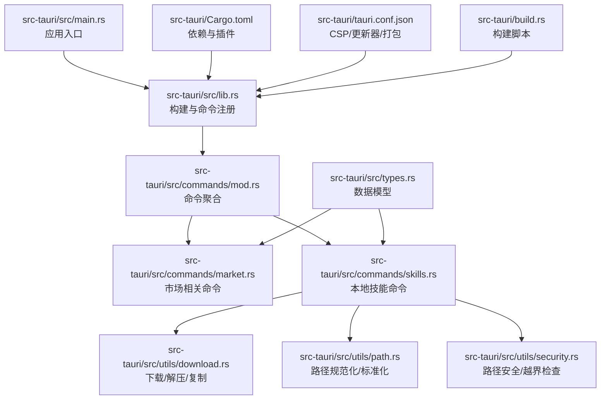
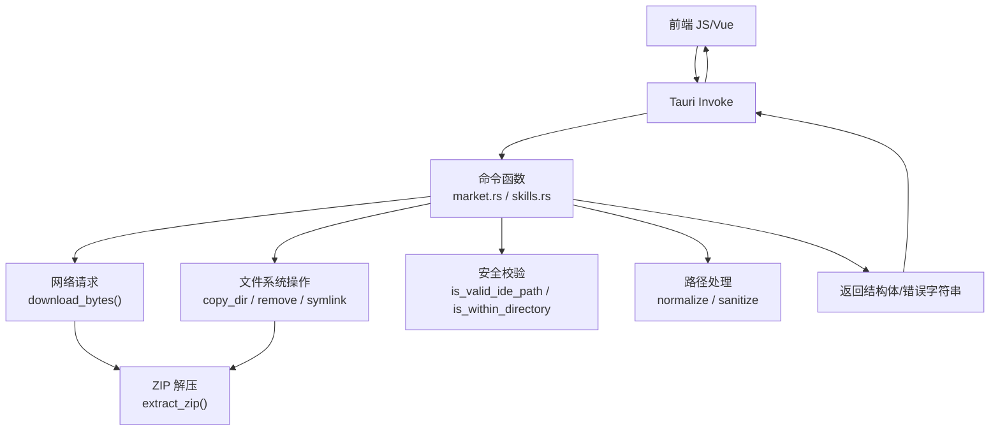
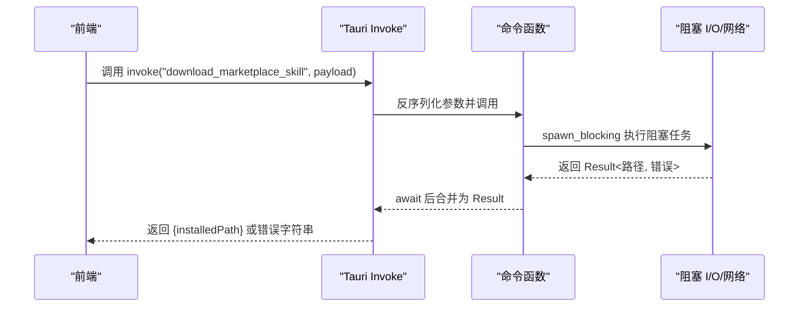
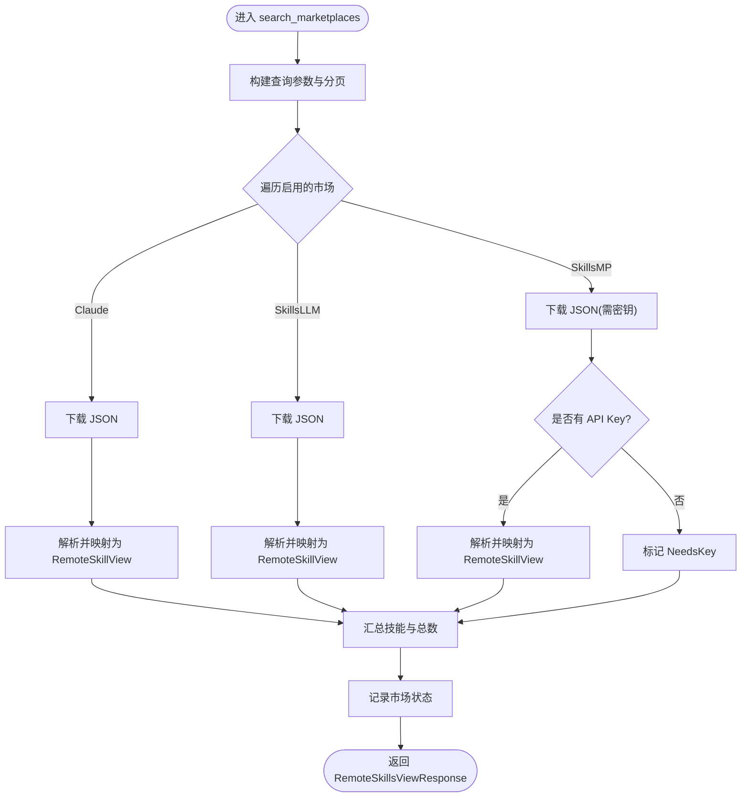
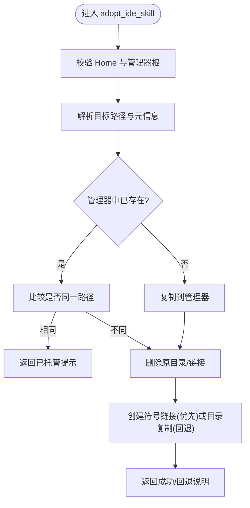
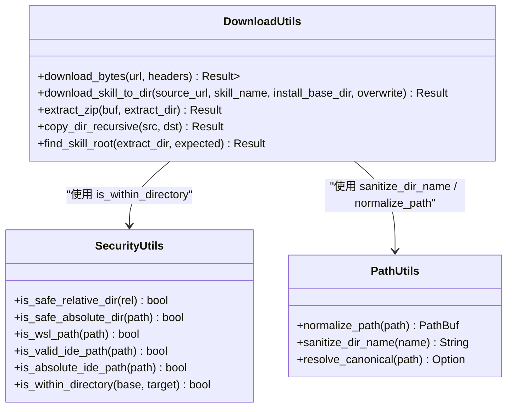
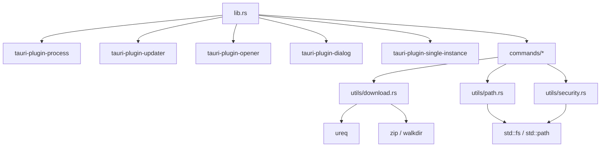

# 后端开发

<cite>
**本文引用的文件**
- [src-tauri/src/lib.rs](file://src-tauri/src/lib.rs)
- [src-tauri/src/main.rs](file://src-tauri/src/main.rs)
- [src-tauri/Cargo.toml](file://src-tauri/Cargo.toml)
- [src-tauri/tauri.conf.json](file://src-tauri/tauri.conf.json)
- [src-tauri/src/commands/mod.rs](file://src-tauri/src/commands/mod.rs)
- [src-tauri/src/commands/market.rs](file://src-tauri/src/commands/market.rs)
- [src-tauri/src/commands/skills.rs](file://src-tauri/src/commands/skills.rs)
- [src-tauri/src/utils/mod.rs](file://src-tauri/src/utils/mod.rs)
- [src-tauri/src/utils/download.rs](file://src-tauri/src/utils/download.rs)
- [src-tauri/src/utils/path.rs](file://src-tauri/src/utils/path.rs)
- [src-tauri/src/utils/security.rs](file://src-tauri/src/utils/security.rs)
- [src-tauri/src/types.rs](file://src-tauri/src/types.rs)
- [src-tauri/build.rs](file://src-tauri/build.rs)
</cite>

## 目录
1. [简介](#简介)
2. [项目结构](#项目结构)
3. [核心组件](#核心组件)
4. [架构总览](#架构总览)
5. [详细组件分析](#详细组件分析)
6. [依赖关系分析](#依赖关系分析)
7. [性能考虑](#性能考虑)
8. [故障排查指南](#故障排查指南)
9. [结论](#结论)
10. [附录](#附录)

## 简介
本指南面向 Skills Manager 后端（Tauri 应用）的 Rust 开发者，聚焦以下主题：
- Tauri 命令系统：命令注册、参数传递、异步处理、错误处理
- Rust 与 JavaScript 的互操作：通过 Tauri invoke 调用后端命令
- 文件系统操作：路径规范化、安全校验、符号链接与跨平台兼容
- 网络请求处理：HTTP 下载、限流与防护、ZIP 解压与安全校验
- 安全编程实践：路径安全、防 Zip Slip、防 Zip Bomb、最小权限原则
- 并发与内存管理：线程池与 spawn_blocking、RAII 清理、临时目录保护
- 日志与调试：println 输出、状态返回、前端联动
- 性能优化：批量扫描、缓存策略、I/O 合并

## 项目结构
后端位于 src-tauri 目录，采用“模块化 + 命令分层”的组织方式：
- 入口与运行时：lib.rs（构建 Tauri Builder、注册命令）、main.rs（入口）
- 命令模块：commands/market.rs、commands/skills.rs
- 工具模块：utils/download.rs（网络与解压）、utils/path.rs（路径处理）、utils/security.rs（安全校验）
- 类型定义：types.rs（前后端共享的数据结构）
- 构建与插件：Cargo.toml（依赖与插件）、tauri.conf.json（CSP、更新器、打包）、build.rs（tui-build）

**图表来源**
- [src-tauri/src/main.rs:1-7](file://src-tauri/src/main.rs#L1-L7)
- [src-tauri/src/lib.rs:1-54](file://src-tauri/src/lib.rs#L1-L54)
- [src-tauri/src/commands/mod.rs:1-3](file://src-tauri/src/commands/mod.rs#L1-L3)
- [src-tauri/src/commands/market.rs:1-442](file://src-tauri/src/commands/market.rs#L1-L442)
- [src-tauri/src/commands/skills.rs:1-847](file://src-tauri/src/commands/skills.rs#L1-L847)
- [src-tauri/src/utils/download.rs:1-273](file://src-tauri/src/utils/download.rs#L1-L273)
- [src-tauri/src/utils/path.rs:1-90](file://src-tauri/src/utils/path.rs#L1-L90)
- [src-tauri/src/utils/security.rs:1-92](file://src-tauri/src/utils/security.rs#L1-L92)
- [src-tauri/src/types.rs:1-214](file://src-tauri/src/types.rs#L1-L214)
- [src-tauri/Cargo.toml:1-36](file://src-tauri/Cargo.toml#L1-L36)
- [src-tauri/tauri.conf.json:1-45](file://src-tauri/tauri.conf.json#L1-L45)
- [src-tauri/build.rs:1-4](file://src-tauri/build.rs#L1-L4)

**章节来源**
- [src-tauri/src/main.rs:1-7](file://src-tauri/src/main.rs#L1-L7)
- [src-tauri/src/lib.rs:1-54](file://src-tauri/src/lib.rs#L1-L54)
- [src-tauri/Cargo.toml:1-36](file://src-tauri/Cargo.toml#L1-L36)
- [src-tauri/tauri.conf.json:1-45](file://src-tauri/tauri.conf.json#L1-L45)
- [src-tauri/build.rs:1-4](file://src-tauri/build.rs#L1-L4)

## 核心组件
- 命令注册与运行时
  - 在 lib.rs 中使用 Tauri Builder 注册命令，并在生成上下文下运行应用
  - 条件性启用单实例插件（桌面端），并加载多个插件（进程、更新器、打开器、对话框）
- 命令模块
  - market.rs：市场搜索、下载、更新
  - skills.rs：本地扫描、链接、导入、导出、删除、采用、卸载、项目 IDE 目录扫描
- 工具模块
  - download.rs：HTTP 下载、ZIP 解压、复制目录、临时目录清理
  - path.rs：路径规范化、标准化、Windows 前缀处理、目录名清洗
  - security.rs：相对/绝对路径安全校验、WSL 路径识别、越界检查
- 数据类型
  - types.rs：远程技能、市场状态、请求/响应结构体等

**章节来源**
- [src-tauri/src/lib.rs:20-53](file://src-tauri/src/lib.rs#L20-L53)
- [src-tauri/src/commands/mod.rs:1-3](file://src-tauri/src/commands/mod.rs#L1-L3)
- [src-tauri/src/commands/market.rs:173-442](file://src-tauri/src/commands/market.rs#L173-L442)
- [src-tauri/src/commands/skills.rs:355-847](file://src-tauri/src/commands/skills.rs#L355-L847)
- [src-tauri/src/utils/download.rs:27-273](file://src-tauri/src/utils/download.rs#L27-L273)
- [src-tauri/src/utils/path.rs:21-90](file://src-tauri/src/utils/path.rs#L21-L90)
- [src-tauri/src/utils/security.rs:3-92](file://src-tauri/src/utils/security.rs#L3-L92)
- [src-tauri/src/types.rs:4-214](file://src-tauri/src/types.rs#L4-L214)

## 架构总览
后端以 Tauri 命令为中心，前端通过 invoke 调用后端命令，后端通过 spawn_blocking 执行阻塞任务，返回结果或错误字符串。

**图表来源**
- [src-tauri/src/lib.rs:27-39](file://src-tauri/src/lib.rs#L27-L39)
- [src-tauri/src/commands/market.rs:173-442](file://src-tauri/src/commands/market.rs#L173-L442)
- [src-tauri/src/commands/skills.rs:355-847](file://src-tauri/src/commands/skills.rs#L355-L847)
- [src-tauri/src/utils/download.rs:27-183](file://src-tauri/src/utils/download.rs#L27-L183)
- [src-tauri/src/utils/security.rs:63-92](file://src-tauri/src/utils/security.rs#L63-L92)
- [src-tauri/src/utils/path.rs:21-83](file://src-tauri/src/utils/path.rs#L21-L83)

## 详细组件分析

### 命令系统与互操作
- 命令注册
  - 在 lib.rs 的 invoke_handler 中集中注册所有命令，包括市场与技能相关命令
  - 通过 generate_handler! 宏简化注册流程
- 参数传递
  - 命令函数接收结构化参数（如 DownloadRequest、LinkRequest、LocalScanRequest 等）
  - 结构体由 serde 序列化/反序列化，保证前后端一致
- 异步处理
  - 大多数命令使用 async + spawn_blocking 包裹阻塞 I/O 或网络调用
  - 返回 JoinHandle，await 后统一映射为 Result
- 错误处理
  - 统一返回 Result<T, String>，错误字符串由前端捕获并展示
  - 对关键路径进行 early return，避免无效执行

**图表来源**
- [src-tauri/src/lib.rs:27-39](file://src-tauri/src/lib.rs#L27-L39)
- [src-tauri/src/commands/market.rs:394-442](file://src-tauri/src/commands/market.rs#L394-L442)
- [src-tauri/src/utils/download.rs:50-116](file://src-tauri/src/utils/download.rs#L50-L116)

**章节来源**
- [src-tauri/src/lib.rs:27-39](file://src-tauri/src/lib.rs#L27-L39)
- [src-tauri/src/commands/market.rs:173-442](file://src-tauri/src/commands/market.rs#L173-L442)
- [src-tauri/src/commands/skills.rs:355-847](file://src-tauri/src/commands/skills.rs#L355-L847)
- [src-tauri/src/utils/download.rs:50-116](file://src-tauri/src/utils/download.rs#L50-L116)

### 市场命令（搜索、下载、更新）
- 搜索市场（search_marketplaces）
  - 支持多市场聚合：Claude Plugins、SkillsLLM、SkillsMP
  - 查询参数与分页处理；对空查询进行特殊处理
  - 对每个市场分别发起 HTTP 请求，解析 JSON，映射为统一视图结构
  - 记录各市场的连接状态（Online/Error/NeedsKey）
- 下载与更新（download_marketplace_skill / update_marketplace_skill）
  - 将 GitHub URL 自动转换为 API zipball 地址
  - 临时目录解压，选择包含 SKILL.md 的根目录，复制到目标目录
  - 覆盖模式可控制是否删除已有目录

**图表来源**
- [src-tauri/src/commands/market.rs:173-392](file://src-tauri/src/commands/market.rs#L173-L392)

**章节来源**
- [src-tauri/src/commands/market.rs:173-442](file://src-tauri/src/commands/market.rs#L173-L442)
- [src-tauri/src/utils/download.rs:27-116](file://src-tauri/src/utils/download.rs#L27-L116)

### 技能命令（本地管理）
- 链接本地技能（link_local_skill）
  - 校验目标路径必须位于 Skills Manager 存储内
  - 校验各 IDE 目标路径必须在用户主目录内
  - 优先创建符号链接，失败则在 Windows 上尝试目录连接（junction）
- 扫描概览（scan_overview）
  - 收集管理器存储中的技能
  - 收集各 IDE 目录中的技能，识别被管理器链接的技能
  - 支持项目目录下的 IDE 目录扫描
- 卸载（uninstall_skill）
  - 限定删除范围为允许根目录集合（含 IDE 目录与项目目录）
  - 支持删除真实目录或符号链接
- 导入（import_local_skill）
  - 校验源目录包含 SKILL.md
  - 复制到管理器存储，使用清洗后的目录名
- 采用（adopt_ide_skill）
  - 将 IDE 目录中的技能迁移到管理器存储，保留原位置为符号链接
- 删除（delete_local_skills）
  - 仅允许删除管理器存储内的技能目录
- 导出（export_local_skills）
  - 校验目标路径合法性与安全性
  - ZIP 打包多个技能目录，防御 Zip Slip/Zip Bomb
- 项目 IDE 目录扫描（scan_project_ide_dirs）
  - 按预设模式匹配项目根下的 IDE 技能目录

**图表来源**
- [src-tauri/src/commands/skills.rs:640-725](file://src-tauri/src/commands/skills.rs#L640-L725)

**章节来源**
- [src-tauri/src/commands/skills.rs:355-847](file://src-tauri/src/commands/skills.rs#L355-L847)

### 工具模块与安全
- 下载与解压（download.rs）
  - download_bytes：设置重定向次数、超时、最大下载体积
  - extract_zip：逐文件校验是否越界、限制单文件大小
  - copy_dir_recursive：递归复制，拒绝符号链接
  - find_skill_root：在多层级压缩包中定位实际技能根目录
  - TempDirGuard：RAII 临时目录清理
- 路径处理（path.rs）
  - normalize_path：规范化路径，消除 . 和 ..
  - sanitize_dir_name：清洗目录名为安全字符组合
  - resolve_canonical：标准化绝对路径
- 安全校验（security.rs）
  - is_safe_relative_dir / is_safe_absolute_dir：相对/绝对路径安全校验
  - is_wsl_path：WSL UNC 路径识别
  - is_within_directory：防 Zip Slip 核心函数

**图表来源**
- [src-tauri/src/utils/download.rs:27-273](file://src-tauri/src/utils/download.rs#L27-L273)
- [src-tauri/src/utils/path.rs:21-90](file://src-tauri/src/utils/path.rs#L21-L90)
- [src-tauri/src/utils/security.rs:3-92](file://src-tauri/src/utils/security.rs#L3-L92)

**章节来源**
- [src-tauri/src/utils/download.rs:27-273](file://src-tauri/src/utils/download.rs#L27-L273)
- [src-tauri/src/utils/path.rs:21-90](file://src-tauri/src/utils/path.rs#L21-L90)
- [src-tauri/src/utils/security.rs:3-92](file://src-tauri/src/utils/security.rs#L3-L92)

### 数据模型（types.rs）
- 远程技能与市场状态：RemoteSkill、RemoteSkillsResponse、RemoteSkillView、MarketStatus、RemoteSkillsViewResponse
- 请求/响应：DownloadRequest/DownloadResult、LinkRequest、LocalScanRequest、UninstallRequest、ImportRequest、DeleteLocalSkillRequest、ExportSkillsRequest、AdoptIdeSkillRequest、ProjectScanRequest、ProjectScanResult
- 枚举：MarketStatusType（online/error/needs_key）

这些结构体用于命令间参数传递与返回值序列化，确保前后端契约稳定。

**章节来源**
- [src-tauri/src/types.rs:4-214](file://src-tauri/src/types.rs#L4-L214)

## 依赖关系分析
- 插件与能力
  - 进程、更新器、打开器、对话框插件按平台启用
  - 单实例插件（桌面端）用于聚焦窗口
- 网络与压缩
  - ureq 用于 HTTP 请求，zip/walkdir 用于 ZIP 解压与目录遍历
- 构建与打包
  - tauri-build 与 tauri.conf.json 控制 CSP、更新器公钥、图标与打包目标

**图表来源**
- [src-tauri/src/lib.rs:20-53](file://src-tauri/src/lib.rs#L20-L53)
- [src-tauri/Cargo.toml:20-35](file://src-tauri/Cargo.toml#L20-L35)
- [src-tauri/src/utils/download.rs:1-9](file://src-tauri/src/utils/download.rs#L1-L9)

**章节来源**
- [src-tauri/Cargo.toml:20-35](file://src-tauri/Cargo.toml#L20-L35)
- [src-tauri/tauri.conf.json:20-31](file://src-tauri/tauri.conf.json#L20-L31)

## 性能考虑
- I/O 与并发
  - 使用 spawn_blocking 执行阻塞操作，避免阻塞事件循环
  - ZIP 解压与复制采用逐文件处理，限制单文件大小与总大小，降低内存峰值
- 网络
  - 设置超时与最大下载体积，减少资源占用
  - 重定向次数限制，避免无限跳转
- 扫描与匹配
  - 使用 WalkDir 限制深度，减少不必要的遍历
  - 字符串匹配前进行归一化，提高命中率与稳定性

[本节为通用建议，无需特定文件引用]

## 故障排查指南
- 常见错误来源
  - 路径越界：is_within_directory 会阻止写入目标目录之外的路径
  - 目录不存在：fs::create_dir_all 失败或读取元数据失败
  - 符号链接问题：Windows 上优先尝试 junction，失败再回退复制
  - ZIP 安全：Zip Slip/Zip Bomb 防护触发时会返回错误
- 调试技巧
  - 在命令中打印错误详情，便于前端展示
  - 使用 MarketStatusType::Error 记录各市场的连接状态
  - 对于 Windows 特性（junction），捕获子进程输出以定位失败原因

**章节来源**
- [src-tauri/src/utils/download.rs:143-183](file://src-tauri/src/utils/download.rs#L143-L183)
- [src-tauri/src/utils/security.rs:72-92](file://src-tauri/src/utils/security.rs#L72-L92)
- [src-tauri/src/commands/market.rs:213-243](file://src-tauri/src/commands/market.rs#L213-L243)
- [src-tauri/src/commands/skills.rs:420-442](file://src-tauri/src/commands/skills.rs#L420-L442)

## 结论
本后端以 Tauri 命令为核心，结合安全工具与网络/文件系统工具，提供了完整的技能市场与本地技能管理能力。通过 spawn_blocking 与严格的路径/ZIP 安全校验，兼顾了易用性与安全性。建议在扩展新功能时遵循：
- 使用 spawn_blocking 包裹阻塞 I/O
- 严格的安全校验与错误传播
- 明确的类型定义与前后端契约
- 适度的性能优化与资源限制

[本节为总结，无需特定文件引用]

## 附录
- 关键实现路径参考
  - 命令注册与运行：[src-tauri/src/lib.rs:27-53](file://src-tauri/src/lib.rs#L27-L53)
  - 市场搜索与下载：[src-tauri/src/commands/market.rs:173-442](file://src-tauri/src/commands/market.rs#L173-L442)
  - 本地技能管理：[src-tauri/src/commands/skills.rs:355-847](file://src-tauri/src/commands/skills.rs#L355-L847)
  - 下载与解压：[src-tauri/src/utils/download.rs:27-273](file://src-tauri/src/utils/download.rs#L27-L273)
  - 路径与安全：[src-tauri/src/utils/path.rs:21-90](file://src-tauri/src/utils/path.rs#L21-L90), [src-tauri/src/utils/security.rs:3-92](file://src-tauri/src/utils/security.rs#L3-L92)
  - 数据模型：[src-tauri/src/types.rs:4-214](file://src-tauri/src/types.rs#L4-L214)
  - 构建与配置：[src-tauri/Cargo.toml:1-36](file://src-tauri/Cargo.toml#L1-L36), [src-tauri/tauri.conf.json:1-45](file://src-tauri/tauri.conf.json#L1-L45), [src-tauri/build.rs:1-4](file://src-tauri/build.rs#L1-L4)