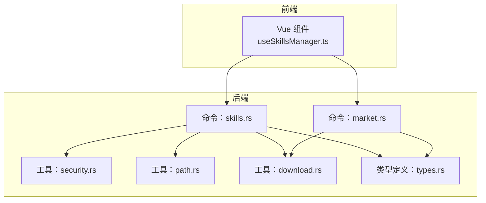
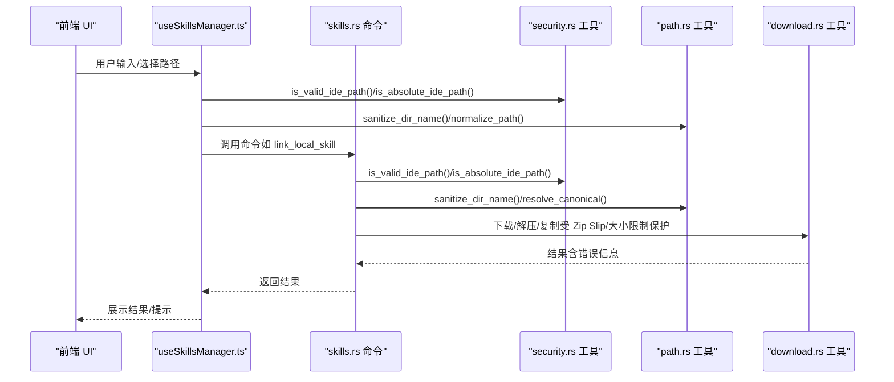
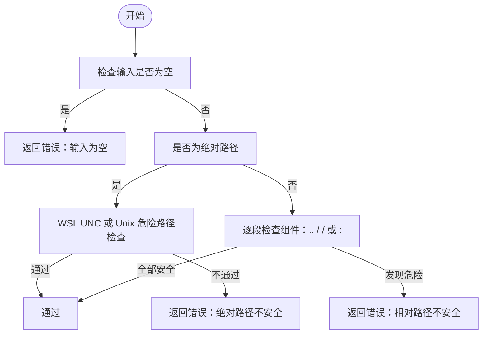
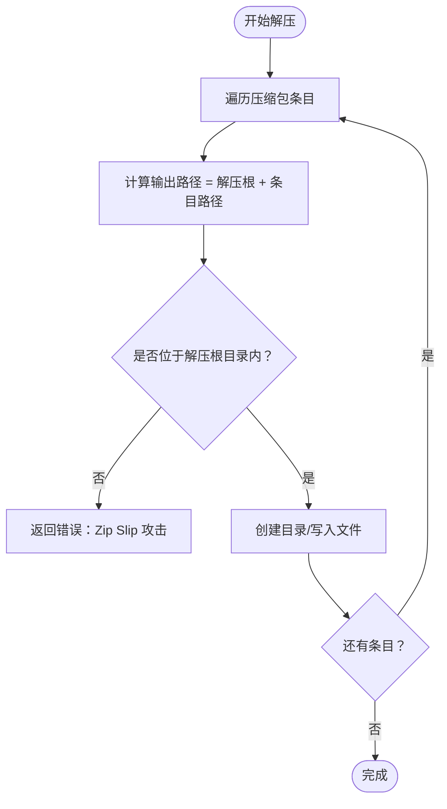
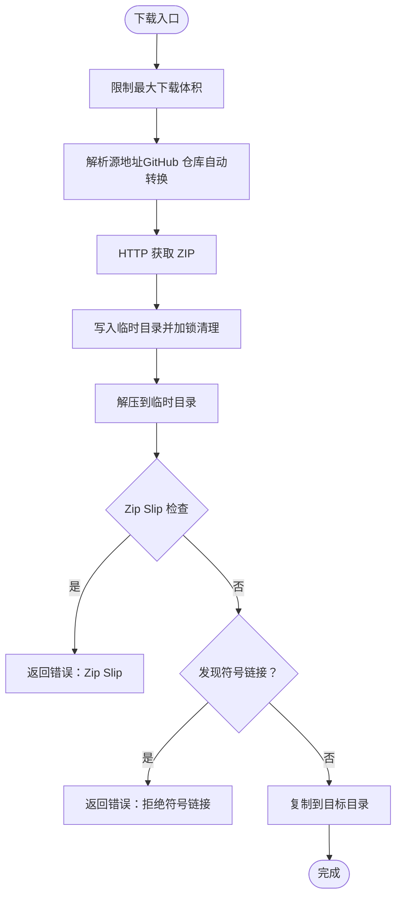
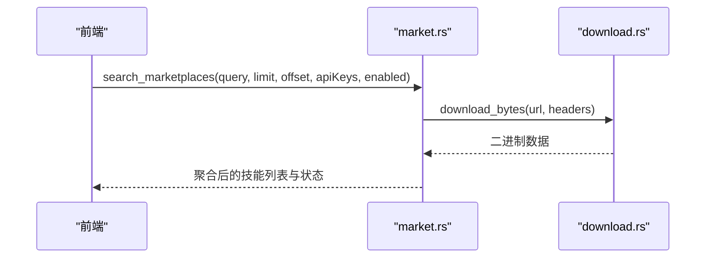
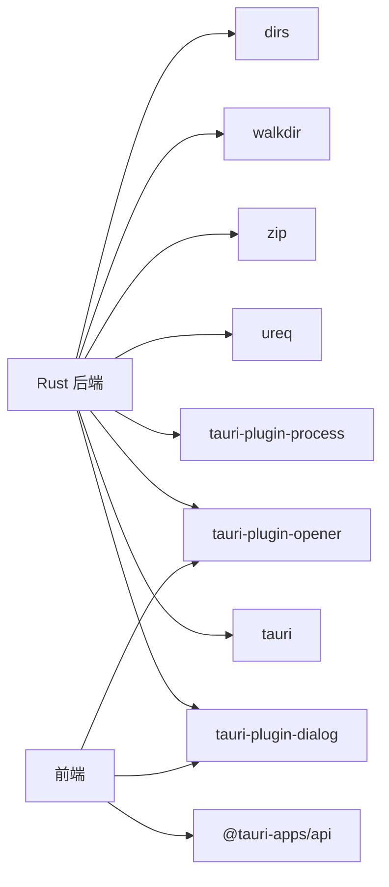

# 安全编程实践

<cite>
**本文引用的文件**
- [src-tauri/src/utils/security.rs](file://src-tauri/src/utils/security.rs)
- [src-tauri/src/utils/path.rs](file://src-tauri/src/utils/path.rs)
- [src-tauri/src/utils/download.rs](file://src-tauri/src/utils/download.rs)
- [src-tauri/src/commands/skills.rs](file://src-tauri/src/commands/skills.rs)
- [src-tauri/src/commands/market.rs](file://src-tauri/src/commands/market.rs)
- [src-tauri/src/types.rs](file://src-tauri/src/types.rs)
- [src/composables/useSkillsManager.ts](file://src/composables/useSkillsManager.ts)
- [src-tauri/Cargo.toml](file://src-tauri/Cargo.toml)
- [src-tauri/tauri.conf.json](file://src-tauri/tauri.conf.json)
- [src-tauri/capabilities/default.json](file://src-tauri/capabilities/default.json)
</cite>

## 目录
1. [简介](#简介)
2. [项目结构](#项目结构)
3. [核心组件](#核心组件)
4. [架构总览](#架构总览)
5. [详细组件分析](#详细组件分析)
6. [依赖关系分析](#依赖关系分析)
7. [性能考量](#性能考量)
8. [故障排查指南](#故障排查指南)
9. [结论](#结论)
10. [附录](#附录)

## 简介
本文件面向 Skills Manager 的安全编程实践，围绕输入验证、路径遍历防护、权限控制、敏感数据处理、符号链接安全、文件操作权限、恶意软件防护等主题，结合代码库中的实现进行系统化说明，并提供安全审计方法、漏洞检测与安全测试实践建议，以及可复用的安全编码示例与常见问题的解决方案。

## 项目结构
本项目采用前端（Vue + Tauri）与后端（Rust 命令层）分离的架构。安全相关的关键实现集中在 Rust 后端的工具模块与命令模块中，前端通过 Tauri 桥接调用后端命令，同时在前端侧也实现了部分输入校验与路径规范化逻辑。

**图表来源**
- [src/composables/useSkillsManager.ts:1-867](file://src/composables/useSkillsManager.ts#L1-L867)
- [src-tauri/src/commands/skills.rs:1-847](file://src-tauri/src/commands/skills.rs#L1-L847)
- [src-tauri/src/commands/market.rs:1-442](file://src-tauri/src/commands/market.rs#L1-L442)
- [src-tauri/src/utils/security.rs:1-92](file://src-tauri/src/utils/security.rs#L1-L92)
- [src-tauri/src/utils/path.rs:1-90](file://src-tauri/src/utils/path.rs#L1-L90)
- [src-tauri/src/utils/download.rs:1-273](file://src-tauri/src/utils/download.rs#L1-L273)
- [src-tauri/src/types.rs:1-214](file://src-tauri/src/types.rs#L1-L214)

**章节来源**
- [src/composables/useSkillsManager.ts:1-867](file://src/composables/useSkillsManager.ts#L1-L867)
- [src-tauri/src/commands/skills.rs:1-847](file://src-tauri/src/commands/skills.rs#L1-L847)
- [src-tauri/src/commands/market.rs:1-442](file://src-tauri/src/commands/market.rs#L1-L442)
- [src-tauri/src/utils/security.rs:1-92](file://src-tauri/src/utils/security.rs#L1-L92)
- [src-tauri/src/utils/path.rs:1-90](file://src-tauri/src/utils/path.rs#L1-L90)
- [src-tauri/src/utils/download.rs:1-273](file://src-tauri/src/utils/download.rs#L1-L273)
- [src-tauri/src/types.rs:1-214](file://src-tauri/src/types.rs#L1-L214)

## 核心组件
- 路径与安全工具
  - 安全路径判断：相对路径白名单、绝对路径白名单（含 WSL UNC）、危险系统路径阻断
  - 路径归一化与规范：去除冗余分隔符、解析真实路径、Windows 前缀剥离
  - 符号链接与目录边界：Zip Slip 防护、目录内限定、链接一致性校验
- 文件操作命令
  - 技能扫描与链接：IDE 目录扫描、符号链接/跨平台连接、安装/卸载/导入/导出
  - 市场下载：远程资源拉取、ZIP 解压、防 Zip Bomb 与 Zip Slip
- 类型与桥接
  - 请求/响应类型定义，前后端参数传递与校验

**章节来源**
- [src-tauri/src/utils/security.rs:1-92](file://src-tauri/src/utils/security.rs#L1-L92)
- [src-tauri/src/utils/path.rs:1-90](file://src-tauri/src/utils/path.rs#L1-L90)
- [src-tauri/src/utils/download.rs:1-273](file://src-tauri/src/utils/download.rs#L1-L273)
- [src-tauri/src/commands/skills.rs:1-847](file://src-tauri/src/commands/skills.rs#L1-L847)
- [src-tauri/src/commands/market.rs:1-442](file://src-tauri/src/commands/market.rs#L1-L442)
- [src-tauri/src/types.rs:1-214](file://src-tauri/src/types.rs#L1-L214)

## 架构总览
下图展示了从前端到后端命令与工具模块的安全控制链路，重点体现输入校验、路径归一化、边界检查与文件操作防护。

**图表来源**
- [src/composables/useSkillsManager.ts:149-188](file://src/composables/useSkillsManager.ts#L149-L188)
- [src-tauri/src/commands/skills.rs:452-535](file://src-tauri/src/commands/skills.rs#L452-L535)
- [src-tauri/src/utils/security.rs:31-70](file://src-tauri/src/utils/security.rs#L31-L70)
- [src-tauri/src/utils/path.rs:21-34](file://src-tauri/src/utils/path.rs#L21-L34)
- [src-tauri/src/utils/download.rs:143-183](file://src-tauri/src/utils/download.rs#L143-L183)

## 详细组件分析

### 输入验证与路径安全
- 相对路径白名单：仅允许非空、非绝对、不含父目录、根目录、前缀等危险组件
- 绝对路径白名单：WSL UNC 路径放行；Unix 上阻断系统关键路径；其他绝对路径需在允许范围内
- IDE 路径校验：统一使用安全校验函数，支持相对路径拼接至用户主目录
- 目录名清洗：ASCII 字母数字与连字符保留，空白与点替换为连字符，Windows 保留名前缀下划线

**图表来源**
- [src-tauri/src/utils/security.rs:3-19](file://src-tauri/src/utils/security.rs#L3-L19)
- [src-tauri/src/utils/security.rs:32-60](file://src-tauri/src/utils/security.rs#L32-L60)

**章节来源**
- [src-tauri/src/utils/security.rs:1-92](file://src-tauri/src/utils/security.rs#L1-L92)
- [src-tauri/src/utils/path.rs:61-83](file://src-tauri/src/utils/path.rs#L61-L83)
- [src/composables/useSkillsManager.ts:14-18](file://src/composables/useSkillsManager.ts#L14-L18)

### 符号链接安全与目录边界
- 链接一致性校验：比较链接目标与期望目标的规范化路径，避免“同源不同路径”攻击
- 跨平台链接：Unix 使用符号链接，Windows 使用目录连接（Junction），失败时回退本地拷贝
- 目录内限定：Zip 解压时对每个输出路径执行“是否位于解压根目录”的检查，防止 Zip Slip
- 防止复制符号链接：递归复制时遇到符号链接直接拒绝，避免跟随未知外部路径

**图表来源**
- [src-tauri/src/utils/download.rs:143-183](file://src-tauri/src/utils/download.rs#L143-L183)

**章节来源**
- [src-tauri/src/commands/skills.rs:201-206](file://src-tauri/src/commands/skills.rs#L201-L206)
- [src-tauri/src/commands/skills.rs:311-353](file://src-tauri/src/commands/skills.rs#L311-L353)
- [src-tauri/src/utils/download.rs:185-210](file://src-tauri/src/utils/download.rs#L185-L210)

### 文件操作权限与恶意软件防护
- 下载与解压限制：最大下载体积限制、单文件解压大小限制、禁止 Zip Slip、禁止符号链接复制
- 导出策略：拒绝导出包含符号链接的内容，导出路径不得位于所选技能目录内部
- 安装范围限制：安装目录必须位于允许范围之内，避免越权写入
- 卸载与删除：仅允许在允许根目录内删除，拒绝删除无 SKILL.md 的目录，拒绝删除根目录

**图表来源**
- [src-tauri/src/utils/download.rs:27-48](file://src-tauri/src/utils/download.rs#L27-L48)
- [src-tauri/src/utils/download.rs:143-183](file://src-tauri/src/utils/download.rs#L143-L183)
- [src-tauri/src/utils/download.rs:185-210](file://src-tauri/src/utils/download.rs#L185-L210)

**章节来源**
- [src-tauri/src/utils/download.rs:50-116](file://src-tauri/src/utils/download.rs#L50-L116)
- [src-tauri/src/commands/skills.rs:252-309](file://src-tauri/src/commands/skills.rs#L252-L309)
- [src-tauri/src/commands/skills.rs:760-800](file://src-tauri/src/commands/skills.rs#L760-L800)

### 权限控制与能力配置
- 前端能力：默认能力包含窗口、对话框、打开器、进程插件，满足基本文件操作与外部程序调用需求
- CSP 策略：严格限制脚本来源、图片来源与连接目标，降低 XSS 与不安全连接风险
- 插件签名与更新：启用更新插件并配置公钥，确保更新通道可信

**章节来源**
- [src-tauri/capabilities/default.json:1-15](file://src-tauri/capabilities/default.json#L1-L15)
- [src-tauri/tauri.conf.json:20-22](file://src-tauri/tauri.conf.json#L20-L22)
- [src-tauri/Cargo.toml:20-36](file://src-tauri/Cargo.toml#L20-L36)

### 数据流与命令交互
- 市场搜索与下载：前端发起请求，后端按市场配置与启用状态并发拉取，解析并聚合结果
- 技能管理：扫描本地与 IDE 目录，构建概览；支持链接、卸载、导入、导出、采用（迁移+链接）

**图表来源**
- [src-tauri/src/commands/market.rs:174-392](file://src-tauri/src/commands/market.rs#L174-L392)
- [src-tauri/src/utils/download.rs:27-48](file://src-tauri/src/utils/download.rs#L27-L48)

**章节来源**
- [src-tauri/src/commands/market.rs:1-442](file://src-tauri/src/commands/market.rs#L1-L442)
- [src-tauri/src/utils/download.rs:1-273](file://src-tauri/src/utils/download.rs#L1-L273)

## 依赖关系分析
- Rust 依赖：Tauri、对话框、打开器、进程、JSON、网络、压缩、遍历、路径工具
- 前端依赖：@tauri-apps/api、@tauri-apps/plugin-dialog、@tauri-apps/plugin-opener、vue-i18n

**图表来源**
- [src-tauri/Cargo.toml:20-36](file://src-tauri/Cargo.toml#L20-L36)

**章节来源**
- [src-tauri/Cargo.toml:1-36](file://src-tauri/Cargo.toml#L1-L36)

## 性能考量
- 下载与解压限制：通过最大体积与单文件大小限制，避免内存与磁盘压力过大
- 归一化与规范化：路径归一化减少重复计算，规范化路径用于安全比较
- 并发搜索：市场搜索使用异步运行时并发拉取多个来源，提升响应速度

[本节为通用指导，无需特定文件引用]

## 故障排查指南
- Zip Slip：若出现“尝试写入解压根目录外”的错误，检查压缩包路径遍历字段或上游来源
- 符号链接：若复制/导出报错“检测到符号链接”，请移除符号链接或改用普通文件
- 路径越权：若提示“目标路径超出允许范围”，确认路径是否在允许根目录内
- Windows 连接：若符号链接失败，尝试使用目录连接（Junction），失败则回退本地拷贝
- 下载失败：检查网络、超时设置与来源 URL 是否正确

**章节来源**
- [src-tauri/src/utils/download.rs:157-164](file://src-tauri/src/utils/download.rs#L157-L164)
- [src-tauri/src/utils/download.rs:189-194](file://src-tauri/src/utils/download.rs#L189-L194)
- [src-tauri/src/commands/skills.rs:276-282](file://src-tauri/src/commands/skills.rs#L276-L282)
- [src-tauri/src/commands/skills.rs:332-353](file://src-tauri/src/commands/skills.rs#L332-L353)

## 结论
本项目在路径安全、符号链接防护、文件操作边界与下载安全等方面形成了较为完整的安全基线。通过输入校验、路径归一化、Zip Slip 与 Zip Bomb 防护、权限范围限制与能力最小化配置，有效降低了常见攻击面。建议持续完善安全测试与审计流程，保持依赖更新与策略优化。

[本节为总结性内容，无需特定文件引用]

## 附录

### 安全审计清单
- 输入校验：是否对所有用户输入执行路径合法性检查
- 路径归一化：是否对所有路径进行规范化与规范化路径比较
- 目录边界：解压与复制是否均执行“是否位于允许根目录内”的检查
- 符号链接：是否拒绝复制/导出符号链接，链接一致性是否校验
- 权限范围：安装/卸载/删除是否限定在允许根目录内
- 外部下载：是否限制下载大小与单文件大小，是否校验来源可信
- 能力与 CSP：是否最小化前端能力，是否配置严格 CSP

[本节为通用指导，无需特定文件引用]

### 常见安全问题与解决方案
- 路径遍历（../）：使用安全相对路径判断与组件过滤
- 绝对路径越权：使用绝对路径白名单与危险路径阻断
- Zip Slip：解压时对输出路径进行“是否位于解压根目录内”的检查
- Zip Bomb：限制单文件与总大小
- 符号链接攻击：拒绝复制/导出符号链接，链接一致性校验
- 跨平台链接：优先符号链接，失败回退目录连接，最终本地拷贝

**章节来源**
- [src-tauri/src/utils/security.rs:3-19](file://src-tauri/src/utils/security.rs#L3-L19)
- [src-tauri/src/utils/security.rs:32-60](file://src-tauri/src/utils/security.rs#L32-L60)
- [src-tauri/src/utils/download.rs:143-183](file://src-tauri/src/utils/download.rs#L143-L183)
- [src-tauri/src/utils/download.rs:185-210](file://src-tauri/src/utils/download.rs#L185-L210)
- [src-tauri/src/commands/skills.rs:276-282](file://src-tauri/src/commands/skills.rs#L276-L282)