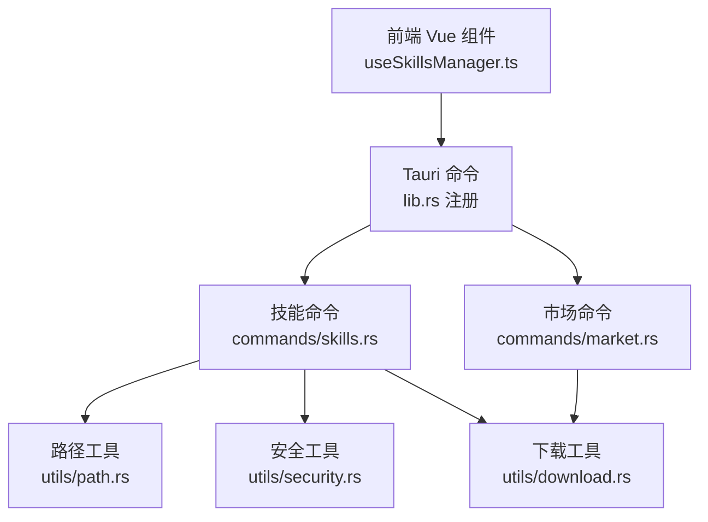
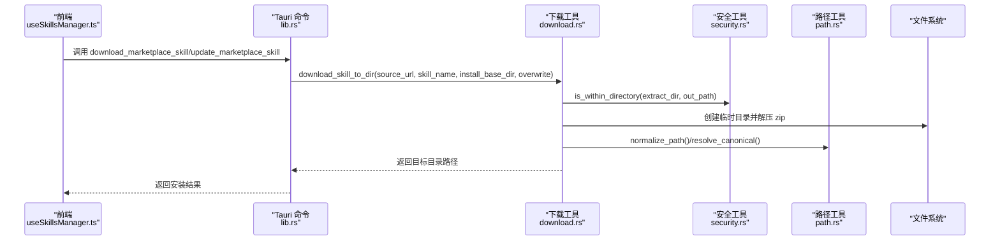
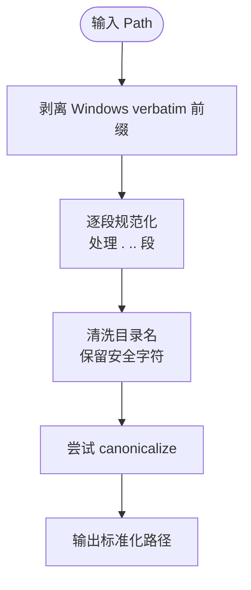
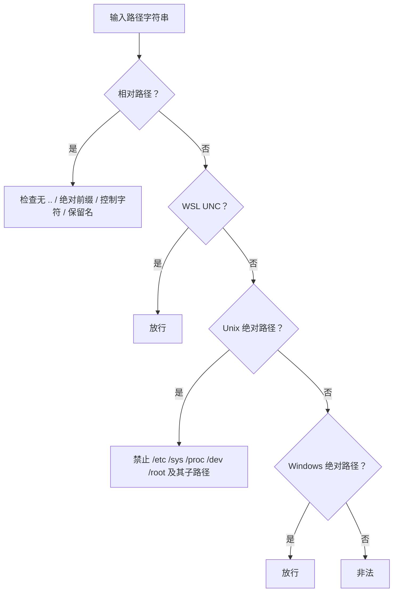
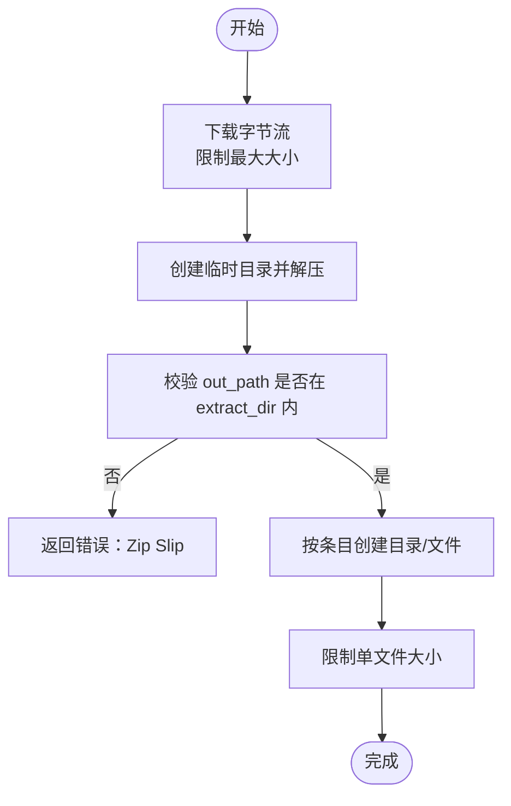
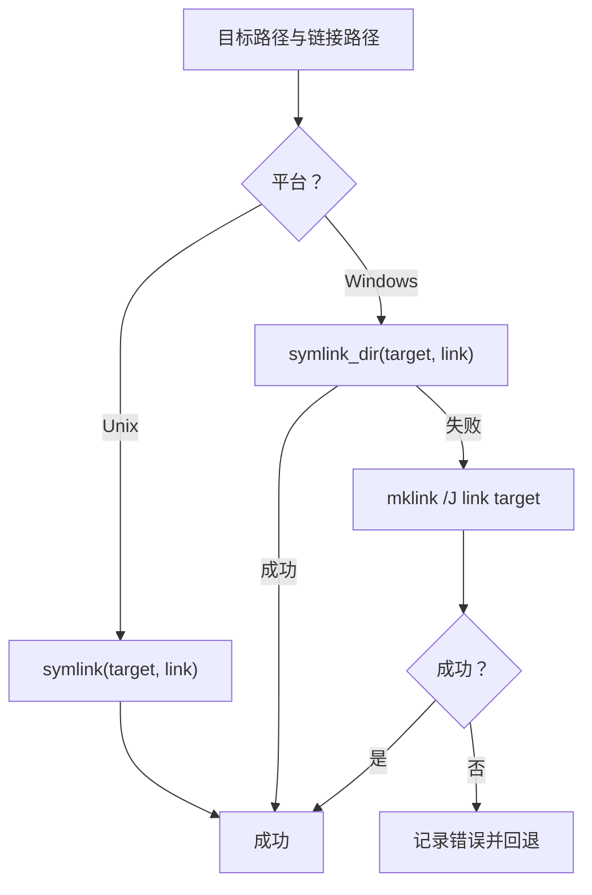
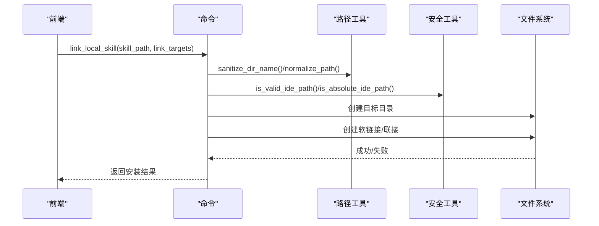
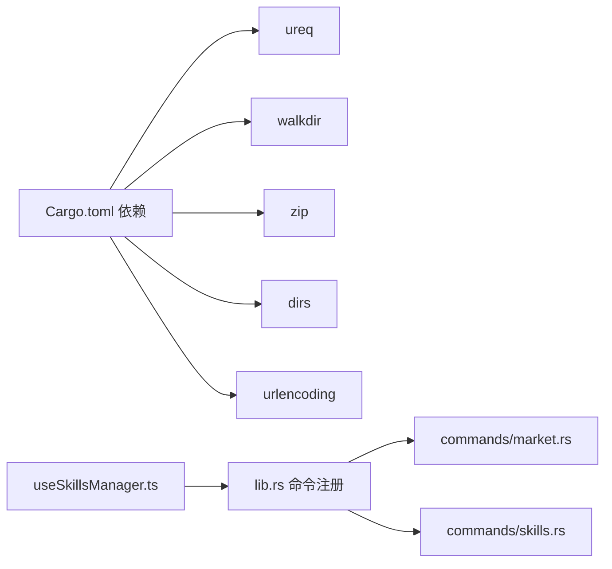

# 文件系统操作

<cite>
**本文引用的文件**
- [src-tauri/src/utils/path.rs](file://src-tauri/src/utils/path.rs)
- [src-tauri/src/utils/download.rs](file://src-tauri/src/utils/download.rs)
- [src-tauri/src/utils/security.rs](file://src-tauri/src/utils/security.rs)
- [src-tauri/src/commands/skills.rs](file://src-tauri/src/commands/skills.rs)
- [src-tauri/src/commands/market.rs](file://src-tauri/src/commands/market.rs)
- [src-tauri/src/lib.rs](file://src-tauri/src/lib.rs)
- [src-tauri/Cargo.toml](file://src-tauri/Cargo.toml)
- [src/composables/useSkillsManager.ts](file://src/composables/useSkillsManager.ts)
- [src/composables/utils.ts](file://src/composables/utils.ts)
</cite>

## 目录
1. [简介](#简介)
2. [项目结构](#项目结构)
3. [核心组件](#核心组件)
4. [架构总览](#架构总览)
5. [详细组件分析](#详细组件分析)
6. [依赖关系分析](#依赖关系分析)
7. [性能考量](#性能考量)
8. [故障排查指南](#故障排查指南)
9. [结论](#结论)
10. [附录](#附录)

## 简介
本文件系统操作文档聚焦 Skills Manager 的文件与目录管理、符号链接（软链接/联接）处理、远程文件下载与解压、路径解析与安全校验等能力。文档从跨平台差异、权限与安全、错误处理策略、性能优化与并发访问等方面进行系统化梳理，并提供可操作的最佳实践与排障建议。

## 项目结构
Skills Manager 的系统操作层位于 Rust 的 Tauri 命令模块中，前端通过 @tauri-apps/api 调用后端命令，实现对本地技能仓库、IDE 技能目录、项目技能挂载的统一管理。

图表来源
- [src-tauri/src/lib.rs:20-53](file://src-tauri/src/lib.rs#L20-L53)
- [src-tauri/src/commands/skills.rs:1-16](file://src-tauri/src/commands/skills.rs#L1-L16)
- [src-tauri/src/commands/market.rs:1-8](file://src-tauri/src/commands/market.rs#L1-L8)

章节来源
- [src-tauri/src/lib.rs:20-53](file://src-tauri/src/lib.rs#L20-L53)
- [src-tauri/Cargo.toml:20-36](file://src-tauri/Cargo.toml#L20-L36)

## 核心组件
- 路径与规范化：统一路径解析、去除 Windows verbatim 前缀、标准化相对路径、安全目录名清洗、规范化与规范路径解析。
- 安全校验：相对路径安全检查、绝对路径安全检查（含 WSL UNC）、路径是否在允许范围内的判断、Zip Slip 防护。
- 下载与解压：HTTP 下载、Zip 解压、临时目录 RAII 清理、ZipBomb 防护、递归复制与符号链接拒绝。
- 符号链接与联接：跨平台软链接创建（Unix/Linux），Windows 联接（junction）回退，符号链接一致性校验与删除。
- 技能生命周期：扫描、导入、导出、安装（链接/复制）、卸载、采用（迁移+链接）。

章节来源
- [src-tauri/src/utils/path.rs:21-90](file://src-tauri/src/utils/path.rs#L21-L90)
- [src-tauri/src/utils/security.rs:3-92](file://src-tauri/src/utils/security.rs#L3-L92)
- [src-tauri/src/utils/download.rs:27-273](file://src-tauri/src/utils/download.rs#L27-L273)
- [src-tauri/src/commands/skills.rs:17-804](file://src-tauri/src/commands/skills.rs#L17-L804)

## 架构总览
以下序列图展示“下载并安装技能”的完整流程，包括前端调用、命令执行、下载与解压、路径安全校验与安装决策。

图表来源
- [src-tauri/src/commands/market.rs:394-441](file://src-tauri/src/commands/market.rs#L394-L441)
- [src-tauri/src/utils/download.rs:50-116](file://src-tauri/src/utils/download.rs#L50-L116)
- [src-tauri/src/utils/security.rs:72-91](file://src-tauri/src/utils/security.rs#L72-L91)
- [src-tauri/src/utils/path.rs:21-34](file://src-tauri/src/utils/path.rs#L21-L34)

## 详细组件分析

### 路径解析与规范化
- Windows verbatim 前缀剥离：针对 Windows UNC/verbatim 路径进行转换，避免后续比较误判。
- 规范化路径：逐段处理当前目录、父目录、普通段，生成无冗余的标准化路径。
- 安全目录名清洗：仅保留字母数字、连字符、下划线；空白与点替换为连字符；Windows 保留名前加下划线；空名回退为默认值。
- 规范化与规范路径：规范化后尝试 canonicalize，失败时回退到标准化路径，保证跨平台一致性。

图表来源
- [src-tauri/src/utils/path.rs:4-19](file://src-tauri/src/utils/path.rs#L4-L19)
- [src-tauri/src/utils/path.rs:21-34](file://src-tauri/src/utils/path.rs#L21-L34)
- [src-tauri/src/utils/path.rs:61-83](file://src-tauri/src/utils/path.rs#L61-L83)
- [src-tauri/src/utils/path.rs:85-90](file://src-tauri/src/utils/path.rs#L85-L90)

章节来源
- [src-tauri/src/utils/path.rs:21-90](file://src-tauri/src/utils/path.rs#L21-L90)

### 安全路径与目录边界
- 相对路径安全：禁止绝对路径、禁止父目录遍历、禁止包含危险组件、Windows 保留名检查、控制字符过滤。
- 绝对路径安全：支持 Unix 绝对路径与 Windows 绝对路径；WSL UNC 路径放行；Unix 上禁止危险系统路径。
- 路径边界：is_within_directory 对目标路径进行规范化与规范化后的绝对路径拼接，确保写入不越界。

图表来源
- [src-tauri/src/composables/utils.ts:34-99](file://src-tauri/src/composables/utils.ts#L34-L99)
- [src-tauri/src/utils/security.rs:3-65](file://src-tauri/src/utils/security.rs#L3-L65)
- [src-tauri/src/utils/security.rs:72-91](file://src-tauri/src/utils/security.rs#L72-L91)

章节来源
- [src-tauri/src/composables/utils.ts:34-99](file://src-tauri/src/composables/utils.ts#L34-L99)
- [src-tauri/src/utils/security.rs:3-92](file://src-tauri/src/utils/security.rs#L3-L92)

### 下载与解压（含 Zip Slip 与 ZipBomb 防护）
- HTTP 下载：设置重定向次数、超时、请求头；限制最大下载体积以防止内存溢出。
- Zip 解压：对每个条目进行 is_within_directory 校验，防止 Zip Slip；单文件最大解压大小限制；创建目录与文件时进行权限选项设置。
- 临时目录 RAII：使用临时目录守卫，在作用域结束自动清理，避免残留。
- 归档与复制：递归复制时拒绝符号链接；导出 ZIP 时同样拒绝符号链接并设置压缩与权限。

图表来源
- [src-tauri/src/utils/download.rs:27-48](file://src-tauri/src/utils/download.rs#L27-L48)
- [src-tauri/src/utils/download.rs:143-183](file://src-tauri/src/utils/download.rs#L143-L183)
- [src-tauri/src/utils/download.rs:118-141](file://src-tauri/src/utils/download.rs#L118-L141)
- [src-tauri/src/utils/security.rs:72-91](file://src-tauri/src/utils/security.rs#L72-L91)

章节来源
- [src-tauri/src/utils/download.rs:27-273](file://src-tauri/src/utils/download.rs#L27-L273)

### 符号链接与跨平台联接
- 跨平台软链接：Unix 使用 symlink，Windows 使用 symlink_dir。
- Windows 联接回退：若软链接失败，尝试 mklink /J（目录联接），并对路径中的危险字符进行校验。
- 符号链接一致性：通过 resolve_canonical 比较链接目标与期望目标，避免攻击与误判。
- 删除策略：区分符号链接与目录/文件，分别使用 remove_file/remove_dir_all，避免 macOS 的 ENOTDIR 问题。

图表来源
- [src-tauri/src/commands/skills.rs:208-217](file://src-tauri/src/commands/skills.rs#L208-L217)
- [src-tauri/src/commands/skills.rs:311-353](file://src-tauri/src/commands/skills.rs#L311-L353)
- [src-tauri/src/commands/skills.rs:186-199](file://src-tauri/src/commands/skills.rs#L186-L199)
- [src-tauri/src/commands/skills.rs:201-206](file://src-tauri/src/commands/skills.rs#L201-L206)

章节来源
- [src-tauri/src/commands/skills.rs:186-217](file://src-tauri/src/commands/skills.rs#L186-L217)
- [src-tauri/src/commands/skills.rs:311-353](file://src-tauri/src/commands/skills.rs#L311-L353)

### 技能生命周期与安装策略
- 扫描概览：收集本地仓库与各 IDE 目录中的技能，识别链接与受管状态。
- 导入本地技能：校验 SKILL.md 存在，复制到本地仓库。
- 导出本地技能：打包为 ZIP，拒绝符号链接，设置压缩与权限。
- 安装（链接）：在目标 IDE 目录创建链接或联接，若失败则回退复制。
- 卸载：区分链接与物理目录，安全删除；支持批量卸载。
- 采用（迁移+链接）：将 IDE 中的技能迁移到本地仓库并建立链接，失败时回退复制。

图表来源
- [src-tauri/src/commands/skills.rs:355-449](file://src-tauri/src/commands/skills.rs#L355-L449)
- [src-tauri/src/utils/path.rs:61-83](file://src-tauri/src/utils/path.rs#L61-L83)
- [src-tauri/src/utils/security.rs:62-70](file://src-tauri/src/utils/security.rs#L62-L70)

章节来源
- [src-tauri/src/commands/skills.rs:60-93](file://src-tauri/src/commands/skills.rs#L60-L93)
- [src-tauri/src/commands/skills.rs:611-637](file://src-tauri/src/commands/skills.rs#L611-L637)
- [src-tauri/src/commands/skills.rs:760-804](file://src-tauri/src/commands/skills.rs#L760-L804)

## 依赖关系分析
- 外部库依赖：ureq（HTTP）、walkdir（递归遍历）、zip（压缩/解压）、dirs（用户目录）、urlencoding（URL 编码）。
- 命令注册：lib.rs 将 market 与 skills 命令注册为 Tauri 可调用接口。
- 前端集成：useSkillsManager.ts 通过 @tauri-apps/api 调用命令，构建安装基目录、处理队列、导出/导入等。

图表来源
- [src-tauri/Cargo.toml:20-36](file://src-tauri/Cargo.toml#L20-L36)
- [src-tauri/src/lib.rs:27-39](file://src-tauri/src/lib.rs#L27-L39)

章节来源
- [src-tauri/Cargo.toml:20-36](file://src-tauri/Cargo.toml#L20-L36)
- [src-tauri/src/lib.rs:27-39](file://src-tauri/src/lib.rs#L27-L39)

## 性能考量
- I/O 并发：下载与解压在阻塞任务中执行，避免阻塞主线程；导出 ZIP 时逐条目写入，减少内存占用。
- 递归遍历：使用 walkdir 进行深度遍历，避免手动栈管理；在复制/导出时跳过符号链接，减少无效 I/O。
- 临时目录：RAII 守卫确保异常路径也能清理临时目录，降低磁盘碎片与泄漏风险。
- 压缩与权限：导出时设置 Deflate 压缩与合理的 Unix 权限，平衡体积与可执行性。
- 前端缓存：前端对市场搜索结果进行 TTL 缓存，减少重复网络请求。

章节来源
- [src-tauri/src/utils/download.rs:118-141](file://src-tauri/src/utils/download.rs#L118-L141)
- [src-tauri/src/commands/skills.rs:252-309](file://src-tauri/src/commands/skills.rs#L252-L309)
- [src/composables/useSkillsManager.ts:23-27](file://src/composables/useSkillsManager.ts#L23-L27)

## 故障排查指南
- 下载失败
  - 检查网络与代理；确认超时与重定向配置；查看最大下载体积限制。
  - 参考路径：[src-tauri/src/utils/download.rs:27-48](file://src-tauri/src/utils/download.rs#L27-L48)
- Zip Slip/ZipBomb
  - 确认 is_within_directory 校验与单文件大小限制；检查 extract 目录是否正确。
  - 参考路径：[src-tauri/src/utils/download.rs:143-183](file://src-tauri/src/utils/download.rs#L143-L183)
- 路径越界/非法路径
  - 使用 is_valid_ide_path/is_absolute_ide_path 校验；确保路径在 home 或允许范围内。
  - 参考路径：[src-tauri/src/utils/security.rs:62-70](file://src-tauri/src/utils/security.rs#L62-L70)
- 符号链接/联接失败
  - Unix：确认权限与目标路径；Windows：检查 mklink 权限与危险字符。
  - 参考路径：[src-tauri/src/commands/skills.rs:208-217](file://src-tauri/src/commands/skills.rs#L208-L217)
- 卸载/删除失败
  - 区分符号链接与目录/文件；确保目标在允许根目录内且包含 SKILL.md。
  - 参考路径：[src-tauri/src/commands/skills.rs:538-609](file://src-tauri/src/commands/skills.rs#L538-L609)
- 导出失败
  - 检查导出路径合法性与是否在技能目录内部；拒绝符号链接。
  - 参考路径：[src-tauri/src/commands/skills.rs:760-804](file://src-tauri/src/commands/skills.rs#L760-L804)

章节来源
- [src-tauri/src/utils/download.rs:143-183](file://src-tauri/src/utils/download.rs#L143-L183)
- [src-tauri/src/utils/security.rs:62-70](file://src-tauri/src/utils/security.rs#L62-L70)
- [src-tauri/src/commands/skills.rs:538-609](file://src-tauri/src/commands/skills.rs#L538-L609)
- [src-tauri/src/commands/skills.rs:760-804](file://src-tauri/src/commands/skills.rs#L760-L804)

## 结论
Skills Manager 在文件系统操作上实现了跨平台兼容、安全防护与性能优化的平衡：通过路径规范化与安全校验防范路径注入与 Zip Slip；通过符号链接与联接实现轻量安装；通过阻塞任务与 RAII 清理保障稳定性。遵循本文最佳实践，可在多平台上安全高效地管理 AI 技能资源。

## 附录

### 最佳实践清单
- 路径安全
  - 始终使用 is_valid_ide_path/is_absolute_ide_path 校验输入路径。
  - 使用 normalize_path/resolve_canonical 统一路径表示。
  - Windows 保留名与控制字符过滤，避免命名冲突。
- 下载与解压
  - 设置最大下载体积与单文件解压上限，防止内存与磁盘压力。
  - 解压前严格校验 is_within_directory，拒绝 Zip Slip。
  - 使用临时目录 RAII 守卫，确保异常清理。
- 符号链接与联接
  - 先尝试软链接，失败再回退到 Windows 联接；记录并报告错误。
  - 删除前区分符号链接与目录/文件，避免平台差异导致的错误。
- 技能生命周期
  - 导入/导出均需校验 SKILL.md 存在；导出拒绝符号链接。
  - 批量操作时记录成功/失败统计，便于回滚与重试。
- 并发与性能
  - 下载与解压在阻塞任务中执行；导出逐条目写入；前端对搜索结果进行缓存。

章节来源
- [src-tauri/src/utils/security.rs:3-92](file://src-tauri/src/utils/security.rs#L3-L92)
- [src-tauri/src/utils/path.rs:21-90](file://src-tauri/src/utils/path.rs#L21-L90)
- [src-tauri/src/utils/download.rs:118-183](file://src-tauri/src/utils/download.rs#L118-L183)
- [src-tauri/src/commands/skills.rs:252-309](file://src-tauri/src/commands/skills.rs#L252-L309)