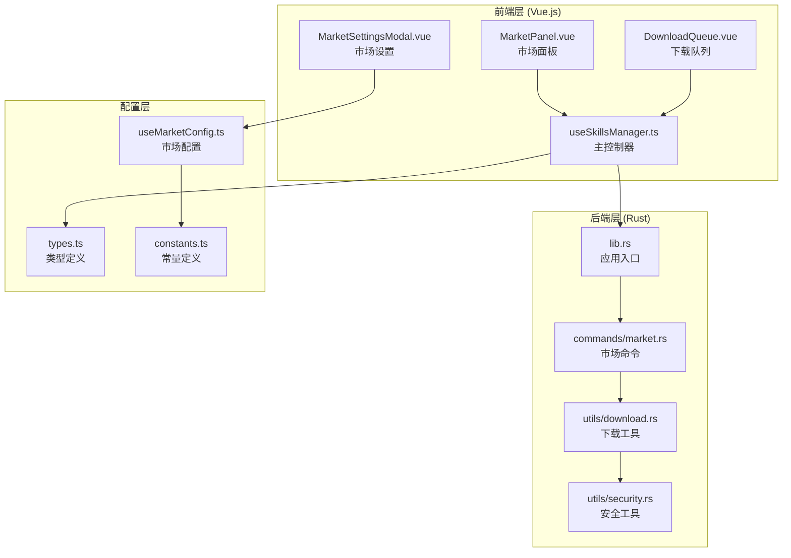
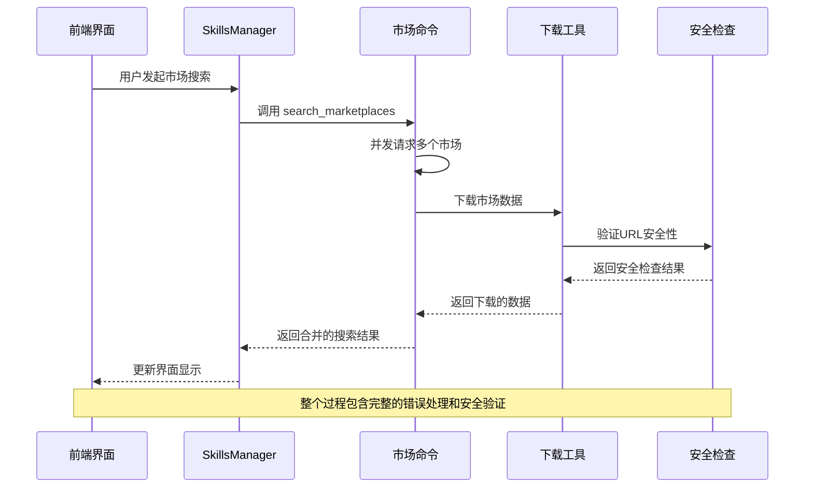
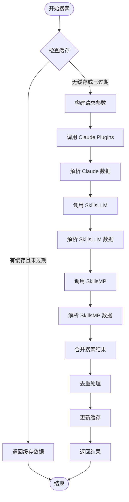
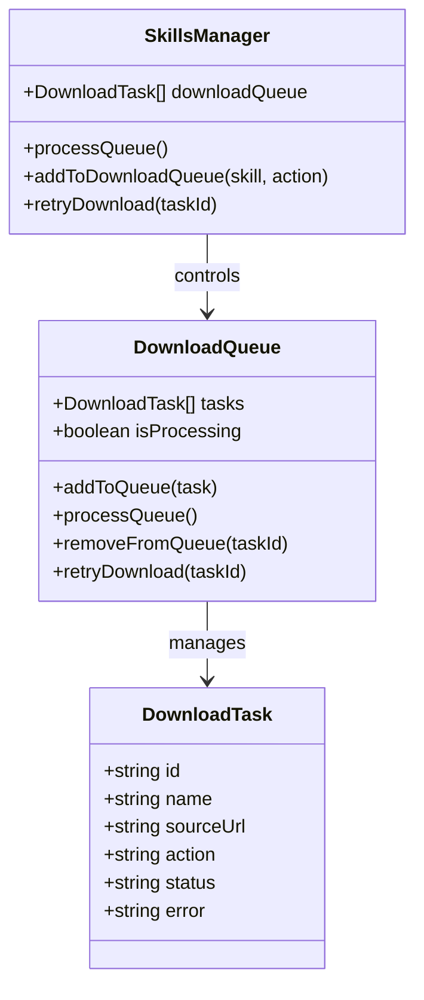
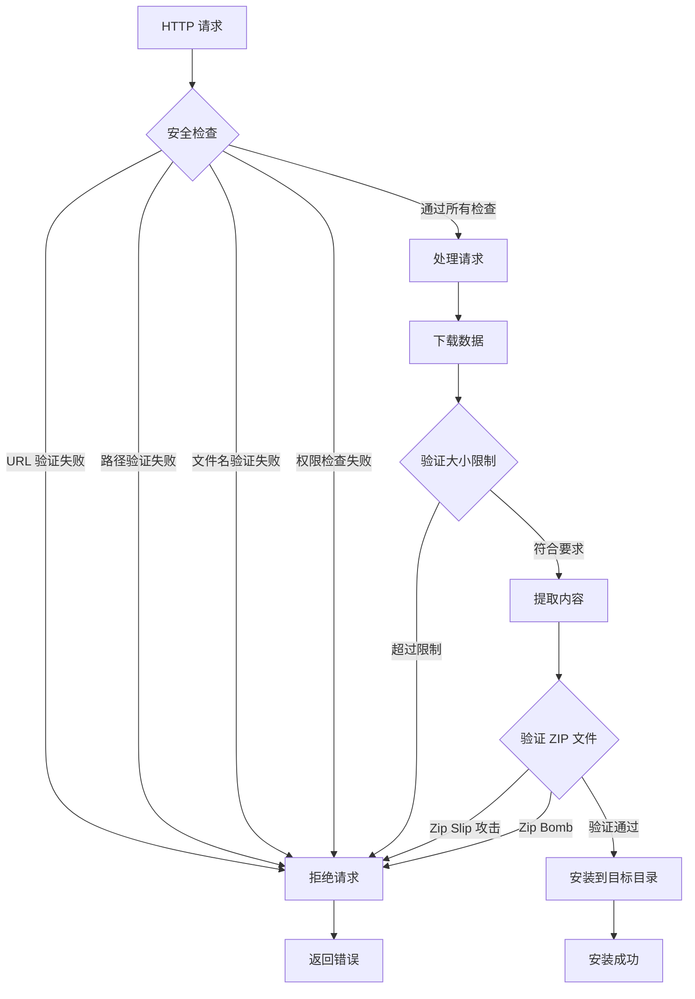
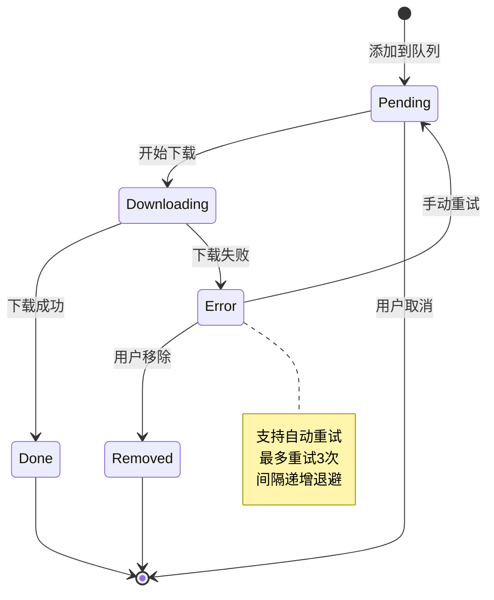
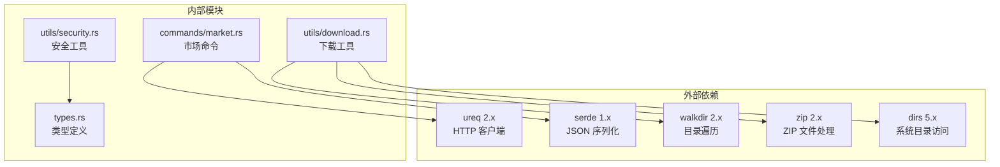

# 网络请求处理

<cite>
**本文档引用的文件**
- [useSkillsManager.ts](file://src/composables/useSkillsManager.ts)
- [market.rs](file://src-tauri/src/commands/market.rs)
- [download.rs](file://src-tauri/src/utils/download.rs)
- [security.rs](file://src-tauri/src/utils/security.rs)
- [types.ts](file://src/composables/types.ts)
- [useMarketConfig.ts](file://src/composables/useMarketConfig.ts)
- [DownloadQueue.vue](file://src/components/DownloadQueue.vue)
- [MarketPanel.vue](file://src/components/MarketPanel.vue)
- [MarketSettingsModal.vue](file://src/components/MarketSettingsModal.vue)
- [lib.rs](file://src-tauri/src/lib.rs)
- [Cargo.toml](file://src-tauri/Cargo.toml)
- [constants.ts](file://src/composables/constants.ts)
</cite>

## 目录
1. [简介](#简介)
2. [项目结构](#项目结构)
3. [核心组件](#核心组件)
4. [架构概览](#架构概览)
5. [详细组件分析](#详细组件分析)
6. [依赖关系分析](#依赖关系分析)
7. [性能考量](#性能考量)
8. [故障排除指南](#故障排除指南)
9. [结论](#结论)

## 简介

Skills Manager 是一个基于 Tauri 架构的应用程序，专门用于技能（Skills）的发现、下载、安装和管理。该应用程序实现了完整的网络请求处理机制，包括市场 API 调用、下载管理、安全验证和错误恢复策略。

本项目采用前后端分离的架构设计：前端使用 Vue.js 进行用户界面交互，后端使用 Rust 提供高性能的网络请求处理和文件操作能力。通过 Tauri 的桥接机制，前端可以调用后端的原生功能，实现安全高效的网络通信。

## 项目结构

项目采用模块化组织方式，主要分为以下几个核心部分：

**图表来源**
- [useSkillsManager.ts:1-867](file://src/composables/useSkillsManager.ts#L1-L867)
- [lib.rs:1-54](file://src-tauri/src/lib.rs#L1-L54)
- [market.rs:1-442](file://src-tauri/src/commands/market.rs#L1-L442)

**章节来源**
- [useSkillsManager.ts:1-867](file://src/composables/useSkillsManager.ts#L1-L867)
- [lib.rs:1-54](file://src-tauri/src/lib.rs#L1-L54)

## 核心组件

### 前端网络请求控制器

前端的网络请求处理主要由 `useSkillsManager` 组合式函数负责，它提供了完整的市场搜索、下载队列管理和错误处理机制。

### 后端市场命令处理器

后端的市场命令处理器实现了多市场聚合搜索功能，支持 Claude Plugins、SkillsLLM 和 SkillsMP 三个市场服务。

### 下载管理器

下载管理器提供了异步下载、队列管理和进度跟踪功能，确保用户可以同时管理多个技能的下载任务。

**章节来源**
- [useSkillsManager.ts:20-800](file://src/composables/useSkillsManager.ts#L20-L800)
- [market.rs:173-442](file://src-tauri/src/commands/market.rs#L173-L442)
- [download.rs:27-273](file://src-tauri/src/utils/download.rs#L27-L273)

## 架构概览

系统采用分层架构设计，实现了清晰的关注点分离：

**图表来源**
- [useSkillsManager.ts:190-248](file://src/composables/useSkillsManager.ts#L190-L248)
- [market.rs:173-392](file://src-tauri/src/commands/market.rs#L173-L392)
- [download.rs:27-48](file://src-tauri/src/utils/download.rs#L27-L48)

## 详细组件分析

### 市场搜索与聚合

市场搜索功能实现了多市场数据聚合，支持实时搜索和分页加载：

**图表来源**
- [useSkillsManager.ts:190-248](file://src/composables/useSkillsManager.ts#L190-L248)
- [market.rs:173-392](file://src-tauri/src/commands/market.rs#L173-L392)

#### 市场配置管理

市场配置系统支持动态启用/禁用市场服务，并提供 API 密钥管理：

**章节来源**
- [useSkillsManager.ts:116-135](file://src/composables/useSkillsManager.ts#L116-L135)
- [useMarketConfig.ts:1-67](file://src/composables/useMarketConfig.ts#L1-L67)
- [constants.ts:37-53](file://src/composables/constants.ts#L37-L53)

### 下载队列管理系统

下载队列系统实现了智能的任务调度和状态管理：

**图表来源**
- [types.ts:86-96](file://src/composables/types.ts#L86-L96)
- [useSkillsManager.ts:263-342](file://src/composables/useSkillsManager.ts#L263-L342)

#### 下载流程控制

下载流程实现了完整的生命周期管理：

**章节来源**
- [useSkillsManager.ts:278-329](file://src/composables/useSkillsManager.ts#L278-L329)
- [DownloadQueue.vue:1-113](file://src/components/DownloadQueue.vue#L1-L113)

### 网络安全与防护

系统实现了多层次的安全防护机制：

**图表来源**
- [download.rs:27-48](file://src-tauri/src/utils/download.rs#L27-L48)
- [download.rs:143-183](file://src-tauri/src/utils/download.rs#L143-L183)
- [security.rs:1-92](file://src-tauri/src/utils/security.rs#L1-L92)

#### SSL/TLS 处理

系统使用现代的 TLS 协议栈确保网络通信安全：

**章节来源**
- [Cargo.toml:26](file://src-tauri/Cargo.toml#L26)
- [download.rs:27-48](file://src-tauri/src/utils/download.rs#L27-L48)

### 错误处理与重试机制

系统实现了完善的错误处理和恢复策略：

**图表来源**
- [useSkillsManager.ts:335-342](file://src/composables/useSkillsManager.ts#L335-L342)
- [DownloadQueue.vue:32-37](file://src/components/DownloadQueue.vue#L32-L37)

## 依赖关系分析

系统依赖关系清晰明确，遵循单一职责原则：

**图表来源**
- [Cargo.toml:20-31](file://src-tauri/Cargo.toml#L20-L31)
- [market.rs:1-8](file://src-tauri/src/commands/market.rs#L1-L8)

**章节来源**
- [Cargo.toml:1-36](file://src-tauri/Cargo.toml#L1-L36)
- [lib.rs:6-18](file://src-tauri/src/lib.rs#L6-L18)

## 性能考量

### 缓存策略

系统实现了智能的缓存机制以提升性能：

- **缓存时间**: 默认 10 分钟 TTL
- **缓存键**: 查询字符串 + 限制数量组合
- **缓存内容**: 搜索结果和市场状态

### 并发优化

- **异步处理**: 使用 `spawn_blocking` 处理阻塞操作
- **并发请求**: 同时向多个市场发送请求
- **资源限制**: 控制最大下载大小防止内存溢出

### 内存管理

- **流式处理**: 使用 `std::io::Take` 限制下载大小
- **RAII 守护**: 自动清理临时目录
- **符号链接检测**: 防止目录遍历攻击

## 故障排除指南

### 常见问题诊断

1. **市场连接失败**
   - 检查网络连接状态
   - 验证市场 API 密钥配置
   - 查看市场状态指示器

2. **下载中断**
   - 检查磁盘空间充足性
   - 验证目标目录权限
   - 确认防火墙设置

3. **安装失败**
   - 检查 ZIP 文件完整性
   - 验证目标路径安全性
   - 查看错误日志详情

### 调试信息收集

系统提供了详细的错误信息和状态反馈：

**章节来源**
- [market.rs:219-243](file://src-tauri/src/commands/market.rs#L219-L243)
- [market.rs:277-301](file://src-tauri/src/commands/market.rs#L277-L301)
- [market.rs:340-372](file://src-tauri/src/commands/market.rs#L340-L372)

## 结论

Skills Manager 的网络请求处理系统展现了现代桌面应用的最佳实践：

- **安全性**: 实现了多层次的安全防护，包括 URL 验证、路径安全检查和 ZIP 文件安全处理
- **可靠性**: 提供了完整的错误处理、重试机制和状态管理
- **性能**: 通过缓存、并发处理和资源限制确保高效运行
- **可维护性**: 清晰的模块划分和接口设计便于后续扩展

该系统为技能管理提供了一个强大、安全且用户友好的平台，能够满足各种复杂的网络请求处理需求。