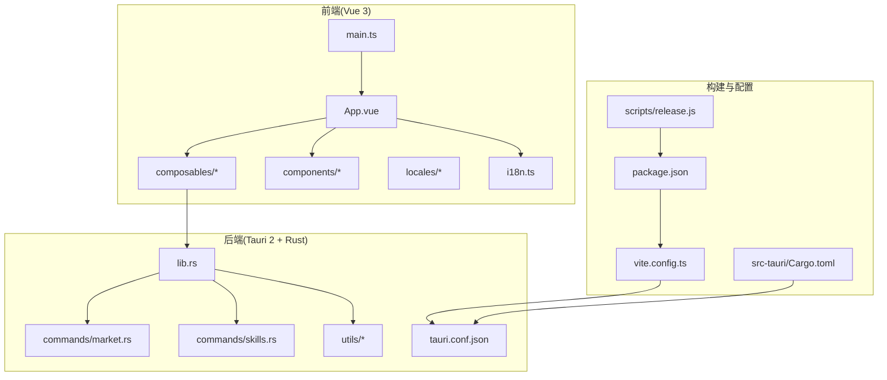
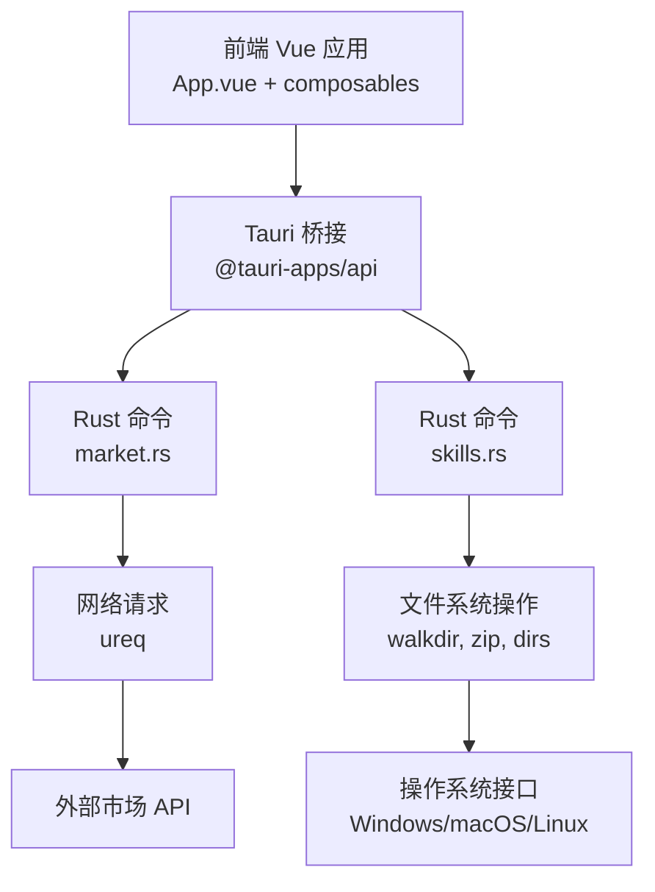
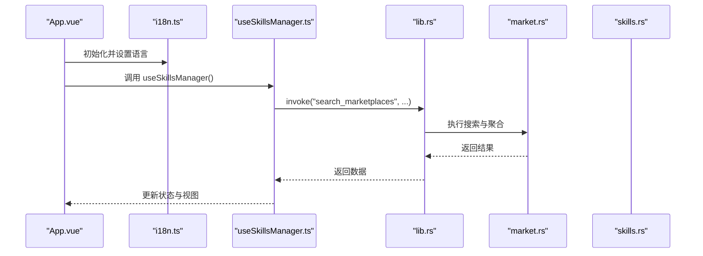
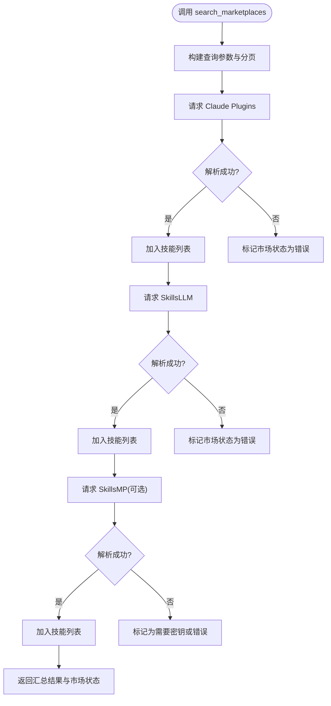
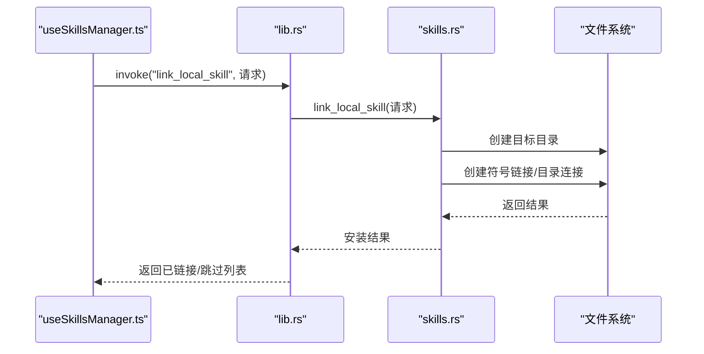
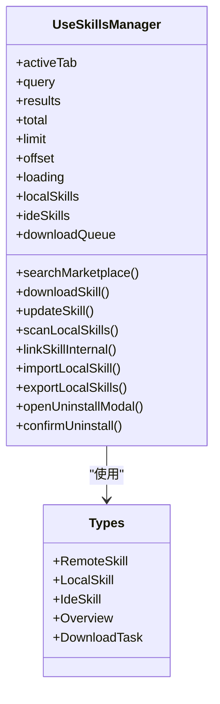
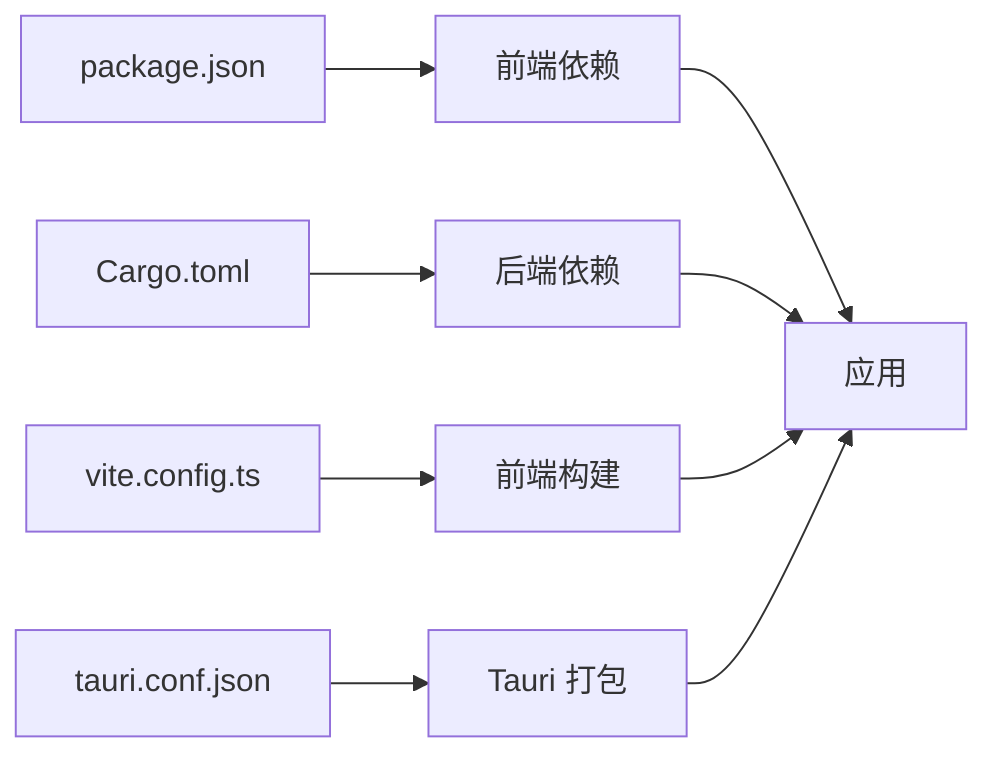

# 开发者指南

<cite>
**本文档引用的文件**
- [README.md](file://README.md)
- [package.json](file://package.json)
- [src-tauri/Cargo.toml](file://src-tauri/Cargo.toml)
- [vite.config.ts](file://vite.config.ts)
- [src/main.ts](file://src/main.ts)
- [src-tauri/tauri.conf.json](file://src-tauri/tauri.conf.json)
- [src-tauri/src/lib.rs](file://src-tauri/src/lib.rs)
- [src-tauri/src/commands/skills.rs](file://src-tauri/src/commands/skills.rs)
- [src-tauri/src/commands/market.rs](file://src-tauri/src/commands/market.rs)
- [src/composables/useSkillsManager.ts](file://src/composables/useSkillsManager.ts)
- [src/composables/types.ts](file://src/composables/types.ts)
- [src/i18n.ts](file://src/i18n.ts)
- [src/App.vue](file://src/App.vue)
- [scripts/release.js](file://scripts/release.js)
</cite>

## 目录
1. [简介](#简介)
2. [项目结构](#项目结构)
3. [核心组件](#核心组件)
4. [架构总览](#架构总览)
5. [详细组件分析](#详细组件分析)
6. [依赖关系分析](#依赖关系分析)
7. [性能考虑](#性能考虑)
8. [故障排除指南](#故障排除指南)
9. [结论](#结论)
10. [附录](#附录)

## 简介
Skills Manager 是一个跨平台的 AI 技能管理器，支持在多个 IDE 中统一管理和安装技能，并提供市场搜索、本地仓库管理、项目级挂载与卸载等功能。项目采用 Tauri 2 + Vue 3 + TypeScript + Vite 的技术栈，Rust 负责系统操作与命令层，前端负责 UI 与交互。

## 项目结构
项目采用前后端分离与原生集成的组织方式：
- 前端：src 目录下包含 Vue 3 应用、国际化资源、组件与组合式函数
- 后端：src-tauri 目录下包含 Rust 命令与工具模块
- 构建与打包：Vite 配置、Tauri 配置、包管理脚本
- 文档与截图：docs/screenshots
- 网站：website 目录用于展示网站内容

**图表来源**
- [src/App.vue:1-200](file://src/App.vue#L1-L200)
- [src/main.ts:1-7](file://src/main.ts#L1-L7)
- [src-tauri/src/lib.rs:1-54](file://src-tauri/src/lib.rs#L1-L54)
- [src-tauri/src/commands/market.rs:1-120](file://src-tauri/src/commands/market.rs#L1-L120)
- [src-tauri/src/commands/skills.rs:1-120](file://src-tauri/src/commands/skills.rs#L1-L120)
- [vite.config.ts:1-33](file://vite.config.ts#L1-L33)
- [src-tauri/tauri.conf.json:1-45](file://src-tauri/tauri.conf.json#L1-L45)
- [package.json:1-30](file://package.json#L1-L30)
- [src-tauri/Cargo.toml:1-36](file://src-tauri/Cargo.toml#L1-L36)
- [scripts/release.js](file://scripts/release.js)

**章节来源**
- [README.md:1-104](file://README.md#L1-L104)
- [package.json:1-30](file://package.json#L1-L30)
- [src-tauri/Cargo.toml:1-36](file://src-tauri/Cargo.toml#L1-L36)
- [vite.config.ts:1-33](file://vite.config.ts#L1-L33)
- [src-tauri/tauri.conf.json:1-45](file://src-tauri/tauri.conf.json#L1-L45)

## 核心组件
- 前端应用入口与国际化
  - 应用入口：创建 Vue 应用并挂载到 #app，引入全局样式与 i18n
  - 国际化：基于 vue-i18n，支持 zh-CN 与 en-US
- 组合式函数 useSkillsManager
  - 负责市场搜索、下载队列、本地扫描、安装/卸载、导入导出等业务逻辑
  - 提供状态管理、错误提示、缓存与排序能力
- 类型定义
  - 定义远程技能、本地技能、IDE 技能、概述、下载任务等类型
- Tauri 插件与命令注册
  - 注册市场与技能相关命令，启用进程、更新器、打开器、对话框插件
- Rust 命令实现
  - 市场命令：聚合多市场搜索、下载与更新
  - 技能命令：本地扫描、链接/卸载、导入/删除、导出、托管迁移

**章节来源**
- [src/main.ts:1-7](file://src/main.ts#L1-L7)
- [src/i18n.ts:1-17](file://src/i18n.ts#L1-L17)
- [src/composables/useSkillsManager.ts:1-120](file://src/composables/useSkillsManager.ts#L1-L120)
- [src/composables/types.ts:1-119](file://src/composables/types.ts#L1-L119)
- [src-tauri/src/lib.rs:1-54](file://src-tauri/src/lib.rs#L1-L54)
- [src-tauri/src/commands/market.rs:1-120](file://src-tauri/src/commands/market.rs#L1-L120)
- [src-tauri/src/commands/skills.rs:1-120](file://src-tauri/src/commands/skills.rs#L1-L120)

## 架构总览
应用采用“前端 UI + Tauri 桥接 + Rust 命令”的分层架构：
- 前端通过 @tauri-apps/api 调用后端命令
- 后端命令执行系统操作（文件系统、网络请求）
- 更新器插件负责版本检查与更新

**图表来源**
- [src/App.vue:73-124](file://src/App.vue#L73-L124)
- [src-tauri/src/lib.rs:27-39](file://src-tauri/src/lib.rs#L27-L39)
- [src-tauri/src/commands/market.rs:173-392](file://src-tauri/src/commands/market.rs#L173-L392)
- [src-tauri/src/commands/skills.rs:355-535](file://src-tauri/src/commands/skills.rs#L355-L535)
- [src-tauri/Cargo.toml:20-31](file://src-tauri/Cargo.toml#L20-L31)

**章节来源**
- [src-tauri/src/lib.rs:20-53](file://src-tauri/src/lib.rs#L20-L53)
- [src-tauri/tauri.conf.json:24-43](file://src-tauri/tauri.conf.json#L24-L43)

## 详细组件分析

### 前端应用与国际化
- 入口初始化：创建应用实例，使用 i18n，挂载根组件
- 国际化：支持 zh-CN 与 en-US，自动根据系统语言选择默认语言
- 主题与语言切换：持久化到 localStorage，响应式切换
- 顶部标签页：本地、市场、IDE、项目、设置五个面板

**图表来源**
- [src/App.vue:50-124](file://src/App.vue#L50-L124)
- [src/i18n.ts:1-17](file://src/i18n.ts#L1-L17)
- [src/composables/useSkillsManager.ts:190-248](file://src/composables/useSkillsManager.ts#L190-L248)
- [src-tauri/src/lib.rs:27-39](file://src-tauri/src/lib.rs#L27-L39)
- [src-tauri/src/commands/market.rs:173-392](file://src-tauri/src/commands/market.rs#L173-L392)

**章节来源**
- [src/main.ts:1-7](file://src/main.ts#L1-L7)
- [src/i18n.ts:1-17](file://src/i18n.ts#L1-L17)
- [src/App.vue:1-200](file://src/App.vue#L1-L200)

### 市场命令与网络请求处理
- 多市场聚合：Claude Plugins、SkillsLLM、SkillsMP
- 异步执行：使用 spawn_blocking 避免阻塞主线程
- 错误处理：记录市场状态（在线/错误/需要密钥），失败时返回错误信息
- 下载与更新：封装下载到指定目录，支持覆盖更新

**图表来源**
- [src-tauri/src/commands/market.rs:173-392](file://src-tauri/src/commands/market.rs#L173-L392)

**章节来源**
- [src-tauri/src/commands/market.rs:1-442](file://src-tauri/src/commands/market.rs#L1-L442)

### 技能命令与文件系统操作
- 本地扫描：遍历本地技能目录与 IDE 目录，识别链接与物理目录
- 安装/链接：创建符号链接或目录连接（Windows 使用 junction），安全校验路径
- 卸载：区分链接与目录，安全删除，限制允许的根目录
- 导入/导出：复制目录到本地仓库，ZIP 打包导出，安全校验导出路径
- 托管迁移：将 IDE 内技能迁移到本地仓库并重新建立链接

**图表来源**
- [src/composables/useSkillsManager.ts:376-398](file://src/composables/useSkillsManager.ts#L376-L398)
- [src-tauri/src/lib.rs:31-32](file://src-tauri/src/lib.rs#L31-L32)
- [src-tauri/src/commands/skills.rs:355-449](file://src-tauri/src/commands/skills.rs#L355-L449)

**章节来源**
- [src-tauri/src/commands/skills.rs:355-800](file://src-tauri/src/commands/skills.rs#L355-L800)

### 状态管理与组合式函数
- useSkillsManager：集中管理市场搜索、下载队列、本地扫描、安装/卸载、导入导出、错误提示与缓存
- 类型系统：明确 RemoteSkill、LocalSkill、IdeSkill、Overview、DownloadTask 等类型
- 国际化：通过 vue-i18n 提供多语言消息与提示

**图表来源**
- [src/composables/useSkillsManager.ts:20-120](file://src/composables/useSkillsManager.ts#L20-L120)
- [src/composables/types.ts:1-119](file://src/composables/types.ts#L1-L119)

**章节来源**
- [src/composables/useSkillsManager.ts:1-867](file://src/composables/useSkillsManager.ts#L1-L867)
- [src/composables/types.ts:1-119](file://src/composables/types.ts#L1-L119)

## 依赖关系分析
- 前端依赖：Vue 3、vue-i18n、@tauri-apps/api 及相关插件
- 后端依赖：Tauri 2、serde、ureq、walkdir、zip、dirs、tauri-plugin-process 等
- 构建工具：Vite、TypeScript、pnpm 脚本

**图表来源**
- [package.json:13-28](file://package.json#L13-L28)
- [src-tauri/Cargo.toml:20-35](file://src-tauri/Cargo.toml#L20-L35)
- [vite.config.ts:1-33](file://vite.config.ts#L1-L33)
- [src-tauri/tauri.conf.json:6-11](file://src-tauri/tauri.conf.json#L6-L11)

**章节来源**
- [package.json:1-30](file://package.json#L1-L30)
- [src-tauri/Cargo.toml:1-36](file://src-tauri/Cargo.toml#L1-L36)
- [vite.config.ts:1-33](file://vite.config.ts#L1-L33)
- [src-tauri/tauri.conf.json:1-45](file://src-tauri/tauri.conf.json#L1-L45)

## 性能考虑
- 市场搜索缓存：前端对搜索结果进行 TTL 缓存，减少重复请求
- 异步执行：市场命令使用异步运行时避免阻塞 UI
- 文件系统操作：使用 walkdir 递归遍历，zip 压缩时按需写入
- 构建优化：Vite 配置固定端口与热重载，忽略 src-tauri 目录监听

**章节来源**
- [src/composables/useSkillsManager.ts:23-27](file://src/composables/useSkillsManager.ts#L23-L27)
- [src-tauri/src/commands/market.rs:181-189](file://src-tauri/src/commands/market.rs#L181-L189)
- [vite.config.ts:14-31](file://vite.config.ts#L14-L31)

## 故障排除指南
- 开发环境启动
  - 确保 Node.js 与 Rust 已安装，macOS 需要 Xcode 命令行工具
  - 使用 pnpm 安装依赖后执行 pnpm tauri dev
- macOS 安全提示
  - 首次打开可能触发“应用已损坏”或“来自不受信任的开发者”，可通过终端命令移除隔离属性
- 构建与发布
  - 使用 pnpm tauri build 进行打包；发布脚本位于 scripts/release.js
- 常见问题
  - 市场访问失败：检查网络与 API 密钥配置；查看市场状态
  - 安装/卸载失败：确认路径合法性与权限；检查是否在允许的根目录内
  - 更新器：检查 tauri.conf.json 中的更新端点与公钥

**章节来源**
- [README.md:67-87](file://README.md#L67-L87)
- [src-tauri/tauri.conf.json:24-31](file://src-tauri/tauri.conf.json#L24-L31)
- [scripts/release.js](file://scripts/release.js)

## 结论
本指南从环境搭建、项目结构、前端开发、后端命令、Tauri 集成与构建发布等方面，全面解析了 Skills Manager 的架构与实现。通过组合式函数与类型系统，前端实现了清晰的状态管理与业务逻辑；通过 Rust 命令，后端提供了安全可靠的文件系统与网络操作。建议开发者遵循本文档的开发规范与调试技巧，以高效完成功能扩展与维护。

## 附录
- 开发规范
  - 前端：使用 Vue 3 Composition API，保持组件职责单一，合理使用组合式函数
  - 后端：命令函数保持纯函数风格，严格输入校验与错误处理
  - 国际化：所有用户可见文本统一通过 i18n 管理
- 测试要求
  - 建议为关键命令编写单元测试与集成测试，覆盖文件系统与网络场景
- 代码审查标准
  - 代码可读性与注释完整
  - 错误处理与边界条件覆盖
  - 跨平台兼容性验证（Windows/macOS/Linux）