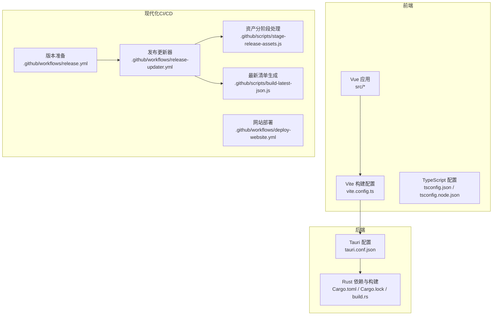
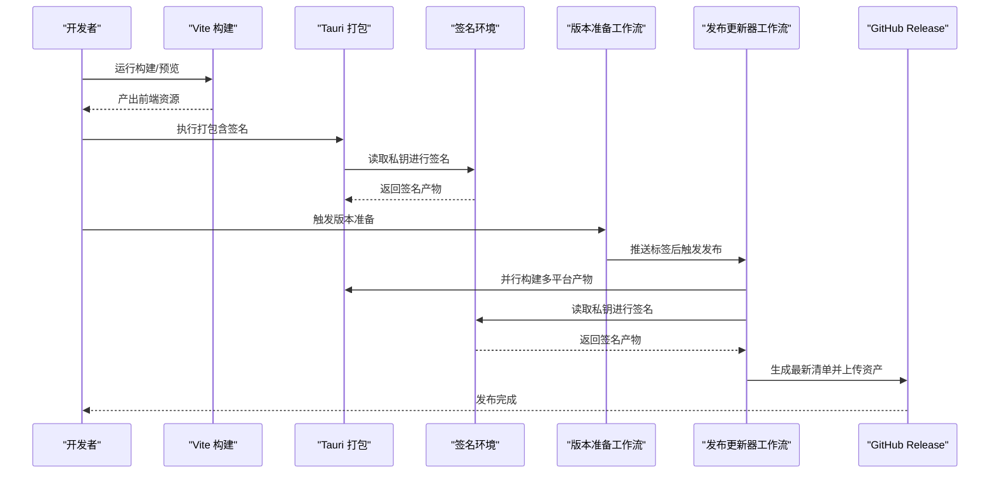
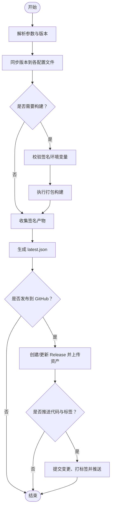
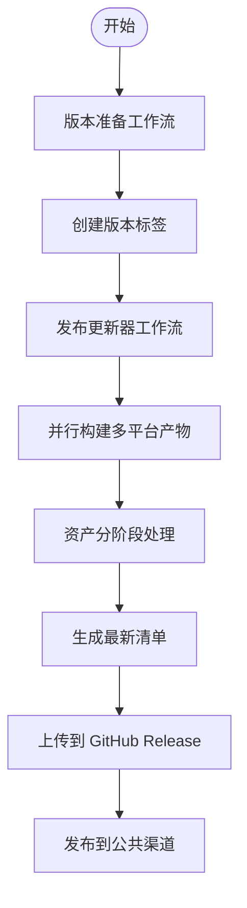
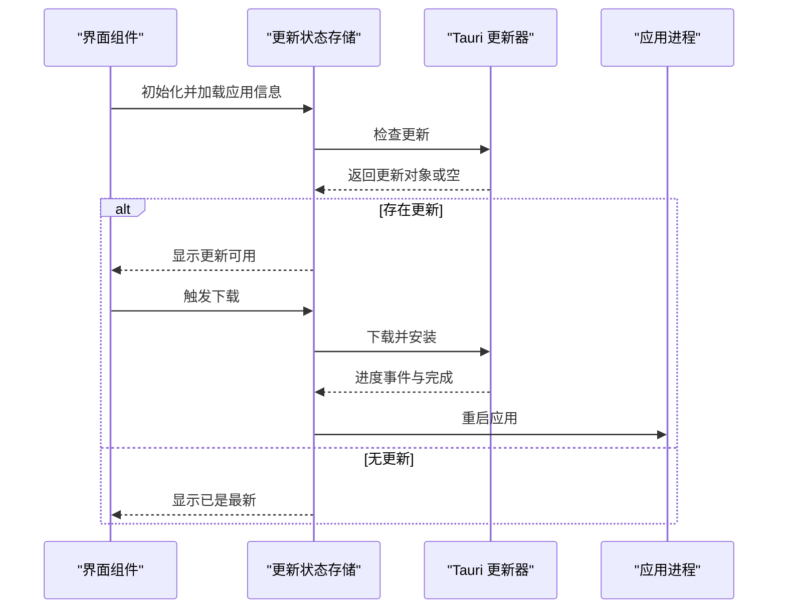
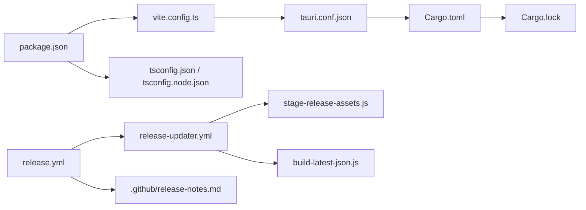

# 构建和发布

<cite>
**本文引用的文件**
- [package.json](file://package.json)
- [vite.config.ts](file://vite.config.ts)
- [tsconfig.json](file://tsconfig.json)
- [tsconfig.node.json](file://tsconfig.node.json)
- [src-tauri/Cargo.toml](file://src-tauri/Cargo.toml)
- [src-tauri/Cargo.lock](file://src-tauri/Cargo.lock)
- [src-tauri/build.rs](file://src-tauri/build.rs)
- [src-tauri/tauri.conf.json](file://src-tauri/tauri.conf.json)
- [scripts/release.js](file://scripts/release.js)
- [.github/workflows/release.yml](file://.github/workflows/release.yml)
- [.github/workflows/release-updater.yml](file://.github/workflows/release-updater.yml)
- [.github/workflows/deploy-website.yml](file://.github/workflows/deploy-website.yml)
- [.github/workflows/release-on-tag.yml.bak](file://.github/workflows/release-on-tag.yml.bak)
- [.github/release-notes.md](file://.github/release-notes.md)
- [.github/scripts/stage-release-assets.js](file://.github/scripts/stage-release-assets.js)
- [.github/scripts/build-latest-json.js](file://.github/scripts/build-latest-json.js)
- [src/composables/useUpdateStore.ts](file://src/composables/useUpdateStore.ts)
- [src/components/UpdateChecker.vue](file://src/components/UpdateChecker.vue)
</cite>

## 更新摘要
**所做更改**
- 更新了 CI/CD 基础设施现代化部分，反映新的 GitHub Actions 工作流程
- 添加了新的发布更新器工作流详细说明
- 更新了 macOS runner 升级相关内容
- 新增了脚本工具和更稳健的发布流程说明
- 更新了版本管理策略以反映分离的工作流设计

## 目录
1. [简介](#简介)
2. [项目结构](#项目结构)
3. [核心组件](#核心组件)
4. [架构总览](#架构总览)
5. [详细组件分析](#详细组件分析)
6. [依赖关系分析](#依赖关系分析)
7. [性能考虑](#性能考虑)
8. [故障排查指南](#故障排查指南)
9. [结论](#结论)
10. [附录](#附录)

## 简介
本指南面向 Skills Manager 的构建与发布流程，覆盖前端 Vite 构建配置、Rust 编译选项、跨平台打包、自动化构建脚本、CI/CD 配置、版本管理策略、发布准备与签名、更新机制实现、发布前检查清单、质量保证流程以及回滚策略。文档以仓库中现有配置与脚本为依据，确保可操作性与可追溯性。

**更新** 本版本反映了 CI/CD 基础设施现代化的重大改进，包括新的发布更新器工作流、升级的 macOS runner 和更稳健的发布流程。

## 项目结构
该项目采用前后端一体化架构（Vue 前端 + Tauri 应用），通过 Vite 进行前端开发与构建，Tauri 在 Rust 层完成打包与系统集成；同时提供自动化发布脚本与 GitHub Actions 工作流，支持版本同步、签名、产物收集与 GitHub Release 发布。

**图表来源**
- [vite.config.ts:1-33](file://vite.config.ts#L1-L33)
- [tsconfig.json:1-26](file://tsconfig.json#L1-L26)
- [tsconfig.node.json:1-11](file://tsconfig.node.json#L1-L11)
- [src-tauri/tauri.conf.json:1-45](file://src-tauri/tauri.conf.json#L1-L45)
- [src-tauri/Cargo.toml:1-36](file://src-tauri/Cargo.toml#L1-L36)
- [.github/workflows/release.yml:1-73](file://.github/workflows/release.yml#L1-L73)
- [.github/workflows/release-updater.yml:1-173](file://.github/workflows/release-updater.yml#L1-L173)
- [.github/scripts/stage-release-assets.js:1-90](file://.github/scripts/stage-release-assets.js#L1-L90)
- [.github/scripts/build-latest-json.js:1-155](file://.github/scripts/build-latest-json.js#L1-L155)

**章节来源**
- [package.json:1-30](file://package.json#L1-L30)
- [vite.config.ts:1-33](file://vite.config.ts#L1-L33)
- [tsconfig.json:1-26](file://tsconfig.json#L1-L26)
- [tsconfig.node.json:1-11](file://tsconfig.node.json#L1-L11)
- [src-tauri/Cargo.toml:1-36](file://src-tauri/Cargo.toml#L1-L36)
- [src-tauri/tauri.conf.json:1-45](file://src-tauri/tauri.conf.json#L1-L45)
- [.github/workflows/release.yml:1-73](file://.github/workflows/release.yml#L1-L73)
- [.github/workflows/release-updater.yml:1-173](file://.github/workflows/release-updater.yml#L1-L173)
- [.github/scripts/stage-release-assets.js:1-90](file://.github/scripts/stage-release-assets.js#L1-L90)
- [.github/scripts/build-latest-json.js:1-155](file://.github/scripts/build-latest-json.js#L1-L155)

## 核心组件
- 前端构建与开发服务器：基于 Vite，固定端口与热重载配置，忽略对 Rust 源码的监听。
- TypeScript 编译配置：Bundler 模式、严格模式、模块解析策略等。
- Rust 应用与打包：多 crate 类型、插件依赖、目标平台打包、签名与更新器配置。
- 自动化发布脚本：版本提升、签名环境校验、产物收集、GitHub Release 发布。
- **现代化 CI/CD 工作流**：分离的版本准备和发布更新器工作流，支持 macOS runner 升级和更稳健的发布流程。
- 更新机制：前端使用 Tauri Updater 插件，后端配置公钥与更新源。

**更新** 新增了现代化 CI/CD 工作流组件，包括分离的版本准备和发布更新器工作流。

**章节来源**
- [vite.config.ts:1-33](file://vite.config.ts#L1-L33)
- [tsconfig.json:1-26](file://tsconfig.json#L1-L26)
- [tsconfig.node.json:1-11](file://tsconfig.node.json#L1-L11)
- [src-tauri/Cargo.toml:1-36](file://src-tauri/Cargo.toml#L1-L36)
- [src-tauri/tauri.conf.json:1-45](file://src-tauri/tauri.conf.json#L1-L45)
- [.github/workflows/release.yml:1-73](file://.github/workflows/release.yml#L1-L73)
- [.github/workflows/release-updater.yml:1-173](file://.github/workflows/release-updater.yml#L1-L173)
- [src/composables/useUpdateStore.ts:1-158](file://src/composables/useUpdateStore.ts#L1-L158)

## 架构总览
下图展示从开发到发布的整体流程，包括前端构建、Rust 打包、签名与更新清单生成、GitHub Release 发布以及客户端自动更新。

**更新** 新增了现代化 CI/CD 流程，包括分离的版本准备和发布更新器工作流。

**图表来源**
- [vite.config.ts:1-33](file://vite.config.ts#L1-L33)
- [src-tauri/tauri.conf.json:1-45](file://src-tauri/tauri.conf.json#L1-L45)
- [.github/workflows/release.yml:1-73](file://.github/workflows/release.yml#L1-L73)
- [.github/workflows/release-updater.yml:1-173](file://.github/workflows/release-updater.yml#L1-L173)

## 详细组件分析

### Vite 构建配置
- 固定开发端口与严格端口策略，避免冲突。
- 开发主机可由环境变量注入，便于远程调试。
- 忽略对 src-tauri 的文件监听，减少不必要的文件系统扫描。
- 清屏关闭，保留 Rust 错误输出不被 Vite 屏蔽。

**章节来源**
- [vite.config.ts:1-33](file://vite.config.ts#L1-L33)

### TypeScript 编译配置
- 使用 Bundler 模式，适配 Vite/ES 模块生态。
- 严格模式开启，强化类型检查与潜在问题发现。
- 明确包含范围与引用关系，确保类型检查一致性。

**章节来源**
- [tsconfig.json:1-26](file://tsconfig.json#L1-L26)
- [tsconfig.node.json:1-11](file://tsconfig.node.json#L1-L11)

### Rust 依赖与构建
- 多 crate 类型：静态库、动态库与 rlib，满足不同平台与场景需求。
- 关键依赖：Tauri 核心、对话框、文件打开、进程控制、HTTP 请求、压缩与路径工具等。
- 平台特定依赖：在非移动端启用更新器与单实例插件。
- 构建入口：通过 build.rs 调用 tauri-build 完成生成物准备。

**章节来源**
- [src-tauri/Cargo.toml:1-36](file://src-tauri/Cargo.toml#L1-L36)
- [src-tauri/build.rs:1-4](file://src-tauri/build.rs#L1-L4)
- [src-tauri/Cargo.lock:4211-4242](file://src-tauri/Cargo.lock#L4211-L4242)

### Tauri 应用配置
- 产品名称、版本、标识符统一管理。
- 开发与构建命令指向前端脚本与输出目录。
- 安全策略：CSP 限制与资源加载白名单。
- 插件：更新器配置包含更新源与公钥，启用更新产物生成。
- 打包：启用所有目标平台与图标集合。

**章节来源**
- [src-tauri/tauri.conf.json:1-45](file://src-tauri/tauri.conf.json#L1-L45)

### 自动化发布脚本
- 版本提升：同步更新 package.json、tauri.conf.json、Cargo.toml 与 Cargo.lock。
- 签名环境：要求设置私钥环境变量，否则拒绝生成签名产物。
- 产物收集：遍历打包目录，按优先级选择各平台更新资产与签名文件。
- 最新清单：生成 latest.json，包含版本、发布说明、发布时间与各平台下载链接与签名。
- 发布：使用 GitHub CLI 创建或更新 Release，并上传资产与发布说明。
- 提交与打标签：可选推送主分支并附带标签。

**图表来源**
- [scripts/release.js:1-300](file://scripts/release.js#L1-L300)

**章节来源**
- [scripts/release.js:1-300](file://scripts/release.js#L1-L300)

### 现代化 CI/CD 工作流

#### 分离的版本准备与发布更新器工作流
**更新** 新增了现代化的 CI/CD 工作流设计，实现了版本准备和发布更新器的分离。

**版本准备工作流（release.yml）**
- 触发方式：手动触发，选择补丁/小改/主版本。
- 步骤：检出代码、安装 pnpm、安装依赖、配置 Git 用户、调用标准版本工具生成版本但不提交/打标签、同步前端版本到 Tauri/Cargo 配置、再次同步 Cargo.lock（若存在）、提交并打标签、推送主分支与标签。

**发布更新器工作流（release-updater.yml）**
- 触发方式：推送标签或手动触发。
- 并行构建：使用矩阵策略并行构建多个平台的产物。
- 平台支持：macOS (aarch64/x86_64)、Linux (x86_64)、Windows (x86_64)。
- macOS runner 升级：使用 `macos-14` 和 `macos-latest` runner 提供更好的兼容性和性能。
- 稳健性增强：包含重试机制、错误处理和资产分阶段处理。

**图表来源**
- [.github/workflows/release.yml:1-73](file://.github/workflows/release.yml#L1-L73)
- [.github/workflows/release-updater.yml:1-173](file://.github/workflows/release-updater.yml#L1-L173)

**章节来源**
- [.github/workflows/release.yml:1-73](file://.github/workflows/release.yml#L1-L73)
- [.github/workflows/release-updater.yml:1-173](file://.github/workflows/release-updater.yml#L1-L173)

### 资产处理脚本

#### 资产分阶段处理脚本（stage-release-assets.js）
**新增** 新增了专门的资产分阶段处理脚本，用于优化发布流程。

- 功能：收集签名资产和安装包，按目标平台前缀组织。
- 支持：自动识别 .sig 文件和各种安装包格式（.dmg、.msi、.exe、.AppImage、.deb、.rpm）。
- 输出：生成标准化的资产文件名，便于后续处理。

#### 最新清单生成脚本（build-latest-json.js）
**新增** 新增了智能的最新清单生成脚本。

- 功能：从资产中提取平台信息，生成最新的更新清单。
- 智能识别：自动推断操作系统、架构和文件类型。
- 优先级排序：根据文件类型确定优先级，确保最佳版本选择。
- 输出：生成包含签名和下载链接的完整 JSON 清单。

**章节来源**
- [.github/scripts/stage-release-assets.js:1-90](file://.github/scripts/stage-release-assets.js#L1-L90)
- [.github/scripts/build-latest-json.js:1-155](file://.github/scripts/build-latest-json.js#L1-L155)

### 更新机制实现
- 前端状态：集中管理检查中、可用更新、下载进度、已下载、错误等状态。
- 启动检查：应用启动时静默检查一次更新，有更新则显示。
- 下载与安装：通过插件下载并安装，完成后重启应用。
- 配置：更新源与公钥在 Tauri 配置中定义，确保签名验证与下载安全。

**图表来源**
- [src/composables/useUpdateStore.ts:1-158](file://src/composables/useUpdateStore.ts#L1-L158)
- [src/components/UpdateChecker.vue:1-57](file://src/components/UpdateChecker.vue#L1-L57)
- [src-tauri/tauri.conf.json:24-31](file://src-tauri/tauri.conf.json#L24-L31)

**章节来源**
- [src/composables/useUpdateStore.ts:1-158](file://src/composables/useUpdateStore.ts#L1-L158)
- [src/components/UpdateChecker.vue:1-57](file://src/components/UpdateChecker.vue#L1-L57)
- [src-tauri/tauri.conf.json:24-31](file://src-tauri/tauri.conf.json#L24-L31)

## 依赖关系分析
- 前端依赖：Vue 生态、Tauri 插件（对话框、打开器、进程、更新器）与 TypeScript 工具链。
- 后端依赖：Tauri 核心、序列化、网络请求、压缩解压、路径与目录工具、进程与更新器插件。
- 构建耦合：前端构建产物作为 Tauri 前端资源；Rust 插件与配置影响打包目标与功能。
- 发布耦合：发布脚本依赖签名环境变量、GitHub CLI 与仓库信息；工作流负责版本同步与标签推送。
- **现代化 CI/CD 依赖**：版本准备和发布更新器工作流相互协作，通过标签触发实现无缝发布。

**更新** 新增了现代化 CI/CD 工作流的依赖关系。

**图表来源**
- [package.json:1-30](file://package.json#L1-L30)
- [vite.config.ts:1-33](file://vite.config.ts#L1-L33)
- [tsconfig.json:1-26](file://tsconfig.json#L1-L26)
- [tsconfig.node.json:1-11](file://tsconfig.node.json#L1-L11)
- [src-tauri/tauri.conf.json:1-45](file://src-tauri/tauri.conf.json#L1-L45)
- [src-tauri/Cargo.toml:1-36](file://src-tauri/Cargo.toml#L1-L36)
- [src-tauri/Cargo.lock:4211-4242](file://src-tauri/Cargo.lock#L4211-L4242)
- [.github/workflows/release.yml:1-73](file://.github/workflows/release.yml#L1-L73)
- [.github/workflows/release-updater.yml:1-173](file://.github/workflows/release-updater.yml#L1-L173)
- [.github/scripts/stage-release-assets.js:1-90](file://.github/scripts/stage-release-assets.js#L1-L90)
- [.github/scripts/build-latest-json.js:1-155](file://.github/scripts/build-latest-json.js#L1-L155)

**章节来源**
- [package.json:1-30](file://package.json#L1-L30)
- [src-tauri/Cargo.toml:1-36](file://src-tauri/Cargo.toml#L1-L36)
- [src-tauri/Cargo.lock:4211-4242](file://src-tauri/Cargo.lock#L4211-L4242)
- [.github/workflows/release.yml:1-73](file://.github/workflows/release.yml#L1-L73)
- [.github/workflows/release-updater.yml:1-173](file://.github/workflows/release-updater.yml#L1-L173)

## 性能考虑
- Vite 开发服务器固定端口与严格端口策略，避免端口竞争导致的反复重启。
- 忽略 src-tauri 监听，降低开发时文件系统扫描开销。
- TypeScript 使用 Bundler 模式与严格模式，有助于早期发现潜在性能与兼容性问题。
- Rust 构建启用多 crate 类型，按需裁剪产物大小与加载时间。
- 更新器仅在必要时下载，进度反馈采用动画模拟，避免频繁重绘。
- **现代化 CI/CD 性能优化**：并行构建多个平台产物，使用缓存策略减少重复安装时间。

**更新** 新增了现代化 CI/CD 的性能优化考虑。

## 故障排查指南
- 缺少签名环境变量：发布脚本会报错，需设置私钥环境变量以生成签名产物。
- GitHub CLI 缺失：发布阶段需要 gh 命令行工具，否则无法上传资产或创建/编辑 Release。
- 未找到更新产物：需先在具备签名环境的机器上执行打包，再运行发布脚本生成最新清单。
- 无法从远程推断仓库：需设置仓库环境变量以便正确生成下载链接。
- 发布说明缺失：需提供发布说明模板文件，否则发布流程会中断。
- 版本不同步：工作流与发布脚本均需确保前端、Tauri 与 Cargo 版本一致。
- **macOS runner 问题**：新工作流使用了 `macos-14` 和 `macos-latest` runner，如遇兼容性问题可检查 Xcode 版本。
- **并行构建失败**：发布更新器工作流的并行构建可能因资源不足而失败，可调整并发策略。

**更新** 新增了现代化 CI/CD 相关的故障排查指导。

**章节来源**
- [scripts/release.js:66-70](file://scripts/release.js#L66-L70)
- [scripts/release.js:234-240](file://scripts/release.js#L234-L240)
- [scripts/release.js:200-203](file://scripts/release.js#L200-L203)
- [scripts/release.js:178-187](file://scripts/release.js#L178-L187)
- [scripts/release.js:242-246](file://scripts/release.js#L242-L246)
- [.github/workflows/release.yml:50-72](file://.github/workflows/release.yml#L50-L72)
- [.github/workflows/release-updater.yml:18-25](file://.github/workflows/release-updater.yml#L18-L25)

## 结论
本项目通过 Vite + Tauri 的组合实现了高效的跨平台桌面应用开发与打包；借助现代化的 CI/CD 工作流，实现了分离的版本准备和发布更新器流程，支持 macOS runner 升级和更稳健的发布过程；通过并行构建多个平台产物、智能资产处理和最新清单生成，显著提升了发布效率和可靠性；前端更新机制结合 Tauri Updater 插件，提供了安全可靠的在线更新能力。建议在生产环境中完善签名证书与发布前的质量门禁，以进一步提升安全性与稳定性。

**更新** 结论反映了 CI/CD 基础设施现代化带来的改进。

## 附录

### 发布前检查清单
- [ ] 确认本地已安装 pnpm、Node.js、Rust 工具链与 Tauri CLI。
- [ ] 确认已设置签名私钥环境变量。
- [ ] 确认已安装并登录 GitHub CLI。
- [ ] 确认已准备发布说明模板文件。
- [ ] 确认前端构建产物可正常生成。
- [ ] 确认 Tauri 打包可生成签名产物。
- [ ] 确认版本号格式正确且符合语义化版本规范。
- [ ] 确认工作流与发布脚本中的仓库信息正确。
- [ ] **现代化 CI/CD 检查**：确认版本准备和发布更新器工作流均可正常运行。

**更新** 新增了现代化 CI/CD 的检查项。

### 版本管理策略
- 使用语义化版本号，遵循补丁、小改、主版本的升级策略。
- **分离工作流设计**：版本准备工作流负责生成版本和标签，发布更新器工作流负责实际发布。
- **标签驱动发布**：通过推送版本标签自动触发发布更新器工作流。
- **智能版本同步**：工作流中通过工具生成版本但不提交/打标签，由发布脚本统一处理。

**更新** 反映了分离工作流的设计理念。

**章节来源**
- [.github/workflows/release.yml:50-72](file://.github/workflows/release.yml#L50-L72)
- [.github/workflows/release-updater.yml:1-173](file://.github/workflows/release-updater.yml#L1-L173)
- [scripts/release.js:43-64](file://scripts/release.js#L43-L64)

### 跨平台打包与签名
- 目标平台：配置为全部平台，具体产物由打包阶段生成。
- 签名：通过私钥环境变量生成签名文件，发布脚本收集签名产物并写入更新清单。
- 公钥：在 Tauri 配置中声明，用于客户端更新时的签名验证。
- **现代化平台支持**：支持 macOS (aarch64/x86_64)、Linux (x86_64)、Windows (x86_64) 平台。
- **macOS runner 升级**：使用 `macos-14` 和 `macos-latest` runner 提供更好的兼容性。

**更新** 新增了现代化平台支持和 macOS runner 升级信息。

**章节来源**
- [src-tauri/tauri.conf.json:32-43](file://src-tauri/tauri.conf.json#L32-L43)
- [.github/workflows/release-updater.yml:18-25](file://.github/workflows/release-updater.yml#L18-L25)
- [scripts/release.js:140-176](file://scripts/release.js#L140-L176)

### 更新机制与回滚策略
- 更新源：配置为 GitHub Releases 的最新清单地址。
- 公钥：用于验证更新包签名，确保来源可信。
- 回滚：当前实现为直接下载安装新版本并重启，如需回滚可在客户端层面保留旧版本或提供降级通道（需额外实现）。

**章节来源**
- [src-tauri/tauri.conf.json:24-31](file://src-tauri/tauri.conf.json#L24-L31)
- [src/composables/useUpdateStore.ts:118-125](file://src/composables/useUpdateStore.ts#L118-L125)

### 发布说明与用户提示
- 包含 macOS 与 Windows 的安装提示与常见安全警告处理方法。
- 适用于首次安装或更新后的用户指引。

**章节来源**
- [.github/release-notes.md:1-30](file://.github/release-notes.md#L1-L30)

### 现代化 CI/CD 工作流详解

#### 版本准备工作流（release.yml）
**新增** 详细的版本准备工作流说明。

- **触发条件**：手动触发，支持选择补丁、小改、主版本三种升级类型。
- **步骤详解**：
  1. 代码检出，设置深度克隆以获取完整历史
  2. 设置 pnpm 10.x 和 Node.js 20.x 环境
  3. 安装依赖并配置 Git 用户信息
  4. 使用 standard-version 工具生成版本但不提交/打标签
  5. 同步前端版本到 Tauri 和 Cargo 配置
  6. 更新 Cargo.lock 中的版本信息
  7. 提交变更、创建标签并推送至主分支

#### 发布更新器工作流（release-updater.yml）
**新增** 详细的发布更新器工作流说明。

- **触发条件**：推送版本标签或手动触发。
- **并行构建策略**：
  - macOS：使用 `macos-14` (x86_64) 和 `macos-latest` (aarch64) runner
  - Linux：使用 `ubuntu-22.04` runner
  - Windows：使用 `windows-latest` runner
- **稳健性特性**：
  - Linux 依赖安装：自动安装 GTK、JavaScriptCore、WebKit 等必需库
  - 重试机制：上传资产时包含 3 次重试，避免临时 API 错误
  - 错误处理：每个步骤都有适当的错误检查和清理
- **资产处理**：
  1. 使用 `stage-release-assets.js` 脚本分阶段处理资产
  2. 生成 `latest.json` 清单文件
  3. 上传所有资产到 GitHub Release

#### 网站部署工作流（deploy-website.yml）
**新增** 网站部署工作流说明。

- **触发条件**：推送至 main 分支或手动触发。
- **路径过滤**：只响应 website 目录的变更。
- **步骤**：设置 Node.js 环境、安装依赖、构建网站、上传到 GitHub Pages。

**章节来源**
- [.github/workflows/release.yml:1-73](file://.github/workflows/release.yml#L1-L73)
- [.github/workflows/release-updater.yml:1-173](file://.github/workflows/release-updater.yml#L1-L173)
- [.github/workflows/deploy-website.yml:1-61](file://.github/workflows/deploy-website.yml#L1-L61)