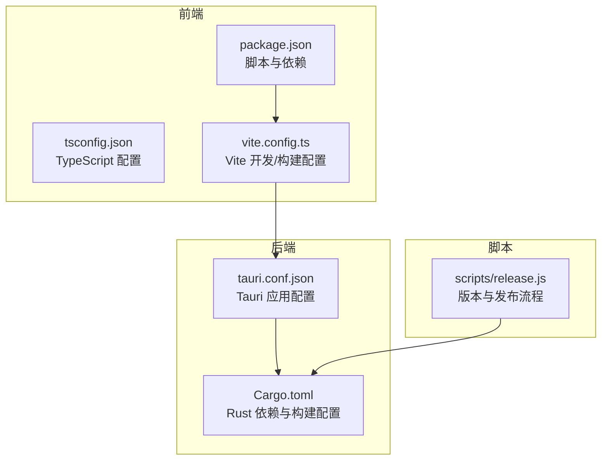
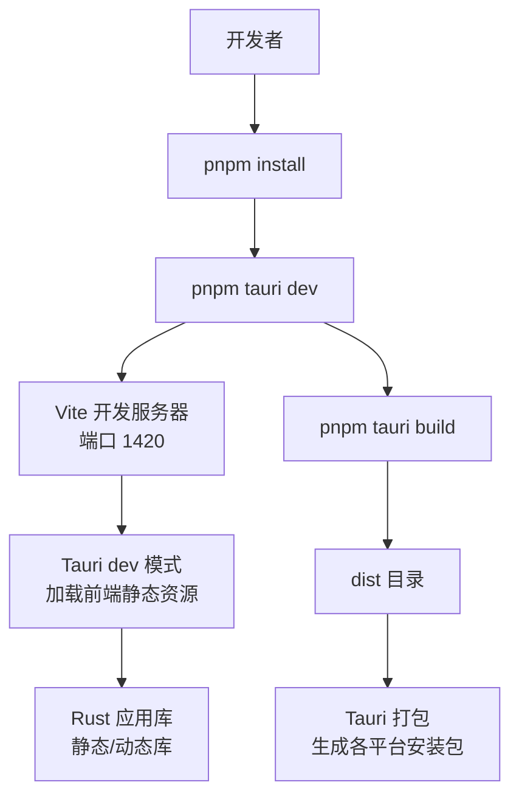
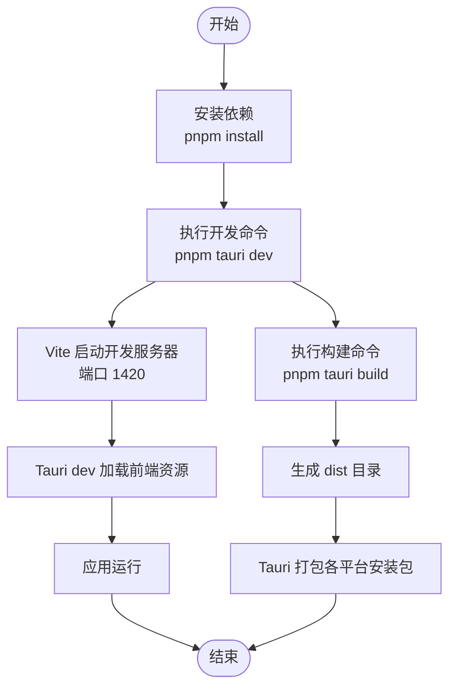
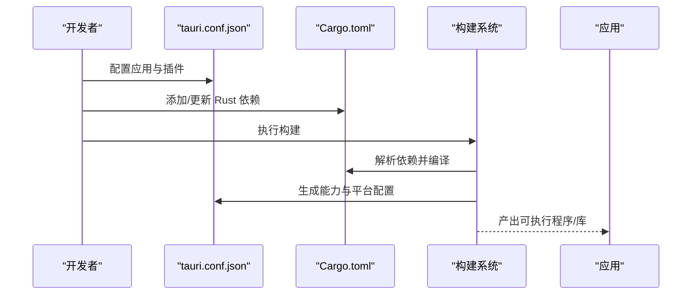
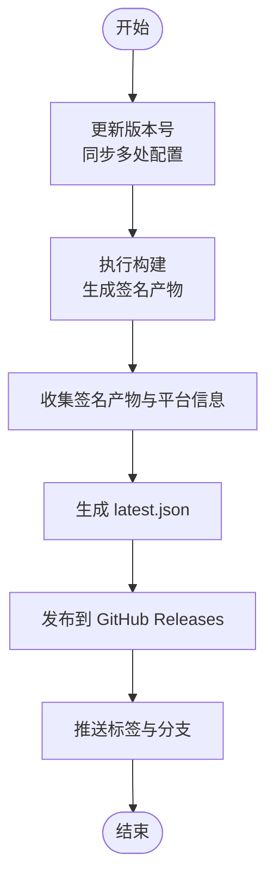
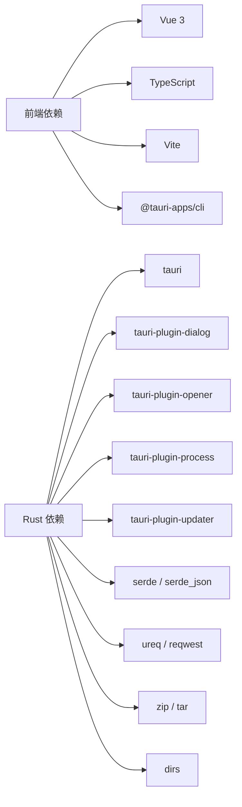

# 环境搭建

<cite>
**本文引用的文件**
- [package.json](file://package.json)
- [README.md](file://README.md)
- [README_zh-CN.md](file://README_zh-CN.md)
- [src-tauri/Cargo.toml](file://src-tauri/Cargo.toml)
- [src-tauri/tauri.conf.json](file://src-tauri/tauri.conf.json)
- [vite.config.ts](file://vite.config.ts)
- [tsconfig.json](file://tsconfig.json)
- [scripts/release.js](file://scripts/release.js)
- [.github/release-notes.md](file://.github/release-notes.md)
</cite>

## 目录
1. [简介](#简介)
2. [项目结构](#项目结构)
3. [核心组件](#核心组件)
4. [架构总览](#架构总览)
5. [详细组件分析](#详细组件分析)
6. [依赖关系分析](#依赖关系分析)
7. [性能考虑](#性能考虑)
8. [故障排除指南](#故障排除指南)
9. [结论](#结论)
10. [附录](#附录)

## 简介
本指南面向开发者，提供 Skills Manager 项目的完整环境搭建与开发流程。项目采用 Tauri 2 + Vue 3 + TypeScript + Vite 的桌面应用技术栈，后端系统操作由 Rust 实现。文档覆盖 Node.js、pnpm、Rust 工具链与 Tauri 依赖的安装步骤，以及 Windows、macOS、Linux 平台的特定要求与配置。同时提供开发环境验证方法、IDE 配置建议与常见问题解决方案，并给出项目克隆、依赖安装、首次运行的完整流程。

## 项目结构
项目采用前后端分离的组织方式：
- 前端：Vue 3 + TypeScript + Vite，位于根目录，通过 Vite 提供开发服务器与构建打包。
- 后端：Rust 语言实现的 Tauri 应用，位于 src-tauri 目录，包含 Cargo.toml、tauri.conf.json 等配置。
- 网站：网站资源位于 website 目录，与主应用解耦。
- 脚本：scripts/release.js 提供版本升级、打包与发布自动化流程。

图表来源
- [package.json:1-30](file://package.json#L1-L30)
- [vite.config.ts:1-33](file://vite.config.ts#L1-L33)
- [tsconfig.json:1-26](file://tsconfig.json#L1-L26)
- [src-tauri/Cargo.toml:1-36](file://src-tauri/Cargo.toml#L1-L36)
- [src-tauri/tauri.conf.json:1-45](file://src-tauri/tauri.conf.json#L1-L45)
- [scripts/release.js:1-300](file://scripts/release.js#L1-L300)

章节来源
- [package.json:1-30](file://package.json#L1-L30)
- [vite.config.ts:1-33](file://vite.config.ts#L1-L33)
- [tsconfig.json:1-26](file://tsconfig.json#L1-L26)
- [src-tauri/Cargo.toml:1-36](file://src-tauri/Cargo.toml#L1-L36)
- [src-tauri/tauri.conf.json:1-45](file://src-tauri/tauri.conf.json#L1-L45)
- [scripts/release.js:1-300](file://scripts/release.js#L1-L300)

## 核心组件
- 前端开发与构建
  - 使用 Vite 提供开发服务器，默认端口与热重载配置见 [vite.config.ts:16-L31]。
  - TypeScript 编译选项与模块解析策略见 [tsconfig.json:2-L22]。
  - 包管理与脚本入口见 [package.json:6-L11]。
- Rust 后端与 Tauri 集成
  - Tauri 应用配置与插件启用见 [src-tauri/tauri.conf.json:1-L45]。
  - Rust 依赖与 crate 类型见 [src-tauri/Cargo.toml:10-L35]。
- 发布与版本管理
  - 自动化发布脚本见 [scripts/release.js:1-L300]，支持版本号更新、打包、生成更新清单与发布资产。

章节来源
- [vite.config.ts:16-31](file://vite.config.ts#L16-L31)
- [tsconfig.json:2-22](file://tsconfig.json#L2-L22)
- [package.json:6-11](file://package.json#L6-L11)
- [src-tauri/tauri.conf.json:1-45](file://src-tauri/tauri.conf.json#L1-L45)
- [src-tauri/Cargo.toml:10-35](file://src-tauri/Cargo.toml#L10-L35)
- [scripts/release.js:1-300](file://scripts/release.js#L1-L300)

## 架构总览
下图展示了前端、Tauri 应用与 Rust 后端之间的交互关系，以及开发与构建流程的关键节点。

图表来源
- [package.json:6-11](file://package.json#L6-L11)
- [vite.config.ts:16-31](file://vite.config.ts#L16-L31)
- [src-tauri/tauri.conf.json:6-11](file://src-tauri/tauri.conf.json#L6-L11)
- [src-tauri/Cargo.toml:10-15](file://src-tauri/Cargo.toml#L10-L15)

章节来源
- [package.json:6-11](file://package.json#L6-L11)
- [vite.config.ts:16-31](file://vite.config.ts#L16-L31)
- [src-tauri/tauri.conf.json:6-11](file://src-tauri/tauri.conf.json#L6-L11)
- [src-tauri/Cargo.toml:10-15](file://src-tauri/Cargo.toml#L10-L15)

## 详细组件分析

### 前端开发与构建配置
- Vite 配置要点
  - 固定开发端口与严格端口策略，确保 Tauri 能稳定连接前端资源。
  - HMR 配置支持远程主机调试。
  - 忽略对 src-tauri 的监听，避免不必要的文件变更触发。
- TypeScript 配置要点
  - ESNext 模块解析与 bundler 模式，严格类型检查与未使用变量/参数检测。
- 包脚本
  - dev：启动 Vite 开发服务器。
  - build：先类型检查再构建。
  - tauri：调用 Tauri CLI。
  - preview：预览构建结果。

图表来源
- [package.json:6-11](file://package.json#L6-L11)
- [vite.config.ts:16-31](file://vite.config.ts#L16-L31)
- [src-tauri/tauri.conf.json:6-11](file://src-tauri/tauri.conf.json#L6-L11)

章节来源
- [vite.config.ts:16-31](file://vite.config.ts#L16-L31)
- [tsconfig.json:2-22](file://tsconfig.json#L2-L22)
- [package.json:6-11](file://package.json#L6-L11)
- [src-tauri/tauri.conf.json:6-11](file://src-tauri/tauri.conf.json#L6-L11)

### Rust 后端与 Tauri 集成
- 应用配置
  - 产品名称、版本、标识符、构建前命令与前端构建输出路径。
  - 安全策略与插件（如更新器）配置。
- 依赖与功能
  - 启用 Tauri 插件：对话框、打开器、进程、更新器（非移动端）。
  - 文件系统与网络相关依赖：HTTP 客户端、压缩、路径处理等。
- 构建与打包
  - 使用 tauri-build 在构建阶段生成能力与平台适配代码。

图表来源
- [src-tauri/tauri.conf.json:1-45](file://src-tauri/tauri.conf.json#L1-L45)
- [src-tauri/Cargo.toml:20-35](file://src-tauri/Cargo.toml#L20-L35)

章节来源
- [src-tauri/tauri.conf.json:1-45](file://src-tauri/tauri.conf.json#L1-L45)
- [src-tauri/Cargo.toml:20-35](file://src-tauri/Cargo.toml#L20-L35)

### 发布与版本管理
- 版本升级与同步
  - 自动更新 package.json、tauri.conf.json、Cargo.toml 与 Cargo.lock 中的版本字段。
- 更新器清单生成
  - 收集签名产物，生成 latest.json，包含各平台下载地址与签名。
- 发布流程
  - 可选择构建、发布到 GitHub Releases、推送标签与分支。

图表来源
- [scripts/release.js:43-64](file://scripts/release.js#L43-L64)
- [scripts/release.js:140-176](file://scripts/release.js#L140-L176)
- [scripts/release.js:199-232](file://scripts/release.js#L199-L232)
- [scripts/release.js:248-268](file://scripts/release.js#L248-L268)
- [scripts/release.js:289-299](file://scripts/release.js#L289-L299)

章节来源
- [scripts/release.js:43-64](file://scripts/release.js#L43-L64)
- [scripts/release.js:140-176](file://scripts/release.js#L140-L176)
- [scripts/release.js:199-232](file://scripts/release.js#L199-L232)
- [scripts/release.js:248-268](file://scripts/release.js#L248-L268)
- [scripts/release.js:289-299](file://scripts/release.js#L289-L299)

## 依赖关系分析
- 前端依赖
  - Vue 3、Vue i18n、Vite、TypeScript、@tauri-apps/cli 等。
- Rust 依赖
  - Tauri 核心、对话框、打开器、进程、更新器、序列化、HTTP 客户端、压缩、路径处理等。
- 关键耦合点
  - Tauri 配置与前端构建输出路径保持一致，确保开发模式下前端资源可被加载。
  - Rust 库类型包含 staticlib、cdylib、rlib，满足不同平台与集成场景需求。

图表来源
- [package.json:13-28](file://package.json#L13-L28)
- [src-tauri/Cargo.toml:20-35](file://src-tauri/Cargo.toml#L20-L35)

章节来源
- [package.json:13-28](file://package.json#L13-L28)
- [src-tauri/Cargo.toml:20-35](file://src-tauri/Cargo.toml#L20-L35)

## 性能考虑
- 开发体验
  - 固定端口与严格端口策略减少端口冲突风险，提升开发稳定性。
  - HMR 与忽略 src-tauri 监听降低不必要的文件扫描开销。
- 构建优化
  - TypeScript 严格模式与未使用项检测有助于早期发现潜在问题。
  - Rust 依赖精简与按需启用插件，避免引入不必要功能导致体积增大。
- 发布效率
  - 自动化脚本一次性更新多处版本号，减少手工维护成本与错误概率。

## 故障排除指南
- macOS 安全提示
  - 首次运行可能出现“应用已损坏”或“来自身份不明的开发者”提示。可通过终端执行放行命令解决。
  - 参考路径：[README.md:43-L49]、[README_zh-CN.md:42-L48]、[.github/release-notes.md:7-L19]。
- Windows 安全提示
  - 安装时可能提示安全警告，点击“更多信息”后选择“仍要运行”。
  - 参考路径：[.github/release-notes.md:21-L29]。
- 开发端口占用
  - 若端口 1420 被占用，Vite 将启动失败。请释放端口或调整配置。
  - 参考路径：[vite.config.ts:16-L18]。
- Tauri 开发命令失败
  - 确认已正确安装 Node.js、pnpm、Rust 工具链与平台依赖。
  - 参考路径：[README.md:69-L74]、[README_zh-CN.md:68-L73]。
- 发布脚本缺失环境变量
  - 发布更新器产物需设置签名私钥环境变量，否则会报错。
  - 参考路径：[scripts/release.js:66-L70]。

章节来源
- [README.md:43-49](file://README.md#L43-L49)
- [README_zh-CN.md:42-48](file://README_zh-CN.md#L42-L48)
- [.github/release-notes.md:7-19](file://.github/release-notes.md#L7-L19)
- [.github/release-notes.md:21-29](file://.github/release-notes.md#L21-L29)
- [vite.config.ts:16-18](file://vite.config.ts#L16-L18)
- [README.md:69-74](file://README.md#L69-L74)
- [README_zh-CN.md:68-73](file://README_zh-CN.md#L68-L73)
- [scripts/release.js:66-70](file://scripts/release.js#L66-L70)

## 结论
通过本指南，您可以完成 Skills Manager 的环境搭建与开发运行。建议优先按照平台特定要求安装 Node.js、pnpm、Rust 工具链与 Tauri 依赖，随后执行项目克隆、依赖安装与首次运行流程。遇到平台安全提示或开发端口问题时，可参考故障排除章节快速定位并解决问题。发布流程可借助 scripts/release.js 自动化完成版本升级与产物发布。

## 附录

### 平台特定要求与配置

- Windows
  - 安装 Node.js（推荐 LTS）、pnpm、Rust（通过 rustup）。
  - 安装 Windows 平台所需的编译工具链（如 Visual Studio Build Tools）。
  - 参考路径：[README.md:69-L74]、[README_zh-CN.md:68-L73]。
- macOS
  - 安装 Node.js（推荐 LTS）、pnpm、Rust（通过 rustup）。
  - 安装 Xcode Command Line Tools。
  - 首次运行可能触发安全提示，按提示执行放行命令。
  - 参考路径：[README.md:69-L74]、[README_zh-CN.md:68-L73]、[.github/release-notes.md:7-L19]。
- Linux
  - 安装 Node.js（推荐 LTS）、pnpm、Rust（通过 rustup）。
  - 安装 GTK、Webkit2GTK、libwebkit2gtk 等系统依赖（具体依赖随发行版而异）。
  - 参考路径：[README.md:69-L74]、[README_zh-CN.md:68-L73]。

章节来源
- [README.md:69-74](file://README.md#L69-L74)
- [README_zh-CN.md:68-73](file://README_zh-CN.md#L68-L73)
- [.github/release-notes.md:7-19](file://.github/release-notes.md#L7-L19)

### 开发环境验证方法
- 前端验证
  - 执行 pnpm install 与 pnpm tauri dev，确认 Vite 开发服务器在端口 1420 正常运行。
  - 访问 http://localhost:1420，检查页面是否正常加载。
  - 参考路径：[package.json:6-L11]、[vite.config.ts:16-L18]。
- Rust 验证
  - 确认 Rust 工具链已安装且可正常使用（cargo、rustc）。
  - 参考路径：[README.md:71-L72]、[README_zh-CN.md:70-L71]。
- Tauri 验证
  - 确认 @tauri-apps/cli 已安装，执行 pnpm tauri dev 能进入应用界面。
  - 参考路径：[package.json:22-L27]、[package.json:10-L10]。

章节来源
- [package.json:6-11](file://package.json#L6-L11)
- [vite.config.ts:16-18](file://vite.config.ts#L16-L18)
- [README.md:71-72](file://README.md#L71-L72)
- [README_zh-CN.md:70-71](file://README_zh-CN.md#L70-L71)
- [package.json:22-27](file://package.json#L22-L27)

### IDE 配置建议
- VS Code
  - 安装 Vue、TypeScript、Vite、Tauri 相关扩展。
  - 设置默认终端为 PowerShell（Windows）或 Bash（macOS/Linux）。
  - 在工作区设置中启用 TypeScript 严格模式与未使用项检测。
- WebStorm/IntelliJ IDEA
  - 启用 Vue 3 与 TypeScript 支持。
  - 配置 Vite 开发服务器端口为 1420，避免与默认端口冲突。
- Rust 工具链
  - 安装 rust-analyzer 与 Toml 扩展，启用 Clippy 与 RLS（可选）。

### 项目克隆、依赖安装、首次运行完整流程
- 克隆仓库
  - 使用 Git 克隆项目到本地。
- 安装依赖
  - 在项目根目录执行 pnpm install。
- 首次运行
  - 执行 pnpm tauri dev 启动开发模式。
  - 在浏览器访问 http://localhost:1420 查看应用界面。
- 构建与打包
  - 执行 pnpm tauri build 生成各平台安装包。
- 参考路径
  - [README.md:75-L86]、[README_zh-CN.md:74-L85]、[package.json:6-L11]、[src-tauri/tauri.conf.json:6-L11]。

章节来源
- [README.md:75-86](file://README.md#L75-L86)
- [README_zh-CN.md:74-85](file://README_zh-CN.md#L74-L85)
- [package.json:6-11](file://package.json#L6-L11)
- [src-tauri/tauri.conf.json:6-11](file://src-tauri/tauri.conf.json#L6-L11)