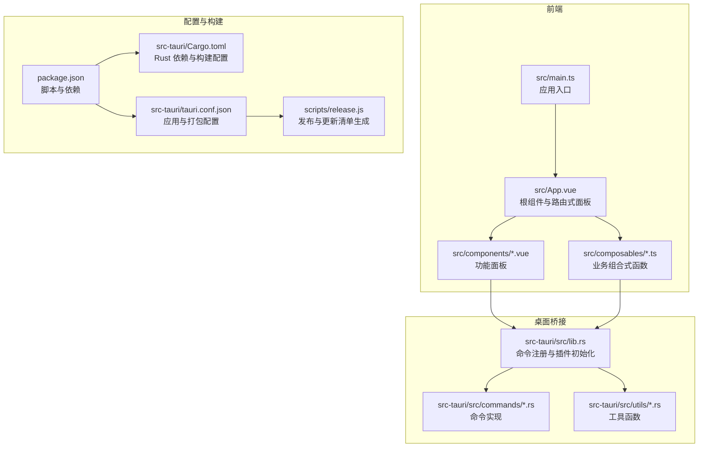
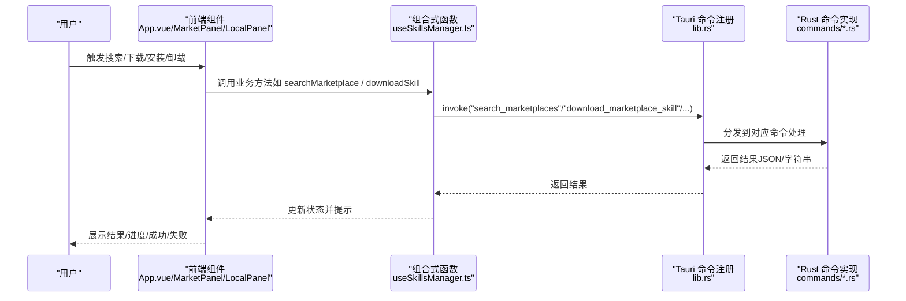
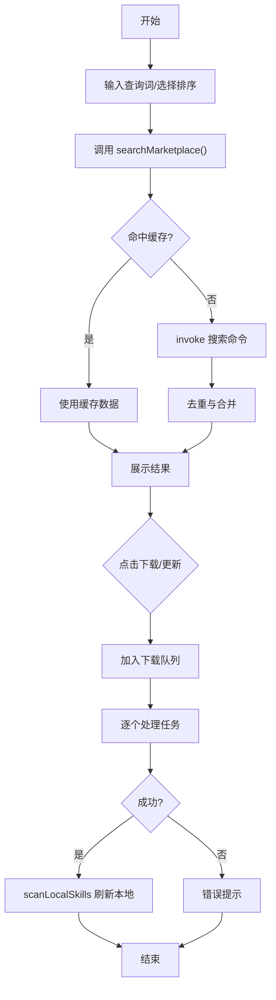
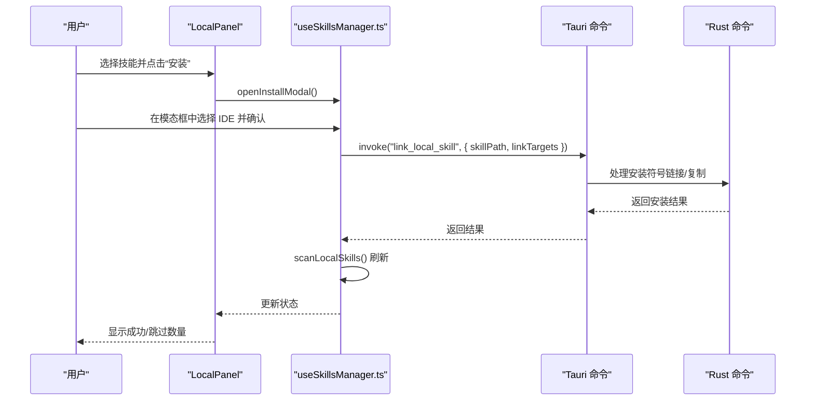
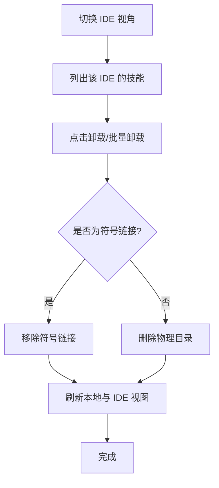
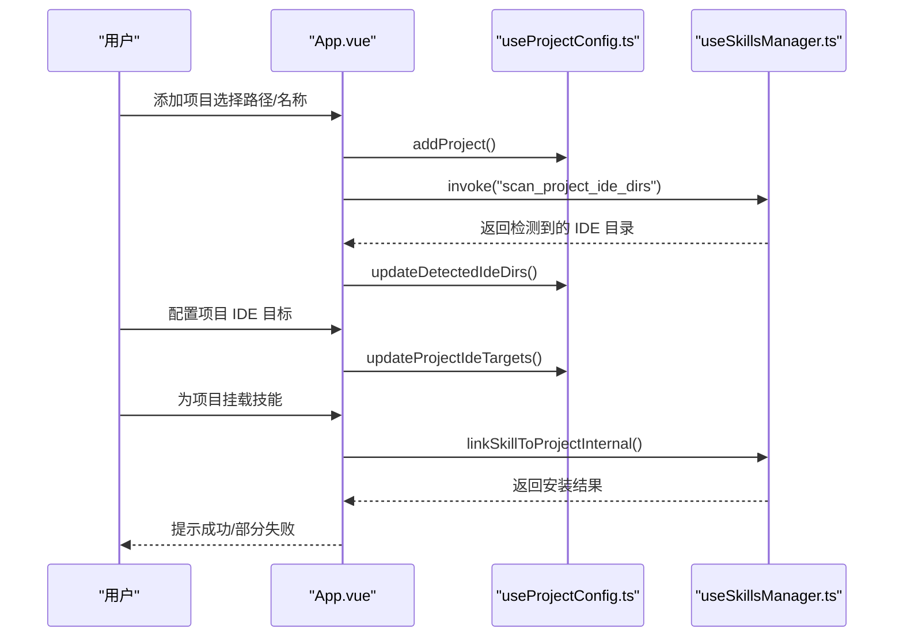
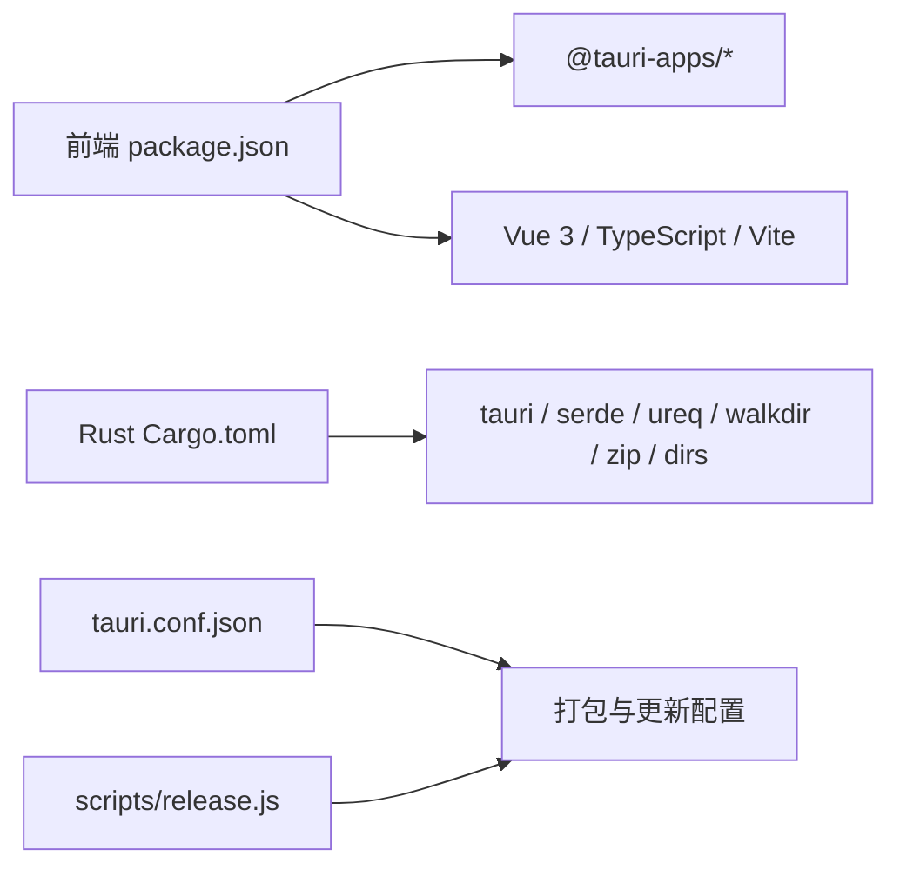

# 快速开始

<cite>
**本文引用的文件**
- [README.md](file://README.md)
- [README_zh-CN.md](file://README_zh-CN.md)
- [package.json](file://package.json)
- [src-tauri/Cargo.toml](file://src-tauri/Cargo.toml)
- [src-tauri/tauri.conf.json](file://src-tauri/tauri.conf.json)
- [src/main.ts](file://src/main.ts)
- [src/App.vue](file://src/App.vue)
- [src/composables/useSkillsManager.ts](file://src/composables/useSkillsManager.ts)
- [src/composables/useIdeConfig.ts](file://src/composables/useIdeConfig.ts)
- [src/composables/useProjectConfig.ts](file://src/composables/useProjectConfig.ts)
- [src/components/MarketPanel.vue](file://src/components/MarketPanel.vue)
- [src/components/LocalPanel.vue](file://src/components/LocalPanel.vue)
- [scripts/release.js](file://scripts/release.js)
</cite>

## 目录
1. [简介](#简介)
2. [项目结构](#项目结构)
3. [核心组件](#核心组件)
4. [架构总览](#架构总览)
5. [详细组件分析](#详细组件分析)
6. [依赖关系分析](#依赖关系分析)
7. [性能考虑](#性能考虑)
8. [故障排查指南](#故障排查指南)
9. [结论](#结论)
10. [附录](#附录)

## 简介
Skills Manager 是一款跨平台的 AI Skills 管理器，支持从多个市场聚合搜索技能，统一下载到本地仓库，并通过符号链接（symlink）一键安装到任意受支持的 IDE 中。它同时提供本地技能管理、IDE 纬度浏览、项目维度挂载与配置能力，帮助你高效组织与复用 AI 助手技能。

- 支持平台：Windows、macOS、Linux
- 技术栈：前端 Vue 3 + TypeScript + Vite，桌面框架 Tauri 2，系统操作层 Rust
- 本地仓库路径：统一位于用户主目录下的 ~/.skills-manager/skills

**章节来源**
- [README.md: 1-104:1-104](file://README.md#L1-L104)
- [README_zh-CN.md: 1-103:1-103](file://README_zh-CN.md#L1-L103)

## 项目结构
本项目采用“前端 + 桌面桥接（Tauri）+ Rust 命令层”的分层设计：
- 前端层：src 下的 Vue 组件与组合式函数，负责 UI、状态与调用后端命令
- 桌面桥接层：src-tauri 下的 Rust 代码，暴露命令给前端调用
- 构建与打包：Vite + Tauri CLI，支持多平台构建与自动更新

**图表来源**
- [src/main.ts: 1-7:1-7](file://src/main.ts#L1-L7)
- [src/App.vue: 1-633:1-633](file://src/App.vue#L1-L633)
- [src-tauri/src/lib.rs: 1-54:1-54](file://src-tauri/src/lib.rs#L1-L54)
- [package.json: 1-30:1-30](file://package.json#L1-L30)
- [src-tauri/Cargo.toml: 1-36:1-36](file://src-tauri/Cargo.toml#L1-L36)
- [src-tauri/tauri.conf.json: 1-45:1-45](file://src-tauri/tauri.conf.json#L1-L45)
- [scripts/release.js: 1-300:1-300](file://scripts/release.js#L1-L300)

**章节来源**
- [package.json: 1-30:1-30](file://package.json#L1-L30)
- [src-tauri/Cargo.toml: 1-36:1-36](file://src-tauri/Cargo.toml#L1-L36)
- [src-tauri/tauri.conf.json: 1-45:1-45](file://src-tauri/tauri.conf.json#L1-L45)

## 核心组件
- 市场面板（MarketPanel）：聚合搜索、排序、下载/更新队列、市场配置
- 本地面板（LocalPanel）：本地技能列表、导入/导出/删除、批量安装
- IDE 浏览（IdePanel）：按 IDE 查看已挂载技能、安全卸载、自定义 IDE
- 项目面板（ProjectsPanel）：项目管理、IDE 目标配置、批量挂载
- 根组件（App.vue）：标签页导航、全局状态与事件分发
- 组合式函数（useSkillsManager.ts）：搜索、下载、安装、卸载、导入导出、扫描等核心逻辑
- IDE 配置（useIdeConfig.ts）：IDE 列表、自定义 IDE、上次安装目标记忆
- 项目配置（useProjectConfig.ts）：项目增删改查、IDE 目标映射

**章节来源**
- [src/components/MarketPanel.vue: 1-192:1-192](file://src/components/MarketPanel.vue#L1-L192)
- [src/components/LocalPanel.vue: 1-310:1-310](file://src/components/LocalPanel.vue#L1-L310)
- [src/App.vue: 1-633:1-633](file://src/App.vue#L1-L633)
- [src/composables/useSkillsManager.ts: 1-867:1-867](file://src/composables/useSkillsManager.ts#L1-L867)
- [src/composables/useIdeConfig.ts: 1-131:1-131](file://src/composables/useIdeConfig.ts#L1-L131)
- [src/composables/useProjectConfig.ts: 1-128:1-128](file://src/composables/useProjectConfig.ts#L1-L128)

## 架构总览
前端通过 Tauri 暴露的 invoke 接口调用 Rust 命令，完成市场搜索、下载更新、本地扫描、安装卸载、导入导出等操作。应用启动时加载语言与主题，检查更新并在启动时提示。

**图表来源**
- [src/App.vue: 73-124:73-124](file://src/App.vue#L73-L124)
- [src/composables/useSkillsManager.ts: 190-352:190-352](file://src/composables/useSkillsManager.ts#L190-L352)
- [src-tauri/src/lib.rs: 27-39:27-39](file://src-tauri/src/lib.rs#L27-L39)

**章节来源**
- [src/App.vue: 73-124:73-124](file://src/App.vue#L73-L124)
- [src/composables/useSkillsManager.ts: 190-352:190-352](file://src/composables/useSkillsManager.ts#L190-L352)
- [src-tauri/src/lib.rs: 27-39:27-39](file://src-tauri/src/lib.rs#L27-L39)

## 详细组件分析

### 市场搜索与下载流程
- 用户在市场面板输入关键词、选择排序方式并发起搜索
- 前端调用搜索方法，合并缓存与去重，展示结果
- 点击“下载/更新”加入下载队列，后台逐个执行下载或更新
- 成功后刷新本地技能列表，提示用户

**图表来源**
- [src/components/MarketPanel.vue: 30-39:30-39](file://src/components/MarketPanel.vue#L30-L39)
- [src/composables/useSkillsManager.ts: 190-248:190-248](file://src/composables/useSkillsManager.ts#L190-L248)
- [src/composables/useSkillsManager.ts: 263-329:263-329](file://src/composables/useSkillsManager.ts#L263-L329)
- [src/composables/useSkillsManager.ts: 353-374:353-374](file://src/composables/useSkillsManager.ts#L353-L374)

**章节来源**
- [src/components/MarketPanel.vue: 30-39:30-39](file://src/components/MarketPanel.vue#L30-L39)
- [src/composables/useSkillsManager.ts: 190-248:190-248](file://src/composables/useSkillsManager.ts#L190-L248)
- [src/composables/useSkillsManager.ts: 263-329:263-329](file://src/composables/useSkillsManager.ts#L263-L329)
- [src/composables/useSkillsManager.ts: 353-374:353-374](file://src/composables/useSkillsManager.ts#L353-L374)

### 本地技能管理与安装流程
- 本地面板展示已下载技能，支持导入、导出、删除、批量安装
- 选择技能后打开安装模态框，选择目标 IDE，确认后逐个执行安装
- 安装完成后刷新本地与 IDE 视图

**图表来源**
- [src/components/LocalPanel.vue: 18-28:18-28](file://src/components/LocalPanel.vue#L18-L28)
- [src/composables/useSkillsManager.ts: 400-499:400-499](file://src/composables/useSkillsManager.ts#L400-L499)
- [src/composables/useSkillsManager.ts: 376-398:376-398](file://src/composables/useSkillsManager.ts#L376-L398)

**章节来源**
- [src/components/LocalPanel.vue: 18-28:18-28](file://src/components/LocalPanel.vue#L18-L28)
- [src/composables/useSkillsManager.ts: 400-499:400-499](file://src/composables/useSkillsManager.ts#L400-L499)
- [src/composables/useSkillsManager.ts: 376-398:376-398](file://src/composables/useSkillsManager.ts#L376-L398)

### IDE 纬度浏览与安全卸载
- 切换 IDE 视角，查看该 IDE 下已挂载的技能
- 支持安全卸载：若为符号链接则移除链接，否则删除物理目录
- 可添加自定义 IDE，指定其技能目录相对路径或绝对路径

**图表来源**
- [src/App.vue: 324-343:324-343](file://src/App.vue#L324-L343)
- [src/composables/useSkillsManager.ts: 568-624:568-624](file://src/composables/useSkillsManager.ts#L568-L624)
- [src/composables/useIdeConfig.ts: 76-104:76-104](file://src/composables/useIdeConfig.ts#L76-L104)

**章节来源**
- [src/App.vue: 324-343:324-343](file://src/App.vue#L324-L343)
- [src/composables/useSkillsManager.ts: 568-624:568-624](file://src/composables/useSkillsManager.ts#L568-L624)
- [src/composables/useIdeConfig.ts: 76-104:76-104](file://src/composables/useIdeConfig.ts#L76-L104)

### 项目管理与批量挂载
- 添加项目并扫描检测到的 IDE 目录
- 配置项目使用的 IDE 目标，批量将本地技能挂载到项目 IDE 目录
- 支持按项目维度隔离与管理技能

**图表来源**
- [src/App.vue: 148-186:148-186](file://src/App.vue#L148-L186)
- [src/composables/useProjectConfig.ts: 47-98:47-98](file://src/composables/useProjectConfig.ts#L47-L98)
- [src/composables/useSkillsManager.ts: 501-523:501-523](file://src/composables/useSkillsManager.ts#L501-L523)

**章节来源**
- [src/App.vue: 148-186:148-186](file://src/App.vue#L148-L186)
- [src/composables/useProjectConfig.ts: 47-98:47-98](file://src/composables/useProjectConfig.ts#L47-L98)
- [src/composables/useSkillsManager.ts: 501-523:501-523](file://src/composables/useSkillsManager.ts#L501-L523)

## 依赖关系分析
- 前端依赖：Vue 3、TypeScript、Vite、@tauri-apps/* 插件（dialog、opener、process、updater）
- Rust 依赖：tauri、serde、ureq、walkdir、zip、dirs、tauri-plugin-* 等
- 构建与打包：Tauri CLI、Vite、CSP 策略、更新器公钥、多平台打包图标

**图表来源**
- [package.json: 13-28:13-28](file://package.json#L13-L28)
- [src-tauri/Cargo.toml: 20-35:20-35](file://src-tauri/Cargo.toml#L20-L35)
- [src-tauri/tauri.conf.json: 24-43:24-43](file://src-tauri/tauri.conf.json#L24-L43)
- [scripts/release.js: 200-232:200-232](file://scripts/release.js#L200-L232)

**章节来源**
- [package.json: 13-28:13-28](file://package.json#L13-L28)
- [src-tauri/Cargo.toml: 20-35:20-35](file://src-tauri/Cargo.toml#L20-L35)
- [src-tauri/tauri.conf.json: 24-43:24-43](file://src-tauri/tauri.conf.json#L24-L43)
- [scripts/release.js: 200-232:200-232](file://scripts/release.js#L200-L232)

## 性能考虑
- 搜索缓存：前端对最近查询结果进行时间窗缓存，减少重复请求
- 去重策略：按来源 URL 或市场 ID+名称去重，避免重复展示
- 下载队列：串行处理下载/更新任务，避免并发冲突与磁盘争用
- 批量操作：本地面板支持批量安装/卸载/导出/删除，降低交互成本
- CSP 与资源加载：严格的内容安全策略与本地资源加载，提升安全性

**章节来源**
- [src/composables/useSkillsManager.ts: 23-27:23-27](file://src/composables/useSkillsManager.ts#L23-L27)
- [src/composables/useSkillsManager.ts: 250-261:250-261](file://src/composables/useSkillsManager.ts#L250-L261)
- [src/composables/useSkillsManager.ts: 278-329:278-329](file://src/composables/useSkillsManager.ts#L278-L329)
- [src-tauri/tauri.conf.json: 20-22:20-22](file://src-tauri/tauri.conf.json#L20-L22)

## 故障排查指南
- macOS 安全拦截
  - 现象：首次打开提示“应用已损坏/来自不受信任的开发者”
  - 解决：执行终端命令移除隔离属性
  - 参考：README 中的 macOS 安全注意事项与命令
- 下载失败
  - 检查网络与市场源可用性，查看错误提示
  - 清理下载队列中的失败任务并重试
- 安装/卸载失败
  - 确认目标 IDE 目录可写，权限正常
  - 若为符号链接，确认链接有效；否则执行物理删除
- 本地扫描为空
  - 确认本地仓库路径存在且可访问
  - 尝试手动刷新扫描

**章节来源**
- [README.md: 43-49:43-49](file://README.md#L43-L49)
- [src/composables/useSkillsManager.ts: 322-326:322-326](file://src/composables/useSkillsManager.ts#L322-L326)
- [src/composables/useSkillsManager.ts: 568-624:568-624](file://src/composables/useSkillsManager.ts#L568-L624)
- [src/composables/useSkillsManager.ts: 353-374:353-374](file://src/composables/useSkillsManager.ts#L353-L374)

## 结论
通过本快速开始指南，你可以：
- 明确环境要求与安装方式（通用用户与开发者）
- 了解从 Releases 页面下载与从源码开发两条路径
- 掌握市场搜索、本地管理、IDE 集成与项目管理的基本流程
- 在 macOS 上正确处理安全拦截问题
- 在遇到常见问题时快速定位与解决

## 附录

### 环境要求与安装步骤
- 环境要求
  - Node.js（建议 LTS）
  - Rust（通过 rustup 安装）
  - macOS：Xcode Command Line Tools
- 通用用户安装
  - 访问 Releases 页面下载最新安装包，按系统指引安装
- 开发者安装
  - 安装依赖后运行开发服务器或构建发布包

**章节来源**
- [README.md: 69-86:69-86](file://README.md#L69-L86)
- [README_zh-CN.md: 68-85:68-85](file://README_zh-CN.md#L68-L85)

### 基本使用流程
- 市场搜索
  - 在市场面板输入关键词，选择排序方式，点击搜索
  - 点击“下载/更新”加入队列，等待完成并刷新本地
- 本地技能管理
  - 在本地面板导入/导出/删除技能，批量安装到 IDE
- IDE 集成
  - 在 IDE 面板切换 IDE 视角，查看已挂载技能，安全卸载
  - 如需支持新 IDE，添加自定义 IDE 目录
- 项目管理
  - 添加项目并扫描 IDE 目录，配置 IDE 目标
  - 为项目批量挂载本地技能

**章节来源**
- [src/components/MarketPanel.vue: 53-83:53-83](file://src/components/MarketPanel.vue#L53-L83)
- [src/components/LocalPanel.vue: 103-167:103-167](file://src/components/LocalPanel.vue#L103-L167)
- [src/App.vue: 324-343:324-343](file://src/App.vue#L324-L343)
- [src/App.vue: 148-186:148-186](file://src/App.vue#L148-L186)