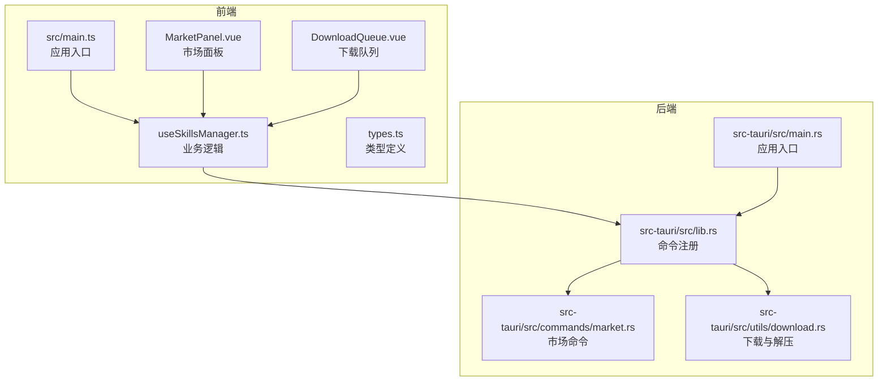
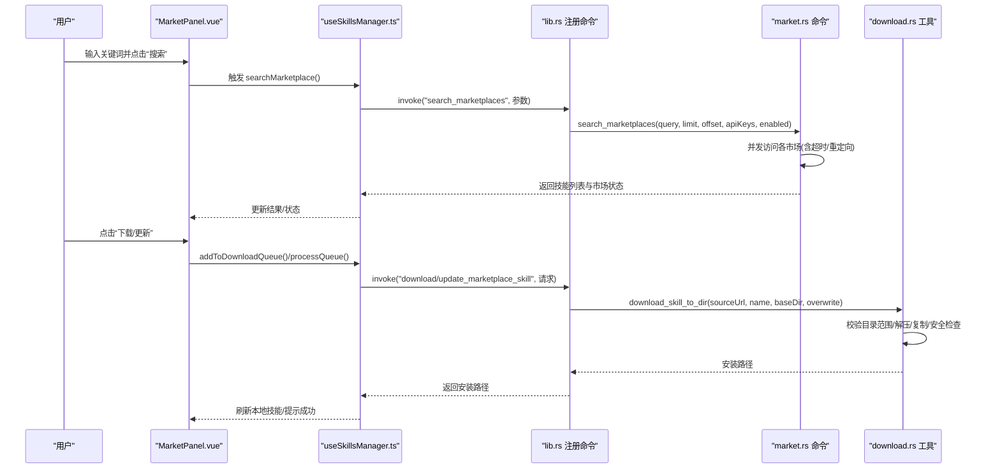
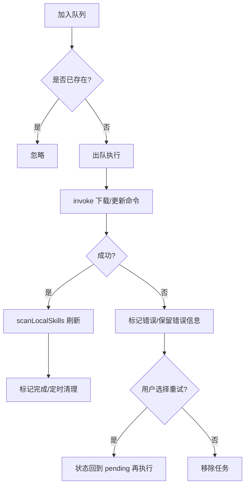
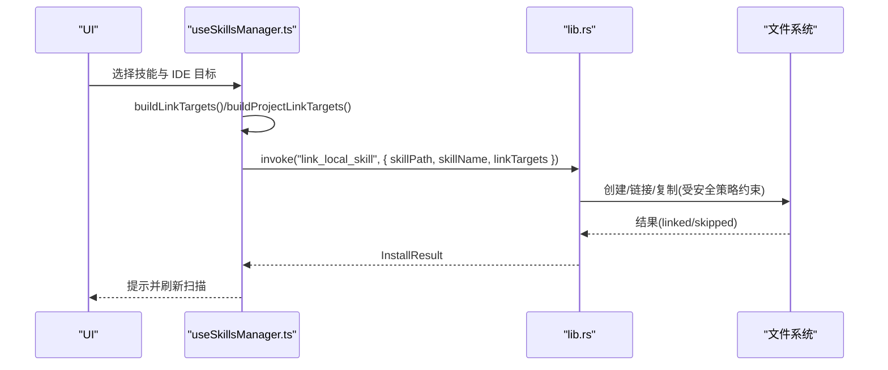
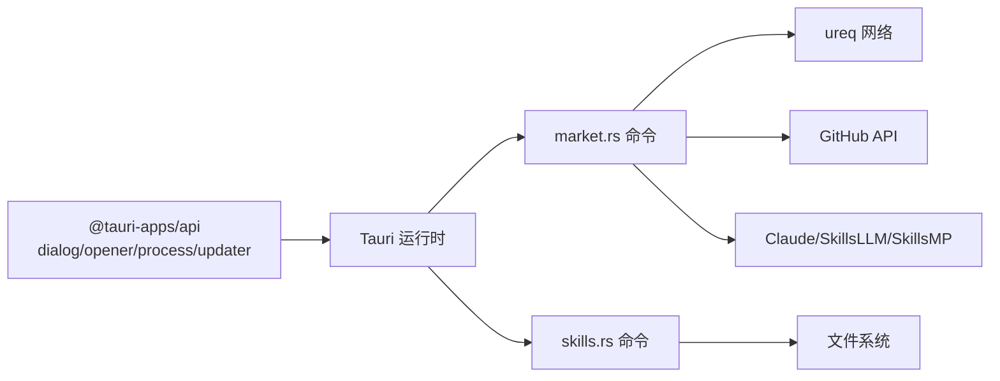

# 使用问题

<cite>
**本文引用的文件**
- [README.md](file://README.md)
- [src/main.ts](file://src/main.ts)
- [src-tauri/src/main.rs](file://src-tauri/src/main.rs)
- [package.json](file://package.json)
- [src-tauri/Cargo.toml](file://src-tauri/Cargo.toml)
- [src/composables/useSkillsManager.ts](file://src/composables/useSkillsManager.ts)
- [src/composables/useMarketConfig.ts](file://src/composables/useMarketConfig.ts)
- [src/composables/useIdeConfig.ts](file://src/composables/useIdeConfig.ts)
- [src/composables/utils.ts](file://src/composables/utils.ts)
- [src/composables/types.ts](file://src/composables/types.ts)
- [src-tauri/src/lib.rs](file://src-tauri/src/lib.rs)
- [src-tauri/src/commands/market.rs](file://src-tauri/src/commands/market.rs)
- [src-tauri/src/utils/download.rs](file://src-tauri/src/utils/download.rs)
- [src/components/MarketPanel.vue](file://src/components/MarketPanel.vue)
- [src/components/DownloadQueue.vue](file://src/components/DownloadQueue.vue)
</cite>

## 目录
1. [简介](#简介)
2. [项目结构](#项目结构)
3. [核心组件](#核心组件)
4. [架构总览](#架构总览)
5. [详细组件分析](#详细组件分析)
6. [依赖分析](#依赖分析)
7. [性能考虑](#性能考虑)
8. [故障排除指南](#故障排除指南)
9. [结论](#结论)
10. [附录](#附录)

## 简介
本指南面向 Skills Manager 的使用者，聚焦于在实际使用中常见的问题：技能搜索失败、下载中断、安装到 IDE 失败、项目配置错误等。文档提供错误信息解读、可验证的操作步骤、问题复现方法，并覆盖市场连接问题、本地文件系统操作失败、IDE 集成异常等场景的诊断流程与解决步骤。

## 项目结构
应用采用前端（Vue 3 + TypeScript）与桌面运行时（Tauri 2）结合的双层架构：
- 前端负责用户界面、状态管理与调用后端命令
- 后端（Rust）负责网络请求、文件系统操作与安全校验



图表来源
- [src/main.ts:1-7](file://src/main.ts#L1-L7)
- [src-tauri/src/main.rs:1-7](file://src-tauri/src/main.rs#L1-L7)
- [src-tauri/src/lib.rs:1-54](file://src-tauri/src/lib.rs#L1-L54)
- [src/composables/useSkillsManager.ts:1-867](file://src/composables/useSkillsManager.ts#L1-L867)
- [src-tauri/src/commands/market.rs:1-442](file://src-tauri/src/commands/market.rs#L1-L442)
- [src-tauri/src/utils/download.rs:1-273](file://src-tauri/src/utils/download.rs#L1-L273)

章节来源
- [README.md:1-104](file://README.md#L1-L104)
- [src/main.ts:1-7](file://src/main.ts#L1-L7)
- [src-tauri/src/main.rs:1-7](file://src-tauri/src/main.rs#L1-L7)
- [package.json:1-30](file://package.json#L1-L30)
- [src-tauri/Cargo.toml:1-36](file://src-tauri/Cargo.toml#L1-L36)

## 核心组件
- 市场搜索与下载：前端通过 invoke 调用后端命令，后端聚合多个市场数据并执行下载与解压，最终写入本地统一仓库。
- IDE 配置与安装：前端维护 IDE 列表与安装目标，后端根据目标路径进行链接或删除操作。
- 下载队列：支持并发去重、失败重试、完成清理等行为。
- 错误处理：统一从未知错误提取消息并提示，便于用户理解问题。

章节来源
- [src/composables/useSkillsManager.ts:190-342](file://src/composables/useSkillsManager.ts#L190-L342)
- [src-tauri/src/commands/market.rs:173-392](file://src-tauri/src/commands/market.rs#L173-L392)
- [src-tauri/src/utils/download.rs:50-116](file://src-tauri/src/utils/download.rs#L50-L116)
- [src/composables/useIdeConfig.ts:59-131](file://src/composables/useIdeConfig.ts#L59-L131)

## 架构总览
下图展示从前端到后端的关键调用链路与数据流。



图表来源
- [src/components/MarketPanel.vue:1-192](file://src/components/MarketPanel.vue#L1-L192)
- [src/composables/useSkillsManager.ts:190-342](file://src/composables/useSkillsManager.ts#L190-L342)
- [src-tauri/src/lib.rs:27-39](file://src-tauri/src/lib.rs#L27-L39)
- [src-tauri/src/commands/market.rs:173-392](file://src-tauri/src/commands/market.rs#L173-L392)
- [src-tauri/src/utils/download.rs:50-116](file://src-tauri/src/utils/download.rs#L50-L116)

## 详细组件分析

### 市场搜索与下载流程
- 前端通过 invoke 调用后端命令，传入查询词、分页参数、启用的市场与密钥配置。
- 后端并发拉取多个市场的数据，解析并汇总，返回技能列表与每个市场的在线/错误/需要密钥状态。
- 下载时根据 sourceUrl 自动转换为 GitHub API ZIP 地址，限制最大下载体积与单文件大小，防 Zip Slip 与 Zip Bomb 攻击。

```mermaid
flowchart TD
Start(["开始"]) --> Params["准备参数<br/>query/limit/offset/apiKeys/enabled"]
Params --> Invoke["invoke(\"search_marketplaces\")"]
Invoke --> Fetch1["拉取 Claude 插件市场"]
Invoke --> Fetch2["拉取 SkillsLLM 市场"]
Invoke --> Fetch3["拉取 SkillsMP 市场(可选密钥)"]
Fetch1 --> Parse1["解析响应/统计总数"]
Fetch2 --> Parse2["解析响应/统计总数"]
Fetch3 --> Parse3["解析响应/统计总数 或 需要密钥"]
Parse1 --> Merge["合并技能/去重"]
Parse2 --> Merge
Parse3 --> Merge
Merge --> Result["返回技能列表与市场状态"]
Result --> End(["结束"])
```

图表来源
- [src/composables/useSkillsManager.ts:190-248](file://src/composables/useSkillsManager.ts#L190-L248)
- [src-tauri/src/commands/market.rs:173-392](file://src-tauri/src/commands/market.rs#L173-L392)

章节来源
- [src/composables/useSkillsManager.ts:190-248](file://src/composables/useSkillsManager.ts#L190-L248)
- [src-tauri/src/commands/market.rs:173-392](file://src-tauri/src/commands/market.rs#L173-L392)

### 下载队列与失败重试
- 去重：同一技能 ID 不重复加入队列。
- 并发：逐个出队执行，避免同时多次写盘。
- 失败：标记为 error，保留错误信息；支持重试与移除。
- 成功：刷新本地扫描，清理任务与最近状态。



图表来源
- [src/composables/useSkillsManager.ts:263-342](file://src/composables/useSkillsManager.ts#L263-L342)
- [src/components/DownloadQueue.vue:1-42](file://src/components/DownloadQueue.vue#L1-L42)

章节来源
- [src/composables/useSkillsManager.ts:263-342](file://src/composables/useSkillsManager.ts#L263-L342)
- [src/components/DownloadQueue.vue:1-42](file://src/components/DownloadQueue.vue#L1-L42)

### IDE 安装与卸载
- 安装：根据所选 IDE 计算目标路径（绝对/相对），调用后端链接本地技能。
- 卸载：支持按路径批量卸载，区分本地删除与 IDE 卸载，分别返回成功/部分成功/失败提示。



图表来源
- [src/composables/useSkillsManager.ts:376-499](file://src/composables/useSkillsManager.ts#L376-L499)
- [src-tauri/src/lib.rs:27-39](file://src-tauri/src/lib.rs#L27-L39)

章节来源
- [src/composables/useSkillsManager.ts:376-499](file://src/composables/useSkillsManager.ts#L376-L499)
- [src-tauri/src/lib.rs:27-39](file://src-tauri/src/lib.rs#L27-L39)

## 依赖分析
- 前端依赖：@tauri-apps/api、dialog、opener、process、updater、vue、vue-i18n
- 后端依赖：tauri、ureq、zip、walkdir、dirs、serde 系列
- 关键外部接口：GitHub API、各市场 API（含 SkillsMP 需要密钥）



图表来源
- [package.json:13-28](file://package.json#L13-L28)
- [src-tauri/Cargo.toml:20-35](file://src-tauri/Cargo.toml#L20-L35)
- [src-tauri/src/commands/market.rs:173-392](file://src-tauri/src/commands/market.rs#L173-L392)

章节来源
- [package.json:13-28](file://package.json#L13-L28)
- [src-tauri/Cargo.toml:20-35](file://src-tauri/Cargo.toml#L20-L35)

## 性能考虑
- 搜索缓存：前端对相同查询在一定时间窗口内复用结果，减少网络与解析开销。
- 并发控制：下载队列串行执行，避免磁盘与网络争用。
- 限流与防护：下载最大体积与单文件大小限制，Zip 解压安全检查，目录范围校验。

章节来源
- [src/composables/useSkillsManager.ts:23-27](file://src/composables/useSkillsManager.ts#L23-L27)
- [src-tauri/src/utils/download.rs:40-47](file://src-tauri/src/utils/download.rs#L40-L47)
- [src-tauri/src/utils/download.rs:176-180](file://src-tauri/src/utils/download.rs#L176-L180)
- [src-tauri/src/utils/download.rs:56-61](file://src-tauri/src/utils/download.rs#L56-L61)

## 故障排除指南

### 一、技能搜索失败
常见症状
- 搜索框无结果或仅部分市场显示“错误”
- 市场状态显示“错误”或“需要密钥”

排查步骤
1. 打开市场设置，确认各市场的启用状态与密钥配置（尤其是 SkillsMP）
2. 在网络稳定环境下重试搜索
3. 查看市场状态栏提示，定位具体失败的市场
4. 若为 SkillsMP，确认已正确填写 API Key

可验证操作
- 在市场面板右上角打开设置，勾选/取消勾选市场，保存后重新搜索
- 在“市场设置”中输入 SkillsMP 的 API Key（若启用该市场）

复现方法
- 断网或代理异常时触发网络错误，观察市场状态变为“错误”
- 启用 SkillsMP 但未填密钥，观察状态变为“需要密钥”

章节来源
- [src/components/MarketPanel.vue:146-154](file://src/components/MarketPanel.vue#L146-L154)
- [src/composables/useMarketConfig.ts:16-44](file://src/composables/useMarketConfig.ts#L16-L44)
- [src-tauri/src/commands/market.rs:314-372](file://src-tauri/src/commands/market.rs#L314-L372)

### 二、下载中断/失败
常见症状
- 下载队列出现“错误”，无法完成
- 任务卡在“下载中”或“待处理”

排查步骤
1. 检查下载队列中的错误信息，必要时点击“重试”
2. 确认网络连通性与代理设置
3. 检查本地统一仓库目录权限与磁盘空间
4. 若为更新，确认技能具备有效的 sourceUrl

可验证操作
- 在下载队列中选择“重试”，观察是否恢复
- 清理队列中失败任务后重新添加下载
- 在“设置/本地仓库”确认安装基础目录位于允许范围内

复现方法
- 网络抖动导致下载超时，观察错误并重试
- 目标目录超出允许范围（例如指向系统关键目录），触发安全校验失败

章节来源
- [src/composables/useSkillsManager.ts:263-342](file://src/composables/useSkillsManager.ts#L263-L342)
- [src-tauri/src/utils/download.rs:56-61](file://src-tauri/src/utils/download.rs#L56-L61)
- [src-tauri/src/utils/download.rs:27-48](file://src-tauri/src/utils/download.rs#L27-L48)

### 三、安装到 IDE 失败
常见症状
- “安装到 IDE”按钮不可用或点击无反应
- 安装后 IDE 未识别技能

排查步骤
1. 确认已正确配置 IDE 路径（支持绝对路径与相对用户目录）
2. 检查 IDE 目录是否存在且可写
3. 若为自定义 IDE，确认已在“设置/IDE”中添加
4. 对于项目模式安装，确认项目与 IDE 目标均正确选择

可验证操作
- 在“设置/IDE”中添加或修正 IDE 目录，保存后重试安装
- 使用“打开目录”功能查看目标路径是否正确
- 切换到 IDE 浏览器，确认技能已出现在对应 IDE 的技能目录

复现方法
- IDE 目录为非法路径或危险路径（如 /etc、/sys 等），触发安全校验失败
- 选择的 IDE 未在配置中登记，导致无法计算目标路径

章节来源
- [src/composables/useIdeConfig.ts:69-104](file://src/composables/useIdeConfig.ts#L69-L104)
- [src/composables/utils.ts:70-92](file://src/composables/utils.ts#L70-L92)
- [src/composables/useSkillsManager.ts:376-398](file://src/composables/useSkillsManager.ts#L376-L398)

### 四、项目配置错误
常见症状
- 项目安装后 IDE 未识别技能
- 项目 IDE 目标为空或不生效

排查步骤
1. 在“项目”面板确认项目已正确加载
2. 检查项目的 IDE 目标列表，确保包含所需 IDE
3. 确认项目根目录存在且可访问
4. 如需多 IDE 安装，逐个勾选后再执行安装

可验证操作
- 在“项目配置”中查看/编辑 IDE 目标，保存后重试安装
- 使用“项目浏览”切换到目标项目，确认技能已挂载

复现方法
- 项目未正确初始化或 IDE 目标未保存，导致安装时无目标路径
- 项目路径变更后未同步更新，导致安装到错误位置

章节来源
- [src/composables/useSkillsManager.ts:414-462](file://src/composables/useSkillsManager.ts#L414-L462)
- [src/composables/types.ts:112-119](file://src/composables/types.ts#L112-L119)

### 五、本地文件系统操作失败
常见症状
- 删除本地技能失败
- 导入/导出技能时报错

排查步骤
1. 确认目标文件夹存在且可读写
2. 检查是否有其他进程占用相关文件
3. 尝试以管理员权限运行或关闭杀毒软件
4. 导出时确认目标路径具有写权限

可验证操作
- 使用“打开目录”功能定位目标路径，手动检查权限
- 导入时选择多个目录，观察成功/失败计数

复现方法
- 文件被占用或权限不足，导致删除/复制失败
- 导出路径不存在或无写权限，触发错误

章节来源
- [src/composables/useSkillsManager.ts:568-624](file://src/composables/useSkillsManager.ts#L568-L624)
- [src/composables/useSkillsManager.ts:633-684](file://src/composables/useSkillsManager.ts#L633-L684)
- [src/composables/useSkillsManager.ts:686-721](file://src/composables/useSkillsManager.ts#L686-L721)

### 六、市场连接问题
常见症状
- 某些市场始终显示“错误”
- SkillsMP 显示“需要密钥”

排查步骤
1. 检查网络代理与防火墙设置
2. 对 SkillsMP，确认 API Key 是否正确填写并启用该市场
3. 尝试更换网络环境或使用直连

可验证操作
- 在市场设置中切换不同网络或禁用有问题的市场
- 为 SkillsMP 填写有效密钥后重试

复现方法
- 代理拦截或跨域限制导致 SkillsMP 请求失败
- 网络不稳定造成超时，状态标记为“错误”

章节来源
- [src-tauri/src/commands/market.rs:314-372](file://src-tauri/src/commands/market.rs#L314-L372)
- [src-tauri/src/commands/market.rs:234-243](file://src-tauri/src/commands/market.rs#L234-L243)

### 七、IDE 集成异常
常见症状
- 安装后 IDE 未识别技能
- 卸载后残留文件或链接

排查步骤
1. 确认 IDE 技能目录结构符合预期
2. 检查是否为符号链接或物理复制
3. 手动清理残留文件或断开链接
4. 重新安装并刷新 IDE

可验证操作
- 在 IDE 浏览器中查看技能是否存在于对应 IDE 目录
- 使用“打开目录”定位并检查目标路径内容

复现方法
- IDE 目录权限不足导致安装失败
- 卸载逻辑未完全清理，残留文件影响 IDE 识别

章节来源
- [src/composables/useSkillsManager.ts:568-624](file://src/composables/useSkillsManager.ts#L568-L624)
- [src-tauri/src/utils/download.rs:185-210](file://src-tauri/src/utils/download.rs#L185-L210)

## 结论
本指南围绕 Skills Manager 的核心流程（搜索、下载、安装、项目配置）提供了系统化的故障排除方法。通过检查市场状态、下载队列、IDE 路径与项目配置，以及关注文件系统权限与网络连通性，大多数使用问题均可快速定位并解决。建议在遇到问题时按“症状—步骤—验证—复现”的顺序逐步排查，优先从配置与网络入手。

## 附录
- 常见错误提示来源：前端统一错误提取函数，后端命令返回字符串错误
- 数据类型参考：远程技能、市场状态、安装结果、IDE 选项、下载任务等

章节来源
- [src/composables/utils.ts:104-112](file://src/composables/utils.ts#L104-L112)
- [src/composables/types.ts:4-119](file://src/composables/types.ts#L4-L119)