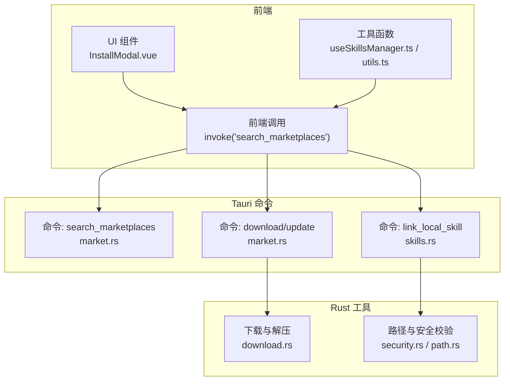
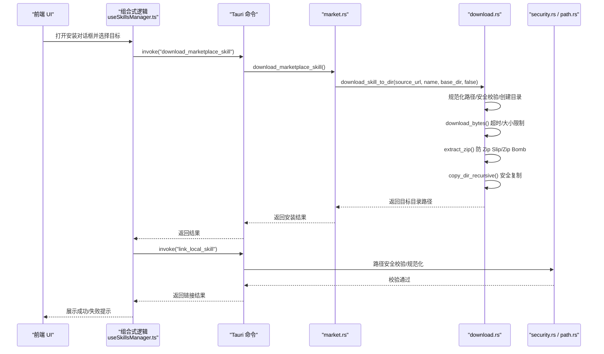
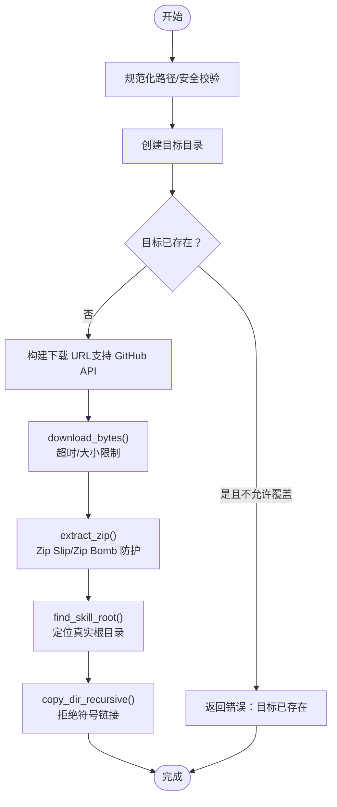
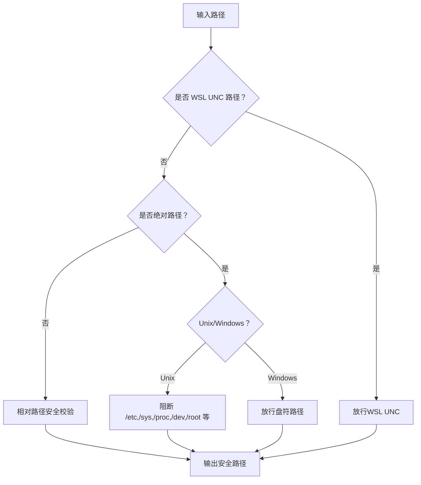
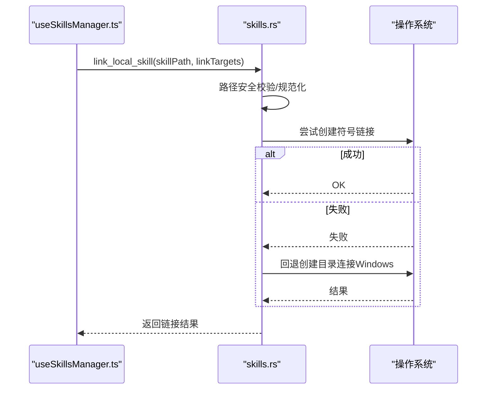
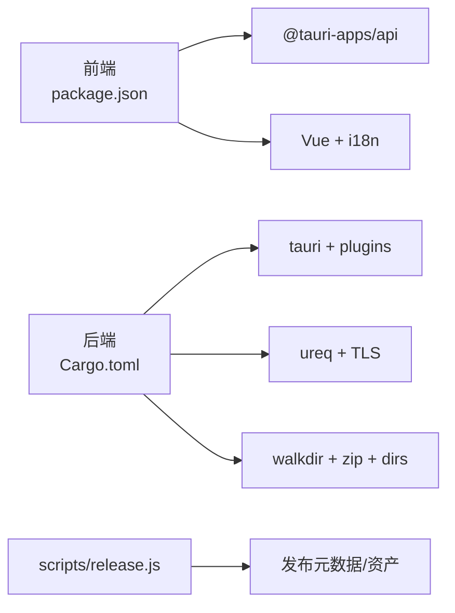

# 安装问题

<cite>
**本文引用的文件**
- [README.md](file://README.md)
- [package.json](file://package.json)
- [src-tauri/Cargo.toml](file://src-tauri/Cargo.toml)
- [src-tauri/tauri.conf.json](file://src-tauri/tauri.conf.json)
- [src-tauri/src/utils/download.rs](file://src-tauri/src/utils/download.rs)
- [src-tauri/src/utils/security.rs](file://src-tauri/src/utils/security.rs)
- [src-tauri/src/utils/path.rs](file://src-tauri/src/utils/path.rs)
- [src-tauri/src/commands/market.rs](file://src-tauri/src/commands/market.rs)
- [src-tauri/src/commands/skills.rs](file://src-tauri/src/commands/skills.rs)
- [src/composables/useSkillsManager.ts](file://src/composables/useSkillsManager.ts)
- [src/composables/utils.ts](file://src/composables/utils.ts)
- [src/components/InstallModal.vue](file://src/components/InstallModal.vue)
- [src/locales/en-US.ts](file://src/locales/en-US.ts)
- [src/locales/zh-CN.ts](file://src/locales/zh-CN.ts)
- [scripts/release.js](file://scripts/release.js)
</cite>

## 目录
1. [简介](#简介)
2. [项目结构](#项目结构)
3. [核心组件](#核心组件)
4. [架构总览](#架构总览)
5. [详细组件分析](#详细组件分析)
6. [依赖关系分析](#依赖关系分析)
7. [性能考量](#性能考量)
8. [故障排除指南](#故障排除指南)
9. [结论](#结论)
10. [附录](#附录)

## 简介
本指南聚焦于 Skills Manager 在安装过程中的常见问题与排障方法，覆盖以下方面：
- 安装包下载失败（网络超时、代理受限、证书与安全策略）
- 依赖项缺失（Node.js、Rust、Xcode 命令行工具）
- 权限不足（用户目录写入、符号链接/连接创建、WSL UNC 路径）
- 系统兼容性（Windows、macOS、Linux）
- WSL 环境下的特殊注意事项
- 安装后的验证步骤与常见错误提示定位

本指南以仓库内实际实现为依据，结合前端与后端命令调用链路，给出可操作的诊断与修复步骤。

## 项目结构
项目采用 Tauri 2 + Vue 3 + TypeScript 架构，核心安装流程由前端触发，通过 Tauri 命令调用 Rust 后端执行下载、解压、校验与链接等操作。关键目录与文件如下：
- 前端：src/（Vue 组件、国际化、组合式逻辑）
- 后端：src-tauri/（Rust 命令与工具函数）
- 构建与发布：scripts/release.js
- 包管理与依赖：package.json、src-tauri/Cargo.toml
- 应用配置：src-tauri/tauri.conf.json

图表来源
- [src/composables/useSkillsManager.ts:190-347](file://src/composables/useSkillsManager.ts#L190-L347)
- [src-tauri/src/commands/market.rs:173-441](file://src-tauri/src/commands/market.rs#L173-L441)
- [src-tauri/src/commands/skills.rs:355-449](file://src-tauri/src/commands/skills.rs#L355-L449)
- [src-tauri/src/utils/download.rs:27-116](file://src-tauri/src/utils/download.rs#L27-L116)
- [src-tauri/src/utils/security.rs:1-92](file://src-tauri/src/utils/security.rs#L1-L92)
- [src-tauri/src/utils/path.rs:21-90](file://src-tauri/src/utils/path.rs#L21-L90)

章节来源
- [README.md: 36-86:36-86](file://README.md#L36-L86)
- [package.json: 1-30:1-30](file://package.json#L1-L30)
- [src-tauri/Cargo.toml: 1-36:1-36](file://src-tauri/Cargo.toml#L1-L36)
- [src-tauri/tauri.conf.json: 1-45:1-45](file://src-tauri/tauri.conf.json#L1-L45)

## 核心组件
- 前端组合式逻辑与调用链
  - useSkillsManager.ts：封装搜索、下载队列、安装、卸载、导入导出等流程，并通过 invoke 调用后端命令。
  - utils.ts：提供路径合法性校验（含 WSL UNC）、错误消息提取、技能名归一化等。
- 后端命令与工具
  - market.rs：聚合市场搜索、下载与更新；使用 download_bytes 进行网络请求与超时控制。
  - download.rs：下载 ZIP、解压、防 Zip Slip 攻击、防 Zip Bomb、目录规范化与安全校验。
  - security.rs 与 path.rs：路径安全校验、WSL UNC 判定、规范化与危险路径阻断。
  - skills.rs：创建符号链接（Unix）或目录连接（Windows），并回退到连接方式。

章节来源
- [src/composables/useSkillsManager.ts: 190-347:190-347](file://src/composables/useSkillsManager.ts#L190-L347)
- [src/composables/utils.ts: 34-99:34-99](file://src/composables/utils.ts#L34-L99)
- [src-tauri/src/commands/market.rs: 173-441:173-441](file://src-tauri/src/commands/market.rs#L173-L441)
- [src-tauri/src/utils/download.rs: 27-116:27-116](file://src-tauri/src/utils/download.rs#L27-L116)
- [src-tauri/src/utils/security.rs: 1-92:1-92](file://src-tauri/src/utils/security.rs#L1-L92)
- [src-tauri/src/utils/path.rs: 21-90:21-90](file://src-tauri/src/utils/path.rs#L21-L90)
- [src-tauri/src/commands/skills.rs: 355-449:355-449](file://src-tauri/src/commands/skills.rs#L355-L449)

## 架构总览
下图展示从用户触发到最终安装完成的关键调用序列，包括下载、解压、安全校验与链接步骤。

图表来源
- [src/composables/useSkillsManager.ts: 288-329:288-329](file://src/composables/useSkillsManager.ts#L288-L329)
- [src-tauri/src/commands/market.rs: 394-441:394-441](file://src-tauri/src/commands/market.rs#L394-L441)
- [src-tauri/src/utils/download.rs: 50-116:50-116](file://src-tauri/src/utils/download.rs#L50-L116)
- [src-tauri/src/utils/security.rs: 21-92:21-92](file://src-tauri/src/utils/security.rs#L21-L92)
- [src-tauri/src/utils/path.rs: 21-90:21-90](file://src-tauri/src/utils/path.rs#L21-L90)

## 详细组件分析

### 下载与解压组件（download.rs）
- 功能要点
  - 限制单次下载最大体积，避免内存溢出。
  - 对 GitHub 地址自动转换为 API 下载地址，统一处理。
  - 解压时进行 Zip Slip 防护与单文件大小限制，防止 Zip Bomb。
  - 递归复制时拒绝符号链接，确保安全性。
  - 临时目录使用 RAII 清理，保证异常退出也能回收资源。
- 关键路径与校验
  - 安装目录必须位于用户主目录下的受控位置，否则直接拒绝。
  - 目标目录存在且不允许覆盖时，返回明确错误提示。

图表来源
- [src-tauri/src/utils/download.rs: 50-116:50-116](file://src-tauri/src/utils/download.rs#L50-L116)
- [src-tauri/src/utils/download.rs: 143-183:143-183](file://src-tauri/src/utils/download.rs#L143-L183)
- [src-tauri/src/utils/download.rs: 185-210:185-210](file://src-tauri/src/utils/download.rs#L185-L210)
- [src-tauri/src/utils/download.rs: 212-273:212-273](file://src-tauri/src/utils/download.rs#L212-L273)

章节来源
- [src-tauri/src/utils/download.rs: 27-48:27-48](file://src-tauri/src/utils/download.rs#L27-L48)
- [src-tauri/src/utils/download.rs: 50-116:50-116](file://src-tauri/src/utils/download.rs#L50-L116)
- [src-tauri/src/utils/download.rs: 143-183:143-183](file://src-tauri/src/utils/download.rs#L143-L183)
- [src-tauri/src/utils/download.rs: 185-210:185-210](file://src-tauri/src/utils/download.rs#L185-L210)
- [src-tauri/src/utils/download.rs: 212-273:212-273](file://src-tauri/src/utils/download.rs#L212-L273)

### 路径安全与 WSL 支持（security.rs / path.rs）
- 安全路径判定
  - 相对路径：禁止父目录、根路径、前缀等非法组件。
  - 绝对路径：Unix 禁止危险系统路径；Windows 支持盘符；WSL UNC 路径视为合法。
- 规范化与危险路径阻断
  - 规范化去除冗余分隔符与当前目录。
  - Windows 保留名检测与规避（前置下划线）。
- WSL UNC 路径识别与放行，避免在 Unix 安全策略下误判。

图表来源
- [src-tauri/src/utils/security.rs: 3-19:3-19](file://src-tauri/src/utils/security.rs#L3-L19)
- [src-tauri/src/utils/security.rs: 21-65:21-65](file://src-tauri/src/utils/security.rs#L21-L65)
- [src-tauri/src/utils/path.rs: 21-90:21-90](file://src-tauri/src/utils/path.rs#L21-L90)
- [src/composables/utils.ts: 55-99:55-99](file://src/composables/utils.ts#L55-L99)

章节来源
- [src-tauri/src/utils/security.rs: 1-92:1-92](file://src-tauri/src/utils/security.rs#L1-L92)
- [src-tauri/src/utils/path.rs: 1-90:1-90](file://src-tauri/src/utils/path.rs#L1-L90)
- [src/composables/utils.ts: 1-125:1-125](file://src/composables/utils.ts#L1-L125)

### 安装链接组件（skills.rs）
- 平台差异
  - Unix：优先创建符号链接；若失败则报错。
  - Windows：优先尝试符号链接，失败时回退到目录连接（junction）。
- 错误处理
  - 若目标已存在但非预期链接，记录“已存在”并跳过。
  - 若链接创建失败，汇总错误详情并返回可读信息。

图表来源
- [src-tauri/src/commands/skills.rs: 355-449:355-449](file://src-tauri/src/commands/skills.rs#L355-L449)

章节来源
- [src-tauri/src/commands/skills.rs: 329-449:329-449](file://src-tauri/src/commands/skills.rs#L329-L449)

## 依赖关系分析
- 前端依赖
  - @tauri-apps/api：与后端通信、文件系统路径拼接、打开文件夹。
  - 国际化与 UI：vue、vue-i18n、Vite。
- 后端依赖
  - tauri、serde、ureq、walkdir、zip、dirs、tauri-plugin-*：命令、HTTP 请求、压缩、路径解析、插件。
- 构建与发布
  - scripts/release.js：版本号同步、签名环境变量检查、产物收集与发布元数据生成。

图表来源
- [package.json: 13-28:13-28](file://package.json#L13-L28)
- [src-tauri/Cargo.toml: 20-35:20-35](file://src-tauri/Cargo.toml#L20-L35)
- [scripts/release.js: 43-64:43-64](file://scripts/release.js#L43-L64)

章节来源
- [package.json: 1-30:1-30](file://package.json#L1-L30)
- [src-tauri/Cargo.toml: 1-36:1-36](file://src-tauri/Cargo.toml#L1-L36)
- [scripts/release.js: 1-300:1-300](file://scripts/release.js#L1-L300)

## 性能考量
- 下载阶段
  - 单次下载最大体积限制，避免内存压力。
  - 超时时间与重定向次数可控，降低长时间占用。
- 解压阶段
  - 单文件大小限制与目录遍历深度限制，防止 Zip Bomb。
- 路径处理
  - 规范化与安全校验在安装前完成，减少后续 I/O 异常。

章节来源
- [src-tauri/src/utils/download.rs: 40-47:40-47](file://src-tauri/src/utils/download.rs#L40-L47)
- [src-tauri/src/utils/download.rs: 176-180:176-180](file://src-tauri/src/utils/download.rs#L176-L180)
- [src-tauri/src/utils/download.rs: 216-266:216-266](file://src-tauri/src/utils/download.rs#L216-L266)

## 故障排除指南

### 通用安装前准备
- 必备工具
  - Node.js（推荐 LTS）
  - Rust（通过 rustup 安装）
  - macOS：Xcode 命令行工具
- 开发者安装
  - 克隆仓库后执行安装与开发启动命令，确保本地环境一致。

章节来源
- [README.md: 69-86:69-86](file://README.md#L69-L86)

### 安装包下载失败
- 可能原因
  - 网络超时或不稳定
  - 代理/防火墙限制
  - 远程服务不可达或返回格式异常
- 诊断步骤
  - 检查网络连通性与代理设置。
  - 查看前端错误提示（如“搜索失败/下载失败”）。
  - 后端日志中市场状态与错误字段可辅助定位来源站点。
- 修复建议
  - 更换网络或调整代理。
  - 稍后再试或切换市场（部分市场可能需要 API Key）。
  - 若为特定市场（SkillsMP），检查 API Key 配置。

章节来源
- [src-tauri/src/commands/market.rs: 173-392:173-392](file://src-tauri/src/commands/market.rs#L173-L392)
- [src/locales/en-US.ts: 170-188:170-188](file://src/locales/en-US.ts#L170-L188)
- [src/locales/zh-CN.ts: 170-188:170-188](file://src/locales/zh-CN.ts#L170-L188)

### 依赖项缺失
- 症状
  - 构建/运行时报错，提示缺少 Node、Rust 或 Xcode 工具。
- 修复
  - 安装 Node.js（LTS）与 Rust（rustup）。
  - macOS 用户安装 Xcode 命令行工具。
  - 清理缓存后重试安装依赖。

章节来源
- [README.md: 69-74:69-74](file://README.md#L69-L74)
- [package.json: 6-12:6-12](file://package.json#L6-L12)
- [src-tauri/Cargo.toml: 20-35:20-35](file://src-tauri/Cargo.toml#L20-L35)

### 权限不足
- 症状
  - 写入用户目录失败、创建符号链接失败、WSL UNC 路径访问受限。
- 诊断与修复
  - 确认安装目录位于用户主目录下的受控位置（默认 ~/.skills-manager/skills）。
  - 在 Windows 上，若需创建目录连接（junction），需管理员权限。
  - 在 macOS 上，首次打开应用可能触发安全警告，按说明解除隔离。
  - WSL 环境下，确保使用正确的 UNC 路径并具备相应权限。

章节来源
- [src-tauri/src/utils/download.rs: 56-61:56-61](file://src-tauri/src/utils/download.rs#L56-L61)
- [src-tauri/src/commands/skills.rs: 420-429:420-429](file://src-tauri/src/commands/skills.rs#L420-L429)
- [src-tauri/src/utils/security.rs: 21-65:21-65](file://src-tauri/src/utils/security.rs#L21-L65)
- [README.md: 43-49:43-49](file://README.md#L43-L49)

### 系统兼容性问题
- Windows
  - 使用符号链接失败时自动回退到目录连接（junction）。
  - 注意保留名与非法字符，必要时重命名。
- macOS
  - 首次运行可能弹出“应用已损坏/来自不受信任开发者”的提示，按说明解除隔离。
- Linux
  - 默认使用符号链接；若失败，检查文件系统类型与权限。

章节来源
- [src-tauri/src/commands/skills.rs: 412-429:412-429](file://src-tauri/src/commands/skills.rs#L412-L429)
- [src/composables/utils.ts: 8-29:8-29](file://src/composables/utils.ts#L8-L29)
- [README.md: 43-49:43-49](file://README.md#L43-L49)

### WSL 环境特殊问题
- 症状
  - 无法正确解析或访问 WSL UNC 路径。
- 诊断与修复
  - 确保路径以 \\wsl$\\ 或 \\wsl.localhost\\ 开头。
  - 在 Unix 安全策略下，WSL UNC 路径被视为合法，但仍需确保目标可访问。
  - 若链接失败，检查 WSL 分发是否正常运行及权限设置。

章节来源
- [src-tauri/src/utils/security.rs: 21-26:21-26](file://src-tauri/src/utils/security.rs#L21-L26)
- [src/composables/utils.ts: 55-62:55-62](file://src/composables/utils.ts#L55-L62)

### 安装后的验证步骤
- 打开本地技能面板，确认已下载/更新的技能可见。
- 选择 IDE 目标，执行安装，观察链接结果（符号链接或目录连接）。
- 若失败，查看错误提示并根据路径合法性与权限问题逐一排查。

章节来源
- [src/composables/useSkillsManager.ts: 353-374:353-374](file://src/composables/useSkillsManager.ts#L353-L374)
- [src/components/InstallModal.vue: 40-56:40-56](file://src/components/InstallModal.vue#L40-L56)

### 常见错误代码与对应解决方案
- “安装目录不在允许范围内”
  - 说明：安装目标超出受控目录范围。
  - 解决：使用默认本地仓库目录（~/.skills-manager/skills）。
- “目标目录已存在，请更换名称或先清理”
  - 说明：目标目录已存在且不允许覆盖。
  - 解决：清理旧目录或更换技能名称。
- “Failed to create a link for …”
  - 说明：符号链接或目录连接创建失败。
  - 解决：检查权限（Windows 需管理员）、文件系统类型、目标路径是否存在。
- “mklink /J failed”
  - 说明：Windows 目录连接失败。
  - 解决：以管理员身份运行、检查目标路径与权限。
- “Failed to open folder.”
  - 说明：无法打开文件夹。
  - 解决：确认路径存在，必要时尝试打开其父目录。

章节来源
- [src-tauri/src/utils/download.rs: 56-73:56-73](file://src-tauri/src/utils/download.rs#L56-L73)
- [src-tauri/src/commands/skills.rs: 335-353:335-353](file://src-tauri/src/commands/skills.rs#L335-L353)
- [src-tauri/src/commands/skills.rs: 431-441:431-441](file://src-tauri/src/commands/skills.rs#L431-L441)
- [src/locales/en-US.ts: 170-188:170-188](file://src/locales/en-US.ts#L170-L188)

## 结论
本指南基于项目实际实现，梳理了从下载、解压、安全校验到链接安装的完整流程，并针对不同平台与环境提供了可操作的排障步骤。遵循本文建议，可有效提升安装成功率并快速定位问题根因。

## 附录
- 版本与发布
  - scripts/release.js 负责版本号同步、签名环境检查、产物收集与发布元数据生成。
- 应用配置
  - tauri.conf.json 定义产品名、版本、构建命令、安全 CSP 与更新器公钥等。

章节来源
- [scripts/release.js: 43-64:43-64](file://scripts/release.js#L43-L64)
- [scripts/release.js: 199-232:199-232](file://scripts/release.js#L199-L232)
- [src-tauri/tauri.conf.json: 1-45:1-45](file://src-tauri/tauri.conf.json#L1-L45)