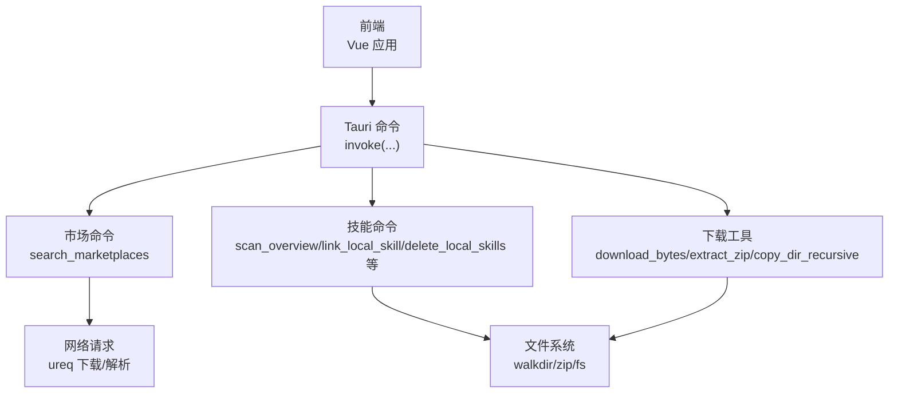
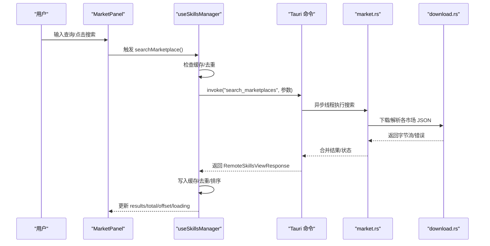
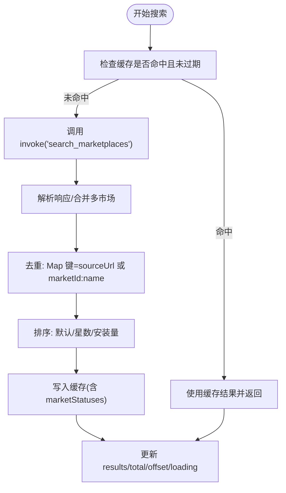
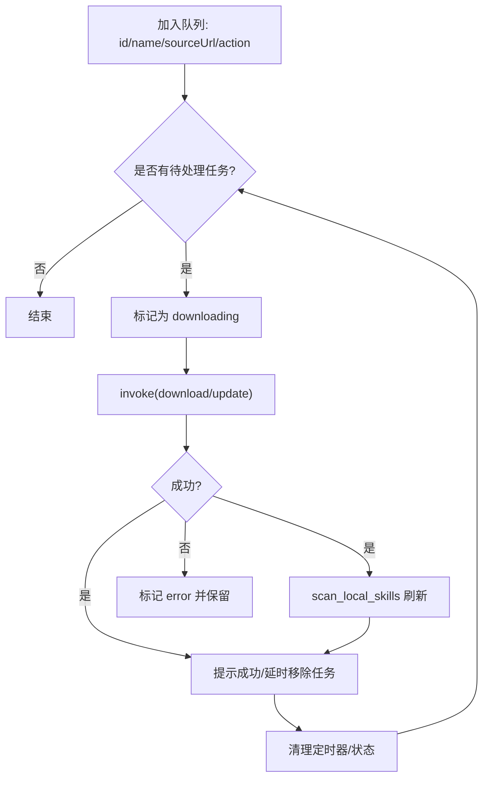
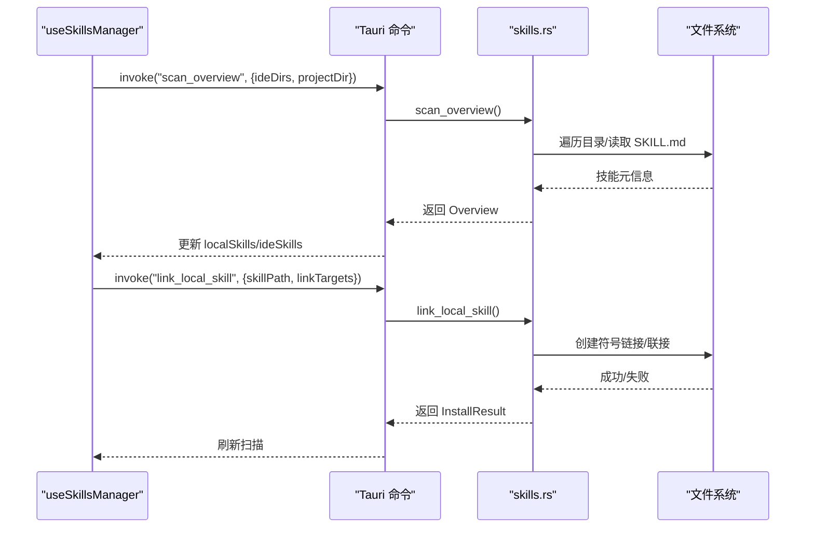
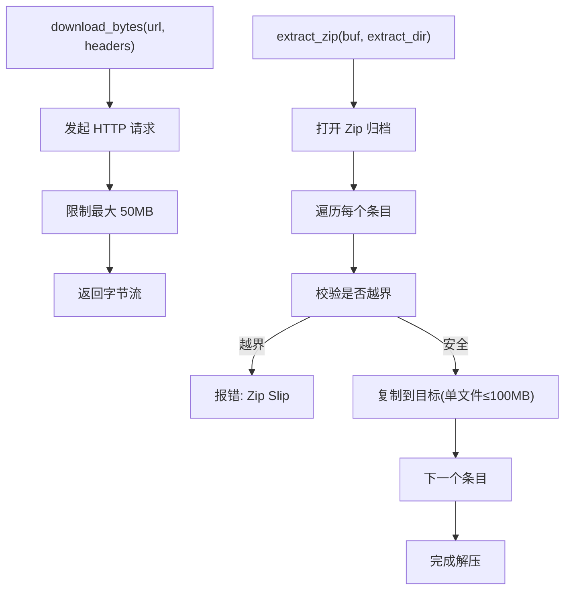
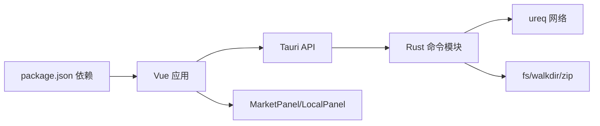

# 性能问题

<cite>
**本文引用的文件**
- [package.json](file://package.json)
- [vite.config.ts](file://vite.config.ts)
- [src/main.ts](file://src/main.ts)
- [src/composables/useSkillsManager.ts](file://src/composables/useSkillsManager.ts)
- [src/composables/types.ts](file://src/composables/types.ts)
- [src/composables/useIdeConfig.ts](file://src/composables/useIdeConfig.ts)
- [src/composables/useMarketConfig.ts](file://src/composables/useMarketConfig.ts)
- [src-tauri/Cargo.toml](file://src-tauri/Cargo.toml)
- [src-tauri/tauri.conf.json](file://src-tauri/tauri.conf.json)
- [src-tauri/src/commands/market.rs](file://src-tauri/src/commands/market.rs)
- [src-tauri/src/commands/skills.rs](file://src-tauri/src/commands/skills.rs)
- [src-tauri/src/utils/download.rs](file://src-tauri/src/utils/download.rs)
- [src-tauri/src/utils/path.rs](file://src-tauri/src/utils/path.rs)
- [src/components/MarketPanel.vue](file://src/components/MarketPanel.vue)
- [src/components/LocalPanel.vue](file://src/components/LocalPanel.vue)
</cite>

## 目录
1. [简介](#简介)
2. [项目结构](#项目结构)
3. [核心组件](#核心组件)
4. [架构总览](#架构总览)
5. [详细组件分析](#详细组件分析)
6. [依赖关系分析](#依赖关系分析)
7. [性能考量](#性能考量)
8. [故障排除指南](#故障排除指南)
9. [结论](#结论)
10. [附录](#附录)

## 简介
本指南聚焦 Skills Manager 的性能问题，覆盖启动缓慢、搜索响应慢、大量技能管理时卡顿、内存占用过高、磁盘 I/O 与网络 I/O 优化等主题。文档基于仓库中的前端 Vue 组合式函数、Tauri 原生命令与工具模块，给出可操作的诊断步骤、优化策略与系统资源管理建议，并提供可视化图示帮助理解数据流与控制流。

## 项目结构
应用采用前端（Vue + TypeScript）与后端（Rust/Tauri）分层设计：
- 前端负责 UI、状态管理、缓存与交互；通过 Tauri 命令调用 Rust 后端执行磁盘扫描、下载、链接等重任务。
- 后端负责市场搜索聚合、技能导入/导出、符号链接/目录复制、安全校验与 I/O 限制。

图表来源
- [src/main.ts:1-7](file://src/main.ts#L1-L7)
- [src/composables/useSkillsManager.ts:190-248](file://src/composables/useSkillsManager.ts#L190-L248)
- [src-tauri/src/commands/market.rs:173-392](file://src-tauri/src/commands/market.rs#L173-L392)
- [src-tauri/src/commands/skills.rs:451-535](file://src-tauri/src/commands/skills.rs#L451-L535)
- [src-tauri/src/utils/download.rs:27-116](file://src-tauri/src/utils/download.rs#L27-L116)

章节来源
- [package.json:1-30](file://package.json#L1-L30)
- [vite.config.ts:1-33](file://vite.config.ts#L1-L33)
- [src/main.ts:1-7](file://src/main.ts#L1-L7)

## 核心组件
- useSkillsManager：集中管理市场搜索、本地扫描、下载队列、安装/卸载、导入/导出等流程，包含搜索结果缓存与去重逻辑。
- useIdeConfig/useMarketConfig：管理 IDE 目录与市场配置的本地持久化，减少重复计算与 IO。
- MarketPanel/LocalPanel：UI 展示与交互，绑定 useSkillsManager 的状态与事件。
- Rust 命令与工具：封装网络下载、ZIP 解压、目录遍历、路径规范化与安全检查。

章节来源
- [src/composables/useSkillsManager.ts:20-800](file://src/composables/useSkillsManager.ts#L20-L800)
- [src/composables/types.ts:1-119](file://src/composables/types.ts#L1-L119)
- [src/composables/useIdeConfig.ts:1-131](file://src/composables/useIdeConfig.ts#L1-L131)
- [src/composables/useMarketConfig.ts:1-67](file://src/composables/useMarketConfig.ts#L1-L67)
- [src/components/MarketPanel.vue:1-192](file://src/components/MarketPanel.vue#L1-L192)
- [src/components/LocalPanel.vue:1-310](file://src/components/LocalPanel.vue#L1-L310)

## 架构总览
前端通过 Tauri invoke 调用后端命令，命令在后台线程中执行耗时任务，避免阻塞 UI。下载与扫描过程均受 I/O 限制与安全校验保护。

图表来源
- [src/components/MarketPanel.vue:30-39](file://src/components/MarketPanel.vue#L30-L39)
- [src/composables/useSkillsManager.ts:190-248](file://src/composables/useSkillsManager.ts#L190-L248)
- [src-tauri/src/commands/market.rs:173-392](file://src-tauri/src/commands/market.rs#L173-L392)
- [src-tauri/src/utils/download.rs:27-48](file://src-tauri/src/utils/download.rs#L27-L48)

## 详细组件分析

### 市场搜索与缓存（useSkillsManager）
- 缓存键由查询词与 limit 组成，TTL 默认 10 分钟，避免重复网络请求。
- 去重策略以 sourceUrl 或 marketId:name 为键，保证多市场合并时不重复。
- 排序支持默认、按星数、按安装量，排序在前端完成，注意大数据量时的渲染成本。

图表来源
- [src/composables/useSkillsManager.ts:190-248](file://src/composables/useSkillsManager.ts#L190-L248)
- [src/composables/useSkillsManager.ts:250-261](file://src/composables/useSkillsManager.ts#L250-L261)
- [src/composables/useSkillsManager.ts:72-100](file://src/composables/useSkillsManager.ts#L72-L100)

章节来源
- [src/composables/useSkillsManager.ts:190-248](file://src/composables/useSkillsManager.ts#L190-L248)
- [src/composables/useSkillsManager.ts:250-261](file://src/composables/useSkillsManager.ts#L250-L261)
- [src/composables/useSkillsManager.ts:72-100](file://src/composables/useSkillsManager.ts#L72-L100)

### 下载队列与批量处理（useSkillsManager）
- 下载队列串行处理，避免并发磁盘争用与网络风暴。
- 完成/失败后定时器清理，防止内存泄漏；错误状态保留以便 UI 反馈。
- 支持“更新”与“下载”，统一走 download/update 命令，完成后刷新本地扫描。

图表来源
- [src/composables/useSkillsManager.ts:263-342](file://src/composables/useSkillsManager.ts#L263-L342)
- [src/composables/useSkillsManager.ts:353-374](file://src/composables/useSkillsManager.ts#L353-L374)

章节来源
- [src/composables/useSkillsManager.ts:263-342](file://src/composables/useSkillsManager.ts#L263-L342)
- [src/composables/useSkillsManager.ts:353-374](file://src/composables/useSkillsManager.ts#L353-L374)

### 本地扫描与链接（Rust 命令）
- scan_overview：遍历管理目录与 IDE 目录，收集本地/IDE 技能，支持项目目录联动扫描。
- link_local_skill：创建符号链接或 Windows 联接，带安全校验与路径规范化。
- 删除/导入/导出：严格限制在允许根目录内，导出使用 ZIP 压缩并限制单文件大小。

图表来源
- [src/composables/useSkillsManager.ts:353-374](file://src/composables/useSkillsManager.ts#L353-L374)
- [src-tauri/src/commands/skills.rs:451-535](file://src-tauri/src/commands/skills.rs#L451-L535)
- [src-tauri/src/commands/skills.rs:355-449](file://src-tauri/src/commands/skills.rs#L355-L449)

章节来源
- [src-tauri/src/commands/skills.rs:451-535](file://src-tauri/src/commands/skills.rs#L451-L535)
- [src-tauri/src/commands/skills.rs:355-449](file://src-tauri/src/commands/skills.rs#L355-L449)

### 下载与解压（Rust 工具）
- download_bytes：限制最大下载 50MB，设置超时与重定向，避免 OOM。
- extract_zip：逐文件拷贝并限制单文件最大 100MB，防止 Zip Bomb。
- copy_dir_recursive：递归复制时拒绝符号链接，保障安全性。

图表来源
- [src-tauri/src/utils/download.rs:27-48](file://src-tauri/src/utils/download.rs#L27-L48)
- [src-tauri/src/utils/download.rs:143-183](file://src-tauri/src/utils/download.rs#L143-L183)
- [src-tauri/src/utils/download.rs:185-210](file://src-tauri/src/utils/download.rs#L185-L210)

章节来源
- [src-tauri/src/utils/download.rs:27-48](file://src-tauri/src/utils/download.rs#L27-L48)
- [src-tauri/src/utils/download.rs:143-183](file://src-tauri/src/utils/download.rs#L143-L183)
- [src-tauri/src/utils/download.rs:185-210](file://src-tauri/src/utils/download.rs#L185-L210)

## 依赖关系分析
- 前端依赖 Vue 与 Tauri 插件，构建与开发服务器由 Vite 管理。
- 后端依赖 Tauri、ureq、walkdir、zip、dirs 等 crates，提供网络、压缩、文件系统能力。
- 命令与工具模块之间耦合度低，职责清晰：命令负责编排，工具负责具体 I/O 与安全。

图表来源
- [package.json:13-28](file://package.json#L13-L28)
- [src-tauri/Cargo.toml:20-36](file://src-tauri/Cargo.toml#L20-L36)

章节来源
- [package.json:13-28](file://package.json#L13-L28)
- [src-tauri/Cargo.toml:20-36](file://src-tauri/Cargo.toml#L20-L36)

## 性能考量
- 启动阶段
  - 前端：入口仅创建应用与国际化，无重型初始化；首屏渲染由组件懒加载与虚拟滚动（如需）优化空间。
  - 后端：命令在后台线程执行，避免阻塞主线程。
- 搜索阶段
  - 前端缓存与去重显著降低网络与渲染压力；排序在前端进行，大数据量时应考虑分页/虚拟列表。
- 下载与安装
  - 队列串行化避免磁盘与网络竞争；下载与解压均有上限，防止异常流量与内存占用。
- 扫描与链接
  - 遍历目录与符号链接创建为同步操作，建议在后台线程执行；对大目录可考虑分批处理与进度反馈。

章节来源
- [src/main.ts:1-7](file://src/main.ts#L1-L7)
- [src/composables/useSkillsManager.ts:190-248](file://src/composables/useSkillsManager.ts#L190-L248)
- [src-tauri/src/utils/download.rs:27-48](file://src-tauri/src/utils/download.rs#L27-L48)
- [src-tauri/src/commands/skills.rs:451-535](file://src-tauri/src/commands/skills.rs#L451-L535)

## 故障排除指南

### 启动缓慢
- 症状：应用启动时间长，首屏渲染延迟。
- 诊断要点
  - 检查前端构建与开发服务器配置，确认 Vite HMR 与忽略规则正确。
  - 确认 Tauri 开发命令与 devUrl 配置一致。
- 优化建议
  - 减少首屏组件数量，启用路由懒加载与组件异步加载。
  - 关闭不必要的插件或在开发环境禁用非必要功能。
  - 确保 dist 目录与构建产物正确生成。

章节来源
- [vite.config.ts:8-32](file://vite.config.ts#L8-L32)
- [src-tauri/tauri.conf.json:6-11](file://src-tauri/tauri.conf.json#L6-L11)
- [src/main.ts:1-7](file://src/main.ts#L1-L7)

### 搜索响应慢
- 症状：输入查询后等待时间长，多次重复请求。
- 诊断要点
  - 检查 useSkillsManager 的缓存键与 TTL 设置，确认缓存命中率。
  - 查看 market.rs 的网络请求与解析耗时，关注各市场的可用性与错误状态。
- 优化建议
  - 增加防抖（已在 UI 中触发搜索时减少频繁调用），合理设置 limit/offset。
  - 对不可用市场禁用或降级，减少无效请求。
  - 前端渲染时采用虚拟列表，减少 DOM 节点数量。

章节来源
- [src/composables/useSkillsManager.ts:190-248](file://src/composables/useSkillsManager.ts#L190-L248)
- [src-tauri/src/commands/market.rs:173-392](file://src-tauri/src/commands/market.rs#L173-L392)
- [src/components/MarketPanel.vue:53-83](file://src/components/MarketPanel.vue#L53-L83)

### 大量技能管理时卡顿
- 症状：本地技能列表庞大时滚动卡顿、安装/卸载按钮无响应。
- 诊断要点
  - 检查本地面板的过滤与选择逻辑，确认大数据量下的计算开销。
  - 观察下载队列是否堆积，串行处理是否导致 UI 延迟。
- 优化建议
  - 使用虚拟列表展示本地技能，仅渲染可视区域。
  - 将排序/过滤逻辑迁移到后台线程或分片处理。
  - 控制同时进行的任务数量，必要时增加队列优先级。

章节来源
- [src/components/LocalPanel.vue:33-53](file://src/components/LocalPanel.vue#L33-L53)
- [src/composables/useSkillsManager.ts:263-342](file://src/composables/useSkillsManager.ts#L263-L342)

### 内存占用过高
- 症状：长时间运行后内存持续增长。
- 诊断要点
  - 检查定时器清理逻辑，确认已完成任务的定时器已被移除。
  - 关注 Map/Set 的缓存容量与 TTL，避免无限增长。
- 优化建议
  - 为搜索缓存设置最大容量与 LRU 淘汰策略。
  - 在组件卸载时清理所有定时器与订阅。
  - 使用 WeakMap/WeakSet 存储临时引用，避免强引用导致 GC 困难。

章节来源
- [src/composables/useSkillsManager.ts:50-55](file://src/composables/useSkillsManager.ts#L50-L55)
- [src/composables/useSkillsManager.ts:238-242](file://src/composables/useSkillsManager.ts#L238-L242)

### 磁盘 I/O 优化
- 症状：导入/导出/扫描/链接耗时长，CPU 占用高。
- 诊断要点
  - 导出时是否对多个技能目录进行 ZIP 压缩，压缩算法与权限设置是否合理。
  - 扫描时是否遍历了大量无关文件，是否存在冗余目录。
- 优化建议
  - 导出使用 Deflate 压缩，限制单文件大小，避免深层嵌套。
  - 扫描时仅遍历已知 IDE 目录，避免全盘扫描。
  - 使用符号链接替代复制，减少磁盘写入。

章节来源
- [src-tauri/src/commands/skills.rs:760-800](file://src-tauri/src/commands/skills.rs#L760-L800)
- [src-tauri/src/utils/download.rs:252-309](file://src-tauri/src/utils/download.rs#L252-L309)
- [src-tauri/src/commands/skills.rs:451-535](file://src-tauri/src/commands/skills.rs#L451-L535)

### 网络 I/O 与超时
- 症状：市场搜索超时或失败，下载中断。
- 诊断要点
  - download_bytes 是否设置了超时与最大下载大小。
  - market.rs 的网络请求头与重定向次数。
- 优化建议
  - 适当提高超时阈值，增加重试与断点续传（如适用）。
  - 对失败的市场状态进行降级显示，避免阻塞主流程。

章节来源
- [src-tauri/src/utils/download.rs:27-48](file://src-tauri/src/utils/download.rs#L27-L48)
- [src-tauri/src/commands/market.rs:173-392](file://src-tauri/src/commands/market.rs#L173-L392)

### 内存泄漏检测
- 方法
  - 使用浏览器开发者工具的内存快照对比，定位未释放的定时器与事件监听。
  - 在组件卸载钩子中清理定时器数组，确保每个定时器 ID 被移除。
- 验证
  - 运行一段时间后对比堆快照，确认 Map/Set 与定时器数量稳定。

章节来源
- [src/composables/useSkillsManager.ts:50-55](file://src/composables/useSkillsManager.ts#L50-L55)
- [src/composables/useSkillsManager.ts:312-321](file://src/composables/useSkillsManager.ts#L312-L321)

### 不同硬件配置下的调优策略
- 低配 CPU
  - 减少并发任务，保持下载队列串行；关闭非必要 UI 动画。
  - 降低扫描深度与范围，仅扫描常用 IDE 目录。
- 低内存
  - 缩小搜索缓存容量与 TTL；及时清理已完成任务的定时器。
  - 导出/导入时避免一次性处理过多技能，分批执行。
- SSD/机械盘
  - 符号链接优先于复制；导出时选择合适压缩比与权限，平衡速度与体积。

章节来源
- [src-tauri/src/utils/download.rs:185-210](file://src-tauri/src/utils/download.rs#L185-L210)
- [src-tauri/src/commands/skills.rs:451-535](file://src-tauri/src/commands/skills.rs#L451-L535)

## 结论
通过前端缓存与去重、后台线程执行、I/O 限流与安全校验、以及合理的 UI 渲染策略，Skills Manager 在多数场景下具备良好的性能表现。针对启动慢、搜索慢、卡顿与内存占用高的问题，建议从缓存策略、任务调度、渲染优化与磁盘 I/O 限制等方面入手，结合不同硬件配置进行差异化调优。

## 附录
- 常用命令与配置参考
  - 前端开发与构建脚本见 package.json。
  - Vite 开发服务器端口与 HMR 配置见 vite.config.ts。
  - Tauri 开发与打包配置见 tauri.conf.json。

章节来源
- [package.json:6-11](file://package.json#L6-L11)
- [vite.config.ts:16-26](file://vite.config.ts#L16-L26)
- [src-tauri/tauri.conf.json:6-11](file://src-tauri/tauri.conf.json#L6-L11)