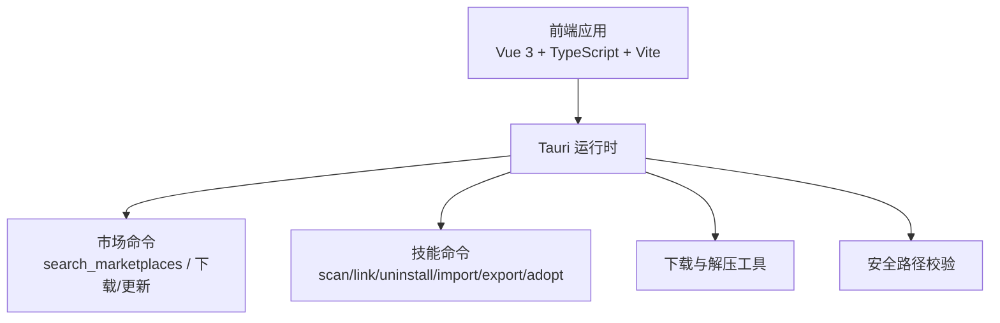
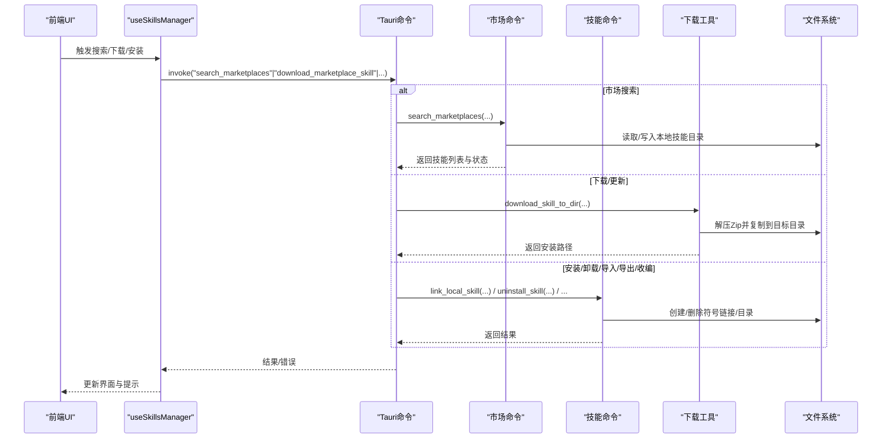
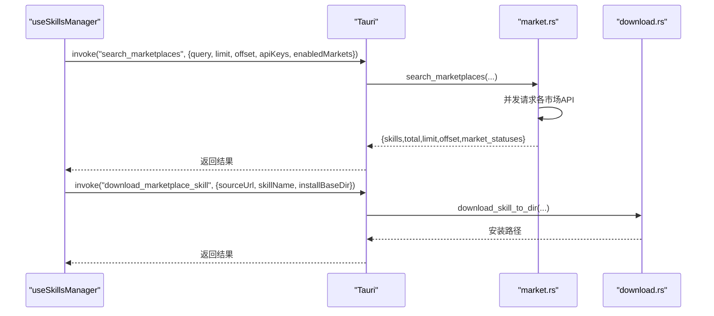
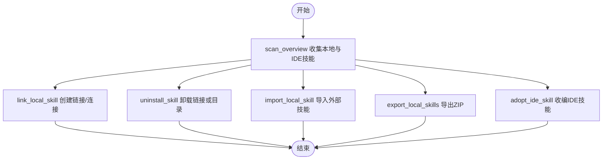
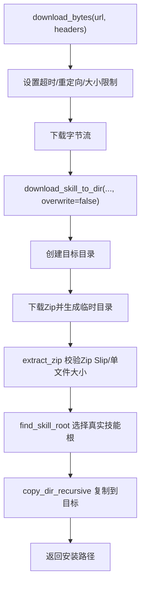
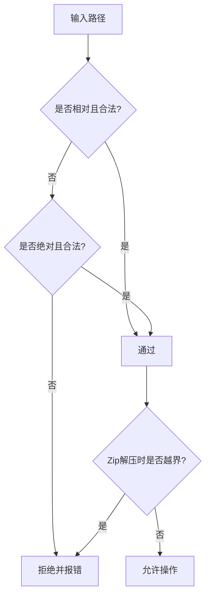

# 故障排除

<cite>
**本文引用的文件**
- [README.md](file://README.md)
- [package.json](file://package.json)
- [src/main.ts](file://src/main.ts)
- [src-tauri/Cargo.toml](file://src-tauri/Cargo.toml)
- [src-tauri/src/main.rs](file://src-tauri/src/main.rs)
- [src-tauri/src/lib.rs](file://src-tauri/src/lib.rs)
- [src/composables/useSkillsManager.ts](file://src/composables/useSkillsManager.ts)
- [src/composables/types.ts](file://src/composables/types.ts)
- [src-tauri/src/commands/market.rs](file://src-tauri/src/commands/market.rs)
- [src-tauri/src/commands/skills.rs](file://src-tauri/src/commands/skills.rs)
- [src-tauri/src/utils/download.rs](file://src-tauri/src/utils/download.rs)
- [src-tauri/src/utils/security.rs](file://src-tauri/src/utils/security.rs)
- [src/components/Toast.vue](file://src/components/Toast.vue)
- [src/composables/utils.ts](file://src/composables/utils.ts)
</cite>

## 目录
1. [简介](#简介)
2. [项目结构](#项目结构)
3. [核心组件](#核心组件)
4. [架构总览](#架构总览)
5. [详细组件分析](#详细组件分析)
6. [依赖关系分析](#依赖关系分析)
7. [性能考虑](#性能考虑)
8. [故障排除指南](#故障排除指南)
9. [结论](#结论)
10. [附录](#附录)

## 简介
本指南面向使用 Skills Manager 的用户与开发者，聚焦于安装、权限、网络、文件系统、性能与兼容性等常见问题的诊断与解决。文档基于仓库中的前端、Tauri 后端、命令实现与工具模块，提供可操作的排障步骤、日志分析方法与调试技巧，并给出社区支持与反馈流程。

## 项目结构
项目采用“前端 Vue 3 + TypeScript + Vite”与“后端 Tauri 2 + Rust”的分层架构：
- 前端负责 UI、状态管理与调用后端命令（通过 @tauri-apps/api）
- 后端通过 Tauri 暴露命令接口，执行市场搜索、下载、本地扫描、链接/卸载等系统级操作
- 工具模块提供安全路径校验、下载与解压、Zip 导出等能力

**图表来源**
- [src/main.ts:1-7](file://src/main.ts#L1-L7)
- [src-tauri/src/lib.rs:20-53](file://src-tauri/src/lib.rs#L20-L53)
- [src-tauri/src/commands/market.rs:173-392](file://src-tauri/src/commands/market.rs#L173-L392)
- [src-tauri/src/commands/skills.rs:355-800](file://src-tauri/src/commands/skills.rs#L355-L800)
- [src-tauri/src/utils/download.rs:27-116](file://src-tauri/src/utils/download.rs#L27-L116)
- [src-tauri/src/utils/security.rs:3-92](file://src-tauri/src/utils/security.rs#L3-L92)

**章节来源**
- [README.md:1-104](file://README.md#L1-L104)
- [package.json:1-30](file://package.json#L1-L30)
- [src/main.ts:1-7](file://src/main.ts#L1-L7)
- [src-tauri/Cargo.toml:1-36](file://src-tauri/Cargo.toml#L1-L36)
- [src-tauri/src/main.rs:1-7](file://src-tauri/src/main.rs#L1-L7)
- [src-tauri/src/lib.rs:20-53](file://src-tauri/src/lib.rs#L20-L53)

## 核心组件
- 前端状态与业务逻辑：useSkillsManager 负责市场搜索、下载队列、本地扫描、安装/卸载、导入导出、打开目录等
- 后端命令：市场命令（搜索、下载、更新）、技能命令（扫描、链接、卸载、导入、删除、导出、收编）
- 工具模块：下载与解压、Zip 安全校验、路径合法性与安全性检查
- 类型定义：统一前后端数据结构，便于错误定位与日志输出

**章节来源**
- [src/composables/useSkillsManager.ts:1-867](file://src/composables/useSkillsManager.ts#L1-L867)
- [src/composables/types.ts:1-119](file://src/composables/types.ts#L1-L119)
- [src-tauri/src/commands/market.rs:173-442](file://src-tauri/src/commands/market.rs#L173-L442)
- [src-tauri/src/commands/skills.rs:355-847](file://src-tauri/src/commands/skills.rs#L355-L847)
- [src-tauri/src/utils/download.rs:27-273](file://src-tauri/src/utils/download.rs#L27-L273)
- [src-tauri/src/utils/security.rs:3-92](file://src-tauri/src/utils/security.rs#L3-L92)

## 架构总览
前端通过 invoke 调用后端命令，命令在 Rust 中执行系统操作并返回结果；下载与解压由专用工具模块完成；安全策略贯穿路径解析、Zip 解压与链接创建。

**图表来源**
- [src/composables/useSkillsManager.ts:190-374](file://src/composables/useSkillsManager.ts#L190-L374)
- [src-tauri/src/lib.rs:27-39](file://src-tauri/src/lib.rs#L27-L39)
- [src-tauri/src/commands/market.rs:173-442](file://src-tauri/src/commands/market.rs#L173-L442)
- [src-tauri/src/commands/skills.rs:355-800](file://src-tauri/src/commands/skills.rs#L355-L800)
- [src-tauri/src/utils/download.rs:50-116](file://src-tauri/src/utils/download.rs#L50-L116)

## 详细组件分析

### 组件一：市场搜索与下载（前端到后端）
- 前端调用 search_marketplaces，传入查询词、分页、启用的市场与密钥配置
- 后端并发请求多个市场源，聚合结果并返回市场状态
- 下载/更新通过 download_skill_to_dir 执行，含超时、大小限制与 Zip 安全校验

**图表来源**
- [src/composables/useSkillsManager.ts:190-248](file://src/composables/useSkillsManager.ts#L190-L248)
- [src-tauri/src/commands/market.rs:173-392](file://src-tauri/src/commands/market.rs#L173-L392)
- [src-tauri/src/utils/download.rs:50-116](file://src-tauri/src/utils/download.rs#L50-L116)

**章节来源**
- [src/composables/useSkillsManager.ts:190-374](file://src/composables/useSkillsManager.ts#L190-L374)
- [src-tauri/src/commands/market.rs:173-442](file://src-tauri/src/commands/market.rs#L173-L442)
- [src-tauri/src/utils/download.rs:27-116](file://src-tauri/src/utils/download.rs#L27-L116)

### 组件二：本地扫描与安装（链接/卸载/导入/导出/收编）
- scan_overview 收集本地与 IDE 目录中的技能，识别符号链接与受管关系
- link_local_skill 在目标 IDE 目录创建符号链接（Windows 兜底为目录连接）
- uninstall_skill 删除链接或目录，严格限定允许根目录
- import_local_skill 将外部技能导入受管目录
- export_local_skills 导出 ZIP，禁止导出到技能内部
- adopt_ide_skill 将 IDE 中的技能迁移到受管目录并重新链接

**图表来源**
- [src-tauri/src/commands/skills.rs:451-800](file://src-tauri/src/commands/skills.rs#L451-L800)

**章节来源**
- [src-tauri/src/commands/skills.rs:355-847](file://src-tauri/src/commands/skills.rs#L355-L847)

### 组件三：下载与解压工具（安全与性能）
- download_bytes 设置重定向次数、超时、最大下载体积，避免 OOM
- extract_zip 校验 Zip Slip，限制单文件大小，确保只写入目标目录
- copy_dir_recursive 复制目录，拒绝符号链接
- find_skill_root 智能选择技能根目录，处理多包场景

**图表来源**
- [src-tauri/src/utils/download.rs:27-273](file://src-tauri/src/utils/download.rs#L27-L273)

**章节来源**
- [src-tauri/src/utils/download.rs:27-273](file://src-tauri/src/utils/download.rs#L27-L273)

### 组件四：安全路径与系统兼容性
- is_safe_relative_dir / is_safe_absolute_dir 校验相对/绝对路径合法性
- is_within_directory 防止 Zip Slip 写入越界
- Windows 兜底使用目录连接（junction）替代符号链接
- WSL UNC 路径识别与放行

**图表来源**
- [src-tauri/src/utils/security.rs:3-92](file://src-tauri/src/utils/security.rs#L3-L92)
- [src-tauri/src/utils/download.rs:143-183](file://src-tauri/src/utils/download.rs#L143-L183)

**章节来源**
- [src-tauri/src/utils/security.rs:3-92](file://src-tauri/src/utils/security.rs#L3-L92)
- [src-tauri/src/utils/download.rs:143-183](file://src-tauri/src/utils/download.rs#L143-L183)

## 依赖关系分析
- 前端依赖 @tauri-apps/api 与插件（dialog、opener、process、updater），用于对话框、打开文件/链接、进程与更新
- 后端依赖 tauri、serde、ureq、zip、walkdir、dirs 等，提供命令、HTTP 请求、压缩与文件遍历能力
- 插件层面：process、updater、single-instance、opener、dialog

**图表来源**
- [package.json:13-28](file://package.json#L13-L28)
- [src-tauri/Cargo.toml:20-36](file://src-tauri/Cargo.toml#L20-L36)
- [src-tauri/src/lib.rs:20-53](file://src-tauri/src/lib.rs#L20-L53)

**章节来源**
- [package.json:13-28](file://package.json#L13-L28)
- [src-tauri/Cargo.toml:20-36](file://src-tauri/Cargo.toml#L20-L36)
- [src-tauri/src/lib.rs:20-53](file://src-tauri/src/lib.rs#L20-L53)

## 性能考虑
- 市场搜索缓存：前端对查询结果进行 TTL 缓存，减少重复请求
- 下载限速与大小限制：下载器限制最大体积与单文件大小，避免内存压力
- 并发与异步：市场搜索在后台线程执行，避免阻塞 UI
- 批量操作：安装/卸载/收编支持批量，减少多次 IO

**章节来源**
- [src/composables/useSkillsManager.ts:23-27](file://src/composables/useSkillsManager.ts#L23-L27)
- [src-tauri/src/commands/market.rs:181-392](file://src-tauri/src/commands/market.rs#L181-L392)
- [src-tauri/src/utils/download.rs:40-47](file://src-tauri/src/utils/download.rs#L40-L47)

## 故障排除指南

### 一、安装与启动问题
- 症状：首次启动弹出“应用已损坏/来自不受信任的开发者”
  - macOS 解决：参考说明文档中关于移除隔离属性的命令
  - 参考：[README.md:43-49](file://README.md#L43-L49)
- 症状：应用无法打开或窗口未聚焦
  - 后端启用了单实例插件，二次启动会聚焦已有窗口
  - 参考：[src-tauri/src/lib.rs:42-48](file://src-tauri/src/lib.rs#L42-L48)

**章节来源**
- [README.md:43-49](file://README.md#L43-L49)
- [src-tauri/src/lib.rs:42-48](file://src-tauri/src/lib.rs#L42-L48)

### 二、权限与路径问题
- 症状：安装/卸载/导入/导出失败，提示“路径不合法/越权”
  - 排查：确认目标路径在允许范围内（Home 子树或 IDE 目录），避免相对路径穿越
  - 参考：[src-tauri/src/utils/security.rs:3-92](file://src-tauri/src/utils/security.rs#L3-L92)
- 症状：Zip 解压时报“尝试写入越界”
  - 排查：检查压缩包是否包含危险路径，工具模块已内置 Zip Slip 防护
  - 参考：[src-tauri/src/utils/download.rs:158-164](file://src-tauri/src/utils/download.rs#L158-L164)
- 症状：Windows 上链接失败
  - 排查：工具模块会优先创建符号链接，失败则尝试目录连接（junction），若仍失败请检查权限与路径字符
  - 参考：[src-tauri/src/commands/skills.rs:420-430](file://src-tauri/src/commands/skills.rs#L420-L430)

**章节来源**
- [src-tauri/src/utils/security.rs:3-92](file://src-tauri/src/utils/security.rs#L3-L92)
- [src-tauri/src/utils/download.rs:158-164](file://src-tauri/src/utils/download.rs#L158-L164)
- [src-tauri/src/commands/skills.rs:420-430](file://src-tauri/src/commands/skills.rs#L420-L430)

### 三、网络连接问题
- 症状：市场搜索无结果或报错
  - 排查：检查网络连通性；查看市场状态（online/error/needs_key）；SkillsMP 需要有效密钥
  - 参考：[src-tauri/src/commands/market.rs:198-380](file://src-tauri/src/commands/market.rs#L198-L380)
- 症状：下载超时或失败
  - 排查：下载器设置了超时与最大体积限制，检查代理/防火墙；必要时降低并发或重试
  - 参考：[src-tauri/src/utils/download.rs:27-48](file://src-tauri/src/utils/download.rs#L27-L48)

**章节来源**
- [src-tauri/src/commands/market.rs:198-380](file://src-tauri/src/commands/market.rs#L198-L380)
- [src-tauri/src/utils/download.rs:27-48](file://src-tauri/src/utils/download.rs#L27-L48)

### 四、文件系统操作失败
- 症状：扫描本地技能为空或部分缺失
  - 排查：确认技能目录包含 SKILL.md；IDE 目录需在 Home 子树内；自定义 IDE 目录需满足路径合法性
  - 参考：[src-tauri/src/commands/skills.rs:451-535](file://src-tauri/src/commands/skills.rs#L451-L535)
- 症状：卸载失败或误删
  - 排查：仅允许卸载在允许根内的路径；链接与目录删除逻辑不同，注意区分
  - 参考：[src-tauri/src/commands/skills.rs:537-609](file://src-tauri/src/commands/skills.rs#L537-L609)
- 症状：导出失败或导出到技能内部
  - 排查：导出路径不得位于所选技能目录内；导出过程拒绝符号链接
  - 参考：[src-tauri/src/commands/skills.rs:760-800](file://src-tauri/src/commands/skills.rs#L760-L800)

**章节来源**
- [src-tauri/src/commands/skills.rs:451-609](file://src-tauri/src/commands/skills.rs#L451-L609)
- [src-tauri/src/commands/skills.rs:760-800](file://src-tauri/src/commands/skills.rs#L760-L800)

### 五、下载队列与批量任务问题
- 症状：下载卡住或重复排队
  - 排查：队列去重与状态机（pending/downloading/done/error），重试需将状态置为 pending
  - 参考：[src/composables/useSkillsManager.ts:263-342](file://src/composables/useSkillsManager.ts#L263-L342)
- 症状：下载完成后未刷新本地视图
  - 排查：下载成功后会触发本地扫描，如未刷新请手动刷新或检查错误提示
  - 参考：[src/composables/useSkillsManager.ts:293-301](file://src/composables/useSkillsManager.ts#L293-L301)

**章节来源**
- [src/composables/useSkillsManager.ts:263-342](file://src/composables/useSkillsManager.ts#L263-L342)
- [src/composables/useSkillsManager.ts:293-301](file://src/composables/useSkillsManager.ts#L293-L301)

### 六、日志与错误诊断
- 错误消息提取：前端统一通过工具函数提取错误消息，便于提示与日志记录
  - 参考：[src/composables/utils.ts:104-112](file://src/composables/utils.ts#L104-L112)
- Toast 提示：成功/错误/信息类提示集中管理，便于定位问题
  - 参考：[src/components/Toast.vue:1-82](file://src/components/Toast.vue#L1-L82)
- 后端打印：市场命令在拉取失败时会打印错误信息，可用于定位网络问题
  - 参考：[src-tauri/src/commands/market.rs:234-243](file://src-tauri/src/commands/market.rs#L234-L243)

**章节来源**
- [src/composables/utils.ts:104-112](file://src/composables/utils.ts#L104-L112)
- [src/components/Toast.vue:1-82](file://src/components/Toast.vue#L1-L82)
- [src-tauri/src/commands/market.rs:234-243](file://src-tauri/src/commands/market.rs#L234-L243)

### 七、性能问题排查
- 搜索频繁抖动：利用前端缓存（TTL）减少重复请求
  - 参考：[src/composables/useSkillsManager.ts:23-27](file://src/composables/useSkillsManager.ts#L23-L27)
- 下载慢：检查网络与代理；下载器限制了最大体积与单文件大小，避免大文件导致超时
  - 参考：[src-tauri/src/utils/download.rs:40-47](file://src-tauri/src/utils/download.rs#L40-L47)
- 批量安装/卸载耗时：尽量合并操作，避免频繁 IO；Windows 路径字符限制需提前规避

**章节来源**
- [src/composables/useSkillsManager.ts:23-27](file://src/composables/useSkillsManager.ts#L23-L27)
- [src-tauri/src/utils/download.rs:40-47](file://src-tauri/src/utils/download.rs#L40-L47)

### 八、内存泄漏与资源清理
- 前端定时器：下载队列完成后会清理定时器，避免内存泄漏
  - 参考：[src/composables/useSkillsManager.ts:312-321](file://src/composables/useSkillsManager.ts#L312-L321)
- 临时目录：下载过程中使用 RAII 守卫自动清理临时目录
  - 参考：[src-tauri/src/utils/download.rs:118-141](file://src-tauri/src/utils/download.rs#L118-L141)

**章节来源**
- [src/composables/useSkillsManager.ts:312-321](file://src/composables/useSkillsManager.ts#L312-L321)
- [src-tauri/src/utils/download.rs:118-141](file://src-tauri/src/utils/download.rs#L118-L141)

### 九、系统兼容性问题
- Windows：优先使用符号链接，失败则使用目录连接（junction）；路径字符受限
  - 参考：[src-tauri/src/commands/skills.rs:311-353](file://src-tauri/src/commands/skills.rs#L311-L353)
- WSL：支持 UNC 路径，但需确保路径格式正确
  - 参考：[src-tauri/src/utils/security.rs:21-26](file://src-tauri/src/utils/security.rs#L21-L26)

**章节来源**
- [src-tauri/src/commands/skills.rs:311-353](file://src-tauri/src/commands/skills.rs#L311-L353)
- [src-tauri/src/utils/security.rs:21-26](file://src-tauri/src/utils/security.rs#L21-L26)

### 十、社区支持与问题反馈
- 发布与构建：参考 README 的安装与开发说明，使用提供的脚本与命令
  - 参考：[README.md:67-87](file://README.md#L67-L87)
- 版本与 CLI：前端与后端均包含 CLI 与脚本，便于本地开发与发布
  - 参考：[package.json:6-11](file://package.json#L6-L11), [src-tauri/Cargo.toml:17-18](file://src-tauri/Cargo.toml#L17-L18)

**章节来源**
- [README.md:67-87](file://README.md#L67-L87)
- [package.json:6-11](file://package.json#L6-L11)
- [src-tauri/Cargo.toml:17-18](file://src-tauri/Cargo.toml#L17-L18)

## 结论
本指南从架构与代码层面梳理了 Skills Manager 的关键路径与常见问题，结合前端状态管理、后端命令实现与工具模块的安全与性能设计，提供了可落地的排障步骤与调试技巧。建议在遇到问题时按“网络—权限—路径—下载—安装/卸载—日志—性能—兼容性”的顺序逐项排查，并结合 Toast 与后端打印信息定位根因。

## 附录
- 关键调用链参考
  - 搜索：[src/composables/useSkillsManager.ts:190-248](file://src/composables/useSkillsManager.ts#L190-L248) → [src-tauri/src/commands/market.rs:173-392](file://src-tauri/src/commands/market.rs#L173-L392)
  - 下载：[src/composables/useSkillsManager.ts:263-301](file://src/composables/useSkillsManager.ts#L263-L301) → [src-tauri/src/utils/download.rs:50-116](file://src-tauri/src/utils/download.rs#L50-L116)
  - 安装：[src/composables/useSkillsManager.ts:376-398](file://src/composables/useSkillsManager.ts#L376-L398) → [src-tauri/src/commands/skills.rs:355-449](file://src-tauri/src/commands/skills.rs#L355-L449)
  - 卸载：[src-tauri/src/commands/skills.rs:537-609](file://src-tauri/src/commands/skills.rs#L537-L609)
  - 导入/导出/收编：[src-tauri/src/commands/skills.rs:611-725](file://src-tauri/src/commands/skills.rs#L611-L725)