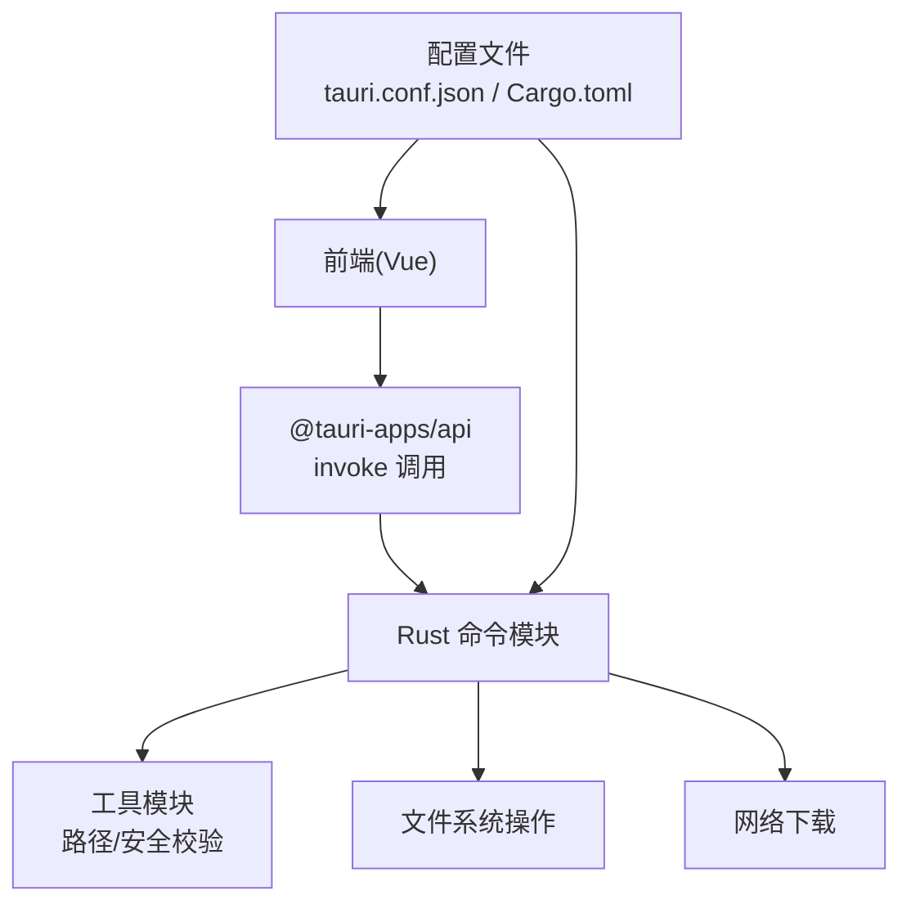
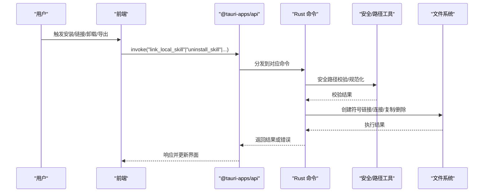
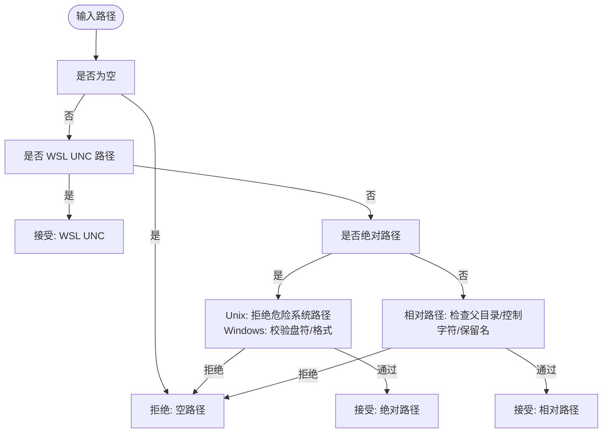
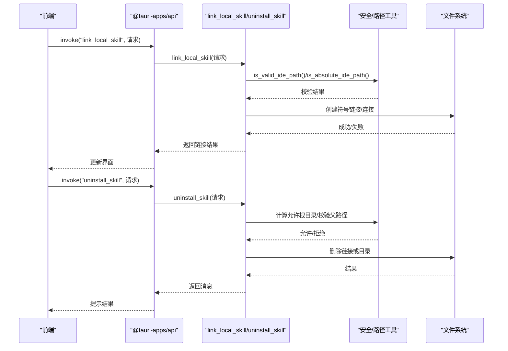
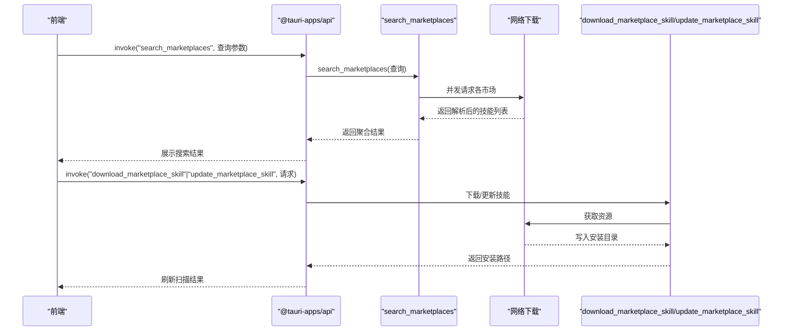
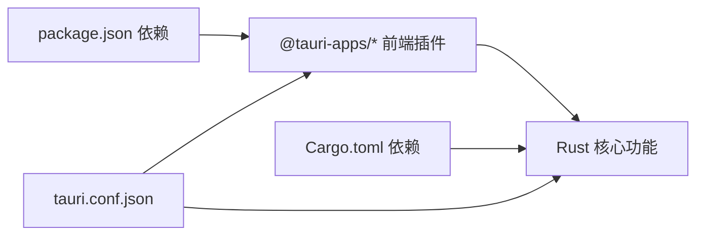

# 系统兼容性问题

<cite>
**本文引用的文件**
- [src-tauri/src/lib.rs](file://src-tauri/src/lib.rs)
- [src-tauri/src/main.rs](file://src-tauri/src/main.rs)
- [src-tauri/tauri.conf.json](file://src-tauri/tauri.conf.json)
- [src-tauri/Cargo.toml](file://src-tauri/Cargo.toml)
- [package.json](file://package.json)
- [src-tauri/src/utils/security.rs](file://src-tauri/src/utils/security.rs)
- [src-tauri/src/utils/path.rs](file://src-tauri/src/utils/path.rs)
- [src-tauri/src/commands/skills.rs](file://src-tauri/src/commands/skills.rs)
- [src-tauri/src/commands/market.rs](file://src-tauri/src/commands/market.rs)
- [src/composables/useSkillsManager.ts](file://src/composables/useSkillsManager.ts)
- [src/composables/utils.ts](file://src/composables/utils.ts)
- [src/composables/constants.ts](file://src/composables/constants.ts)
- [scripts/release.js](file://scripts/release.js)
- [src-tauri/capabilities/desktop.json](file://src-tauri/capabilities/desktop.json)
</cite>

## 目录
1. [简介](#简介)
2. [项目结构](#项目结构)
3. [核心组件](#核心组件)
4. [架构总览](#架构总览)
5. [详细组件分析](#详细组件分析)
6. [依赖关系分析](#依赖关系分析)
7. [性能考量](#性能考量)
8. [故障排除指南](#故障排除指南)
9. [结论](#结论)
10. [附录](#附录)

## 简介
本指南聚焦 Skills Manager 在多操作系统与运行环境中的兼容性问题，涵盖 Windows、macOS、Linux 的路径与权限差异、WSL 环境的特殊处理、文件系统类型与安全软件冲突的影响，并提供针对企业环境（组策略与安全策略）的应对建议。文档基于仓库中实际实现进行分析，结合前端调用与后端命令处理流程，给出可操作的诊断步骤与修复方案。

## 项目结构
应用采用 Tauri + Vue 前后端分离架构：前端通过 @tauri-apps/api 调用后端命令；后端 Rust 模块负责路径校验、符号链接/连接创建、下载与导出等核心逻辑；配置文件控制打包目标、插件与安全策略。

图表来源
- [src-tauri/src/lib.rs:20-52](file://src-tauri/src/lib.rs#L20-L52)
- [src-tauri/src/main.rs:1-7](file://src-tauri/src/main.rs#L1-L7)
- [src-tauri/tauri.conf.json:1-45](file://src-tauri/tauri.conf.json#L1-L45)
- [src-tauri/Cargo.toml:1-36](file://src-tauri/Cargo.toml#L1-L36)

章节来源
- [src-tauri/src/lib.rs:1-54](file://src-tauri/src/lib.rs#L1-L54)
- [src-tauri/src/main.rs:1-7](file://src-tauri/src/main.rs#L1-L7)
- [src-tauri/tauri.conf.json:1-45](file://src-tauri/tauri.conf.json#L1-L45)
- [src-tauri/Cargo.toml:1-36](file://src-tauri/Cargo.toml#L1-L36)
- [package.json:1-30](file://package.json#L1-L30)

## 核心组件
- 前端调用层：通过 invoke 调用后端命令，如搜索市场、下载/更新技能、扫描本地、链接/卸载/导入/导出等。
- Rust 命令层：实现具体业务逻辑，包含路径安全校验、符号链接/连接创建、下载与导出、IDE 目录扫描等。
- 工具层：提供路径规范化、安全路径判断、WSL 路径识别、Windows 非法名称处理等。
- 配置层：定义打包目标、插件启用、安全策略（CSP）、能力范围等。

章节来源
- [src/composables/useSkillsManager.ts:1-867](file://src/composables/useSkillsManager.ts#L1-L867)
- [src-tauri/src/commands/skills.rs:1-847](file://src-tauri/src/commands/skills.rs#L1-L847)
- [src-tauri/src/commands/market.rs:1-442](file://src-tauri/src/commands/market.rs#L1-L442)
- [src-tauri/src/utils/security.rs:1-92](file://src-tauri/src/utils/security.rs#L1-L92)
- [src-tauri/src/utils/path.rs:1-90](file://src-tauri/src/utils/path.rs#L1-L90)
- [src-tauri/tauri.conf.json:20-31](file://src-tauri/tauri.conf.json#L20-L31)

## 架构总览
下图展示从用户触发到后端执行的关键交互路径，覆盖路径校验、链接创建、下载与导出等。

图表来源
- [src/composables/useSkillsManager.ts:376-498](file://src/composables/useSkillsManager.ts#L376-L498)
- [src-tauri/src/commands/skills.rs:355-449](file://src-tauri/src/commands/skills.rs#L355-L449)
- [src-tauri/src/utils/security.rs:63-70](file://src-tauri/src/utils/security.rs#L63-L70)
- [src-tauri/src/utils/path.rs:21-34](file://src-tauri/src/utils/path.rs#L21-L34)

## 详细组件分析

### 路径安全与跨平台兼容
- 相对路径与绝对路径校验：前端与后端均提供路径合法性检查，防止越界与危险路径。
- WSL UNC 路径支持：识别并允许 \\wsl$ 与 \\wsl.localhost 开头的路径。
- Windows 非法名称与保留名处理：对 CON、PRN、AUX、NUL 及 COMx/LPTx 等进行检测与规避。
- 跨平台链接创建：Unix 使用符号链接，Windows 先尝试符号链接，失败则回退到目录连接（junction）。

图表来源
- [src/composables/utils.ts:34-99](file://src/composables/utils.ts#L34-L99)
- [src-tauri/src/utils/security.rs:3-65](file://src-tauri/src/utils/security.rs#L3-L65)
- [src-tauri/src/utils/path.rs:36-59](file://src-tauri/src/utils/path.rs#L36-L59)

章节来源
- [src/composables/utils.ts:1-125](file://src/composables/utils.ts#L1-L125)
- [src-tauri/src/utils/security.rs:1-92](file://src-tauri/src/utils/security.rs#L1-L92)
- [src-tauri/src/utils/path.rs:1-90](file://src-tauri/src/utils/path.rs#L1-L90)

### 链接与卸载流程
- 链接流程：校验目标与源路径安全，规范化并确保在允许范围内，随后尝试符号链接，Windows 下回退至连接。
- 卸载流程：限定允许根目录集合（含 IDE 目录与项目目录），校验目标父路径是否在允许范围内，再删除链接或目录。

图表来源
- [src/composables/useSkillsManager.ts:376-498](file://src/composables/useSkillsManager.ts#L376-L498)
- [src-tauri/src/commands/skills.rs:355-449](file://src-tauri/src/commands/skills.rs#L355-L449)
- [src-tauri/src/commands/skills.rs:537-609](file://src-tauri/src/commands/skills.rs#L537-L609)

章节来源
- [src/composables/useSkillsManager.ts:376-498](file://src/composables/useSkillsManager.ts#L376-L498)
- [src-tauri/src/commands/skills.rs:355-449](file://src-tauri/src/commands/skills.rs#L355-L449)
- [src-tauri/src/commands/skills.rs:537-609](file://src-tauri/src/commands/skills.rs#L537-L609)

### 下载与更新流程
- 市场搜索：并发调用多个市场接口，聚合结果并返回状态。
- 下载/更新：根据源 URL 与安装目录，异步下载并写入目标位置。

图表来源
- [src/composables/useSkillsManager.ts:190-248](file://src/composables/useSkillsManager.ts#L190-L248)
- [src-tauri/src/commands/market.rs:173-392](file://src-tauri/src/commands/market.rs#L173-L392)
- [src-tauri/src/commands/market.rs:394-441](file://src-tauri/src/commands/market.rs#L394-L441)

章节来源
- [src/composables/useSkillsManager.ts:190-248](file://src/composables/useSkillsManager.ts#L190-L248)
- [src-tauri/src/commands/market.rs:173-392](file://src-tauri/src/commands/market.rs#L173-L392)
- [src-tauri/src/commands/market.rs:394-441](file://src-tauri/src/commands/market.rs#L394-L441)

### 导入/导出与 IDE 适配
- 导入：校验源目录包含 SKILL.md，规范化名称后复制到管理目录。
- 导出：校验目标路径安全，不允许导出到被选技能目录内部，使用 ZIP 压缩。
- IDE 目录映射：默认提供 VSCode、Cursor、Claude 等 IDE 的全局与项目级目录映射。

章节来源
- [src-tauri/src/commands/skills.rs:611-637](file://src-tauri/src/commands/skills.rs#L611-L637)
- [src-tauri/src/commands/skills.rs:760-800](file://src-tauri/src/commands/skills.rs#L760-L800)
- [src/composables/constants.ts:5-72](file://src/composables/constants.ts#L5-L72)

## 依赖关系分析
- 前端依赖：@tauri-apps/api、@tauri-apps/plugin-* 插件用于对话框、打开器、进程与更新器。
- 后端依赖：tauri、serde、ureq、walkdir、zip、dirs、tauri-plugin-* 等。
- 配置：tauri.conf.json 控制窗口、安全策略（CSP）、更新器公钥与打包图标；Cargo.toml 控制目标平台与插件启用。

图表来源
- [package.json:13-28](file://package.json#L13-L28)
- [src-tauri/Cargo.toml:20-35](file://src-tauri/Cargo.toml#L20-L35)
- [src-tauri/tauri.conf.json:1-45](file://src-tauri/tauri.conf.json#L1-L45)

章节来源
- [package.json:1-30](file://package.json#L1-L30)
- [src-tauri/Cargo.toml:1-36](file://src-tauri/Cargo.toml#L1-L36)
- [src-tauri/tauri.conf.json:1-45](file://src-tauri/tauri.conf.json#L1-L45)

## 性能考量
- 搜索缓存：前端对搜索结果设置 10 分钟 TTL，减少重复请求。
- 异步下载：市场搜索与下载使用异步运行时，避免阻塞 UI。
- 批量操作：卸载与采用等批量处理时，逐项记录成功/失败数量，提升可观测性。

章节来源
- [src/composables/useSkillsManager.ts:23-27](file://src/composables/useSkillsManager.ts#L23-L27)
- [src/composables/useSkillsManager.ts:761-793](file://src/composables/useSkillsManager.ts#L761-L793)
- [src-tauri/src/commands/market.rs:173-392](file://src-tauri/src/commands/market.rs#L173-L392)

## 故障排除指南

### 通用兼容性问题定位
- 路径相关错误
  - 症状：提示“无效 IDE 目录”“目标目录超出家目录范围”“拒绝导出到技能目录内”等。
  - 排查要点：确认路径是否为相对路径且不包含父目录、控制字符或 Windows 保留名；绝对路径是否为 WSL UNC 或合法系统路径；导出路径是否位于被选技能目录内部。
  - 处理建议：使用前端提供的 isSafeRelativePath/isSafeAbsolutePath 校验；在 Windows 上避免使用保留名；导出路径选择非技能目录的外部位置。

- 权限相关错误
  - 症状：创建链接/连接失败、删除失败、写入受限。
  - 排查要点：确认当前用户对目标目录具有读写权限；在 macOS/Linux 上检查 SELinux/AppArmor 策略；在 Windows 上检查文件/目录属性与继承权限。
  - 处理建议：以管理员身份运行或调整目录权限；在企业环境中联系 IT 确认策略限制。

- 网络与市场访问异常
  - 症状：搜索无结果或报错，市场状态显示 Error。
  - 排查要点：检查代理/防火墙设置；确认网络可达性；查看市场返回的错误信息。
  - 处理建议：配置系统代理；更换网络环境；检查市场密钥（SkillsMP）配置。

章节来源
- [src/composables/utils.ts:34-99](file://src/composables/utils.ts#L34-L99)
- [src-tauri/src/utils/security.rs:32-65](file://src-tauri/src/utils/security.rs#L32-L65)
- [src-tauri/src/commands/skills.rs:234-250](file://src-tauri/src/commands/skills.rs#L234-L250)
- [src-tauri/src/commands/market.rs:234-243](file://src-tauri/src/commands/market.rs#L234-L243)

### Windows 特定问题
- 文件名与路径
  - 症状：创建目录/文件失败，提示非法字符或保留名。
  - 排查要点：检查是否包含 CON、PRN、AUX、NUL 或 COMx/LPTx；路径中是否包含 Windows 非法字符。
  - 处理建议：自动规范化名称（前缀下划线规避保留名）；避免使用非法字符。

- 符号链接与连接
  - 症状：符号链接失败，回退到连接仍失败。
  - 排查要点：确认已启用开发者模式或具备相应权限；路径中是否包含危险字符。
  - 处理建议：以管理员身份运行；移除路径中的危险字符；若仍失败，考虑直接复制而非链接。

- 文件系统类型
  - 症状：NTFS 与某些网络驱动器行为差异导致链接/权限异常。
  - 排查要点：确认目标位于本地 NTFS 分区；避免在只读或压缩卷上创建链接。
  - 处理建议：将技能存储迁移至本地 NTFS 分区；关闭压缩/加密属性。

章节来源
- [src-tauri/src/utils/path.rs:36-83](file://src-tauri/src/utils/path.rs#L36-L83)
- [src-tauri/src/commands/skills.rs:420-430](file://src-tauri/src/commands/skills.rs#L420-L430)
- [src-tauri/src/commands/skills.rs:311-353](file://src-tauri/src/commands/skills.rs#L311-L353)

### macOS 特定问题
- 符号链接与沙盒
  - 症状：链接创建失败或被系统阻止。
  - 排查要点：确认未处于严格沙盒限制；检查 Gatekeeper 与安全策略。
  - 处理建议：以管理员权限运行；解除或调整安全策略；必要时临时禁用限制进行验证。

- 权限与目录
  - 症状：Home 目录外路径不可写。
  - 排查要点：确认目标路径在用户主目录范围内；检查目录所有者与权限。
  - 处理建议：将技能放置于 ~/.skills-manager/skills；修正目录权限。

章节来源
- [src-tauri/src/commands/skills.rs:376-395](file://src-tauri/src/commands/skills.rs#L376-L395)
- [src-tauri/src/utils/security.rs:48-57](file://src-tauri/src/utils/security.rs#L48-L57)

### Linux 特定问题
- 权限与 SELinux/AppArmor
  - 症状：链接/写入被策略阻止。
  - 排查要点：检查 SELinux/AppArmor 日志；确认策略允许符号链接与目录操作。
  - 处理建议：调整策略规则；以允许模式运行进行验证；联系系统管理员。

- 文件系统类型
  - 症状：某些文件系统不支持符号链接或权限模型差异。
  - 排查要点：确认目标位于支持符号链接的文件系统；避免在 FUSE/网络挂载上创建链接。
  - 处理建议：迁移到本地 ext4/xfs；避免使用网络文件系统作为技能根目录。

章节来源
- [src-tauri/src/commands/skills.rs:209-217](file://src-tauri/src/commands/skills.rs#L209-L217)

### WSL 环境问题
- 路径识别
  - 症状：WSL UNC 路径被拒绝或解析异常。
  - 排查要点：确认路径以 \\wsl$ 或 \\wsl.localhost 开头；区分 WSL1/WSL2 行为差异。
  - 处理建议：使用支持的 UNC 路径；避免混合使用 Windows 与 WSL 路径；必要时转换为类 Unix 路径。

- 权限与挂载
  - 症状：WSL 分发盘权限不足或网络挂载不稳定。
  - 排查要点：确认分发盘权限；检查网络驱动器连通性。
  - 处理建议：在 Windows 主机上调整权限；使用稳定网络驱动器；避免在临时挂载上存放技能。

章节来源
- [src-tauri/src/utils/security.rs:21-26](file://src-tauri/src/utils/security.rs#L21-L26)
- [src-tauri/src/utils/security.rs:32-41](file://src-tauri/src/utils/security.rs#L32-L41)
- [src-tauri/src/utils/path.rs:4-14](file://src-tauri/src/utils/path.rs#L4-L14)

### 安全软件与防病毒拦截
- 症状：下载/解压/写入被拦截，弹窗警告或任务失败。
- 排查要点：检查实时防护日志；确认白名单设置；查看是否误报。
- 处理建议：将应用与技能目录加入信任区域；调整扫描策略；必要时临时禁用防护进行验证。

章节来源
- [src-tauri/tauri.conf.json:20-31](file://src-tauri/tauri.conf.json#L20-L31)

### 企业环境与组策略
- 组策略限制
  - 症状：无法创建符号链接、修改系统路径、访问网络市场。
  - 排查要点：检查本地组策略与域策略；确认是否启用了脚本/链接限制。
  - 处理建议：申请例外或权限；联系 IT 政策部门；使用受支持的替代路径。

- 安全策略影响
  - 症状：网络访问受限、证书校验失败、更新器无法工作。
  - 排查要点：检查企业代理与 CA 证书；确认更新器公钥与签名链。
  - 处理建议：配置代理；导入企业 CA；验证签名公钥；必要时离线安装。

章节来源
- [src-tauri/tauri.conf.json:24-31](file://src-tauri/tauri.conf.json#L24-L31)
- [src-tauri/Cargo.toml:33-35](file://src-tauri/Cargo.toml#L33-L35)

### 打包与平台兼容性
- 平台与架构
  - 症状：不同平台/架构运行异常或缺失依赖。
  - 排查要点：确认打包目标与宿主架构匹配；检查依赖库版本。
  - 处理建议：使用 scripts/release.js 推断平台与架构；统一构建环境；交叉编译测试。

- 能力范围
  - 症状：更新器或桌面能力在特定平台不可用。
  - 排查要点：检查 capabilities/desktop.json 中平台支持与权限声明。
  - 处理建议：按需启用/禁用插件；在目标平台验证能力可用性。

章节来源
- [scripts/release.js:87-125](file://scripts/release.js#L87-L125)
- [src-tauri/capabilities/desktop.json:1-14](file://src-tauri/capabilities/desktop.json#L1-L14)

## 结论
Skills Manager 在多平台与复杂运行环境下提供了完善的路径安全校验、跨平台链接创建与网络下载机制。通过遵循本文的故障排除步骤，可有效定位并解决操作系统差异、文件系统类型、安全软件拦截及企业策略限制带来的兼容性问题。建议在生产环境中结合自动化测试与日志监控，持续验证不同平台与场景下的稳定性。

## 附录
- 常用排查清单
  - 路径合法性：使用 isSafeRelativePath/isSafeAbsolutePath 校验；避免保留名与非法字符。
  - 权限检查：确认用户对目标目录有读写权限；在 macOS/Linux 上检查 SELinux/AppArmor。
  - 网络连通：检查代理/防火墙；验证市场密钥与证书链。
  - WSL 环境：使用正确的 UNC 路径；避免在不稳定挂载上创建链接。
  - 企业策略：与 IT 部门协作，申请必要的例外与权限。