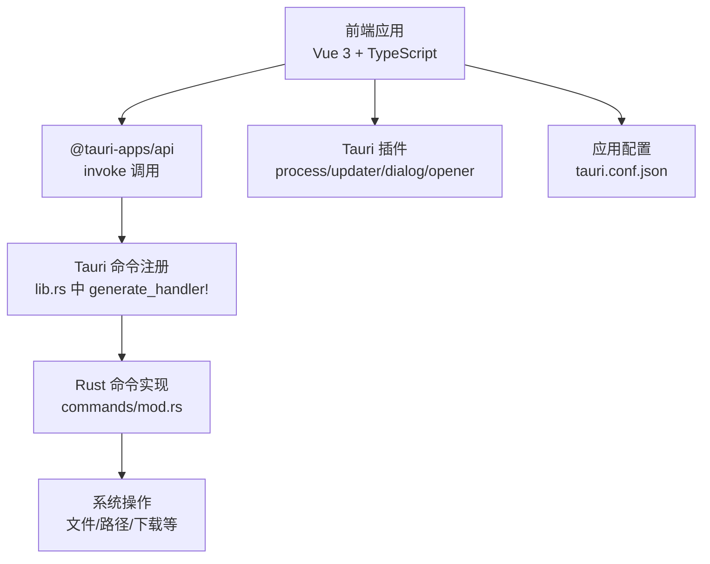
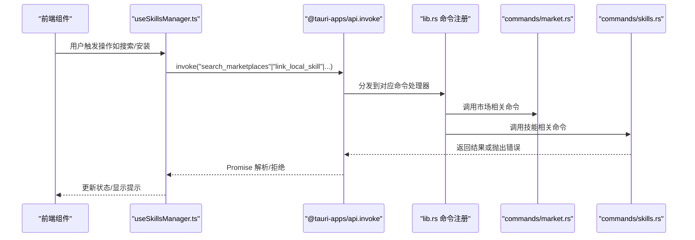
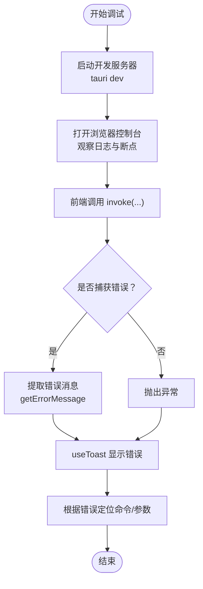
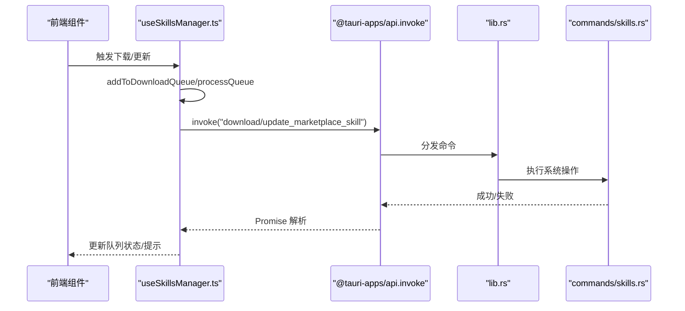
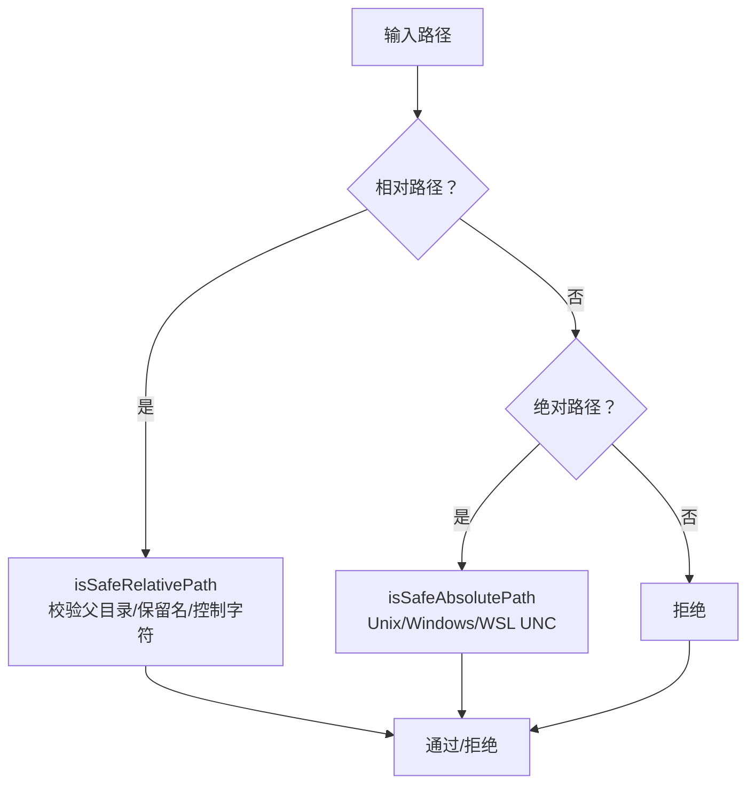
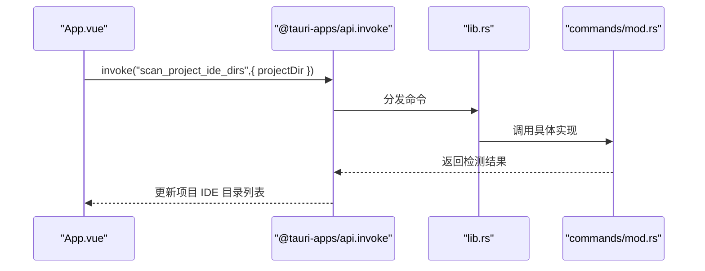
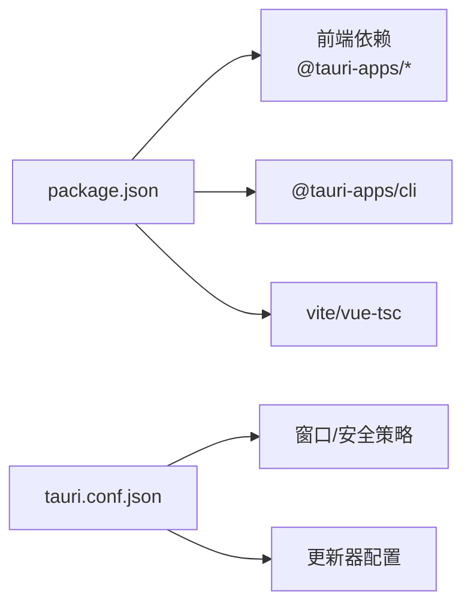

# 调试工具和日志分析

<cite>
**本文引用的文件**
- [README.md](file://README.md)
- [package.json](file://package.json)
- [src/main.ts](file://src/main.ts)
- [src-tauri/src/main.rs](file://src-tauri/src/main.rs)
- [src-tauri/tauri.conf.json](file://src-tauri/tauri.conf.json)
- [src-tauri/src/lib.rs](file://src-tauri/src/lib.rs)
- [src-tauri/src/commands/mod.rs](file://src-tauri/src/commands/mod.rs)
- [src/composables/useSkillsManager.ts](file://src/composables/useSkillsManager.ts)
- [src/composables/utils.ts](file://src/composables/utils.ts)
- [src/composables/useToast.ts](file://src/composables/useToast.ts)
- [src/App.vue](file://src/App.vue)
</cite>

## 目录
1. [简介](#简介)
2. [项目结构](#项目结构)
3. [核心组件](#核心组件)
4. [架构总览](#架构总览)
5. [详细组件分析](#详细组件分析)
6. [依赖分析](#依赖分析)
7. [性能考虑](#性能考虑)
8. [故障排查指南](#故障排查指南)
9. [结论](#结论)
10. [附录](#附录)

## 简介
本指南面向开发者与高级用户，提供 Skills Manager 的专业调试工具使用方法与日志分析策略。内容覆盖：
- 内置调试能力的启用与使用（开发模式、控制台输出）
- 系统日志收集（前端、后端、操作系统层）
- 错误追踪与分析技巧（调用链、错误消息提取、状态码与异常类型）
- 命令行调试工具与开发者工具窗口的使用
- 网络请求监控与常见错误日志解读
- 问题定位流程与最佳实践

## 项目结构
项目采用 Tauri 2 + Vue 3 + TypeScript 的桌面应用架构，前端通过 @tauri-apps/api 与 Rust 后端进行原生命令交互。关键目录与职责如下：
- src：Vue 前端应用入口与组件逻辑
- src-tauri：Rust 后端（Tauri 命令与插件）
- package.json：前端依赖与脚本（含 tauri dev/build）
- tauri.conf.json：应用配置（窗口、安全策略、更新器等）

图表来源
- [src/main.ts:1-7](file://src/main.ts#L1-L7)
- [src-tauri/src/lib.rs:20-39](file://src-tauri/src/lib.rs#L20-L39)
- [src-tauri/src/commands/mod.rs:1-3](file://src-tauri/src/commands/mod.rs#L1-L3)
- [package.json:13-28](file://package.json#L13-L28)
- [src-tauri/tauri.conf.json:12-31](file://src-tauri/tauri.conf.json#L12-L31)

章节来源
- [README.md:67-86](file://README.md#L67-L86)
- [package.json:6-11](file://package.json#L6-L11)
- [src-tauri/tauri.conf.json:1-45](file://src-tauri/tauri.conf.json#L1-L45)

## 核心组件
- 前端调用与状态管理：useSkillsManager.ts 封装市场搜索、本地扫描、安装/卸载、导入导出等业务流程，并通过 invoke 调用后端命令。
- 工具函数：utils.ts 提供路径校验、错误消息提取、名称规范化等通用能力。
- 通知系统：useToast.ts 统一展示成功/错误/信息提示，便于问题反馈与日志关联。
- 应用入口与插件：main.ts 引入国际化与样式；lib.rs 注册命令与插件；main.rs 控制台行为。

章节来源
- [src/composables/useSkillsManager.ts:190-330](file://src/composables/useSkillsManager.ts#L190-L330)
- [src/composables/utils.ts:104-112](file://src/composables/utils.ts#L104-L112)
- [src/composables/useToast.ts:14-54](file://src/composables/useToast.ts#L14-L54)
- [src/main.ts:1-7](file://src/main.ts#L1-L7)
- [src-tauri/src/lib.rs:20-39](file://src-tauri/src/lib.rs#L20-L39)
- [src-tauri/src/main.rs:1-7](file://src-tauri/src/main.rs#L1-L7)

## 架构总览
下图展示了前端调用后端命令的关键路径，以及插件与配置的作用范围。

图表来源
- [src/composables/useSkillsManager.ts:209-248](file://src/composables/useSkillsManager.ts#L209-L248)
- [src-tauri/src/lib.rs:27-39](file://src-tauri/src/lib.rs#L27-L39)
- [src-tauri/src/commands/mod.rs:1-3](file://src-tauri/src/commands/mod.rs#L1-L3)

## 详细组件分析

### 前端调试与日志收集
- 开发模式运行：使用本地开发脚本启动前端与 Tauri 后端，便于在浏览器控制台查看日志与断点调试。
- 错误消息提取：统一通过工具函数提取错误消息，避免未定义/空对象导致的二次异常。
- 通知系统：使用 useToast 展示操作结果，结合错误消息可快速定位失败步骤。
- 控制台输出：在关键流程中打印状态与参数，有助于复现问题。

图表来源
- [package.json:7-11](file://package.json#L7-L11)
- [src/composables/utils.ts:104-112](file://src/composables/utils.ts#L104-L112)
- [src/composables/useToast.ts:34-40](file://src/composables/useToast.ts#L34-L40)

章节来源
- [package.json:7-11](file://package.json#L7-L11)
- [src/composables/utils.ts:104-112](file://src/composables/utils.ts#L104-L112)
- [src/composables/useToast.ts:14-54](file://src/composables/useToast.ts#L14-L54)

### 命令调用与错误处理
- 搜索市场：调用 search_marketplaces，支持缓存与去重，异常时通过 toast 提示。
- 下载/更新：通过队列处理下载任务，记录状态与错误信息，支持重试。
- 安装/卸载：调用 link_local_skill/uninstall_skill，返回已链接/跳过数量，异常时汇总统计。
- 导入/导出：调用 import_local_skill/export_local_skills，对批量操作统计成功/失败数。

图表来源
- [src/composables/useSkillsManager.ts:263-342](file://src/composables/useSkillsManager.ts#L263-L342)
- [src/composables/useSkillsManager.ts:287-326](file://src/composables/useSkillsManager.ts#L287-L326)
- [src-tauri/src/lib.rs:27-39](file://src-tauri/src/lib.rs#L27-L39)

章节来源
- [src/composables/useSkillsManager.ts:190-330](file://src/composables/useSkillsManager.ts#L190-L330)

### 路径与安全校验
- 相对路径与绝对路径的安全性校验，防止越权访问与危险路径。
- Windows 保留名检测与控制字符过滤，降低文件系统异常风险。
- WSL UNC 路径识别，兼容不同平台环境。

图表来源
- [src/composables/utils.ts:34-92](file://src/composables/utils.ts#L34-L92)

章节来源
- [src/composables/utils.ts:34-92](file://src/composables/utils.ts#L34-L92)

### 项目与 IDE 目录扫描
- 项目添加时调用 scan_project_ide_dirs，检测 IDE 目录并写入项目配置。
- IDE 浏览器中扫描全局 IDE 目录，生成本地与 IDE 技能视图。

图表来源
- [src/App.vue:165-180](file://src/App.vue#L165-L180)
- [src-tauri/src/commands/mod.rs:1-3](file://src-tauri/src/commands/mod.rs#L1-L3)

章节来源
- [src/App.vue:165-180](file://src/App.vue#L165-L180)

## 依赖分析
- 前端依赖：@tauri-apps/api、@tauri-apps/plugin-* 等，用于命令调用与系统集成。
- 构建与脚本：Vite、Tauri CLI，分别负责前端构建与打包。
- 配置：tauri.conf.json 定义窗口、安全策略与更新器公钥。

图表来源
- [package.json:13-28](file://package.json#L13-L28)
- [src-tauri/tauri.conf.json:12-31](file://src-tauri/tauri.conf.json#L12-L31)

章节来源
- [package.json:13-28](file://package.json#L13-L28)
- [src-tauri/tauri.conf.json:12-31](file://src-tauri/tauri.conf.json#L12-L31)

## 性能考虑
- 前端缓存：市场搜索结果带 TTL 缓存，减少重复请求与后端压力。
- 队列化处理：下载/更新任务按队列执行，避免并发冲突与资源竞争。
- 路径校验前置：在命令执行前完成路径合法性检查，减少无效 IO。
- 批量操作统计：导入/导出/卸载等批量操作统计成功/失败数，提升可观测性。

章节来源
- [src/composables/useSkillsManager.ts:24-27](file://src/composables/useSkillsManager.ts#L24-L27)
- [src/composables/useSkillsManager.ts:278-329](file://src/composables/useSkillsManager.ts#L278-L329)
- [src/composables/utils.ts:34-92](file://src/composables/utils.ts#L34-L92)

## 故障排查指南

### 1) 启动与控制台调试
- 使用开发脚本启动应用，确保前端与后端同时运行。
- 在浏览器控制台查看日志、断点调试，关注 invoke 调用与 Promise 拒绝原因。
- 关闭附加控制台窗口时注意避免额外窗口弹出（Windows Subsystem 行为）。

章节来源
- [package.json:7-11](file://package.json#L7-L11)
- [src-tauri/src/main.rs:1-7](file://src-tauri/src/main.rs#L1-L7)

### 2) 错误消息提取与提示
- 统一使用工具函数提取错误消息，优先取 Error.message 或字符串字段。
- 若无明确消息，使用默认回退文案，结合 toast 展示，便于用户与开发者理解。

章节来源
- [src/composables/utils.ts:104-112](file://src/composables/utils.ts#L104-L112)
- [src/composables/useToast.ts:34-40](file://src/composables/useToast.ts#L34-L40)

### 3) 常见错误类型与日志解读
- 路径不合法：相对路径包含父目录、包含 Windows 保留名或控制字符；绝对路径指向系统关键目录或非标准格式。
- 权限不足：尝试访问受限目录或执行系统命令失败。
- 网络异常：市场搜索/下载超时或连接失败。
- 命令参数错误：缺少必要字段或字段类型不符。
- 并发冲突：多任务同时操作同一资源导致失败。

章节来源
- [src/composables/utils.ts:34-92](file://src/composables/utils.ts#L34-L92)
- [src/composables/useSkillsManager.ts:209-248](file://src/composables/useSkillsManager.ts#L209-L248)

### 4) 日志收集与分析技巧
- 前端：在关键函数入口/出口与异常分支打印上下文信息，结合浏览器控制台与 Network 面板查看请求详情。
- 后端：在命令实现处记录请求参数、中间结果与错误栈，便于定位 Rust 层问题。
- 系统层：在不同平台（Windows/macOS/Linux）下收集日志，关注权限、路径分隔符与符号链接行为差异。

章节来源
- [src/App.vue:177-179](file://src/App.vue#L177-L179)
- [src/composables/useSkillsManager.ts:322-326](file://src/composables/useSkillsManager.ts#L322-L326)

### 5) 网络请求监控
- 在浏览器 Network 面板中筛选 XHR/Fetch 请求，关注请求体与响应体中的错误信息。
- 对市场搜索与下载接口，记录查询参数、分页偏移与返回总数，核对数据一致性。

章节来源
- [src/composables/useSkillsManager.ts:209-248](file://src/composables/useSkillsManager.ts#L209-L248)

### 6) 问题定位流程
- 复现步骤：最小化复现场景，记录操作顺序与输入参数。
- 分层定位：先从前端日志确认调用链，再检查命令参数与返回值，最后核查系统权限与路径。
- 修复验证：修改后重新执行相同步骤，确认错误不再出现且后续流程正常。

章节来源
- [src/composables/useSkillsManager.ts:263-342](file://src/composables/useSkillsManager.ts#L263-L342)

## 结论
通过结合前端控制台调试、统一错误消息提取、命令调用链跟踪与系统日志收集，可以高效定位 Skills Manager 的各类问题。建议在开发与测试阶段持续记录关键路径的日志，并利用批量操作统计与 toast 提示增强可观测性，形成闭环的问题发现与解决流程。

## 附录

### A. 常用命令与调试入口
- 启动开发：使用本地开发脚本启动前端与 Tauri 后端。
- 构建发布：使用构建脚本生成桌面应用包。
- 配置更新：在应用配置中调整窗口大小、安全策略与更新器端点。

章节来源
- [package.json:7-11](file://package.json#L7-L11)
- [src-tauri/tauri.conf.json:6-11](file://src-tauri/tauri.conf.json#L6-L11)