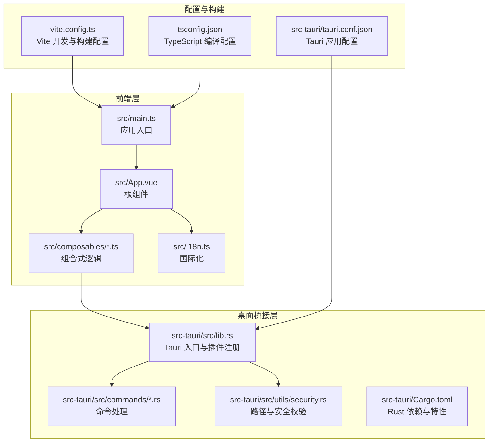
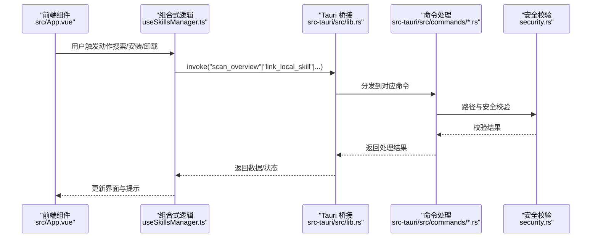
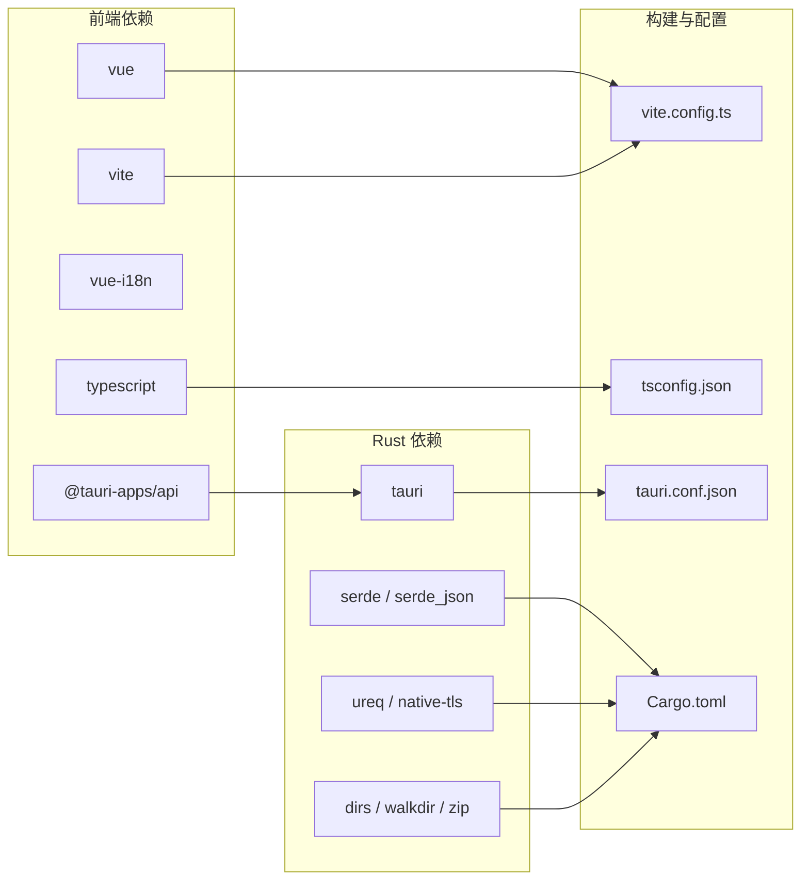

# 技术决策

<cite>
**本文引用的文件**   
- [package.json](file://package.json)
- [vite.config.ts](file://vite.config.ts)
- [tsconfig.json](file://tsconfig.json)
- [tsconfig.node.json](file://tsconfig.node.json)
- [src/main.ts](file://src/main.ts)
- [src/App.vue](file://src/App.vue)
- [src/i18n.ts](file://src/i18n.ts)
- [src/composables/useSkillsManager.ts](file://src/composables/useSkillsManager.ts)
- [src/composables/types.ts](file://src/composables/types.ts)
- [src/composables/useIdeConfig.ts](file://src/composables/useIdeConfig.ts)
- [src/composables/useToast.ts](file://src/composables/useToast.ts)
- [src-tauri/tauri.conf.json](file://src-tauri/tauri.conf.json)
- [src-tauri/Cargo.toml](file://src-tauri/Cargo.toml)
- [src-tauri/src/lib.rs](file://src-tauri/src/lib.rs)
- [src-tauri/src/utils/security.rs](file://src-tauri/src/utils/security.rs)
- [README.md](file://README.md)
- [index.html](file://index.html)
- [src/vite-env.d.ts](file://src/vite-env.d.ts)
</cite>

## 目录
1. [引言](#引言)
2. [项目结构](#项目结构)
3. [核心组件](#核心组件)
4. [架构总览](#架构总览)
5. [详细组件分析](#详细组件分析)
6. [依赖关系分析](#依赖关系分析)
7. [性能考量](#性能考量)
8. [故障排查指南](#故障排查指南)
9. [结论](#结论)
10. [附录：技术选型决策矩阵与评估标准](#附录技术选型决策矩阵与评估标准)

## 引言
本文件系统化梳理 Skills Manager 的技术决策，围绕桌面运行时（Tauri 2）、前端框架（Vue 3 组合式 API）、后端语言（Rust）、构建工具（Vite）与类型系统（TypeScript）展开，解释各技术选型的原因、权衡与影响，并给出版本兼容性、第三方库选择标准与替代方案对比，辅以可视化图示帮助读者快速把握架构基础。

## 项目结构
项目采用“前端 + 桌面桥接层（Rust）”的双层架构：
- 前端层：Vue 3 + TypeScript + Vite，负责 UI、状态管理与用户交互。
- 桌面桥接层：Rust + Tauri 2，负责系统调用、文件操作、网络请求与安全校验。
- 配置与构建：Vite 提供开发服务器与打包；Tauri 配置定义窗口、安全策略与插件；Cargo 管理 Rust 依赖。

**图表来源**
- [src/main.ts:1-7](file://src/main.ts#L1-L7)
- [src/App.vue:1-633](file://src/App.vue#L1-L633)
- [src/composables/useSkillsManager.ts:1-800](file://src/composables/useSkillsManager.ts#L1-L800)
- [src-tauri/src/lib.rs:1-54](file://src-tauri/src/lib.rs#L1-L54)
- [src-tauri/src/utils/security.rs:1-92](file://src-tauri/src/utils/security.rs#L1-L92)
- [vite.config.ts:1-33](file://vite.config.ts#L1-L33)
- [tsconfig.json:1-26](file://tsconfig.json#L1-L26)
- [src-tauri/tauri.conf.json:1-45](file://src-tauri/tauri.conf.json#L1-L45)

**章节来源**
- [README.md:95-100](file://README.md#L95-L100)
- [package.json:1-30](file://package.json#L1-L30)
- [vite.config.ts:1-33](file://vite.config.ts#L1-L33)
- [tsconfig.json:1-26](file://tsconfig.json#L1-L26)
- [src-tauri/tauri.conf.json:1-45](file://src-tauri/tauri.conf.json#L1-L45)

## 核心组件
- 前端应用入口与挂载：应用在入口文件中创建 Vue 实例并挂载到 DOM，同时初始化国际化。
- 根组件与状态：根组件集中管理主题、语言、标签页切换、全局模态框与加载状态，并通过组合式函数注入业务能力。
- 组合式逻辑：useSkillsManager 封装市场搜索、下载队列、本地扫描、安装卸载等核心流程；useIdeConfig 管理 IDE 配置与持久化；useToast 提供全局提示。
- 国际化：基于 vue-i18n，支持中英双语。
- 桌面桥接：Tauri 注册命令处理器，暴露系统能力给前端；Rust 层执行安全校验与文件操作。

**章节来源**
- [src/main.ts:1-7](file://src/main.ts#L1-L7)
- [src/App.vue:1-633](file://src/App.vue#L1-L633)
- [src/composables/useSkillsManager.ts:1-800](file://src/composables/useSkillsManager.ts#L1-L800)
- [src/composables/useIdeConfig.ts:1-47](file://src/composables/useIdeConfig.ts#L1-L47)
- [src/composables/useToast.ts:1-54](file://src/composables/useToast.ts#L1-L54)
- [src/i18n.ts:1-17](file://src/i18n.ts#L1-L17)

## 架构总览
前端通过 Tauri 的 invoke 通道调用 Rust 命令，Rust 执行系统级操作（如扫描、链接、导出、卸载），并在必要时进行路径与安全校验。应用配置文件定义窗口尺寸、安全策略与插件启用情况。

**图表来源**
- [src/App.vue:165-200](file://src/App.vue#L165-L200)
- [src/composables/useSkillsManager.ts:353-374](file://src/composables/useSkillsManager.ts#L353-L374)
- [src-tauri/src/lib.rs:20-53](file://src-tauri/src/lib.rs#L20-L53)
- [src-tauri/src/utils/security.rs:1-92](file://src-tauri/src/utils/security.rs#L1-L92)

**章节来源**
- [src-tauri/tauri.conf.json:1-45](file://src-tauri/tauri.conf.json#L1-L45)
- [src-tauri/src/lib.rs:1-54](file://src-tauri/src/lib.rs#L1-L54)

## 详细组件分析

### Tauri 2：桌面运行时选择
- 选择原因
  - 更小的应用体积与更快的启动速度：相比 Electron，Tauri 使用系统 Webview，减少运行时开销。
  - 更强的安全边界：通过权限模型与能力配置限制前端可访问的系统能力。
  - 更好的跨平台一致性：统一的窗口、菜单、托盘与更新机制。
- 权衡考虑
  - 生态差异：部分 Electron 插件不可直接复用，需使用 Tauri 插件或自研命令。
  - 平台差异：不同平台的 WebView 行为略有差异，需要在配置与测试中覆盖。
- 版本与特性
  - 使用 Tauri 2，启用进程、对话框、打开器、更新器等插件；在桌面平台启用单实例聚焦。
  - CSP 严格控制脚本与资源加载，提升安全性。
- 替代方案对比
  - Electron：生态成熟、社区丰富，但体积与内存占用更高。
  - WebView/原生：更贴近系统，但开发与分发复杂度高。

**章节来源**
- [src-tauri/tauri.conf.json:12-31](file://src-tauri/tauri.conf.json#L12-L31)
- [src-tauri/src/lib.rs:20-53](file://src-tauri/src/lib.rs#L20-L53)
- [README.md:97-98](file://README.md#L97-L98)

### Vue 3 组合式 API：前端状态与逻辑组织
- 选择原因
  - 更清晰的逻辑复用：通过组合式函数（composables）封装状态与副作用，便于测试与维护。
  - 更好的类型推断：配合 TypeScript，提供更强的编译期安全保障。
  - 更佳的开发体验：响应式组合、生命周期钩子与模板语法结合，降低心智负担。
- 权衡考虑
  - 学习曲线：从选项式 API 迁移需要时间与规范约束。
  - 过度组合：滥用组合式函数可能导致模块职责不清。
- 实践要点
  - 将 UI 逻辑与业务逻辑分离，使用独立的 composables 管理市场、IDE、项目与提示。
  - 在根组件集中处理主题与语言等横切关注点。

**章节来源**
- [src/App.vue:1-633](file://src/App.vue#L1-L633)
- [src/composables/useSkillsManager.ts:1-800](file://src/composables/useSkillsManager.ts#L1-L800)
- [src/composables/useIdeConfig.ts:1-47](file://src/composables/useIdeConfig.ts#L1-L47)
- [src/composables/useToast.ts:1-54](file://src/composables/useToast.ts#L1-L54)

### Rust：系统操作与安全校验
- 选择原因
  - 安全与可靠性：在系统路径解析、文件操作与网络请求中，Rust 提供内存安全与并发安全保障。
  - 性能：零成本抽象与高效的 I/O 处理，适合批量扫描与链接任务。
  - 与 Tauri 协同：通过命令接口与类型序列化，无缝对接前端调用。
- 权衡考虑
  - 开发效率：相比 JavaScript/TypeScript，调试与迭代周期较长。
  - 生态适配：需要将常用功能映射为 Tauri 命令或插件。
- 关键实践
  - 路径安全校验：拒绝相对路径中的父目录与危险绝对路径，支持 WSL UNC 路径。
  - 命令分层：按领域拆分命令模块，保持职责单一。

**章节来源**
- [src-tauri/src/utils/security.rs:1-92](file://src-tauri/src/utils/security.rs#L1-L92)
- [src-tauri/src/lib.rs:1-54](file://src-tauri/src/lib.rs#L1-L54)
- [src-tauri/Cargo.toml:1-36](file://src-tauri/Cargo.toml#L1-L36)

### TypeScript：前端类型系统
- 作用
  - 编译期类型检查：减少运行时错误，提升重构信心。
  - 更好的 IDE 支持：智能补全、跳转与重构能力。
  - 接口契约：与 Rust 命令返回值形成稳定的数据契约。
- 配置要点
  - ESNext 模块解析、bundler 模式、严格模式与无副作用编译。
  - 与 Vite 协同，确保 .vue 文件与类型声明正确解析。

**章节来源**
- [tsconfig.json:1-26](file://tsconfig.json#L1-L26)
- [tsconfig.node.json:1-10](file://tsconfig.node.json#L1-L10)
- [src/vite-env.d.ts:1-7](file://src/vite-env.d.ts#L1-L7)

### Vite：构建与开发体验
- 优势
  - 快速冷启动与热更新：开发体验流畅，HMR 与固定端口配置提升协作效率。
  - 明确的构建链路：与 Vue 3 + TypeScript 协同良好，产物体积可控。
- 配置要点
  - 固定前端开发端口与严格端口策略，避免冲突。
  - 忽略对 src-tauri 的监听，减少不必要的文件系统压力。

**章节来源**
- [vite.config.ts:1-33](file://vite.config.ts#L1-L33)
- [index.html:1-14](file://index.html#L1-L14)

## 依赖关系分析

**图表来源**
- [package.json:13-28](file://package.json#L13-L28)
- [src-tauri/Cargo.toml:20-36](file://src-tauri/Cargo.toml#L20-L36)
- [vite.config.ts:1-33](file://vite.config.ts#L1-L33)
- [tsconfig.json:1-26](file://tsconfig.json#L1-L26)
- [src-tauri/tauri.conf.json:1-45](file://src-tauri/tauri.conf.json#L1-L45)

**章节来源**
- [package.json:1-30](file://package.json#L1-L30)
- [src-tauri/Cargo.toml:1-36](file://src-tauri/Cargo.toml#L1-L36)

## 性能考量
- 启动与体积
  - Tauri 2 相较 Electron 体积更小、启动更快，适合频繁使用的桌面工具。
- 运行时性能
  - Rust 命令层承担 I/O 密集与 CPU 密集任务，前端仅负责 UI 与调度，职责清晰。
- 开发体验
  - Vite 的快速 HMR 与固定端口配置显著提升迭代效率。
- 安全与稳定性
  - CSP 限制与路径安全校验降低运行时风险，提高长期可用性。

[本节为通用性能讨论，不直接分析具体文件]

## 故障排查指南
- 开发端口冲突
  - 现象：开发服务器无法启动。
  - 处理：确认固定端口未被占用，或调整 Vite 配置。
  - 参考：[vite.config.ts:16-18](file://vite.config.ts#L16-L18)
- 路径安全错误
  - 现象：安装/链接失败或报路径非法。
  - 处理：检查 IDE 目录配置是否为安全路径（相对路径不含父目录、绝对路径非系统关键目录、WSL UNC 路径合法）。
  - 参考：[src-tauri/src/utils/security.rs:1-92](file://src-tauri/src/utils/security.rs#L1-L92)
- 插件与命令调用异常
  - 现象：前端调用 invoke 报错或无响应。
  - 处理：确认命令已在 Tauri 入口注册，且参数类型与返回值与前端一致。
  - 参考：[src-tauri/src/lib.rs:27-39](file://src-tauri/src/lib.rs#L27-L39)
- 国际化与主题不生效
  - 现象：语言或主题切换无效。
  - 处理：检查本地存储键与默认值，确认根组件已读取并应用。
  - 参考：[src/App.vue:30-71](file://src/App.vue#L30-L71), [src/i18n.ts:1-17](file://src/i18n.ts#L1-L17)

**章节来源**
- [vite.config.ts:16-18](file://vite.config.ts#L16-L18)
- [src-tauri/src/utils/security.rs:1-92](file://src-tauri/src/utils/security.rs#L1-L92)
- [src-tauri/src/lib.rs:27-39](file://src-tauri/src/lib.rs#L27-L39)
- [src/App.vue:30-71](file://src/App.vue#L30-L71)
- [src/i18n.ts:1-17](file://src/i18n.ts#L1-L17)

## 结论
本项目通过“Tauri 2 + Vue 3 + Rust + Vite + TypeScript”的组合，在性能、安全性、开发体验与维护成本之间取得平衡。Tauri 提供轻量稳定的运行时，Vue 3 组合式 API 与 TypeScript 提升代码质量，Rust 负责系统操作与安全校验，Vite 则保障开发效率。该技术栈适合持续演进的桌面应用，具备良好的扩展性与跨平台一致性。

[本节为总结性内容，不直接分析具体文件]

## 附录：技术选型决策矩阵与评估标准

### 决策矩阵（示例维度）
- 性能：Tauri 2（低）、Electron（高）；Rust（高）、JavaScript（中）；Vite（高）、Webpack（中）。
- 安全：Tauri（高）、Electron（中）；Rust（高）、TypeScript（中）。
- 开发体验：Vue 3 组合式 API（高）、选项式 API（中）；TypeScript（高）。
- 维护成本：Tauri（中）、Electron（高）；Rust（中）、JS（低）；Vite（高）。
- 生态与迁移：Tauri 插件（中）、Electron 生态（高）；Vue 生态（高）、React 生态（高）。

### 版本兼容性与第三方库选择标准
- 版本兼容性
  - 前端：Vue 3.x、TypeScript ~5.6、Vite ~6.x；遵循 ES2020 目标与 ESNext 模块解析。
  - 桌面：Tauri 2.x、Rust 2021 edition；Cargo.toml 明确依赖与特性。
- 第三方库选择标准
  - 与主框架契合度（如 Vue 插件、Tauri 插件生态）。
  - 类型与文档质量（优先 TypeScript 化与完整文档）。
  - 社区活跃度与安全维护记录。
  - 性能与体积影响（避免引入重型依赖）。

**章节来源**
- [package.json:13-28](file://package.json#L13-L28)
- [src-tauri/Cargo.toml:1-36](file://src-tauri/Cargo.toml#L1-L36)
- [tsconfig.json:1-26](file://tsconfig.json#L1-L26)
- [vite.config.ts:1-33](file://vite.config.ts#L1-L33)