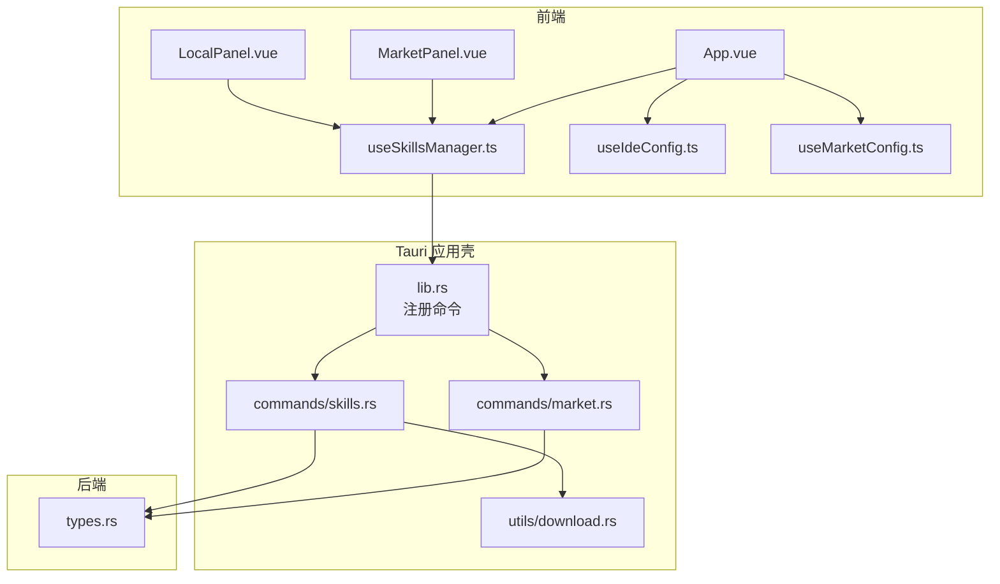
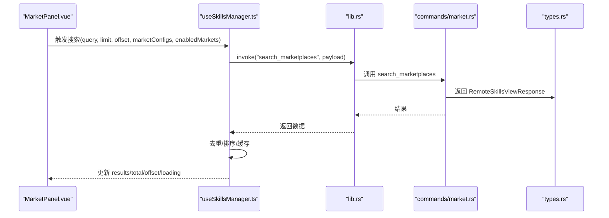
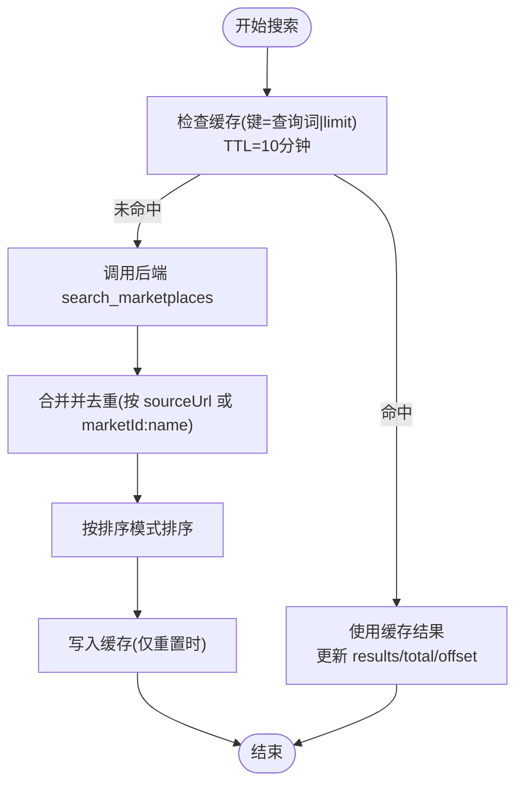
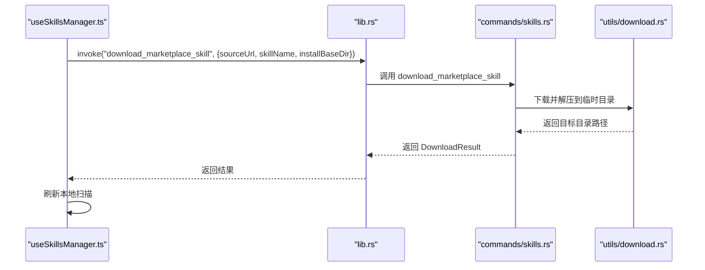
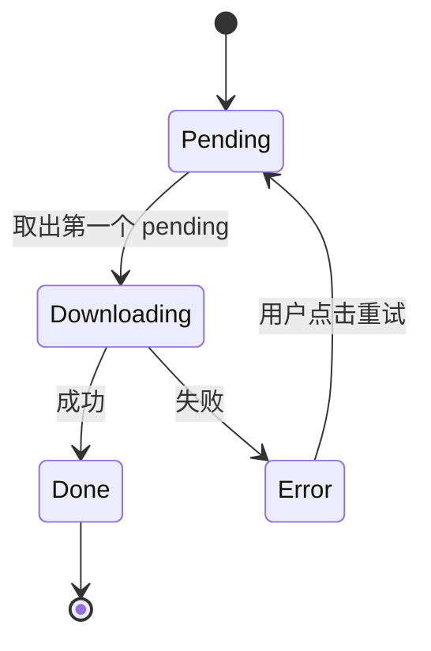
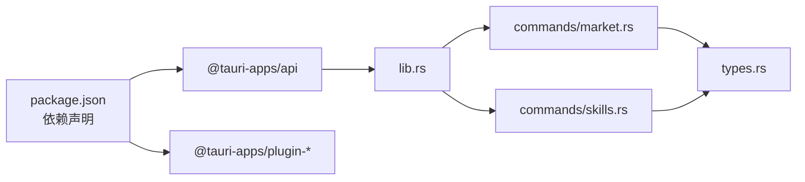

# 数据流设计

<cite>
**本文引用的文件**
- [src/composables/useSkillsManager.ts](file://src/composables/useSkillsManager.ts)
- [src/composables/useIdeConfig.ts](file://src/composables/useIdeConfig.ts)
- [src/composables/useMarketConfig.ts](file://src/composables/useMarketConfig.ts)
- [src/composables/types.ts](file://src/composables/types.ts)
- [src/composables/constants.ts](file://src/composables/constants.ts)
- [src/composables/utils.ts](file://src/composables/utils.ts)
- [src-tauri/src/lib.rs](file://src-tauri/src/lib.rs)
- [src-tauri/src/commands/market.rs](file://src-tauri/src/commands/market.rs)
- [src-tauri/src/commands/skills.rs](file://src-tauri/src/commands/skills.rs)
- [src-tauri/src/types.rs](file://src-tauri/src/types.rs)
- [src-tauri/src/utils/download.rs](file://src-tauri/src/utils/download.rs)
- [src/App.vue](file://src/App.vue)
- [src/components/MarketPanel.vue](file://src/components/MarketPanel.vue)
- [src/components/LocalPanel.vue](file://src/components/LocalPanel.vue)
- [package.json](file://package.json)
</cite>

## 目录
1. [简介](#简介)
2. [项目结构](#项目结构)
3. [核心组件](#核心组件)
4. [架构总览](#架构总览)
5. [详细组件分析](#详细组件分析)
6. [依赖关系分析](#依赖关系分析)
7. [性能考量](#性能考量)
8. [故障排查指南](#故障排查指南)
9. [结论](#结论)
10. [附录](#附录)

## 简介
本文件面向 Skills Manager 的前端与后端数据流设计，聚焦以下目标：
- 解释响应式数据绑定、状态提升与局部状态管理策略
- 描述 useSkillsManager、useIdeConfig、useMarketConfig 等 composable 的数据流设计
- 展示从前端组件到 Tauri 命令，再到 Rust 后端的数据传输过程
- 分析异步数据处理、错误处理与状态同步机制
- 提供数据缓存策略、搜索结果去重算法与下载队列管理说明
- 给出数据流图与状态转换图，帮助开发者理解复杂的数据处理逻辑

## 项目结构
该项目采用“Vue 前端 + Tauri 应用壳 + Rust 后端命令”的分层架构：
- 前端使用 Vue 3 + TypeScript，通过 @tauri-apps/api 调用后端命令
- 后端通过 Tauri 注册命令，Rust 实现具体业务逻辑
- 共享类型在前后端均定义，保证调用契约一致

图表来源
- [src/App.vue:73-124](file://src/App.vue#L73-L124)
- [src/composables/useSkillsManager.ts:20-800](file://src/composables/useSkillsManager.ts#L20-L800)
- [src/composables/useIdeConfig.ts:59-131](file://src/composables/useIdeConfig.ts#L59-L131)
- [src/composables/useMarketConfig.ts:8-67](file://src/composables/useMarketConfig.ts#L8-L67)
- [src-tauri/src/lib.rs:21-53](file://src-tauri/src/lib.rs#L21-L53)
- [src-tauri/src/commands/market.rs:173-392](file://src-tauri/src/commands/market.rs#L173-L392)
- [src-tauri/src/commands/skills.rs:355-800](file://src-tauri/src/commands/skills.rs#L355-L800)
- [src-tauri/src/utils/download.rs:50-273](file://src-tauri/src/utils/download.rs#L50-L273)

章节来源
- [src/App.vue:73-124](file://src/App.vue#L73-L124)
- [src-tauri/src/lib.rs:21-53](file://src-tauri/src/lib.rs#L21-L53)

## 核心组件
本节从数据流角度解析三个关键 composable 的职责与交互。

- useSkillsManager（全局状态与流程编排）
  - 负责市场搜索、本地扫描、安装/卸载、导入导出、下载队列等
  - 内置 10 分钟 TTL 的搜索结果缓存
  - 实现搜索结果去重与排序
  - 管理下载队列的并发与状态机
- useIdeConfig（IDE 配置与安装目标）
  - 管理 IDE 选项、自定义 IDE、最近安装目标
  - 通过 localStorage 持久化
- useMarketConfig（市场配置与状态）
  - 管理多市场 API Key、启用状态与连接状态
  - 通过 localStorage 持久化

章节来源
- [src/composables/useSkillsManager.ts:20-800](file://src/composables/useSkillsManager.ts#L20-L800)
- [src/composables/useIdeConfig.ts:59-131](file://src/composables/useIdeConfig.ts#L59-L131)
- [src/composables/useMarketConfig.ts:8-67](file://src/composables/useMarketConfig.ts#L8-L67)

## 架构总览
下图展示从前端组件到后端命令的完整数据流路径，以及关键状态同步点。

图表来源
- [src/components/MarketPanel.vue:30-39](file://src/components/MarketPanel.vue#L30-L39)
- [src/composables/useSkillsManager.ts:190-248](file://src/composables/useSkillsManager.ts#L190-L248)
- [src-tauri/src/lib.rs:27-39](file://src-tauri/src/lib.rs#L27-L39)
- [src-tauri/src/commands/market.rs:173-392](file://src-tauri/src/commands/market.rs#L173-L392)
- [src-tauri/src/types.rs:71-77](file://src-tauri/src/types.rs#L71-L77)

## 详细组件分析

### useSkillsManager 数据流设计
- 响应式数据绑定
  - 使用 ref/computed 管理查询参数、结果集、加载状态、排序模式、下载队列等
  - 通过 computed 对结果进行去重与排序
- 状态提升与局部状态
  - 将市场配置、IDE 选项等跨面板共享的状态提升至 useSkillsManager
  - 局部状态如 modal 显隐、批量操作选择集等保留在组件内
- 异步数据处理
  - 搜索：带缓存与去重；支持重置/增量加载
  - 下载：队列推进器，串行执行 pending 任务，状态机驱动
- 错误处理与状态同步
  - 统一错误消息提取与国际化提示
  - 通过 toast 与 loading/busy 状态反馈给 UI
- 数据缓存策略
  - 以查询词与 limit 为键，10 分钟 TTL 缓存
- 搜索结果去重算法
  - 优先使用 sourceUrl 去重；否则以 marketId:name 组合去重
- 下载队列管理
  - pending → downloading → done/error
  - 支持重试与移除，完成后定时清理

图表来源
- [src/composables/useSkillsManager.ts:190-248](file://src/composables/useSkillsManager.ts#L190-L248)
- [src/composables/useSkillsManager.ts:250-261](file://src/composables/useSkillsManager.ts#L250-L261)

章节来源
- [src/composables/useSkillsManager.ts:20-800](file://src/composables/useSkillsManager.ts#L20-L800)

### useIdeConfig 数据流设计
- 状态来源
  - 默认 IDE 选项来自常量；自定义 IDE 通过用户输入添加并持久化
- 行为
  - 刷新 IDE 选项列表
  - 添加/删除自定义 IDE
  - 最近安装目标持久化与读取
- 与 useSkillsManager 的协作
  - useSkillsManager 在安装前读取 IDE 选项与最近目标，构建 linkTargets

章节来源
- [src/composables/useIdeConfig.ts:59-131](file://src/composables/useIdeConfig.ts#L59-L131)
- [src/composables/constants.ts:6-30](file://src/composables/constants.ts#L6-L30)

### useMarketConfig 数据流设计
- 状态来源
  - 默认市场状态与启用开关来自常量
- 行为
  - 加载/保存市场配置与启用状态
  - 更新市场连接状态（在线/错误/需要密钥）
- 与 useSkillsManager 的协作
  - useSkillsManager 在搜索时传入 enabledMarkets 与 marketConfigs

章节来源
- [src/composables/useMarketConfig.ts:8-67](file://src/composables/useMarketConfig.ts#L8-L67)
- [src/composables/constants.ts:38-53](file://src/composables/constants.ts#L38-L53)

### 组件到命令的数据传输
- MarketPanel.vue
  - 通过事件向 useSkillsManager 传递查询、排序、搜索/刷新/加载更多、下载/更新等动作
- App.vue
  - 将 useSkillsManager 的状态与方法注入各面板组件
- 命令调用
  - 前端通过 invoke 调用后端命令，携带请求体（如 LinkRequest、DownloadRequest、LocalScanRequest 等）
  - 后端命令返回结构化结果（如 InstallResult、Overview、RemoteSkillsViewResponse）

章节来源
- [src/components/MarketPanel.vue:30-39](file://src/components/MarketPanel.vue#L30-L39)
- [src/App.vue:73-124](file://src/App.vue#L73-L124)
- [src-tauri/src/lib.rs:27-39](file://src-tauri/src/lib.rs#L27-L39)

### 后端命令与数据处理
- 市场搜索命令
  - 并发访问多个市场，聚合结果与状态
  - 使用线程池与异步运行时避免阻塞 UI
- 下载命令
  - GitHub 源自动转换为 zipball 地址
  - ZIP 安全解压与防 Zip Slip 攻击
  - 多文件大小限制与超时控制
- 本地技能管理
  - 扫描本地与 IDE 目录，识别链接与托管关系
  - 安全路径校验与符号链接处理
  - 导入/导出/删除/采用等操作的安全边界

图表来源
- [src/composables/useSkillsManager.ts:263-342](file://src/composables/useSkillsManager.ts#L263-L342)
- [src-tauri/src/commands/market.rs:394-442](file://src-tauri/src/commands/market.rs#L394-L442)
- [src-tauri/src/utils/download.rs:50-116](file://src-tauri/src/utils/download.rs#L50-L116)

章节来源
- [src-tauri/src/commands/market.rs:173-392](file://src-tauri/src/commands/market.rs#L173-L392)
- [src-tauri/src/commands/skills.rs:355-800](file://src-tauri/src/commands/skills.rs#L355-L800)
- [src-tauri/src/utils/download.rs:50-273](file://src-tauri/src/utils/download.rs#L50-L273)

### 状态转换图（下载队列）

图表来源
- [src/composables/useSkillsManager.ts:278-342](file://src/composables/useSkillsManager.ts#L278-L342)

## 依赖关系分析
- 前端依赖
  - @tauri-apps/api：调用后端命令
  - @tauri-apps/plugin-*：对话框、打开器、进程、更新器等插件
- 类型契约
  - 前后端 types.ts 与 types.rs 字段命名保持一致，确保序列化/反序列化正确
- 命令注册
  - lib.rs 中集中注册所有命令，统一入口便于维护

图表来源
- [package.json:13-28](file://package.json#L13-L28)
- [src-tauri/src/lib.rs:21-53](file://src-tauri/src/lib.rs#L21-L53)

章节来源
- [package.json:13-28](file://package.json#L13-L28)
- [src-tauri/src/lib.rs:21-53](file://src-tauri/src/lib.rs#L21-L53)

## 性能考量
- 前端
  - 搜索缓存减少网络请求与去重计算开销
  - 排序在客户端完成，建议大数据量时考虑服务端排序
  - 队列串行执行避免资源竞争
- 后端
  - 下载与解压限制最大体积与单文件大小，防止内存溢出
  - ZIP 解压严格校验路径，防止 Zip Slip
  - 异步运行时与线程池隔离 IO 密集任务

## 故障排查指南
- 搜索失败
  - 检查 useSkillsManager 的错误提示与 marketStatuses
  - 确认 enabledMarkets 与 API Key 配置
- 下载失败
  - 查看下载队列任务状态与错误信息
  - 检查 sourceUrl 是否有效，安装目录是否在允许范围
- 安装/卸载异常
  - 确认 IDE 路径安全校验通过
  - 检查链接目标是否存在冲突

章节来源
- [src/composables/useSkillsManager.ts:243-247](file://src/composables/useSkillsManager.ts#L243-L247)
- [src-tauri/src/commands/market.rs:394-442](file://src-tauri/src/commands/market.rs#L394-L442)
- [src-tauri/src/commands/skills.rs:355-800](file://src-tauri/src/commands/skills.rs#L355-L800)

## 结论
本设计通过 composable 将状态与流程抽象为可复用模块，结合 Tauri 命令实现前后端清晰分层。useSkillsManager 作为中枢协调市场搜索、本地扫描与下载队列，配合 useIdeConfig 与 useMarketConfig 提供稳定的外部配置能力。后端命令在 Rust 中实现高可靠的数据处理与安全校验，整体具备良好的扩展性与可维护性。

## 附录
- 关键类型定义参考
  - 远程技能、市场状态、安装结果、本地技能、IDE 技能、概览、IDE 选项、链接目标、下载任务、项目配置等
- 常量与默认值
  - 默认 IDE 选项、存储键名、缓存 TTL、默认市场状态与启用开关、项目 IDE 目录映射

章节来源
- [src/composables/types.ts:1-119](file://src/composables/types.ts#L1-L119)
- [src/composables/constants.ts:1-72](file://src/composables/constants.ts#L1-L72)