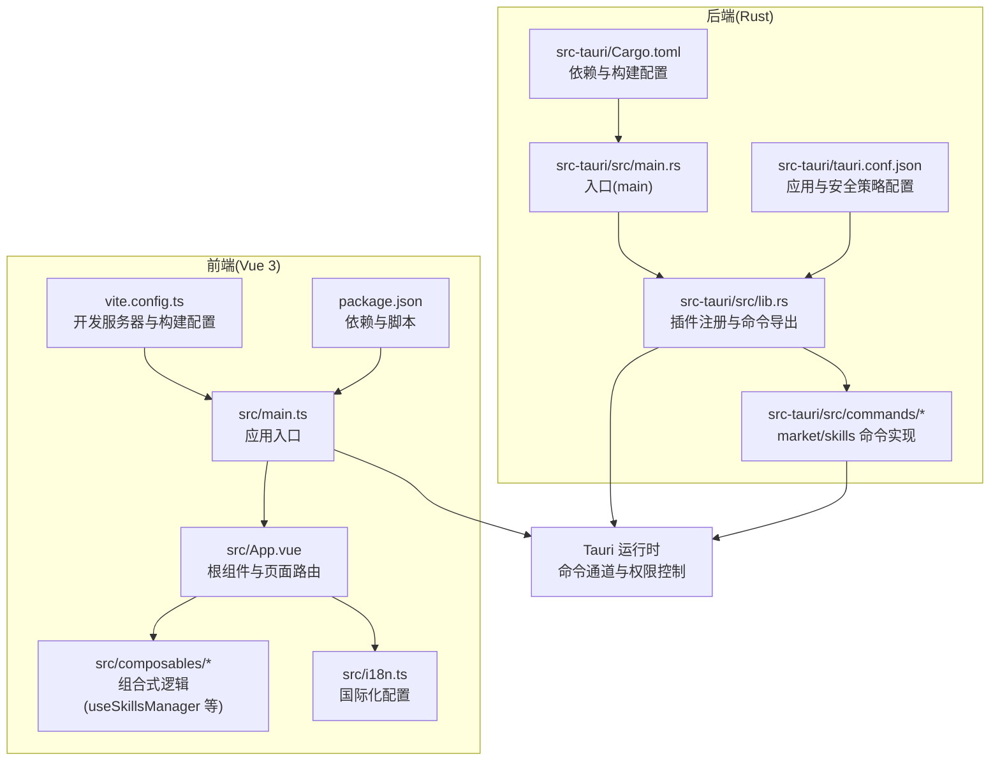
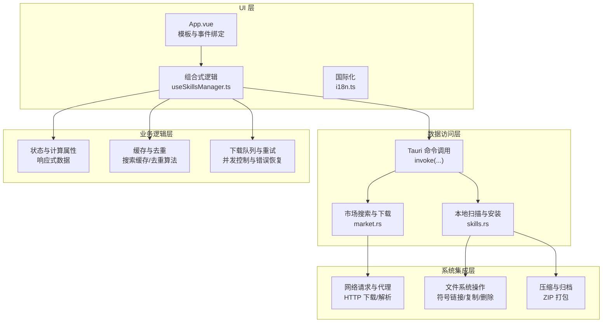
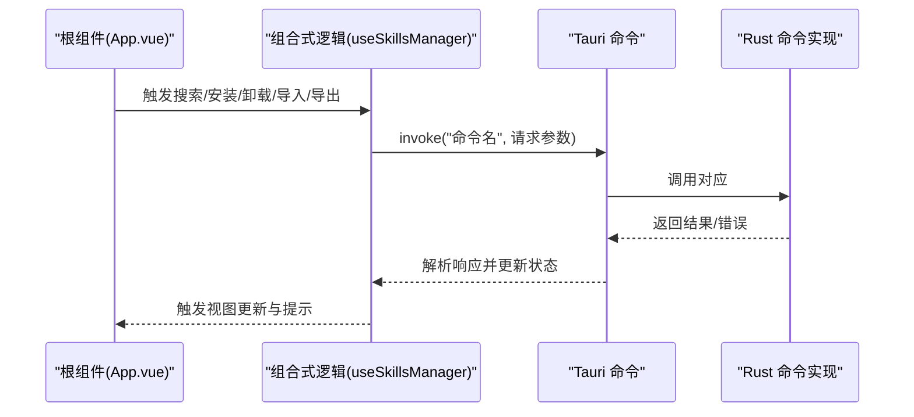
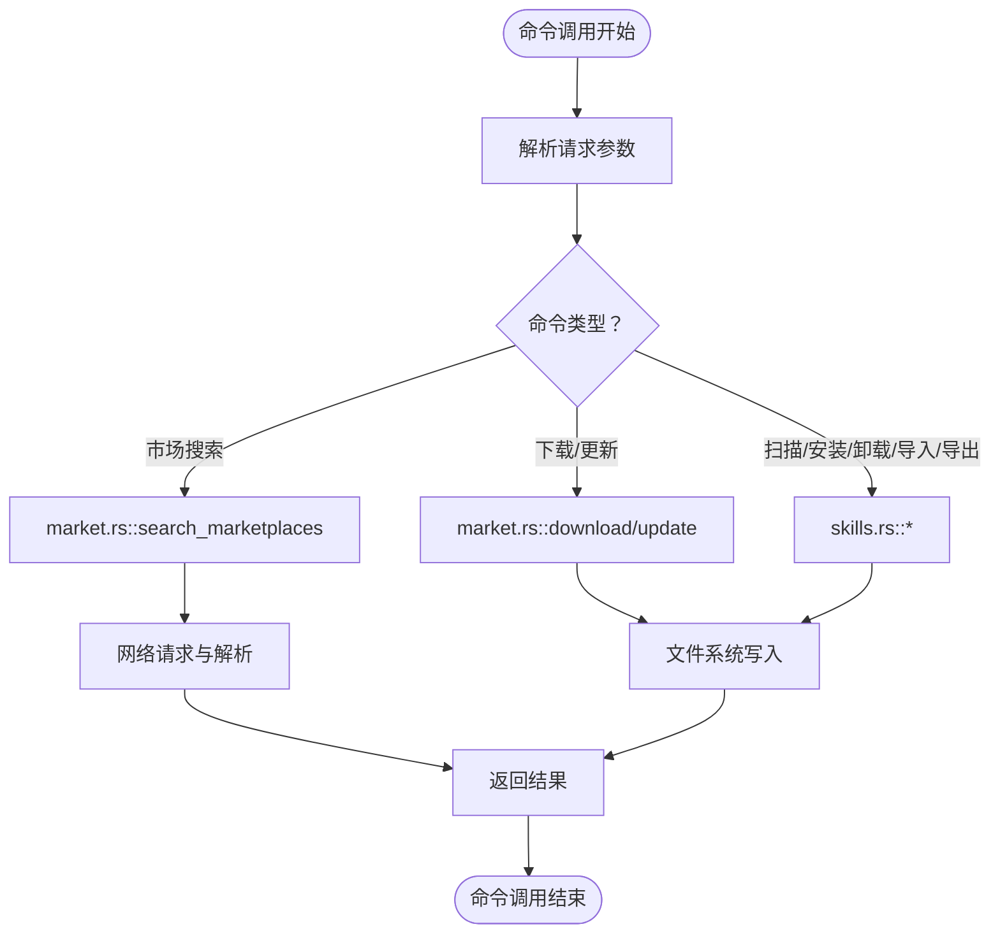
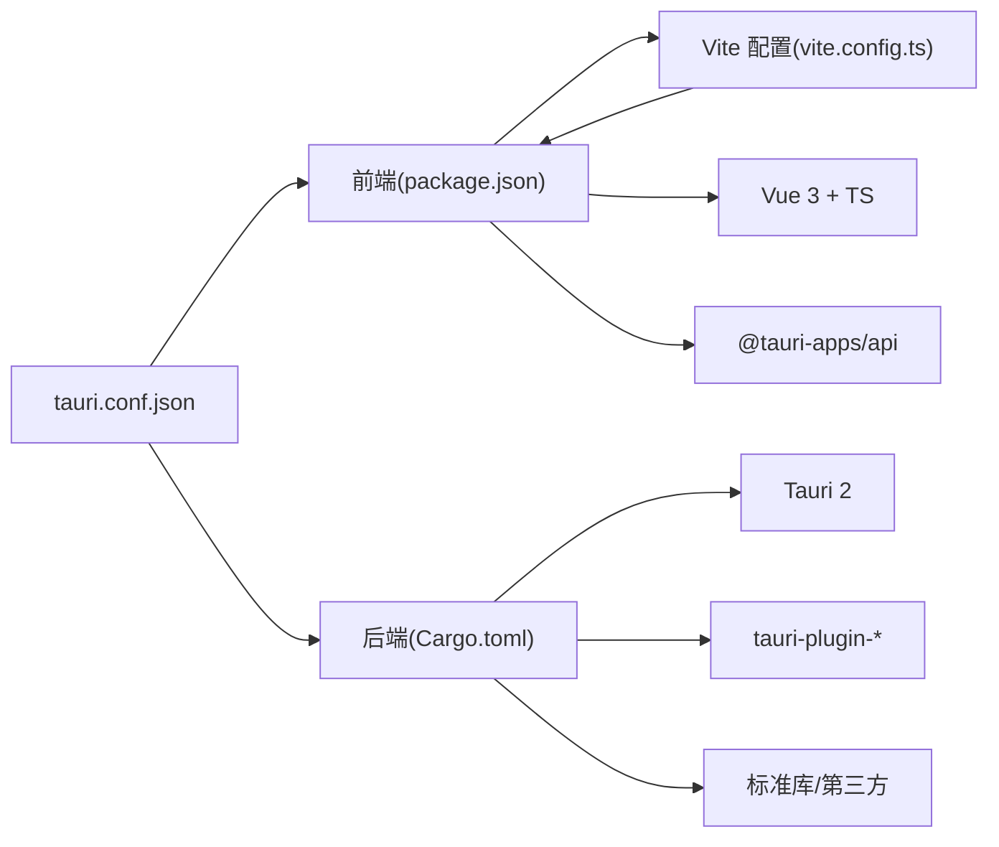

# 整体架构

<cite>
**本文引用的文件**
- [src/main.ts](file://src/main.ts)
- [src/App.vue](file://src/App.vue)
- [src/composables/useSkillsManager.ts](file://src/composables/useSkillsManager.ts)
- [src/composables/types.ts](file://src/composables/types.ts)
- [src/i18n.ts](file://src/i18n.ts)
- [vite.config.ts](file://vite.config.ts)
- [package.json](file://package.json)
- [src-tauri/src/main.rs](file://src-tauri/src/main.rs)
- [src-tauri/src/lib.rs](file://src-tauri/src/lib.rs)
- [src-tauri/src/commands/mod.rs](file://src-tauri/src/commands/mod.rs)
- [src-tauri/src/commands/market.rs](file://src-tauri/src/commands/market.rs)
- [src-tauri/src/commands/skills.rs](file://src-tauri/src/commands/skills.rs)
- [src-tauri/Cargo.toml](file://src-tauri/Cargo.toml)
- [src-tauri/tauri.conf.json](file://src-tauri/tauri.conf.json)
</cite>

## 目录
1. [简介](#简介)
2. [项目结构](#项目结构)
3. [核心组件](#核心组件)
4. [架构总览](#架构总览)
5. [详细组件分析](#详细组件分析)
6. [依赖关系分析](#依赖关系分析)
7. [性能考虑](#性能考虑)
8. [故障排查指南](#故障排查指南)
9. [结论](#结论)
10. [附录](#附录)

## 简介
本项目是一个基于 Tauri 2 + Vue 3 + TypeScript 的跨平台桌面应用，用于统一管理 AI 技能（Skills）。应用通过前端 Vue 3 组合式 API 提供用户界面与交互，后端 Rust 命令处理系统级操作（文件系统、网络下载、IDE 集成等），二者通过 Tauri 的命令通道进行互操作。应用采用前后端分离与 MVVM 模式结合的设计，将 UI 层、业务逻辑层、数据访问层与系统集成层清晰分层，具备良好的可扩展性与安全性。

## 项目结构
项目采用“前端 Vue 应用 + 后端 Rust 库”的双层结构，配合 Tauri 配置完成打包与运行时集成。关键目录与职责如下：
- src：Vue 3 前端应用入口、组件、组合式逻辑与国际化资源
- src-tauri：Rust 后端库，包含命令模块、工具模块与类型定义
- 配置文件：Vite、Tauri、Cargo、包管理等

**图示来源**
- [src/main.ts:1-7](file://src/main.ts#L1-L7)
- [src/App.vue:1-633](file://src/App.vue#L1-L633)
- [src/composables/useSkillsManager.ts:1-800](file://src/composables/useSkillsManager.ts#L1-L800)
- [src/i18n.ts:1-17](file://src/i18n.ts#L1-L17)
- [vite.config.ts:1-33](file://vite.config.ts#L1-L33)
- [package.json:1-30](file://package.json#L1-L30)
- [src-tauri/src/main.rs:1-7](file://src-tauri/src/main.rs#L1-L7)
- [src-tauri/src/lib.rs:1-54](file://src-tauri/src/lib.rs#L1-L54)
- [src-tauri/src/commands/mod.rs:1-3](file://src-tauri/src/commands/mod.rs#L1-L3)
- [src-tauri/Cargo.toml:1-36](file://src-tauri/Cargo.toml#L1-L36)
- [src-tauri/tauri.conf.json:1-45](file://src-tauri/tauri.conf.json#L1-L45)

**章节来源**
- [src/main.ts:1-7](file://src/main.ts#L1-L7)
- [src/App.vue:1-633](file://src/App.vue#L1-L633)
- [src/composables/useSkillsManager.ts:1-800](file://src/composables/useSkillsManager.ts#L1-L800)
- [src/i18n.ts:1-17](file://src/i18n.ts#L1-L17)
- [vite.config.ts:1-33](file://vite.config.ts#L1-L33)
- [package.json:1-30](file://package.json#L1-L30)
- [src-tauri/src/main.rs:1-7](file://src-tauri/src/main.rs#L1-L7)
- [src-tauri/src/lib.rs:1-54](file://src-tauri/src/lib.rs#L1-L54)
- [src-tauri/src/commands/mod.rs:1-3](file://src-tauri/src/commands/mod.rs#L1-L3)
- [src-tauri/Cargo.toml:1-36](file://src-tauri/Cargo.toml#L1-L36)
- [src-tauri/tauri.conf.json:1-45](file://src-tauri/tauri.conf.json#L1-L45)

## 核心组件
- 前端应用入口与国际化
  - 应用入口负责挂载 Vue 应用、引入国际化配置与全局样式
  - 国际化模块提供多语言支持与回退策略
- 根组件与页面路由
  - 根组件集中管理主题、语言、标签页切换、模态框与加载遮罩
  - 通过组合式逻辑暴露状态与动作，驱动各面板渲染
- 组合式逻辑(useSkillsManager)
  - 聚合市场搜索、本地扫描、下载队列、安装/卸载、导入导出等业务流程
  - 封装 Tauri 命令调用、错误处理与用户反馈
- 类型系统(types)
  - 定义远程技能、本地技能、IDE 技能、链接目标、下载任务等核心数据模型
- 开发与构建配置
  - Vite 配置固定开发端口、热重载与忽略 src-tauri 目录
  - 包管理器脚本与 Tauri CLI 集成

**章节来源**
- [src/main.ts:1-7](file://src/main.ts#L1-L7)
- [src/i18n.ts:1-17](file://src/i18n.ts#L1-L17)
- [src/App.vue:1-633](file://src/App.vue#L1-L633)
- [src/composables/useSkillsManager.ts:1-800](file://src/composables/useSkillsManager.ts#L1-L800)
- [src/composables/types.ts:1-119](file://src/composables/types.ts#L1-L119)
- [vite.config.ts:1-33](file://vite.config.ts#L1-L33)
- [package.json:1-30](file://package.json#L1-L30)

## 架构总览
应用采用“MVVM + 前后端分离 + Tauri 命令系统”的架构模式：
- UI 层：Vue 3 单文件组件与组合式 API，负责视图渲染与用户交互
- 业务逻辑层：组合式逻辑封装业务规则、缓存与异步流程
- 数据访问层：通过 Tauri 命令调用 Rust 后端，执行文件系统与网络操作
- 系统集成层：Rust 命令模块对接操作系统能力（路径解析、符号链接、压缩归档、HTTP 下载）

**图示来源**
- [src/App.vue:1-633](file://src/App.vue#L1-L633)
- [src/composables/useSkillsManager.ts:1-800](file://src/composables/useSkillsManager.ts#L1-L800)
- [src/composables/types.ts:1-119](file://src/composables/types.ts#L1-L119)
- [src-tauri/src/commands/market.rs:1-442](file://src-tauri/src/commands/market.rs#L1-L442)
- [src-tauri/src/commands/skills.rs:1-800](file://src-tauri/src/commands/skills.rs#L1-L800)

## 详细组件分析

### 前端应用入口与国际化
- 入口文件创建 Vue 应用实例，挂载根组件，并注入国际化模块
- 国际化模块提供中英文消息映射与回退策略，确保语言切换与持久化

**章节来源**
- [src/main.ts:1-7](file://src/main.ts#L1-L7)
- [src/i18n.ts:1-17](file://src/i18n.ts#L1-L17)

### 根组件与页面路由
- 根组件集中管理主题与语言的本地存储与实时切换
- 通过组合式逻辑暴露状态与动作，驱动各功能面板渲染与交互
- 模态框与加载遮罩提升用户体验与状态反馈

**章节来源**
- [src/App.vue:1-633](file://src/App.vue#L1-L633)

### 组合式逻辑：useSkillsManager
- 职责边界
  - 市场搜索：查询多个数据源、聚合结果、缓存与去重
  - 本地扫描：遍历 IDE 目录与本地仓库，生成概览
  - 下载队列：串行/并行控制、错误重试、完成清理
  - 安装/卸载：构建链接目标、创建符号链接或目录、批量处理
  - 导入/导出：校验路径、安全检查、ZIP 归档
- 关键实现点
  - 使用 invoke 调用后端命令，统一错误处理与用户提示
  - 使用 Map 缓存搜索结果，降低重复请求
  - 对 IDE 路径进行绝对/相对解析与安全校验
  - 对下载任务进行状态机管理与定时清理

**图示来源**
- [src/App.vue:160-200](file://src/App.vue#L160-L200)
- [src/composables/useSkillsManager.ts:190-248](file://src/composables/useSkillsManager.ts#L190-L248)
- [src-tauri/src/lib.rs:27-39](file://src-tauri/src/lib.rs#L27-L39)
- [src-tauri/src/commands/market.rs:173-392](file://src-tauri/src/commands/market.rs#L173-L392)
- [src-tauri/src/commands/skills.rs:355-449](file://src-tauri/src/commands/skills.rs#L355-L449)

**章节来源**
- [src/composables/useSkillsManager.ts:1-800](file://src/composables/useSkillsManager.ts#L1-L800)

### 类型系统：数据模型与状态
- 远程技能、本地技能、IDE 技能、概览、链接目标、下载任务等类型定义
- 为前后端契约提供强类型保障，减少运行时错误

**章节来源**
- [src/composables/types.ts:1-119](file://src/composables/types.ts#L1-L119)

### Rust 命令系统与 Tauri 集成
- 命令注册
  - 在 lib.rs 中通过 generate_handler! 注册所有命令，统一由 Tauri 运行时调度
- 命令实现
  - market.rs：聚合多数据源搜索、下载与更新
  - skills.rs：本地扫描、安装/卸载、导入/导出、符号链接与安全校验
- 运行时配置
  - tauri.conf.json：开发/构建 URL、CSP、插件与签名公钥
  - Cargo.toml：依赖与构建类型（静态/动态库）

**图示来源**
- [src-tauri/src/lib.rs:27-39](file://src-tauri/src/lib.rs#L27-L39)
- [src-tauri/src/commands/market.rs:173-442](file://src-tauri/src/commands/market.rs#L173-L442)
- [src-tauri/src/commands/skills.rs:355-800](file://src-tauri/src/commands/skills.rs#L355-L800)

**章节来源**
- [src-tauri/src/lib.rs:1-54](file://src-tauri/src/lib.rs#L1-L54)
- [src-tauri/src/commands/mod.rs:1-3](file://src-tauri/src/commands/mod.rs#L1-L3)
- [src-tauri/src/commands/market.rs:1-442](file://src-tauri/src/commands/market.rs#L1-L442)
- [src-tauri/src/commands/skills.rs:1-800](file://src-tauri/src/commands/skills.rs#L1-L800)
- [src-tauri/tauri.conf.json:1-45](file://src-tauri/tauri.conf.json#L1-L45)
- [src-tauri/Cargo.toml:1-36](file://src-tauri/Cargo.toml#L1-L36)

### MVVM 架构在 Vue 3 中的应用
- Model：组合式逻辑中的响应式状态（ref/computed）与类型定义
- View：单文件组件模板与样式，负责渲染与事件绑定
- ViewModel：组合式函数将 Model 与 View 解耦，集中处理业务流程与副作用
- 优势：清晰的职责划分、易于测试与维护

**章节来源**
- [src/App.vue:1-633](file://src/App.vue#L1-L633)
- [src/composables/useSkillsManager.ts:1-800](file://src/composables/useSkillsManager.ts#L1-L800)

### 组合式 API 使用策略
- 响应式状态：使用 ref/computed 管理 UI 状态与派生数据
- 生命周期：onMounted/onUnmounted 管理初始化与资源清理
- 逻辑复用：将业务逻辑抽取到独立组合式函数，便于跨组件共享
- 错误处理：统一的错误消息与用户提示，避免异常冒泡

**章节来源**
- [src/composables/useSkillsManager.ts:1-800](file://src/composables/useSkillsManager.ts#L1-L800)

## 依赖关系分析
- 前端依赖
  - Vue 3、Vue I18n、Vite 插件与 Tauri API
  - 开发时依赖 Vite 与 TypeScript，生产时由 Tauri 打包
- 后端依赖
  - Tauri 2、插件（对话框、打开器、进程、更新器、单实例）
  - Rust 生态：serde、ureq、zip、walkdir、dirs 等
- 构建与运行
  - Vite 固定开发端口与 HMR 配置，忽略 src-tauri
  - Tauri 配置 devUrl 与构建输出路径，CSP 限制连接源与脚本源

**图示来源**
- [package.json:1-30](file://package.json#L1-L30)
- [vite.config.ts:1-33](file://vite.config.ts#L1-L33)
- [src-tauri/Cargo.toml:1-36](file://src-tauri/Cargo.toml#L1-L36)
- [src-tauri/tauri.conf.json:1-45](file://src-tauri/tauri.conf.json#L1-L45)

**章节来源**
- [package.json:1-30](file://package.json#L1-L30)
- [vite.config.ts:1-33](file://vite.config.ts#L1-L33)
- [src-tauri/Cargo.toml:1-36](file://src-tauri/Cargo.toml#L1-L36)
- [src-tauri/tauri.conf.json:1-45](file://src-tauri/tauri.conf.json#L1-L45)

## 性能考虑
- 前端性能
  - 搜索结果缓存：10 分钟 TTL，减少重复请求
  - 去重算法：按来源或名称去重，避免重复渲染
  - 下载队列：串行处理与状态机，避免并发冲突
- 后端性能
  - 异步运行时：spawn_blocking 处理阻塞 I/O，避免阻塞主线程
  - 安全校验：路径规范化与白名单检查，降低无效工作量
  - ZIP 打包：流式写入与压缩选项，平衡体积与速度
- 构建与运行
  - Vite 固定端口与 HMR，提升开发体验
  - CSP 限制连接源，减少潜在风险与资源浪费

**章节来源**
- [src/composables/useSkillsManager.ts:23-248](file://src/composables/useSkillsManager.ts#L23-L248)
- [src-tauri/src/commands/market.rs:181-392](file://src-tauri/src/commands/market.rs#L181-L392)
- [src-tauri/src/commands/skills.rs:252-309](file://src-tauri/src/commands/skills.rs#L252-L309)
- [vite.config.ts:16-31](file://vite.config.ts#L16-L31)
- [src-tauri/tauri.conf.json:20-23](file://src-tauri/tauri.conf.json#L20-L23)

## 故障排查指南
- 常见问题定位
  - 命令调用失败：检查命令是否在 generate_handler 中注册，确认请求参数与返回值类型一致
  - 路径安全错误：确认 IDE 目录与本地仓库路径在允许范围内，避免越权操作
  - 下载失败：检查网络连通性与代理设置，查看市场状态与错误信息
  - 符号链接创建失败：Windows 平台优先尝试 junction，否则回退复制；检查权限与路径合法性
- 日志与调试
  - 前端：统一错误消息与 Toast 提示，便于用户感知
  - 后端：命令实现中打印错误信息，辅助定位数据源解析问题

**章节来源**
- [src-tauri/src/lib.rs:27-39](file://src-tauri/src/lib.rs#L27-L39)
- [src-tauri/src/commands/skills.rs:355-449](file://src-tauri/src/commands/skills.rs#L355-L449)
- [src-tauri/src/commands/market.rs:234-243](file://src-tauri/src/commands/market.rs#L234-L243)

## 结论
本项目以 Tauri 2 为运行时内核，前端采用 Vue 3 + TypeScript + 组合式 API，后端以 Rust 命令模块实现系统级能力，形成清晰的分层架构。通过 Tauri 命令系统实现前后端互操作，结合 MVVM 模式与强类型设计，既保证了开发效率，也兼顾了安全性与可扩展性。建议后续持续完善错误监控、日志采集与自动化测试，进一步提升稳定性与可观测性。

## 附录
- 开发与构建
  - 本地开发：安装依赖后执行 tauri dev
  - 构建发布：执行 tauri build，生成多平台安装包
- 安全策略
  - CSP 限制连接源与脚本源，最小权限原则
  - 路径安全校验与符号链接创建的跨平台兼容处理

**章节来源**
- [README.md:75-86](file://README.md#L75-L86)
- [src-tauri/tauri.conf.json:20-23](file://src-tauri/tauri.conf.json#L20-L23)