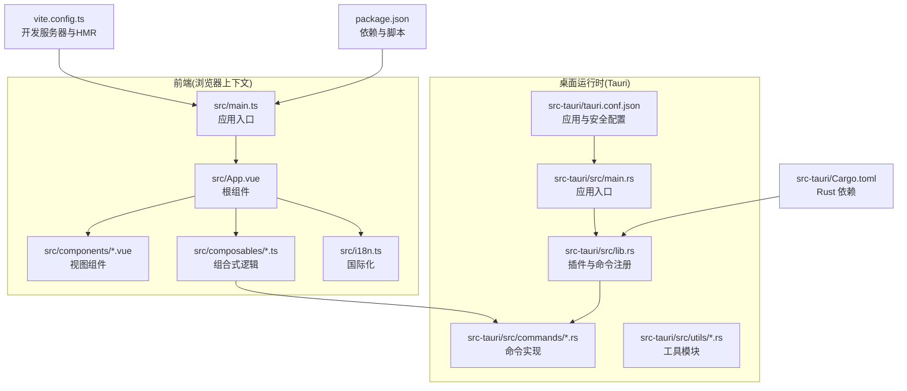
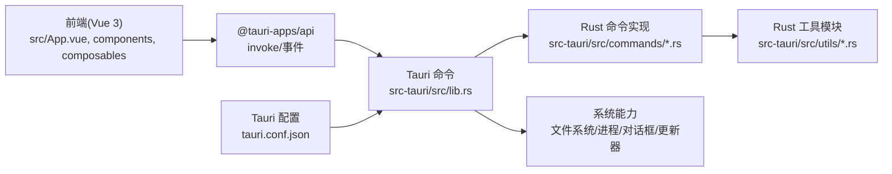
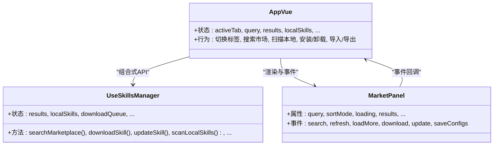
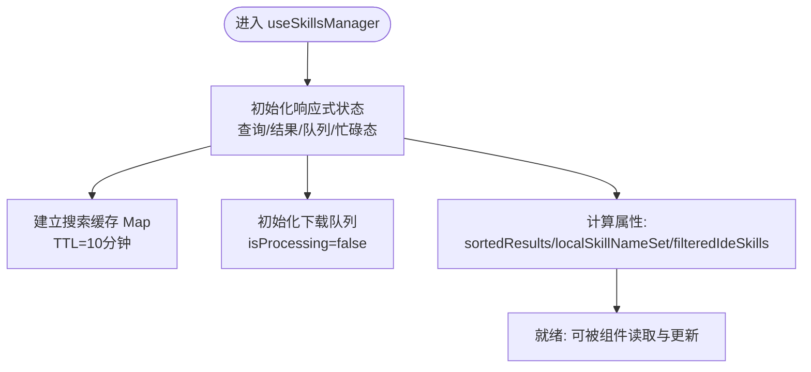
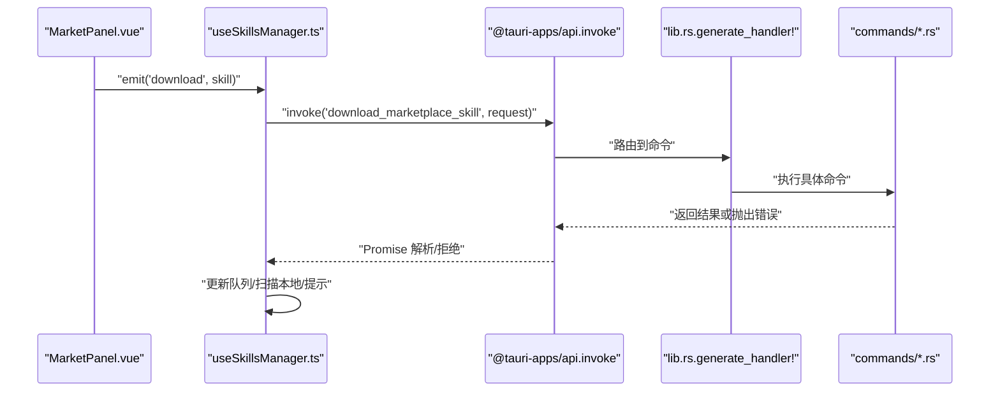
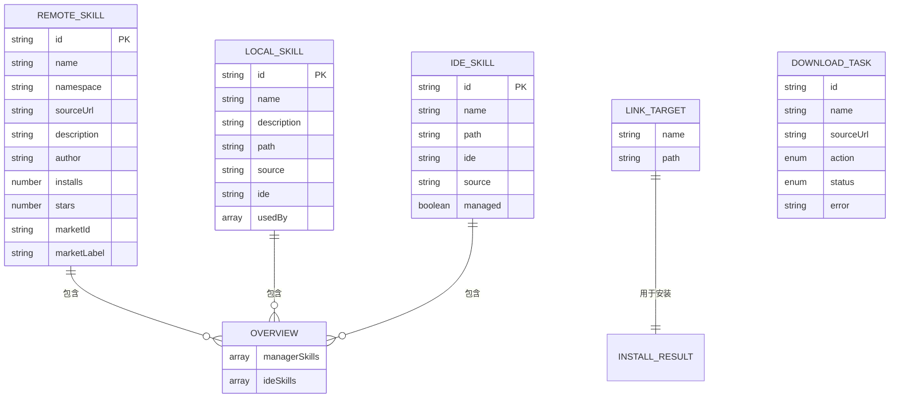
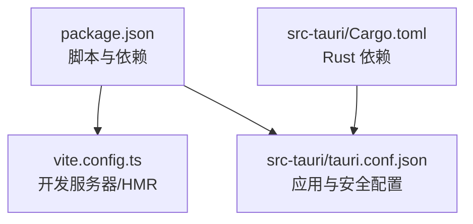

# 架构设计

<cite>
**本文引用的文件**   
- [src/main.ts](file://src/main.ts)
- [src/App.vue](file://src/App.vue)
- [src/composables/useSkillsManager.ts](file://src/composables/useSkillsManager.ts)
- [src/composables/types.ts](file://src/composables/types.ts)
- [src/components/MarketPanel.vue](file://src/components/MarketPanel.vue)
- [src/i18n.ts](file://src/i18n.ts)
- [src-tauri/src/main.rs](file://src-tauri/src/main.rs)
- [src-tauri/src/lib.rs](file://src-tauri/src/lib.rs)
- [src-tauri/src/commands/mod.rs](file://src-tauri/src/commands/mod.rs)
- [src-tauri/src/utils/mod.rs](file://src-tauri/src/utils/mod.rs)
- [src-tauri/tauri.conf.json](file://src-tauri/tauri.conf.json)
- [vite.config.ts](file://vite.config.ts)
- [package.json](file://package.json)
- [src-tauri/Cargo.toml](file://src-tauri/Cargo.toml)
- [README.md](file://README.md)
</cite>

## 目录
1. [引言](#引言)
2. [项目结构](#项目结构)
3. [核心组件](#核心组件)
4. [架构总览](#架构总览)
5. [详细组件分析](#详细组件分析)
6. [依赖分析](#依赖分析)
7. [性能考虑](#性能考虑)
8. [故障排查指南](#故障排查指南)
9. [结论](#结论)
10. [附录](#附录)

## 引言
本架构设计文档面向 Skills Manager 项目，系统性阐述其“前后端分离 + MVVM + 组合式 API + 命令模式”的整体设计。前端采用 Vue 3 + TypeScript + Vite，桌面运行时基于 Tauri 2；后端能力通过 Rust 实现，并以命令（Command）形式暴露给前端调用。文档重点包括：
- 系统边界与职责划分
- 组件关系与数据流
- 状态管理与缓存策略
- Tauri 集成与 JS-Rust 互操作机制
- 技术决策与架构约束
- 关键流程的序列图与类图

## 项目结构
项目采用典型的“前端 + Tauri 后端”分层组织：
- 前端层：src 目录，包含入口、组件、组合式 API、国际化等
- 桌面运行时：src-tauri 目录，包含 Rust 应用入口、命令模块、工具模块与配置
- 构建与开发：Vite 配置、包管理脚本与 Tauri 配置

**图表来源**
- [src/main.ts:1-7](file://src/main.ts#L1-L7)
- [src/App.vue:1-633](file://src/App.vue#L1-L633)
- [src-tauri/src/main.rs:1-7](file://src-tauri/src/main.rs#L1-L7)
- [src-tauri/src/lib.rs:1-54](file://src-tauri/src/lib.rs#L1-L54)
- [src-tauri/tauri.conf.json:1-45](file://src-tauri/tauri.conf.json#L1-L45)
- [vite.config.ts:1-33](file://vite.config.ts#L1-L33)
- [package.json:1-30](file://package.json#L1-L30)
- [src-tauri/Cargo.toml:1-36](file://src-tauri/Cargo.toml#L1-L36)

**章节来源**
- [README.md:1-104](file://README.md#L1-L104)
- [src/main.ts:1-7](file://src/main.ts#L1-L7)
- [vite.config.ts:1-33](file://vite.config.ts#L1-L33)
- [package.json:1-30](file://package.json#L1-L30)
- [src-tauri/Cargo.toml:1-36](file://src-tauri/Cargo.toml#L1-L36)
- [src-tauri/tauri.conf.json:1-45](file://src-tauri/tauri.conf.json#L1-L45)

## 核心组件
- 应用入口与挂载
  - 前端入口负责创建 Vue 应用、加载国际化并挂载到 DOM
  - Tauri 入口负责启动应用并注册插件与命令
- 根组件与路由式视图
  - 根组件根据活动标签页渲染不同面板（本地、市场、IDE、项目、设置）
- 组合式 API（状态与业务逻辑）
  - useSkillsManager 聚合市场搜索、下载队列、本地扫描、安装卸载、导入导出等核心流程
- 视图组件
  - MarketPanel 等组件负责展示与交互，向父组件派发事件
- 国际化
  - i18n 提供多语言支持与语言切换
- 类型定义
  - types.ts 定义远程技能、本地技能、IDE 技能、任务队列等核心类型

**章节来源**
- [src/main.ts:1-7](file://src/main.ts#L1-L7)
- [src-tauri/src/main.rs:1-7](file://src-tauri/src/main.rs#L1-L7)
- [src/App.vue:1-633](file://src/App.vue#L1-L633)
- [src/composables/useSkillsManager.ts:1-800](file://src/composables/useSkillsManager.ts#L1-L800)
- [src/components/MarketPanel.vue:1-192](file://src/components/MarketPanel.vue#L1-L192)
- [src/i18n.ts:1-17](file://src/i18n.ts#L1-L17)
- [src/composables/types.ts:1-119](file://src/composables/types.ts#L1-L119)

## 架构总览
Skills Manager 采用“前端 MVVM + Tauri 命令桥接”的架构：
- 前端使用 Vue 3 的组合式 API 管理状态与副作用，组件通过事件与根组件通信
- 前端通过 @tauri-apps/api 的 invoke 机制调用后端命令，实现系统级能力（文件系统、进程、对话框、更新器等）
- 后端以 Rust 实现命令处理，统一在 lib.rs 中注册，通过 generate_handler! 汇聚到 WebView
- 开发期由 Vite 提供 HMR，生产构建由 Tauri 打包为原生应用

**图表来源**
- [src/App.vue:1-633](file://src/App.vue#L1-L633)
- [src-tauri/src/lib.rs:1-54](file://src-tauri/src/lib.rs#L1-L54)
- [src-tauri/src/commands/mod.rs:1-3](file://src-tauri/src/commands/mod.rs#L1-L3)
- [src-tauri/src/utils/mod.rs:1-4](file://src-tauri/src/utils/mod.rs#L1-L4)
- [src-tauri/tauri.conf.json:1-45](file://src-tauri/tauri.conf.json#L1-L45)

**章节来源**
- [src/App.vue:1-633](file://src/App.vue#L1-L633)
- [src-tauri/src/lib.rs:1-54](file://src-tauri/src/lib.rs#L1-L54)
- [src-tauri/tauri.conf.json:1-45](file://src-tauri/tauri.conf.json#L1-L45)

## 详细组件分析

### 组件关系与数据流
- 根组件 App.vue 作为 MVVM 的“视图模型”，通过 useSkillsManager 暴露状态与方法
- MarketPanel 等子组件接收属性并派发事件，形成自上而下的数据流与自下而上的事件流
- useSkillsManager 内部维护搜索结果、排序、下载队列、本地扫描状态等，封装对后端命令的调用

**图表来源**
- [src/App.vue:1-633](file://src/App.vue#L1-L633)
- [src/components/MarketPanel.vue:1-192](file://src/components/MarketPanel.vue#L1-L192)
- [src/composables/useSkillsManager.ts:1-800](file://src/composables/useSkillsManager.ts#L1-L800)

**章节来源**
- [src/App.vue:1-633](file://src/App.vue#L1-L633)
- [src/components/MarketPanel.vue:1-192](file://src/components/MarketPanel.vue#L1-L192)
- [src/composables/useSkillsManager.ts:1-800](file://src/composables/useSkillsManager.ts#L1-L800)

### 状态管理模式
- 响应式状态集中于 useSkillsManager：查询参数、市场结果、本地技能、IDE 技能、下载队列、最近任务状态、忙碌态等
- 计算属性：排序后的结果、本地技能名称集合、过滤后的 IDE 技能等
- 缓存策略：市场搜索结果按查询词与分页参数缓存，带 TTL，避免重复请求
- 下载队列：串行处理 pending 任务，支持重试、错误标记与完成清理

**图表来源**
- [src/composables/useSkillsManager.ts:1-800](file://src/composables/useSkillsManager.ts#L1-L800)

**章节来源**
- [src/composables/useSkillsManager.ts:1-800](file://src/composables/useSkillsManager.ts#L1-L800)

### 命令模式实现与 JS-Rust 互操作
- 前端通过 invoke 调用后端命令，如搜索市场、下载/更新技能、扫描本地、安装/卸载、导入/导出等
- 后端在 lib.rs 中注册命令，generate_handler! 将命令名映射到对应函数
- 命令实现位于 src-tauri/src/commands 目录，工具模块位于 src-tauri/src/utils

**图表来源**
- [src/components/MarketPanel.vue:1-192](file://src/components/MarketPanel.vue#L1-L192)
- [src/composables/useSkillsManager.ts:1-800](file://src/composables/useSkillsManager.ts#L1-L800)
- [src-tauri/src/lib.rs:1-54](file://src-tauri/src/lib.rs#L1-L54)
- [src-tauri/src/commands/mod.rs:1-3](file://src-tauri/src/commands/mod.rs#L1-L3)

**章节来源**
- [src/composables/useSkillsManager.ts:1-800](file://src/composables/useSkillsManager.ts#L1-L800)
- [src-tauri/src/lib.rs:1-54](file://src-tauri/src/lib.rs#L1-L54)
- [src-tauri/src/commands/mod.rs:1-3](file://src-tauri/src/commands/mod.rs#L1-L3)

### 数据模型与类型
- 远程技能、本地技能、IDE 技能、概览、链接目标、下载任务、项目配置等类型定义清晰，便于前后端契约一致

**图表来源**
- [src/composables/types.ts:1-119](file://src/composables/types.ts#L1-L119)

**章节来源**
- [src/composables/types.ts:1-119](file://src/composables/types.ts#L1-L119)

### 国际化与主题
- i18n.ts 提供 zh-CN 与 en-US 语言包，App.vue 在挂载时读取系统语言偏好并持久化
- 主题通过 data-theme 属性切换，支持亮/暗两种模式

**章节来源**
- [src/i18n.ts:1-17](file://src/i18n.ts#L1-L17)
- [src/App.vue:1-633](file://src/App.vue#L1-L633)

## 依赖分析
- 前端依赖
  - Vue 3、vue-i18n、@tauri-apps/api 及相关插件（对话框、打开器、进程、更新器）
  - Vite 作为开发服务器与打包工具
- 后端依赖
  - Tauri 2、serde、ureq、zip、walkdir、dirs 等
  - 针对非移动端平台启用更新器与单实例插件
- 构建与运行
  - package.json 定义开发、构建、预览与 Tauri 命令
  - vite.config.ts 固定前端开发端口与 HMR 设置，忽略 src-tauri 目录
  - tauri.conf.json 定义窗口尺寸、CSP、更新器端点与公钥

**图表来源**
- [package.json:1-30](file://package.json#L1-L30)
- [vite.config.ts:1-33](file://vite.config.ts#L1-L33)
- [src-tauri/Cargo.toml:1-36](file://src-tauri/Cargo.toml#L1-L36)
- [src-tauri/tauri.conf.json:1-45](file://src-tauri/tauri.conf.json#L1-L45)

**章节来源**
- [package.json:1-30](file://package.json#L1-L30)
- [vite.config.ts:1-33](file://vite.config.ts#L1-L33)
- [src-tauri/Cargo.toml:1-36](file://src-tauri/Cargo.toml#L1-L36)
- [src-tauri/tauri.conf.json:1-45](file://src-tauri/tauri.conf.json#L1-L45)

## 性能考虑
- 市场搜索缓存：按查询词与分页键缓存结果，TTL 10 分钟，减少网络请求与重复解析
- 下载队列串行化：避免并发写入冲突，提升稳定性；完成后定时清理，防止内存泄漏
- 按需扫描：本地扫描仅在必要时触发，避免频繁 IO
- 前端懒加载：组件按需引入，减少首屏负担
- CSP 限制：严格内容安全策略，降低 XSS 风险，间接提升运行时安全性

[本节为通用建议，不直接分析具体文件]

## 故障排查指南
- 市场搜索失败
  - 检查 marketStatuses 与错误信息，确认 API Key 配置与网络连通性
  - 参考 useSkillsManager 的错误提示与缓存失效策略
- 下载/更新失败
  - 查看下载队列任务状态与错误字段，支持重试
  - 确认安装基础目录可写与磁盘空间充足
- 卸载/删除异常
  - IDE 卸载可能逐个路径执行，关注部分成功/失败提示
  - 本地删除会批量处理，注意权限与路径有效性
- 打开目录失败
  - 若路径不存在，尝试回退到父目录进行定位

**章节来源**
- [src/composables/useSkillsManager.ts:1-800](file://src/composables/useSkillsManager.ts#L1-L800)

## 结论
Skills Manager 通过“前端 MVVM + Tauri 命令桥接”的架构，实现了跨平台桌面应用的高效开发与稳定运行。前端以组合式 API 统一管理状态与业务流程，后端以命令模式提供系统级能力，二者通过 invoke 机制解耦协作。该设计在可维护性、扩展性与性能之间取得平衡，适合持续演进与团队协作。

[本节为总结，不直接分析具体文件]

## 附录
- 系统边界
  - 外部系统：第三方市场（Claude Plugins、SkillsLLM、SkillsMP 等）、操作系统文件系统与进程
  - 内部系统：前端 UI、组合式逻辑、Tauri 插件与命令、Rust 工具模块
- 技术决策
  - 前端：Vue 3 + TypeScript + Vite，组合式 API 管理复杂状态
  - 桌面：Tauri 2，统一命令注册与安全策略
  - 互操作：@tauri-apps/api invoke，强类型请求/响应
- 架构约束
  - 命令命名与参数契约需前后端一致
  - CSP 严格限制，禁止内联脚本与不安全连接源
  - 更新器端点与公钥需与发布流程匹配

[本节为概念性总结，不直接分析具体文件]