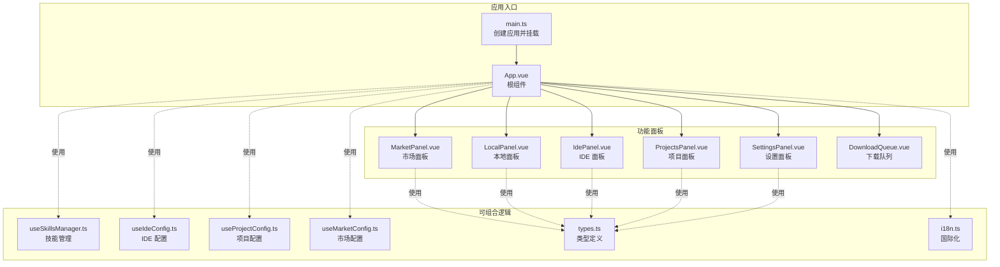
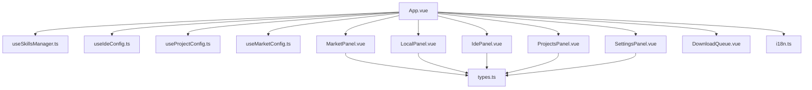
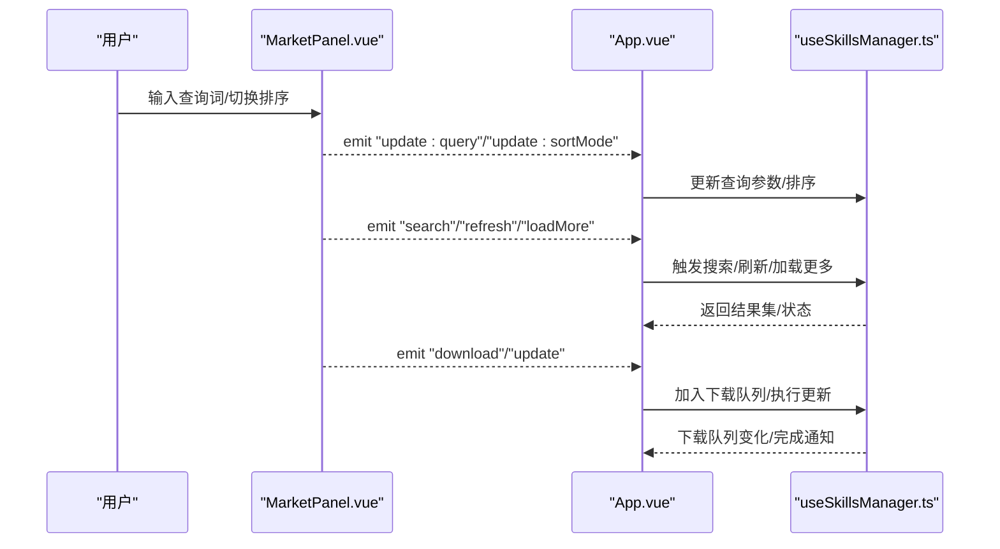
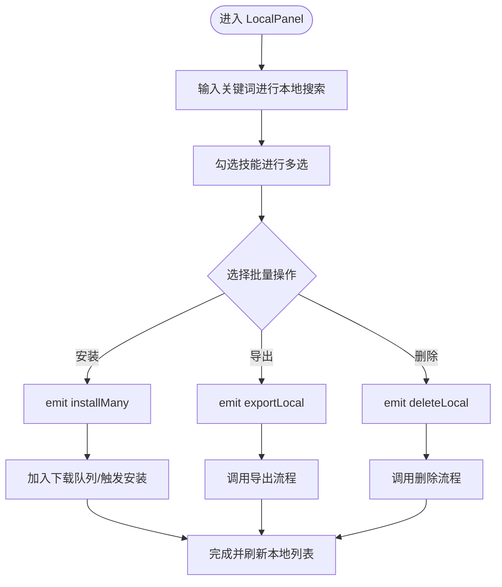
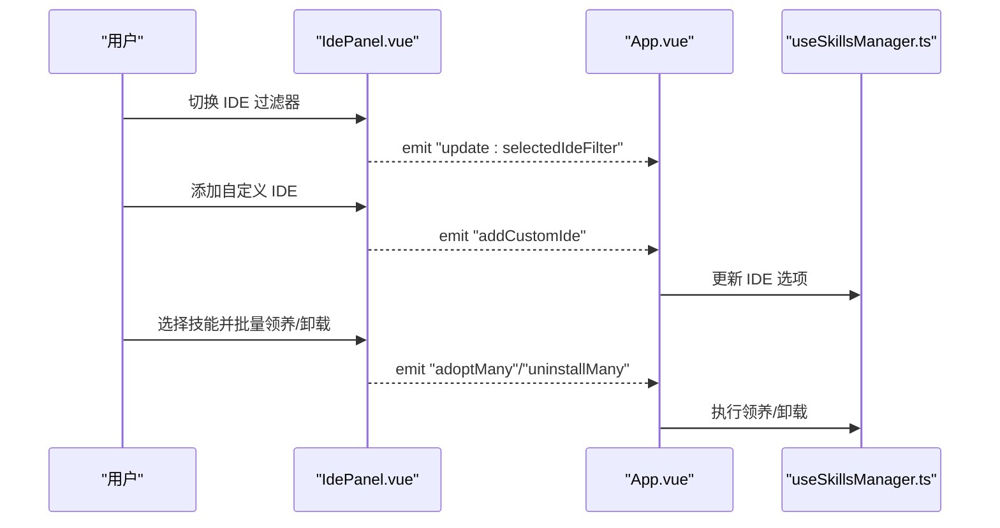
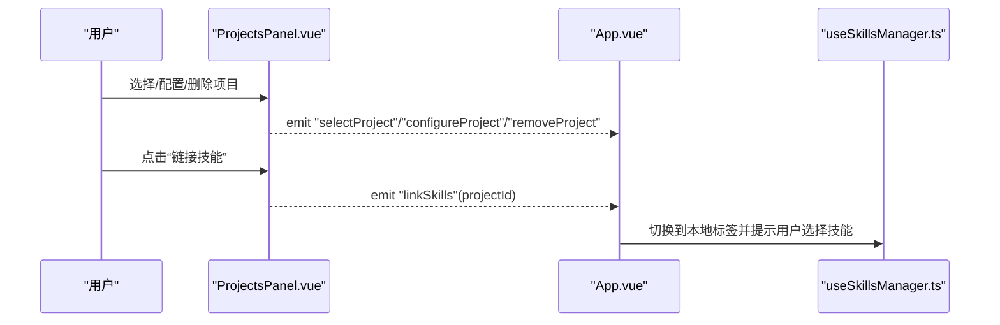
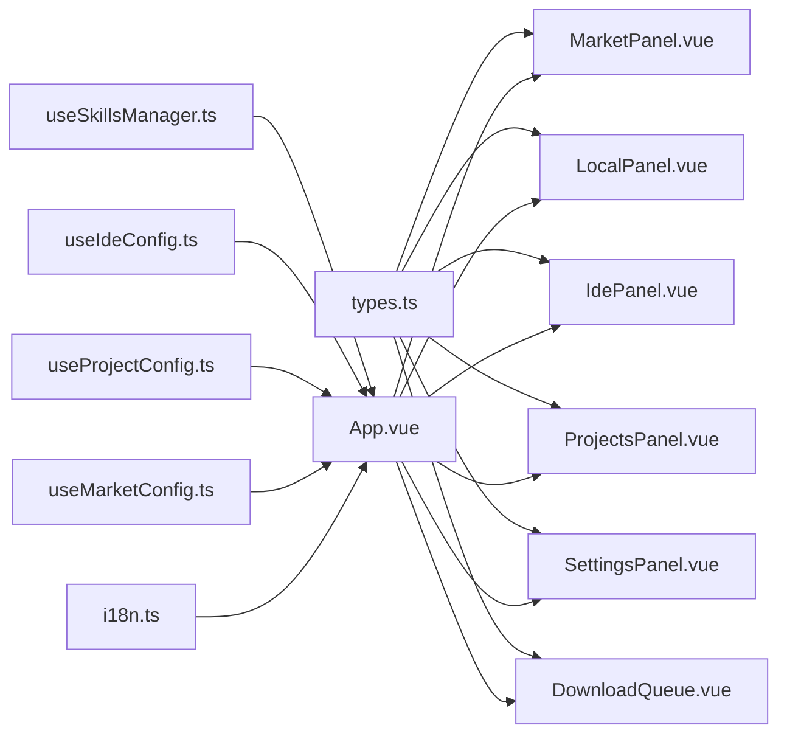

# 组件关系图

<cite>
**本文档引用的文件**
- [src/App.vue](file://src/App.vue)
- [src/main.ts](file://src/main.ts)
- [src/components/MarketPanel.vue](file://src/components/MarketPanel.vue)
- [src/components/LocalPanel.vue](file://src/components/LocalPanel.vue)
- [src/components/IdePanel.vue](file://src/components/IdePanel.vue)
- [src/components/ProjectsPanel.vue](file://src/components/ProjectsPanel.vue)
- [src/components/SettingsPanel.vue](file://src/components/SettingsPanel.vue)
- [src/components/ProjectPanel.vue](file://src/components/ProjectPanel.vue)
- [src/components/DownloadQueue.vue](file://src/components/DownloadQueue.vue)
- [src/composables/useSkillsManager.ts](file://src/composables/useSkillsManager.ts)
- [src/composables/types.ts](file://src/composables/types.ts)
- [src/composables/useIdeConfig.ts](file://src/composables/useIdeConfig.ts)
- [src/composables/useProjectConfig.ts](file://src/composables/useProjectConfig.ts)
- [src/composables/useMarketConfig.ts](file://src/composables/useMarketConfig.ts)
- [src/i18n.ts](file://src/i18n.ts)
</cite>

## 目录
1. [简介](#简介)
2. [项目结构](#项目结构)
3. [核心组件](#核心组件)
4. [架构总览](#架构总览)
5. [详细组件分析](#详细组件分析)
6. [依赖关系分析](#依赖关系分析)
7. [性能考虑](#性能考虑)
8. [故障排除指南](#故障排除指南)
9. [结论](#结论)

## 简介
本文件面向 Skills Manager 的 Vue 3 组件体系，系统化梳理根组件 App.vue 与各功能面板组件之间的层次结构与依赖关系，重点解析 MarketPanel、LocalPanel、IdePanel、ProjectsPanel 等核心组件的设计模式与职责划分，并总结组件间通信机制（props 传递、事件发射）、provide/inject 使用现状、生命周期管理与状态共享策略。同时提供组件关系图与数据流向图，帮助开发者快速理解组件协作关系与交互模式。

## 项目结构
应用采用“根组件 + 多功能面板 + 可组合逻辑”的分层组织方式：
- 根组件负责全局状态、主题与语言切换、标签页路由、模态框与遮罩层等
- 功能面板组件按领域拆分：市场、本地、IDE、项目、设置
- 可组合逻辑（composables）封装跨组件的状态与业务流程，如技能管理、IDE 配置、项目配置、市场配置等
- 类型定义集中于 types.ts，确保组件间契约清晰

图表来源
- [src/main.ts:1-7](file://src/main.ts#L1-L7)
- [src/App.vue:1-633](file://src/App.vue#L1-L633)
- [src/components/MarketPanel.vue:1-192](file://src/components/MarketPanel.vue#L1-L192)
- [src/components/LocalPanel.vue:1-310](file://src/components/LocalPanel.vue#L1-L310)
- [src/components/IdePanel.vue:1-270](file://src/components/IdePanel.vue#L1-L270)
- [src/components/ProjectsPanel.vue:1-253](file://src/components/ProjectsPanel.vue#L1-L253)
- [src/components/SettingsPanel.vue:1-570](file://src/components/SettingsPanel.vue#L1-L570)
- [src/components/DownloadQueue.vue:1-113](file://src/components/DownloadQueue.vue#L1-L113)
- [src/composables/useSkillsManager.ts:1-867](file://src/composables/useSkillsManager.ts#L1-L867)
- [src/composables/useIdeConfig.ts:1-131](file://src/composables/useIdeConfig.ts#L1-L131)
- [src/composables/useProjectConfig.ts:1-128](file://src/composables/useProjectConfig.ts#L1-L128)
- [src/composables/useMarketConfig.ts:1-67](file://src/composables/useMarketConfig.ts#L1-L67)
- [src/composables/types.ts:1-119](file://src/composables/types.ts#L1-L119)
- [src/i18n.ts:1-17](file://src/i18n.ts#L1-L17)

章节来源
- [src/main.ts:1-7](file://src/main.ts#L1-L7)
- [src/App.vue:1-633](file://src/App.vue#L1-L633)

## 核心组件
- 根组件 App.vue
  - 负责主题与语言持久化与切换、启动时检查更新与加载项目
  - 通过 useSkillsManager 提供全局状态与动作（搜索、安装、卸载、扫描等）
  - 通过 useProjectConfig 管理项目列表与选中项
  - 通过 useUpdateStore 提供更新检查能力
  - 通过 useToast 提供消息提示
  - 按 activeTab 渲染对应面板组件，并传递 props 与处理事件
- MarketPanel 市场面板
  - 接收查询词、排序模式、结果集、下载队列等 props
  - 发射搜索、刷新、加载更多、下载、更新、保存配置等事件
- LocalPanel 本地面板
  - 接收本地技能、扫描状态、安装中 ID、下载队列等 props
  - 发射安装、导出、删除、打开目录、刷新、导入、重试下载、移除队列等事件
- IdePanel IDE 面板
  - 接收 IDE 选项、过滤器、自定义 IDE、过滤后的 IDE 技能等 props
  - 发射选择过滤器、添加/删除自定义 IDE、卸载、批量卸载、打开目录、领养、批量领养等事件
- ProjectsPanel 项目面板
  - 接收项目列表、选中项目、本地技能、IDE 选项、扫描状态等 props
  - 发射新增、删除、选择、配置、链接技能等事件
- SettingsPanel 设置面板
  - 独立管理主题、语言、更新检查与下载安装流程
- DownloadQueue 下载队列
  - 展示下载任务状态，支持重试与移除

章节来源
- [src/App.vue:1-633](file://src/App.vue#L1-L633)
- [src/components/MarketPanel.vue:1-192](file://src/components/MarketPanel.vue#L1-L192)
- [src/components/LocalPanel.vue:1-310](file://src/components/LocalPanel.vue#L1-L310)
- [src/components/IdePanel.vue:1-270](file://src/components/IdePanel.vue#L1-L270)
- [src/components/ProjectsPanel.vue:1-253](file://src/components/ProjectsPanel.vue#L1-L253)
- [src/components/SettingsPanel.vue:1-570](file://src/components/SettingsPanel.vue#L1-L570)
- [src/components/DownloadQueue.vue:1-113](file://src/components/DownloadQueue.vue#L1-L113)

## 架构总览
下图展示组件关系与数据流方向：根组件作为中枢协调各面板与可组合逻辑；面板通过 props 获取状态，通过事件向上反馈；可组合逻辑封装跨组件共享的状态与副作用。

图表来源
- [src/App.vue:1-633](file://src/App.vue#L1-L633)
- [src/composables/useSkillsManager.ts:1-867](file://src/composables/useSkillsManager.ts#L1-L867)
- [src/composables/useIdeConfig.ts:1-131](file://src/composables/useIdeConfig.ts#L1-L131)
- [src/composables/useProjectConfig.ts:1-128](file://src/composables/useProjectConfig.ts#L1-L128)
- [src/composables/useMarketConfig.ts:1-67](file://src/composables/useMarketConfig.ts#L1-L67)
- [src/composables/types.ts:1-119](file://src/composables/types.ts#L1-L119)
- [src/i18n.ts:1-17](file://src/i18n.ts#L1-L17)

## 详细组件分析

### MarketPanel 分析
- 设计模式：单向数据流 + 事件上抛
- 职责划分：
  - 展示市场搜索与排序控制
  - 展示技能卡片与操作按钮（下载/更新/入队）
  - 打开市场设置弹窗并保存配置
- 关键 props：查询词、排序模式、加载状态、结果集、是否有更多、正在安装/更新 ID、本地技能名集合、市场配置、市场状态、启用市场、下载队列、最近任务状态
- 关键 emits：update:query、update:sortMode、search、refresh、loadMore、download、update、saveConfigs
- 交互要点：根据下载队列与最近任务状态动态禁用或显示文案；根据本地已安装状态决定“下载/更新”按钮行为

图表来源
- [src/components/MarketPanel.vue:1-192](file://src/components/MarketPanel.vue#L1-L192)
- [src/App.vue:1-633](file://src/App.vue#L1-L633)
- [src/composables/useSkillsManager.ts:1-867](file://src/composables/useSkillsManager.ts#L1-L867)

章节来源
- [src/components/MarketPanel.vue:1-192](file://src/components/MarketPanel.vue#L1-L192)
- [src/App.vue:1-633](file://src/App.vue#L1-L633)
- [src/composables/useSkillsManager.ts:1-867](file://src/composables/useSkillsManager.ts#L1-L867)

### LocalPanel 分析
- 设计模式：本地筛选 + 多选批量操作
- 职责划分：
  - 本地技能列表展示与搜索过滤
  - 多选全选与批量安装/导出/删除
  - 与下载队列联动，支持重试与移除
- 关键 props：本地技能数组、扫描状态、安装中 ID、下载队列、IDE 选项
- 关键 emits：install、installMany、exportLocal、deleteLocal、openDir、refresh、import、retryDownload、removeFromQueue
- 交互要点：watch 本地技能变更同步选中集合；根据安装中 ID 控制按钮状态；展示 IDE 使用情况徽章

图表来源
- [src/components/LocalPanel.vue:1-310](file://src/components/LocalPanel.vue#L1-L310)
- [src/App.vue:1-633](file://src/App.vue#L1-L633)
- [src/composables/useSkillsManager.ts:1-867](file://src/composables/useSkillsManager.ts#L1-L867)

章节来源
- [src/components/LocalPanel.vue:1-310](file://src/components/LocalPanel.vue#L1-L310)
- [src/App.vue:1-633](file://src/App.vue#L1-L633)
- [src/composables/useSkillsManager.ts:1-867](file://src/composables/useSkillsManager.ts#L1-L867)

### IdePanel 分析
- 设计模式：过滤器 + 自定义 IDE 管理 + 多选批量操作
- 职责划分：
  - 切换 IDE 过滤器，展示过滤后的 IDE 技能
  - 添加/删除自定义 IDE，支持批量领养与卸载
- 关键 props：IDE 选项、当前过滤器、自定义 IDE 名称/路径、自定义 IDE 列表、过滤后的 IDE 技能、本地扫描状态
- 关键 emits：update:selectedIdeFilter、update:customIdeName、update:customIdeDir、addCustomIde、removeCustomIde、uninstall、uninstallMany、openDir、adopt、adoptMany
- 交互要点：未托管技能高亮显示；批量操作按钮根据选中项可用性动态启用

图表来源
- [src/components/IdePanel.vue:1-270](file://src/components/IdePanel.vue#L1-L270)
- [src/App.vue:1-633](file://src/App.vue#L1-L633)
- [src/composables/useSkillsManager.ts:1-867](file://src/composables/useSkillsManager.ts#L1-L867)

章节来源
- [src/components/IdePanel.vue:1-270](file://src/components/IdePanel.vue#L1-L270)
- [src/App.vue:1-633](file://src/App.vue#L1-L633)
- [src/composables/useSkillsManager.ts:1-867](file://src/composables/useSkillsManager.ts#L1-L867)

### ProjectsPanel 分析
- 设计模式：列表 + 项目上下文 + 项目级 IDE 目标绑定
- 职责划分：
  - 展示项目列表，支持选择、配置、打开目录、删除
  - 将选中项目与本地技能/IDE 目标关联，触发安装流程
- 关键 props：项目数组、选中项目 ID、本地技能、IDE 选项、扫描状态
- 关键 emits：addProject、removeProject、selectProject、configureProject、linkSkills
- 交互要点：选中项目高亮；IDE 目标徽章展示；链接技能按钮在本地扫描中禁用

图表来源
- [src/components/ProjectsPanel.vue:1-253](file://src/components/ProjectsPanel.vue#L1-L253)
- [src/App.vue:1-633](file://src/App.vue#L1-L633)
- [src/composables/useSkillsManager.ts:1-867](file://src/composables/useSkillsManager.ts#L1-L867)

章节来源
- [src/components/ProjectsPanel.vue:1-253](file://src/components/ProjectsPanel.vue#L1-L253)
- [src/App.vue:1-633](file://src/App.vue#L1-L633)
- [src/composables/useSkillsManager.ts:1-867](file://src/composables/useSkillsManager.ts#L1-L867)

### SettingsPanel 分析
- 设计模式：独立设置页 + 状态隔离
- 职责划分：
  - 主题与语言设置（系统/浅色/深色），写入本地存储并应用
  - 应用更新检查、下载与安装重启
- 交互要点：监听系统主题变化；进入设置页时重置更新状态；根据下载进度渲染进度条

章节来源
- [src/components/SettingsPanel.vue:1-570](file://src/components/SettingsPanel.vue#L1-L570)

### DownloadQueue 分析
- 设计模式：纯展示 + 事件转发
- 职责划分：
  - 展示下载任务列表与状态（待定/下载中/完成/错误）
  - 支持错误任务重试与移除
- 关键 props：任务数组
- 关键 emits：retry、remove

章节来源
- [src/components/DownloadQueue.vue:1-113](file://src/components/DownloadQueue.vue#L1-L113)

## 依赖关系分析
- 组件耦合与内聚
  - App.vue 作为中枢，聚合 useSkillsManager、useIdeConfig、useProjectConfig、useMarketConfig 等，实现高内聚低耦合
  - 各面板组件仅依赖 types.ts 定义的数据结构，降低对具体实现的耦合
- 直接与间接依赖
  - App.vue 直接依赖所有面板与可组合逻辑
  - 面板组件依赖 types.ts 与各自使用的可组合逻辑
  - 可组合逻辑之间无直接依赖，通过 App.vue 协调
- 外部依赖与集成点
  - Tauri 插件用于对话框、打开器、系统命令调用
  - 国际化通过 vue-i18n 注入
- 生命周期与副作用
  - onMounted 在 useSkillsManager 中初始化市场与本地扫描
  - onUnmounted 清理定时器，避免内存泄漏

图表来源
- [src/composables/types.ts:1-119](file://src/composables/types.ts#L1-L119)
- [src/components/MarketPanel.vue:1-192](file://src/components/MarketPanel.vue#L1-L192)
- [src/components/LocalPanel.vue:1-310](file://src/components/LocalPanel.vue#L1-L310)
- [src/components/IdePanel.vue:1-270](file://src/components/IdePanel.vue#L1-L270)
- [src/components/ProjectsPanel.vue:1-253](file://src/components/ProjectsPanel.vue#L1-L253)
- [src/components/SettingsPanel.vue:1-570](file://src/components/SettingsPanel.vue#L1-L570)
- [src/components/DownloadQueue.vue:1-113](file://src/components/DownloadQueue.vue#L1-L113)
- [src/composables/useSkillsManager.ts:1-867](file://src/composables/useSkillsManager.ts#L1-L867)
- [src/composables/useIdeConfig.ts:1-131](file://src/composables/useIdeConfig.ts#L1-L131)
- [src/composables/useProjectConfig.ts:1-128](file://src/composables/useProjectConfig.ts#L1-L128)
- [src/composables/useMarketConfig.ts:1-67](file://src/composables/useMarketConfig.ts#L1-L67)
- [src/i18n.ts:1-17](file://src/i18n.ts#L1-L17)

章节来源
- [src/App.vue:1-633](file://src/App.vue#L1-L633)
- [src/composables/useSkillsManager.ts:1-867](file://src/composables/useSkillsManager.ts#L1-L867)

## 性能考虑
- 缓存与去重
  - Market 搜索结果缓存与 TTL，减少重复请求
  - 去重策略基于来源 URL 或市场 ID+名称，避免重复展示
- 批处理与队列
  - 下载队列串行处理，避免并发冲突；完成后延迟清理状态，防止频繁重渲染
- 计算属性与响应式
  - 使用 computed 优化派生状态（如排序结果、本地技能名集合、过滤后的 IDE 技能）
- I/O 与异步
  - 扫描与安装/卸载等耗时操作通过 busy/busyText 状态反馈，避免阻塞 UI
- 本地存储
  - IDE 选项、项目列表、市场配置均持久化，减少启动时的计算与网络请求

## 故障排除指南
- 下载失败
  - 现象：任务状态为 error
  - 处理：点击重试触发 pending；支持从队列移除
- 打开目录失败
  - 现象：无法定位路径
  - 处理：回退到父目录尝试打开，并提示用户
- 卸载/删除失败
  - 现象：部分目标卸载成功，部分失败
  - 处理：toast 展示成功/失败数量统计，引导重新尝试
- 项目无 IDE 目标
  - 现象：链接技能按钮不可用
  - 处理：toast 提示用户先配置 IDE 目标

章节来源
- [src/composables/useSkillsManager.ts:1-867](file://src/composables/useSkillsManager.ts#L1-L867)

## 结论
Skills Manager 的组件体系以 App.vue 为核心枢纽，通过可组合逻辑实现跨组件状态共享与业务编排，各功能面板遵循单向数据流与事件上抛原则，形成清晰的职责边界与低耦合关系。配合下载队列、项目与 IDE 配置等子系统，整体具备良好的扩展性与可维护性。建议后续可在以下方面持续优化：
- 对大型列表增加虚拟滚动与懒加载
- 对高频计算引入更细粒度的缓存策略
- 对可组合逻辑进行模块化拆分，提升复用性