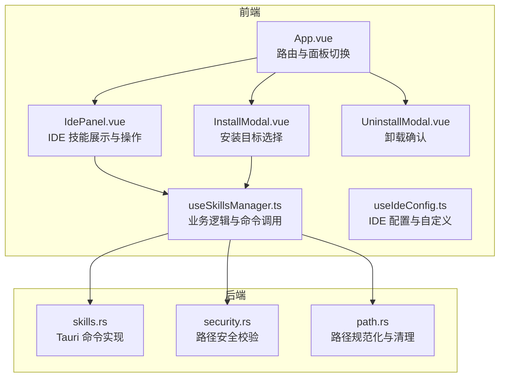
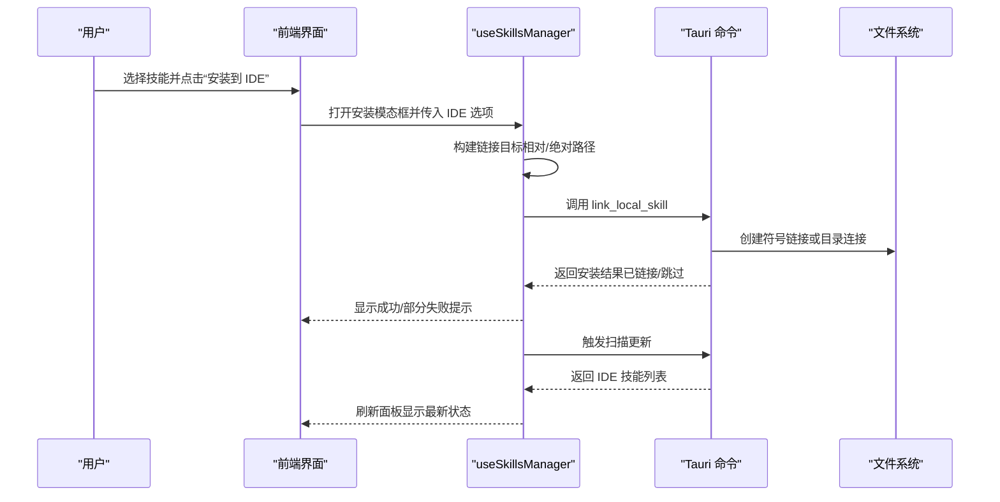
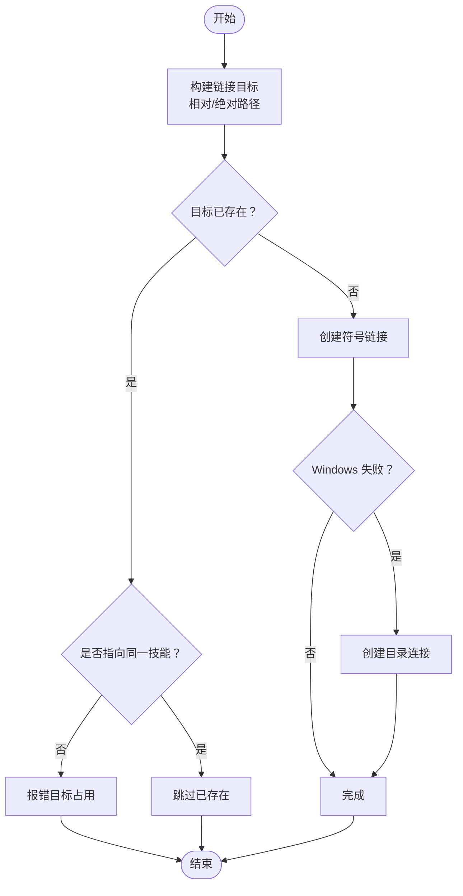
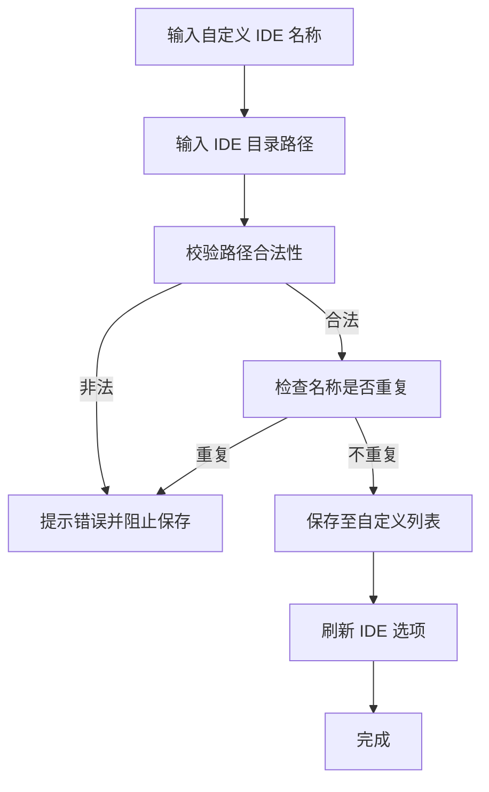
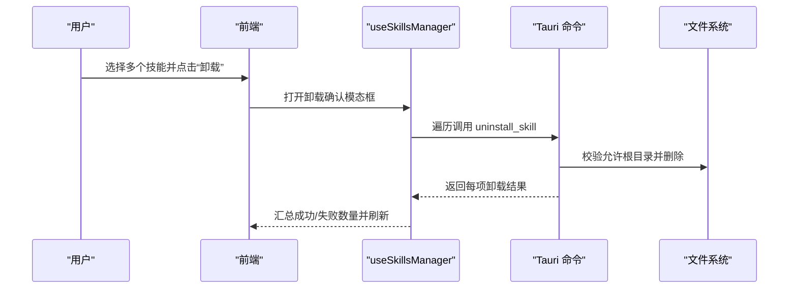
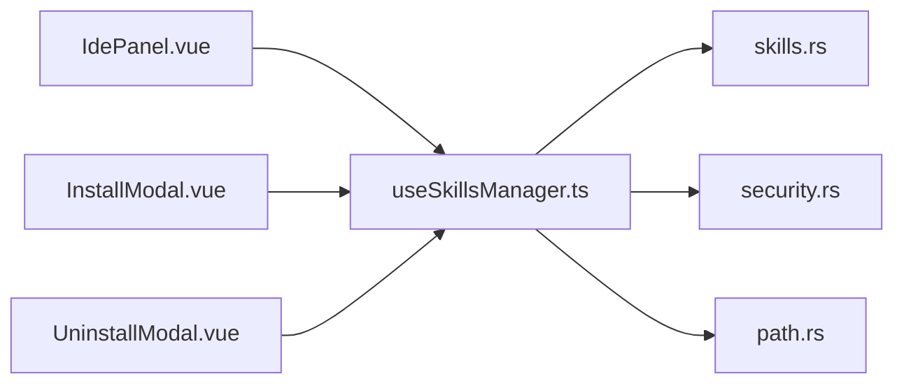

# IDE 集成

<cite>
**本文引用的文件**
- [src/composables/useIdeConfig.ts](file://src/composables/useIdeConfig.ts)
- [src/composables/constants.ts](file://src/composables/constants.ts)
- [src/composables/utils.ts](file://src/composables/utils.ts)
- [src-tauri/src/commands/skills.rs](file://src-tauri/src/commands/skills.rs)
- [src-tauri/src/utils/security.rs](file://src-tauri/src/utils/security.rs)
- [src-tauri/src/utils/path.rs](file://src-tauri/src/utils/path.rs)
- [src/components/IdePanel.vue](file://src/components/IdePanel.vue)
- [src/components/InstallModal.vue](file://src/components/InstallModal.vue)
- [src/components/UninstallModal.vue](file://src/components/UninstallModal.vue)
- [src/composables/useSkillsManager.ts](file://src/composables/useSkillsManager.ts)
- [src/composables/types.ts](file://src/composables/types.ts)
- [src/App.vue](file://src/App.vue)
- [src/composables/useProjectConfig.ts](file://src/composables/useProjectConfig.ts)
</cite>

## 目录
1. [简介](#简介)
2. [项目结构](#项目结构)
3. [核心组件](#核心组件)
4. [架构总览](#架构总览)
5. [详细组件分析](#详细组件分析)
6. [依赖关系分析](#依赖关系分析)
7. [性能考量](#性能考量)
8. [故障排查指南](#故障排查指南)
9. [结论](#结论)
10. [附录：IDE 配置与操作步骤](#附录ide-配置与操作步骤)

## 简介
本指南面向使用“技能管理器”的用户，聚焦于 IDE 集成功能，帮助您完成以下目标：
- 将本地技能链接到不同 IDE 的全局或项目目录
- 自定义 IDE 配置，添加自定义 IDE 类型并配置其路径
- 安全地卸载已安装的技能，支持单个与批量操作，并进行结果验证
- 在 VS Code、IntelliJ IDEA、Sublime Text 等主流 IDE 中正确配置与使用

通过本指南，您将掌握符号链接管理、自定义 IDE 支持、安全卸载以及各主流 IDE 的具体配置步骤。

## 项目结构
IDE 集成功能由前端 Vue 组件与后端 Tauri 命令共同实现，核心交互如下：
- 前端负责 UI 展示、用户输入、状态管理与调用后端命令
- 后端负责扫描、链接、卸载、采用（adopt）等文件系统操作，并执行安全校验

图表来源
- [src/App.vue:324-344](file://src/App.vue#L324-L344)
- [src/components/IdePanel.vue:1-198](file://src/components/IdePanel.vue#L1-L198)
- [src/components/InstallModal.vue:1-150](file://src/components/InstallModal.vue#L1-L150)
- [src/components/UninstallModal.vue:1-37](file://src/components/UninstallModal.vue#L1-L37)
- [src/composables/useSkillsManager.ts:353-374](file://src/composables/useSkillsManager.ts#L353-L374)
- [src-tauri/src/commands/skills.rs:355-449](file://src-tauri/src/commands/skills.rs#L355-L449)
- [src-tauri/src/utils/security.rs:63-70](file://src-tauri/src/utils/security.rs#L63-L70)
- [src-tauri/src/utils/path.rs:21-34](file://src-tauri/src/utils/path.rs#L21-L34)

章节来源
- [src/App.vue:324-344](file://src/App.vue#L324-L344)
- [src/components/IdePanel.vue:1-198](file://src/components/IdePanel.vue#L1-L198)
- [src/components/InstallModal.vue:1-150](file://src/components/InstallModal.vue#L1-L150)
- [src/components/UninstallModal.vue:1-37](file://src/components/UninstallModal.vue#L1-L37)
- [src/composables/useSkillsManager.ts:353-374](file://src/composables/useSkillsManager.ts#L353-L374)
- [src-tauri/src/commands/skills.rs:355-449](file://src-tauri/src/commands/skills.rs#L355-L449)
- [src-tauri/src/utils/security.rs:63-70](file://src-tauri/src/utils/security.rs#L63-L70)
- [src-tauri/src/utils/path.rs:21-34](file://src-tauri/src/utils/path.rs#L21-L34)

## 核心组件
- IDE 配置管理（useIdeConfig）
  - 负责加载/保存 IDE 选项、自定义 IDE、最后安装目标等
  - 提供刷新、新增自定义 IDE、删除自定义 IDE 的能力
- 技能管理器（useSkillsManager）
  - 负责扫描本地与 IDE 目录、构建链接目标、调用后端命令、处理安装/卸载/采用流程
  - 提供批量安装、批量卸载、批量采用等高级操作
- 前端面板与对话框
  - IdePanel：展示 IDE 技能卡片、筛选、打开目录、卸载、采用
  - InstallModal：选择 IDE 或项目作为安装目标
  - UninstallModal：确认卸载动作
- 后端命令与工具
  - skills.rs：实现链接、扫描、卸载、采用、导入导出等命令
  - security.rs：路径合法性与安全性校验
  - path.rs：路径规范化、去冗余、保留名处理

章节来源
- [src/composables/useIdeConfig.ts:59-130](file://src/composables/useIdeConfig.ts#L59-L130)
- [src/composables/useSkillsManager.ts:146-148](file://src/composables/useSkillsManager.ts#L146-L148)
- [src/components/IdePanel.vue:1-198](file://src/components/IdePanel.vue#L1-L198)
- [src/components/InstallModal.vue:1-150](file://src/components/InstallModal.vue#L1-L150)
- [src/components/UninstallModal.vue:1-37](file://src/components/UninstallModal.vue#L1-L37)
- [src-tauri/src/commands/skills.rs:355-449](file://src-tauri/src/commands/skills.rs#L355-L449)
- [src-tauri/src/utils/security.rs:63-70](file://src-tauri/src/utils/security.rs#L63-L70)
- [src-tauri/src/utils/path.rs:21-34](file://src-tauri/src/utils/path.rs#L21-L34)

## 架构总览
IDE 集成的端到端流程如下：

图表来源
- [src/components/InstallModal.vue:40-56](file://src/components/InstallModal.vue#L40-L56)
- [src/composables/useSkillsManager.ts:376-398](file://src/composables/useSkillsManager.ts#L376-L398)
- [src-tauri/src/commands/skills.rs:355-449](file://src-tauri/src/commands/skills.rs#L355-L449)

章节来源
- [src/components/InstallModal.vue:40-56](file://src/components/InstallModal.vue#L40-L56)
- [src/composables/useSkillsManager.ts:376-398](file://src/composables/useSkillsManager.ts#L376-L398)
- [src-tauri/src/commands/skills.rs:355-449](file://src-tauri/src/commands/skills.rs#L355-L449)

## 详细组件分析

### 符号链接管理与状态监控
- 链接策略
  - 对于每个目标 IDE，根据其配置生成链接目标路径（相对路径会与家目录拼接；绝对路径直接使用）
  - 若目标存在且指向同一技能，则跳过；否则尝试创建符号链接，Windows 下回退为目录连接
- 状态识别
  - IDE 技能卡片包含来源标识（本地或链接），未被管理的技能以特殊样式提示
  - 采用（Adopt）操作可将外部 IDE 技能纳入管理器统一管理，并重建链接
- 卸载与安全
  - 卸载时限定允许根目录，防止误删系统关键目录
  - 支持单个与批量卸载，卸载后自动刷新状态

图表来源
- [src/composables/useSkillsManager.ts:167-188](file://src/composables/useSkillsManager.ts#L167-L188)
- [src-tauri/src/commands/skills.rs:400-449](file://src-tauri/src/commands/skills.rs#L400-L449)

章节来源
- [src/composables/useSkillsManager.ts:167-188](file://src/composables/useSkillsManager.ts#L167-L188)
- [src-tauri/src/commands/skills.rs:400-449](file://src-tauri/src/commands/skills.rs#L400-L449)
- [src/components/IdePanel.vue:154-196](file://src/components/IdePanel.vue#L154-L196)

### 自定义 IDE 支持
- 添加自定义 IDE
  - 输入名称与 IDE 目录路径，路径需通过安全校验（相对路径不越界；绝对路径合法且非危险）
  - 名称不可重复，保存后刷新选项列表
- 删除自定义 IDE
  - 从自定义列表移除，不影响默认 IDE
- 最后安装目标
  - 记录上次选择的 IDE，便于快速复用

图表来源
- [src/composables/useIdeConfig.ts:76-104](file://src/composables/useIdeConfig.ts#L76-L104)
- [src/composables/utils.ts:97-99](file://src/composables/utils.ts#L97-L99)

章节来源
- [src/composables/useIdeConfig.ts:76-104](file://src/composables/useIdeConfig.ts#L76-L104)
- [src/composables/utils.ts:97-99](file://src/composables/utils.ts#L97-L99)
- [src/composables/constants.ts:24-30](file://src/composables/constants.ts#L24-L30)

### 安全卸载与批量操作
- 安全校验
  - 仅允许在允许的根目录内卸载（含 IDE 全局目录与项目目录）
  - 卸载前会逐项校验路径归属，失败项单独统计
- 批量卸载
  - 支持多选技能或多个路径，统一弹窗确认
  - 成功/失败分别计数，完成后统一提示
- 结果验证
  - 卸载后触发扫描，面板即时反映状态变化

图表来源
- [src/components/UninstallModal.vue:1-37](file://src/components/UninstallModal.vue#L1-L37)
- [src/composables/useSkillsManager.ts:568-624](file://src/composables/useSkillsManager.ts#L568-L624)
- [src-tauri/src/commands/skills.rs:537-609](file://src-tauri/src/commands/skills.rs#L537-L609)

章节来源
- [src/components/UninstallModal.vue:1-37](file://src/components/UninstallModal.vue#L1-L37)
- [src/composables/useSkillsManager.ts:568-624](file://src/composables/useSkillsManager.ts#L568-L624)
- [src-tauri/src/commands/skills.rs:537-609](file://src-tauri/src/commands/skills.rs#L537-L609)

### IDE 技能面板与操作
- 技能卡片
  - 展示名称、来源（本地/链接）、是否被管理
  - 支持一键打开目录、采用（将外部技能纳入管理器）、卸载
- 批量操作
  - 全选/反选、批量采用、批量卸载
- 过滤与自定义
  - 顶部按 IDE 分类过滤
  - 支持添加/删除自定义 IDE

章节来源
- [src/components/IdePanel.vue:1-198](file://src/components/IdePanel.vue#L1-L198)
- [src/composables/useSkillsManager.ts:146-148](file://src/composables/useSkillsManager.ts#L146-L148)

## 依赖关系分析
- 前端依赖
  - useIdeConfig：提供 IDE 选项与自定义能力
  - useSkillsManager：封装命令调用、状态管理、批量操作
  - Vue 组件：IdePanel、InstallModal、UninstallModal
- 后端依赖
  - commands/skills.rs：实现扫描、链接、卸载、采用等命令
  - utils/security.rs：路径合法性与安全性校验
  - utils/path.rs：路径规范化、去冗余、保留名处理

图表来源
- [src/components/IdePanel.vue:1-198](file://src/components/IdePanel.vue#L1-L198)
- [src/components/InstallModal.vue:1-150](file://src/components/InstallModal.vue#L1-L150)
- [src/components/UninstallModal.vue:1-37](file://src/components/UninstallModal.vue#L1-L37)
- [src/composables/useSkillsManager.ts:353-374](file://src/composables/useSkillsManager.ts#L353-L374)
- [src-tauri/src/commands/skills.rs:355-449](file://src-tauri/src/commands/skills.rs#L355-L449)
- [src-tauri/src/utils/security.rs:63-70](file://src-tauri/src/utils/security.rs#L63-L70)
- [src-tauri/src/utils/path.rs:21-34](file://src-tauri/src/utils/path.rs#L21-L34)

章节来源
- [src/components/IdePanel.vue:1-198](file://src/components/IdePanel.vue#L1-L198)
- [src/components/InstallModal.vue:1-150](file://src/components/InstallModal.vue#L1-L150)
- [src/components/UninstallModal.vue:1-37](file://src/components/UninstallModal.vue#L1-L37)
- [src/composables/useSkillsManager.ts:353-374](file://src/composables/useSkillsManager.ts#L353-L374)
- [src-tauri/src/commands/skills.rs:355-449](file://src-tauri/src/commands/skills.rs#L355-L449)
- [src-tauri/src/utils/security.rs:63-70](file://src-tauri/src/utils/security.rs#L63-L70)
- [src-tauri/src/utils/path.rs:21-34](file://src-tauri/src/utils/path.rs#L21-L34)

## 性能考量
- 扫描与缓存
  - 市场搜索结果具备时间戳缓存，减少重复请求
  - IDE 技能扫描在必要时触发，避免频繁 IO
- 批量操作
  - 安装/卸载/采用均支持批量，减少多次往返
- 路径处理
  - 使用规范化与去冗余算法，降低路径解析成本

章节来源
- [src/composables/useSkillsManager.ts:20-27](file://src/composables/useSkillsManager.ts#L20-L27)
- [src/composables/useSkillsManager.ts:353-374](file://src/composables/useSkillsManager.ts#L353-L374)

## 故障排查指南
- 无法创建链接
  - 检查目标路径是否为相对路径且不越界，或绝对路径是否合法
  - Windows 下若符号链接失败，系统会尝试目录连接；如仍失败，请检查权限与路径字符
- 路径无效或被拒绝
  - 确保路径符合安全规则（不包含危险目录、不使用保留名、不包含控制字符）
- 卸载失败
  - 确认目标路径位于允许根目录内；若部分失败，系统会返回成功/失败计数
- 采用失败
  - 若目标不含技能元数据，采用会失败；请先确保目标包含有效技能文件

章节来源
- [src/composables/utils.ts:97-99](file://src/composables/utils.ts#L97-L99)
- [src-tauri/src/utils/security.rs:63-70](file://src-tauri/src/utils/security.rs#L63-L70)
- [src-tauri/src/commands/skills.rs:400-449](file://src-tauri/src/commands/skills.rs#L400-L449)
- [src-tauri/src/commands/skills.rs:640-725](file://src-tauri/src/commands/skills.rs#L640-L725)

## 结论
本指南覆盖了 IDE 集成的核心能力：符号链接管理、自定义 IDE 支持、安全卸载与批量操作，并提供了与主流 IDE 的配置思路。通过前端面板与后端命令的协同，用户可以高效地在不同 IDE 间共享与管理技能，同时确保路径安全与操作可控。

## 附录：IDE 配置与操作步骤

### 通用配置步骤
- 打开“IDE”标签页，查看当前 IDE 技能列表
- 如需添加自定义 IDE：
  - 在“添加自定义 IDE”区域输入名称与目录路径
  - 点击“添加”，系统将校验路径并保存
- 选择技能并安装到 IDE：
  - 在“本地”或“市场”中选择技能
  - 点击“安装到 IDE”，在弹窗中勾选目标 IDE 并确认
- 卸载技能：
  - 在“IDE”标签页中选择技能，点击“卸载”
  - 在确认弹窗中再次确认，系统将逐项校验并卸载

章节来源
- [src/components/IdePanel.vue:1-198](file://src/components/IdePanel.vue#L1-L198)
- [src/components/InstallModal.vue:40-56](file://src/components/InstallModal.vue#L40-L56)
- [src/components/UninstallModal.vue:1-37](file://src/components/UninstallModal.vue#L1-L37)
- [src/composables/useIdeConfig.ts:76-104](file://src/composables/useIdeConfig.ts#L76-L104)

### VS Code 配置要点
- 全局目录
  - 默认路径通常为用户家目录下的特定子目录
  - 可通过“自定义 IDE”添加或修改 VS Code 的技能目录
- 安装与验证
  - 安装后在 VS Code 的技能目录中应能看到符号链接或复制的技能内容
  - 若未出现，检查路径合法性与权限

章节来源
- [src/composables/constants.ts:17-18](file://src/composables/constants.ts#L17-L18)
- [src/composables/useIdeConfig.ts:76-104](file://src/composables/useIdeConfig.ts#L76-L104)

### IntelliJ IDEA 配置要点
- 全局目录
  - IDEA 的技能目录通常位于用户家目录的隐藏配置目录下
  - 可通过“自定义 IDE”添加或修改 IDEA 的技能目录
- 安装与验证
  - 安装后在 IDEA 的技能目录中应可见对应技能
  - 若为 Windows 系统，注意符号链接与目录连接的差异

章节来源
- [src/composables/constants.ts:10-17](file://src/composables/constants.ts#L10-L17)
- [src-tauri/src/commands/skills.rs:400-449](file://src-tauri/src/commands/skills.rs#L400-L449)

### Sublime Text 配置要点
- 全局目录
  - Sublime Text 的技能目录通常位于用户家目录的特定子目录
  - 可通过“自定义 IDE”添加或修改 Sublime Text 的技能目录
- 安装与验证
  - 安装后在 Sublime Text 的技能目录中应可见对应技能
  - 注意路径字符与保留名限制

章节来源
- [src/composables/constants.ts:1-19](file://src/composables/constants.ts#L1-L19)
- [src/composables/utils.ts:97-99](file://src/composables/utils.ts#L97-L99)

### 项目级技能链接（多 IDE 支持）
- 添加项目
  - 在“项目”面板中添加项目并配置 IDE 目标
- 链接技能到项目
  - 在“本地”或“市场”中选择技能，点击“安装到项目”
  - 在弹窗中勾选项目与 IDE 目标，确认后系统将批量链接
- 验证
  - 切换到“IDE”标签页，按 IDE 过滤查看项目中的技能

章节来源
- [src/composables/useProjectConfig.ts:47-67](file://src/composables/useProjectConfig.ts#L47-L67)
- [src/composables/useSkillsManager.ts:414-499](file://src/composables/useSkillsManager.ts#L414-L499)
- [src-tauri/src/commands/skills.rs:501-535](file://src-tauri/src/commands/skills.rs#L501-L535)