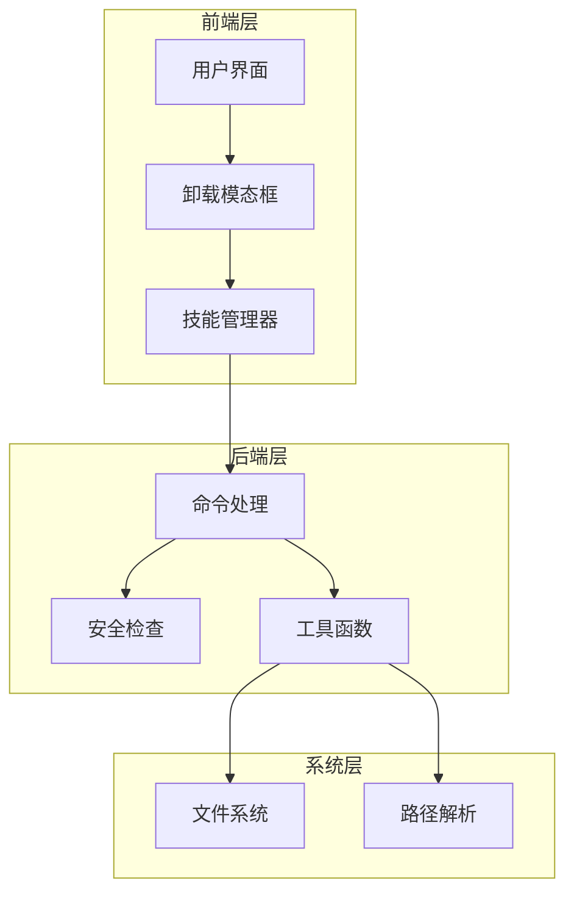
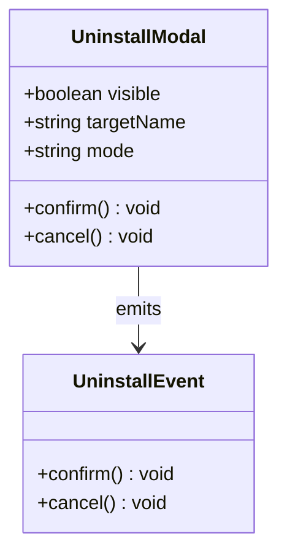
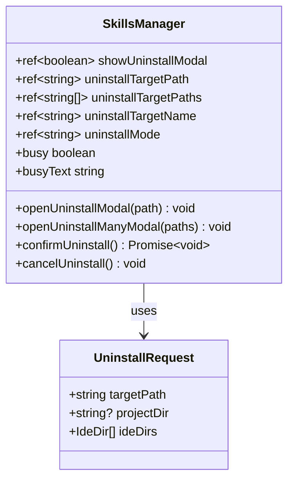
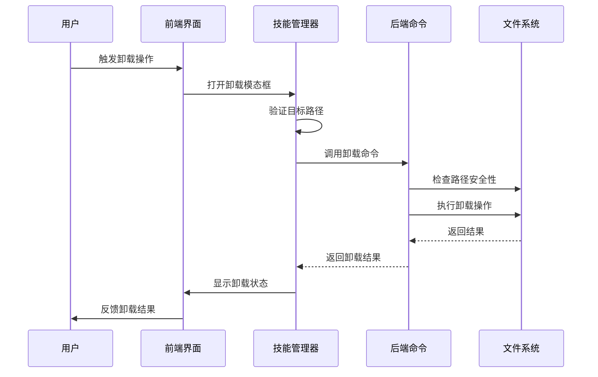
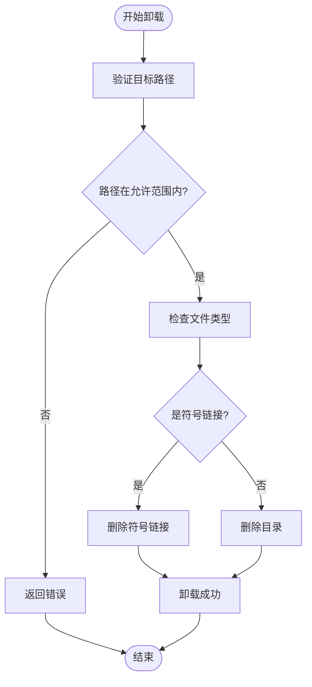
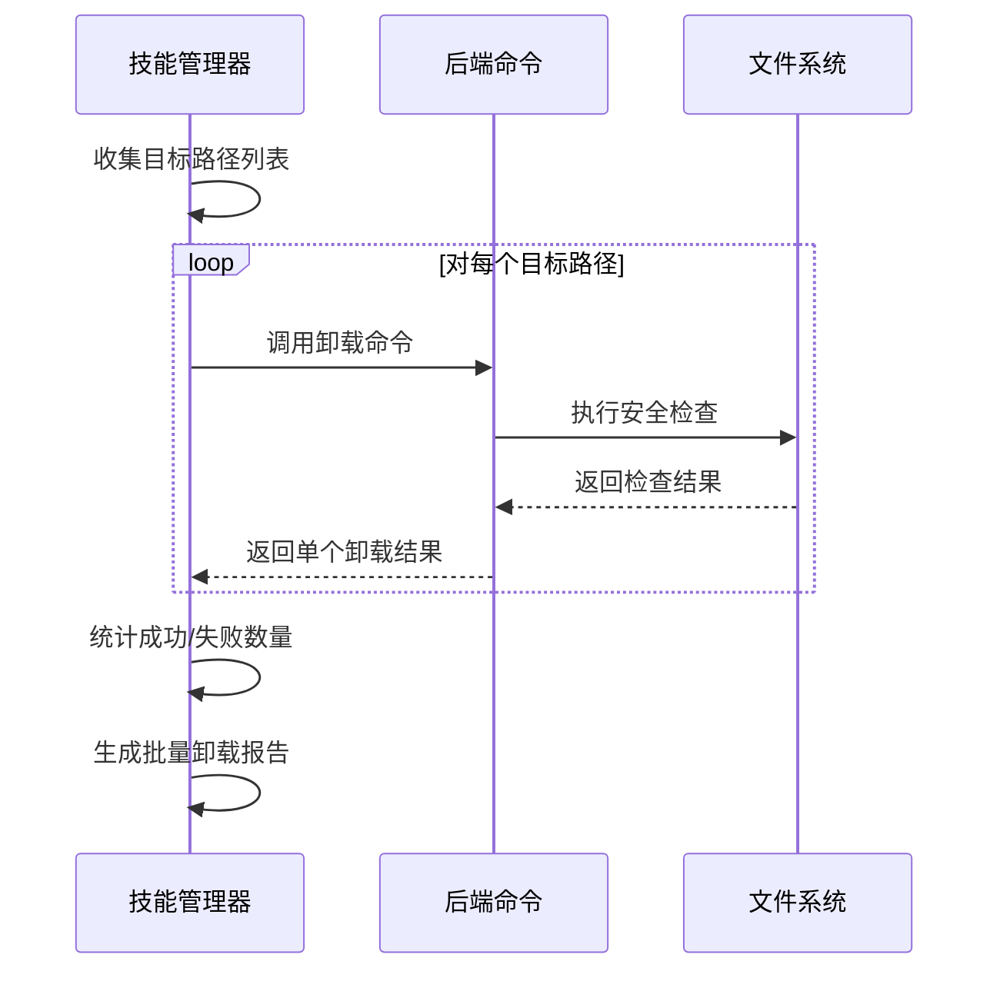
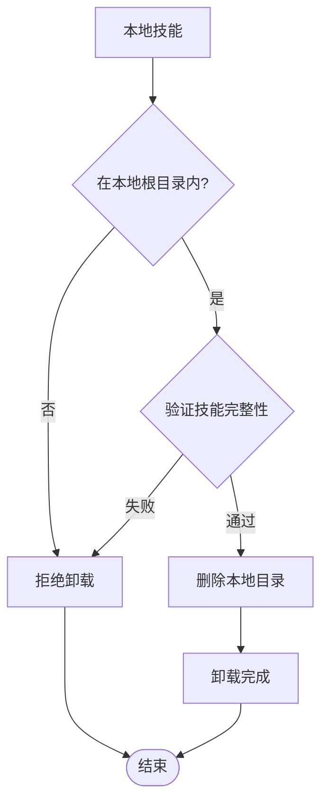
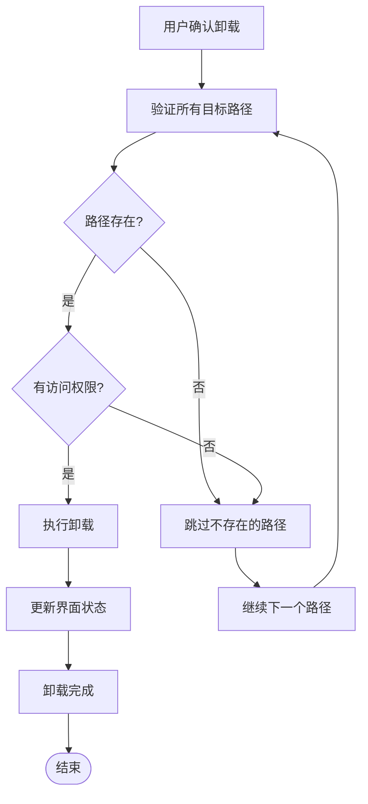
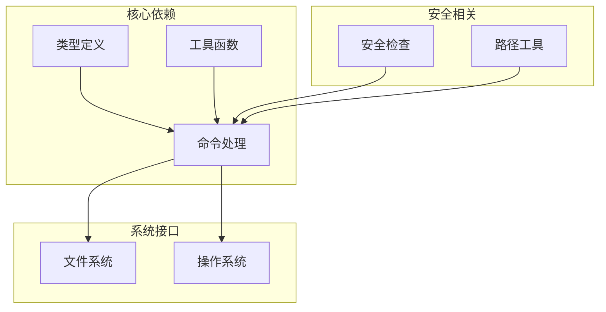

# 安全卸载

<cite>
**本文档引用的文件**
- [UninstallModal.vue](file://src/components/UninstallModal.vue)
- [useSkillsManager.ts](file://src/composables/useSkillsManager.ts)
- [skills.rs](file://src-tauri/src/commands/skills.rs)
- [security.rs](file://src-tauri/src/utils/security.rs)
- [path.rs](file://src-tauri/src/utils/path.rs)
- [types.ts](file://src/composables/types.ts)
- [types.rs](file://src-tauri/src/types.rs)
- [README.md](file://README.md)
</cite>

## 目录
1. [简介](#简介)
2. [项目结构](#项目结构)
3. [核心组件](#核心组件)
4. [架构概览](#架构概览)
5. [详细组件分析](#详细组件分析)
6. [依赖关系分析](#依赖关系分析)
7. [性能考虑](#性能考虑)
8. [故障排除指南](#故障排除指南)
9. [结论](#结论)

## 简介

安全卸载功能是 Skills Manager 的核心特性之一，它提供了对 AI 技能进行安全、可靠卸载的能力。该功能支持多种技能类型（本地技能、链接技能、管理技能），并实现了完善的安全检查机制、批量卸载操作、错误恢复和验证流程。

本指南将详细介绍安全卸载的完整工作流程，包括安全检查机制、批量操作实现、结果验证、不同技能类型的处理策略，以及最佳实践和注意事项。

## 项目结构

Skills Manager 采用前后端分离的架构设计，安全卸载功能分布在多个层次中：

**图表来源**
- [useSkillsManager.ts:542-624](file://src/composables/useSkillsManager.ts#L542-L624)
- [skills.rs:538-609](file://src-tauri/src/commands/skills.rs#L538-L609)

**章节来源**
- [useSkillsManager.ts:1-867](file://src/composables/useSkillsManager.ts#L1-L867)
- [skills.rs:1-847](file://src-tauri/src/commands/skills.rs#L1-L847)

## 核心组件

### 卸载模态框组件

卸载模态框是用户交互的核心界面，提供了安全卸载的确认机制：

**图表来源**
- [UninstallModal.vue:4-13](file://src/components/UninstallModal.vue#L4-L13)

### 技能管理器

技能管理器负责协调整个卸载过程，包括批量处理和错误管理：

**图表来源**
- [useSkillsManager.ts:542-631](file://src/composables/useSkillsManager.ts#L542-L631)

**章节来源**
- [UninstallModal.vue:1-37](file://src/components/UninstallModal.vue#L1-L37)
- [useSkillsManager.ts:542-631](file://src/composables/useSkillsManager.ts#L542-L631)

## 架构概览

安全卸载功能的完整架构如下：

**图表来源**
- [useSkillsManager.ts:568-624](file://src/composables/useSkillsManager.ts#L568-L624)
- [skills.rs:538-609](file://src-tauri/src/commands/skills.rs#L538-L609)

## 详细组件分析

### 安全检查机制

安全卸载的核心在于多层次的安全检查：

#### 路径安全验证

系统实施严格的路径安全验证，确保卸载操作只在允许的范围内执行：

**图表来源**
- [skills.rs:583-609](file://src-tauri/src/commands/skills.rs#L583-L609)

#### IDE 路径验证

系统支持多种 IDE 的路径验证，包括绝对路径和相对路径：

**章节来源**
- [security.rs:63-70](file://src-tauri/src/utils/security.rs#L63-L70)
- [skills.rs:542-581](file://src-tauri/src/commands/skills.rs#L542-L581)

### 批量卸载操作

批量卸载功能提供了高效的一次性卸载多个技能的能力：

#### 批量处理流程

**图表来源**
- [useSkillsManager.ts:579-607](file://src/composables/useSkillsManager.ts#L579-L607)

#### 错误恢复机制

批量卸载实现了智能的错误恢复机制：

**章节来源**
- [useSkillsManager.ts:568-624](file://src/composables/useSkillsManager.ts#L568-L624)

### 不同技能类型的卸载策略

系统针对不同类型的技能实现了差异化的卸载策略：

#### 本地技能卸载

本地技能直接从本地存储中删除：

**图表来源**
- [skills.rs:728-758](file://src-tauri/src/commands/skills.rs#L728-L758)

#### 链接技能卸载

链接技能通过删除符号链接来实现卸载：

**章节来源**
- [skills.rs:583-609](file://src-tauri/src/commands/skills.rs#L583-L609)

#### 管理技能卸载

管理技能需要特殊的处理逻辑：

**章节来源**
- [skills.rs:640-725](file://src-tauri/src/commands/skills.rs#L640-L725)

### 卸载结果验证

系统提供了多层验证机制确保卸载操作的正确性：

#### 卸载确认

**图表来源**
- [useSkillsManager.ts:568-624](file://src/composables/useSkillsManager.ts#L568-L624)

#### 残留文件检测

系统会检测卸载后的残留文件：

**章节来源**
- [skills.rs:186-199](file://src-tauri/src/commands/skills.rs#L186-L199)

## 依赖关系分析

安全卸载功能涉及多个模块之间的复杂依赖关系：

**图表来源**
- [types.ts:1-119](file://src/composables/types.ts#L1-L119)
- [types.rs:110-166](file://src-tauri/src/types.rs#L110-L166)

**章节来源**
- [types.ts:1-119](file://src/composables/types.ts#L1-L119)
- [types.rs:110-166](file://src-tauri/src/types.rs#L110-L166)

## 性能考虑

安全卸载功能在设计时充分考虑了性能优化：

### 并行处理

批量卸载支持并行处理多个技能，提高整体效率：

### 缓存机制

系统使用缓存机制减少重复的文件系统检查：

### 内存管理

及时清理临时数据和定时器，防止内存泄漏：

## 故障排除指南

### 常见问题及解决方案

#### 路径权限错误

当遇到路径权限错误时，系统会返回详细的错误信息：

#### 符号链接损坏

如果符号链接损坏，系统会尝试修复或重新创建：

#### 文件锁定问题

当文件被其他进程占用时，系统会等待或提示用户关闭相关程序：

### 日志和调试

系统提供了完善的日志记录机制：

**章节来源**
- [useSkillsManager.ts:369-370](file://src/composables/useSkillsManager.ts#L369-L370)

## 结论

安全卸载功能通过多层次的安全检查、智能的批量处理、完善的错误恢复机制，为用户提供了可靠、高效的技能卸载体验。该功能不仅保证了系统的安全性，还提供了良好的用户体验，是 Skills Manager 的重要组成部分。

通过本文档的指导，用户可以更好地理解和使用安全卸载功能，避免误操作和数据丢失的风险，确保技能管理的安全性和可靠性。