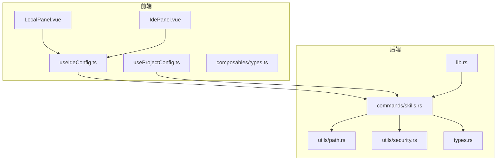
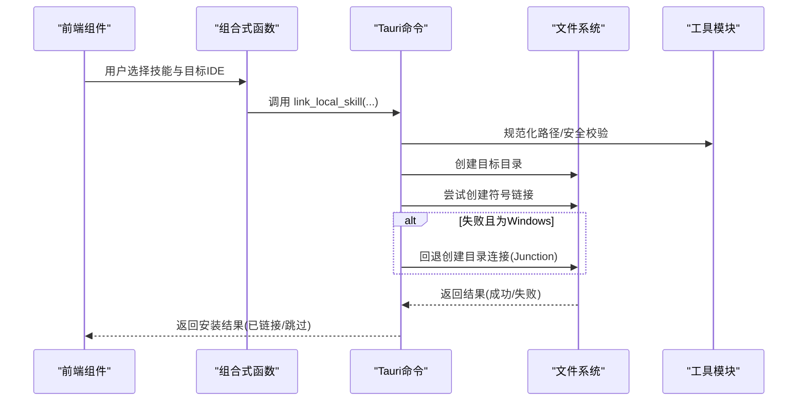
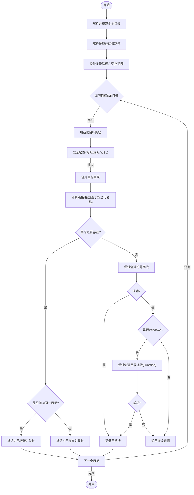
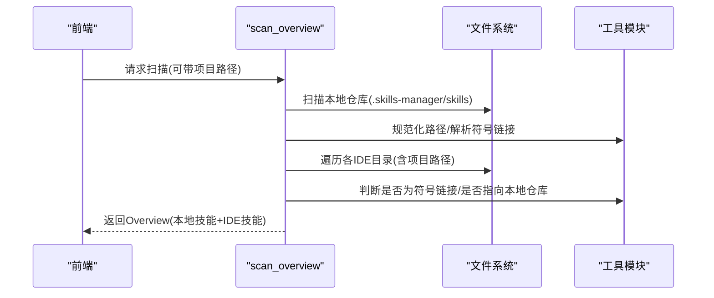
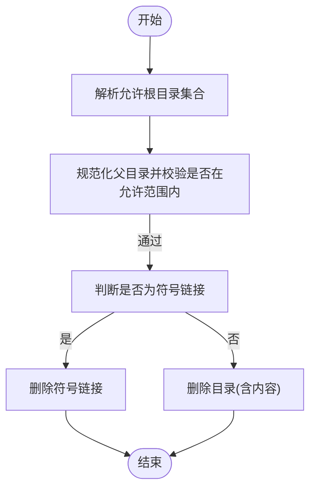
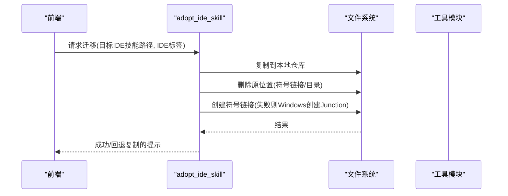
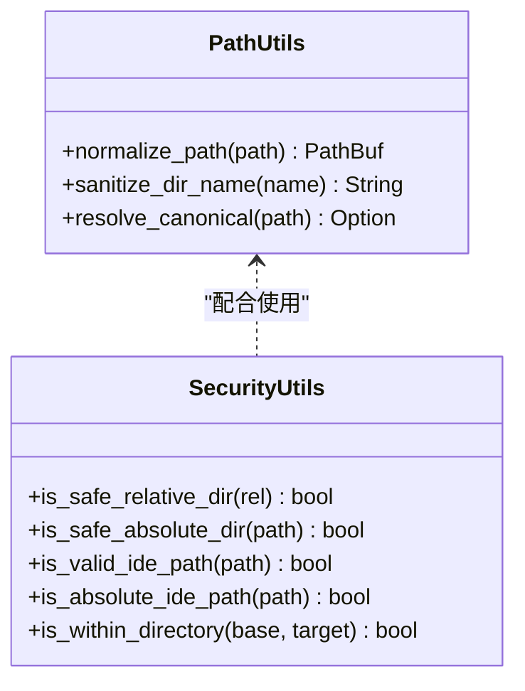
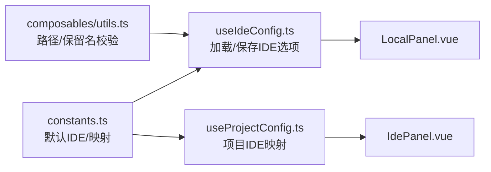
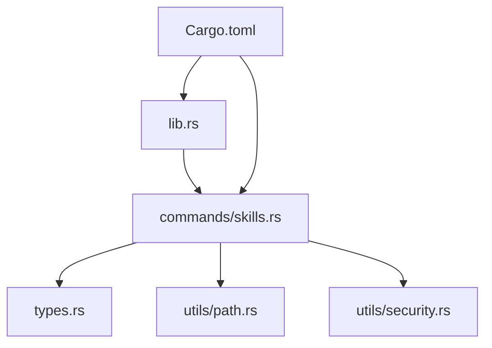
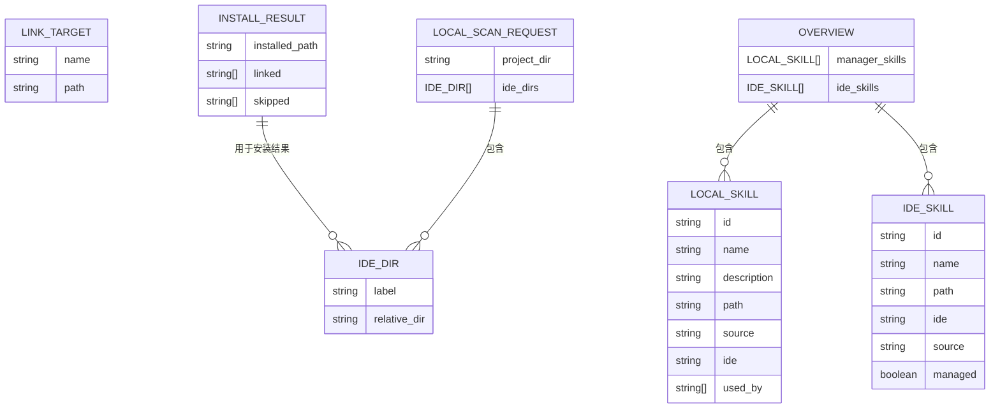

# 符号链接管理

<cite>
**本文引用的文件**
- [src-tauri/src/commands/skills.rs](file://src-tauri/src/commands/skills.rs)
- [src-tauri/src/utils/path.rs](file://src-tauri/src/utils/path.rs)
- [src-tauri/src/utils/security.rs](file://src-tauri/src/utils/security.rs)
- [src-tauri/src/types.rs](file://src-tauri/src/types.rs)
- [src-tauri/src/lib.rs](file://src-tauri/src/lib.rs)
- [src/composables/useIdeConfig.ts](file://src/composables/useIdeConfig.ts)
- [src/composables/utils.ts](file://src/composables/utils.ts)
- [src/composables/constants.ts](file://src/composables/constants.ts)
- [src/composables/useProjectConfig.ts](file://src/composables/useProjectConfig.ts)
- [src/composables/types.ts](file://src/composables/types.ts)
- [src/components/IdePanel.vue](file://src/components/IdePanel.vue)
- [src/components/LocalPanel.vue](file://src/components/LocalPanel.vue)
- [src-tauri/Cargo.toml](file://src-tauri/Cargo.toml)
- [README.md](file://README.md)
</cite>

## 目录
1. [简介](#简介)
2. [项目结构](#项目结构)
3. [核心组件](#核心组件)
4. [架构总览](#架构总览)
5. [详细组件分析](#详细组件分析)
6. [依赖关系分析](#依赖关系分析)
7. [性能与可靠性考量](#性能与可靠性考量)
8. [故障排查指南](#故障排查指南)
9. [结论](#结论)
10. [附录](#附录)

## 简介
本文件系统性阐述符号链接管理功能的设计与实现，覆盖以下主题：
- 符号链接的创建、维护与管理机制
- 技能链接到不同IDE的实现流程（路径计算、状态检测、有效性验证）
- 生命周期管理（创建、状态监控、异常处理、清理）
- 跨平台差异（Windows、macOS、Linux）及特殊处理
- 关键算法与实现策略的代码级说明与图示

该能力通过统一本地仓库（~/.skills-manager/skills）集中管理技能，并以符号链接方式将其挂载至各IDE的技能目录，从而实现“一处管理、多处使用”的高效工作流。

## 项目结构
符号链接管理涉及前后端协作：
- 前端（Vue + TypeScript）负责用户交互、IDE配置与项目配置、调用后端命令
- 后端（Rust + Tauri）负责路径规范化、安全校验、符号链接创建/删除、扫描与概览

**图表来源**
- [src/components/LocalPanel.vue:1-310](file://src/components/LocalPanel.vue#L1-L310)
- [src/components/IdePanel.vue:1-270](file://src/components/IdePanel.vue#L1-L270)
- [src/composables/useIdeConfig.ts:1-131](file://src/composables/useIdeConfig.ts#L1-L131)
- [src/composables/useProjectConfig.ts:1-128](file://src/composables/useProjectConfig.ts#L1-L128)
- [src-tauri/src/commands/skills.rs:1-847](file://src-tauri/src/commands/skills.rs#L1-L847)
- [src-tauri/src/utils/path.rs:1-90](file://src-tauri/src/utils/path.rs#L1-L90)
- [src-tauri/src/utils/security.rs:1-92](file://src-tauri/src/utils/security.rs#L1-L92)
- [src-tauri/src/types.rs:1-214](file://src-tauri/src/types.rs#L1-L214)
- [src-tauri/src/lib.rs:1-54](file://src-tauri/src/lib.rs#L1-L54)

**章节来源**
- [src-tauri/src/lib.rs:1-54](file://src-tauri/src/lib.rs#L1-L54)
- [src-tauri/src/commands/skills.rs:1-847](file://src-tauri/src/commands/skills.rs#L1-L847)
- [src-tauri/src/utils/path.rs:1-90](file://src-tauri/src/utils/path.rs#L1-L90)
- [src-tauri/src/utils/security.rs:1-92](file://src-tauri/src/utils/security.rs#L1-L92)
- [src/composables/useIdeConfig.ts:1-131](file://src/composables/useIdeConfig.ts#L1-L131)
- [src/composables/useProjectConfig.ts:1-128](file://src/composables/useProjectConfig.ts#L1-L128)
- [src/components/LocalPanel.vue:1-310](file://src/components/LocalPanel.vue#L1-L310)
- [src/components/IdePanel.vue:1-270](file://src/components/IdePanel.vue#L1-L270)

## 核心组件
- 命令层（Rust）：提供符号链接相关命令（创建、扫描、卸载、迁移等），并进行路径规范化与安全校验
- 工具层（Rust）：路径标准化、规范化、安全路径判断、Windows前缀处理
- 类型定义（Rust/TS）：统一请求/响应数据结构，确保前后端契约一致
- 前端组合式函数（TS）：IDE选项管理、项目IDE目录映射、路径合法性校验
- 前端组件（Vue）：展示本地/IDE技能列表、操作面板与交互

**章节来源**
- [src-tauri/src/commands/skills.rs:1-847](file://src-tauri/src/commands/skills.rs#L1-L847)
- [src-tauri/src/utils/path.rs:1-90](file://src-tauri/src/utils/path.rs#L1-L90)
- [src-tauri/src/utils/security.rs:1-92](file://src-tauri/src/utils/security.rs#L1-L92)
- [src-tauri/src/types.rs:1-214](file://src-tauri/src/types.rs#L1-L214)
- [src/composables/useIdeConfig.ts:1-131](file://src/composables/useIdeConfig.ts#L1-L131)
- [src/composables/utils.ts:1-125](file://src/composables/utils.ts#L1-L125)
- [src/composables/useProjectConfig.ts:1-128](file://src/composables/useProjectConfig.ts#L1-L128)
- [src/composables/types.ts:1-119](file://src/composables/types.ts#L1-L119)

## 架构总览
符号链接管理的端到端流程如下：

**图表来源**
- [src-tauri/src/commands/skills.rs:355-449](file://src-tauri/src/commands/skills.rs#L355-L449)
- [src-tauri/src/utils/path.rs:21-34](file://src-tauri/src/utils/path.rs#L21-L34)
- [src-tauri/src/utils/security.rs:62-70](file://src-tauri/src/utils/security.rs#L62-L70)

**章节来源**
- [src-tauri/src/commands/skills.rs:355-449](file://src-tauri/src/commands/skills.rs#L355-L449)
- [src/composables/useIdeConfig.ts:1-131](file://src/composables/useIdeConfig.ts#L1-L131)
- [src/composables/useProjectConfig.ts:100-114](file://src/composables/useProjectConfig.ts#L100-L114)

## 详细组件分析

### 命令：link_local_skill（创建符号链接）
职责与流程：
- 解析并规范化用户主目录与技能存储根路径
- 校验本地技能路径必须位于受控范围内
- 规范化每个目标IDE目录，确保不越权
- 计算链接目标路径（按技能名安全化后的目录名）
- 检测目标是否存在，若已存在则进一步判断是否为同一目标（避免重复链接）
- 优先尝试创建符号链接；在Windows上若失败则回退到目录连接（Junction）
- 返回已链接与跳过的条目清单

关键算法要点：
- 路径规范化：去除当前/父目录组件，剥离Windows verbatim 前缀，统一斜杠
- 安全校验：仅允许相对安全的相对路径与绝对路径（含WSL UNC），禁止危险系统路径
- 链接一致性：通过规范化的绝对路径比较，避免因前缀差异导致误判

**图表来源**
- [src-tauri/src/commands/skills.rs:355-449](file://src-tauri/src/commands/skills.rs#L355-L449)
- [src-tauri/src/utils/path.rs:21-34](file://src-tauri/src/utils/path.rs#L21-L34)
- [src-tauri/src/utils/security.rs:62-70](file://src-tauri/src/utils/security.rs#L62-L70)

**章节来源**
- [src-tauri/src/commands/skills.rs:355-449](file://src-tauri/src/commands/skills.rs#L355-L449)
- [src-tauri/src/utils/path.rs:21-34](file://src-tauri/src/utils/path.rs#L21-L34)
- [src-tauri/src/utils/security.rs:62-70](file://src-tauri/src/utils/security.rs#L62-L70)

### 命令：scan_overview（扫描与概览）
职责与流程：
- 扫描统一本地仓库中的技能
- 收集各IDE目录中的符号链接与本地目录，识别“被管理”状态
- 对于项目级扫描，支持在项目根下按IDE映射路径进行二次扫描
- 输出统一的概览结构，包含本地技能与IDE中技能的来源与管理状态

关键点：
- 使用“规范化+规范绝对路径”对比，准确识别符号链接的目标
- 将本地仓库中的技能与其在IDE中的链接建立“被使用方”关联

**图表来源**
- [src-tauri/src/commands/skills.rs:452-535](file://src-tauri/src/commands/skills.rs#L452-L535)
- [src-tauri/src/utils/path.rs:85-89](file://src-tauri/src/utils/path.rs#L85-L89)

**章节来源**
- [src-tauri/src/commands/skills.rs:452-535](file://src-tauri/src/commands/skills.rs#L452-L535)

### 命令：uninstall_skill（卸载/删除）
职责与流程：
- 校验目标路径必须位于允许的根目录集合内（含IDE目录与项目路径）
- 若目标为符号链接，删除符号链接；若为目录，则递归删除
- 严格限制删除范围，防止误删

**图表来源**
- [src-tauri/src/commands/skills.rs:537-609](file://src-tauri/src/commands/skills.rs#L537-L609)

**章节来源**
- [src-tauri/src/commands/skills.rs:537-609](file://src-tauri/src/commands/skills.rs#L537-L609)

### 命令：adopt_ide_skill（迁移并重链）
职责与流程：
- 将IDE中的技能迁移到本地仓库（复制）
- 删除原位置（可能是符号链接或物理目录）
- 在原位置重新创建符号链接（优先；Windows回退到Junction）

**图表来源**
- [src-tauri/src/commands/skills.rs:639-725](file://src-tauri/src/commands/skills.rs#L639-L725)

**章节来源**
- [src-tauri/src/commands/skills.rs:639-725](file://src-tauri/src/commands/skills.rs#L639-L725)

### 路径与安全工具
- 路径规范化：剥离Windows verbatim 前缀，标准化组件序列
- 名称安全化：将技能名转换为安全的目录名（小写、替换非法字符、Windows保留名前缀处理）
- 绝对/相对路径安全校验：支持Unix绝对路径、Windows绝对路径、WSL UNC路径，同时阻止危险系统路径
- 连接一致性判断：通过规范化绝对路径比较，确保跨平台一致性

**图表来源**
- [src-tauri/src/utils/path.rs:21-89](file://src-tauri/src/utils/path.rs#L21-L89)
- [src-tauri/src/utils/security.rs:3-91](file://src-tauri/src/utils/security.rs#L3-L91)

**章节来源**
- [src-tauri/src/utils/path.rs:1-90](file://src-tauri/src/utils/path.rs#L1-L90)
- [src-tauri/src/utils/security.rs:1-92](file://src-tauri/src/utils/security.rs#L1-L92)

### 前端配置与交互
- IDE选项管理：默认IDE列表、自定义IDE增删、持久化存储
- 项目IDE目录映射：根据项目路径动态生成IDE目录链接目标
- 路径合法性校验：前端侧对相对/绝对路径与Windows保留名进行预检

**图表来源**
- [src/composables/constants.ts:6-71](file://src/composables/constants.ts#L6-L71)
- [src/composables/useIdeConfig.ts:1-131](file://src/composables/useIdeConfig.ts#L1-L131)
- [src/composables/useProjectConfig.ts:100-114](file://src/composables/useProjectConfig.ts#L100-L114)
- [src/composables/utils.ts:34-99](file://src/composables/utils.ts#L34-L99)
- [src/components/LocalPanel.vue:1-310](file://src/components/LocalPanel.vue#L1-L310)
- [src/components/IdePanel.vue:1-270](file://src/components/IdePanel.vue#L1-L270)

**章节来源**
- [src/composables/constants.ts:1-72](file://src/composables/constants.ts#L1-L72)
- [src/composables/useIdeConfig.ts:1-131](file://src/composables/useIdeConfig.ts#L1-L131)
- [src/composables/useProjectConfig.ts:1-128](file://src/composables/useProjectConfig.ts#L1-L128)
- [src/composables/utils.ts:1-125](file://src/composables/utils.ts#L1-L125)
- [src/components/LocalPanel.vue:1-310](file://src/components/LocalPanel.vue#L1-L310)
- [src/components/IdePanel.vue:1-270](file://src/components/IdePanel.vue#L1-L270)

## 依赖关系分析
- 命令注册：lib.rs 中集中注册所有命令，前端通过invoke调用
- 依赖库：walkdir用于递归遍历，zip用于导出，dirs用于获取用户主目录
- 平台特性：通过cfg(target_family)在Unix/Windows分别创建符号链接或目录连接

**图表来源**
- [src-tauri/src/lib.rs:27-39](file://src-tauri/src/lib.rs#L27-L39)
- [src-tauri/src/commands/skills.rs:1-16](file://src-tauri/src/commands/skills.rs#L1-L16)
- [src-tauri/src/utils/path.rs:1-3](file://src-tauri/src/utils/path.rs#L1-L3)
- [src-tauri/src/utils/security.rs:1-2](file://src-tauri/src/utils/security.rs#L1-L2)
- [src-tauri/Cargo.toml:20-31](file://src-tauri/Cargo.toml#L20-L31)

**章节来源**
- [src-tauri/src/lib.rs:1-54](file://src-tauri/src/lib.rs#L1-L54)
- [src-tauri/Cargo.toml:1-36](file://src-tauri/Cargo.toml#L1-L36)

## 性能与可靠性考量
- 路径规范化与安全校验前置：减少后续IO错误与权限问题
- 符号链接一致性判断采用规范化绝对路径，避免平台差异导致的误判
- Windows回退策略：优先符号链接，失败则使用目录连接，提升兼容性
- 扫描阶段提前构建“本地仓库→管理技能”的映射，降低后续匹配成本
- 导出时拒绝打包符号链接内容，保证导出包的完整性与可移植性

[本节为通用指导，无需列出具体文件来源]

## 故障排查指南
常见问题与定位建议：
- “目标目录超出主目录范围”：检查IDE目录配置是否为相对路径但最终越权；确认 is_valid_ide_path 校验逻辑
- “无法创建符号链接”：在Windows上检查管理员权限与防病毒软件；必要时使用目录连接回退
- “链接已存在但未更新”：确认 is_symlink_to 的规范化比较是否命中；检查目标路径大小写与前缀差异
- “卸载失败或误删”：确认目标路径在允许根集合内；避免直接传入系统关键路径
- “导出失败”：导出路径不得位于选中技能目录内部；导出包内不得包含符号链接

**章节来源**
- [src-tauri/src/commands/skills.rs:376-395](file://src-tauri/src/commands/skills.rs#L376-L395)
- [src-tauri/src/commands/skills.rs:311-353](file://src-tauri/src/commands/skills.rs#L311-L353)
- [src-tauri/src/commands/skills.rs:201-206](file://src-tauri/src/commands/skills.rs#L201-L206)
- [src-tauri/src/commands/skills.rs:583-595](file://src-tauri/src/commands/skills.rs#L583-L595)
- [src-tauri/src/commands/skills.rs:234-250](file://src-tauri/src/commands/skills.rs#L234-L250)

## 结论
该符号链接管理方案通过“统一本地仓库 + 跨平台符号链接/连接”实现了技能在多IDE与项目间的高效复用。其核心在于：
- 前后端协同的数据契约与严格的路径安全校验
- 跨平台差异化实现（Unix符号链接 vs Windows目录连接）
- 清晰的生命周期管理（创建、扫描、迁移、卸载、导出）
- 可靠的异常处理与回退策略

[本节为总结，无需列出具体文件来源]

## 附录

### 数据模型与类型定义

**图表来源**
- [src-tauri/src/types.rs:79-151](file://src-tauri/src/types.rs#L79-L151)

**章节来源**
- [src-tauri/src/types.rs:1-214](file://src-tauri/src/types.rs#L1-L214)

### 配置参数与约定
- 默认IDE选项与映射：见 constants.ts 中的默认IDE列表与项目IDE映射
- 自定义IDE：通过 useIdeConfig.ts 的 add/remove 接口持久化管理
- 项目IDE目标：通过 useProjectConfig.ts 的 getProjectLinkTargets 动态生成

**章节来源**
- [src/composables/constants.ts:6-71](file://src/composables/constants.ts#L6-L71)
- [src/composables/useIdeConfig.ts:1-131](file://src/composables/useIdeConfig.ts#L1-L131)
- [src/composables/useProjectConfig.ts:100-114](file://src/composables/useProjectConfig.ts#L100-L114)

### 平台差异说明
- Unix（macOS/Linux）：使用标准符号链接
- Windows：优先符号链接，失败回退目录连接（Junction），并进行危险字符与路径合法性校验
- 跨平台路径：统一规范化与安全校验，避免大小写与前缀差异导致的问题

**章节来源**
- [src-tauri/src/commands/skills.rs:208-217](file://src-tauri/src/commands/skills.rs#L208-L217)
- [src-tauri/src/commands/skills.rs:311-353](file://src-tauri/src/commands/skills.rs#L311-L353)
- [src-tauri/src/utils/path.rs:4-19](file://src-tauri/src/utils/path.rs#L4-L19)