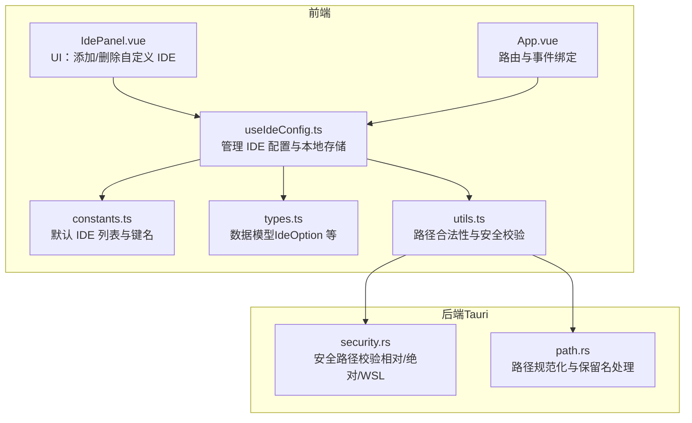
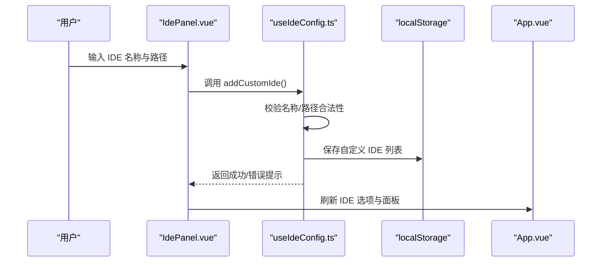
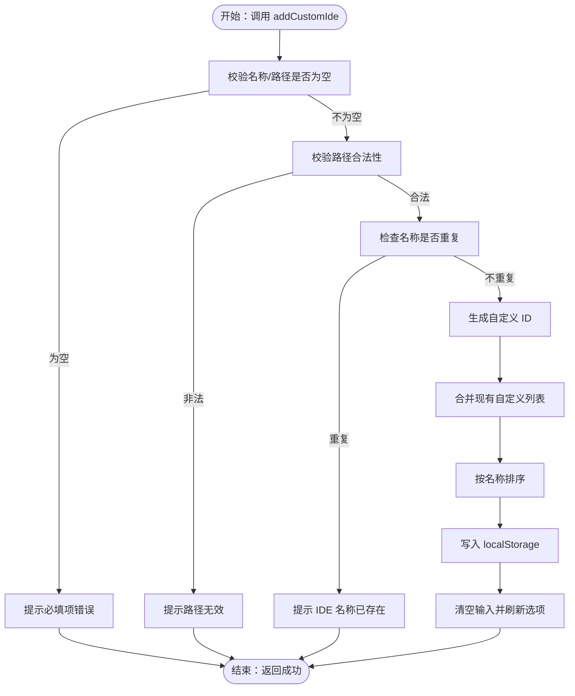
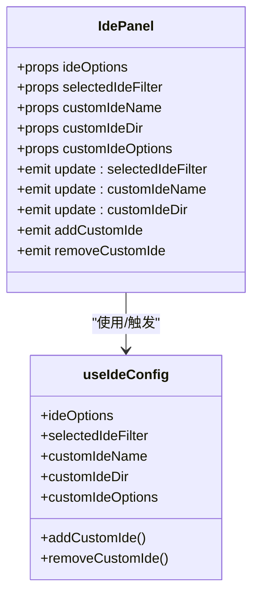
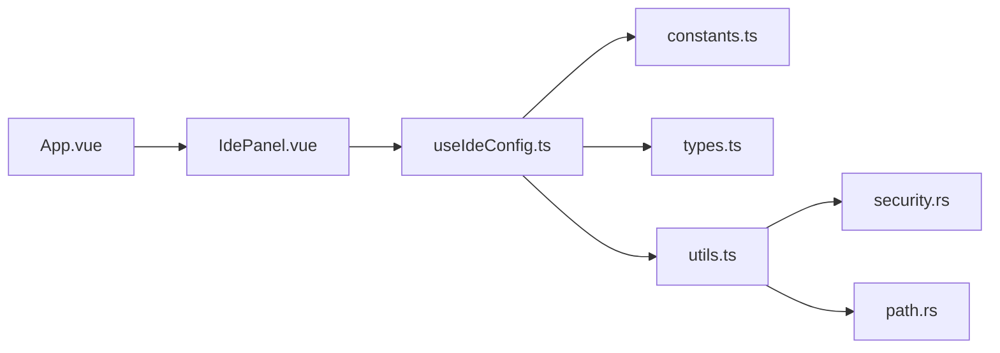

# 自定义IDE支持

<cite>
**本文引用的文件**
- [src/composables/useIdeConfig.ts](file://src/composables/useIdeConfig.ts)
- [src/composables/constants.ts](file://src/composables/constants.ts)
- [src/composables/types.ts](file://src/composables/types.ts)
- [src/composables/utils.ts](file://src/composables/utils.ts)
- [src/components/IdePanel.vue](file://src/components/IdePanel.vue)
- [src/App.vue](file://src/App.vue)
- [src/composables/useProjectConfig.ts](file://src/composables/useProjectConfig.ts)
- [src-tauri/src/utils/security.rs](file://src-tauri/src/utils/security.rs)
- [src-tauri/src/utils/path.rs](file://src-tauri/src/utils/path.rs)
- [src/locales/zh-CN.ts](file://src/locales/zh-CN.ts)
</cite>

## 目录
1. [简介](#简介)
2. [项目结构](#项目结构)
3. [核心组件](#核心组件)
4. [架构总览](#架构总览)
5. [详细组件分析](#详细组件分析)
6. [依赖关系分析](#依赖关系分析)
7. [性能考量](#性能考量)
8. [故障排除指南](#故障排除指南)
9. [结论](#结论)
10. [附录](#附录)

## 简介
本指南面向希望在 Skills Manager 中添加与管理“自定义 IDE”的用户。文档覆盖以下内容：
- 如何添加与配置自定义 IDE（IDE 名称、IDE 路径）
- 支持的 IDE 类型与配置要求（含 VSCode、IntelliJ IDEA、Sublime Text 等常见场景的最佳实践）
- IDE 配置验证机制（路径合法性、安全校验、功能完整性）
- 常见问题与排障建议
- 完整的配置模板与示例参考

## 项目结构
自定义 IDE 支持由前端 Vue 组合式函数与常量、工具模块共同协作，并通过 Tauri 后端进行安全路径校验与规范化处理。



图表来源
- [src/composables/useIdeConfig.ts:1-131](file://src/composables/useIdeConfig.ts#L1-L131)
- [src/composables/constants.ts:1-72](file://src/composables/constants.ts#L1-L72)
- [src/composables/types.ts:1-119](file://src/composables/types.ts#L1-L119)
- [src/composables/utils.ts:1-125](file://src/composables/utils.ts#L1-L125)
- [src/components/IdePanel.vue:1-270](file://src/components/IdePanel.vue#L1-L270)
- [src/App.vue:1-633](file://src/App.vue#L1-L633)
- [src-tauri/src/utils/security.rs:1-92](file://src-tauri/src/utils/security.rs#L1-L92)
- [src-tauri/src/utils/path.rs:1-90](file://src-tauri/src/utils/path.rs#L1-L90)

章节来源
- [src/composables/useIdeConfig.ts:1-131](file://src/composables/useIdeConfig.ts#L1-L131)
- [src/composables/constants.ts:1-72](file://src/composables/constants.ts#L1-L72)
- [src/composables/types.ts:1-119](file://src/composables/types.ts#L1-L119)
- [src/composables/utils.ts:1-125](file://src/composables/utils.ts#L1-L125)
- [src/components/IdePanel.vue:1-270](file://src/components/IdePanel.vue#L1-L270)
- [src/App.vue:1-633](file://src/App.vue#L1-L633)
- [src-tauri/src/utils/security.rs:1-92](file://src-tauri/src/utils/security.rs#L1-L92)
- [src-tauri/src/utils/path.rs:1-90](file://src-tauri/src/utils/path.rs#L1-L90)

## 核心组件
- IDE 配置组合式函数：负责加载/保存自定义 IDE、校验输入、维护状态与选项列表
- 常量与默认值：内置常见 IDE 映射与本地存储键名
- 数据模型：定义 IDE 选项、IDE 技能等类型
- 工具函数：提供路径合法性与安全校验（相对/绝对/WSL、危险路径阻断）
- UI 面板：提供添加/删除自定义 IDE 的交互入口
- 项目配置：将 IDE 目标映射到项目级技能链接目标

章节来源
- [src/composables/useIdeConfig.ts:59-130](file://src/composables/useIdeConfig.ts#L59-L130)
- [src/composables/constants.ts:6-30](file://src/composables/constants.ts#L6-L30)
- [src/composables/types.ts:70-76](file://src/composables/types.ts#L70-L76)
- [src/composables/utils.ts:34-99](file://src/composables/utils.ts#L34-L99)
- [src/components/IdePanel.vue:83-131](file://src/components/IdePanel.vue#L83-L131)
- [src/composables/useProjectConfig.ts:100-114](file://src/composables/useProjectConfig.ts#L100-L114)

## 架构总览
自定义 IDE 的配置流程从 UI 触发，经组合式函数校验与持久化，最终在 IDE 面板中展示并参与技能安装/卸载等操作。



图表来源
- [src/components/IdePanel.vue:111-125](file://src/components/IdePanel.vue#L111-L125)
- [src/composables/useIdeConfig.ts:76-104](file://src/composables/useIdeConfig.ts#L76-L104)
- [src/App.vue:324-344](file://src/App.vue#L324-L344)

## 详细组件分析

### 组件一：IDE 配置管理（useIdeConfig）
职责与行为
- 加载默认与自定义 IDE 列表，按名称排序
- 添加自定义 IDE：校验非空、路径合法性、名称唯一性；生成稳定 ID 并保存
- 删除自定义 IDE：过滤并回写
- 提供最近安装目标读写接口（用于后续安装流程）



图表来源
- [src/composables/useIdeConfig.ts:76-104](file://src/composables/useIdeConfig.ts#L76-L104)

章节来源
- [src/composables/useIdeConfig.ts:9-32](file://src/composables/useIdeConfig.ts#L9-L32)
- [src/composables/useIdeConfig.ts:76-104](file://src/composables/useIdeConfig.ts#L76-L104)
- [src/composables/useIdeConfig.ts:106-113](file://src/composables/useIdeConfig.ts#L106-L113)

### 组件二：UI 面板（IdePanel）
职责与行为
- 展示 IDE 过滤按钮与“添加自定义 IDE”输入区
- 支持切换 IDE 过滤条件，查看对应 IDE 下的技能
- 展示自定义 IDE 列表并支持一键删除



图表来源
- [src/components/IdePanel.vue:8-31](file://src/components/IdePanel.vue#L8-L31)
- [src/composables/useIdeConfig.ts:59-130](file://src/composables/useIdeConfig.ts#L59-L130)

章节来源
- [src/components/IdePanel.vue:83-131](file://src/components/IdePanel.vue#L83-L131)
- [src/App.vue:324-344](file://src/App.vue#L324-L344)

### 组件三：路径校验与安全策略（utils + security）
职责与行为
- 前端路径校验：相对路径安全检查、绝对路径安全检查（Unix 危险路径阻断、Windows 绝对路径格式、WSL UNC）
- 后端路径校验：相对/绝对路径统一判定、WSL 路径识别、目录包含判断、路径规范化

```mermaid
flowchart TD
Inp["输入路径字符串"] --> Type{"相对路径还是绝对路径"}
Type --> |相对| SafeRel["检查父目录/根/前缀等"]
SafeRel --> |非法| Deny["拒绝"]
SafeRel --> |合法| Allow["允许"]
Type --> |绝对| AbsType{"Unix/Windows/WSL"}
AbsType --> |Unix| CheckUnix["阻断 /etc /sys /proc /dev /root 等"]
AbsType --> |Windows| WinFmt["校验 C:\\... 格式"]
AbsType --> |WSL| WslFmt["校验 \\\\wsl$\\ 或 \\\\wsl.localhost\\" 格式"]
CheckUnix --> |命中危险| Deny
CheckUnix --> |安全| Allow
WinFmt --> |格式正确| Allow
WinFmt --> |格式错误| Deny
WslFmt --> |格式正确| Allow
WslFmt --> |格式错误| Deny
```

图表来源
- [src/composables/utils.ts:34-99](file://src/composables/utils.ts#L34-L99)
- [src-tauri/src/utils/security.rs:32-70](file://src-tauri/src/utils/security.rs#L32-L70)

章节来源
- [src/composables/utils.ts:34-99](file://src/composables/utils.ts#L34-L99)
- [src-tauri/src/utils/security.rs:32-70](file://src-tauri/src/utils/security.rs#L32-L70)
- [src-tauri/src/utils/path.rs:21-89](file://src-tauri/src/utils/path.rs#L21-L89)

### 组件四：项目级 IDE 目标映射（useProjectConfig）
职责与行为
- 将项目配置中的 IDE 目标映射为绝对或相对路径，供安装流程使用
- 支持相对路径拼接项目根目录

章节来源
- [src/composables/useProjectConfig.ts:100-114](file://src/composables/useProjectConfig.ts#L100-L114)

## 依赖关系分析
- useIdeConfig 依赖 constants（默认 IDE 列表）、utils（路径校验）、localStorage（持久化）
- App.vue 将 IDE 面板与 useIdeConfig 绑定，驱动 UI 更新
- UI 面板触发 useIdeConfig 的增删操作
- 安装流程在构建链接目标时复用路径校验逻辑



图表来源
- [src/App.vue:324-344](file://src/App.vue#L324-L344)
- [src/components/IdePanel.vue:1-270](file://src/components/IdePanel.vue#L1-L270)
- [src/composables/useIdeConfig.ts:1-131](file://src/composables/useIdeConfig.ts#L1-L131)
- [src/composables/constants.ts:1-72](file://src/composables/constants.ts#L1-L72)
- [src/composables/types.ts:1-119](file://src/composables/types.ts#L1-L119)
- [src/composables/utils.ts:1-125](file://src/composables/utils.ts#L1-L125)
- [src-tauri/src/utils/security.rs:1-92](file://src-tauri/src/utils/security.rs#L1-L92)
- [src-tauri/src/utils/path.rs:1-90](file://src-tauri/src/utils/path.rs#L1-L90)

章节来源
- [src/App.vue:324-344](file://src/App.vue#L324-L344)
- [src/components/IdePanel.vue:1-270](file://src/components/IdePanel.vue#L1-L270)
- [src/composables/useIdeConfig.ts:1-131](file://src/composables/useIdeConfig.ts#L1-L131)
- [src/composables/constants.ts:1-72](file://src/composables/constants.ts#L1-L72)
- [src/composables/types.ts:1-119](file://src/composables/types.ts#L1-L119)
- [src/composables/utils.ts:1-125](file://src/composables/utils.ts#L1-L125)
- [src-tauri/src/utils/security.rs:1-92](file://src-tauri/src/utils/security.rs#L1-L92)
- [src-tauri/src/utils/path.rs:1-90](file://src-tauri/src/utils/path.rs#L1-L90)

## 性能考量
- IDE 选项列表在本地内存中维护，新增/删除后重新排序，复杂度近似 O(n log n)，在合理规模下可忽略
- 路径校验为线性扫描，开销极小
- 建议避免在单次会话中频繁大量添加/删除自定义 IDE，以减少 UI 重渲染次数

## 故障排除指南
常见问题与解决思路
- “请填写编辑器名称和目录”
  - 现象：添加自定义 IDE 时提示必填
  - 排查：确认名称与路径均非空
  - 参考
    - [src/composables/useIdeConfig.ts:79-81](file://src/composables/useIdeConfig.ts#L79-L81)
    - [src/locales/zh-CN.ts:182](file://src/locales/zh-CN.ts#L182)

- “路径必须是相对路径或有效的绝对路径”
  - 现象：路径被拒绝
  - 排查：确保路径满足相对/绝对安全规则（参见路径校验章节），避免使用危险路径或非法格式
  - 参考
    - [src/composables/utils.ts:97-99](file://src/composables/utils.ts#L97-L99)
    - [src-tauri/src/utils/security.rs:63-65](file://src-tauri/src/utils/security.rs#L63-L65)
    - [src/locales/zh-CN.ts:186](file://src/locales/zh-CN.ts#L186)

- “IDE 名称已存在”
  - 现象：添加同名 IDE 失败
  - 排查：确保 IDE 名称不重复（大小写不敏感）
  - 参考
    - [src/composables/useIdeConfig.ts:88-90](file://src/composables/useIdeConfig.ts#L88-L90)
    - [src/locales/zh-CN.ts:183](file://src/locales/zh-CN.ts#L183)

- “项目尚未配置 IDE 目标”
  - 现象：项目关联技能时提示未配置
  - 排查：在项目设置中为项目选择 IDE 目标
  - 参考
    - [src/App.vue:190-193](file://src/App.vue#L190-L193)
    - [src/locales/zh-CN.ts:187](file://src/locales/zh-CN.ts#L187)

- 路径为相对路径但未生效
  - 现象：期望相对路径拼接用户主目录未生效
  - 排查：确认路径符合相对路径安全规则；安装流程在构建链接目标时会将相对路径拼接到用户主目录
  - 参考
    - [src/composables/utils.ts:34-53](file://src/composables/utils.ts#L34-L53)
    - [src/composables/useSkillsManager.ts:167-188](file://src/composables/useSkillsManager.ts#L167-L188)

- Windows 保留名导致的问题
  - 现象：某些名称在 Windows 上不可用
  - 排查：避免使用保留名（如 CON、PRN、AUX 等），必要时改用安全名称
  - 参考
    - [src/composables/utils.ts:8-29](file://src/composables/utils.ts#L8-L29)
    - [src-tauri/src/utils/path.rs:37-59](file://src-tauri/src/utils/path.rs#L37-L59)

章节来源
- [src/composables/useIdeConfig.ts:79-90](file://src/composables/useIdeConfig.ts#L79-L90)
- [src/composables/utils.ts:34-99](file://src/composables/utils.ts#L34-L99)
- [src-tauri/src/utils/security.rs:63-65](file://src-tauri/src/utils/security.rs#L63-L65)
- [src/App.vue:190-193](file://src/App.vue#L190-L193)
- [src/composables/useSkillsManager.ts:167-188](file://src/composables/useSkillsManager.ts#L167-L188)
- [src/composables/utils.ts:8-29](file://src/composables/utils.ts#L8-L29)
- [src-tauri/src/utils/path.rs:37-59](file://src-tauri/src/utils/path.rs#L37-L59)
- [src/locales/zh-CN.ts:182-187](file://src/locales/zh-CN.ts#L182-L187)

## 结论
通过上述组件与流程，用户可以安全地添加与管理自定义 IDE，并将其应用于技能的安装与管理。前端负责直观的交互与基础校验，后端提供更严格的路径安全保障。遵循本文的配置与排障建议，可有效提升配置成功率与系统稳定性。

## 附录

### 支持的 IDE 类型与配置要求
- 默认内置 IDE：Antigravity、Claude Code、CodeBuddy、Codex、Cursor、Kiro、OpenClaw、OpenCode、Qoder、Trae、VSCode、Windsurf
- 自定义 IDE：用户可添加任意名称与路径（相对或绝对），路径需通过安全校验
- 项目级 IDE 目标：项目可选择多个 IDE 目标，用于技能链接

章节来源
- [src/composables/constants.ts:6-19](file://src/composables/constants.ts#L6-L19)
- [src/composables/constants.ts:58-71](file://src/composables/constants.ts#L58-L71)

### 配置模板与示例参考
- 自定义 IDE 添加模板
  - 字段：名称、IDE 路径
  - 路径示例：相对路径（如 .myide/skills）、绝对路径（如 /home/user/.myide/skills 或 Windows 的 C:\Users\...\skills）
  - 参考
    - [src/components/IdePanel.vue:111-125](file://src/components/IdePanel.vue#L111-L125)
    - [src/composables/useIdeConfig.ts:76-104](file://src/composables/useIdeConfig.ts#L76-L104)

- 项目 IDE 目标模板
  - 选择 IDE 名称（来自 IDE 选项列表）
  - 项目内相对路径将自动拼接项目根目录
  - 参考
    - [src/composables/useProjectConfig.ts:100-114](file://src/composables/useProjectConfig.ts#L100-L114)

- 常见 IDE 的典型路径建议
  - VSCode
    - 相对路径：.vscode/skills
    - 绝对路径：Linux/macOS 的 /home/user/.vscode/skills，Windows 的 C:\Users\user\AppData\Roaming\Code\User\syntaxes
  - IntelliJ IDEA
    - 相对路径：.IntelliJIdea/skills
    - 绝对路径：Linux 的 ~/.cache/JetBrains/IntelliJIdea*/config/plugins-sandbox，macOS 的 ~/Library/Application Support/JetBrains/IntelliJIdea*，Windows 的 %APPDATA%\JetBrains\IntelliJIdea*
  - Sublime Text
    - 相对路径：Packages/User/skills
    - 绝对路径：Linux 的 ~/.config/sublime-text/Packages/User/skills，macOS 的 ~/Library/Application Support/Sublime Text/Packages/User/skills，Windows 的 %APPDATA%\Sublime Text\Packages\User\skills

说明：以上为通用实践建议，实际路径请根据各平台官方文档确认，并确保路径通过安全校验。