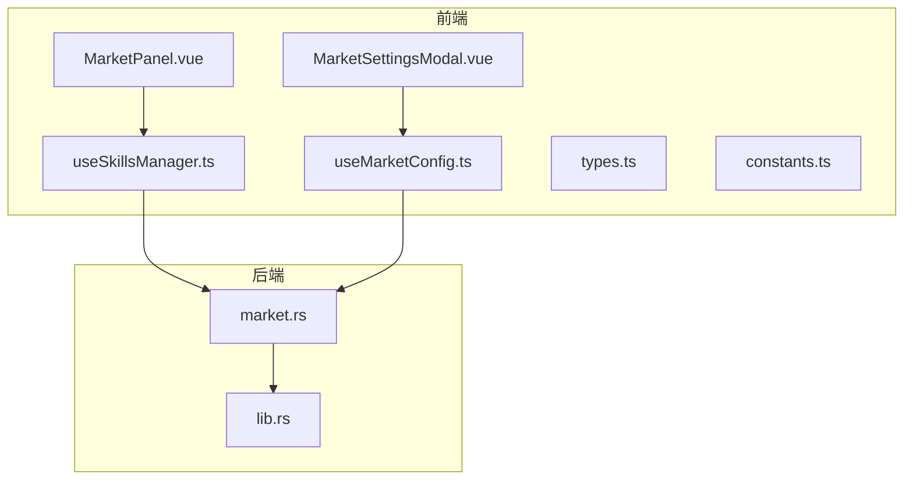
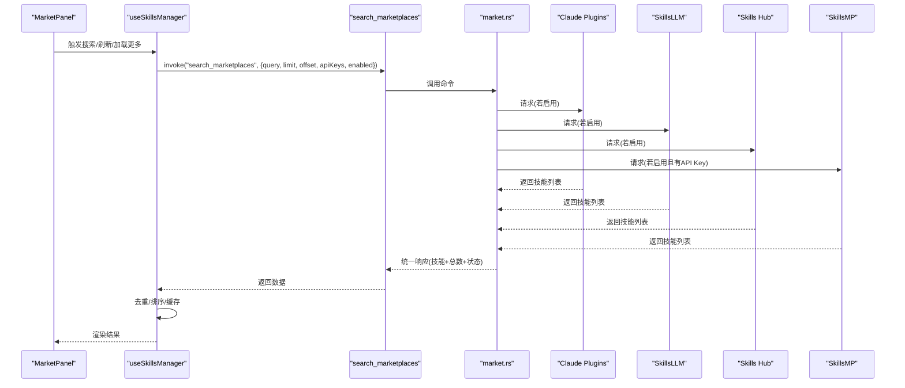
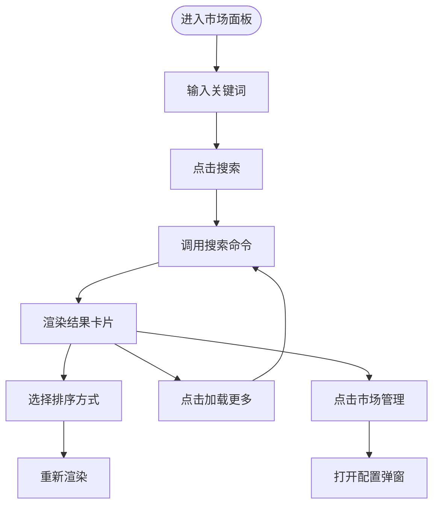
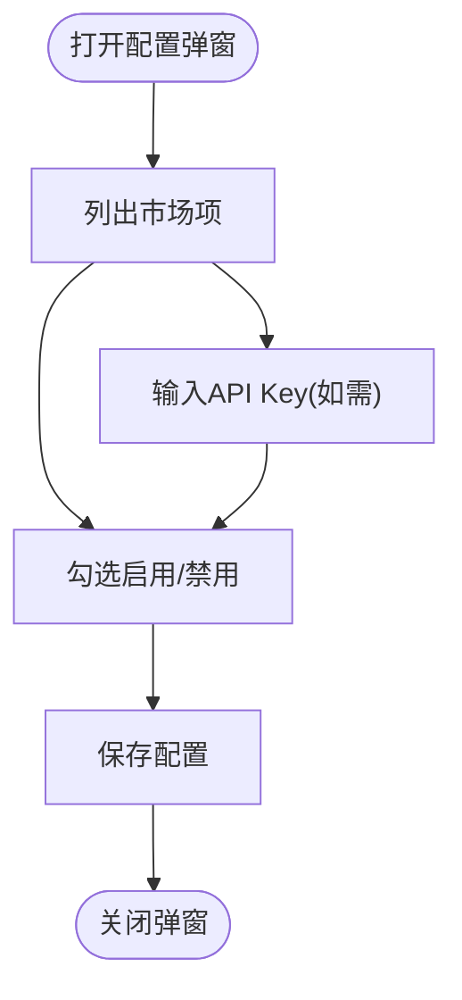
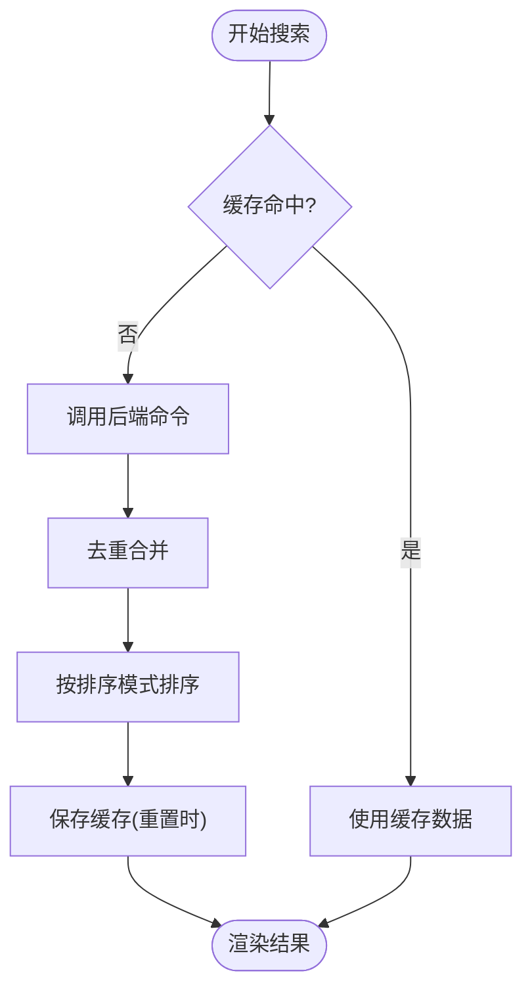
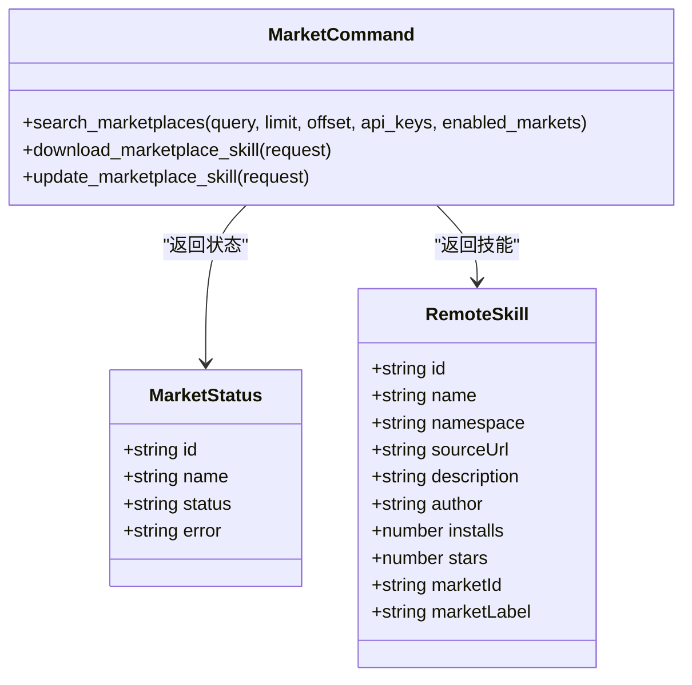
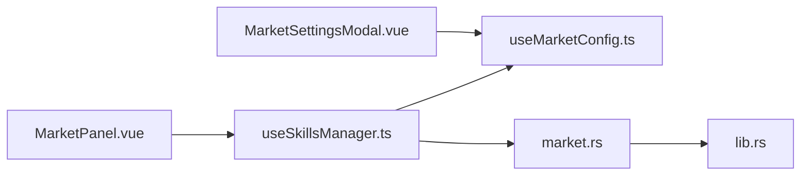

# 市场功能

<cite>
**本文引用的文件**
- [MarketPanel.vue](file://src/components/MarketPanel.vue)
- [MarketSettingsModal.vue](file://src/components/MarketSettingsModal.vue)
- [useMarketConfig.ts](file://src/composables/useMarketConfig.ts)
- [useSkillsManager.ts](file://src/composables/useSkillsManager.ts)
- [types.ts](file://src/composables/types.ts)
- [constants.ts](file://src/composables/constants.ts)
- [market.rs](file://src-tauri/src/commands/market.rs)
- [lib.rs](file://src-tauri/src/lib.rs)
- [zh-CN.ts](file://src/locales/zh-CN.ts)
- [en-US.ts](file://src/locales/en-US.ts)
- [App.vue](file://src/App.vue)
</cite>

## 更新摘要
**变更内容**
- 新增 Skills Hub 市场集成，扩展了市场功能支持多种技能市场源
- Skills Hub 是一个社区驱动的技能仓库，提供开源技能集合
- 更新默认市场配置，Skills Hub 默认启用
- 新增 Skills Hub 市场状态管理和搜索功能
- 更新市场源列表和搜索逻辑

## 目录
1. [简介](#简介)
2. [项目结构](#项目结构)
3. [核心组件](#核心组件)
4. [架构总览](#架构总览)
5. [详细组件分析](#详细组件分析)
6. [依赖关系分析](#依赖关系分析)
7. [性能与缓存](#性能与缓存)
8. [故障排查指南](#故障排查指南)
9. [结论](#结论)
10. [附录](#附录)

## 简介
本指南面向"市场功能模块"，聚焦以下目标：
- 技能聚合搜索：支持多市场源（Claude Plugins、SkillsLLM、Skills Hub、SkillsMP）同时搜索，并在前端去重与排序。
- 搜索结果排序：支持按默认、星数、安装量三种方式排序。
- 搜索缓存：基于查询词与分页参数的内存缓存，提升重复查询体验。
- 市场配置：启用/禁用市场源、API 密钥管理、搜索参数配置。
- 使用步骤与界面操作：添加自定义市场源、调整搜索优先级、查看搜索历史等。
- 实际搜索示例与最佳实践：帮助用户高效找到所需 AI 技能。

**更新** 新增 Skills Hub 市场集成，这是一个社区驱动的技能仓库，提供开源技能集合，丰富了市场功能的多样性。

## 项目结构
市场功能由前端 Vue 组件与 Tauri 后端命令共同构成，数据流如下：
- 前端通过 useSkillsManager 管理搜索状态、排序、缓存与下载队列。
- MarketPanel 负责展示搜索框、排序控件、结果卡片与"市场管理"入口。
- MarketSettingsModal 提供市场源开关与 API Key 输入。
- Tauri 后端 commands/market.rs 调用各市场 API，解析响应并返回统一视图。

**图表来源**
- [MarketPanel.vue:1-192](file://src/components/MarketPanel.vue#L1-L192)
- [MarketSettingsModal.vue:1-235](file://src/components/MarketSettingsModal.vue#L1-L235)
- [useSkillsManager.ts:1-867](file://src/composables/useSkillsManager.ts#L1-L867)
- [useMarketConfig.ts:1-67](file://src/composables/useMarketConfig.ts#L1-L67)
- [market.rs:1-442](file://src-tauri/src/commands/market.rs#L1-L442)
- [lib.rs:1-54](file://src-tauri/src/lib.rs#L1-L54)

**章节来源**
- [MarketPanel.vue:1-192](file://src/components/MarketPanel.vue#L1-L192)
- [MarketSettingsModal.vue:1-235](file://src/components/MarketSettingsModal.vue#L1-L235)
- [useSkillsManager.ts:1-867](file://src/composables/useSkillsManager.ts#L1-L867)
- [useMarketConfig.ts:1-67](file://src/composables/useMarketConfig.ts#L1-L67)
- [market.rs:1-442](file://src-tauri/src/commands/market.rs#L1-L442)
- [lib.rs:1-54](file://src-tauri/src/lib.rs#L1-L54)

## 核心组件
- MarketPanel：市场搜索面板，包含搜索输入、排序控件、结果展示与"市场管理"按钮。
- MarketSettingsModal：市场配置弹窗，支持勾选启用/禁用市场源、输入 API Key（如需）、查看状态。
- useSkillsManager：前端业务逻辑核心，负责搜索、排序、缓存、去重、下载队列与任务状态。
- useMarketConfig：市场配置持久化（localStorage），加载/保存市场配置与状态。
- market.rs：后端命令，聚合多市场源，构建统一响应并返回给前端。

**更新** 新增 Skills Hub 市场源支持，Skills Hub 作为一个社区驱动的技能仓库，默认启用，提供开源技能集合。

**章节来源**
- [MarketPanel.vue:1-192](file://src/components/MarketPanel.vue#L1-L192)
- [MarketSettingsModal.vue:1-235](file://src/components/MarketSettingsModal.vue#L1-L235)
- [useSkillsManager.ts:1-867](file://src/composables/useSkillsManager.ts#L1-L867)
- [useMarketConfig.ts:1-67](file://src/composables/useMarketConfig.ts#L1-L67)
- [market.rs:1-442](file://src-tauri/src/commands/market.rs#L1-L442)

## 架构总览
市场功能采用"前端状态管理 + 后端聚合命令"的架构模式：
- 前端通过 invoke 调用后端命令 search_marketplaces，传入查询词、分页、已启用市场与 API Key。
- 后端并发请求各市场源，解析响应，汇总为统一结构并返回。
- 前端进行去重、排序与缓存，渲染结果卡片并支持下载/更新。

**图表来源**
- [MarketPanel.vue:30-39](file://src/components/MarketPanel.vue#L30-L39)
- [useSkillsManager.ts:190-248](file://src/composables/useSkillsManager.ts#L190-L248)
- [market.rs:173-392](file://src-tauri/src/commands/market.rs#L173-L392)

**章节来源**
- [App.vue:299-322](file://src/App.vue#L299-L322)
- [useSkillsManager.ts:190-248](file://src/composables/useSkillsManager.ts#L190-L248)
- [market.rs:173-392](file://src-tauri/src/commands/market.rs#L173-L392)

## 详细组件分析

### MarketPanel 组件
- 功能要点
  - 搜索输入与回车触发搜索。
  - 刷新与加载更多按钮。
  - 排序控件：默认、星数降序、安装量降序。
  - 结果卡片展示技能名称、作者、星数、安装量、来源与源链接。
  - "市场管理"按钮打开配置弹窗。
- 交互事件
  - 更新查询词、排序模式、触发搜索、刷新、加载更多、下载、更新、保存配置。
- 本地化文案
  - 标题、占位符、按钮文本、提示信息均来自本地化资源。

**图表来源**
- [MarketPanel.vue:44-154](file://src/components/MarketPanel.vue#L44-L154)
- [zh-CN.ts:54-79](file://src/locales/zh-CN.ts#L54-L79)

**章节来源**
- [MarketPanel.vue:1-192](file://src/components/MarketPanel.vue#L1-L192)
- [zh-CN.ts:54-79](file://src/locales/zh-CN.ts#L54-L79)

### MarketSettingsModal 组件
- 功能要点
  - 展示各市场状态（在线、需要 API Key、不可用）。
  - 勾选启用/禁用市场源。
  - 对需要 API Key 的市场（如 SkillsMP）提供输入框与可见性切换。
  - 保存配置并关闭弹窗。
- 数据来源
  - statuses 来自后端返回的市场状态数组。
  - configs/enabled 来自 useMarketConfig 的持久化存储。

**图表来源**
- [MarketSettingsModal.vue:56-116](file://src/components/MarketSettingsModal.vue#L56-L116)
- [useMarketConfig.ts:39-44](file://src/composables/useMarketConfig.ts#L39-L44)

**章节来源**
- [MarketSettingsModal.vue:1-235](file://src/components/MarketSettingsModal.vue#L1-L235)
- [useMarketConfig.ts:1-67](file://src/composables/useMarketConfig.ts#L1-L67)

### useSkillsManager：搜索、排序、缓存与下载队列
- 搜索与缓存
  - 缓存键：查询词小写 + 分页大小；TTL 10 分钟。
  - 支持重置（清空偏移）与强制刷新。
  - 去重策略：以 sourceUrl 或 (marketId, name) 作为键去重。
- 排序
  - 默认：保持原始顺序。
  - 星数降序：优先按星数，其次按安装量，最后按原索引。
  - 安装量降序：优先按安装量，其次按星数，最后按原索引。
- 下载队列
  - 支持添加、处理、重试、清理完成任务。
  - 成功后更新最近任务状态并在 UI 中反馈。

**图表来源**
- [useSkillsManager.ts:190-248](file://src/composables/useSkillsManager.ts#L190-L248)
- [useSkillsManager.ts:250-261](file://src/composables/useSkillsManager.ts#L250-L261)
- [useSkillsManager.ts:72-100](file://src/composables/useSkillsManager.ts#L72-L100)

**章节来源**
- [useSkillsManager.ts:190-248](file://src/composables/useSkillsManager.ts#L190-L248)
- [useSkillsManager.ts:250-261](file://src/composables/useSkillsManager.ts#L250-L261)
- [useSkillsManager.ts:72-100](file://src/composables/useSkillsManager.ts#L72-L100)

### useMarketConfig：市场配置持久化
- 加载：从 localStorage 读取市场配置与启用状态。
- 保存：将配置写入 localStorage。
- 更新状态：接收后端返回的市场状态数组。

**更新** 新增 Skills Hub 市场源的默认配置，Skills Hub 默认启用，提供更好的用户体验。

**章节来源**
- [useMarketConfig.ts:16-44](file://src/composables/useMarketConfig.ts#L16-L44)
- [useMarketConfig.ts:49-53](file://src/composables/useMarketConfig.ts#L49-L53)

### types 与 constants：类型与默认值
- RemoteSkill：统一技能字段（含 marketId/marketLabel）。
- MarketStatus：市场连接状态（online/error/needs_key）。
- MarketSortMode：排序模式枚举。
- 默认市场状态与启用状态：Claude Plugins、SkillsLLM、Skills Hub 默认启用；SkillsMP 默认禁用（需要 API Key）。

**更新** 新增 Skills Hub 市场源的默认配置，Skills Hub 作为社区驱动的技能仓库，默认启用。

**章节来源**
- [types.ts:4-25](file://src/composables/types.ts#L4-L25)
- [types.ts:98-98](file://src/composables/types.ts#L98-L98)
- [constants.ts:37-53](file://src/composables/constants.ts#L37-L53)

### 后端命令：多市场聚合搜索
- 支持的市场源
  - Claude Plugins：公开接口，无需 API Key。
  - SkillsLLM：公开接口，无需 API Key。
  - Skills Hub：社区驱动的开源技能仓库，无需 API Key。
  - SkillsMP：需要 API Key，否则标记为 needs_key。
- 参数与分页
  - query：去除首尾空白后拼接为 q=。
  - limit：默认 20；offset 控制分页。
  - enabled_markets：仅对启用的市场发起请求。
  - api_keys：传递对应市场的 API Key。
- 响应
  - skills：统一视图 RemoteSkillsViewResponse。
  - total/limit/offset：用于前端分页与"加载更多"。
  - market_statuses：每个市场的状态与错误信息。

**更新** 新增 Skills Hub 市场源的搜索实现，支持从社区驱动的技能仓库获取技能信息。

**图表来源**
- [types.ts:4-25](file://src/composables/types.ts#L4-L25)
- [market.rs:173-392](file://src-tauri/src/commands/market.rs#L173-L392)

**章节来源**
- [market.rs:173-392](file://src-tauri/src/commands/market.rs#L173-L392)

## 依赖关系分析
- MarketPanel 依赖 useSkillsManager 的状态与方法。
- MarketSettingsModal 依赖 useMarketConfig 的配置与状态。
- useSkillsManager 依赖 useMarketConfig 的配置与 localStorage。
- 后端命令由 lib.rs 注册为可调用的 Tauri 命令。

**图表来源**
- [App.vue:299-322](file://src/App.vue#L299-L322)
- [useSkillsManager.ts:116-122](file://src/composables/useSkillsManager.ts#L116-L122)
- [useMarketConfig.ts:55-65](file://src/composables/useMarketConfig.ts#L55-L65)
- [lib.rs:27-39](file://src-tauri/src/lib.rs#L27-L39)

**章节来源**
- [App.vue:299-322](file://src/App.vue#L299-L322)
- [lib.rs:27-39](file://src-tauri/src/lib.rs#L27-L39)

## 性能与缓存
- 内存缓存
  - 缓存键：查询词小写 + 分页大小。
  - TTL：10 分钟。
  - 重置搜索时写入缓存，后续相同查询直接命中。
- 去重
  - 依据 sourceUrl 或 (marketId, name) 去重，避免同一技能重复出现。
- 排序
  - 前端稳定排序，减少网络往返。
- 并发请求
  - 后端对启用的市场源并发请求，提升响应速度。

**更新** 新增 Skills Hub 市场源的缓存和去重逻辑，确保与其他市场源一致的性能表现。

**章节来源**
- [useSkillsManager.ts:23-27](file://src/composables/useSkillsManager.ts#L23-L27)
- [useSkillsManager.ts:195-207](file://src/composables/useSkillsManager.ts#L195-L207)
- [useSkillsManager.ts:250-261](file://src/composables/useSkillsManager.ts#L250-L261)
- [market.rs:181-391](file://src-tauri/src/commands/market.rs#L181-L391)

## 故障排查指南
- 常见问题
  - 搜索无结果：检查是否启用了至少一个市场源；确认查询词不为空。
  - 市场状态为"需要 API Key"：为 SkillsMP 提供有效 API Key。
  - 市场状态为"不可用"：检查网络连通性或市场服务状态。
  - 下载失败：检查安装目录权限与磁盘空间。
- 建议
  - 先启用常用市场源（Claude Plugins、SkillsLLM、Skills Hub），再启用 SkillsMP 并填入 API Key。
  - 使用"刷新"强制拉取最新数据，避免缓存干扰。
  - 如遇网络波动，稍后再试或切换市场源。

**更新** 新增 Skills Hub 市场源的状态检查和故障排查指导。

**章节来源**
- [market.rs:219-243](file://src-tauri/src/commands/market.rs#L219-L243)
- [market.rs:277-301](file://src-tauri/src/commands/market.rs#L277-L301)
- [market.rs:340-380](file://src-tauri/src/commands/market.rs#L340-L380)

## 结论
市场功能通过"前端状态管理 + 后端聚合命令"的设计，实现了多市场源的统一搜索、排序与缓存，配合配置弹窗灵活管理市场源与 API Key。**更新** 新增的 Skills Hub 市场源进一步丰富了技能生态，提供开源社区驱动的技能集合，用户可通过直观的界面完成搜索、排序、下载与更新，快速定位并获取所需的 AI 技能。

## 附录

### 使用步骤与界面操作
- 打开市场标签页
  - 在顶部标签中选择"Market"。
- 搜索技能
  - 在搜索框输入关键词，点击"搜索"或按回车。
  - 点击"刷新"可强制拉取最新数据。
  - 点击"加载更多"进行分页加载。
- 调整排序
  - 在排序控件中选择"默认/星数从高到低/安装量从高到低"。
- 添加自定义市场源
  - 点击"市场管理"按钮，勾选需要启用的市场源。
  - 对需要 API Key 的市场（如 SkillsMP）输入密钥并保存。
- 查看搜索历史
  - 前端使用内存缓存记录最近 10 分钟内的搜索结果，重复查询将直接命中缓存。
- 下载/更新技能
  - 在结果卡片点击"下载"或"更新"，技能将进入下载队列并自动处理。

**更新** Skills Hub 市场源默认启用，用户可直接搜索和使用社区贡献的开源技能。

**章节来源**
- [MarketPanel.vue:44-154](file://src/components/MarketPanel.vue#L44-L154)
- [MarketSettingsModal.vue:56-116](file://src/components/MarketSettingsModal.vue#L56-L116)
- [useSkillsManager.ts:190-248](file://src/composables/useSkillsManager.ts#L190-L248)

### 实际搜索示例与最佳实践
- 示例
  - 搜索"对话助手"：适用于 Claude Plugins、SkillsLLM 和 Skills Hub。
  - 搜索"代码生成"：适用于 SkillsLLM、Skills Hub 和 SkillsMP（需 API Key）。
  - 搜索"开源技能"：Skills Hub 提供丰富的开源技能选项。
- 最佳实践
  - 先启用常用市场源（Claude Plugins、SkillsLLM、Skills Hub），再启用 SkillsMP 并填入 API Key。
  - 使用"星数从高到低"筛选高质量技能；若关注流行度，使用"安装量从高到低"。
  - 利用 Skills Hub 的开源技能生态，优先选择社区贡献的高质量技能。
  - 避免频繁刷新，利用缓存提升体验；必要时使用"刷新"覆盖缓存。
  - 下载前确认技能来源与描述，避免误装。

**更新** 新增 Skills Hub 市场源的使用建议，鼓励用户探索社区贡献的开源技能。

**章节来源**
- [market.rs:195-380](file://src-tauri/src/commands/market.rs#L195-L380)
- [useSkillsManager.ts:72-100](file://src/composables/useSkillsManager.ts#L72-L100)