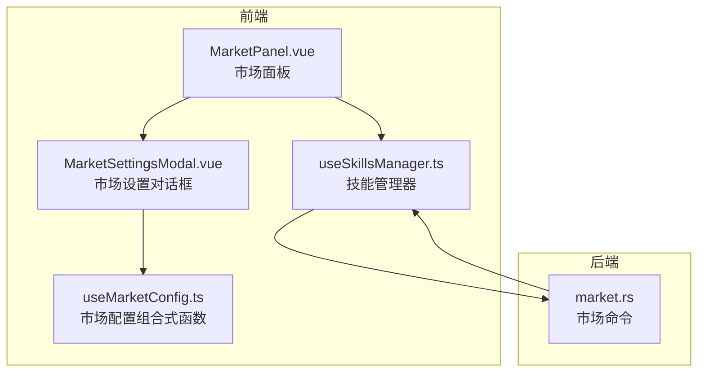
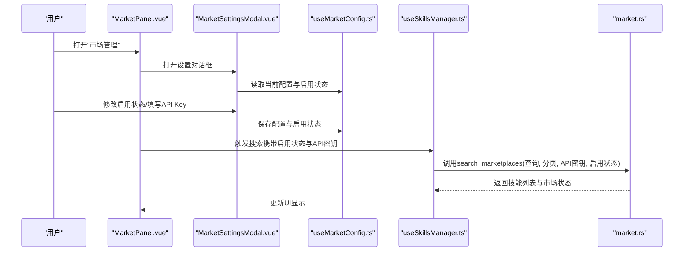
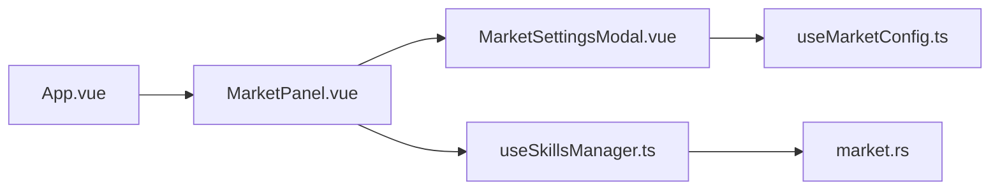

# 市场配置

<cite>
**本文引用的文件**
- [src/components/MarketPanel.vue](file://src/components/MarketPanel.vue)
- [src/components/MarketSettingsModal.vue](file://src/components/MarketSettingsModal.vue)
- [src/composables/useMarketConfig.ts](file://src/composables/useMarketConfig.ts)
- [src/composables/useSkillsManager.ts](file://src/composables/useSkillsManager.ts)
- [src/composables/constants.ts](file://src/composables/constants.ts)
- [src/composables/types.ts](file://src/composables/types.ts)
- [src-tauri/src/commands/market.rs](file://src-tauri/src/commands/market.rs)
- [src/App.vue](file://src/App.vue)
- [src/locales/zh-CN.ts](file://src/locales/zh-CN.ts)
- [README.md](file://README.md)
</cite>

## 目录
1. [简介](#简介)
2. [项目结构](#项目结构)
3. [核心组件](#核心组件)
4. [架构总览](#架构总览)
5. [详细组件分析](#详细组件分析)
6. [依赖关系分析](#依赖关系分析)
7. [性能考量](#性能考量)
8. [故障排查指南](#故障排查指南)
9. [结论](#结论)
10. [附录](#附录)

## 简介
本指南面向“市场配置”功能，帮助用户理解并正确使用多市场源的管理与配置。内容涵盖：
- 如何启用/禁用不同AI技能市场的数据源
- 如何为需要认证的市场源添加API密钥
- 市场配置界面的操作流程与交互
- 配置的保存与加载机制
- 不同市场源的特点与适用场景，辅助用户选择合适的市场组合

## 项目结构
市场配置功能由前端UI组件、状态管理组合与后端命令三部分协同实现：
- 前端组件负责展示市场列表、搜索与排序，并弹出“市场管理”对话框进行配置
- 组合式函数负责读取/保存配置、维护市场状态
- 后端命令根据启用状态与API密钥调用各市场源接口，聚合返回结果

图表来源
- [src/components/MarketPanel.vue:44-154](file://src/components/MarketPanel.vue#L44-L154)
- [src/components/MarketSettingsModal.vue:56-116](file://src/components/MarketSettingsModal.vue#L56-L116)
- [src/composables/useSkillsManager.ts:190-232](file://src/composables/useSkillsManager.ts#L190-L232)
- [src/composables/useMarketConfig.ts:8-66](file://src/composables/useMarketConfig.ts#L8-L66)
- [src-tauri/src/commands/market.rs:173-392](file://src-tauri/src/commands/market.rs#L173-L392)

章节来源
- [src/App.vue:299-322](file://src/App.vue#L299-L322)
- [src/components/MarketPanel.vue:1-192](file://src/components/MarketPanel.vue#L1-L192)
- [src/components/MarketSettingsModal.vue:1-235](file://src/components/MarketSettingsModal.vue#L1-L235)
- [src/composables/useMarketConfig.ts:1-67](file://src/composables/useMarketConfig.ts#L1-L67)
- [src/composables/useSkillsManager.ts:190-232](file://src/composables/useSkillsManager.ts#L190-L232)
- [src-tauri/src/commands/market.rs:173-392](file://src-tauri/src/commands/market.rs#L173-L392)

## 核心组件
- 市场面板（MarketPanel）
  - 提供搜索框、排序控件、刷新与加载更多按钮
  - 展示来自多个市场的技能卡片，支持下载/更新
  - 通过设置按钮打开“市场管理”对话框
- 市场设置对话框（MarketSettingsModal）
  - 列出所有市场源及其状态（在线/需要API Key/不可用）
  - 支持勾选启用/禁用市场
  - 对需要API Key的市场提供输入框与可见性切换
  - 保存后关闭对话框
- 市场配置组合式函数（useMarketConfig）
  - 负责从localStorage加载/保存市场配置与启用状态
  - 维护默认市场状态与默认启用状态
- 技能管理器（useSkillsManager）
  - 调用后端命令执行搜索，传入查询参数、分页参数、启用状态与API密钥
  - 缓存搜索结果，避免重复请求
- 后端命令（market.rs）
  - 根据启用状态与API密钥访问各市场源
  - 解析响应并返回聚合后的技能列表与市场状态

章节来源
- [src/components/MarketPanel.vue:1-192](file://src/components/MarketPanel.vue#L1-L192)
- [src/components/MarketSettingsModal.vue:1-235](file://src/components/MarketSettingsModal.vue#L1-L235)
- [src/composables/useMarketConfig.ts:1-67](file://src/composables/useMarketConfig.ts#L1-L67)
- [src/composables/useSkillsManager.ts:190-232](file://src/composables/useSkillsManager.ts#L190-L232)
- [src-tauri/src/commands/market.rs:173-392](file://src-tauri/src/commands/market.rs#L173-L392)

## 架构总览
下图展示了从用户在“市场管理”中修改配置，到前端发起搜索请求，再到后端聚合各市场源数据的整体流程。

图表来源
- [src/components/MarketPanel.vue:44-154](file://src/components/MarketPanel.vue#L44-L154)
- [src/components/MarketSettingsModal.vue:56-116](file://src/components/MarketSettingsModal.vue#L56-L116)
- [src/composables/useMarketConfig.ts:39-44](file://src/composables/useMarketConfig.ts#L39-L44)
- [src/composables/useSkillsManager.ts:210-232](file://src/composables/useSkillsManager.ts#L210-L232)
- [src-tauri/src/commands/market.rs:173-392](file://src-tauri/src/commands/market.rs#L173-L392)

## 详细组件分析

### 市场面板（MarketPanel）
- 功能要点
  - 搜索与排序：支持关键词搜索、多种排序方式
  - 结果展示：卡片式展示技能元信息、来源与链接
  - 操作入口：下载/更新按钮；设置按钮打开“市场管理”
- 关键交互
  - 设置按钮触发打开“市场管理”对话框
  - 搜索/刷新/加载更多事件向上冒泡给父组件处理
  - 保存配置事件接收来自对话框的配置与启用状态

章节来源
- [src/components/MarketPanel.vue:44-154](file://src/components/MarketPanel.vue#L44-L154)

### 市场设置对话框（MarketSettingsModal）
- 功能要点
  - 列表展示市场状态与错误提示
  - 勾选启用/禁用对应市场
  - 对需要API Key的市场提供输入框与显示/隐藏切换
  - 保存后将配置与启用状态回传给父组件
- 关键逻辑
  - 使用本地状态同步props中的配置与启用状态
  - 仅对特定市场（如SkillsMP）显示API Key输入
  - 状态标签根据状态类型映射为“在线/需要API Key/不可用”

章节来源
- [src/components/MarketSettingsModal.vue:1-235](file://src/components/MarketSettingsModal.vue#L1-L235)
- [src/locales/zh-CN.ts:194-203](file://src/locales/zh-CN.ts#L194-L203)

### 市场配置组合式函数（useMarketConfig）
- 功能要点
  - 从localStorage加载配置与启用状态
  - 将配置与启用状态写入localStorage
  - 维护默认市场状态与默认启用状态
- 数据结构
  - 配置对象：键为市场ID，值为API密钥
  - 启用状态对象：键为市场ID，值为布尔

章节来源
- [src/composables/useMarketConfig.ts:1-67](file://src/composables/useMarketConfig.ts#L1-L67)
- [src/composables/constants.ts:24-53](file://src/composables/constants.ts#L24-L53)

### 技能管理器（useSkillsManager）
- 功能要点
  - 调用后端命令执行搜索，传入查询、分页、启用状态与API密钥
  - 使用缓存避免重复请求
  - 将后端返回的技能列表与市场状态更新到UI
- 关键流程
  - 构造缓存键，命中则直接返回缓存数据
  - 调用invoke("search_marketplaces", ...)传递参数
  - 去重合并分页结果，更新状态

章节来源
- [src/composables/useSkillsManager.ts:190-232](file://src/composables/useSkillsManager.ts#L190-L232)

### 后端命令（market.rs）
- 功能要点
  - 根据启用状态决定是否访问某市场
  - 对需要API Key的市场附加认证头
  - 解析不同市场的响应格式，统一为内部视图
  - 返回技能列表、总数、分页信息与市场状态
- 市场特性
  - Claude Plugins：公开接口，无需API Key
  - SkillsLLM：公开接口，无需API Key
  - SkillsMP：需API Key，否则标记为“需要API Key”

章节来源
- [src-tauri/src/commands/market.rs:173-392](file://src-tauri/src/commands/market.rs#L173-L392)

## 依赖关系分析
- 前端组件依赖
  - MarketPanel依赖MarketSettingsModal进行配置
  - MarketSettingsModal依赖useMarketConfig进行配置读写
  - MarketPanel与MarketSettingsModal共同被App.vue调度
- 状态与存储
  - useMarketConfig负责localStorage持久化
  - useSkillsManager负责搜索缓存与去重
- 后端依赖
  - market.rs根据启用状态与API密钥访问外部服务
  - 返回统一的数据结构供前端渲染

图表来源
- [src/App.vue:299-322](file://src/App.vue#L299-L322)
- [src/components/MarketPanel.vue:44-154](file://src/components/MarketPanel.vue#L44-L154)
- [src/components/MarketSettingsModal.vue:56-116](file://src/components/MarketSettingsModal.vue#L56-L116)
- [src/composables/useMarketConfig.ts:39-44](file://src/composables/useMarketConfig.ts#L39-L44)
- [src/composables/useSkillsManager.ts:210-232](file://src/composables/useSkillsManager.ts#L210-L232)
- [src-tauri/src/commands/market.rs:173-392](file://src-tauri/src/commands/market.rs#L173-L392)

章节来源
- [src/App.vue:299-322](file://src/App.vue#L299-L322)
- [src/composables/useMarketConfig.ts:1-67](file://src/composables/useMarketConfig.ts#L1-L67)
- [src/composables/useSkillsManager.ts:190-232](file://src/composables/useSkillsManager.ts#L190-L232)
- [src-tauri/src/commands/market.rs:173-392](file://src-tauri/src/commands/market.rs#L173-L392)

## 性能考量
- 搜索缓存
  - 使用内存缓存避免重复请求，提升用户体验
  - 缓存键包含查询词与分页参数，确保不同查询隔离
- 去重策略
  - 合并分页结果时进行去重，避免重复技能多次展示
- 并发与异步
  - 后端命令使用异步运行时，避免阻塞UI线程

章节来源
- [src/composables/useSkillsManager.ts:190-232](file://src/composables/useSkillsManager.ts#L190-L232)

## 故障排查指南
- 常见问题与定位
  - 市场显示“不可用”：检查网络连接或对应市场源的可用性
  - “需要API Key”：为对应市场在“市场管理”中填入有效密钥
  - 搜索无结果：确认查询词、排序方式与分页是否合理
  - 配置未生效：确认已在“市场管理”中保存并重新触发搜索
- 日志与状态
  - 后端命令在解析失败或网络错误时会记录错误并返回“错误”状态
  - 前端对话框可显示具体错误信息，便于定位问题

章节来源
- [src-tauri/src/commands/market.rs:234-243](file://src-tauri/src/commands/market.rs#L234-L243)
- [src-tauri/src/commands/market.rs:292-301](file://src-tauri/src/commands/market.rs#L292-L301)
- [src-tauri/src/commands/market.rs:355-363](file://src-tauri/src/commands/market.rs#L355-L363)

## 结论
通过“市场管理”对话框，用户可以灵活地启用/禁用不同市场源，并为需要认证的市场源配置API密钥。前端与后端配合实现了高效、稳定的多源聚合搜索体验。建议优先启用公开市场（如Claude Plugins、SkillsLLM），在需要高级功能或更高权限时再配置API Key。

## 附录

### 市场配置界面操作步骤
- 打开“市场”标签页
- 点击右上角设置按钮，打开“市场管理”
- 勾选/取消勾选市场以启用/禁用
- 对需要API Key的市场，粘贴密钥并可切换显示/隐藏
- 点击“保存”，返回市场面板
- 在市场面板中执行搜索或刷新，使配置生效

章节来源
- [src/components/MarketPanel.vue:44-154](file://src/components/MarketPanel.vue#L44-L154)
- [src/components/MarketSettingsModal.vue:56-116](file://src/components/MarketSettingsModal.vue#L56-L116)

### 配置保存与加载机制
- 保存
  - MarketSettingsModal将配置与启用状态回传给父组件
  - 父组件调用保存函数，写入localStorage
- 加载
  - 应用启动或初始化时，从localStorage读取配置与启用状态
  - 默认值用于首次使用或缺失字段的兜底

章节来源
- [src/composables/useMarketConfig.ts:16-44](file://src/composables/useMarketConfig.ts#L16-L44)
- [src/composables/constants.ts:24-53](file://src/composables/constants.ts#L24-L53)

### 常见市场源配置方法与特点
- Claude Plugins
  - 公开接口，无需API Key
  - 适合快速浏览与基础搜索
- SkillsLLM
  - 公开接口，无需API Key
  - 适合通用技能聚合
- SkillsMP
  - 需要API Key，启用后方可访问
  - 适合需要高级权限或特定功能的场景

章节来源
- [src-tauri/src/commands/market.rs:195-251](file://src-tauri/src/commands/market.rs#L195-L251)
- [src-tauri/src/commands/market.rs:253-309](file://src-tauri/src/commands/market.rs#L253-L309)
- [src-tauri/src/commands/market.rs:311-380](file://src-tauri/src/commands/market.rs#L311-L380)
- [README.md:88-93](file://README.md#L88-L93)