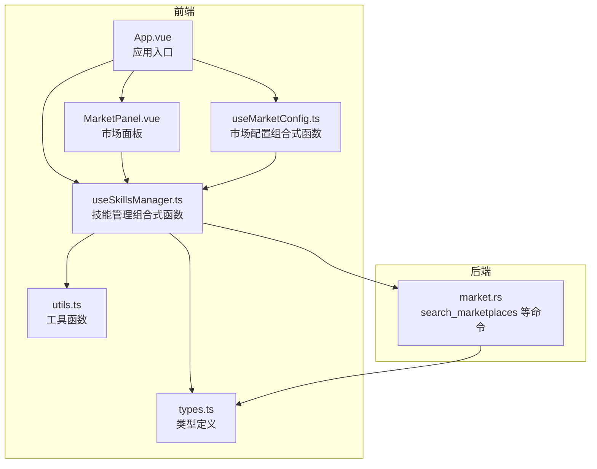
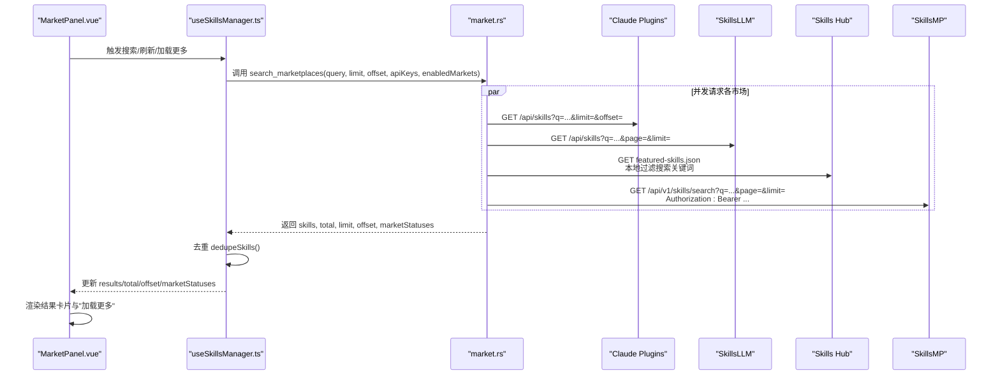
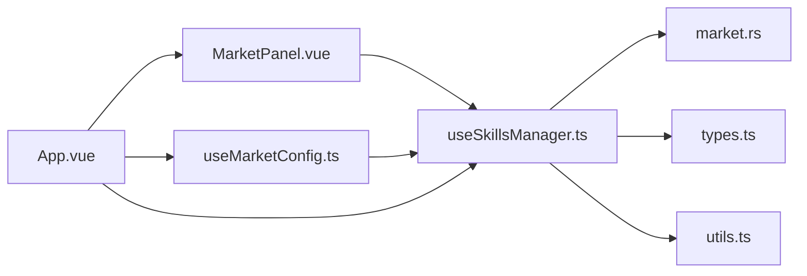

# 技能搜索

<cite>
**本文引用的文件**
- [MarketPanel.vue](file://src/components/MarketPanel.vue)
- [useSkillsManager.ts](file://src/composables/useSkillsManager.ts)
- [types.ts](file://src/composables/types.ts)
- [market.rs](file://src-tauri/src/commands/market.rs)
- [useMarketConfig.ts](file://src/composables/useMarketConfig.ts)
- [constants.ts](file://src/composables/constants.ts)
- [utils.ts](file://src/composables/utils.ts)
- [App.vue](file://src/App.vue)
- [zh-CN.ts](file://src/locales/zh-CN.ts)
- [en-US.ts](file://src/locales/en-US.ts)
</cite>

## 更新摘要
**变更内容**
- 新增 Skills Hub 市场集成，提供额外的技能搜索源
- 增强错误处理机制，包括市场冷却和故障恢复
- 改进市场状态管理，提供更详细的连接状态反馈
- 优化并发搜索性能和稳定性

## 目录
1. [简介](#简介)
2. [项目结构](#项目结构)
3. [核心组件](#核心组件)
4. [架构总览](#架构总览)
5. [详细组件分析](#详细组件分析)
6. [依赖关系分析](#依赖关系分析)
7. [性能与缓存特性](#性能与缓存特性)
8. [搜索操作流程与界面指引](#搜索操作流程与界面指引)
9. [搜索结果展示与元数据说明](#搜索结果展示与元数据说明)
10. [搜索技巧与实践建议](#搜索技巧与实践建议)
11. [故障排查](#故障排查)
12. [结论](#结论)

## 简介
本指南面向使用"技能搜索"功能的用户，系统讲解多市场源聚合搜索的工作原理、界面操作流程、结果展示格式以及实用技巧。通过聚合多个 AI 技能市场（包括新增的 Skills Hub、Claude Plugins、SkillsLLM、SkillsMP），用户可在同一界面内进行跨市场的技能检索，并获得去重后的统一结果。界面支持关键词搜索、分页加载更多、按星标数/安装量排序等能力；同时提供市场开关与配置入口，便于按需启用特定市场。

**更新** 新增 Skills Hub 市场集成，提供来自 GitHub Skills Hub 的精选技能集合，增强搜索覆盖范围和多样性。

## 项目结构
技能搜索功能由前端 Vue 组件与后端 Tauri 命令协同实现：
- 前端负责 UI 展示、用户交互、状态管理与缓存控制
- 后端负责并发调用多个技能市场 API、解析响应、汇总状态并返回统一结构

**图表来源**
- [App.vue:299-322](file://src/App.vue#L299-L322)
- [MarketPanel.vue:1-192](file://src/components/MarketPanel.vue#L1-L192)
- [useSkillsManager.ts:1-867](file://src/composables/useSkillsManager.ts#L1-L867)
- [useMarketConfig.ts:1-67](file://src/composables/useMarketConfig.ts#L1-L67)
- [market.rs:173-392](file://src-tauri/src/commands/market.rs#L173-L392)
- [types.ts:1-119](file://src/composables/types.ts#L1-L119)
- [utils.ts:1-125](file://src/composables/utils.ts#L1-L125)

**章节来源**
- [App.vue:299-322](file://src/App.vue#L299-L322)
- [MarketPanel.vue:1-192](file://src/components/MarketPanel.vue#L1-L192)
- [useSkillsManager.ts:1-867](file://src/composables/useSkillsManager.ts#L1-L867)
- [useMarketConfig.ts:1-67](file://src/composables/useMarketConfig.ts#L1-L67)
- [market.rs:173-392](file://src-tauri/src/commands/market.rs#L173-L392)
- [types.ts:1-119](file://src/composables/types.ts#L1-L119)
- [utils.ts:1-125](file://src/composables/utils.ts#L1-L125)

## 核心组件
- MarketPanel：市场搜索界面，包含搜索框、触发搜索/刷新、排序控件、结果卡片与"加载更多"
- useSkillsManager：核心逻辑，负责搜索请求、缓存、去重、排序、下载队列与任务状态
- useMarketConfig：市场配置与状态持久化，支持开启/关闭市场、保存 API Key
- market.rs：后端命令，聚合多个市场并返回统一结构
- types.ts：远程技能、市场状态、下载任务等类型定义
- utils.ts：通用工具，含规范化技能名用于去重与本地匹配

**更新** 新增 Skills Hub 市场支持，提供来自 GitHub Skills Hub 的精选技能集合。

**章节来源**
- [MarketPanel.vue:1-192](file://src/components/MarketPanel.vue#L1-L192)
- [useSkillsManager.ts:190-261](file://src/composables/useSkillsManager.ts#L190-L261)
- [useMarketConfig.ts:1-67](file://src/composables/useMarketConfig.ts#L1-L67)
- [market.rs:173-392](file://src-tauri/src/commands/market.rs#L173-L392)
- [types.ts:1-119](file://src/composables/types.ts#L1-L119)
- [utils.ts:117-124](file://src/composables/utils.ts#L117-L124)

## 架构总览
多市场聚合搜索的端到端流程如下：

**图表来源**
- [MarketPanel.vue:30-39](file://src/components/MarketPanel.vue#L30-L39)
- [useSkillsManager.ts:190-248](file://src/composables/useSkillsManager.ts#L190-L248)
- [market.rs:173-392](file://src-tauri/src/commands/market.rs#L173-L392)

## 详细组件分析

### MarketPanel：搜索界面与交互
- 输入与触发
  - 支持输入搜索关键词并回车触发搜索
  - 提供"搜索/刷新/加载更多"按钮
- 排序与提示
  - 支持默认、按星标降序、按安装量降序三种排序模式
  - 排序仅作用于当前已加载的结果
- 结果展示
  - 每条结果包含技能名称、作者、星标、安装量、来源市场、源码链接
  - 已安装技能显示"更新"按钮，未安装显示"下载"按钮
  - 支持"设置"入口以管理市场开关与 API Key

**章节来源**
- [MarketPanel.vue:53-144](file://src/components/MarketPanel.vue#L53-L144)
- [MarketPanel.vue:146-153](file://src/components/MarketPanel.vue#L146-L153)

### useSkillsManager：搜索、缓存、去重与排序
- 搜索与分页
  - 支持重置搜索（清空偏移）与追加搜索（增量）
  - 使用缓存键（关键词小写+limit）避免重复请求
- 去重策略
  - 优先以"源码地址（sourceUrl）"去重；若无则以"市场ID+技能名"去重
- 排序
  - 默认按接口返回顺序
  - 星标/安装量降序时，同值情况下按星标、安装量再比较，最后按原始索引稳定排序
- 下载队列
  - 将下载/更新任务入队，串行处理，完成后清理定时器并更新最近任务状态

**章节来源**
- [useSkillsManager.ts:190-248](file://src/composables/useSkillsManager.ts#L190-L248)
- [useSkillsManager.ts:250-261](file://src/composables/useSkillsManager.ts#L250-L261)
- [useSkillsManager.ts:72-100](file://src/composables/useSkillsManager.ts#L72-L100)
- [useSkillsManager.ts:263-342](file://src/composables/useSkillsManager.ts#L263-L342)

### market.rs：多市场聚合与解析
- 可配置市场
  - Claude Plugins：公开市场，无需 API Key
  - SkillsLLM：公开市场，无需 API Key
  - Skills Hub：公开市场，无需 API Key，从 GitHub Skills Hub 获取精选技能
  - SkillsMP：需 API Key，否则标记为"需要 Key"
- 请求参数
  - 关键词经 URL 编码传参
  - limit 默认 20；offset 用于分页；page 用于 SkillsLLM/SkillsMP 的页码换算
- 响应解析
  - 解析通用字段：id、name、namespace、sourceUrl、description、author、stars、installs
  - 统一映射为 RemoteSkillView，附加 marketId/marketLabel
- 错误处理与冷却机制
  - 实现市场故障冷却机制，避免频繁失败的市场请求
  - 提供详细的错误状态反馈，包括网络错误、解析错误等
- 状态汇总
  - 记录每个市场的连接状态（online/error/needs_key），并随结果返回

**更新** 新增 Skills Hub 市场支持，从 GitHub Skills Hub 获取精选技能集合，支持关键词本地过滤。

**章节来源**
- [market.rs:173-392](file://src-tauri/src/commands/market.rs#L173-L392)
- [market.rs:55-119](file://src-tauri/src/commands/market.rs#L55-L119)
- [market.rs:121-171](file://src-tauri/src/commands/market.rs#L121-L171)
- [market.rs:455-494](file://src-tauri/src/commands/market.rs#L455-L494)
- [market.rs:245-280](file://src-tauri/src/commands/market.rs#L245-L280)

### 类型与工具
- RemoteSkill：远程技能统一模型，包含来源市场标识与标签
- MarketStatus：市场连接状态，包含在线、错误、需要密钥三种状态
- utils.normalizeSkillName：规范化技能名，用于本地已安装技能识别与去重辅助

**章节来源**
- [types.ts:4-15](file://src/composables/types.ts#L4-L15)
- [types.ts:20-25](file://src/composables/types.ts#L20-L25)
- [utils.ts:117-124](file://src/composables/utils.ts#L117-L124)

## 依赖关系分析
- 前端组件依赖组合式函数提供的状态与方法
- 组合式函数通过 Tauri invoke 调用后端命令
- 后端命令依赖市场解析器与网络下载工具
- 市场配置通过 localStorage 持久化，影响请求与 UI 状态

**图表来源**
- [App.vue:299-322](file://src/App.vue#L299-L322)
- [MarketPanel.vue:1-192](file://src/components/MarketPanel.vue#L1-L192)
- [useSkillsManager.ts:1-867](file://src/composables/useSkillsManager.ts#L1-L867)
- [useMarketConfig.ts:1-67](file://src/composables/useMarketConfig.ts#L1-L67)
- [market.rs:173-392](file://src-tauri/src/commands/market.rs#L173-L392)
- [types.ts:1-119](file://src/composables/types.ts#L1-L119)
- [utils.ts:1-125](file://src/composables/utils.ts#L1-L125)

## 性能与缓存特性
- 前端缓存
  - 以"关键词小写+limit"为键，缓存 10 分钟；重置搜索且非强制时直接命中缓存
- 去重优化
  - 优先使用 sourceUrl 去重，减少重复结果；若缺失则以 marketId:name 去重
- 并发与分页
  - 后端并发请求多个市场，提升整体响应速度；分页 offset/page 控制加载规模
- 排序稳定性
  - 同值场景下按星标、安装量与原始索引排序，保证 UI 稳定性
- 市场冷却机制
  - 失败的市场请求会被暂时跳过，避免频繁重试造成资源浪费
  - 冷却时间结束后自动恢复请求

**更新** 新增市场冷却机制，提高系统的稳定性和性能表现。

**章节来源**
- [useSkillsManager.ts:23-27](file://src/composables/useSkillsManager.ts#L23-L27)
- [useSkillsManager.ts:197-207](file://src/composables/useSkillsManager.ts#L197-L207)
- [useSkillsManager.ts:250-261](file://src/composables/useSkillsManager.ts#L250-L261)
- [market.rs:173-392](file://src-tauri/src/commands/market.rs#L173-L392)
- [market.rs:307-338](file://src-tauri/src/commands/market.rs#L307-L338)

## 搜索操作流程与界面指引
- 打开"Market"标签页
- 在搜索框输入关键词（支持模糊匹配）
- 点击"搜索"或按回车开始检索
- 查看结果卡片，点击"下载"安装或"更新"升级
- 如需查看更多结果，点击"加载更多"
- 使用顶部排序控件调整排序方式（默认/星标降序/安装量降序）

**更新** 新增 Skills Hub 市场的搜索支持，用户可以通过关键词搜索到来自 GitHub Skills Hub 的精选技能。

**章节来源**
- [MarketPanel.vue:53-83](file://src/components/MarketPanel.vue#L53-L83)
- [MarketPanel.vue:92-144](file://src/components/MarketPanel.vue#L92-L144)
- [App.vue:299-322](file://src/App.vue#L299-L322)

## 搜索结果展示与元数据说明
- 技能名称：技能的标题
- 作者信息：技能作者或组织
- 星标数量：来自市场的评分/星标统计
- 安装次数：来自市场的下载/安装统计
- 来源市场：显示技能来自哪个市场（如 Claude Plugins、SkillsLLM、Skills Hub、SkillsMP）
- 源码链接：技能的源码地址（部分市场可能为空）

**更新** 新增 Skills Hub 市场的技能展示，提供来自 GitHub Skills Hub 的精选技能集合。

**章节来源**
- [MarketPanel.vue:96-135](file://src/components/MarketPanel.vue#L96-L135)
- [types.ts:4-15](file://src/composables/types.ts#L4-L15)

## 搜索技巧与实践建议
- 精确匹配
  - 使用完整技能名或作者名进行精确检索
- 模糊搜索
  - 输入关键词即可进行模糊匹配；可结合"加载更多"查看更广泛结果
- 标签筛选
  - 当前界面未提供专门的标签筛选控件；可通过关键词组合（如"作者:xxx""名称:yyy"）提升命中率（具体支持取决于各市场 API）
- 排序策略
  - 若关注质量，选择"星标降序"
  - 若关注流行度，选择"安装量降序"
- 市场选择
  - 通过"设置"按钮进入市场管理，开启/关闭特定市场或配置 API Key（如 SkillsMP）
- 多市场搜索
  - 不同市场可能提供相似或不同的技能集合，建议在多个市场间对比查找

**更新** 新增 Skills Hub 市场的搜索技巧，Skills Hub 提供精选的高质量技能集合。

**章节来源**
- [MarketPanel.vue:69-83](file://src/components/MarketPanel.vue#L69-L83)
- [useMarketConfig.ts:1-67](file://src/composables/useMarketConfig.ts#L1-L67)
- [constants.ts:49-53](file://src/composables/constants.ts#L49-L53)

## 故障排查
- 搜索无结果
  - 检查关键词是否过长或包含特殊字符；尝试简化关键词
  - 切换"加载更多"查看分页结果
  - 检查市场状态，某些市场可能因网络问题暂时不可用
- 部分市场不可用
  - 进入"设置"查看市场状态；SkillsMP 需要有效 API Key
  - 市场可能因网络故障进入冷却状态，等待一段时间后自动恢复
- 下载/更新失败
  - 检查网络连通性；查看下载队列中的错误提示并重试
- 排序无效
  - 排序仅对当前已加载结果生效；先"加载更多"再排序
- 市场冷却问题
  - 如果某个市场频繁失败，系统会自动跳过该市场一段时间
  - 等待冷却时间结束后自动恢复请求

**更新** 新增市场冷却机制相关的故障排查指导。

**章节来源**
- [useSkillsManager.ts:243-247](file://src/composables/useSkillsManager.ts#L243-L247)
- [useMarketConfig.ts:49-53](file://src/composables/useMarketConfig.ts#L49-L53)
- [market.rs:314-372](file://src-tauri/src/commands/market.rs#L314-L372)
- [market.rs:307-338](file://src-tauri/src/commands/market.rs#L307-L338)

## 结论
技能搜索功能通过多市场聚合与统一去重，为用户提供了便捷的一站式检索体验。前端提供直观的搜索与排序能力，后端并发抓取并解析多个市场数据，最终呈现一致的技能元数据。新增的 Skills Hub 市场进一步丰富了搜索内容，提供来自 GitHub Skills Hub 的精选技能集合。增强的错误处理机制提高了系统的稳定性和用户体验。建议结合关键词策略与排序偏好，配合市场开关与 API Key 配置，以获得更高效、稳定的搜索结果。