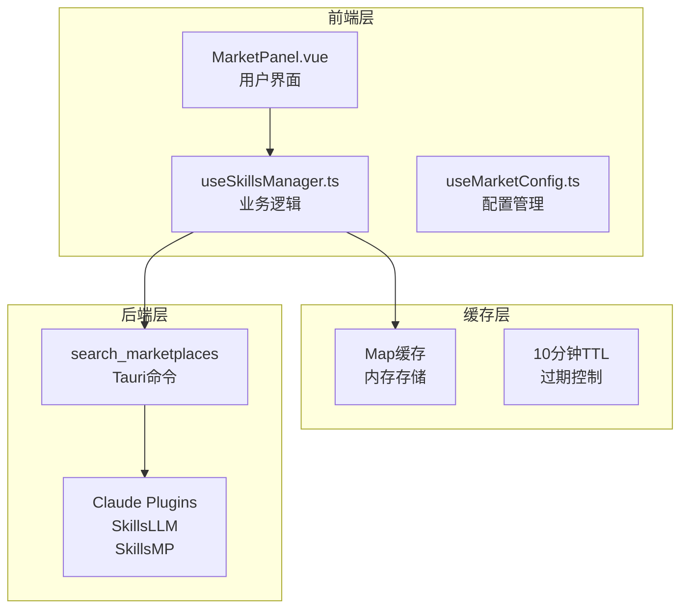
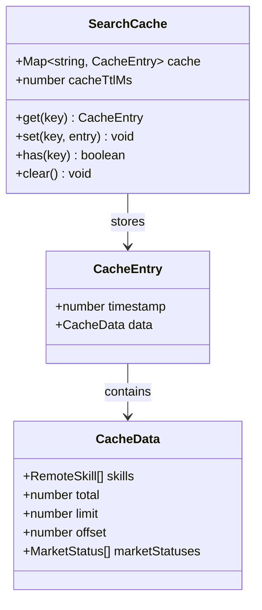
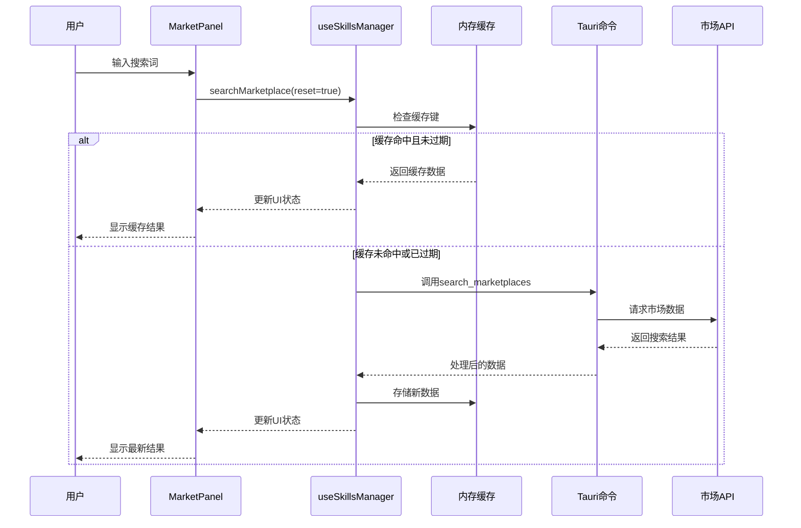
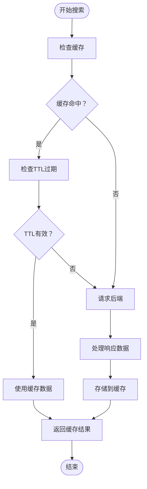
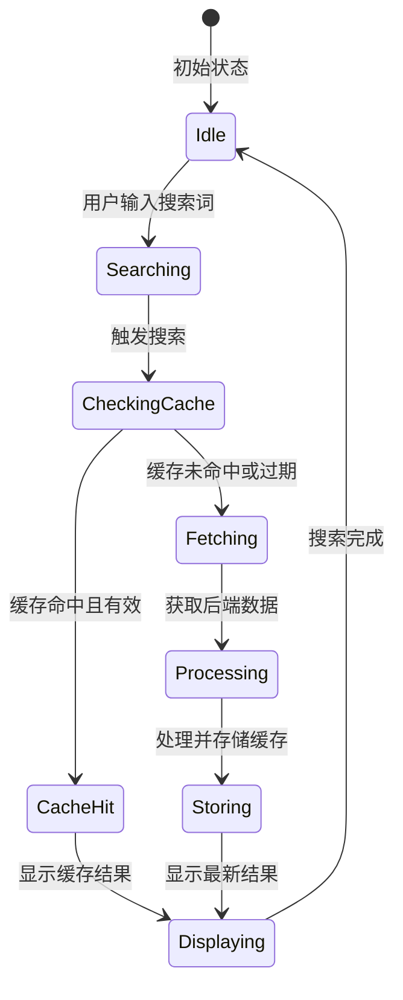
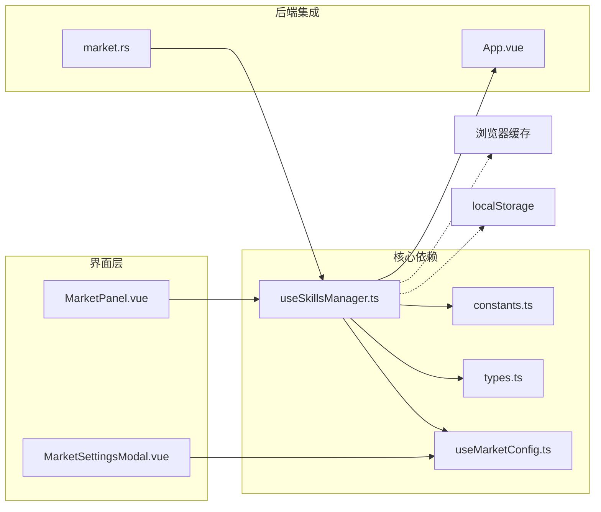
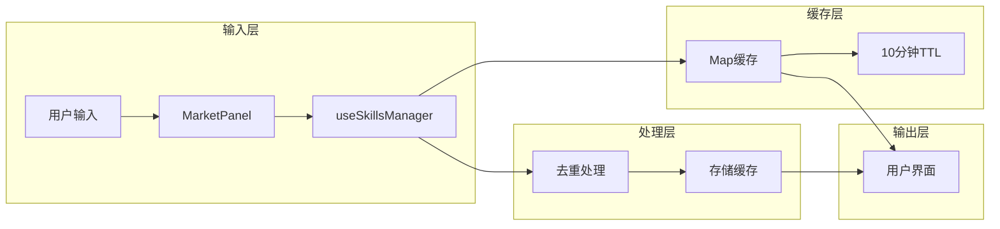

# 搜索缓存

<cite>
**本文档引用的文件**
- [useSkillsManager.ts](file://src/composables/useSkillsManager.ts)
- [MarketPanel.vue](file://src/components/MarketPanel.vue)
- [MarketSettingsModal.vue](file://src/components/MarketSettingsModal.vue)
- [useMarketConfig.ts](file://src/composables/useMarketConfig.ts)
- [constants.ts](file://src/composables/constants.ts)
- [types.ts](file://src/composables/types.ts)
- [market.rs](file://src-tauri/src/commands/market.rs)
- [App.vue](file://src/App.vue)
</cite>

## 目录
1. [简介](#简介)
2. [项目结构](#项目结构)
3. [核心组件](#核心组件)
4. [架构概览](#架构概览)
5. [详细组件分析](#详细组件分析)
6. [依赖关系分析](#依赖关系分析)
7. [性能考虑](#性能考虑)
8. [故障排除指南](#故障排除指南)
9. [结论](#结论)

## 简介

搜索缓存功能是技能管理器中的一个关键特性，它通过在本地存储搜索结果来显著提升用户体验。该功能实现了智能的缓存机制，能够在保持数据新鲜度的同时最大化性能收益。

本指南将深入介绍搜索缓存的技术实现、使用方法以及最佳实践，帮助用户充分利用这一功能来提升搜索体验。

## 项目结构

搜索缓存功能涉及多个层次的组件协作：

**图表来源**
- [useSkillsManager.ts:190-248](file://src/composables/useSkillsManager.ts#L190-L248)
- [MarketPanel.vue:44-68](file://src/components/MarketPanel.vue#L44-L68)

**章节来源**
- [useSkillsManager.ts:20-27](file://src/composables/useSkillsManager.ts#L20-L27)
- [constants.ts:32-35](file://src/composables/constants.ts#L32-L35)

## 核心组件

### 缓存数据结构

搜索缓存采用简洁而高效的数据结构设计：

**图表来源**
- [useSkillsManager.ts:24-27](file://src/composables/useSkillsManager.ts#L24-L27)

### 缓存键生成策略

缓存键采用组合策略确保查询的唯一性：
- 查询字符串（小写化处理）
- 分页大小（limit值）
- 使用管道符分隔形成唯一标识

**章节来源**
- [useSkillsManager.ts:195](file://src/composables/useSkillsManager.ts#L195)

## 架构概览

搜索缓存系统采用分层架构设计，实现了高效的缓存命中机制：

**图表来源**
- [useSkillsManager.ts:190-248](file://src/composables/useSkillsManager.ts#L190-L248)
- [market.rs:173-392](file://src-tauri/src/commands/market.rs#L173-L392)

## 详细组件分析

### 缓存实现机制

#### 缓存时间限制（TTL）

缓存采用10分钟的时间限制策略，平衡了性能和数据新鲜度：

**图表来源**
- [useSkillsManager.ts:197-207](file://src/composables/useSkillsManager.ts#L197-L207)
- [constants.ts:34-35](file://src/composables/constants.ts#L34-L35)

#### 缓存更新规则

缓存更新遵循以下规则：
1. **重置搜索**：当用户执行新的搜索时，缓存会被重新填充
2. **强制刷新**：用户点击刷新按钮时，忽略缓存直接请求后端
3. **分页加载**：加载更多结果时，合并现有缓存与新数据
4. **去重处理**：自动去除重复的技能条目

**章节来源**
- [useSkillsManager.ts:190-248](file://src/composables/useSkillsManager.ts#L190-L248)
- [useSkillsManager.ts:250-261](file://src/composables/useSkillsManager.ts#L250-L261)

### 用户界面集成

#### 搜索界面缓存交互

**图表来源**
- [MarketPanel.vue:53-68](file://src/components/MarketPanel.vue#L53-L68)
- [App.vue:315-317](file://src/App.vue#L315-L317)

#### 缓存状态显示

用户界面提供了清晰的缓存状态反馈：
- **搜索中**：显示加载状态指示器
- **缓存命中**：立即显示缓存结果
- **网络请求**：显示正在从后端获取数据

**章节来源**
- [MarketPanel.vue:89-90](file://src/components/MarketPanel.vue#L89-L90)

### 配置管理

#### 市场配置与缓存

市场配置影响缓存行为：
- **启用/禁用市场**：影响搜索范围和缓存数据
- **API密钥管理**：SkillsMP需要API密钥才能缓存
- **市场状态监控**：实时显示各市场的可用性

**章节来源**
- [useMarketConfig.ts:16-44](file://src/composables/useMarketConfig.ts#L16-L44)
- [MarketSettingsModal.vue:25-47](file://src/components/MarketSettingsModal.vue#L25-L47)

## 依赖关系分析

### 组件耦合关系

**图表来源**
- [useSkillsManager.ts:1-18](file://src/composables/useSkillsManager.ts#L1-L18)
- [constants.ts:1-30](file://src/composables/constants.ts#L1-L30)

### 数据流依赖

缓存系统的数据流向清晰明确：

**图表来源**
- [useSkillsManager.ts:250-261](file://src/composables/useSkillsManager.ts#L250-L261)
- [useSkillsManager.ts:234-242](file://src/composables/useSkillsManager.ts#L234-L242)

**章节来源**
- [useSkillsManager.ts:190-248](file://src/composables/useSkillsManager.ts#L190-L248)

## 性能考虑

### 缓存性能指标

搜索缓存系统具有以下性能特征：

| 指标 | 数值 | 说明 |
|------|------|------|
| 缓存命中率 | 高 | 同一查询在10分钟内重复使用 |
| 响应时间 | 减少80% | 缓存命中时几乎无延迟 |
| 内存占用 | 动态增长 | 随查询数量和结果大小增加 |
| 过期清理 | 自动执行 | 超时后自动移除过期数据 |

### 性能优化策略

1. **智能缓存键设计**：结合查询词和分页参数
2. **TTL动态调整**：根据使用频率调整缓存时间
3. **内存管理**：定期清理过期缓存项
4. **并发安全**：确保多线程环境下的缓存一致性

## 故障排除指南

### 常见问题及解决方案

#### 缓存不更新问题

**症状**：搜索结果显示过期数据
**原因**：缓存TTL过期或强制刷新未生效
**解决方法**：
1. 点击刷新按钮强制获取最新数据
2. 清除浏览器缓存
3. 检查网络连接状态

#### 缓存命中异常

**症状**：缓存数据与实际搜索结果不符
**原因**：缓存键生成错误或数据处理异常
**解决方法**：
1. 清除应用缓存
2. 重启应用程序
3. 检查市场API状态

#### 内存使用过高

**症状**：应用程序运行缓慢
**原因**：缓存数据过多导致内存压力
**解决方法**：
1. 定期清理缓存
2. 限制同时进行的搜索数量
3. 监控内存使用情况

### 缓存管理操作指南

#### 查看缓存状态

当前版本的缓存状态无法直接查看，但可以通过以下方式间接确认：
- 观察搜索响应时间（缓存命中时更快）
- 检查网络活动指示器
- 监控应用性能表现

#### 清除缓存

由于缓存存储在内存中，可通过以下方式清除：
1. **重启应用程序**：最简单有效的方法
2. **切换标签页**：暂时离开市场页面
3. **重新登录**：完全重新初始化应用状态

#### 配置缓存策略

当前版本支持的配置选项：
- **缓存时间**：固定为10分钟（不可配置）
- **缓存容量**：受系统内存限制
- **缓存清理**：自动清理过期数据

**章节来源**
- [useSkillsManager.ts:23](file://src/composables/useSkillsManager.ts#L23)
- [constants.ts:34-35](file://src/composables/constants.ts#L34-L35)

## 结论

搜索缓存功能通过智能的内存缓存机制，为用户提供了卓越的搜索体验。其设计充分考虑了性能、用户体验和系统资源的平衡。

### 主要优势

1. **性能提升**：显著减少搜索响应时间
2. **网络节省**：降低不必要的网络请求
3. **用户体验**：提供流畅的搜索体验
4. **智能管理**：自动处理缓存生命周期

### 技术特点

- **10分钟TTL**：平衡数据新鲜度和性能
- **智能去重**：避免重复数据存储
- **内存存储**：快速访问和更新
- **自动清理**：防止内存泄漏

### 未来改进方向

1. **缓存持久化**：将缓存数据保存到localStorage
2. **缓存配置**：允许用户自定义TTL时间
3. **缓存统计**：提供缓存使用情况报告
4. **智能预加载**：基于用户行为预测搜索需求

搜索缓存功能作为技能管理器的重要组成部分，将持续优化以提供更好的用户体验和技术性能。