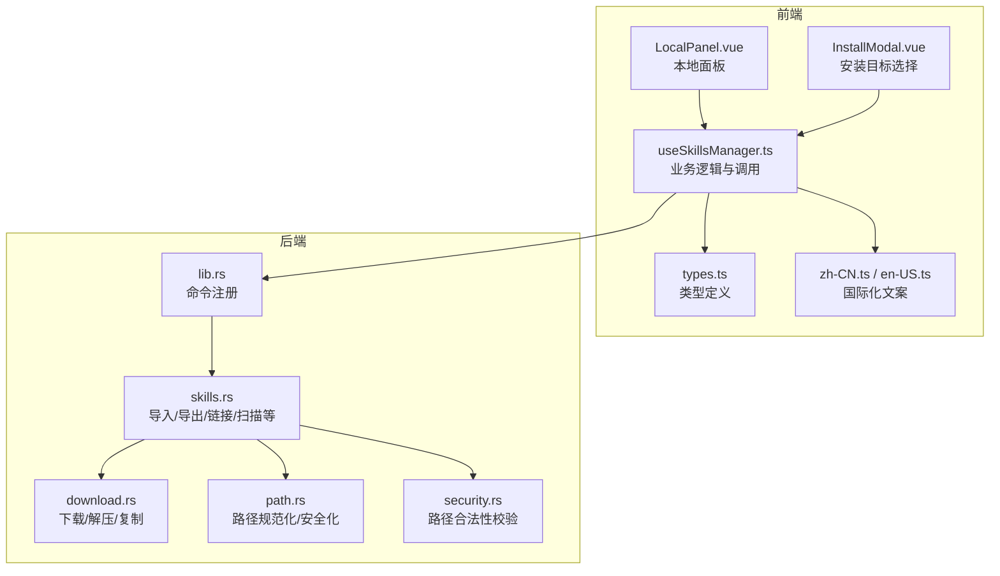
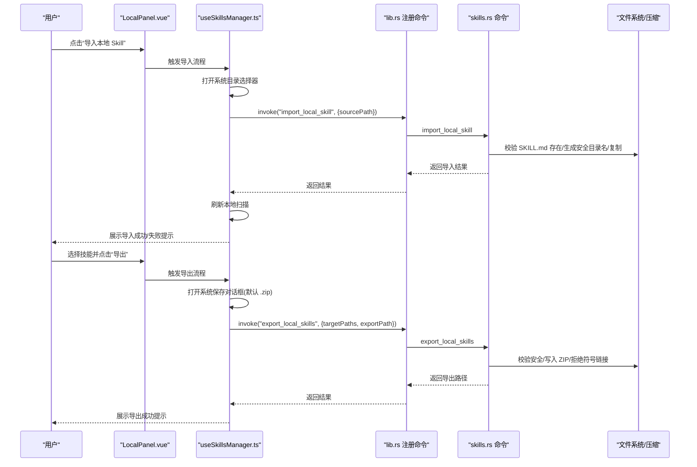
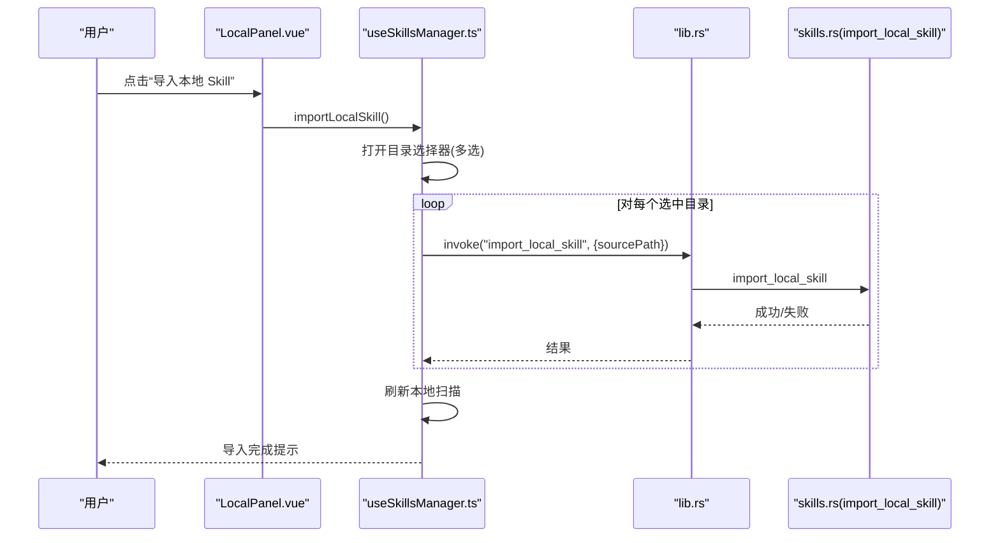
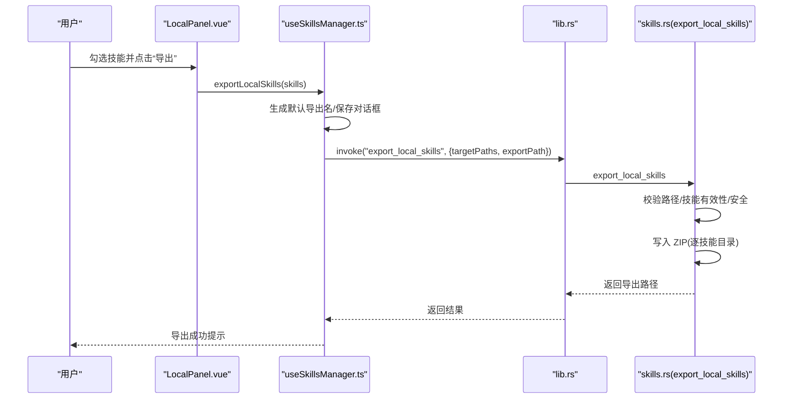
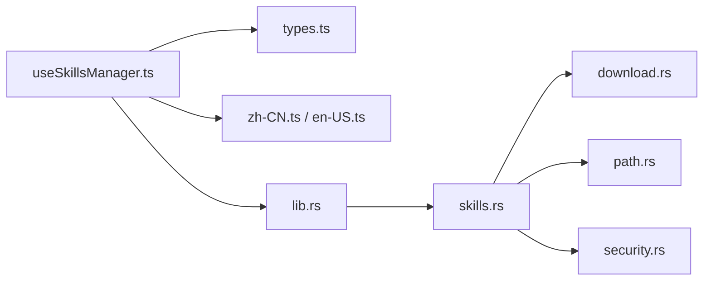

# 导入导出

<cite>
**本文引用的文件**
- [useSkillsManager.ts](file://src/composables/useSkillsManager.ts)
- [skills.rs](file://src-tauri/src/commands/skills.rs)
- [LocalPanel.vue](file://src/components/LocalPanel.vue)
- [InstallModal.vue](file://src/components/InstallModal.vue)
- [download.rs](file://src-tauri/src/utils/download.rs)
- [path.rs](file://src-tauri/src/utils/path.rs)
- [security.rs](file://src-tauri/src/utils/security.rs)
- [lib.rs](file://src-tauri/src/lib.rs)
- [types.ts](file://src/composables/types.ts)
- [zh-CN.ts](file://src/locales/zh-CN.ts)
- [en-US.ts](file://src/locales/en-US.ts)
- [SKILL.md](file://skills/auto-updater/SKILL.md)
- [_meta.json](file://skills/auto-updater/_meta.json)
</cite>

## 目录
1. [简介](#简介)
2. [项目结构](#项目结构)
3. [核心组件](#核心组件)
4. [架构总览](#架构总览)
5. [详细组件分析](#详细组件分析)
6. [依赖关系分析](#依赖关系分析)
7. [性能考量](#性能考量)
8. [故障排除指南](#故障排除指南)
9. [结论](#结论)
10. [附录](#附录)

## 简介
本指南面向“导入导出”功能的使用者与维护者，围绕以下目标提供可操作、可验证的步骤与最佳实践：
- 从文件夹导入技能：文件夹选择、文件格式要求、导入进度监控、导入结果验证
- 导出技能包：技能选择、导出格式、导出路径设置、导出文件结构
- 技能备份与恢复：完整备份、增量备份、备份文件管理、恢复流程
- 最佳实践：文件命名规范、目录结构要求、兼容性考虑
- 具体操作示例与故障排除

## 项目结构
导入导出功能由前端组合式函数与后端 Tauri 命令协同实现，前端负责交互与状态展示，后端负责安全校验、文件系统操作与打包。

**图表来源**
- [LocalPanel.vue:103-220](file://src/components/LocalPanel.vue#L103-L220)
- [InstallModal.vue:65-150](file://src/components/InstallModal.vue#L65-L150)
- [useSkillsManager.ts:633-721](file://src/composables/useSkillsManager.ts#L633-L721)
- [lib.rs:20-40](file://src-tauri/src/lib.rs#L20-L40)
- [skills.rs:611-804](file://src-tauri/src/commands/skills.rs#L611-L804)
- [download.rs:50-116](file://src-tauri/src/utils/download.rs#L50-L116)
- [path.rs:21-89](file://src-tauri/src/utils/path.rs#L21-L89)
- [security.rs:3-92](file://src-tauri/src/utils/security.rs#L3-L92)

**章节来源**
- [useSkillsManager.ts:633-721](file://src/composables/useSkillsManager.ts#L633-L721)
- [skills.rs:611-804](file://src-tauri/src/commands/skills.rs#L611-L804)
- [lib.rs:20-40](file://src-tauri/src/lib.rs#L20-L40)

## 核心组件
- 前端导入/导出入口与状态
  - 导入：通过本地面板触发，弹出系统对话框选择包含技能元数据的目录，逐个执行导入命令并刷新本地扫描结果。
  - 导出：在本地面板选择技能，弹出系统对话框选择导出 ZIP 路径，调用导出命令并提示结果。
- 后端命令与工具
  - 导入：校验源目录含技能元数据文件，生成安全的目标目录名，复制到管理存储。
  - 导出：校验目标路径安全、禁止导出到技能目录内；遍历每个技能目录，写入 ZIP，拒绝符号链接。
  - 路径工具：规范化路径、去除危险组件、Windows 安全命名、WSL 路径识别。
  - 安全工具：相对/绝对路径合法性校验、目录越权检查、Zip 解压防 Zip Slip 与超大文件。

**章节来源**
- [useSkillsManager.ts:633-721](file://src/composables/useSkillsManager.ts#L633-L721)
- [skills.rs:611-804](file://src-tauri/src/commands/skills.rs#L611-L804)
- [download.rs:50-116](file://src-tauri/src/utils/download.rs#L50-L116)
- [path.rs:21-89](file://src-tauri/src/utils/path.rs#L21-L89)
- [security.rs:3-92](file://src-tauri/src/utils/security.rs#L3-L92)

## 架构总览
导入/导出涉及跨前端与后端的调用链路，以及文件系统与压缩库的协作。

**图表来源**
- [LocalPanel.vue:134-153](file://src/components/LocalPanel.vue#L134-L153)
- [useSkillsManager.ts:633-721](file://src/composables/useSkillsManager.ts#L633-L721)
- [lib.rs:27-39](file://src-tauri/src/lib.rs#L27-L39)
- [skills.rs:611-804](file://src-tauri/src/commands/skills.rs#L611-L804)

## 详细组件分析

### 组件一：导入本地技能（从文件夹导入）
- 用户操作
  - 在本地面板点击“导入本地 Skill”，系统弹出目录选择器，选择包含技能元数据文件的目录。
- 前端流程
  - 调用导入方法，循环对每个选中的目录发起导入请求，统计成功/失败数量，最后刷新本地扫描。
- 后端流程
  - 校验源目录存在且包含技能元数据文件；生成安全的目录名；确保目标不存在；复制到管理存储根目录。
- 进度与结果
  - 前端显示“导入中”状态；成功/失败分别提示；最终刷新本地技能列表以验证导入结果。

**图表来源**
- [LocalPanel.vue:134-136](file://src/components/LocalPanel.vue#L134-L136)
- [useSkillsManager.ts:633-684](file://src/composables/useSkillsManager.ts#L633-L684)
- [skills.rs:611-637](file://src-tauri/src/commands/skills.rs#L611-L637)

**章节来源**
- [useSkillsManager.ts:633-684](file://src/composables/useSkillsManager.ts#L633-L684)
- [skills.rs:611-637](file://src-tauri/src/commands/skills.rs#L611-L637)

### 组件二：导出技能包（导出 ZIP）
- 用户操作
  - 在本地面板勾选一个或多个技能，点击“导出选中”或单个技能的“导出”，弹出保存对话框，默认扩展名为 ZIP。
- 前端流程
  - 计算默认导出文件名；调用导出命令，传入目标技能路径数组与导出路径。
- 后端流程
  - 校验导出路径父目录存在并创建；校验每个目标路径属于管理存储且包含技能元数据；确保导出路径不在任一技能目录内部；逐个技能目录写入 ZIP，拒绝符号链接；完成后返回导出路径。
- 结果验证
  - 前端提示导出成功并给出导出路径；可在文件管理器中打开查看。

**图表来源**
- [LocalPanel.vue:140-142](file://src/components/LocalPanel.vue#L140-L142)
- [useSkillsManager.ts:686-721](file://src/composables/useSkillsManager.ts#L686-L721)
- [skills.rs:760-804](file://src-tauri/src/commands/skills.rs#L760-L804)

**章节来源**
- [useSkillsManager.ts:686-721](file://src/composables/useSkillsManager.ts#L686-L721)
- [skills.rs:760-804](file://src-tauri/src/commands/skills.rs#L760-L804)

### 组件三：技能文件结构与元数据
- 必需文件
  - 技能根目录必须包含技能元数据文件，用于读取技能名称与描述等信息。
- 示例参考
  - 示例技能包含技能元数据文件与附加资源文件，便于理解导出后的文件结构。

**章节来源**
- [SKILL.md:1-150](file://skills/auto-updater/SKILL.md#L1-L150)
- [_meta.json:1-6](file://skills/auto-updater/_meta.json#L1-L6)

### 组件四：路径安全与兼容性
- 路径合法性
  - 支持相对路径与绝对路径；相对路径将与用户主目录拼接；绝对路径需满足安全规则（Unix 不允许危险系统路径，Windows/WSL 路径特殊处理）。
- 目录规范化
  - 规范化路径、去除危险组件、Windows 保留名处理、WSL UNC 路径识别。
- 导出安全
  - 禁止导出到技能目录内部；拒绝符号链接内容；Zip 解压防御 Zip Slip 与超大文件。

**章节来源**
- [security.rs:3-92](file://src-tauri/src/utils/security.rs#L3-L92)
- [path.rs:21-89](file://src-tauri/src/utils/path.rs#L21-L89)
- [download.rs:143-183](file://src-tauri/src/utils/download.rs#L143-L183)
- [skills.rs:234-250](file://src-tauri/src/commands/skills.rs#L234-L250)

## 依赖关系分析
- 前端依赖
  - useSkillsManager.ts 依赖 Tauri invoke 与对话框插件，依赖类型定义与国际化文案。
- 后端依赖
  - 命令模块依赖工具模块（路径、安全、下载），使用标准库与第三方压缩库进行文件操作。
- 命令注册
  - lib.rs 将导入/导出等命令注册为可调用接口。

**图表来源**
- [useSkillsManager.ts:1-20](file://src/composables/useSkillsManager.ts#L1-L20)
- [lib.rs:20-40](file://src-tauri/src/lib.rs#L20-L40)
- [skills.rs:1-16](file://src-tauri/src/commands/skills.rs#L1-L16)

**章节来源**
- [useSkillsManager.ts:1-20](file://src/composables/useSkillsManager.ts#L1-L20)
- [lib.rs:20-40](file://src-tauri/src/lib.rs#L20-L40)

## 性能考量
- 导入/导出为同步 IO 操作，建议：
  - 单次批量选择技能数量适中，避免一次性导出过多大体积技能导致长时间占用磁盘。
  - 导出前确保目标磁盘空间充足，避免中途失败。
  - 导入时尽量选择干净的技能根目录，减少冗余文件影响复制效率。

## 故障排除指南
- 导入失败
  - 症状：提示导入失败或部分导入。
  - 可能原因：源目录不含技能元数据文件；目标目录已存在同名技能；权限不足。
  - 处理：确认源目录包含技能元数据文件；更换目标名称或删除旧目录；检查用户主目录写权限。
- 导出失败
  - 症状：导出过程中报错或导出文件为空。
  - 可能原因：导出路径位于技能目录内部；目标路径不安全；包含符号链接；磁盘空间不足。
  - 处理：选择非技能目录的导出路径；确保路径合法；移除符号链接；释放磁盘空间。
- 路径问题
  - 症状：提示无效路径或超出允许范围。
  - 可能原因：相对路径包含非法组件；绝对路径指向系统关键目录；WSL 路径格式不正确。
  - 处理：使用相对路径或合法绝对路径；避免危险系统路径；使用标准 WSL UNC 格式。
- 国际化与界面提示
  - 若界面提示不清晰，可切换语言或查看对应键值文案。

**章节来源**
- [useSkillsManager.ts:633-721](file://src/composables/useSkillsManager.ts#L633-L721)
- [skills.rs:611-804](file://src-tauri/src/commands/skills.rs#L611-L804)
- [security.rs:3-92](file://src-tauri/src/utils/security.rs#L3-L92)
- [zh-CN.ts:170-188](file://src/locales/zh-CN.ts#L170-L188)
- [en-US.ts:170-188](file://src/locales/en-US.ts#L170-L188)

## 结论
导入导出功能通过前后端协作实现了安全、可控的技能迁移能力。前端提供直观的交互与状态反馈，后端严格校验路径与内容，保障系统安全与稳定性。遵循本文的最佳实践与故障排除建议，可高效完成技能的导入、导出与备份恢复工作。

## 附录

### 操作示例

- 从文件夹导入技能
  1) 在本地面板点击“导入本地 Skill”。
  2) 在弹出的目录选择器中勾选包含技能元数据文件的目录，点击“打开”。
  3) 等待导入完成，前端提示成功/失败数量；刷新本地扫描验证导入结果。

- 导出技能包
  1) 在本地面板勾选一个或多个技能，点击“导出选中”或单个技能的“导出”。
  2) 在保存对话框中选择导出路径与文件名（默认扩展名为 ZIP），点击“保存”。
  3) 等待导出完成，前端提示导出成功并给出导出路径；可在文件管理器中打开查看。

- 技能备份与恢复
  - 完整备份：选择多个技能，导出为 ZIP，作为完整备份存档。
  - 增量备份：定期导出新增/变更的技能，形成增量备份。
  - 备份文件管理：按日期/版本命名导出文件，建立目录归档。
  - 恢复流程：在新的环境中导入备份 ZIP 中的技能目录，或直接复制到管理存储根目录后刷新扫描。

**章节来源**
- [LocalPanel.vue:134-153](file://src/components/LocalPanel.vue#L134-L153)
- [useSkillsManager.ts:633-721](file://src/composables/useSkillsManager.ts#L633-L721)
- [skills.rs:760-804](file://src-tauri/src/commands/skills.rs#L760-L804)

### 最佳实践

- 文件命名规范
  - 技能根目录名称应避免包含非法字符；系统会自动规范化为安全名称。
  - Windows 环境下避免使用保留名称，工具会自动处理。

- 目录结构要求
  - 每个技能根目录必须包含技能元数据文件，以便导入与导出时读取名称与描述。
  - 导出路径不得位于任一技能目录内部，避免循环引用与覆盖风险。

- 兼容性考虑
  - 支持相对路径与绝对路径；相对路径将与用户主目录拼接。
  - 支持 WSL UNC 路径；避免指向 Unix 系统关键目录。
  - 导出时拒绝符号链接，确保备份内容可移植。

**章节来源**
- [path.rs:61-89](file://src-tauri/src/utils/path.rs#L61-L89)
- [security.rs:3-92](file://src-tauri/src/utils/security.rs#L3-L92)
- [download.rs:185-210](file://src-tauri/src/utils/download.rs#L185-L210)
- [skills.rs:277-282](file://src-tauri/src/commands/skills.rs#L277-L282)