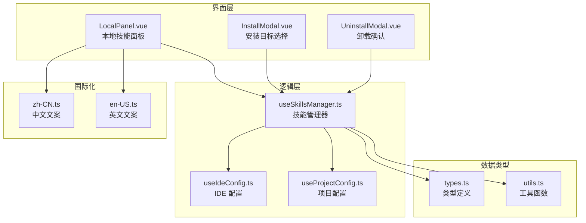
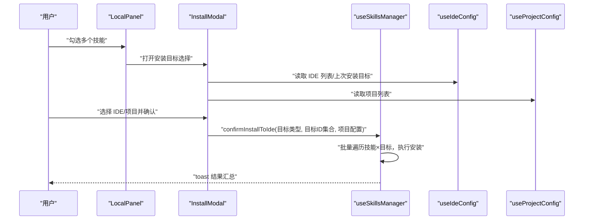
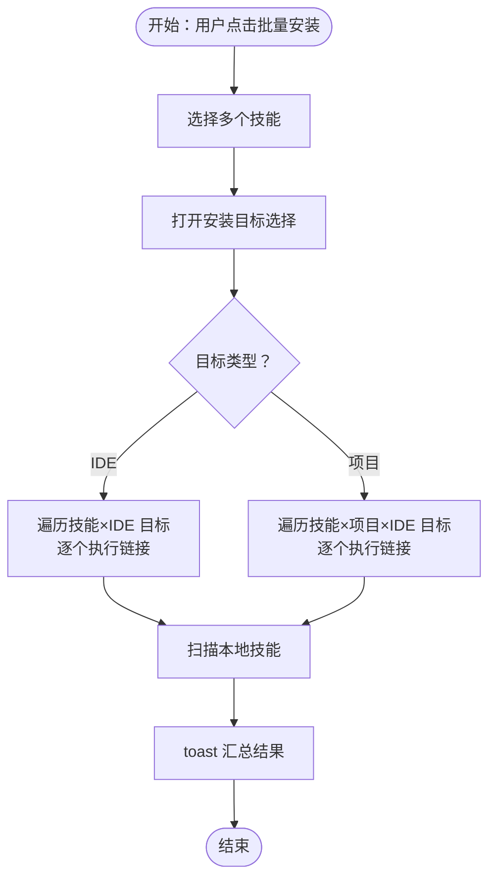
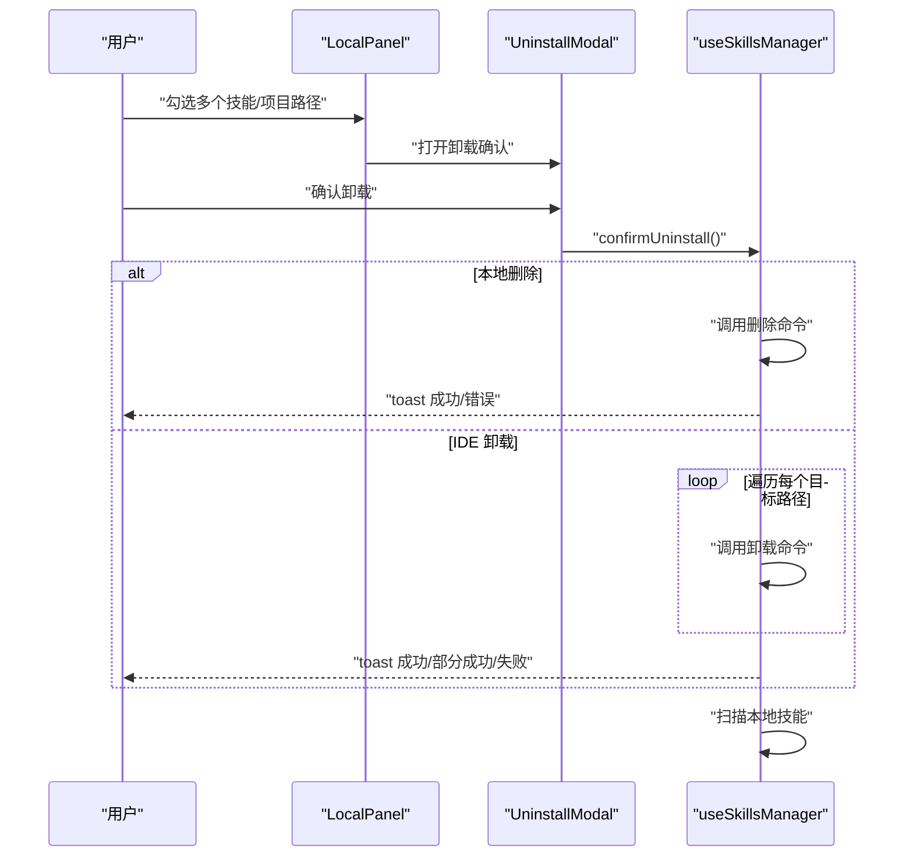
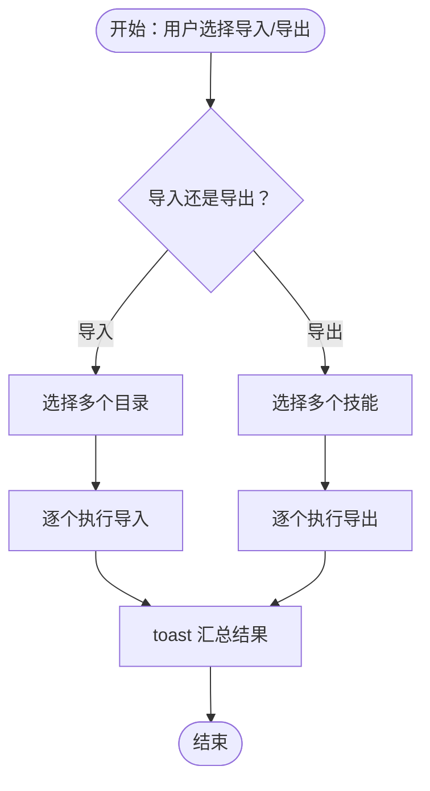
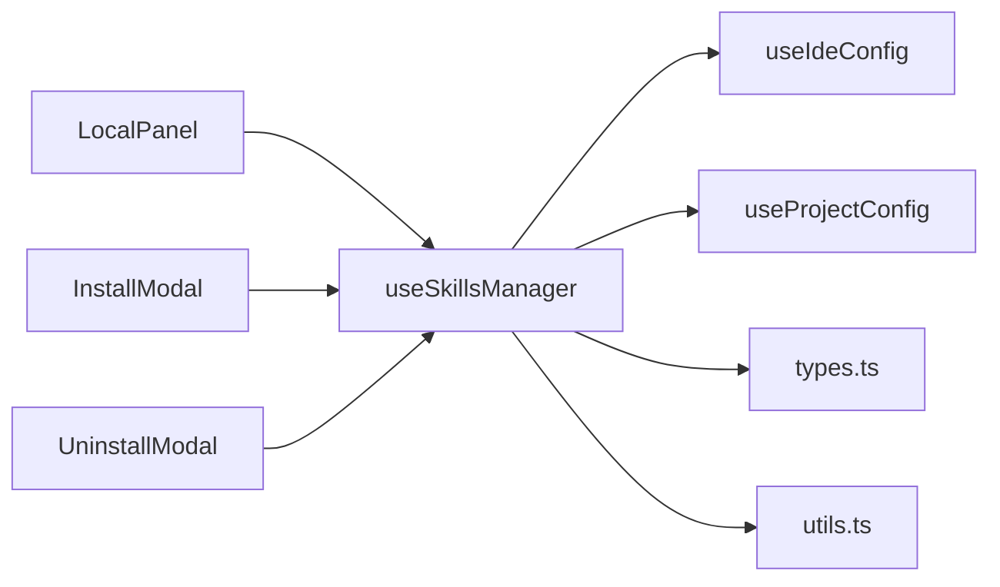

# 批量操作

<cite>
**本文引用的文件**
- [App.vue](file://src/App.vue)
- [LocalPanel.vue](file://src/components/LocalPanel.vue)
- [InstallModal.vue](file://src/components/InstallModal.vue)
- [UninstallModal.vue](file://src/components/UninstallModal.vue)
- [useSkillsManager.ts](file://src/composables/useSkillsManager.ts)
- [types.ts](file://src/composables/types.ts)
- [utils.ts](file://src/composables/utils.ts)
- [useIdeConfig.ts](file://src/composables/useIdeConfig.ts)
- [useProjectConfig.ts](file://src/composables/useProjectConfig.ts)
- [ProjectConfigModal.vue](file://src/components/ProjectConfigModal.vue)
- [zh-CN.ts](file://src/locales/zh-CN.ts)
- [en-US.ts](file://src/locales/en-US.ts)
</cite>

## 目录
1. [简介](#简介)
2. [项目结构](#项目结构)
3. [核心组件](#核心组件)
4. [架构总览](#架构总览)
5. [详细组件分析](#详细组件分析)
6. [依赖关系分析](#依赖关系分析)
7. [性能考量](#性能考量)
8. [故障排查指南](#故障排查指南)
9. [结论](#结论)
10. [附录](#附录)

## 简介
本指南面向使用“技能管理器”的用户，系统性讲解批量操作能力，包括：
- 批量安装：多选技能、批量安装到 IDE 或项目、安装进度与结果反馈
- 批量卸载：批量删除确认、卸载安全检查、卸载结果验证
- 批量导入导出：批量文件选择、批量操作确认、批量操作日志
并提供最佳实践与注意事项，帮助您高效、安全地完成批量操作。

## 项目结构
批量操作涉及前端 Vue 组件与可复用组合式函数（composables），以及后端命令调用（通过 Tauri invoke）。核心交互路径如下：
- 用户在本地面板进行多选
- 触发批量安装时弹出安装目标选择模态框
- 选择 IDE 或项目后执行批量安装
- 卸载时弹出确认模态框，逐项执行卸载
- 导入/导出支持多文件选择与批量处理

图表来源
- [App.vue:280-398](file://src/App.vue#L280-L398)
- [LocalPanel.vue:1-310](file://src/components/LocalPanel.vue#L1-L310)
- [InstallModal.vue:1-150](file://src/components/InstallModal.vue#L1-L150)
- [UninstallModal.vue:1-37](file://src/components/UninstallModal.vue#L1-L37)
- [useSkillsManager.ts:1-867](file://src/composables/useSkillsManager.ts#L1-L867)
- [useIdeConfig.ts:1-131](file://src/composables/useIdeConfig.ts#L1-L131)
- [useProjectConfig.ts:1-127](file://src/composables/useProjectConfig.ts#L1-L127)
- [types.ts:1-119](file://src/composables/types.ts#L1-L119)
- [utils.ts:1-125](file://src/composables/utils.ts#L1-L125)
- [zh-CN.ts:1-241](file://src/locales/zh-CN.ts#L1-L241)
- [en-US.ts:1-241](file://src/locales/en-US.ts#L1-L241)

章节来源
- [App.vue:280-398](file://src/App.vue#L280-L398)
- [LocalPanel.vue:1-310](file://src/components/LocalPanel.vue#L1-L310)
- [InstallModal.vue:1-150](file://src/components/InstallModal.vue#L1-L150)
- [UninstallModal.vue:1-37](file://src/components/UninstallModal.vue#L1-L37)
- [useSkillsManager.ts:1-867](file://src/composables/useSkillsManager.ts#L1-L867)
- [useIdeConfig.ts:1-131](file://src/composables/useIdeConfig.ts#L1-L131)
- [useProjectConfig.ts:1-127](file://src/composables/useProjectConfig.ts#L1-L127)
- [types.ts:1-119](file://src/composables/types.ts#L1-L119)
- [utils.ts:1-125](file://src/composables/utils.ts#L1-L125)
- [zh-CN.ts:1-241](file://src/locales/zh-CN.ts#L1-L241)
- [en-US.ts:1-241](file://src/locales/en-US.ts#L1-L241)

## 核心组件
- 本地面板（LocalPanel）：提供多选、批量安装、批量导出、批量删除入口，并展示下载队列与扫描状态。
- 安装目标选择模态框（InstallModal）：支持多选 IDE 与多选项目，确认后触发批量安装。
- 卸载确认模态框（UninstallModal）：支持单个/多个目标的卸载确认与执行。
- 技能管理器组合式函数（useSkillsManager）：封装批量安装、批量卸载、批量导入导出、下载队列处理等核心逻辑。
- IDE 配置组合式函数（useIdeConfig）：维护 IDE 列表与上次安装目标记录。
- 项目配置组合式函数（useProjectConfig）：维护项目列表、IDE 目标映射与项目级链接目标生成。

章节来源
- [LocalPanel.vue:1-310](file://src/components/LocalPanel.vue#L1-L310)
- [InstallModal.vue:1-150](file://src/components/InstallModal.vue#L1-L150)
- [UninstallModal.vue:1-37](file://src/components/UninstallModal.vue#L1-L37)
- [useSkillsManager.ts:1-867](file://src/composables/useSkillsManager.ts#L1-L867)
- [useIdeConfig.ts:1-131](file://src/composables/useIdeConfig.ts#L1-L131)
- [useProjectConfig.ts:1-127](file://src/composables/useProjectConfig.ts#L1-L127)

## 架构总览
批量操作的控制流由 LocalPanel 触发，InstallModal/UninstallModal 提供用户交互，useSkillsManager 负责业务逻辑与后端命令调用，useIdeConfig/useProjectConfig 提供上下文数据。

图表来源
- [LocalPanel.vue:87-100](file://src/components/LocalPanel.vue#L87-L100)
- [InstallModal.vue:40-56](file://src/components/InstallModal.vue#L40-L56)
- [useSkillsManager.ts:414-499](file://src/composables/useSkillsManager.ts#L414-L499)
- [useIdeConfig.ts:59-131](file://src/composables/useIdeConfig.ts#L59-L131)
- [useProjectConfig.ts:116-127](file://src/composables/useProjectConfig.ts#L116-L127)

## 详细组件分析

### 批量安装（IDE/项目）
- 多选技能：LocalPanel 支持全选与逐项勾选，批量安装按钮在有选中项时启用。
- 选择安装目标：InstallModal 提供 IDE 与项目两列，分别支持多选；确认后触发批量安装。
- 批量安装流程：
  - IDE 批量安装：遍历每个技能与每个目标 IDE，逐个执行链接；最终汇总 toast 结果。
  - 项目批量安装：根据项目配置的 IDE 目标，为每个技能在每个项目中按 IDE 目标执行链接。
- 进度与反馈：
  - 使用“忙碌态”与提示文本显示安装中状态。
  - 安装完成后扫描本地技能并刷新列表，toast 展示成功/跳过的数量统计。

图表来源
- [LocalPanel.vue:87-100](file://src/components/LocalPanel.vue#L87-L100)
- [InstallModal.vue:40-56](file://src/components/InstallModal.vue#L40-L56)
- [useSkillsManager.ts:414-499](file://src/composables/useSkillsManager.ts#L414-L499)

章节来源
- [LocalPanel.vue:87-100](file://src/components/LocalPanel.vue#L87-L100)
- [InstallModal.vue:40-56](file://src/components/InstallModal.vue#L40-L56)
- [useSkillsManager.ts:414-499](file://src/composables/useSkillsManager.ts#L414-L499)

### 批量卸载（IDE/本地）
- 批量删除确认：UninstallModal 支持单个/多个目标的卸载确认；本地删除与 IDE 卸载分别处理。
- 卸载安全检查：
  - IDE 卸载：逐个调用后端卸载命令，统计成功/失败数量，toast 展示部分成功/全部成功/失败。
  - 本地删除：调用后端删除命令，toast 返回消息。
- 卸载结果验证：卸载完成后扫描本地技能，确保状态一致。

图表来源
- [LocalPanel.vue:97-100](file://src/components/LocalPanel.vue#L97-L100)
- [UninstallModal.vue:18-36](file://src/components/UninstallModal.vue#L18-L36)
- [useSkillsManager.ts:568-624](file://src/composables/useSkillsManager.ts#L568-L624)

章节来源
- [LocalPanel.vue:97-100](file://src/components/LocalPanel.vue#L97-L100)
- [UninstallModal.vue:18-36](file://src/components/UninstallModal.vue#L18-L36)
- [useSkillsManager.ts:568-624](file://src/composables/useSkillsManager.ts#L568-L624)

### 批量导入/导出
- 批量文件选择：导入支持多目录选择；导出支持多技能选择。
- 批量操作确认：导入/导出均在用户确认后执行，逐个处理并汇总结果。
- 批量操作日志：toast 展示成功/失败计数与最终路径信息。

图表来源
- [LocalPanel.vue:134-152](file://src/components/LocalPanel.vue#L134-L152)
- [useSkillsManager.ts:633-684](file://src/composables/useSkillsManager.ts#L633-L684)
- [useSkillsManager.ts:686-721](file://src/composables/useSkillsManager.ts#L686-L721)

章节来源
- [LocalPanel.vue:134-152](file://src/components/LocalPanel.vue#L134-L152)
- [useSkillsManager.ts:633-684](file://src/composables/useSkillsManager.ts#L633-L684)
- [useSkillsManager.ts:686-721](file://src/composables/useSkillsManager.ts#L686-L721)

## 依赖关系分析
- LocalPanel 依赖 useSkillsManager 的事件发射与状态（安装、导出、删除、导入、扫描等）。
- InstallModal 依赖 useIdeConfig 获取 IDE 列表与上次安装目标，依赖 useProjectConfig 获取项目列表。
- UninstallModal 依赖 useSkillsManager 的卸载流程与状态。
- useSkillsManager 依赖 Tauri invoke 与后端命令，负责批量遍历与结果汇总。
- types.ts 定义了批量操作涉及的数据结构（LocalSkill、ProjectConfig、LinkTarget、DownloadTask 等）。
- utils.ts 提供路径安全校验等基础能力，保障批量操作的安全性。

图表来源
- [LocalPanel.vue:18-28](file://src/components/LocalPanel.vue#L18-L28)
- [InstallModal.vue:3-10](file://src/components/InstallModal.vue#L3-L10)
- [UninstallModal.vue:1-8](file://src/components/UninstallModal.vue#L1-L8)
- [useSkillsManager.ts:1-20](file://src/composables/useSkillsManager.ts#L1-L20)
- [useIdeConfig.ts:1-5](file://src/composables/useIdeConfig.ts#L1-L5)
- [useProjectConfig.ts:1-5](file://src/composables/useProjectConfig.ts#L1-L5)
- [types.ts:1-119](file://src/composables/types.ts#L1-L119)
- [utils.ts:1-125](file://src/composables/utils.ts#L1-L125)

章节来源
- [LocalPanel.vue:18-28](file://src/components/LocalPanel.vue#L18-L28)
- [InstallModal.vue:3-10](file://src/components/InstallModal.vue#L3-L10)
- [UninstallModal.vue:1-8](file://src/components/UninstallModal.vue#L1-L8)
- [useSkillsManager.ts:1-20](file://src/composables/useSkillsManager.ts#L1-L20)
- [useIdeConfig.ts:1-5](file://src/composables/useIdeConfig.ts#L1-L5)
- [useProjectConfig.ts:1-5](file://src/composables/useProjectConfig.ts#L1-L5)
- [types.ts:1-119](file://src/composables/types.ts#L1-L119)
- [utils.ts:1-125](file://src/composables/utils.ts#L1-L125)

## 性能考量
- 批量遍历：批量安装/卸载会多次调用后端命令，建议在操作前尽量减少不必要的技能/项目数量，避免超大范围批量操作导致耗时较长。
- 下载队列：下载/更新采用队列串行处理，避免并发冲突；批量导入/导出同样逐个执行，保证稳定性。
- UI 响应：批量操作期间启用“忙碌态”，避免重复触发；完成后自动刷新扫描，确保 UI 与实际状态一致。

## 故障排查指南
- 无法批量安装
  - 检查是否选择了至少一个技能与至少一个目标（IDE 或项目）。
  - 若提示“请选择有效的 IDE”或“请选择至少一个 IDE”，请在 IDE 设置中正确配置路径。
- 批量卸载失败
  - 对于部分失败的情况，toast 会提示成功/失败数量；请检查目标路径是否存在或权限问题。
  - 若出现“卸载失败”，请重试或单独卸载有问题的目标。
- 导入/导出异常
  - 导入时若部分失败，toast 会包含最后一次错误信息；请检查所选目录是否包含有效技能文件。
  - 导出时若路径无效，系统会自动补全扩展名；请确认保存位置可写。
- 路径安全
  - IDE 路径需满足相对路径或绝对路径的安全规则；不支持危险路径（如系统关键目录）。

章节来源
- [useSkillsManager.ts:424-427](file://src/composables/useSkillsManager.ts#L424-L427)
- [useSkillsManager.ts:583-598](file://src/composables/useSkillsManager.ts#L583-L598)
- [useSkillsManager.ts:633-684](file://src/composables/useSkillsManager.ts#L633-L684)
- [useSkillsManager.ts:686-721](file://src/composables/useSkillsManager.ts#L686-L721)
- [utils.ts:34-92](file://src/composables/utils.ts#L34-L92)

## 结论
批量操作提供了高效的技能管理体验：多选即能一键安装到 IDE 或项目，也能批量卸载、导入与导出。通过 InstallModal/UninstallModal 的交互与 useSkillsManager 的批量遍历逻辑，配合 useIdeConfig/useProjectConfig 的上下文数据，用户可以安全、可控地完成大批量任务。建议遵循最佳实践，在操作前做好准备与核对，操作中关注进度与提示，操作后进行验证以确保一致性。

## 附录

### 最佳实践与注意事项
- 操作前的准备工作
  - 在 IDE 设置中配置正确的 IDE 路径，确保相对/绝对路径均符合安全规则。
  - 在项目管理中为项目配置 IDE 目标，以便进行项目级批量安装。
- 操作中的监控要点
  - 关注“忙碌态”与提示文本，避免重复触发。
  - 批量安装时留意 toast 的成功/跳过统计，必要时分批执行。
  - 批量卸载时留意部分成功/全部成功的提示，及时处理失败项。
- 操作后的验证步骤
  - 批量安装/卸载后，扫描本地技能以刷新状态。
  - 打开技能目录确认链接/删除结果是否符合预期。

章节来源
- [useIdeConfig.ts:76-104](file://src/composables/useIdeConfig.ts#L76-L104)
- [useProjectConfig.ts:100-114](file://src/composables/useProjectConfig.ts#L100-L114)
- [useSkillsManager.ts:353-374](file://src/composables/useSkillsManager.ts#L353-L374)
- [useSkillsManager.ts:568-624](file://src/composables/useSkillsManager.ts#L568-L624)