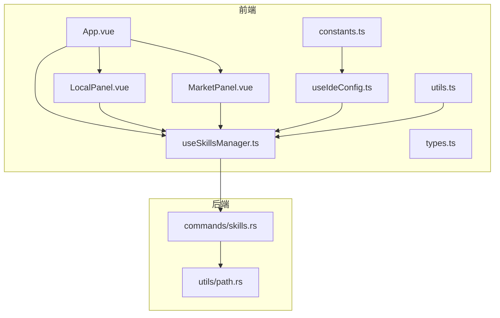
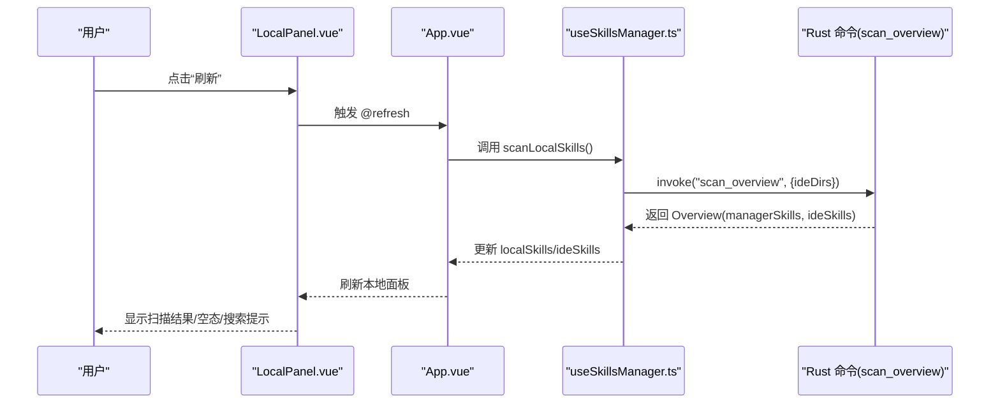
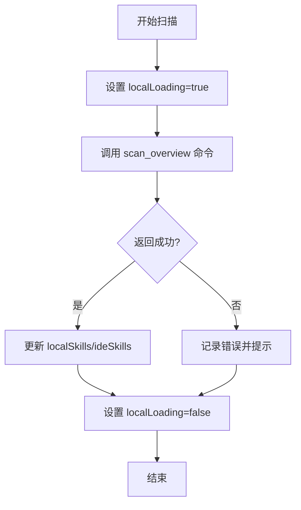
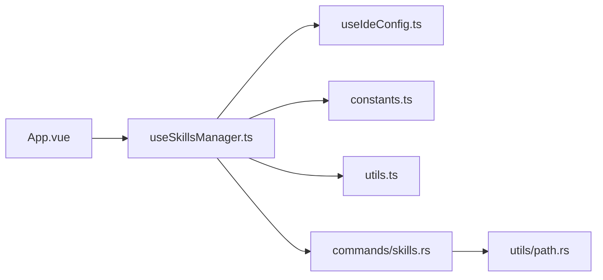

# 技能扫描

<cite>
**本文引用的文件**
- [src/App.vue](file://src/App.vue)
- [src/components/LocalPanel.vue](file://src/components/LocalPanel.vue)
- [src/components/MarketPanel.vue](file://src/components/MarketPanel.vue)
- [src/composables/useSkillsManager.ts](file://src/composables/useSkillsManager.ts)
- [src/composables/types.ts](file://src/composables/types.ts)
- [src/composables/useIdeConfig.ts](file://src/composables/useIdeConfig.ts)
- [src/composables/constants.ts](file://src/composables/constants.ts)
- [src/composables/utils.ts](file://src/composables/utils.ts)
- [src-tauri/src/commands/skills.rs](file://src-tauri/src/commands/skills.rs)
- [src-tauri/src/utils/path.rs](file://src-tauri/src/utils/path.rs)
- [README_zh-CN.md](file://README_zh-CN.md)
- [src/locales/zh-CN.ts](file://src/locales/zh-CN.ts)
</cite>

## 目录
1. [简介](#简介)
2. [项目结构](#项目结构)
3. [核心组件](#核心组件)
4. [架构总览](#架构总览)
5. [详细组件分析](#详细组件分析)
6. [依赖关系分析](#依赖关系分析)
7. [性能考量](#性能考量)
8. [故障排查指南](#故障排查指南)
9. [结论](#结论)
10. [附录](#附录)

## 简介
本指南面向“技能扫描”功能，帮助用户理解并高效使用自动扫描与手动扫描机制。内容涵盖：
- 扫描范围配置（全局 IDE 目录、项目 IDE 目录）
- 扫描触发方式（自动启动扫描、手动刷新）
- 扫描结果展示（本地仓库、IDE 视图、市场对比）
- 手动扫描流程与进度状态
- 常见失败原因与解决方案（权限、路径、网络）

## 项目结构
技能扫描涉及前端 Vue 组件与后端 Rust 命令的协同：
- 前端负责 UI 展示、交互与调用后端命令
- 后端负责实际文件系统扫描、链接建立与安全校验

图表来源
- [src/App.vue:204-400](file://src/App.vue#L204-L400)
- [src/components/LocalPanel.vue:1-100](file://src/components/LocalPanel.vue#L1-L100)
- [src/components/MarketPanel.vue:1-80](file://src/components/MarketPanel.vue#L1-L80)
- [src/composables/useSkillsManager.ts:1-120](file://src/composables/useSkillsManager.ts#L1-L120)
- [src/composables/types.ts:1-119](file://src/composables/types.ts#L1-L119)
- [src/composables/useIdeConfig.ts:1-131](file://src/composables/useIdeConfig.ts#L1-L131)
- [src/composables/constants.ts:1-72](file://src/composables/constants.ts#L1-L72)
- [src/composables/utils.ts:1-125](file://src/composables/utils.ts#L1-L125)
- [src-tauri/src/commands/skills.rs:451-535](file://src-tauri/src/commands/skills.rs#L451-L535)
- [src-tauri/src/utils/path.rs:1-90](file://src-tauri/src/utils/path.rs#L1-L90)

章节来源
- [src/App.vue:204-400](file://src/App.vue#L204-L400)
- [src/composables/useSkillsManager.ts:795-800](file://src/composables/useSkillsManager.ts#L795-L800)

## 核心组件
- App.vue：承载页面布局与标签页切换，注入 useSkillsManager 并将扫描、安装、卸载等动作传递给子组件。
- LocalPanel.vue：展示本地技能卡片、搜索过滤、批量操作与“扫描中”提示。
- MarketPanel.vue：展示市场搜索结果、排序与“刷新/搜索”按钮。
- useSkillsManager.ts：核心业务逻辑，封装扫描、下载队列、安装、导出、错误提示等。
- commands/skills.rs：后端命令实现，包括 scan_overview、link_local_skill、uninstall_skill 等。

章节来源
- [src/App.vue:73-124](file://src/App.vue#L73-L124)
- [src/components/LocalPanel.vue:103-167](file://src/components/LocalPanel.vue#L103-L167)
- [src/components/MarketPanel.vue:44-91](file://src/components/MarketPanel.vue#L44-L91)
- [src/composables/useSkillsManager.ts:353-374](file://src/composables/useSkillsManager.ts#L353-L374)
- [src-tauri/src/commands/skills.rs:451-535](file://src-tauri/src/commands/skills.rs#L451-L535)

## 架构总览
技能扫描的端到端流程如下：

图表来源
- [src/components/LocalPanel.vue:131-133](file://src/components/LocalPanel.vue#L131-L133)
- [src/App.vue:292](file://src/App.vue#L292)
- [src/composables/useSkillsManager.ts:353-374](file://src/composables/useSkillsManager.ts#L353-L374)
- [src-tauri/src/commands/skills.rs:451-535](file://src-tauri/src/commands/skills.rs#L451-L535)

## 详细组件分析

### 自动扫描机制
- 启动时自动扫描：应用挂载后，调用扫描函数初始化本地技能列表。
- 扫描范围：
  - 默认扫描用户主目录下的多个 IDE 技能目录（内置映射）。
  - 可通过 IDE 配置扩展自定义 IDE 目录（相对或绝对路径）。
- 结果合并：
  - 将“本地仓库”与“各 IDE 目录”中的技能进行去重与关联标记（usedBy）。

章节来源
- [src/composables/useSkillsManager.ts:795-800](file://src/composables/useSkillsManager.ts#L795-L800)
- [src/composables/useIdeConfig.ts:69-74](file://src/composables/useIdeConfig.ts#L69-L74)
- [src-tauri/src/commands/skills.rs:458-492](file://src-tauri/src/commands/skills.rs#L458-L492)

### 手动扫描与刷新
- 触发入口：
  - 本地面板顶部“刷新”按钮。
  - 市场面板顶部“刷新/搜索”按钮（用于重新拉取市场数据，同时可触发本地扫描）。
- 进度与状态：
  - 扫描期间显示“扫描中”提示。
  - 扫描完成后根据结果展示空态或技能卡片。
- 扫描结果展示：
  - 本地面板：列出本地仓库技能、IDE 关联状态、批量操作。
  - IDE 浏览：按 IDE 切换查看各 IDE 中的技能。
  - 市场面板：展示市场搜索结果，对比本地是否已安装。

章节来源
- [src/components/LocalPanel.vue:131-133](file://src/components/LocalPanel.vue#L131-L133)
- [src/components/LocalPanel.vue:162-166](file://src/components/LocalPanel.vue#L162-L166)
- [src/components/MarketPanel.vue:65-67](file://src/components/MarketPanel.vue#L65-L67)
- [src/App.vue:280-296](file://src/App.vue#L280-L296)

### 扫描范围配置
- 内置 IDE 目录映射：Antigravity、Claude Code、CodeBuddy、Codex、Cursor、Kiro、OpenClaw、OpenCode、Qoder、Trae、VSCode、Windsurf。
- 自定义 IDE：
  - 在设置中添加自定义 IDE 名称与目录（相对路径或绝对路径）。
  - 添加成功后会触发一次本地扫描，确保新目录被纳入扫描范围。
- 项目级 IDE 目录：
  - 项目面板可扫描并配置项目内的 IDE 目录，便于将技能挂载到特定项目。

章节来源
- [src/composables/constants.ts:6-19](file://src/composables/constants.ts#L6-L19)
- [src/composables/useIdeConfig.ts:76-104](file://src/composables/useIdeConfig.ts#L76-L104)
- [src/App.vue:168-180](file://src/App.vue#L168-L180)

### 扫描结果展示
- 本地仓库（Local Panel）：
  - 展示技能名称、描述、路径、IDE 关联状态（已关联/未关联）。
  - 支持搜索、全选、批量安装、导出、删除等操作。
- IDE 浏览（Ide Panel）：
  - 按 IDE 切换查看各 IDE 中的技能，支持安全卸载与纳入统一管理。
- 市场（Market Panel）：
  - 展示来自多个市场的技能，支持排序与“下载/更新”。

章节来源
- [src/components/LocalPanel.vue:167-218](file://src/components/LocalPanel.vue#L167-L218)
- [src/components/MarketPanel.vue:92-137](file://src/components/MarketPanel.vue#L92-L137)
- [src/App.vue:324-343](file://src/App.vue#L324-L343)

### 扫描流程与状态机

图表来源
- [src/composables/useSkillsManager.ts:353-374](file://src/composables/useSkillsManager.ts#L353-L374)
- [src-tauri/src/commands/skills.rs:451-535](file://src-tauri/src/commands/skills.rs#L451-L535)

## 依赖关系分析
- 前端依赖关系：
  - App.vue 注入 useSkillsManager，向子组件暴露状态与方法。
  - LocalPanel/MarketPanel 通过事件与回调与 useSkillsManager 通信。
  - useSkillsManager 依赖 useIdeConfig、constants、utils 提供 IDE 配置、默认映射与路径校验。
- 后端依赖关系：
  - scan_overview 依赖 path 工具进行路径规范化与安全校验，再遍历目录收集技能信息。

图表来源
- [src/App.vue:73-124](file://src/App.vue#L73-L124)
- [src/composables/useSkillsManager.ts:116-135](file://src/composables/useSkillsManager.ts#L116-L135)
- [src/composables/useIdeConfig.ts:1-131](file://src/composables/useIdeConfig.ts#L1-L131)
- [src/composables/constants.ts:1-72](file://src/composables/constants.ts#L1-L72)
- [src/composables/utils.ts:1-125](file://src/composables/utils.ts#L1-L125)
- [src-tauri/src/commands/skills.rs:1-16](file://src-tauri/src/commands/skills.rs#L1-L16)
- [src-tauri/src/utils/path.rs:1-90](file://src-tauri/src/utils/path.rs#L1-L90)

章节来源
- [src/App.vue:73-124](file://src/App.vue#L73-L124)
- [src/composables/useSkillsManager.ts:116-135](file://src/composables/useSkillsManager.ts#L116-L135)

## 性能考量
- 前端缓存：市场搜索结果具备 10 分钟 TTL 的内存缓存，减少重复请求。
- 扫描开销：扫描会遍历多个 IDE 目录，建议合理配置 IDE 目录数量与层级，避免过大目录导致耗时。
- UI 响应：扫描期间启用 loading 状态，避免重复触发扫描。

章节来源
- [src/composables/useSkillsManager.ts:20-27](file://src/composables/useSkillsManager.ts#L20-L27)
- [src/composables/useSkillsManager.ts:353-374](file://src/composables/useSkillsManager.ts#L353-L374)

## 故障排查指南
常见失败场景与解决建议：
- 权限问题
  - 症状：无法读取某些 IDE 目录或创建链接。
  - 排查：确认应用具有访问对应目录的权限；必要时提升权限或调整目录归属。
- 路径无效
  - 症状：扫描报错“无效 IDE 目录”或“路径不在允许范围内”。
  - 排查：检查自定义 IDE 目录是否为相对路径且不包含父目录穿越；或为合法绝对路径。
- 网络连接
  - 症状：市场搜索失败或下载队列任务报错。
  - 排查：检查网络连通性；若使用需要 API Key 的市场，需在设置中正确配置。
- 扫描失败
  - 症状：本地面板提示“扫描失败”。
  - 排查：查看日志与错误提示，确认 IDE 目录是否存在、权限是否足够；必要时清理缓存后重试。

章节来源
- [src-tauri/src/commands/skills.rs:479-491](file://src-tauri/src/commands/skills.rs#L479-L491)
- [src/composables/utils.ts:34-99](file://src/composables/utils.ts#L34-L99)
- [src/locales/zh-CN.ts:170-188](file://src/locales/zh-CN.ts#L170-L188)

## 结论
技能扫描功能通过“自动启动扫描 + 手动刷新”的方式，结合灵活的 IDE 目录配置，实现了对本地仓库与多 IDE 环境的统一视图。配合下载队列、批量安装与安全卸载，用户可以高效地管理技能生态。遇到问题时，优先检查路径合法性与权限，其次核对网络与市场配置，最后通过重新扫描与缓存清理定位根因。

## 附录

### 操作步骤（本地扫描）
- 打开“已有 Skills”标签页
- 点击顶部“刷新”按钮
- 等待“扫描中”提示消失，查看本地技能列表

章节来源
- [src/components/LocalPanel.vue:131-133](file://src/components/LocalPanel.vue#L131-L133)
- [src/components/LocalPanel.vue:162-166](file://src/components/LocalPanel.vue#L162-L166)

### 操作步骤（IDE 目录配置）
- 打开“设置”标签页
- 添加自定义 IDE：填写名称与目录（相对或绝对）
- 点击“添加 IDE”，随后自动触发一次扫描

章节来源
- [src/composables/useIdeConfig.ts:76-104](file://src/composables/useIdeConfig.ts#L76-L104)
- [src/composables/constants.ts:6-19](file://src/composables/constants.ts#L6-L19)

### 操作步骤（项目级 IDE 目录）
- 打开“项目管理”标签页
- 添加项目并扫描其 IDE 目录
- 在项目配置中选择 IDE 目标，以便将技能挂载到项目

章节来源
- [src/App.vue:168-180](file://src/App.vue#L168-L180)

### 截图参考
- 本地面板截图：docs/screenshots/zh-CN/local.png
- 市场面板截图：docs/screenshots/zh-CN/market.png
- IDE 浏览截图：docs/screenshots/zh-CN/ide.png

章节来源
- [README_zh-CN.md:8-11](file://README_zh-CN.md#L8-L11)