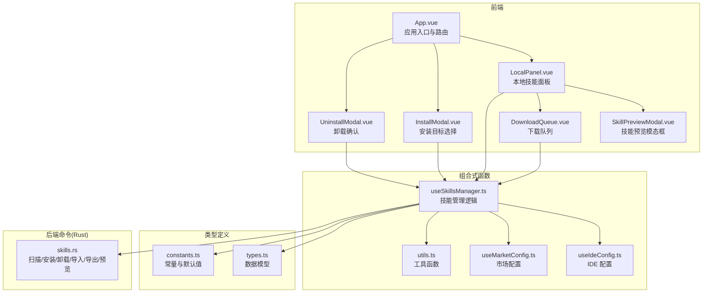
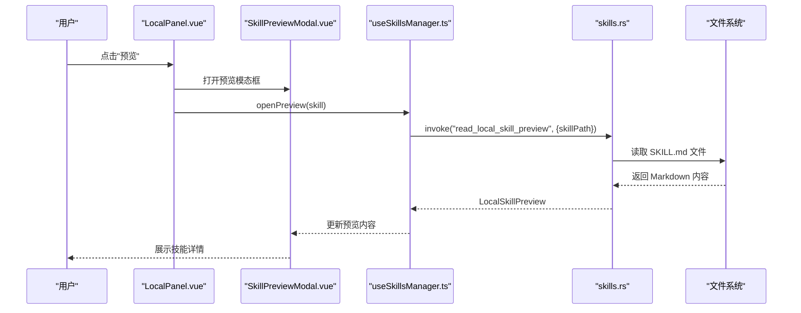
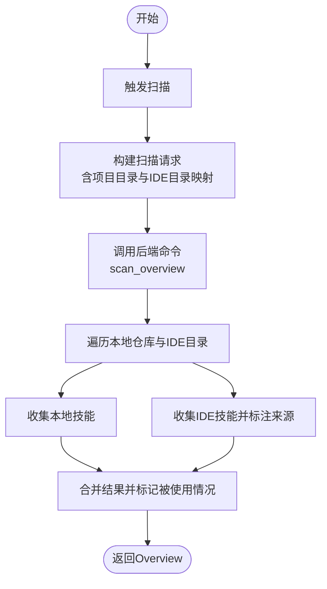
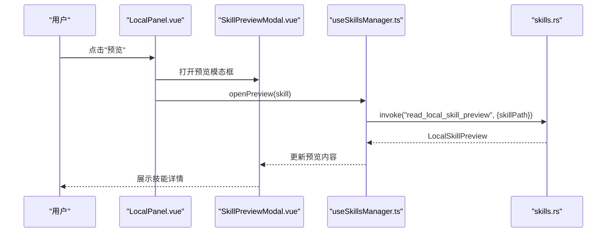
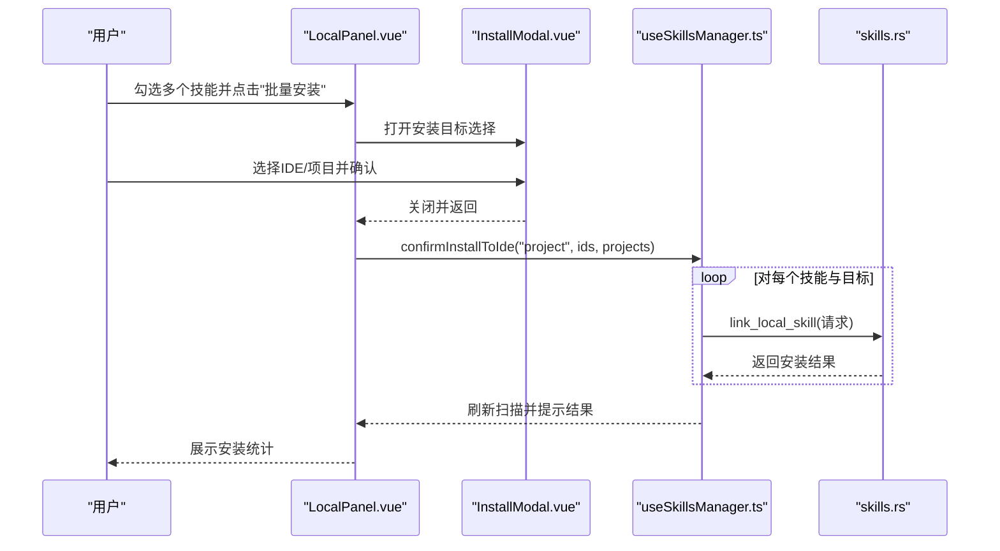
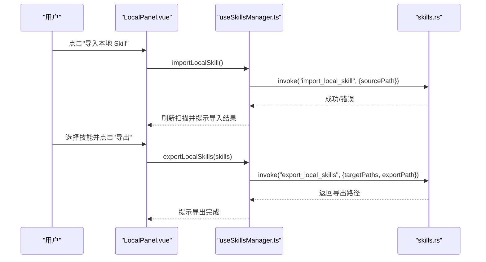
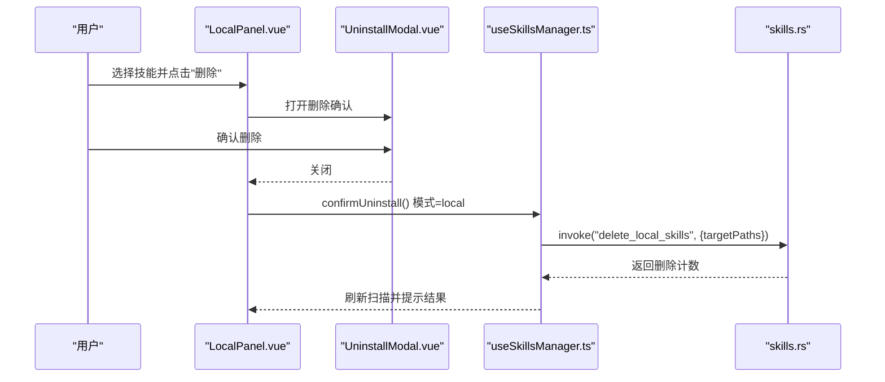
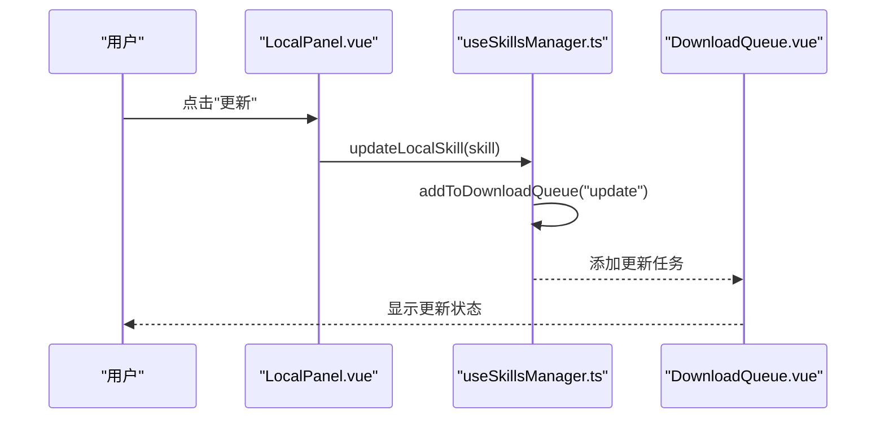
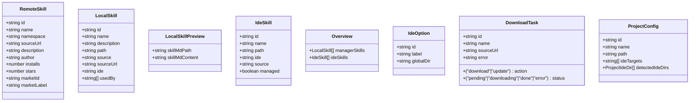
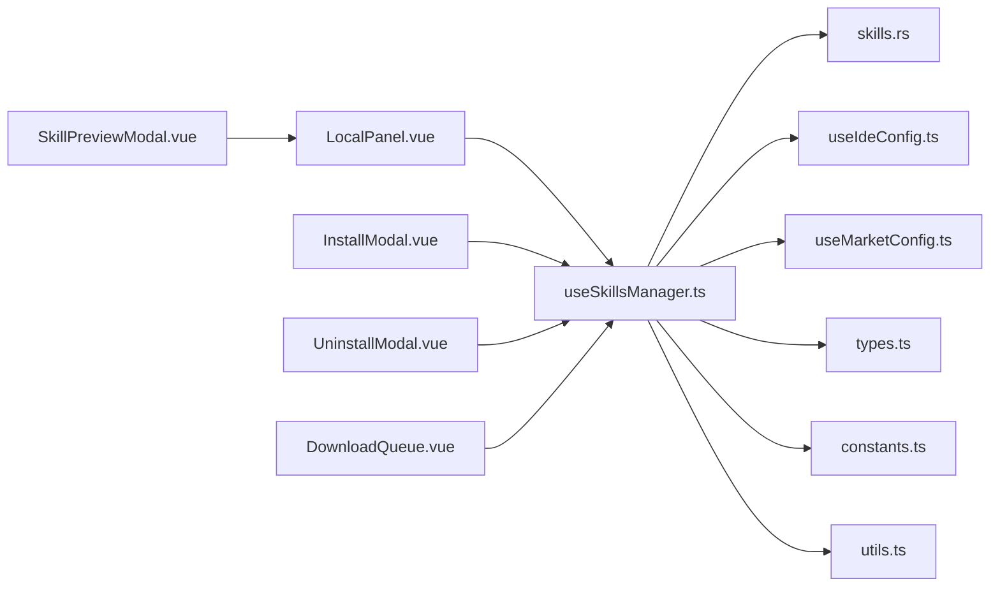

# 本地技能管理

<cite>
**本文档引用的文件**
- [README.md](file://README.md)
- [App.vue](file://src/App.vue)
- [LocalPanel.vue](file://src/components/LocalPanel.vue)
- [SkillPreviewModal.vue](file://src/components/SkillPreviewModal.vue)
- [useSkillsManager.ts](file://src/composables/useSkillsManager.ts)
- [skills.rs](file://src-tauri/src/commands/skills.rs)
- [types.ts](file://src/composables/types.ts)
- [InstallModal.vue](file://src/components/InstallModal.vue)
- [UninstallModal.vue](file://src/components/UninstallModal.vue)
- [DownloadQueue.vue](file://src/components/DownloadQueue.vue)
- [useIdeConfig.ts](file://src/composables/useIdeConfig.ts)
- [useMarketConfig.ts](file://src/composables/useMarketConfig.ts)
- [constants.ts](file://src/composables/constants.ts)
- [utils.ts](file://src/composables/utils.ts)
- [zh-CN.ts](file://src/locales/zh-CN.ts)
</cite>

## 更新摘要
**变更内容**
- 新增本地技能预览功能，支持实时查看 SKILL.md 内容
- 增强本地技能更新能力，通过下载队列实现统一的更新流程
- 改进错误处理机制，提供更友好的用户体验
- 优化批量操作功能，支持批量更新本地技能

## 目录
1. [简介](#简介)
2. [项目结构](#项目结构)
3. [核心组件](#核心组件)
4. [架构总览](#架构总览)
5. [详细组件分析](#详细组件分析)
6. [依赖关系分析](#依赖关系分析)
7. [性能考虑](#性能考虑)
8. [故障排除指南](#故障排除指南)
9. [结论](#结论)
10. [附录](#附录)

## 简介
本指南面向使用本地技能管理功能的用户，围绕以下目标提供循序渐进的操作说明与最佳实践：
- 技能扫描：自动扫描机制、扫描范围配置、扫描结果展示
- 预览功能：实时查看本地技能的 SKILL.md 内容，支持 Markdown 渲染
- 批量操作：批量安装、批量卸载、批量更新、批量导入导出
- 导入导出：从文件夹导入技能、导出技能包、技能备份恢复
- 完整生命周期管理：从市场下载、本地存储、安装部署、更新维护、卸载清理、备份恢复

项目提供了跨平台桌面应用，支持在 Windows、macOS、Linux 上运行，统一管理本地技能仓库并通过符号链接快速安装到各 IDE。

章节来源
- [README.md:1-104](file://README.md#L1-L104)

## 项目结构
前端采用 Vue 3 + TypeScript + Vite，后端通过 Tauri 调用 Rust 命令实现系统级操作；本地技能管理位于前端组件与 Rust 命令之间，通过可组合函数进行状态管理与业务编排。

图表来源
- [App.vue:1-400](file://src/App.vue#L1-L400)
- [LocalPanel.vue:1-380](file://src/components/LocalPanel.vue#L1-L380)
- [SkillPreviewModal.vue:1-276](file://src/components/SkillPreviewModal.vue#L1-L276)
- [useSkillsManager.ts:1-916](file://src/composables/useSkillsManager.ts#L1-L916)
- [skills.rs:1-955](file://src-tauri/src/commands/skills.rs#L1-L955)
- [types.ts:1-128](file://src/composables/types.ts#L1-L128)
- [constants.ts:1-72](file://src/composables/constants.ts#L1-L72)
- [useIdeConfig.ts:1-131](file://src/composables/useIdeConfig.ts#L1-L131)
- [useMarketConfig.ts:1-67](file://src/composables/useMarketConfig.ts#L1-L67)
- [utils.ts:1-125](file://src/composables/utils.ts#L1-L125)

章节来源
- [App.vue:1-400](file://src/App.vue#L1-L400)
- [LocalPanel.vue:1-380](file://src/components/LocalPanel.vue#L1-L380)
- [useSkillsManager.ts:1-916](file://src/composables/useSkillsManager.ts#L1-L916)
- [skills.rs:1-955](file://src-tauri/src/commands/skills.rs#L1-L955)

## 核心组件
- 本地技能面板：展示本地技能、搜索过滤、批量选择、扫描刷新、导入导出、打开目录、删除等
- 技能预览模态框：实时显示本地技能的 SKILL.md 内容，支持 Markdown 渲染和路径信息展示
- 技能管理组合式函数：封装扫描、安装、卸载、导入、导出、更新、队列处理等核心逻辑
- IDE 配置组合式函数：维护 IDE 列表、自定义 IDE、安装目标持久化
- Rust 命令层：执行扫描、安装、卸载、导入、导出、符号链接、技能预览等系统级操作
- 类型与常量：统一的数据结构、默认 IDE 映射、存储键名、缓存策略
- 下载队列：统一管理本地和远程技能的下载与更新任务

章节来源
- [LocalPanel.vue:1-380](file://src/components/LocalPanel.vue#L1-L380)
- [SkillPreviewModal.vue:1-276](file://src/components/SkillPreviewModal.vue#L1-L276)
- [useSkillsManager.ts:1-916](file://src/composables/useSkillsManager.ts#L1-L916)
- [useIdeConfig.ts:1-131](file://src/composables/useIdeConfig.ts#L1-L131)
- [skills.rs:1-955](file://src-tauri/src/commands/skills.rs#L1-L955)
- [types.ts:1-128](file://src/composables/types.ts#L1-L128)
- [constants.ts:1-72](file://src/composables/constants.ts#L1-L72)
- [DownloadQueue.vue:1-113](file://src/components/DownloadQueue.vue#L1-L113)

## 架构总览
本地技能管理采用"前端 UI + 组合式函数 + 后端命令"的分层设计：
- 前端负责交互与状态展示，包括预览功能和下载队列管理
- 组合式函数负责业务编排与状态持久化，包括更新逻辑和错误处理
- Rust 命令负责文件系统与安全校验，包括技能预览功能

图表来源
- [LocalPanel.vue:120-142](file://src/components/LocalPanel.vue#L120-L142)
- [SkillPreviewModal.vue:1-32](file://src/components/SkillPreviewModal.vue#L1-L32)
- [useSkillsManager.ts:120-142](file://src/composables/useSkillsManager.ts#L120-L142)
- [skills.rs:820-833](file://src-tauri/src/commands/skills.rs#L820-L833)

章节来源
- [useSkillsManager.ts:120-142](file://src/composables/useSkillsManager.ts#L120-L142)
- [skills.rs:820-833](file://src-tauri/src/commands/skills.rs#L820-L833)

## 详细组件分析

### 技能扫描功能
- 自动扫描机制
  - 触发方式：本地面板点击"刷新"或应用启动时自动扫描
  - 扫描范围：默认扫描用户主目录下的统一本地仓库与多个 IDE 的技能目录；支持自定义 IDE 目录
  - 结果聚合：返回本地技能与 IDE 中技能的综合视图，识别哪些本地技能被哪些 IDE 使用
- 扫描范围配置
  - 默认 IDE 列表来自常量配置，支持添加自定义 IDE（名称 + 相对路径或绝对路径）
  - IDE 路径合法性由工具函数校验，防止越权与危险路径
- 扫描结果展示
  - 本地面板以卡片形式展示技能，包含名称、描述、路径、IDE 使用状态徽章
  - 支持关键词搜索与模糊匹配，提升查找效率

图表来源
- [useSkillsManager.ts:404-425](file://src/composables/useSkillsManager.ts#L404-L425)
- [skills.rs:452-535](file://src-tauri/src/commands/skills.rs#L452-L535)
- [useIdeConfig.ts:69-104](file://src/composables/useIdeConfig.ts#L69-L104)
- [constants.ts:6-19](file://src/composables/constants.ts#L6-L19)
- [utils.ts:34-99](file://src/composables/utils.ts#L34-L99)

章节来源
- [LocalPanel.vue:180-182](file://src/components/LocalPanel.vue#L180-L182)
- [useSkillsManager.ts:404-425](file://src/composables/useSkillsManager.ts#L404-L425)
- [useIdeConfig.ts:69-104](file://src/composables/useIdeConfig.ts#L69-L104)
- [constants.ts:6-19](file://src/composables/constants.ts#L6-L19)
- [utils.ts:34-99](file://src/composables/utils.ts#L34-L99)

### 技能预览功能
**更新** 新增本地技能预览功能，提供实时的内容查看体验

- 预览触发
  - 在本地面板技能卡片上点击"预览"按钮，打开技能详情模态框
  - 预览内容包括技能基本信息、使用状态、路径信息和 SKILL.md 内容
- 预览内容展示
  - 技能基本信息：名称、描述、使用状态徽章
  - 路径信息：技能目录路径和 SKILL.md 文件路径
  - Markdown 内容：实时渲染 SKILL.md 文件内容
- 错误处理
  - 预览加载失败时显示错误提示
  - 支持预览内容为空时的友好提示
  - 预览过程中提供加载状态指示

图表来源
- [LocalPanel.vue:120-142](file://src/components/LocalPanel.vue#L120-L142)
- [SkillPreviewModal.vue:1-32](file://src/components/SkillPreviewModal.vue#L1-L32)
- [useSkillsManager.ts:120-142](file://src/composables/useSkillsManager.ts#L120-L142)
- [skills.rs:820-833](file://src-tauri/src/commands/skills.rs#L820-L833)

章节来源
- [LocalPanel.vue:120-142](file://src/components/LocalPanel.vue#L120-L142)
- [SkillPreviewModal.vue:1-276](file://src/components/SkillPreviewModal.vue#L1-L276)
- [useSkillsManager.ts:120-142](file://src/composables/useSkillsManager.ts#L120-L142)
- [skills.rs:820-833](file://src-tauri/src/commands/skills.rs#L820-L833)

### 批量操作功能
- 批量安装
  - 在本地面板勾选多个技能，点击"批量安装到编辑器"，弹出安装目标选择框
  - 可同时选择多个 IDE 或项目，系统按目标逐项执行安装，最终统计成功/跳过数量
- 批量更新
  - 选中有源地址的本地技能，点击"批量更新"，通过下载队列统一处理更新
  - 支持批量更新多个技能，自动识别可更新的技能
- 批量卸载
  - 通过卸载确认模态框支持批量卸载多个 IDE 路径，分别尝试卸载并汇总结果
- 批量导入导出
  - 导入：选择本地包含 SKILL.md 的技能目录，复制到统一仓库
  - 导出：选择一个或多个本地技能，打包为 ZIP 文件，便于备份与分享

图表来源
- [LocalPanel.vue:100-113](file://src/components/LocalPanel.vue#L100-L113)
- [InstallModal.vue:40-56](file://src/components/InstallModal.vue#L40-L56)
- [useSkillsManager.ts:465-513](file://src/composables/useSkillsManager.ts#L465-L513)
- [skills.rs:356-449](file://src-tauri/src/commands/skills.rs#L356-L449)

章节来源
- [LocalPanel.vue:100-113](file://src/components/LocalPanel.vue#L100-L113)
- [InstallModal.vue:40-56](file://src/components/InstallModal.vue#L40-L56)
- [useSkillsManager.ts:465-513](file://src/composables/useSkillsManager.ts#L465-L513)

### 导入导出功能
- 从文件夹导入技能
  - 步骤：本地面板点击"导入本地 Skill" → 选择包含 SKILL.md 的目录 → 复制到统一仓库
  - 安全校验：确保目标目录存在且包含 SKILL.md，避免误导入非技能目录
- 导出技能包
  - 步骤：选择一个或多个本地技能 → 选择导出 ZIP 路径 → 执行导出
  - 安全校验：禁止导出到技能目录内部，拒绝导出不含 SKILL.md 的目录
- 技能备份与恢复
  - 备份：导出 ZIP 包作为技能备份
  - 恢复：在新环境或新用户下重新导入 ZIP 包中的技能目录

图表来源
- [LocalPanel.vue:183-185](file://src/components/LocalPanel.vue#L183-L185)
- [useSkillsManager.ts:700-730](file://src/composables/useSkillsManager.ts#L700-L730)
- [useSkillsManager.ts:732-767](file://src/composables/useSkillsManager.ts#L732-L767)
- [skills.rs:612-637](file://src-tauri/src/commands/skills.rs#L612-L637)
- [skills.rs:868-912](file://src-tauri/src/commands/skills.rs#L868-L912)

章节来源
- [LocalPanel.vue:183-185](file://src/components/LocalPanel.vue#L183-L185)
- [useSkillsManager.ts:700-730](file://src/composables/useSkillsManager.ts#L700-L730)
- [useSkillsManager.ts:732-767](file://src/composables/useSkillsManager.ts#L732-L767)
- [skills.rs:612-637](file://src-tauri/src/commands/skills.rs#L612-L637)
- [skills.rs:868-912](file://src-tauri/src/commands/skills.rs#L868-L912)

### 卸载与清理
- 卸载到 IDE
  - 从 IDE 面板选择技能，确认卸载；若为符号链接则删除链接，否则删除物理目录
  - 支持批量卸载多个路径，分别尝试并汇总结果
- 删除本地技能
  - 从本地面板选择技能，确认删除；仅允许删除统一仓库内的合法技能目录
  - 新增安全校验：拒绝删除根目录和不包含 SKILL.md 的目录

图表来源
- [UninstallModal.vue:18-36](file://src/components/UninstallModal.vue#L18-L36)
- [useSkillsManager.ts:559-624](file://src/composables/useSkillsManager.ts#L559-L624)
- [skills.rs:835-866](file://src-tauri/src/commands/skills.rs#L835-L866)

章节来源
- [UninstallModal.vue:18-36](file://src/components/UninstallModal.vue#L18-L36)
- [useSkillsManager.ts:559-624](file://src/composables/useSkillsManager.ts#L559-L624)
- [skills.rs:835-866](file://src-tauri/src/commands/skills.rs#L835-L866)

### 更新功能增强
**更新** 本地技能现在支持通过下载队列进行统一的更新管理

- 本地技能更新
  - 选中有源地址的本地技能，点击"更新"按钮
  - 自动添加到下载队列，使用与远程技能相同的更新流程
  - 支持批量更新多个本地技能
- 下载队列管理
  - 统一显示更新任务的状态：待处理、下载中、完成、错误
  - 支持重试失败的任务和移除不需要的任务
  - 实时显示更新进度和结果

图表来源
- [LocalPanel.vue:247-252](file://src/components/LocalPanel.vue#L247-L252)
- [useSkillsManager.ts:331-361](file://src/composables/useSkillsManager.ts#L331-L361)
- [DownloadQueue.vue:17-42](file://src/components/DownloadQueue.vue#L17-L42)

章节来源
- [LocalPanel.vue:247-252](file://src/components/LocalPanel.vue#L247-L252)
- [useSkillsManager.ts:331-361](file://src/composables/useSkillsManager.ts#L331-L361)
- [DownloadQueue.vue:17-42](file://src/components/DownloadQueue.vue#L17-L42)

### 数据模型与类型
- 远程技能、本地技能、IDE 技能、概览、IDE 选项、下载任务、项目配置、本地技能预览等类型定义清晰，便于前后端协作与扩展

图表来源
- [types.ts:4-128](file://src/composables/types.ts#L4-L128)

章节来源
- [types.ts:4-128](file://src/composables/types.ts#L4-L128)

## 依赖关系分析
- 组件耦合
  - LocalPanel 与 useSkillsManager 强耦合，负责渲染与事件转发
  - SkillPreviewModal 作为独立的预览组件，通过事件与 LocalPanel 交互
  - InstallModal/UninstallModal 作为轻量 UI 组件，通过事件与 useSkillsManager 交互
  - DownloadQueue 作为任务管理组件，与 useSkillsManager 共享状态
- 外部依赖
  - Tauri 插件用于对话框、文件打开、系统路径解析
  - Rust 命令提供文件系统操作与安全校验，包括新的预览功能
- 潜在循环依赖
  - 前端组合式函数之间通过单一职责拆分，避免循环依赖
- 接口契约
  - 前端通过 invoke 调用后端命令，命令参数与返回值严格遵循类型定义

图表来源
- [LocalPanel.vue:1-380](file://src/components/LocalPanel.vue#L1-L380)
- [SkillPreviewModal.vue:1-276](file://src/components/SkillPreviewModal.vue#L1-L276)
- [useSkillsManager.ts:1-916](file://src/composables/useSkillsManager.ts#L1-L916)
- [DownloadQueue.vue:1-113](file://src/components/DownloadQueue.vue#L1-L113)
- [skills.rs:1-955](file://src-tauri/src/commands/skills.rs#L1-L955)
- [useIdeConfig.ts:1-131](file://src/composables/useIdeConfig.ts#L1-L131)
- [useMarketConfig.ts:1-67](file://src/composables/useMarketConfig.ts#L1-L67)
- [types.ts:1-128](file://src/composables/types.ts#L1-L128)
- [constants.ts:1-72](file://src/composables/constants.ts#L1-L72)
- [utils.ts:1-125](file://src/composables/utils.ts#L1-L125)

章节来源
- [useSkillsManager.ts:1-916](file://src/composables/useSkillsManager.ts#L1-L916)
- [skills.rs:1-955](file://src-tauri/src/commands/skills.rs#L1-L955)

## 性能考虑
- 缓存策略：市场搜索结果在 10 分钟内缓存，减少重复请求
- 批处理：批量安装/卸载/导入/导出采用队列与批量处理，避免频繁 IO
- 路径校验：严格的相对/绝对路径校验，降低无效操作带来的性能损耗
- UI 响应：扫描与安装过程使用忙状态与进度提示，避免阻塞交互
- 预览优化：技能预览采用异步加载，避免阻塞主界面响应

章节来源
- [useSkillsManager.ts:23-27](file://src/composables/useSkillsManager.ts#L23-L27)
- [useSkillsManager.ts:278-329](file://src/composables/useSkillsManager.ts#L278-L329)
- [utils.ts:34-99](file://src/composables/utils.ts#L34-L99)

## 故障排除指南
- 扫描失败
  - 现象：本地面板提示扫描失败
  - 排查：检查 IDE 目录是否有效、是否存在权限问题
  - 参考：错误消息与日志提示
- 预览失败
  - 现象：点击预览按钮无响应或显示错误
  - 排查：确认技能目录包含有效的 SKILL.md 文件，检查文件权限
  - 参考：预览功能的错误处理机制
- 更新失败
  - 现象：本地技能更新任务失败
  - 排查：确认技能源地址有效，网络连接正常，磁盘空间充足
  - 参考：下载队列的错误状态显示
- 安装失败
  - 现象：安装到 IDE 失败或部分目标跳过
  - 排查：确认目标路径合法、磁盘空间充足、无权限限制
- 卸载/删除失败
  - 现象：卸载或删除报错
  - 排查：确认目标路径属于允许范围，避免误删系统目录
- 导入失败
  - 现象：导入提示源目录不存在或缺少 SKILL.md
  - 排查：确保选择的目录包含 SKILL.md，且路径有效
- 导出失败
  - 现象：导出 ZIP 失败
  - 排查：导出路径不得位于技能目录内部，确保目标目录存在且可写

章节来源
- [useSkillsManager.ts:420-422](file://src/composables/useSkillsManager.ts#L420-L422)
- [useSkillsManager.ts:133-137](file://src/composables/useSkillsManager.ts#L133-L137)
- [useSkillsManager.ts:334](file://src/composables/useSkillsManager.ts#L334)
- [useSkillsManager.ts:492-494](file://src/composables/useSkillsManager.ts#L492-L494)
- [useSkillsManager.ts:609-615](file://src/composables/useSkillsManager.ts#L609-L615)
- [useSkillsManager.ts:662-675](file://src/composables/useSkillsManager.ts#L662-L675)
- [useSkillsManager.ts:715-720](file://src/composables/useSkillsManager.ts#L715-L720)
- [skills.rs:617-623](file://src-tauri/src/commands/skills.rs#L617-L623)
- [skills.rs:785](file://src-tauri/src/commands/skills.rs#L785)

## 结论
本地技能管理功能通过清晰的分层架构与完善的校验机制，实现了从扫描、安装、更新到导入导出的完整生命周期管理。新增的预览功能让用户能够实时查看技能详情，增强的更新能力提供了统一的任务管理体验。用户可通过本地面板与安装目标选择界面高效完成日常操作，配合批量功能进一步提升效率。建议在使用过程中：
- 合理配置 IDE 目录，确保扫描覆盖全面
- 使用批量操作提升效率，注意核对安装目标
- 利用预览功能深入了解技能内容，确保技能质量
- 通过下载队列统一管理更新任务，跟踪更新进度
- 定期导出技能包进行备份，保障数据安全

## 附录
- 界面截图与操作示例
  - 本地技能面板：展示技能卡片、搜索、批量操作按钮、扫描刷新、导入导出入口
  - 技能预览模态框：展示技能详情、Markdown 内容、路径信息、使用状态
  - 安装目标选择：IDE 与项目双列选择，支持多选与计数提示
  - 卸载确认：区分 IDE 卸载与本地删除两种模式
  - 下载队列：统一显示更新任务状态，支持重试和移除操作
  - 项目管理：为不同项目配置独立的 IDE 目标，实现技能隔离

章节来源
- [LocalPanel.vue:253-288](file://src/components/LocalPanel.vue#L253-L288)
- [SkillPreviewModal.vue:34-71](file://src/components/SkillPreviewModal.vue#L34-L71)
- [InstallModal.vue:66-149](file://src/components/InstallModal.vue#L66-L149)
- [UninstallModal.vue:18-36](file://src/components/UninstallModal.vue#L18-L36)
- [DownloadQueue.vue:17-42](file://src/components/DownloadQueue.vue#L17-L42)
- [zh-CN.ts:120-267](file://src/locales/zh-CN.ts#L120-L267)
- [README.md:8-11](file://README.md#L8-L11)