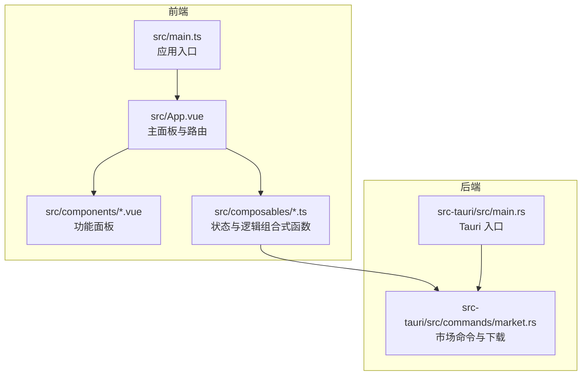
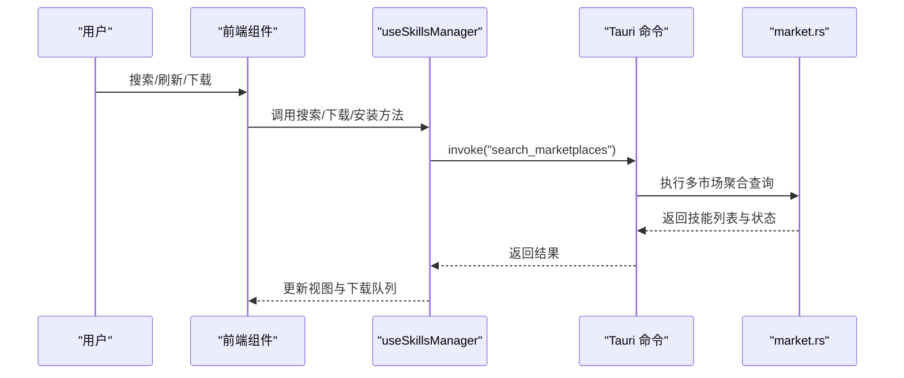
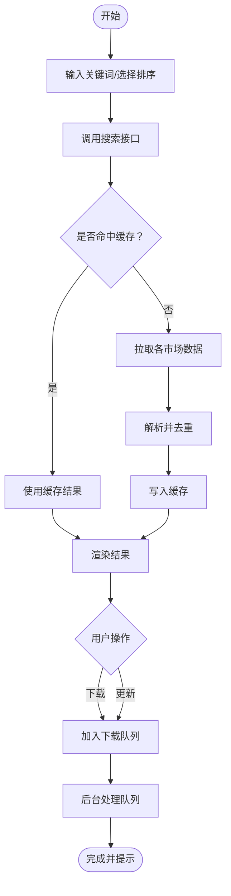
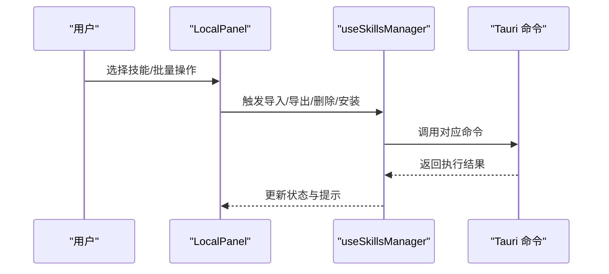
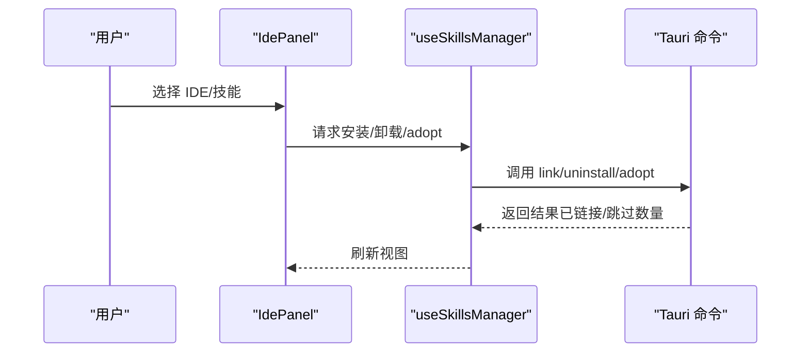
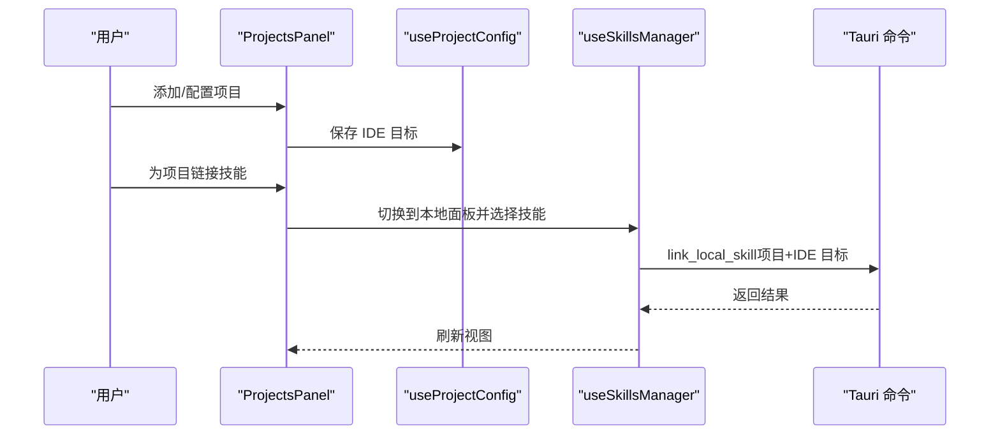

# 用户指南

<cite>
**本文引用的文件**
- [README.md](file://README.md)
- [src/main.ts](file://src/main.ts)
- [src/App.vue](file://src/App.vue)
- [src/composables/useSkillsManager.ts](file://src/composables/useSkillsManager.ts)
- [src/components/MarketPanel.vue](file://src/components/MarketPanel.vue)
- [src/components/LocalPanel.vue](file://src/components/LocalPanel.vue)
- [src/components/IdePanel.vue](file://src/components/IdePanel.vue)
- [src/components/ProjectsPanel.vue](file://src/components/ProjectsPanel.vue)
- [src/composables/useMarketConfig.ts](file://src/composables/useMarketConfig.ts)
- [src/composables/useIdeConfig.ts](file://src/composables/useIdeConfig.ts)
- [src/composables/useProjectConfig.ts](file://src/composables/useProjectConfig.ts)
- [src/composables/types.ts](file://src/composables/types.ts)
- [src-tauri/src/main.rs](file://src-tauri/src/main.rs)
- [src-tauri/src/commands/market.rs](file://src-tauri/src/commands/market.rs)
- [package.json](file://package.json)
</cite>

## 目录
1. [简介](#简介)
2. [项目结构](#项目结构)
3. [核心组件](#核心组件)
4. [架构总览](#架构总览)
5. [详细组件分析](#详细组件分析)
6. [依赖关系分析](#依赖关系分析)
7. [性能考虑](#性能考虑)
8. [故障排除指南](#故障排除指南)
9. [结论](#结论)
10. [附录](#附录)

## 简介
Skills Manager 是一款跨平台 AI 技能管理工具，支持在多个公开市场统一搜索与下载技能，集中管理本地仓库，并通过符号链接一键安装到任意受支持的开发环境（IDE）。它同时提供项目级技能挂载与 IDE 目标配置能力，帮助你高效组织与复用 AI 助手技能。

- 快速安装技能到全局或项目
- 统一本地仓库管理（~/.skills-manager/skills）
- 一键安装到目标 IDE（通过符号链接）
- 多维度管理：按 IDE 浏览、安全卸载
- 项目管理：管理项目并为每个项目配置 IDE 目标，挂载技能

**章节来源**
- [README.md:1-104](file://README.md#L1-L104)

## 项目结构
应用采用前端 Vue 3 + TypeScript + Vite，后端 Rust（Tauri 2）命令层，通过 Tauri 命令桥接前后端，实现系统级操作（如扫描、安装、卸载、下载等）。

**图表来源**
- [src/main.ts:1-7](file://src/main.ts#L1-L7)
- [src/App.vue:1-633](file://src/App.vue#L1-L633)
- [src-tauri/src/main.rs:1-7](file://src-tauri/src/main.rs#L1-L7)
- [src-tauri/src/commands/market.rs:1-442](file://src-tauri/src/commands/market.rs#L1-L442)

**章节来源**
- [package.json:1-30](file://package.json#L1-L30)
- [src/main.ts:1-7](file://src/main.ts#L1-L7)
- [src/App.vue:1-633](file://src/App.vue#L1-L633)

## 核心组件
- 市场面板（MarketPanel）：聚合搜索、排序、设置、下载/更新队列与状态提示
- 本地面板（LocalPanel）：本地技能概览、批量安装、导入导出、删除、刷新扫描
- IDE 面板（IdePanel）：按 IDE 切换浏览、自定义 IDE、安全卸载、托管/非托管技能处理
- 项目面板（ProjectsPanel）：项目增删改查、IDE 目标配置、项目内技能挂载
- 组合式函数（composables）：统一管理市场配置、IDE 配置、项目配置、技能管理逻辑

**章节来源**
- [src/components/MarketPanel.vue:1-192](file://src/components/MarketPanel.vue#L1-L192)
- [src/components/LocalPanel.vue:1-310](file://src/components/LocalPanel.vue#L1-L310)
- [src/components/IdePanel.vue:1-270](file://src/components/IdePanel.vue#L1-L270)
- [src/components/ProjectsPanel.vue:1-253](file://src/components/ProjectsPanel.vue#L1-L253)
- [src/composables/useSkillsManager.ts:1-867](file://src/composables/useSkillsManager.ts#L1-L867)

## 架构总览
前端通过 Tauri 命令调用后端，后端负责网络请求、文件系统操作与技能解析。市场命令聚合多个公开市场数据，本地与 IDE 数据由扫描与安装流程生成。

**图表来源**
- [src/App.vue:200-400](file://src/App.vue#L200-L400)
- [src/composables/useSkillsManager.ts:190-248](file://src/composables/useSkillsManager.ts#L190-L248)
- [src-tauri/src/commands/market.rs:173-392](file://src-tauri/src/commands/market.rs#L173-L392)

## 详细组件分析

### 市场搜索功能（技能聚合搜索、市场配置、搜索缓存）
- 聚合搜索：支持从多个公开市场（如 Claude Plugins、SkillsLLM、SkillsMP）搜索技能，支持关键词、分页与排序
- 市场配置：可启用/禁用市场、保存 API Key（如 SkillsMP），并持久化到本地存储
- 搜索缓存：对相同关键词与分页参数进行缓存，提升重复搜索体验
- 下载队列：支持批量下载/更新，带进度与错误重试

**图表来源**
- [src/components/MarketPanel.vue:10-154](file://src/components/MarketPanel.vue#L10-L154)
- [src/composables/useSkillsManager.ts:190-248](file://src/composables/useSkillsManager.ts#L190-L248)
- [src/composables/useMarketConfig.ts:16-44](file://src/composables/useMarketConfig.ts#L16-L44)
- [src-tauri/src/commands/market.rs:173-392](file://src-tauri/src/commands/market.rs#L173-L392)

**章节来源**
- [src/components/MarketPanel.vue:1-192](file://src/components/MarketPanel.vue#L1-L192)
- [src/composables/useSkillsManager.ts:23-27, 190-248:23-27](file://src/composables/useSkillsManager.ts#L23-L27)
- [src/composables/useMarketConfig.ts:1-67](file://src/composables/useMarketConfig.ts#L1-L67)
- [src-tauri/src/commands/market.rs:173-392](file://src-tauri/src/commands/market.rs#L173-L392)

### 本地技能管理（技能扫描、批量操作、导入导出）
- 技能扫描：首次启动与手动刷新时扫描本地仓库与 IDE 目录，生成本地技能与 IDE 技能视图
- 批量操作：支持全选、批量安装、批量导出、批量删除
- 导入导出：支持从本地目录导入技能到本地仓库；支持将选中技能打包导出为 ZIP
- 删除策略：区分“仅删除本地仓库”与“安全卸载 IDE 中的技能”

**图表来源**
- [src/components/LocalPanel.vue:10-310](file://src/components/LocalPanel.vue#L10-L310)
- [src/composables/useSkillsManager.ts:633-721](file://src/composables/useSkillsManager.ts#L633-L721)

**章节来源**
- [src/components/LocalPanel.vue:1-310](file://src/components/LocalPanel.vue#L1-L310)
- [src/composables/useSkillsManager.ts:353-374, 633-721:353-374](file://src/composables/useSkillsManager.ts#L353-L374)

### IDE 集成功能（符号链接管理、自定义 IDE 支持、安全卸载）
- 符号链接安装：将本地技能链接到指定 IDE 的技能目录（相对或绝对路径）
- 自定义 IDE：添加自定义 IDE 名称与技能目录，支持校验与去重
- 安全卸载：若为符号链接则移除链接，否则删除物理目录；支持批量卸载
- 托管/非托管：识别 IDE 中的托管与非托管技能，便于 Adopt 操作

**图表来源**
- [src/components/IdePanel.vue:1-270](file://src/components/IdePanel.vue#L1-L270)
- [src/composables/useSkillsManager.ts:376-398, 568-624, 741-793:376-398](file://src/composables/useSkillsManager.ts#L376-L398)

**章节来源**
- [src/components/IdePanel.vue:1-270](file://src/components/IdePanel.vue#L1-L270)
- [src/composables/useIdeConfig.ts:69-113](file://src/composables/useIdeConfig.ts#L69-L113)
- [src/composables/useSkillsManager.ts:137-144, 376-398, 568-624, 741-793:137-144](file://src/composables/useSkillsManager.ts#L137-L144)

### 项目管理（项目创建、IDE 目标配置、技能链接）
- 项目创建：扫描项目根目录下的 IDE 目录，自动填充 IDE 目标
- IDE 目标配置：为项目选择 IDE 目标集合，决定后续技能挂载位置
- 技能链接：在项目上下文中选择技能并批量链接到项目内的 IDE 目录

**图表来源**
- [src/components/ProjectsPanel.vue:1-253](file://src/components/ProjectsPanel.vue#L1-L253)
- [src/composables/useProjectConfig.ts:40-98](file://src/composables/useProjectConfig.ts#L40-L98)
- [src/App.vue:148-201](file://src/App.vue#L148-L201)

**章节来源**
- [src/components/ProjectsPanel.vue:1-253](file://src/components/ProjectsPanel.vue#L1-L253)
- [src/composables/useProjectConfig.ts:1-128](file://src/composables/useProjectConfig.ts#L1-L128)
- [src/App.vue:148-201](file://src/App.vue#L148-L201)

## 依赖关系分析
- 前端依赖：Vue 3、TypeScript、Vite、@tauri-apps/api 及插件
- 后端依赖：Tauri 2、Rust 标准库与网络/文件工具
- 命令桥接：前端通过 invoke 调用后端命令，实现跨语言交互

**图表来源**
- [package.json:13-28](file://package.json#L13-L28)
- [src-tauri/src/main.rs:1-7](file://src-tauri/src/main.rs#L1-L7)

**章节来源**
- [package.json:1-30](file://package.json#L1-L30)
- [src-tauri/src/main.rs:1-7](file://src-tauri/src/main.rs#L1-L7)

## 性能考虑
- 搜索缓存：对相同查询与分页参数进行缓存，减少重复网络请求
- 下载队列：串行处理下载任务，避免并发冲突与资源竞争
- 扫描优化：本地扫描与 IDE 扫描分离，避免重复 IO
- 排序与去重：在前端对结果进行去重与排序，保证展示质量

[本节为通用建议，无需特定文件引用]

## 故障排除指南
- 首次打开 macOS 应用报“应用已损坏”或“来自未验证开发者”
  - 解决：在终端执行相关命令以移除隔离属性
- 市场访问失败或需要 API Key
  - 解决：在市场设置中启用相应市场并填写必要凭据
- 卸载失败或部分失败
  - 解决：检查目标路径是否存在、权限是否足够；可尝试重新安装或手动清理
- 无法找到自定义 IDE
  - 解决：确认自定义 IDE 名称与目录格式正确，且目录存在
- 导入/导出失败
  - 解决：确认目标路径有效、磁盘空间充足、无权限问题

**章节来源**
- [README.md:43-49](file://README.md#L43-L49)
- [src/composables/useMarketConfig.ts:39-44](file://src/composables/useMarketConfig.ts#L39-L44)
- [src/composables/useIdeConfig.ts:76-104](file://src/composables/useIdeConfig.ts#L76-L104)
- [src/composables/useSkillsManager.ts:633-721](file://src/composables/useSkillsManager.ts#L633-L721)

## 结论
Skills Manager 提供了从市场搜索、本地管理到 IDE 集成与项目级技能挂载的一体化解决方案。通过清晰的功能模块划分与稳定的命令桥接机制，用户可以高效地组织与复用 AI 技能，提升开发效率。

[本节为总结性内容，无需特定文件引用]

## 附录

### 操作步骤与最佳实践

- 市场搜索
  - 步骤：在“市场”标签页输入关键词，选择排序方式，点击搜索或刷新；点击“下载/更新”加入队列
  - 最佳实践：优先使用默认排序；开启需要的市场；定期刷新查看更新
  - 截图说明：见项目文档中的市场界面截图

- 本地技能管理
  - 步骤：在“本地”标签页刷新扫描，勾选技能后批量安装/导出/删除；或单个操作
  - 最佳实践：定期清理未使用的技能；导出常用技能以便迁移
  - 截图说明：见项目文档中的本地界面截图

- IDE 集成
  - 步骤：在“IDE”标签页切换 IDE，添加自定义 IDE，选择技能进行安装或卸载；非托管技能可 Adopt
  - 最佳实践：先 Adopt 再安装；卸载前确认是否为符号链接
  - 截图说明：见项目文档中的 IDE 界面截图

- 项目管理
  - 步骤：在“项目”标签页添加项目并扫描 IDE 目录；配置 IDE 目标；为项目链接技能
  - 最佳实践：为不同项目配置不同的 IDE 目标；保持项目内技能一致性
  - 截图说明：见项目文档中的项目界面截图

**章节来源**
- [README.md:51-66](file://README.md#L51-L66)
- [src/components/MarketPanel.vue:44-154](file://src/components/MarketPanel.vue#L44-L154)
- [src/components/LocalPanel.vue:103-220](file://src/components/LocalPanel.vue#L103-L220)
- [src/components/IdePanel.vue:83-198](file://src/components/IdePanel.vue#L83-L198)
- [src/components/ProjectsPanel.vue:60-139](file://src/components/ProjectsPanel.vue#L60-L139)