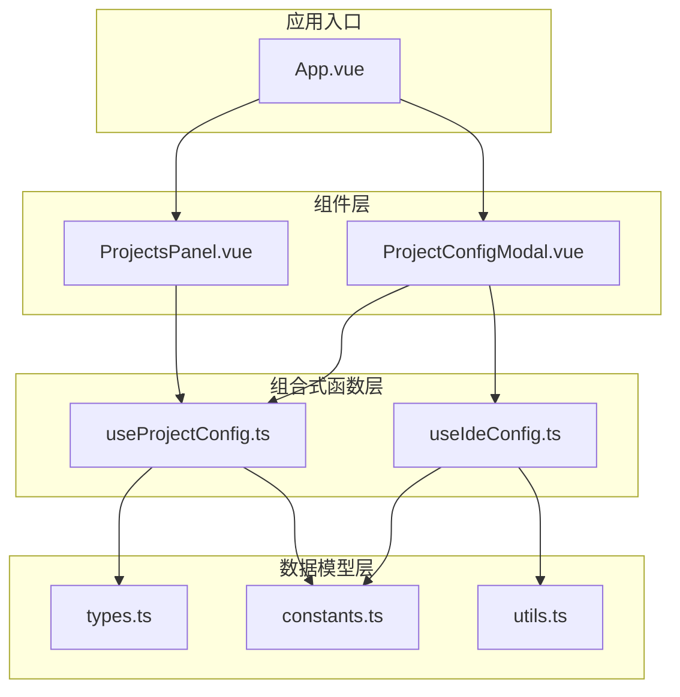
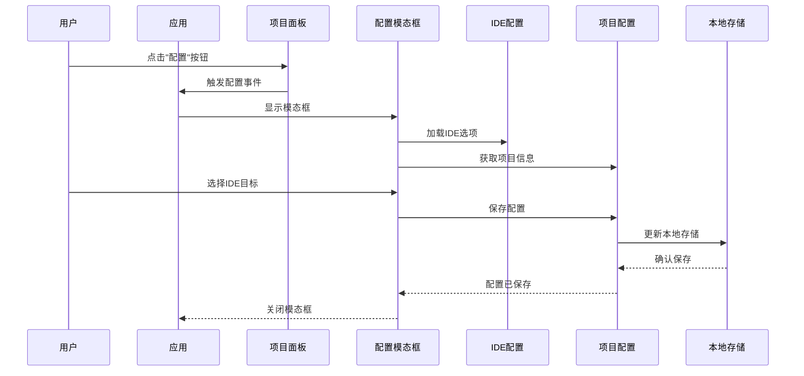
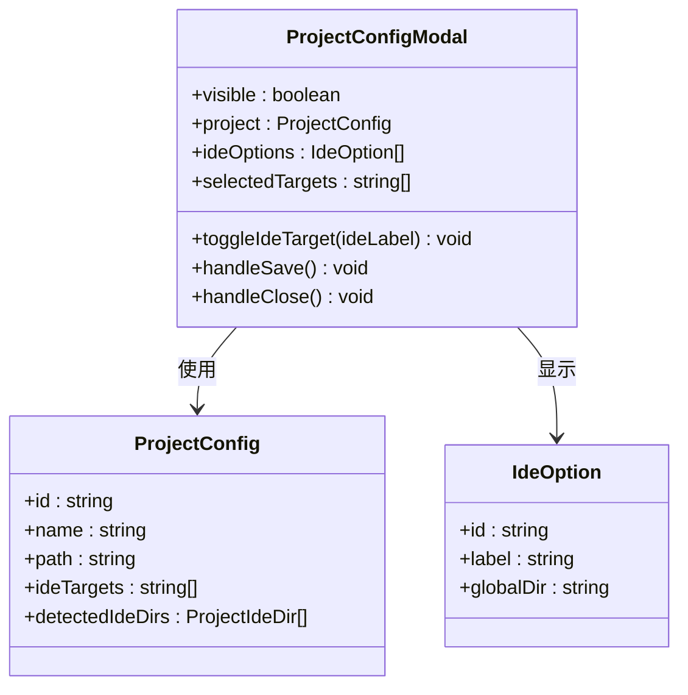
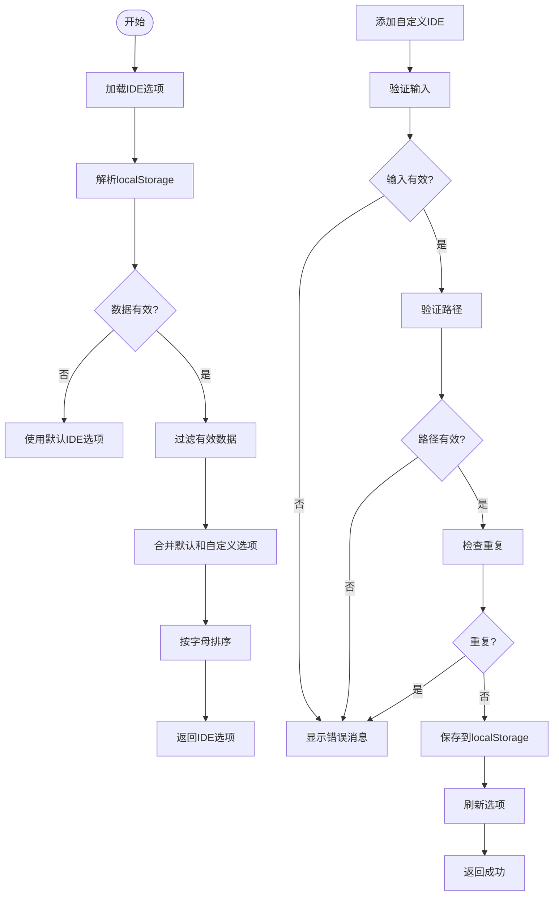
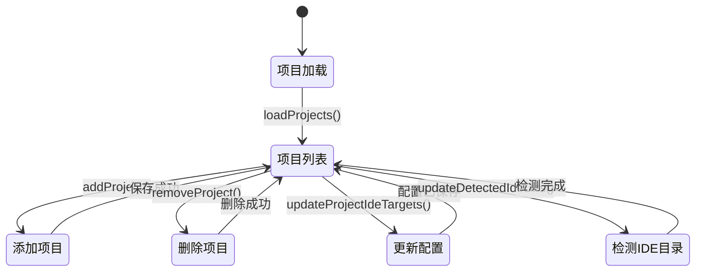
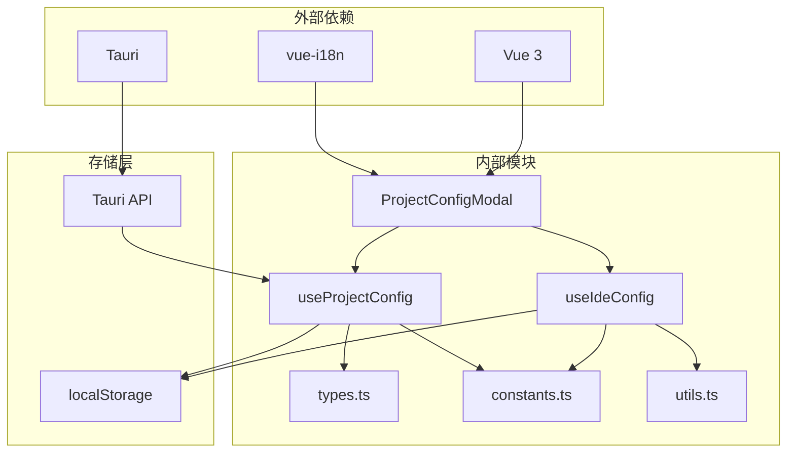

# IDE目标配置

<cite>
**本文档引用的文件**
- [ProjectConfigModal.vue](file://src/components/ProjectConfigModal.vue)
- [useIdeConfig.ts](file://src/composables/useIdeConfig.ts)
- [useProjectConfig.ts](file://src/composables/useProjectConfig.ts)
- [types.ts](file://src/composables/types.ts)
- [constants.ts](file://src/composables/constants.ts)
- [utils.ts](file://src/composables/utils.ts)
- [ProjectsPanel.vue](file://src/components/ProjectsPanel.vue)
- [App.vue](file://src/App.vue)
- [zh-CN.ts](file://src/locales/zh-CN.ts)
- [en-US.ts](file://src/locales/en-US.ts)
</cite>

## 目录
1. [简介](#简介)
2. [项目结构](#项目结构)
3. [核心组件](#核心组件)
4. [架构概览](#架构概览)
5. [详细组件分析](#详细组件分析)
6. [依赖关系分析](#依赖关系分析)
7. [性能考量](#性能考量)
8. [故障排除指南](#故障排除指南)
9. [结论](#结论)
10. [附录](#附录)

## 简介

IDE目标配置功能是Skills Manager项目中的核心特性之一，允许用户为项目配置特定的IDE目标。该功能通过ProjectConfigModal组件提供直观的用户界面，让用户能够轻松地选择和管理项目的IDE目标配置。

本功能支持多种IDE类型，包括VS Code、IntelliJ IDEA、Sublime Text等主流IDE，并提供了完整的IDE目标管理生命周期，包括添加、编辑、删除等操作。

## 项目结构

IDE目标配置功能主要分布在以下文件中：

**图表来源**
- [ProjectConfigModal.vue:1-248](file://src/components/ProjectConfigModal.vue#L1-L248)
- [useIdeConfig.ts:1-131](file://src/composables/useIdeConfig.ts#L1-L131)
- [useProjectConfig.ts:1-128](file://src/composables/useProjectConfig.ts#L1-L128)

**章节来源**
- [ProjectConfigModal.vue:1-248](file://src/components/ProjectConfigModal.vue#L1-L248)
- [useIdeConfig.ts:1-131](file://src/composables/useIdeConfig.ts#L1-L131)
- [useProjectConfig.ts:1-128](file://src/composables/useProjectConfig.ts#L1-L128)

## 核心组件

IDE目标配置功能的核心由以下几个关键组件构成：

### ProjectConfigModal 组件
负责提供IDE目标配置的模态框界面，允许用户选择和管理项目的IDE目标。

### useIdeConfig 组合式函数
管理IDE选项的配置，包括默认IDE选项、自定义IDE选项的添加和删除。

### useProjectConfig 组合式函数
管理项目配置，包括项目列表的增删改查和IDE目标的更新。

### 类型定义
定义了IDE选项、项目配置等核心数据结构。

**章节来源**
- [ProjectConfigModal.vue:1-248](file://src/components/ProjectConfigModal.vue#L1-L248)
- [useIdeConfig.ts:59-131](file://src/composables/useIdeConfig.ts#L59-L131)
- [useProjectConfig.ts:32-128](file://src/composables/useProjectConfig.ts#L32-L128)
- [types.ts:70-119](file://src/composables/types.ts#L70-L119)

## 架构概览

IDE目标配置功能采用Vue 3 Composition API架构，实现了清晰的关注点分离：

**图表来源**
- [App.vue:160-186](file://src/App.vue#L160-L186)
- [ProjectsPanel.vue:36-42](file://src/components/ProjectsPanel.vue#L36-L42)
- [ProjectConfigModal.vue:31-39](file://src/components/ProjectConfigModal.vue#L31-L39)

## 详细组件分析

### ProjectConfigModal 组件分析

ProjectConfigModal是IDE目标配置功能的主要界面组件，提供了直观的IDE目标选择界面。

#### 组件结构

**图表来源**
- [ProjectConfigModal.vue:8-44](file://src/components/ProjectConfigModal.vue#L8-L44)
- [types.ts:112-119](file://src/composables/types.ts#L112-L119)
- [types.ts:72-76](file://src/composables/types.ts#L72-L76)

#### 数据流分析
组件采用响应式数据绑定，实现了双向数据流：

1. **输入数据**：从父组件接收项目信息和IDE选项
2. **状态管理**：使用ref和computed管理选中的IDE目标
3. **输出事件**：通过emit向父组件传递保存和关闭事件

**章节来源**
- [ProjectConfigModal.vue:1-100](file://src/components/ProjectConfigModal.vue#L1-L100)

### useIdeConfig 组合式函数分析

useIdeConfig负责管理IDE选项的完整生命周期：

**图表来源**
- [useIdeConfig.ts:9-25](file://src/composables/useIdeConfig.ts#L9-L25)
- [useIdeConfig.ts:76-104](file://src/composables/useIdeConfig.ts#L76-L104)

#### 路径验证机制
组件内置了严格的安全路径验证机制：

- **相对路径验证**：确保不包含父目录遍历
- **绝对路径验证**：支持Unix和Windows绝对路径格式
- **WSL路径支持**：识别和验证WSL UNC路径格式
- **安全限制**：防止访问系统敏感目录

**章节来源**
- [useIdeConfig.ts:76-104](file://src/composables/useIdeConfig.ts#L76-L104)
- [utils.ts:97-99](file://src/composables/utils.ts#L97-L99)

### useProjectConfig 组合式函数分析

useProjectConfig管理项目配置的核心逻辑：

**图表来源**
- [useProjectConfig.ts:40-98](file://src/composables/useProjectConfig.ts#L40-L98)

#### 项目链接目标计算
组件提供了智能的项目链接目标计算功能：

- **IDE目录映射**：根据IDE标签查找对应的目录路径
- **路径拼接**：自动将项目路径与IDE目录路径组合
- **绝对路径支持**：直接使用绝对路径作为链接目标

**章节来源**
- [useProjectConfig.ts:100-114](file://src/composables/useProjectConfig.ts#L100-L114)

### IDE支持情况和配置差异

系统支持多种IDE类型，每种IDE都有其特定的配置要求：

| IDE类型 | 全局目录路径 | 特殊配置 |
|---------|-------------|----------|
| VS Code | `.github/skills` | 支持工作区配置 |
| IntelliJ IDEA | `.idea/skills` | 支持模块配置 |
| Sublime Text | `.config/sublime/Package/skills` | 支持包管理 |
| Atom | `.atom/packages/skills` | 支持插件管理 |
| Vim/Neovim | `.vim/pack/skills` | 支持插件管理 |
| Emacs | `.emacs.d/elpa/skills` | 支持ELPA包管理 |

**章节来源**
- [constants.ts:6-19](file://src/composables/constants.ts#L6-L19)
- [constants.ts:58-71](file://src/composables/constants.ts#L58-L71)

## 依赖关系分析

IDE目标配置功能的依赖关系如下：

**图表来源**
- [App.vue:19-394](file://src/App.vue#L19-L394)
- [useIdeConfig.ts:1-5](file://src/composables/useIdeConfig.ts#L1-L5)
- [useProjectConfig.ts:1-4](file://src/composables/useProjectConfig.ts#L1-L4)

**章节来源**
- [App.vue:19-394](file://src/App.vue#L19-L394)
- [useIdeConfig.ts:1-5](file://src/composables/useIdeConfig.ts#L1-L5)
- [useProjectConfig.ts:1-4](file://src/composables/useProjectConfig.ts#L1-L4)

## 性能考量

IDE目标配置功能在设计时充分考虑了性能优化：

### 内存管理
- **响应式数据**：使用Vue 3的响应式系统，避免不必要的重新渲染
- **计算属性缓存**：利用computed的自动缓存机制
- **懒加载**：IDE选项按需加载，减少初始内存占用

### 存储优化
- **增量更新**：只更新发生变化的项目配置
- **数据压缩**：localStorage中的数据采用JSON序列化
- **失效检测**：定期清理无效的配置数据

### 渲染优化
- **虚拟滚动**：对于大量IDE选项时使用虚拟滚动技术
- **条件渲染**：只渲染可见的IDE选项
- **防抖处理**：输入验证采用防抖机制

## 故障排除指南

### 常见问题及解决方案

#### 1. IDE路径验证失败
**症状**：添加自定义IDE时提示路径无效
**原因**：
- 路径包含非法字符
- 路径超出安全范围
- 路径格式不符合要求

**解决方案**：
- 检查路径是否为相对路径或有效绝对路径
- 确保路径不包含父目录遍历
- 验证路径不存在Windows保留名称

#### 2. 项目配置无法保存
**症状**：修改IDE目标后配置丢失
**原因**：
- localStorage访问权限问题
- 浏览器存储空间不足
- 数据序列化失败

**解决方案**：
- 检查浏览器隐私设置
- 清理浏览器缓存和存储
- 确认项目ID格式正确

#### 3. IDE目标显示异常
**症状**：IDE目标列表显示不完整或重复
**原因**：
- IDE选项数据损坏
- 本地存储格式错误
- 缓存数据过期

**解决方案**：
- 重新加载IDE选项
- 清理本地存储中的IDE配置
- 检查数据格式是否符合预期

**章节来源**
- [utils.ts:97-99](file://src/composables/utils.ts#L97-L99)
- [useIdeConfig.ts:9-25](file://src/composables/useIdeConfig.ts#L9-L25)

## 结论

IDE目标配置功能通过精心设计的架构和完善的错误处理机制，为用户提供了强大而易用的IDE目标管理能力。该功能具有以下优势：

1. **用户友好**：直观的模态框界面和清晰的操作流程
2. **安全性强**：严格的路径验证和安全检查机制
3. **扩展性强**：支持自定义IDE选项和灵活的配置管理
4. **性能优秀**：优化的数据管理和渲染机制
5. **可靠性高**：完善的错误处理和数据持久化

通过合理使用本功能，用户可以轻松地为不同项目配置最适合的IDE环境，提高开发效率和代码质量。

## 附录

### 最佳实践建议

#### 多IDE支持策略
- **项目隔离**：为不同类型的项目配置不同的IDE目标
- **团队协作**：在团队内标准化IDE配置模板
- **环境管理**：为开发、测试、生产环境配置不同的IDE目标

#### 配置文件管理
- **版本控制**：将重要的IDE配置纳入版本控制系统
- **备份策略**：定期备份IDE配置文件
- **文档记录**：为复杂的IDE配置编写使用说明

#### IDE间兼容性考虑
- **路径兼容**：确保IDE路径在不同操作系统间的兼容性
- **配置同步**：使用IDE官方的配置同步功能
- **插件管理**：统一管理跨IDE的插件配置