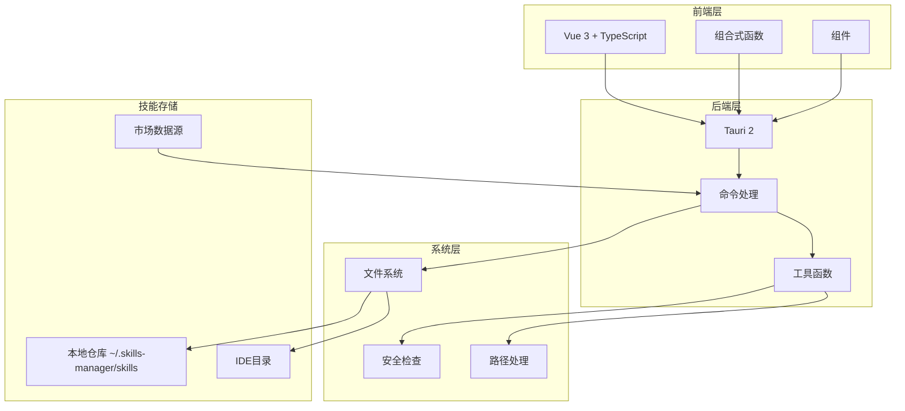
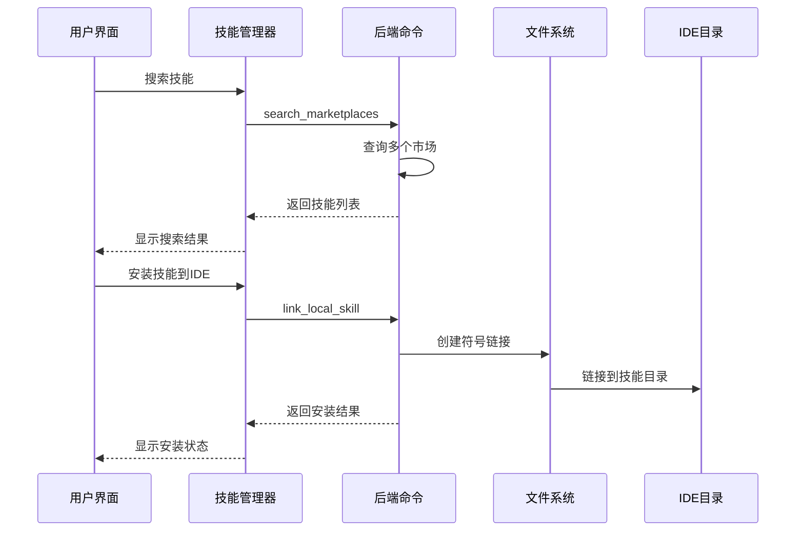
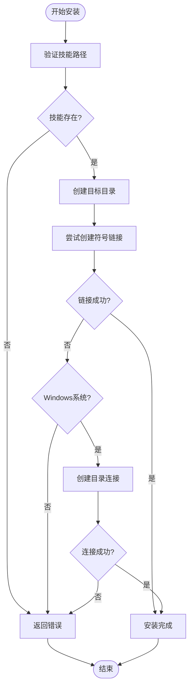
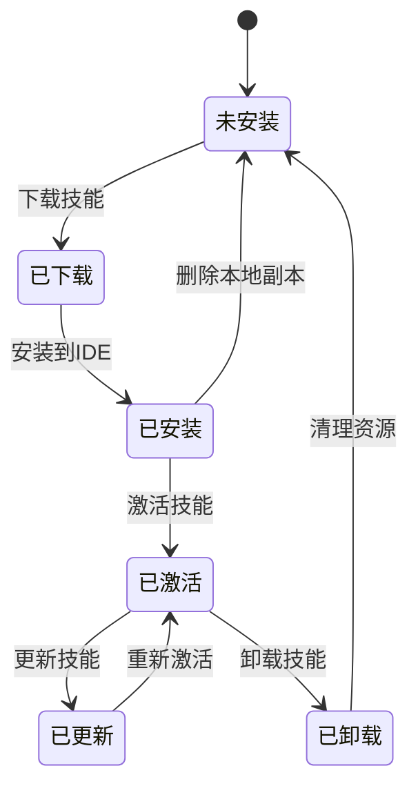
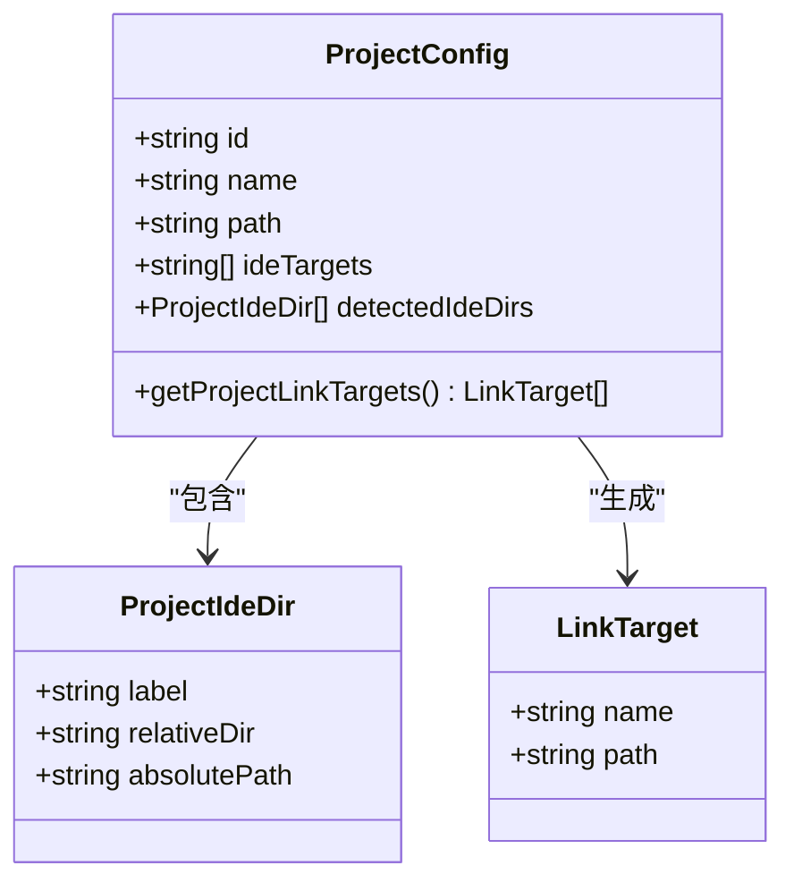
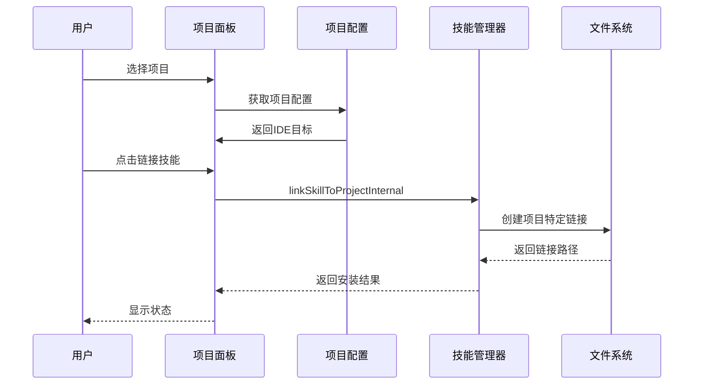

# 技能链接

<cite>
**本文档引用的文件**
- [README.md](file://README.md)
- [useSkillsManager.ts](file://src/composables/useSkillsManager.ts)
- [types.ts](file://src/composables/types.ts)
- [skills.rs](file://src-tauri/src/commands/skills.rs)
- [useProjectConfig.ts](file://src/composables/useProjectConfig.ts)
- [ProjectsPanel.vue](file://src/components/ProjectsPanel.vue)
- [path.rs](file://src-tauri/src/utils/path.rs)
- [security.rs](file://src-tauri/src/utils/security.rs)
- [constants.ts](file://src/composables/constants.ts)
- [default.json](file://src-tauri/capabilities/default.json)
- [_meta.json](file://skills/auto-updater/_meta.json)
- [SKILL.md](file://skills/auto-updater/SKILL.md)
- [package.json](file://package.json)
</cite>

## 目录
1. [简介](#简介)
2. [项目结构](#项目结构)
3. [核心组件](#核心组件)
4. [架构概览](#架构概览)
5. [详细组件分析](#详细组件分析)
6. [依赖关系分析](#依赖关系分析)
7. [性能考虑](#性能考虑)
8. [故障排除指南](#故障排除指南)
9. [结论](#结论)
10. [附录](#附录)

## 简介

技能链接是该项目的核心功能，它提供了一个统一的平台来管理AI技能的安装、配置和共享。该系统支持跨平台操作，能够在Windows、macOS和Linux环境中工作，为开发者提供了强大的技能管理能力。

### 主要特性

- **聚合市场搜索**：从多个公共注册表中搜索质量技能
- **统一本地仓库**：集中管理下载的技能（位于`~/.skills-manager/skills`）
- **一键安装**：通过符号链接将统一的本地技能安装到目标IDE中
- **多维度管理**：按IDE浏览技能，安全卸载和清理
- **项目管理**：管理项目并将技能挂载到项目中，为每个项目配置IDE

## 项目结构

该项目采用现代化的桌面应用架构，结合了前端UI层、后端命令处理层和系统操作层：



**图表来源**
- [README.md:13-35](file://README.md#L13-L35)
- [package.json:13-28](file://package.json#L13-L28)

**章节来源**
- [README.md:1-104](file://README.md#L1-L104)
- [package.json:1-30](file://package.json#L1-L30)

## 核心组件

### 技能管理器 (Skills Manager)

技能管理器是整个系统的核心，负责协调所有技能相关的操作。它提供了以下主要功能：

- 市场搜索和技能发现
- 本地技能扫描和管理
- 符号链接创建和维护
- 批量安装和卸载
- 下载队列管理

### 项目配置管理

项目配置管理允许用户为不同的项目设置特定的技能目标，实现技能的项目级隔离和复用。

### IDE集成

系统支持多种主流IDE，包括VSCode、Cursor、Claude Code等，每种IDE都有特定的技能目录结构。

**章节来源**
- [useSkillsManager.ts:20-800](file://src/composables/useSkillsManager.ts#L20-L800)
- [useProjectConfig.ts:32-128](file://src/composables/useProjectConfig.ts#L32-L128)

## 架构概览

技能链接系统的整体架构采用了分层设计，确保了良好的可维护性和扩展性：



**图表来源**
- [useSkillsManager.ts:190-248](file://src/composables/useSkillsManager.ts#L190-L248)
- [skills.rs:355-449](file://src-tauri/src/commands/skills.rs#L355-L449)

### 数据流分析

系统中的数据流遵循清晰的模式：

1. **用户输入** → **前端验证** → **后端处理** → **系统操作** → **状态更新**
2. **市场查询** → **去重处理** → **缓存存储** → **结果展示**
3. **安装请求** → **路径验证** → **符号链接创建** → **IDE同步**

**章节来源**
- [skills.rs:451-535](file://src-tauri/src/commands/skills.rs#L451-L535)
- [useSkillsManager.ts:376-398](file://src/composables/useSkillsManager.ts#L376-L398)

## 详细组件分析

### 符号链接创建机制

符号链接是技能链接系统的核心技术，它允许在不复制文件的情况下共享技能资源。

#### 跨平台兼容性

系统针对不同操作系统实现了相应的符号链接创建方式：



**图表来源**
- [skills.rs:408-449](file://src-tauri/src/commands/skills.rs#L408-L449)

#### 安全验证机制

为了防止路径遍历攻击和其他安全问题，系统实施了多层次的安全检查：

1. **路径规范化**：将所有路径转换为规范形式
2. **根目录限制**：确保目标路径在允许的根目录范围内
3. **符号链接检测**：识别现有符号链接并避免重复创建
4. **权限验证**：检查文件系统权限

**章节来源**
- [skills.rs:376-449](file://src-tauri/src/commands/skills.rs#L376-L449)
- [security.rs:1-92](file://src-tauri/src/utils/security.rs#L1-L92)

### 技能生命周期管理

技能的完整生命周期包括下载、安装、激活、更新和卸载等阶段：



#### 版本管理策略

系统支持技能的版本控制和更新机制：

- **版本元数据**：通过`_meta.json`文件管理技能版本信息
- **自动更新**：支持定期检查和应用更新
- **回滚机制**：允许恢复到之前的版本
- **冲突解决**：处理版本冲突和依赖关系

**章节来源**
- [_meta.json:1-6](file://skills/auto-updater/_meta.json#L1-L6)
- [SKILL.md:1-150](file://skills/auto-updater/SKILL.md#L1-L150)

### 项目级技能管理

项目级技能管理允许用户为不同的项目设置独立的技能配置：

#### 项目配置结构



**图表来源**
- [types.ts:112-119](file://src/composables/types.ts#L112-L119)
- [useProjectConfig.ts:100-114](file://src/composables/useProjectConfig.ts#L100-L114)

#### 项目技能链接流程



**图表来源**
- [useSkillsManager.ts:501-523](file://src/composables/useSkillsManager.ts#L501-L523)
- [useProjectConfig.ts:100-114](file://src/composables/useProjectConfig.ts#L100-L114)

**章节来源**
- [ProjectsPanel.vue:1-253](file://src/components/ProjectsPanel.vue#L1-L253)
- [useProjectConfig.ts:32-128](file://src/composables/useProjectConfig.ts#L32-L128)

### 市场搜索和技能发现

系统集成了多个技能市场，提供统一的搜索体验：

#### 支持的市场

| 市场名称 | URL | 状态 | 配置要求 |
|---------|-----|------|----------|
| Claude Plugins | `https://claude-plugins.dev/api/skills` | 在线 | 无需密钥 |
| SkillsLLM | `https://skillsllm.com/api/skills` | 在线 | 无需密钥 |
| SkillsMP | `https://skillsmp.com/api/v1/skills/search` | 需要密钥 | API密钥 |

#### 搜索算法

系统实现了智能的去重和排序算法：

1. **去重策略**：基于源URL和市场ID进行去重
2. **排序选项**：支持默认、星数降序、安装量降序
3. **缓存机制**：10分钟TTL的搜索结果缓存

**章节来源**
- [useSkillsManager.ts:190-248](file://src/composables/useSkillsManager.ts#L190-L248)
- [useSkillsManager.ts:250-261](file://src/composables/useSkillsManager.ts#L250-L261)

## 依赖关系分析

### 技术栈依赖

```mermaid
graph TB
subgraph "前端依赖"
Vue[Vue 3]
TS[TypeScript]
Vite[Vite]
I18n[vue-i18n]
end
subgraph "后端依赖"
Tauri[Tauri 2]
Rust[Rust]
WalkDir[walkdir]
Zip[zip]
end
subgraph "系统依赖"
Dialog[@tauri-apps/plugin-dialog]
Opener[@tauri-apps/plugin-opener]
Process[@tauri-apps/plugin-process]
end
Vue --> Tauri
TS --> Tauri
Vite --> Tauri
I18n --> Vue
Tauri --> Dialog
Tauri --> Opener
Tauri --> Process
Tauri --> WalkDir
Tauri --> Zip
```

**图表来源**
- [package.json:13-28](file://package.json#L13-L28)
- [default.json:8-13](file://src-tauri/capabilities/default.json#L8-L13)

### 外部接口依赖

系统通过Tauri与原生系统功能集成：

- **文件对话框**：用于选择技能目录和导出路径
- **文件打开器**：用于在系统文件管理器中显示技能位置
- **进程管理**：用于执行外部命令和脚本

**章节来源**
- [default.json:1-15](file://src-tauri/capabilities/default.json#L1-L15)
- [package.json:14-18](file://package.json#L14-L18)

## 性能考虑

### 缓存策略

系统实现了多层次的缓存机制来提升性能：

1. **搜索结果缓存**：10分钟TTL，减少网络请求
2. **技能扫描缓存**：避免频繁的文件系统扫描
3. **配置缓存**：本地存储IDE配置和项目设置

### 并发处理

下载队列支持并发处理，但会避免重复任务：

- **队列管理**：确保同一技能不会同时下载多次
- **进度跟踪**：实时显示下载进度和状态
- **错误恢复**：支持失败任务的重试机制

### 内存优化

- **懒加载**：只在需要时加载技能详情
- **虚拟滚动**：大量技能列表的高效渲染
- **垃圾回收**：及时释放不再使用的资源

## 故障排除指南

### 常见问题及解决方案

#### 符号链接创建失败

**症状**：安装技能时出现"无法创建链接"错误

**可能原因**：
1. 权限不足
2. 目标路径超出允许范围
3. 系统不支持符号链接

**解决方案**：
1. 检查用户权限
2. 验证目标路径是否在家目录内
3. 在Windows上尝试管理员权限运行

#### 技能扫描异常

**症状**：技能列表显示不完整或空白

**可能原因**：
1. IDE目录配置错误
2. 文件系统权限问题
3. 路径解析失败

**解决方案**：
1. 检查IDE目录映射配置
2. 验证目录存在性和可访问性
3. 使用绝对路径替代相对路径

#### 下载队列卡住

**症状**：下载任务长时间处于pending状态

**可能原因**：
1. 网络连接问题
2. 市场API限制
3. 代理服务器问题

**解决方案**：
1. 检查网络连接
2. 尝试禁用防火墙或代理
3. 清除下载缓存后重试

### 调试技巧

1. **启用详细日志**：查看系统日志了解具体错误信息
2. **手动验证路径**：在终端中测试路径的有效性
3. **检查权限**：确保用户对相关目录有读写权限
4. **验证磁盘空间**：确保有足够的空间进行下载和安装

**章节来源**
- [skills.rs:186-199](file://src-tauri/src/commands/skills.rs#L186-L199)
- [useSkillsManager.ts:331-342](file://src/composables/useSkillsManager.ts#L331-L342)

## 结论

技能链接系统提供了一个强大而灵活的技能管理解决方案。通过符号链接技术，系统实现了技能的高效共享和复用，同时保持了良好的安全性。系统的模块化设计使得功能扩展变得简单，而完善的错误处理机制确保了用户体验的稳定性。

对于开发者而言，该系统不仅简化了技能的安装和管理过程，还提供了丰富的API和配置选项来满足各种使用场景的需求。无论是个人开发者还是团队协作，都能从中获得显著的生产力提升。

## 附录

### 最佳实践建议

#### 技能组织策略

1. **命名规范**：使用清晰、描述性的技能名称
2. **版本控制**：为重要的技能维护版本历史
3. **文档管理**：为每个技能编写详细的使用说明
4. **备份策略**：定期备份重要的技能配置

#### 性能优化建议

1. **合理使用缓存**：利用内置缓存机制减少重复操作
2. **批量操作**：使用批量安装和卸载功能提高效率
3. **定期清理**：删除不再使用的技能以释放空间
4. **监控资源**：关注磁盘空间和内存使用情况

#### 故障排除清单

- [ ] 检查系统权限
- [ ] 验证网络连接
- [ ] 确认磁盘空间充足
- [ ] 查看系统日志
- [ ] 尝试重启应用
- [ ] 清理缓存数据