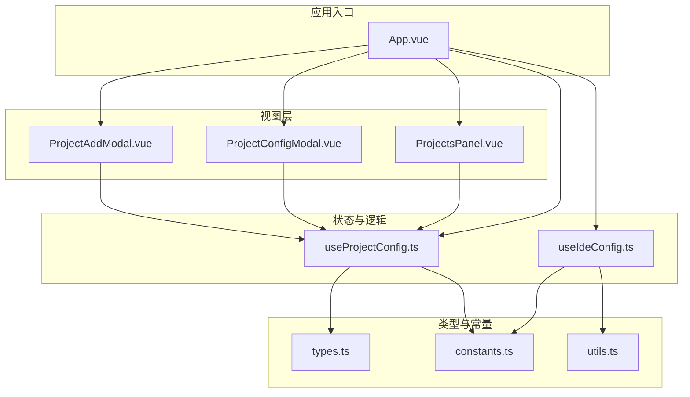
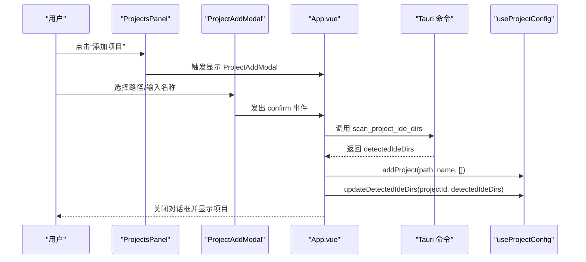
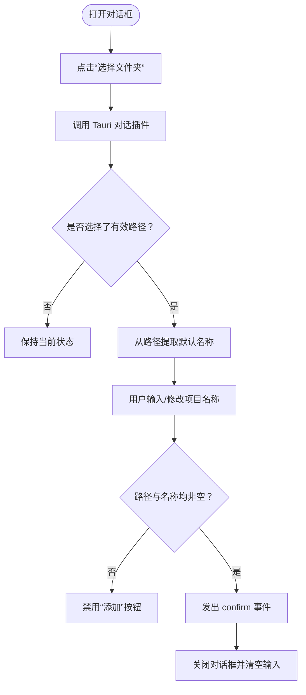
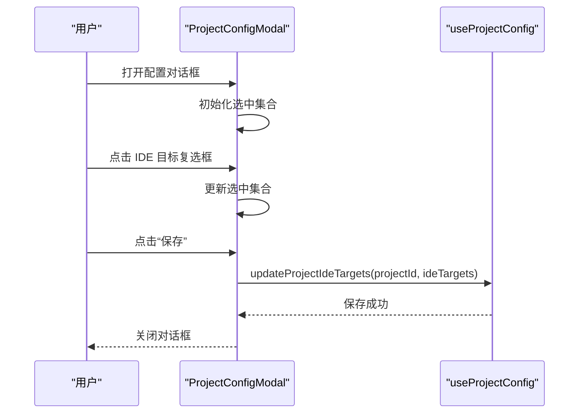
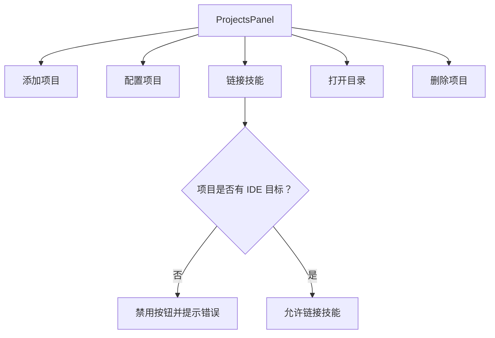
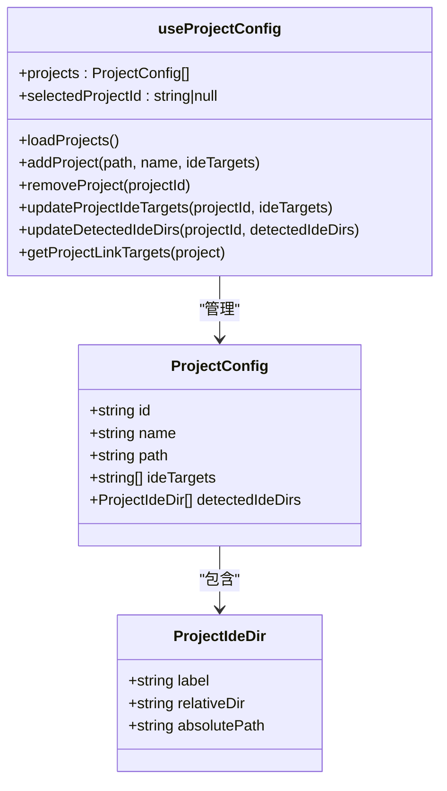
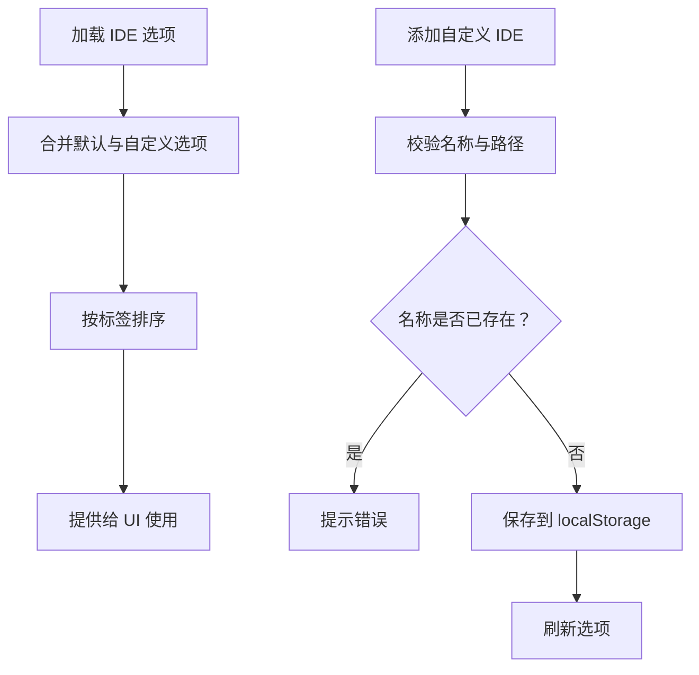
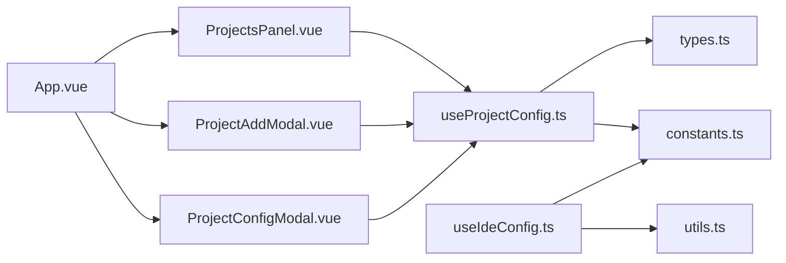

# 项目创建

<cite>
**本文引用的文件**
- [ProjectAddModal.vue](file://src/components/ProjectAddModal.vue)
- [ProjectConfigModal.vue](file://src/components/ProjectConfigModal.vue)
- [ProjectsPanel.vue](file://src/components/ProjectsPanel.vue)
- [useProjectConfig.ts](file://src/composables/useProjectConfig.ts)
- [useIdeConfig.ts](file://src/composables/useIdeConfig.ts)
- [types.ts](file://src/composables/types.ts)
- [constants.ts](file://src/composables/constants.ts)
- [utils.ts](file://src/composables/utils.ts)
- [App.vue](file://src/App.vue)
- [zh-CN.ts](file://src/locales/zh-CN.ts)
- [en-US.ts](file://src/locales/en-US.ts)
</cite>

## 目录
1. [简介](#简介)
2. [项目结构](#项目结构)
3. [核心组件](#核心组件)
4. [架构总览](#架构总览)
5. [详细组件分析](#详细组件分析)
6. [依赖关系分析](#依赖关系分析)
7. [性能考量](#性能考量)
8. [故障排查指南](#故障排查指南)
9. [结论](#结论)
10. [附录](#附录)

## 简介
本指南面向“项目创建”功能，围绕 ProjectAddModal 组件展开，详细说明如何创建新项目，包括：
- 项目名称设置与自动推断
- 项目路径选择与校验
- 项目类型配置（IDE 目标选择）
- 项目模板（默认模板与自定义模板）的使用
- 项目初始化过程中的配置选项（IDE 目标、技能依赖、项目配置文件生成）
- 最佳实践（命名规范、目录结构、初始配置策略）

## 项目结构
项目采用前端单页应用架构，项目创建流程由多个组件与组合式函数协作完成：
- 视图层：ProjectAddModal（创建项目对话框）、ProjectConfigModal（项目配置对话框）、ProjectsPanel（项目列表面板）
- 状态与逻辑：useProjectConfig（项目持久化与状态管理）、useIdeConfig（IDE 目标与自定义 IDE 管理）、App.vue（应用入口与事件编排）
- 类型与常量：types.ts（数据模型）、constants.ts（默认 IDE 映射与存储键名）、utils.ts（路径校验工具）

图表来源
- [ProjectAddModal.vue:1-250](file://src/components/ProjectAddModal.vue#L1-L250)
- [ProjectConfigModal.vue:1-248](file://src/components/ProjectConfigModal.vue#L1-L248)
- [ProjectsPanel.vue:1-253](file://src/components/ProjectsPanel.vue#L1-L253)
- [useProjectConfig.ts:1-128](file://src/composables/useProjectConfig.ts#L1-L128)
- [useIdeConfig.ts:1-131](file://src/composables/useIdeConfig.ts#L1-L131)
- [types.ts:1-119](file://src/composables/types.ts#L1-L119)
- [constants.ts:1-72](file://src/composables/constants.ts#L1-L72)
- [utils.ts:1-125](file://src/composables/utils.ts#L1-L125)
- [App.vue:1-633](file://src/App.vue#L1-L633)

章节来源
- [App.vue:132-202](file://src/App.vue#L132-L202)
- [ProjectAddModal.vue:1-108](file://src/components/ProjectAddModal.vue#L1-L108)
- [ProjectConfigModal.vue:1-100](file://src/components/ProjectConfigModal.vue#L1-L100)
- [ProjectsPanel.vue:1-139](file://src/components/ProjectsPanel.vue#L1-L139)
- [useProjectConfig.ts:32-127](file://src/composables/useProjectConfig.ts#L32-L127)
- [useIdeConfig.ts:59-131](file://src/composables/useIdeConfig.ts#L59-L131)
- [types.ts:112-119](file://src/composables/types.ts#L112-L119)
- [constants.ts:58-72](file://src/composables/constants.ts#L58-L72)
- [utils.ts:97-99](file://src/composables/utils.ts#L97-L99)

## 核心组件
- ProjectAddModal：负责收集项目路径与名称，并触发项目创建流程；调用 Tauri 插件进行目录选择与扫描。
- ProjectConfigModal：负责项目 IDE 目标选择与保存；支持多 IDE 目标勾选。
- ProjectsPanel：展示项目列表、操作按钮（添加、配置、链接技能、打开目录、删除），并触发相应事件。
- useProjectConfig：封装项目持久化、新增、删除、更新 IDE 目标、检测 IDE 目录等逻辑。
- useIdeConfig：封装 IDE 选项加载/保存、自定义 IDE 添加/删除、上次安装目标记录等逻辑。
- types/constants/utils：定义项目配置数据结构、默认 IDE 映射、存储键名、路径校验规则。

章节来源
- [ProjectAddModal.vue:1-108](file://src/components/ProjectAddModal.vue#L1-L108)
- [ProjectConfigModal.vue:1-100](file://src/components/ProjectConfigModal.vue#L1-L100)
- [ProjectsPanel.vue:1-139](file://src/components/ProjectsPanel.vue#L1-L139)
- [useProjectConfig.ts:32-127](file://src/composables/useProjectConfig.ts#L32-L127)
- [useIdeConfig.ts:59-131](file://src/composables/useIdeConfig.ts#L59-L131)
- [types.ts:112-119](file://src/composables/types.ts#L112-L119)
- [constants.ts:58-72](file://src/composables/constants.ts#L58-L72)
- [utils.ts:97-99](file://src/composables/utils.ts#L97-L99)

## 架构总览
项目创建的端到端流程如下：
- 用户在 ProjectsPanel 中点击“添加项目”，触发 ProjectAddModal 弹出。
- 用户选择项目路径并输入项目名称，点击“添加”后，App.vue 调用 Tauri 命令扫描项目内的 IDE 目录，随后在本地存储中新增项目并记录检测到的 IDE 目录。
- 用户可随时在 ProjectConfigModal 中为项目配置 IDE 目标（多选），保存后写入本地存储。
- 后续用户可在 ProjectsPanel 中为项目“链接技能”，系统会根据项目配置的 IDE 目标构建链接目标，实现技能安装到项目目录。

图表来源
- [ProjectsPanel.vue:60-70](file://src/components/ProjectsPanel.vue#L60-L70)
- [ProjectAddModal.vue:39-51](file://src/components/ProjectAddModal.vue#L39-L51)
- [App.vue:165-180](file://src/App.vue#L165-L180)
- [useProjectConfig.ts:47-98](file://src/composables/useProjectConfig.ts#L47-L98)

章节来源
- [App.vue:148-180](file://src/App.vue#L148-L180)
- [ProjectsPanel.vue:24-42](file://src/components/ProjectsPanel.vue#L24-L42)
- [ProjectAddModal.vue:19-51](file://src/components/ProjectAddModal.vue#L19-L51)
- [useProjectConfig.ts:47-98](file://src/composables/useProjectConfig.ts#L47-L98)

## 详细组件分析

### ProjectAddModal 组件
- 功能要点
  - 提供“选择文件夹”按钮，调用 Tauri 对话插件打开系统文件选择器，返回路径后自动填充项目名称（取路径最后一段作为默认名称）。
  - 输入项目名称，点击“添加”时进行非空校验，满足条件则向父组件发出 confirm 事件，携带路径与名称。
  - 关闭时清空输入项，确保下一次输入干净。
- 交互与校验
  - 路径选择通过 Tauri 插件实现，避免前端直接访问文件系统。
  - 项目名称与路径均需非空才允许提交。
- 国际化
  - 所有文案来自 i18n 翻译键，支持中英文切换。

图表来源
- [ProjectAddModal.vue:19-51](file://src/components/ProjectAddModal.vue#L19-L51)

章节来源
- [ProjectAddModal.vue:1-108](file://src/components/ProjectAddModal.vue#L1-L108)
- [zh-CN.ts:1-200](file://src/locales/zh-CN.ts#L1-L200)
- [en-US.ts:1-200](file://src/locales/en-US.ts#L1-L200)

### ProjectConfigModal 组件
- 功能要点
  - 展示当前项目的基本信息（名称、路径）。
  - 提供 IDE 目标选择网格，支持多选；保存后将选中项写回项目配置。
- 数据绑定
  - 使用计算属性维护选中集合，便于 UI 切换与保存。
- 交互流程
  - 当项目变更时，自动同步当前已选的 IDE 目标。
  - 保存后关闭对话框并刷新状态。

图表来源
- [ProjectConfigModal.vue:14-44](file://src/components/ProjectConfigModal.vue#L14-L44)
- [useProjectConfig.ts:82-89](file://src/composables/useProjectConfig.ts#L82-L89)

章节来源
- [ProjectConfigModal.vue:1-100](file://src/components/ProjectConfigModal.vue#L1-L100)
- [useProjectConfig.ts:82-89](file://src/composables/useProjectConfig.ts#L82-L89)

### ProjectsPanel 组件
- 功能要点
  - 展示项目列表，提供“选择/配置/打开目录/链接技能/删除”等操作。
  - “链接技能”按钮在项目未配置 IDE 目标时会被禁用，防止后续安装流程异常。
- 事件编排
  - 将用户操作转换为上层组件可识别的事件，交由 App.vue 统一处理。

图表来源
- [ProjectsPanel.vue:16-57](file://src/components/ProjectsPanel.vue#L16-L57)
- [App.vue:188-201](file://src/App.vue#L188-L201)

章节来源
- [ProjectsPanel.vue:1-139](file://src/components/ProjectsPanel.vue#L1-L139)
- [App.vue:188-201](file://src/App.vue#L188-L201)

### useProjectConfig 组合式函数
- 功能要点
  - 项目持久化：读取/保存到 localStorage，键名为 constants.STORAGE_KEYS.PROJECTS。
  - 新增项目：去重、生成唯一 ID、排序、保存并选中新建项目。
  - 更新 IDE 目标与检测到的 IDE 目录：用于后续链接技能时的目标构建。
  - 项目链接目标解析：根据 IDE 映射表与项目路径生成绝对或相对链接路径。
- 数据模型
  - ProjectConfig：包含 id、name、path、ideTargets、detectedIdeDirs。

图表来源
- [useProjectConfig.ts:32-127](file://src/composables/useProjectConfig.ts#L32-L127)
- [types.ts:103-119](file://src/composables/types.ts#L103-L119)

章节来源
- [useProjectConfig.ts:1-128](file://src/composables/useProjectConfig.ts#L1-L128)
- [types.ts:103-119](file://src/composables/types.ts#L103-L119)
- [constants.ts:24-30](file://src/composables/constants.ts#L24-L30)

### useIdeConfig 组合式函数
- 功能要点
  - 加载/保存 IDE 选项：默认选项与自定义选项合并，按标签排序。
  - 自定义 IDE：校验名称唯一性与路径合法性，保存到 localStorage。
  - 上次安装目标：记录用户最近选择的 IDE 目标，便于快速安装。
- 路径校验
  - 使用 utils.isValidIdePath 进行相对路径与绝对路径的安全性校验。

图表来源
- [useIdeConfig.ts:9-131](file://src/composables/useIdeConfig.ts#L9-L131)
- [utils.ts:97-99](file://src/composables/utils.ts#L97-L99)

章节来源
- [useIdeConfig.ts:1-131](file://src/composables/useIdeConfig.ts#L1-L131)
- [utils.ts:97-99](file://src/composables/utils.ts#L97-L99)

### App.vue 应用入口
- 功能要点
  - 统一管理项目创建、配置、链接技能等事件。
  - 在创建项目时调用 Tauri 命令扫描项目内 IDE 目录，随后更新项目配置。
  - 在“链接技能”时，若项目未配置 IDE 目标，则提示错误并阻止安装流程。

章节来源
- [App.vue:148-201](file://src/App.vue#L148-L201)

## 依赖关系分析
- 组件间依赖
  - ProjectsPanel 依赖 useProjectConfig 的状态与方法。
  - ProjectAddModal 与 ProjectConfigModal 通过事件与 App.vue 协作。
- 组合式函数依赖
  - useProjectConfig 依赖 constants 与 types；useIdeConfig 依赖 constants 与 utils。
- 外部依赖
  - Tauri 插件：@tauri-apps/plugin-dialog（文件选择）、@tauri-apps/plugin-opener（打开目录）、@tauri-apps/api-core（invoke 调用后端命令）。

图表来源
- [App.vue:132-202](file://src/App.vue#L132-L202)
- [ProjectsPanel.vue:1-139](file://src/components/ProjectsPanel.vue#L1-L139)
- [ProjectAddModal.vue:1-108](file://src/components/ProjectAddModal.vue#L1-L108)
- [ProjectConfigModal.vue:1-100](file://src/components/ProjectConfigModal.vue#L1-L100)
- [useProjectConfig.ts:1-128](file://src/composables/useProjectConfig.ts#L1-L128)
- [useIdeConfig.ts:1-131](file://src/composables/useIdeConfig.ts#L1-L131)
- [types.ts:1-119](file://src/composables/types.ts#L1-L119)
- [constants.ts:1-72](file://src/composables/constants.ts#L1-L72)
- [utils.ts:1-125](file://src/composables/utils.ts#L1-L125)

章节来源
- [App.vue:132-202](file://src/App.vue#L132-L202)
- [useProjectConfig.ts:1-128](file://src/composables/useProjectConfig.ts#L1-L128)
- [useIdeConfig.ts:1-131](file://src/composables/useIdeConfig.ts#L1-L131)

## 性能考量
- 本地存储读写：项目列表与 IDE 选项均使用 localStorage，读写成本低，适合频繁访问。
- 路径校验：在添加自定义 IDE 时进行路径合法性校验，避免后续安装阶段出现异常。
- UI 渲染：项目列表与 IDE 目标网格使用响应式数据驱动，避免不必要的重渲染。

## 故障排查指南
- 无法选择项目路径
  - 检查是否正确调用 Tauri 对话插件；确认浏览器权限与操作系统文件选择器可用。
  - 参考：[ProjectAddModal.vue:19-37](file://src/components/ProjectAddModal.vue#L19-L37)
- 项目名称为空或无效
  - 确保输入非空；若使用自动推断，检查路径末尾是否为有效文件夹名。
  - 参考：[ProjectAddModal.vue:39-51](file://src/components/ProjectAddModal.vue#L39-L51)
- 创建项目后未检测到 IDE 目录
  - 确认 Tauri 命令 scan_project_ide_dirs 是否返回了 detectedIdeDirs；检查项目根目录是否存在 IDE 目录映射。
  - 参考：[App.vue:167-175](file://src/App.vue#L167-L175)
- 项目未配置 IDE 目标导致“链接技能”失败
  - 在 ProjectConfigModal 中为项目添加至少一个 IDE 目标后再执行链接。
  - 参考：[App.vue:188-201](file://src/App.vue#L188-L201)
- 自定义 IDE 名称重复或路径非法
  - 检查名称是否已存在；路径必须为相对路径或合法绝对路径，且不包含危险字符或保留名。
  - 参考：[useIdeConfig.ts:76-104](file://src/composables/useIdeConfig.ts#L76-L104)，[utils.ts:97-99](file://src/composables/utils.ts#L97-L99)

章节来源
- [ProjectAddModal.vue:19-51](file://src/components/ProjectAddModal.vue#L19-L51)
- [App.vue:167-201](file://src/App.vue#L167-L201)
- [useIdeConfig.ts:76-104](file://src/composables/useIdeConfig.ts#L76-L104)
- [utils.ts:97-99](file://src/composables/utils.ts#L97-L99)

## 结论
项目创建流程以 ProjectAddModal 为核心入口，结合 App.vue 的事件编排与 useProjectConfig 的持久化能力，实现了从路径选择、项目创建到 IDE 目标配置的完整闭环。通过 ProjectConfigModal 的多选 IDE 目标配置，用户可以灵活地为项目指定技能安装目标，从而在后续“链接技能”阶段实现精准安装。配合 useIdeConfig 的自定义 IDE 支持与路径校验，系统在易用性与安全性之间取得平衡。

## 附录

### 项目模板与自定义模板
- 默认模板
  - 系统通过 ideDirMappings 定义了多种 IDE 的默认目录映射，创建项目时会扫描这些目录并记录到 detectedIdeDirs，便于后续链接技能。
  - 参考：[constants.ts:58-72](file://src/composables/constants.ts#L58-L72)
- 自定义模板
  - 用户可通过 useIdeConfig 添加自定义 IDE，系统会将其与默认选项合并并在 UI 中展示，支持多选。
  - 参考：[useIdeConfig.ts:9-32](file://src/composables/useIdeConfig.ts#L9-L32)

章节来源
- [constants.ts:58-72](file://src/composables/constants.ts#L58-L72)
- [useIdeConfig.ts:9-32](file://src/composables/useIdeConfig.ts#L9-L32)

### 项目初始化配置选项
- IDE 目标选择
  - 在 ProjectConfigModal 中勾选一个或多个 IDE，保存后写入项目配置。
  - 参考：[ProjectConfigModal.vue:67-85](file://src/components/ProjectConfigModal.vue#L67-L85)，[useProjectConfig.ts:82-89](file://src/composables/useProjectConfig.ts#L82-L89)
- 技能依赖设置
  - 通过“链接技能”功能，用户在本地技能列表中选择要安装到项目的技能，系统根据项目 IDE 目标构建链接目标并执行安装。
  - 参考：[App.vue:188-201](file://src/App.vue#L188-L201)
- 项目配置文件生成
  - 项目配置（含 IDE 目标与检测到的 IDE 目录）保存在 localStorage 中，无需额外文件生成即可生效。
  - 参考：[useProjectConfig.ts:24-26](file://src/composables/useProjectConfig.ts#L24-L26)

章节来源
- [ProjectConfigModal.vue:67-95](file://src/components/ProjectConfigModal.vue#L67-L95)
- [useProjectConfig.ts:24-26](file://src/composables/useProjectConfig.ts#L24-L26)
- [App.vue:188-201](file://src/App.vue#L188-L201)

### 最佳实践
- 项目命名规范
  - 使用清晰、简洁的英文或拼音命名，避免使用系统保留名与特殊字符。
  - 参考：[utils.ts:8-29](file://src/composables/utils.ts#L8-L29)
- 目录结构建议
  - 将项目放在安全的用户目录下，避免使用系统关键路径；优先使用相对路径或明确的绝对路径。
  - 参考：[utils.ts:70-92](file://src/composables/utils.ts#L70-L92)
- 初始配置策略
  - 创建项目后尽快配置 IDE 目标，确保后续“链接技能”流程顺畅。
  - 参考：[ProjectConfigModal.vue:67-85](file://src/components/ProjectConfigModal.vue#L67-L85)
- 自定义 IDE 管理
  - 通过 useIdeConfig 添加自定义 IDE 时，确保名称唯一且路径合法，便于长期维护。
  - 参考：[useIdeConfig.ts:76-104](file://src/composables/useIdeConfig.ts#L76-L104)

章节来源
- [utils.ts:8-29](file://src/composables/utils.ts#L8-L29)
- [utils.ts:70-92](file://src/composables/utils.ts#L70-L92)
- [ProjectConfigModal.vue:67-85](file://src/components/ProjectConfigModal.vue#L67-L85)
- [useIdeConfig.ts:76-104](file://src/composables/useIdeConfig.ts#L76-L104)