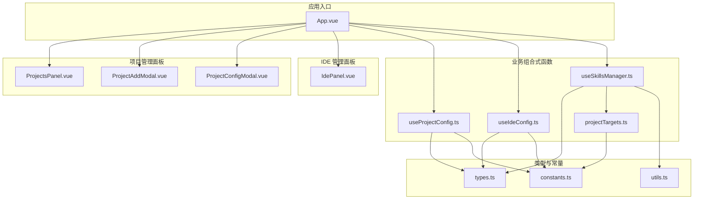
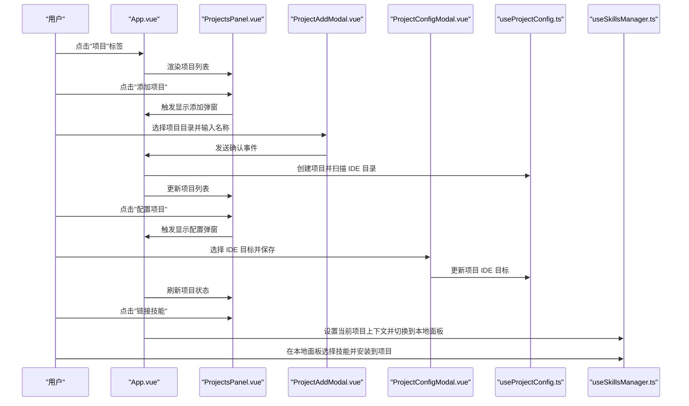
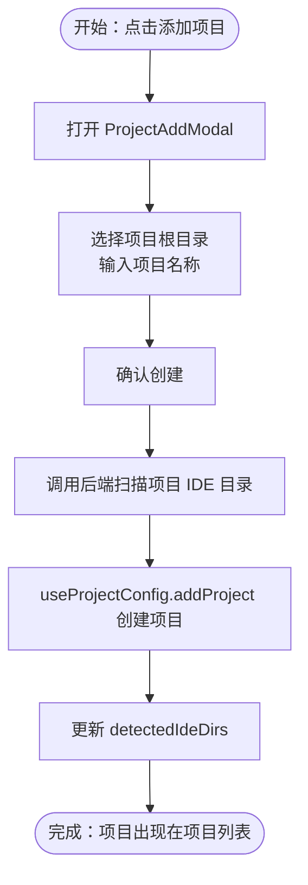
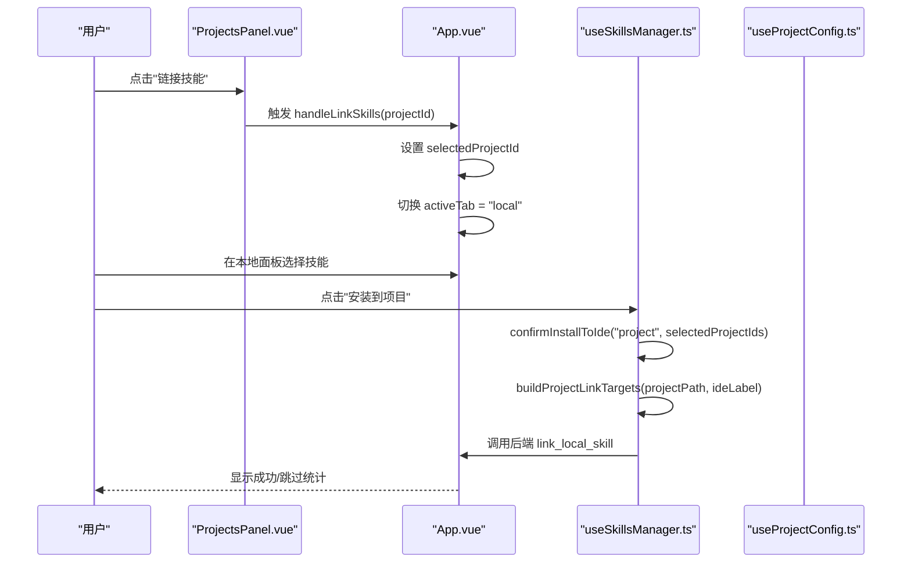
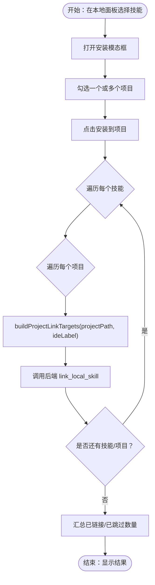
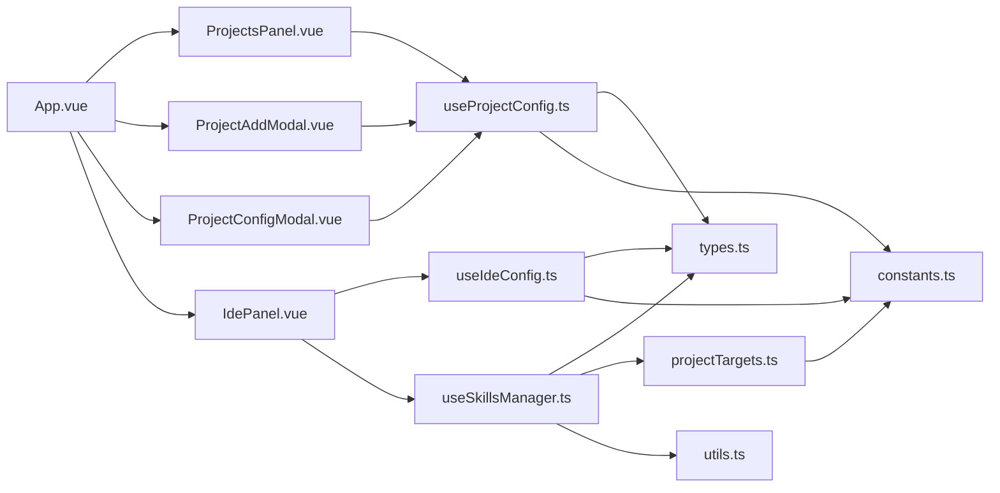

# 项目管理

<cite>
**本文档引用的文件**
- [src/App.vue](file://src/App.vue)
- [src/components/ProjectsPanel.vue](file://src/components/ProjectsPanel.vue)
- [src/components/ProjectAddModal.vue](file://src/components/ProjectAddModal.vue)
- [src/components/ProjectConfigModal.vue](file://src/components/ProjectConfigModal.vue)
- [src/components/IdePanel.vue](file://src/components/IdePanel.vue)
- [src/composables/useProjectConfig.ts](file://src/composables/useProjectConfig.ts)
- [src/composables/useIdeConfig.ts](file://src/composables/useIdeConfig.ts)
- [src/composables/useSkillsManager.ts](file://src/composables/useSkillsManager.ts)
- [src/composables/projectTargets.ts](file://src/composables/projectTargets.ts)
- [src/composables/types.ts](file://src/composables/types.ts)
- [src/composables/constants.ts](file://src/composables/constants.ts)
- [src/composables/utils.ts](file://src/composables/utils.ts)
- [README.md](file://README.md)
- [README_zh-CN.md](file://README_zh-CN.md)
</cite>

## 更新摘要
**变更内容**
- 移除了已废弃的 ProjectPanel 组件引用和相关文档描述
- 更新了项目管理功能的架构说明，反映当前的实现方式
- 修正了项目列表面板的组件结构描述
- 更新了项目间技能共享功能的技术实现细节

## 目录
1. [简介](#简介)
2. [项目结构](#项目结构)
3. [核心组件](#核心组件)
4. [架构总览](#架构总览)
5. [详细组件分析](#详细组件分析)
6. [依赖分析](#依赖分析)
7. [性能考虑](#性能考虑)
8. [故障排除指南](#故障排除指南)
9. [结论](#结论)
10. [附录](#附录)

## 简介
本指南面向项目管理功能，帮助用户完成以下任务：
- 新建项目并进行初始配置
- 为项目配置 IDE 目标（项目级技能链接）
- 在项目范围内安装技能、管理技能版本
- 在项目间共享技能链接
- 掌握最佳实践（项目结构、版本控制、团队协作）

项目管理功能位于"项目"标签页，围绕项目生命周期（创建、配置、链接技能、删除）展开，并与全局 IDE 配置、本地技能仓库、市场面板协同工作。

章节来源
- [README.md: 13-20:13-20](file://README.md#L13-L20)
- [README_zh-CN.md: 12-19:12-19](file://README_zh-CN.md#L12-L19)

## 项目结构
项目管理相关的核心文件组织如下：
- 视图层（组件）
  - 项目列表面板：ProjectsPanel
  - 项目添加与配置弹窗：ProjectAddModal、ProjectConfigModal
  - IDE 管理面板：IdePanel
- 业务组合式函数（composables）
  - 项目配置：useProjectConfig
  - IDE 配置：useIdeConfig
  - 技能管理：useSkillsManager
  - 项目链接目标构建：projectTargets
- 类型与常量
  - 类型定义：types.ts
  - 默认 IDE 选项与存储键：constants.ts
  - 工具函数：utils.ts
- 应用入口
  - App.vue 负责路由到各面板、协调项目管理流程

图表来源
- [src/App.vue: 132-202:132-202](file://src/App.vue#L132-L202)
- [src/components/ProjectsPanel.vue: 1-253:1-253](file://src/components/ProjectsPanel.vue#L1-L253)
- [src/components/ProjectAddModal.vue: 1-250:1-250](file://src/components/ProjectAddModal.vue#L1-L250)
- [src/components/ProjectConfigModal.vue: 1-248:1-248](file://src/components/ProjectConfigModal.vue#L1-L248)
- [src/components/IdePanel.vue: 1-270:1-270](file://src/components/IdePanel.vue#L1-L270)
- [src/composables/useProjectConfig.ts: 32-127:32-127](file://src/composables/useProjectConfig.ts#L32-L127)
- [src/composables/useIdeConfig.ts: 59-131:59-131](file://src/composables/useIdeConfig.ts#L59-L131)
- [src/composables/useSkillsManager.ts: 20-800:20-800](file://src/composables/useSkillsManager.ts#L20-L800)
- [src/composables/projectTargets.ts: 4-24:4-24](file://src/composables/projectTargets.ts#L4-L24)
- [src/composables/types.ts: 109-119:109-119](file://src/composables/types.ts#L109-L119)
- [src/composables/constants.ts: 24-30:24-30](file://src/composables/constants.ts#L24-L30)
- [src/composables/utils.ts: 34-99:34-99](file://src/composables/utils.ts#L34-L99)

章节来源
- [src/App.vue: 132-202:132-202](file://src/App.vue#L132-L202)
- [src/components/ProjectsPanel.vue: 1-253:1-253](file://src/components/ProjectsPanel.vue#L1-L253)
- [src/components/ProjectAddModal.vue: 1-250:1-250](file://src/components/ProjectAddModal.vue#L1-L250)
- [src/components/ProjectConfigModal.vue: 1-248:1-248](file://src/components/ProjectConfigModal.vue#L1-L248)
- [src/components/IdePanel.vue: 1-270:1-270](file://src/components/IdePanel.vue#L1-L270)
- [src/composables/useProjectConfig.ts: 32-127:32-127](file://src/composables/useProjectConfig.ts#L32-L127)
- [src/composables/useIdeConfig.ts: 59-131:59-131](file://src/composables/useIdeConfig.ts#L59-L131)
- [src/composables/useSkillsManager.ts: 20-800:20-800](file://src/composables/useSkillsManager.ts#L20-L800)
- [src/composables/projectTargets.ts: 4-24:4-24](file://src/composables/projectTargets.ts#L4-L24)
- [src/composables/types.ts: 109-119:109-119](file://src/composables/types.ts#L109-L119)
- [src/composables/constants.ts: 24-30:24-30](file://src/composables/constants.ts#L24-L30)
- [src/composables/utils.ts: 34-99:34-99](file://src/composables/utils.ts#L34-L99)

## 核心组件
- 项目列表面板（ProjectsPanel）
  - 展示项目列表、项目路径、IDE 目标数量、检测到的 IDE 目录数量
  - 支持选择、配置、打开目录、链接技能、删除项目
- 项目添加弹窗（ProjectAddModal）
  - 选择项目根目录、输入项目名称、确认创建
- 项目配置弹窗（ProjectConfigModal）
  - 为项目选择 IDE 目标（可多选），保存后写入项目配置
- IDE 管理面板（IdePanel）
  - 切换 IDE 过滤器、添加/删除自定义 IDE、批量采用/卸载技能
- 项目配置组合式函数（useProjectConfig）
  - 项目增删改查、IDE 目标更新、项目级链接目标计算
- IDE 配置组合式函数（useIdeConfig）
  - 加载/保存 IDE 选项、加载/保存上次安装目标、添加/删除自定义 IDE
- 技能管理组合式函数（useSkillsManager）
  - 构建项目级链接目标、批量安装到项目、项目级技能链接内部流程
- 项目链接目标构建（projectTargets）
  - 根据项目配置和 IDE 标签生成项目级链接目标路径

章节来源
- [src/components/ProjectsPanel.vue: 60-138:60-138](file://src/components/ProjectsPanel.vue#L60-L138)
- [src/components/ProjectAddModal.vue: 16-51:16-51](file://src/components/ProjectAddModal.vue#L16-L51)
- [src/components/ProjectConfigModal.vue: 19-44:19-44](file://src/components/ProjectConfigModal.vue#L19-L44)
- [src/components/IdePanel.vue: 83-197:83-197](file://src/components/IdePanel.vue#L83-L197)
- [src/composables/useProjectConfig.ts: 32-127:32-127](file://src/composables/useProjectConfig.ts#L32-L127)
- [src/composables/useIdeConfig.ts: 59-131:59-131](file://src/composables/useIdeConfig.ts#L59-L131)
- [src/composables/useSkillsManager.ts: 501-535:501-535](file://src/composables/useSkillsManager.ts#L501-L535)
- [src/composables/projectTargets.ts: 4-24:4-24](file://src/composables/projectTargets.ts#L4-L24)

## 架构总览
项目管理功能的交互流程由 App.vue 协调，贯穿"项目创建—配置 IDE 目标—选择技能—批量安装到项目"的主线。

图表来源
- [src/App.vue: 148-201:148-201](file://src/App.vue#L148-L201)
- [src/components/ProjectsPanel.vue: 24-50:24-50](file://src/components/ProjectsPanel.vue#L24-L50)
- [src/components/ProjectAddModal.vue: 39-51:39-51](file://src/components/ProjectAddModal.vue#L39-L51)
- [src/components/ProjectConfigModal.vue: 31-44:31-44](file://src/components/ProjectConfigModal.vue#L31-L44)
- [src/composables/useProjectConfig.ts: 47-98:47-98](file://src/composables/useProjectConfig.ts#L47-L98)
- [src/composables/useSkillsManager.ts: 414-463:414-463](file://src/composables/useSkillsManager.ts#L414-L463)

## 详细组件分析

### 项目创建与初始配置
- 创建项目
  - 通过 ProjectAddModal 弹窗选择项目根目录，输入项目名称，确认后调用 App.vue 中的处理函数
  - App.vue 调用 useProjectConfig 的 addProject 创建项目，并通过 invoke 调用后端扫描项目中的 IDE 目录，更新 detectedIdeDirs
- 初始配置
  - 通过 ProjectConfigModal 弹窗为项目选择 IDE 目标（可多选），保存后写入项目配置
  - useProjectConfig 维护项目列表、选中项目 ID、项目详情，并提供更新 IDE 目标与检测到的 IDE 目录的方法

图表来源
- [src/components/ProjectAddModal.vue: 19-51:19-51](file://src/components/ProjectAddModal.vue#L19-L51)
- [src/App.vue: 165-180:165-180](file://src/App.vue#L165-L180)
- [src/composables/useProjectConfig.ts: 47-67:47-67](file://src/composables/useProjectConfig.ts#L47-L67)

章节来源
- [src/components/ProjectAddModal.vue: 19-51:19-51](file://src/components/ProjectAddModal.vue#L19-L51)
- [src/App.vue: 165-180:165-180](file://src/App.vue#L165-L180)
- [src/components/ProjectConfigModal.vue: 31-44:31-44](file://src/components/ProjectConfigModal.vue#L31-L44)
- [src/composables/useProjectConfig.ts: 47-98:47-98](file://src/composables/useProjectConfig.ts#L47-L98)

### IDE 目标配置与项目级技能链接
- IDE 目标配置
  - 在 ProjectConfigModal 中选择 IDE 目标（例如 VSCode、Cursor 等），保存后写入项目配置
  - useIdeConfig 提供默认 IDE 选项与自定义 IDE 的增删，以及上次安装目标的持久化
- 项目级技能链接
  - 当用户点击"链接技能"时，App.vue 将当前项目上下文设为所选项目，并切换到本地面板
  - 在本地面板选择技能后，调用 useSkillsManager 的 confirmInstallToIde 并传入 installTarget = "project"，从而批量安装到项目指定的 IDE 目标
  - 内部通过 buildProjectLinkTargets 计算项目级链接目标路径，再调用后端 link_local_skill 完成安装

图表来源
- [src/components/ProjectsPanel.vue: 40-50:40-50](file://src/components/ProjectsPanel.vue#L40-L50)
- [src/App.vue: 188-201:188-201](file://src/App.vue#L188-L201)
- [src/composables/useSkillsManager.ts: 414-463:414-463](file://src/composables/useSkillsManager.ts#L414-L463)
- [src/composables/useSkillsManager.ts: 525-535:525-535](file://src/composables/useSkillsManager.ts#L525-L535)
- [src/composables/useProjectConfig.ts: 100-114:100-114](file://src/composables/useProjectConfig.ts#L100-L114)

章节来源
- [src/components/ProjectConfigModal.vue: 19-44:19-44](file://src/components/ProjectConfigModal.vue#L19-L44)
- [src/composables/useIdeConfig.ts: 59-131:59-131](file://src/composables/useIdeConfig.ts#L59-L131)
- [src/App.vue: 188-201:188-201](file://src/App.vue#L188-L201)
- [src/composables/useSkillsManager.ts: 414-463:414-463](file://src/composables/useSkillsManager.ts#L414-L463)
- [src/composables/useProjectConfig.ts: 100-114:100-114](file://src/composables/useProjectConfig.ts#L100-L114)

### 项目内技能安装与版本管理
- 项目内安装
  - 在本地面板选择技能后，打开安装模态框，选择项目目标（可多选），点击"安装到项目"
  - useSkillsManager 会遍历每个被选中的技能与项目，针对项目中的每个 IDE 目标逐个调用 linkSkillToProjectInternal，最终汇总"已链接/已跳过"数量
- 版本管理
  - 市场面板支持"下载/更新"到本地仓库，useSkillsManager 通过下载队列与后端命令实现批量下载/更新
  - 本地面板提供刷新、导入、导出、采用/卸载等能力，配合市场面板形成完整的版本与来源管理闭环

图表来源
- [src/composables/useSkillsManager.ts: 414-463:414-463](file://src/composables/useSkillsManager.ts#L414-L463)
- [src/composables/useSkillsManager.ts: 501-535:501-535](file://src/composables/useSkillsManager.ts#L501-L535)

章节来源
- [src/composables/useSkillsManager.ts: 414-463:414-463](file://src/composables/useSkillsManager.ts#L414-L463)
- [src/composables/useSkillsManager.ts: 501-535:501-535](file://src/composables/useSkillsManager.ts#L501-L535)

### 项目间技能共享
- 通过"安装到项目"功能，可将同一技能批量安装到多个项目的目标 IDE 中，实现项目间的技能共享
- 若某项目未配置 IDE 目标，将提示错误并阻止安装
- 项目链接目标构建逻辑优先使用项目检测到的 IDE 目录，如果未检测到则使用默认的 IDE 目录映射

章节来源
- [src/App.vue: 188-193:188-193](file://src/App.vue#L188-L193)
- [src/composables/useSkillsManager.ts: 414-463:414-463](file://src/composables/useSkillsManager.ts#L414-L463)
- [src/composables/projectTargets.ts: 4-24:4-24](file://src/composables/projectTargets.ts#L4-L24)

## 依赖分析
- 组件耦合
  - App.vue 作为中枢，协调 ProjectsPanel、ProjectAddModal、ProjectConfigModal、IdePanel 与 useProjectConfig/useIdeConfig/useSkillsManager
  - ProjectsPanel 依赖 useProjectConfig 的项目列表与 IDE 目标状态
  - ProjectConfigModal 依赖 useIdeConfig 的 IDE 选项与 useProjectConfig 的项目更新
  - IdePanel 依赖 useIdeConfig 的 IDE 选项与 useSkillsManager 的技能采用/卸载
- 数据流
  - 项目配置：localStorage 存储项目列表与 IDE 选项，STORAGE_KEYS 保证键名一致
  - 链接目标：ideDirMappings 与 ideOptions 共同决定项目级链接路径
  - 安全性：utils.ts 提供相对/绝对路径校验，避免危险路径

图表来源
- [src/App.vue: 132-202:132-202](file://src/App.vue#L132-L202)
- [src/components/ProjectsPanel.vue: 1-253:1-253](file://src/components/ProjectsPanel.vue#L1-L253)
- [src/components/ProjectAddModal.vue: 1-250:1-250](file://src/components/ProjectAddModal.vue#L1-L250)
- [src/components/ProjectConfigModal.vue: 1-248:1-248](file://src/components/ProjectConfigModal.vue#L1-L248)
- [src/components/IdePanel.vue: 1-270:1-270](file://src/components/IdePanel.vue#L1-L270)
- [src/composables/useProjectConfig.ts: 32-127:32-127](file://src/composables/useProjectConfig.ts#L32-L127)
- [src/composables/useIdeConfig.ts: 59-131:59-131](file://src/composables/useIdeConfig.ts#L59-L131)
- [src/composables/useSkillsManager.ts: 20-800:20-800](file://src/composables/useSkillsManager.ts#L20-L800)
- [src/composables/projectTargets.ts: 4-24:4-24](file://src/composables/projectTargets.ts#L4-L24)
- [src/composables/types.ts: 109-119:109-119](file://src/composables/types.ts#L109-L119)
- [src/composables/constants.ts: 24-30:24-30](file://src/composables/constants.ts#L24-L30)
- [src/composables/utils.ts: 34-99:34-L99)

章节来源
- [src/App.vue: 132-202:132-202](file://src/App.vue#L132-L202)
- [src/composables/useProjectConfig.ts: 32-127:32-127](file://src/composables/useProjectConfig.ts#L32-L127)
- [src/composables/useIdeConfig.ts: 59-131:59-131](file://src/composables/useIdeConfig.ts#L59-L131)
- [src/composables/useSkillsManager.ts: 20-800:20-800](file://src/composables/useSkillsManager.ts#L20-L800)
- [src/composables/projectTargets.ts: 4-24:4-24](file://src/composables/projectTargets.ts#L4-L24)
- [src/composables/types.ts: 109-119:109-119](file://src/composables/types.ts#L109-L119)
- [src/composables/constants.ts: 24-30:24-30](file://src/composables/constants.ts#L24-L30)
- [src/composables/utils.ts: 34-99:34-L99)

## 性能考虑
- 缓存与去重
  - useSkillsManager 对市场搜索结果进行缓存与去重，减少重复请求与渲染开销
- 下载队列
  - 下载队列串行处理，避免并发冲突；完成后自动清理定时器，防止内存泄漏
- 路径校验
  - 使用 isSafeRelativePath/isSafeAbsolutePath 严格校验路径，避免潜在的系统风险与性能问题

章节来源
- [src/composables/useSkillsManager.ts: 190-248:190-248](file://src/composables/useSkillsManager.ts#L190-L248)
- [src/composables/useSkillsManager.ts: 278-334:278-334](file://src/composables/useSkillsManager.ts#L278-L334)
- [src/composables/utils.ts: 34-99:34-99](file://src/composables/utils.ts#L34-L99)

## 故障排除指南
- 无法打开项目目录
  - App.vue 中通过 revealItemInDir 打开目录，若失败会捕获错误并提示
- 项目未配置 IDE 目标导致无法链接技能
  - App.vue 在 handleLinkSkills 中检查项目 ideTargets，为空则提示错误
- 自定义 IDE 路径无效
  - useIdeConfig.addCustomIde 会校验路径合法性与唯一性，不合法时通过 toast 错误提示
- 安装/卸载失败
  - useSkillsManager 在 confirmInstallToIde/confirmUninstall 中捕获异常并提示具体错误

章节来源
- [src/App.vue: 44-50:44-50](file://src/App.vue#L44-L50)
- [src/App.vue: 188-193:188-193](file://src/App.vue#L188-L193)
- [src/composables/useIdeConfig.ts: 76-104:76-104](file://src/composables/useIdeConfig.ts#L76-L104)
- [src/composables/useSkillsManager.ts: 455-457:455-457](file://src/composables/useSkillsManager.ts#L455-L457)
- [src/composables/useSkillsManager.ts: 568-624:568-624](file://src/composables/useSkillsManager.ts#L568-L624)

## 结论
项目管理功能提供了从"创建项目—配置 IDE 目标—批量安装技能—版本管理—项目间共享"的完整闭环。通过 App.vue 的统一调度与多个组合式函数的职责分离，用户可以高效地组织项目、管理技能链接，并在团队协作场景中实现技能的标准化与复用。

## 附录
- 最佳实践建议
  - 项目结构组织
    - 为每个项目明确根目录，确保 IDE 目录可被正确扫描与识别
    - 合理命名项目名称，便于在项目列表中快速定位
  - 技能版本控制
    - 优先使用市场面板的"更新"功能，保持技能版本一致性
    - 对关键技能进行导出备份，便于回滚与迁移
  - 团队协作
    - 在团队内约定项目级 IDE 目标集合，统一技能分发策略
    - 使用"安装到项目"功能批量部署，减少手工配置误差
  - 安全与稳定性
    - 自定义 IDE 路径需满足 isSafeRelativePath/isSafeAbsolutePath 校验
    - 定期清理下载队列中的失败任务，避免堆积

章节来源
- [src/composables/useIdeConfig.ts: 76-104:76-104](file://src/composables/useIdeConfig.ts#L76-L104)
- [src/composables/utils.ts: 34-99:34-99](file://src/composables/utils.ts#L34-L99)
- [src/composables/useSkillsManager.ts: 344-351:344-351](file://src/composables/useSkillsManager.ts#L344-L351)
- [src/composables/useSkillsManager.ts: 686-721:686-721](file://src/composables/useSkillsManager.ts#L686-L721)