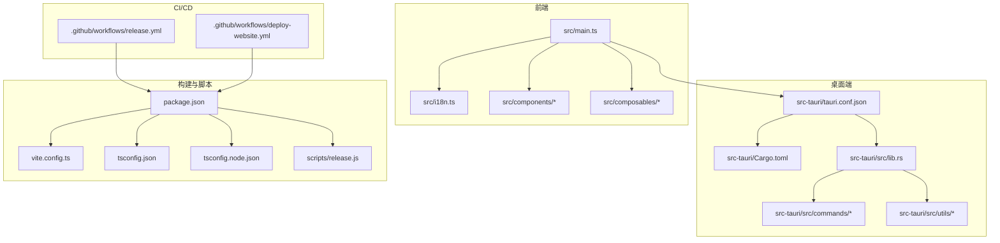
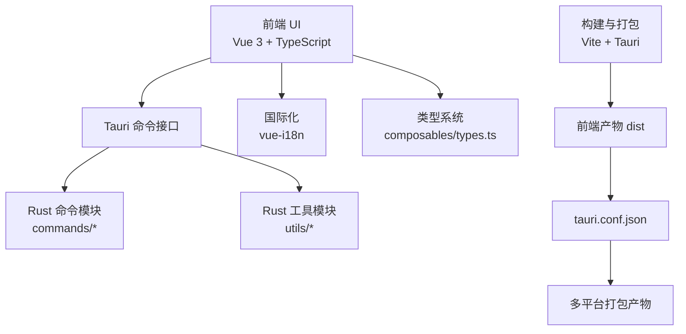
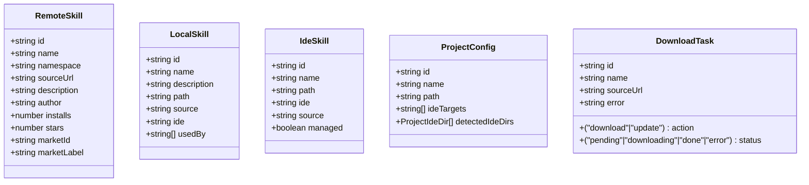
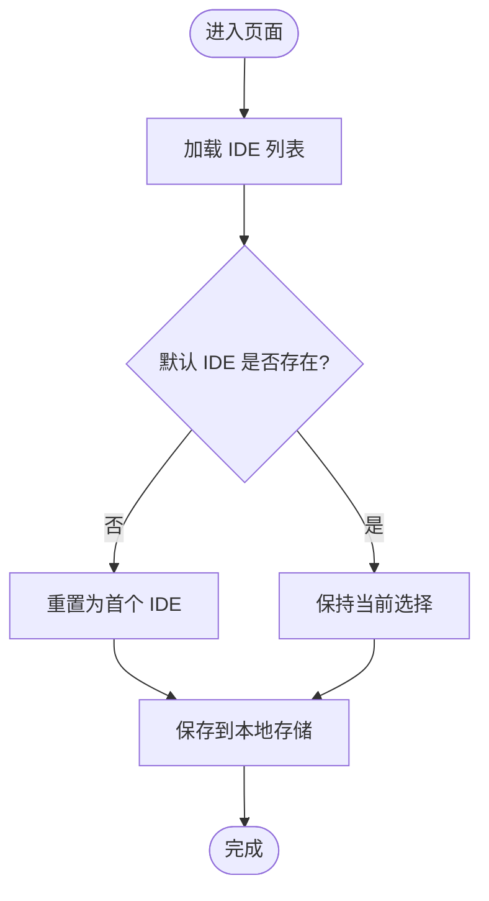
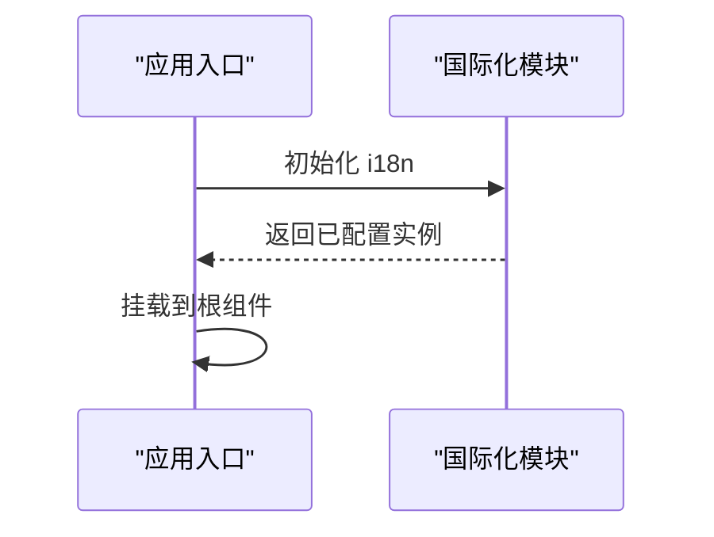
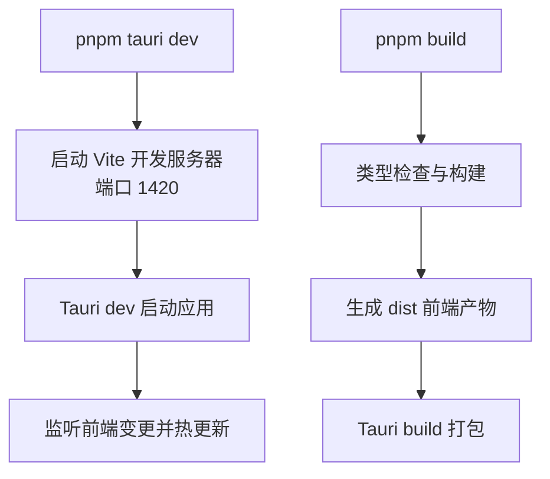
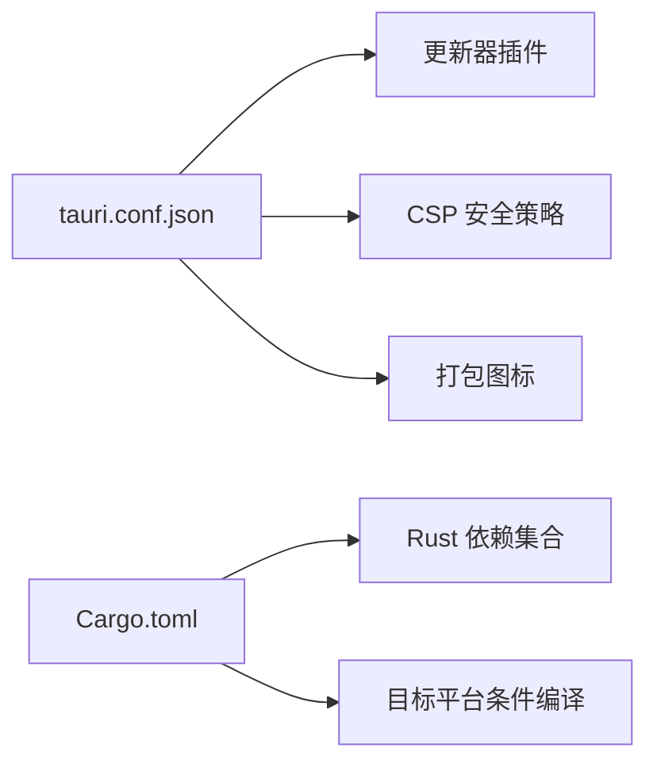
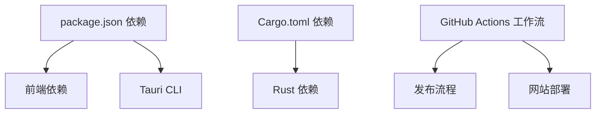

# 贡献指南

<cite>
**本文引用的文件**
- [README.md](file://README.md)
- [README_zh-CN.md](file://README_zh-CN.md)
- [.github/release-notes.md](file://.github/release-notes.md)
- [package.json](file://package.json)
- [vite.config.ts](file://vite.config.ts)
- [tsconfig.json](file://tsconfig.json)
- [tsconfig.node.json](file://tsconfig.node.json)
- [src/main.ts](file://src/main.ts)
- [src/i18n.ts](file://src/i18n.ts)
- [src/composables/types.ts](file://src/composables/types.ts)
- [src/composables/useIdeConfig.ts](file://src/composables/useIdeConfig.ts)
- [src-tauri/Cargo.toml](file://src-tauri/Cargo.toml)
- [src-tauri/tauri.conf.json](file://src-tauri/tauri.conf.json)
- [scripts/release.js](file://scripts/release.js)
- [.github/workflows/release.yml](file://.github/workflows/release.yml)
- [.github/workflows/deploy-website.yml](file://.github/workflows/deploy-website.yml)
</cite>

## 目录
1. [简介](#简介)
2. [项目结构](#项目结构)
3. [核心组件](#核心组件)
4. [架构总览](#架构总览)
5. [详细组件分析](#详细组件分析)
6. [依赖关系分析](#依赖关系分析)
7. [性能考虑](#性能考虑)
8. [故障排查指南](#故障排查指南)
9. [结论](#结论)
10. [附录](#附录)

## 简介
本指南面向希望参与 Skills Manager 项目开发与维护的贡献者，涵盖开发环境搭建、代码规范、提交流程、测试要求、Pull Request 提交与审查流程、社区行为准则、文档与翻译贡献方法、问题报告方式、项目治理与决策流程以及版本发布计划等内容。目标是帮助贡献者高效、规范地参与项目。

## 项目结构
项目采用前端与桌面端分离的双层架构：
- 前端层：Vue 3 + TypeScript + Vite，负责用户界面与交互逻辑
- 桌面端层：Tauri 2 + Rust，负责系统操作、文件管理与跨平台打包
- 网站与文档：独立的网站工程，托管在 GitHub Pages 上

图表来源
- [src/main.ts:1-7](file://src/main.ts#L1-L7)
- [src/i18n.ts:1-17](file://src/i18n.ts#L1-L17)
- [src-tauri/tauri.conf.json:1-45](file://src-tauri/tauri.conf.json#L1-L45)
- [src-tauri/Cargo.toml:1-36](file://src-tauri/Cargo.toml#L1-L36)
- [package.json:1-30](file://package.json#L1-L30)
- [vite.config.ts:1-33](file://vite.config.ts#L1-L33)
- [tsconfig.json:1-26](file://tsconfig.json#L1-L26)
- [tsconfig.node.json:1-10](file://tsconfig.node.json#L1-L10)
- [.github/workflows/release.yml:1-73](file://.github/workflows/release.yml#L1-L73)
- [.github/workflows/deploy-website.yml:1-61](file://.github/workflows/deploy-website.yml#L1-L61)

章节来源
- [README.md:67-104](file://README.md#L67-L104)
- [README_zh-CN.md:66-103](file://README_zh-CN.md#L66-L103)

## 核心组件
- 前端入口与国际化
  - 应用入口负责创建 Vue 应用、挂载样式与国际化配置
  - 国际化模块提供中英文消息映射与回退策略
- 类型系统
  - 定义远程技能、本地技能、IDE 技能、项目配置、下载任务等核心类型，确保前后端契约一致
- IDE 配置与存储
  - 提供 IDE 列表加载、过滤、自定义 IDE 注册与上次安装目标持久化
- 构建与运行配置
  - Vite 针对 Tauri 的开发服务器与热更新配置
  - TypeScript 编译选项与严格模式
- 桌面端配置
  - Tauri 应用名称、窗口尺寸、安全 CSP、插件（更新器）、打包图标与目标
  - Cargo 依赖与目标平台条件编译

章节来源
- [src/main.ts:1-7](file://src/main.ts#L1-L7)
- [src/i18n.ts:1-17](file://src/i18n.ts#L1-L17)
- [src/composables/types.ts:1-119](file://src/composables/types.ts#L1-L119)
- [src/composables/useIdeConfig.ts:49-74](file://src/composables/useIdeConfig.ts#L49-L74)
- [vite.config.ts:1-33](file://vite.config.ts#L1-L33)
- [tsconfig.json:1-26](file://tsconfig.json#L1-L26)
- [src-tauri/tauri.conf.json:1-45](file://src-tauri/tauri.conf.json#L1-L45)
- [src-tauri/Cargo.toml:1-36](file://src-tauri/Cargo.toml#L1-L36)

## 架构总览
Skills Manager 采用前端渲染 + 桌面端系统能力的混合架构。前端通过 Tauri 暴露的命令接口调用 Rust 层实现文件系统、下载、更新等能力；同时通过国际化模块支持多语言；构建阶段由 Vite 处理前端资源，Tauri 负责打包与签名。

图表来源
- [src/main.ts:1-7](file://src/main.ts#L1-L7)
- [src/i18n.ts:1-17](file://src/i18n.ts#L1-L17)
- [src/composables/types.ts:1-119](file://src/composables/types.ts#L1-L119)
- [src-tauri/tauri.conf.json:1-45](file://src-tauri/tauri.conf.json#L1-L45)
- [vite.config.ts:1-33](file://vite.config.ts#L1-L33)

## 详细组件分析

### 组件一：类型系统与数据模型
- 设计要点
  - 明确区分远程技能、本地技能、IDE 技能、项目配置与下载任务等实体
  - 通过联合类型与可选字段表达状态与错误信息
- 复杂度与性能
  - 类型定义为纯静态结构，不引入运行时开销
- 优化建议
  - 在组合式函数中使用类型守卫与解构，避免重复校验
  - 对外暴露只读类型，减少副作用

图表来源
- [src/composables/types.ts:1-119](file://src/composables/types.ts#L1-L119)

章节来源
- [src/composables/types.ts:1-119](file://src/composables/types.ts#L1-L119)

### 组件二：IDE 配置与安装目标持久化
- 功能概述
  - 加载 IDE 列表、设置默认筛选、注册自定义 IDE
  - 将最近一次安装目标保存到本地存储，提升用户体验
- 错误处理
  - 当 IDE 列表为空或默认值不在列表中时，回退到第一个选项
- 性能影响
  - 本地存储读写为 O(1)，对性能影响可忽略

图表来源
- [src/composables/useIdeConfig.ts:49-74](file://src/composables/useIdeConfig.ts#L49-L74)

章节来源
- [src/composables/useIdeConfig.ts:49-74](file://src/composables/useIdeConfig.ts#L49-L74)

### 组件三：国际化与多语言支持
- 设计要点
  - 支持中英文，回退策略为中文
  - 通过 i18n 模块集中管理消息
- 集成点
  - 应用入口初始化并注入 i18n

图表来源
- [src/main.ts:1-7](file://src/main.ts#L1-L7)
- [src/i18n.ts:1-17](file://src/i18n.ts#L1-L17)

章节来源
- [src/main.ts:1-7](file://src/main.ts#L1-L7)
- [src/i18n.ts:1-17](file://src/i18n.ts#L1-L17)

### 组件四：构建与开发配置
- Vite 针对 Tauri 的开发服务器固定端口与热更新配置
- TypeScript 严格模式与模块解析策略
- 作用域隔离与类型检查

图表来源
- [vite.config.ts:1-33](file://vite.config.ts#L1-L33)
- [tsconfig.json:1-26](file://tsconfig.json#L1-L26)
- [package.json:1-30](file://package.json#L1-L30)

章节来源
- [vite.config.ts:1-33](file://vite.config.ts#L1-L33)
- [tsconfig.json:1-26](file://tsconfig.json#L1-L26)
- [package.json:1-30](file://package.json#L1-L30)

### 组件五：桌面端配置与打包
- Tauri 配置
  - 应用名称、窗口尺寸、CSP 安全策略
  - 更新器插件与公钥验证
  - 打包图标与目标平台
- Cargo 依赖
  - Tauri、对话框、打开器、进程、更新器、序列化、网络请求、压缩、路径遍历、目录等

图表来源
- [src-tauri/tauri.conf.json:1-45](file://src-tauri/tauri.conf.json#L1-L45)
- [src-tauri/Cargo.toml:1-36](file://src-tauri/Cargo.toml#L1-L36)

章节来源
- [src-tauri/tauri.conf.json:1-45](file://src-tauri/tauri.conf.json#L1-L45)
- [src-tauri/Cargo.toml:1-36](file://src-tauri/Cargo.toml#L1-L36)

## 依赖关系分析
- 前后端耦合
  - 前端通过 Tauri 命令与 Rust 层交互，类型系统保证参数与返回值一致性
- 外部依赖
  - 前端：Vue 3、TypeScript、Vite、Tauri 插件
  - 桌面端：Tauri、序列化、HTTP 请求、压缩、路径遍历、目录、进程、更新器
- CI/CD 依赖
  - GitHub Actions、pnpm、Node.js、标准版本化工具

图表来源
- [package.json:1-30](file://package.json#L1-L30)
- [src-tauri/Cargo.toml:1-36](file://src-tauri/Cargo.toml#L1-L36)
- [.github/workflows/release.yml:1-73](file://.github/workflows/release.yml#L1-L73)
- [.github/workflows/deploy-website.yml:1-61](file://.github/workflows/deploy-website.yml#L1-L61)

章节来源
- [package.json:1-30](file://package.json#L1-L30)
- [src-tauri/Cargo.toml:1-36](file://src-tauri/Cargo.toml#L1-L36)
- [.github/workflows/release.yml:1-73](file://.github/workflows/release.yml#L1-L73)
- [.github/workflows/deploy-website.yml:1-61](file://.github/workflows/deploy-website.yml#L1-L61)

## 性能考虑
- 前端
  - 严格 TypeScript 检查与模块解析策略有助于早期发现潜在性能问题
  - Vite 固定端口与 HMR 配置减少开发时的资源浪费
- 桌面端
  - 使用静态库与动态库组合，平衡加载速度与功能覆盖
  - 条件编译针对非移动端平台启用更新器等插件
- 构建与打包
  - 多平台打包与更新器产物生成需在具备签名环境变量的条件下进行，避免重复构建

## 故障排查指南
- 开发环境相关
  - macOS 安全警告：首次运行可能触发系统拦截，可通过命令行清除隔离属性
  - 开发服务器端口冲突：确认端口 1420 可用或调整 Vite 配置
- 发布与更新
  - 缺少签名密钥：更新器产物生成需要设置私钥环境变量
  - 缺少 GitHub CLI：发布资产上传依赖 gh 命令行工具
  - 版本同步：发布脚本会同步 package.json、tauri.conf.json、Cargo.toml 与 Cargo.lock 的版本号
- 网站部署
  - 网站工程独立构建并部署到 GitHub Pages，确保分支与路径匹配

章节来源
- [.github/release-notes.md:1-30](file://.github/release-notes.md#L1-L30)
- [vite.config.ts:1-33](file://vite.config.ts#L1-L33)
- [scripts/release.js:66-70](file://scripts/release.js#L66-L70)
- [scripts/release.js:234-240](file://scripts/release.js#L234-L240)
- [scripts/release.js:43-64](file://scripts/release.js#L43-L64)
- [.github/workflows/deploy-website.yml:1-61](file://.github/workflows/deploy-website.yml#L1-L61)

## 结论
本指南提供了从开发环境到发布流程的完整贡献路径。建议贡献者遵循代码规范与提交流程，关注类型安全与性能优化，并在提交 PR 前完成必要的测试与文档更新。通过 CI/CD 流水线与发布脚本，项目实现了自动化版本管理与多平台打包。

## 附录

### 开发环境搭建
- 前端
  - Node.js（建议 LTS）、pnpm、Vite、Vue 3、TypeScript
- 桌面端
  - Rust（rustup）、Xcode Command Line Tools（macOS）
- 运行与构建
  - 开发：pnpm tauri dev
  - 构建：pnpm tauri build

章节来源
- [README.md:67-87](file://README.md#L67-L87)
- [README_zh-CN.md:66-86](file://README_zh-CN.md#L66-L86)

### 代码规范
- TypeScript
  - 严格模式、未使用变量与参数检查、switch 无遗漏分支
- 前端
  - Vue 单文件组件组织、组合式函数命名与职责单一
- 桌面端
  - Rust 依赖最小化、条件编译与平台适配

章节来源
- [tsconfig.json:17-22](file://tsconfig.json#L17-L22)
- [src-tauri/Cargo.toml:20-36](file://src-tauri/Cargo.toml#L20-L36)

### 提交流程与测试要求
- 提交前
  - 本地构建与预览：pnpm build、pnpm preview
  - 本地运行：pnpm tauri dev
- 测试建议
  - 前端：单元测试与端到端测试（如有）
  - 桌面端：文件系统操作、下载与更新流程验证
- 提交规范
  - 使用标准版本化工具生成变更日志与标签

章节来源
- [package.json:6-11](file://package.json#L6-L11)
- [.github/workflows/release.yml:51-72](file://.github/workflows/release.yml#L51-L72)

### Pull Request 提交指南与代码审查流程
- PR 要求
  - 包含变更摘要、影响范围说明与测试结果
  - 通过 CI 检查与本地验证
- 代码审查
  - 至少一名维护者审查，关注类型安全、性能与可维护性
  - 修改需满足项目风格与最佳实践

### 社区行为准则
- 尊重与包容：营造开放友好的讨论氛围
- 建设性反馈：聚焦问题与改进方案
- 遵守法律与开源协议

### 文档贡献与翻译支持
- 文档位置
  - README 与 README_zh-CN 提供使用与开发说明
  - 网站工程位于 website/，通过 GitHub Actions 自动部署
- 翻译流程
  - 在对应语言的 README 中更新说明与截图路径
  - 确保网站工程中的文案与链接正确

章节来源
- [README.md:1-104](file://README.md#L1-L104)
- [README_zh-CN.md:1-103](file://README_zh-CN.md#L1-L103)
- [.github/workflows/deploy-website.yml:1-61](file://.github/workflows/deploy-website.yml#L1-L61)

### 问题报告方法
- 使用 GitHub Issues
  - 提供操作系统、版本、复现步骤与预期/实际结果
  - 标注类型（Bug/Feature/Docs/Question）与优先级

### 项目治理与决策流程
- 决策流程
  - 重大变更通过 Issue 讨论与 PR 审查
  - 维护者拥有最终决定权
- 版本发布计划
  - 使用标准版本化工具与工作流自动同步版本
  - 发布脚本生成更新器清单并上传资产

章节来源
- [.github/workflows/release.yml:1-73](file://.github/workflows/release.yml#L1-L73)
- [scripts/release.js:43-64](file://scripts/release.js#L43-L64)
- [scripts/release.js:199-232](file://scripts/release.js#L199-L232)